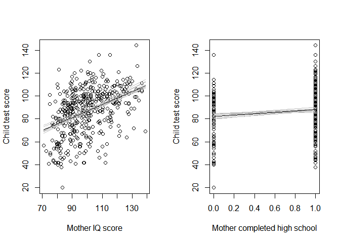

#11.2 Plotting the data and fitted model

```r
kidiq <- here("..", "KidIQ", "data", "kidiq.csv")
kidiq <- read.csv(kidiq)
kidiq
```

```
##     kid_score mom_hs    mom_iq mom_work mom_age
## 1          65      1 121.11753        4      27
## 2          98      1  89.36188        4      25
## 3          85      1 115.44316        4      27
## 4          83      1  99.44964        3      25
## 5         115      1  92.74571        4      27
## 6          98      0 107.90184        1      18
## 7          69      1 138.89311        4      20
## 8         106      1 125.14512        3      23
## 9         102      1  81.61953        1      24
## 10         95      1  95.07307        1      19
## 11         91      1  88.57700        1      23
## 12         58      1  94.85971        4      24
## 13         84      1  88.96280        4      27
## 14         78      1 114.11430        4      26
## 15        102      0 100.53407        2      24
## 16        110      1 120.41915        1      26
## 17        102      1 114.42688        3      23
## 18         99      1 111.59236        3      26
## 19        105      1 133.84923        4      20
## 20        101      0  97.26480        3      17
## 21        102      1 110.09681        4      21
## 22        115      1 126.72399        2      26
## 23        100      1  97.91159        2      20
## 24         87      1  99.92573        4      23
## 25         99      0  97.59501        4      19
## 26         96      1 121.74801        4      27
## 27         72      1  98.74808        3      21
## 28         78      1  97.91525        4      22
## 29         77      1  80.35856        2      24
## 30         98      1 114.30786        2      22
## 31         69      1 109.13832        1      27
## 32        130      1 101.81718        2      23
## 33        109      1 117.96510        3      27
## 34        106      0 108.63350        2      22
## 35         92      1  96.52862        3      27
## 36        100      1  92.87138        4      22
## 37        107      1  95.89813        4      27
## 38         86      1 107.01546        4      25
## 39         90      1  87.19701        1      22
## 40        110      1  89.36188        4      25
## 41        107      1 102.53099        2      21
## 42        113      1 130.16686        3      24
## 43         65      1  83.41410        3      22
## 44        102      1 125.75347        1      24
## 45        103      0  85.81038        4      27
## 46        111      1 126.52007        4      28
## 47         42      1  79.20305        4      21
## 48        100      1 113.16591        1      23
## 49         67      1 110.33139        1      26
## 50         92      1  99.40922        4      28
## 51        100      1 102.42553        2      24
## 52        110      1 124.90044        3      27
## 53         56      1  94.85971        4      24
## 54        107      1  92.36856        3      29
## 55         97      1 101.81718        1      23
## 56         56      0  79.83353        1      21
## 57         95      1  96.22614        2      21
## 58         78      0  82.35547        4      21
## 59         76      0  76.57565        1      24
## 60         86      1 110.01348        1      23
## 61         79      1 111.59236        4      26
## 62         81      1 113.65741        4      17
## 63         79      0 101.16456        4      24
## 64         79      1 101.34109        4      25
## 65         56      1 101.69816        2      22
## 66         52      1  98.81915        2      25
## 67         63      1  93.49820        2      20
## 68         80      1  87.29389        4      24
## 69         87      1  87.31603        4      23
## 70         88      1  86.20946        2      25
## 71         92      1  89.83797        4      23
## 72        100      0 121.87001        1      20
## 73         94      0 127.54438        4      20
## 74        117      1 109.99134        4      24
## 75        102      1  90.44631        4      24
## 76        107      1  88.89490        4      26
## 77         99      1 113.04689        4      22
## 78         73      0  78.01315        4      25
## 79         56      1  95.38965        1      20
## 80         78      0  83.61644        2      21
## 81         94      0  86.24628        2      19
## 82        110      1  95.38965        4      20
## 83        109      1 111.25231        4      24
## 84         86      1 127.01444        1      24
## 85         92      1  89.95195        2      28
## 86         91      1  99.27310        2      24
## 87        123      1  81.16558        1      25
## 88        102      1 110.52129        3      20
## 89        105      1 136.49385        4      23
## 90        114      1 123.86201        1      24
## 91         96      1 134.60239        1      23
## 92         66      1  91.09894        3      23
## 93        104      1 103.26937        2      19
## 94        108      1 126.28707        3      22
## 95         84      1 127.54438        4      20
## 96         83      0  92.47389        4      28
## 97         83      1  84.79409        4      23
## 98         92      0 100.53407        2      24
## 99        109      0 108.00301        4      22
## 100        95      0  78.80714        1      26
## 101        93      1 121.11753        4      27
## 102       114      1 103.05601        2      24
## 103       106      1 100.43719        2      22
## 104        87      1  88.55486        2      24
## 105        65      1  85.30556        4      22
## 106        95      1 119.44862        3      24
## 107        61      1  90.55178        2      21
## 108        73      1  96.33404        4      19
## 109       112      1 127.64492        4      24
## 110       113      1 119.85656        4      27
## 111        49      0 112.01892        1      28
## 112       105      1  92.51431        4      25
## 113       122      1  96.02380        4      22
## 114        96      1  91.41684        4      26
## 115        97      1 103.07815        2      23
## 116        94      1 100.24363        3      26
## 117       117      1  89.81583        4      24
## 118       136      1 115.05736        4      23
## 119        85      0  96.65062        4      20
## 120       116      1 105.57795        4      24
## 121       106      1  97.72169        4      26
## 122        99      1 131.83577        4      27
## 123        94      1 101.81718        1      23
## 124        89      1  93.49820        4      20
## 125       119      1 104.02654        4      26
## 126       112      1 103.70863        4      23
## 127       104      0 107.36886        2      20
## 128        92      1  92.55113        2      19
## 129        86      1  94.44258        2      19
## 130        69      1  93.14479        4      25
## 131        45      1  83.41410        4      22
## 132        57      1  71.03741        2      28
## 133        94      1 127.66706        1      23
## 134       104      1 115.68785        4      23
## 135        89      0  90.97626        1      20
## 136       144      1 132.86534        3      25
## 137        52      1  72.50230        1      26
## 138       102      1 100.71061        4      25
## 139       106      1 132.68880        3      24
## 140        98      1  98.54574        2      22
## 141        97      1 115.66571        3      24
## 142        94      1 117.06280        3      28
## 143       111      1 136.49385        3      23
## 144       100      1 106.54848        2      26
## 145       105      1 134.12631        2      25
## 146        90      1 104.65702        4      26
## 147        98      1  99.37856        2      21
## 148       121      1 100.43719        1      22
## 149       106      1  89.52539        4      26
## 150       121      1 120.92295        4      19
## 151       102      1 113.14377        4      24
## 152        64      1 126.41475        1      29
## 153        99      1 122.73716        4      28
## 154        81      1 115.37527        4      26
## 155        69      1  91.60674        2      20
## 156        84      1  88.66032        2      21
## 157       104      1 107.17896        3      26
## 158       104      1 104.96960        4      23
## 159       107      1 103.86303        4      25
## 160        88      1 110.09681        4      21
## 161        67      0  88.45432        1      20
## 162       103      0 117.03214        1      21
## 163        94      1 125.65659        4      22
## 164       109      1 122.60104        4      24
## 165        94      1 121.04963        3      26
## 166        98      1  93.14479        3      25
## 167       102      1  99.37856        3      21
## 168       104      1 123.89281        4      29
## 169       114      0 113.04323        2      20
## 170        87      1 115.77117        3      21
## 171       102      1 114.93835        4      22
## 172        77      1  93.62088        4      23
## 173       109      1 121.74801        1      27
## 174        94      1  90.34944        4      22
## 175        93      0  83.41044        2      20
## 176        86      1  99.48646        4      19
## 177        97      1 113.91038        4      28
## 178        97      1  97.59501        4      19
## 179        88      1  89.81583        4      24
## 180       103      1 119.58474        4      28
## 181        87      0  97.38165        2      24
## 182        87      1  84.87741        4      21
## 183        90      1 102.32865        4      22
## 184        65      1  99.27310        4      24
## 185       111      0  99.07505        4      18
## 186       109      1  96.92770        3      25
## 187        87      1 108.31325        2      19
## 188        58      1 100.53407        4      24
## 189        87      1  99.48646        4      19
## 190       113      1 113.98761        3      19
## 191        64      0  92.77020        4      18
## 192        78      0  88.02984        4      21
## 193        97      0 106.11156        4      22
## 194        95      0 103.23255        3      25
## 195        75      1  99.29524        4      23
## 196        91      0 106.74204        3      22
## 197        99      1  99.17256        2      20
## 198       108      1 102.44766        1      23
## 199        95      1  92.86771        4      20
## 200       100      1 116.82614        4      20
## 201        85      1  85.42457        1      23
## 202        97      0 115.56517        2      20
## 203       108      1 113.17456        4      29
## 204        90      1 106.86106        1      23
## 205       100      1  95.83024        3      26
## 206        82      0  77.10925        1      22
## 207        94      1  89.29081        2      21
## 208        95      1 112.41274        4      20
## 209       119      1 110.64397        1      23
## 210        98      1 109.53740        1      25
## 211       100      0 107.90184        1      18
## 212       112      1 104.96960        2      23
## 213       136      0 107.68277        2      19
## 214       122      1 109.46632        2      21
## 215       126      1 133.53264        1      19
## 216       116      1 128.80901        2      22
## 217        98      1 101.27002        4      21
## 218        94      1  87.31603        4      23
## 219        93      1 118.09077        4      22
## 220        90      1 120.25564        2      25
## 221        70      1  90.34577        4      20
## 222       110      1  79.90461        4      25
## 223       104      1 136.57717        4      21
## 224        83      1 102.42553        2      24
## 225        99      1 132.68880        4      24
## 226        81      1  96.29722        3      25
## 227       104      1 118.20979        4      23
## 228       109      1 118.09077        4      22
## 229       113      1 101.50460        2      26
## 230        95      0  94.33468        2      21
## 231        74      1  84.67141        1      20
## 232        81      1  86.76887        2      21
## 233        89      1 129.24593        4      26
## 234        93      1 127.78104        4      28
## 235       102      1 106.86106        2      23
## 236        95      1 105.75449        1      25
## 237        85      1 117.03214        4      21
## 238        97      1 119.35174        2      22
## 239        92      1 102.76557        1      26
## 240        78      0 108.20535        3      21
## 241       104      1 126.41475        4      29
## 242       120      1 101.90050        2      21
## 243        83      0  99.15626        2      17
## 244       105      1  91.81275        1      21
## 245        68      1  84.14147        4      24
## 246       104      1  84.35483        4      19
## 247        80      1  79.11972        2      23
## 248       120      1  91.41684        4      26
## 249        94      1  90.44631        2      24
## 250        81      1  79.00071        4      22
## 251       101      1 109.26398        4      22
## 252        61      1  76.75218        4      25
## 253        68      1  97.59501        4      19
## 254       110      1 128.80901        4      22
## 255        89      0 113.65741        1      17
## 256        98      0 114.20669        2      18
## 257       113      1 112.51328        4      24
## 258        50      0  75.33682        1      23
## 259        57      0  81.52265        2      22
## 260        86      1 102.63889        4      19
## 261        83      1 101.18669        1      23
## 262       106      1 112.22284        4      26
## 263       106      0 123.40806        3      25
## 264       104      1  86.56653        3      22
## 265        78      1 100.11695        2      19
## 266        99      1 102.32865        3      22
## 267        91      1  87.94651        1      23
## 268        40      0  80.25801        1      20
## 269        42      0  80.25801        1      20
## 270        69      1  91.07680        4      24
## 271        84      1  85.57897        4      25
## 272        58      1 113.16591        4      23
## 273        42      1 112.05934        2      25
## 274        72      1 101.27002        3      21
## 275        80      0  81.83289        1      19
## 276        58      0  81.09450        3      21
## 277        52      1  81.32908        4      26
## 278       101      1 120.60905        3      20
## 279        63      1 102.44766        4      23
## 280        73      1  90.97626        2      20
## 281        68      1 103.70863        4      23
## 282        60      1 102.32865        4      22
## 283        69      1 121.87001        4      20
## 284        73      0  88.66032        1      21
## 285        75      0  90.02919        1      19
## 286        20      0  83.53312        2      23
## 287        56      1  91.92064        2      19
## 288        49      1  87.19335        1      20
## 289        71      0  80.46402        4      21
## 290        46      0  84.31800        1      25
## 291        54      0  77.73974        3      22
## 292        54      0  82.27215        1      23
## 293        44      1  77.38267        4      25
## 294        74      1  89.71529        3      20
## 295        58      0  79.90461        2      25
## 296        46      1  82.15313        4      22
## 297        76      0  80.26168        2      22
## 298        43      0  77.38267        4      25
## 299        60      0  82.78362        4      22
## 300        58      1  89.20748        4      23
## 301        89      1  89.08847        4      22
## 302        43      0  88.98729        2      18
## 303        94      1 118.92359        1      21
## 304        88      1  83.85102        4      26
## 305        79      1  84.04459        4      22
## 306        87      1 105.05293        4      21
## 307        46      1 107.99935        4      20
## 308        95      1  97.38165        4      24
## 309        92      1 103.79196        4      21
## 310        42      0  97.59501        4      19
## 311        62      1  88.66032        2      21
## 312        52      1 107.24686        2      27
## 313       101      1  89.83797        2      23
## 314        97      1 108.90691        4      25
## 315        85      1 100.63953        3      21
## 316        98      1 118.84027        1      23
## 317        94      1  95.51233        2      23
## 318        90      1  84.77195        2      24
## 319        72      1 100.74743        1      19
## 320        92      1  87.00345        1      26
## 321        75      0  77.85876        4      23
## 322        83      1  85.30189        4      20
## 323        64      1  92.77020        1      18
## 324       101      1  74.86073        4      25
## 325        82      1 115.24858        4      19
## 326        77      1 107.37253        4      22
## 327       101      1 102.20298        4      27
## 328        50      1  97.91159        4      20
## 329        90      1  96.85662        4      21
## 330       103      1 111.46567        2      19
## 331        96      1 109.46632        3      21
## 332        50      1  82.25001        4      24
## 333        47      1  92.77020        4      18
## 334        73      1 115.56883        2      22
## 335        62      0  84.04459        4      22
## 336        77      1 116.19932        4      22
## 337        64      1  99.29524        4      23
## 338        52      1  87.19335        2      20
## 339        61      1  76.71177        4      28
## 340        86      1  80.69860        2      26
## 341        41      0  82.46337        1      19
## 342        83      1  85.17989        4      27
## 343        64      1  93.07371        4      21
## 344        83      1  88.57700        4      23
## 345       116      1 103.05601        4      24
## 346       100      0  86.87677        3      19
## 347        42      0  97.91525        4      22
## 348        74      1 120.92295        4      19
## 349        76      1  91.72942        4      23
## 350        92      1  87.50725        4      19
## 351        98      1  90.44631        4      24
## 352        96      1  84.16360        3      23
## 353        67      1  96.65428        4      22
## 354        84      1  95.70355        2      19
## 355       111      1  88.76822        4      19
## 356        41      0  92.13972        1      18
## 357        68      1 108.00301        3      22
## 358       107      1  80.38935        3      29
## 359        82      0  99.80304        4      20
## 360        89      1  90.02919        4      19
## 361        83      1  93.93878        4      26
## 362        73      1 103.70863        4      23
## 363        74      1  77.10925        4      22
## 364        94      1 117.55716        2      24
## 365        58      1  79.83353        2      21
## 366        76      1  83.61644        2      21
## 367        61      1  88.73140        4      25
## 368        38      1  82.78362        4      22
## 369       100      1  86.87677        4      19
## 370        84      1  88.73140        4      25
## 371        99      1  92.24089        4      22
## 372        86      1  90.55178        1      21
## 373        94      1  84.14147        4      24
## 374        90      1  93.07371        2      21
## 375        50      0  85.83487        2      18
## 376       112      1  98.85598        4      19
## 377        58      1  95.51233        2      23
## 378        87      1 101.06768        2      22
## 379        76      1  85.93238        1      20
## 380        68      1  82.78362        2      22
## 381       110      1  98.66476        2      23
## 382        88      0  82.14947        3      20
## 383        87      0  85.61580        1      19
## 384        54      0  79.43763        1      26
## 385        49      0  75.33682        1      23
## 386        56      1  80.89216        2      22
## 387        79      1 115.77117        3      21
## 388        82      1  97.15910        4      27
## 389        80      0  80.89216        1      22
## 390        60      1  79.50553        4      27
## 391       102      1  98.01213        4      24
## 392        87      1 108.86650        4      28
## 393        42      0  80.69860        4      26
## 394       119      1 100.74743        4      19
## 395        84      1  91.09894        4      23
## 396        86      1  82.98596        1      21
## 397       113      1  89.71529        4      20
## 398        72      1 131.01071        4      19
## 399       104      1 124.51463        4      23
## 400        94      1  91.61041        4      22
## 401        78      0  92.99039        1      23
## 402        80      0  91.88382        1      25
## 403        67      0  88.69098        1      28
## 404       104      1 126.09351        3      26
## 405        96      0  84.98531        3      19
## 406        65      0  82.98596        1      21
## 407        64      1 101.79504        3      24
## 408        95      1 100.24363        2      26
## 409        56      1 110.01348        4      23
## 410        75      0  88.57700        2      23
## 411        91      1 106.74204        3      22
## 412       106      1  95.29214        2      18
## 413        76      1 108.31325        1      19
## 414        90      1 110.33139        3      26
## 415       108      1 116.82980        4      22
## 416        86      0  86.68554        1      23
## 417        85      1  96.85662        2      21
## 418       104      0  90.24826        1      18
## 419        87      1  89.29081        4      21
## 420        41      0  74.23025        1      25
## 421       106      0  91.88382        4      25
## 422        76      0  96.46072        3      26
## 423       100      0  97.40379        4      23
## 424        89      1 131.53329        4      21
## 425        42      1  78.24456        2      27
## 426       102      1 127.67572        4      29
## 427       104      1 124.51463        4      23
## 428        59      0  80.46402        4      21
## 429        93      0  74.86073        2      25
## 430        94      0  84.87741        4      21
## 431        76      1  92.99039        4      23
## 432        50      0  94.85971        2      24
## 433        88      1  96.85662        2      21
## 434        70      1  91.25334        2      25
```

```r
#plot model with 1 predictor
fit_2 <- brm(kid_score ~ mom_iq, data=kidiq)
```

```
## Compiling Stan program...
```

```
## Start sampling
```

```
## 
## SAMPLING FOR MODEL '631ef10f1b6d0066aafaf617a36e68fe' NOW (CHAIN 1).
## Chain 1: 
## Chain 1: Gradient evaluation took 0 seconds
## Chain 1: 1000 transitions using 10 leapfrog steps per transition would take 0 seconds.
## Chain 1: Adjust your expectations accordingly!
## Chain 1: 
## Chain 1: 
## Chain 1: Iteration:    1 / 2000 [  0%]  (Warmup)
## Chain 1: Iteration:  200 / 2000 [ 10%]  (Warmup)
## Chain 1: Iteration:  400 / 2000 [ 20%]  (Warmup)
## Chain 1: Iteration:  600 / 2000 [ 30%]  (Warmup)
## Chain 1: Iteration:  800 / 2000 [ 40%]  (Warmup)
## Chain 1: Iteration: 1000 / 2000 [ 50%]  (Warmup)
## Chain 1: Iteration: 1001 / 2000 [ 50%]  (Sampling)
## Chain 1: Iteration: 1200 / 2000 [ 60%]  (Sampling)
## Chain 1: Iteration: 1400 / 2000 [ 70%]  (Sampling)
## Chain 1: Iteration: 1600 / 2000 [ 80%]  (Sampling)
## Chain 1: Iteration: 1800 / 2000 [ 90%]  (Sampling)
## Chain 1: Iteration: 2000 / 2000 [100%]  (Sampling)
## Chain 1: 
## Chain 1:  Elapsed Time: 0.047 seconds (Warm-up)
## Chain 1:                0.033 seconds (Sampling)
## Chain 1:                0.08 seconds (Total)
## Chain 1: 
## 
## SAMPLING FOR MODEL '631ef10f1b6d0066aafaf617a36e68fe' NOW (CHAIN 2).
## Chain 2: 
## Chain 2: Gradient evaluation took 0 seconds
## Chain 2: 1000 transitions using 10 leapfrog steps per transition would take 0 seconds.
## Chain 2: Adjust your expectations accordingly!
## Chain 2: 
## Chain 2: 
## Chain 2: Iteration:    1 / 2000 [  0%]  (Warmup)
## Chain 2: Iteration:  200 / 2000 [ 10%]  (Warmup)
## Chain 2: Iteration:  400 / 2000 [ 20%]  (Warmup)
## Chain 2: Iteration:  600 / 2000 [ 30%]  (Warmup)
## Chain 2: Iteration:  800 / 2000 [ 40%]  (Warmup)
## Chain 2: Iteration: 1000 / 2000 [ 50%]  (Warmup)
## Chain 2: Iteration: 1001 / 2000 [ 50%]  (Sampling)
## Chain 2: Iteration: 1200 / 2000 [ 60%]  (Sampling)
## Chain 2: Iteration: 1400 / 2000 [ 70%]  (Sampling)
## Chain 2: Iteration: 1600 / 2000 [ 80%]  (Sampling)
## Chain 2: Iteration: 1800 / 2000 [ 90%]  (Sampling)
## Chain 2: Iteration: 2000 / 2000 [100%]  (Sampling)
## Chain 2: 
## Chain 2:  Elapsed Time: 0.052 seconds (Warm-up)
## Chain 2:                0.045 seconds (Sampling)
## Chain 2:                0.097 seconds (Total)
## Chain 2: 
## 
## SAMPLING FOR MODEL '631ef10f1b6d0066aafaf617a36e68fe' NOW (CHAIN 3).
## Chain 3: 
## Chain 3: Gradient evaluation took 0 seconds
## Chain 3: 1000 transitions using 10 leapfrog steps per transition would take 0 seconds.
## Chain 3: Adjust your expectations accordingly!
## Chain 3: 
## Chain 3: 
## Chain 3: Iteration:    1 / 2000 [  0%]  (Warmup)
## Chain 3: Iteration:  200 / 2000 [ 10%]  (Warmup)
## Chain 3: Iteration:  400 / 2000 [ 20%]  (Warmup)
## Chain 3: Iteration:  600 / 2000 [ 30%]  (Warmup)
## Chain 3: Iteration:  800 / 2000 [ 40%]  (Warmup)
## Chain 3: Iteration: 1000 / 2000 [ 50%]  (Warmup)
## Chain 3: Iteration: 1001 / 2000 [ 50%]  (Sampling)
## Chain 3: Iteration: 1200 / 2000 [ 60%]  (Sampling)
## Chain 3: Iteration: 1400 / 2000 [ 70%]  (Sampling)
## Chain 3: Iteration: 1600 / 2000 [ 80%]  (Sampling)
## Chain 3: Iteration: 1800 / 2000 [ 90%]  (Sampling)
## Chain 3: Iteration: 2000 / 2000 [100%]  (Sampling)
## Chain 3: 
## Chain 3:  Elapsed Time: 0.048 seconds (Warm-up)
## Chain 3:                0.035 seconds (Sampling)
## Chain 3:                0.083 seconds (Total)
## Chain 3: 
## 
## SAMPLING FOR MODEL '631ef10f1b6d0066aafaf617a36e68fe' NOW (CHAIN 4).
## Chain 4: 
## Chain 4: Gradient evaluation took 0 seconds
## Chain 4: 1000 transitions using 10 leapfrog steps per transition would take 0 seconds.
## Chain 4: Adjust your expectations accordingly!
## Chain 4: 
## Chain 4: 
## Chain 4: Iteration:    1 / 2000 [  0%]  (Warmup)
## Chain 4: Iteration:  200 / 2000 [ 10%]  (Warmup)
## Chain 4: Iteration:  400 / 2000 [ 20%]  (Warmup)
## Chain 4: Iteration:  600 / 2000 [ 30%]  (Warmup)
## Chain 4: Iteration:  800 / 2000 [ 40%]  (Warmup)
## Chain 4: Iteration: 1000 / 2000 [ 50%]  (Warmup)
## Chain 4: Iteration: 1001 / 2000 [ 50%]  (Sampling)
## Chain 4: Iteration: 1200 / 2000 [ 60%]  (Sampling)
## Chain 4: Iteration: 1400 / 2000 [ 70%]  (Sampling)
## Chain 4: Iteration: 1600 / 2000 [ 80%]  (Sampling)
## Chain 4: Iteration: 1800 / 2000 [ 90%]  (Sampling)
## Chain 4: Iteration: 2000 / 2000 [100%]  (Sampling)
## Chain 4: 
## Chain 4:  Elapsed Time: 0.045 seconds (Warm-up)
## Chain 4:                0.028 seconds (Sampling)
## Chain 4:                0.073 seconds (Total)
## Chain 4:
```

```r
plot(kidiq$mom_iq, kidiq$kid_score, xlab="Mother IQ score", ylab="Child test score")
abline(a = fixef(fit_2)[1,1], b = fixef(fit_2)[2,1])
```

<!-- -->

```r
#plot model with 2 predictors
fit_3 <- brm(kid_score ~ mom_hs + mom_iq, data=kidiq)
```

```
## Compiling Stan program...
```

```
## recompiling to avoid crashing R session
```

```
## Start sampling
```

```
## 
## SAMPLING FOR MODEL '631ef10f1b6d0066aafaf617a36e68fe' NOW (CHAIN 1).
## Chain 1: 
## Chain 1: Gradient evaluation took 0 seconds
## Chain 1: 1000 transitions using 10 leapfrog steps per transition would take 0 seconds.
## Chain 1: Adjust your expectations accordingly!
## Chain 1: 
## Chain 1: 
## Chain 1: Iteration:    1 / 2000 [  0%]  (Warmup)
## Chain 1: Iteration:  200 / 2000 [ 10%]  (Warmup)
## Chain 1: Iteration:  400 / 2000 [ 20%]  (Warmup)
## Chain 1: Iteration:  600 / 2000 [ 30%]  (Warmup)
## Chain 1: Iteration:  800 / 2000 [ 40%]  (Warmup)
## Chain 1: Iteration: 1000 / 2000 [ 50%]  (Warmup)
## Chain 1: Iteration: 1001 / 2000 [ 50%]  (Sampling)
## Chain 1: Iteration: 1200 / 2000 [ 60%]  (Sampling)
## Chain 1: Iteration: 1400 / 2000 [ 70%]  (Sampling)
## Chain 1: Iteration: 1600 / 2000 [ 80%]  (Sampling)
## Chain 1: Iteration: 1800 / 2000 [ 90%]  (Sampling)
## Chain 1: Iteration: 2000 / 2000 [100%]  (Sampling)
## Chain 1: 
## Chain 1:  Elapsed Time: 0.077 seconds (Warm-up)
## Chain 1:                0.049 seconds (Sampling)
## Chain 1:                0.126 seconds (Total)
## Chain 1: 
## 
## SAMPLING FOR MODEL '631ef10f1b6d0066aafaf617a36e68fe' NOW (CHAIN 2).
## Chain 2: 
## Chain 2: Gradient evaluation took 0 seconds
## Chain 2: 1000 transitions using 10 leapfrog steps per transition would take 0 seconds.
## Chain 2: Adjust your expectations accordingly!
## Chain 2: 
## Chain 2: 
## Chain 2: Iteration:    1 / 2000 [  0%]  (Warmup)
## Chain 2: Iteration:  200 / 2000 [ 10%]  (Warmup)
## Chain 2: Iteration:  400 / 2000 [ 20%]  (Warmup)
## Chain 2: Iteration:  600 / 2000 [ 30%]  (Warmup)
## Chain 2: Iteration:  800 / 2000 [ 40%]  (Warmup)
## Chain 2: Iteration: 1000 / 2000 [ 50%]  (Warmup)
## Chain 2: Iteration: 1001 / 2000 [ 50%]  (Sampling)
## Chain 2: Iteration: 1200 / 2000 [ 60%]  (Sampling)
## Chain 2: Iteration: 1400 / 2000 [ 70%]  (Sampling)
## Chain 2: Iteration: 1600 / 2000 [ 80%]  (Sampling)
## Chain 2: Iteration: 1800 / 2000 [ 90%]  (Sampling)
## Chain 2: Iteration: 2000 / 2000 [100%]  (Sampling)
## Chain 2: 
## Chain 2:  Elapsed Time: 0.086 seconds (Warm-up)
## Chain 2:                0.052 seconds (Sampling)
## Chain 2:                0.138 seconds (Total)
## Chain 2: 
## 
## SAMPLING FOR MODEL '631ef10f1b6d0066aafaf617a36e68fe' NOW (CHAIN 3).
## Chain 3: 
## Chain 3: Gradient evaluation took 0 seconds
## Chain 3: 1000 transitions using 10 leapfrog steps per transition would take 0 seconds.
## Chain 3: Adjust your expectations accordingly!
## Chain 3: 
## Chain 3: 
## Chain 3: Iteration:    1 / 2000 [  0%]  (Warmup)
## Chain 3: Iteration:  200 / 2000 [ 10%]  (Warmup)
## Chain 3: Iteration:  400 / 2000 [ 20%]  (Warmup)
## Chain 3: Iteration:  600 / 2000 [ 30%]  (Warmup)
## Chain 3: Iteration:  800 / 2000 [ 40%]  (Warmup)
## Chain 3: Iteration: 1000 / 2000 [ 50%]  (Warmup)
## Chain 3: Iteration: 1001 / 2000 [ 50%]  (Sampling)
## Chain 3: Iteration: 1200 / 2000 [ 60%]  (Sampling)
## Chain 3: Iteration: 1400 / 2000 [ 70%]  (Sampling)
## Chain 3: Iteration: 1600 / 2000 [ 80%]  (Sampling)
## Chain 3: Iteration: 1800 / 2000 [ 90%]  (Sampling)
## Chain 3: Iteration: 2000 / 2000 [100%]  (Sampling)
## Chain 3: 
## Chain 3:  Elapsed Time: 0.093 seconds (Warm-up)
## Chain 3:                0.04 seconds (Sampling)
## Chain 3:                0.133 seconds (Total)
## Chain 3: 
## 
## SAMPLING FOR MODEL '631ef10f1b6d0066aafaf617a36e68fe' NOW (CHAIN 4).
## Chain 4: 
## Chain 4: Gradient evaluation took 0 seconds
## Chain 4: 1000 transitions using 10 leapfrog steps per transition would take 0 seconds.
## Chain 4: Adjust your expectations accordingly!
## Chain 4: 
## Chain 4: 
## Chain 4: Iteration:    1 / 2000 [  0%]  (Warmup)
## Chain 4: Iteration:  200 / 2000 [ 10%]  (Warmup)
## Chain 4: Iteration:  400 / 2000 [ 20%]  (Warmup)
## Chain 4: Iteration:  600 / 2000 [ 30%]  (Warmup)
## Chain 4: Iteration:  800 / 2000 [ 40%]  (Warmup)
## Chain 4: Iteration: 1000 / 2000 [ 50%]  (Warmup)
## Chain 4: Iteration: 1001 / 2000 [ 50%]  (Sampling)
## Chain 4: Iteration: 1200 / 2000 [ 60%]  (Sampling)
## Chain 4: Iteration: 1400 / 2000 [ 70%]  (Sampling)
## Chain 4: Iteration: 1600 / 2000 [ 80%]  (Sampling)
## Chain 4: Iteration: 1800 / 2000 [ 90%]  (Sampling)
## Chain 4: Iteration: 2000 / 2000 [100%]  (Sampling)
## Chain 4: 
## Chain 4:  Elapsed Time: 0.066 seconds (Warm-up)
## Chain 4:                0.054 seconds (Sampling)
## Chain 4:                0.12 seconds (Total)
## Chain 4:
```

```r
colors <- ifelse(kidiq$mom_hs==1, "black", "gray")
plot(kidiq$mom_iq, kidiq$kid_score,
xlab="Mother IQ score", ylab="Child test score", col=colors, pch=20)
b_hat <- fixef(fit_3)
abline(b_hat[1,1] + b_hat[2,1], b_hat[3,1], col="black")
abline(b_hat[1,1], b_hat[3,1], col="gray")
```

<!-- -->

```r
#plot model with 2 predictors and interaction
fit_4 <- brm(kid_score ~ mom_hs + mom_iq + mom_hs:mom_iq, data=kidiq)
```

```
## Compiling Stan program...
```

```
## recompiling to avoid crashing R session
```

```
## Start sampling
```

```
## 
## SAMPLING FOR MODEL '631ef10f1b6d0066aafaf617a36e68fe' NOW (CHAIN 1).
## Chain 1: 
## Chain 1: Gradient evaluation took 0 seconds
## Chain 1: 1000 transitions using 10 leapfrog steps per transition would take 0 seconds.
## Chain 1: Adjust your expectations accordingly!
## Chain 1: 
## Chain 1: 
## Chain 1: Iteration:    1 / 2000 [  0%]  (Warmup)
## Chain 1: Iteration:  200 / 2000 [ 10%]  (Warmup)
## Chain 1: Iteration:  400 / 2000 [ 20%]  (Warmup)
## Chain 1: Iteration:  600 / 2000 [ 30%]  (Warmup)
## Chain 1: Iteration:  800 / 2000 [ 40%]  (Warmup)
## Chain 1: Iteration: 1000 / 2000 [ 50%]  (Warmup)
## Chain 1: Iteration: 1001 / 2000 [ 50%]  (Sampling)
## Chain 1: Iteration: 1200 / 2000 [ 60%]  (Sampling)
## Chain 1: Iteration: 1400 / 2000 [ 70%]  (Sampling)
## Chain 1: Iteration: 1600 / 2000 [ 80%]  (Sampling)
## Chain 1: Iteration: 1800 / 2000 [ 90%]  (Sampling)
## Chain 1: Iteration: 2000 / 2000 [100%]  (Sampling)
## Chain 1: 
## Chain 1:  Elapsed Time: 0.412 seconds (Warm-up)
## Chain 1:                0.472 seconds (Sampling)
## Chain 1:                0.884 seconds (Total)
## Chain 1: 
## 
## SAMPLING FOR MODEL '631ef10f1b6d0066aafaf617a36e68fe' NOW (CHAIN 2).
## Chain 2: 
## Chain 2: Gradient evaluation took 0 seconds
## Chain 2: 1000 transitions using 10 leapfrog steps per transition would take 0 seconds.
## Chain 2: Adjust your expectations accordingly!
## Chain 2: 
## Chain 2: 
## Chain 2: Iteration:    1 / 2000 [  0%]  (Warmup)
## Chain 2: Iteration:  200 / 2000 [ 10%]  (Warmup)
## Chain 2: Iteration:  400 / 2000 [ 20%]  (Warmup)
## Chain 2: Iteration:  600 / 2000 [ 30%]  (Warmup)
## Chain 2: Iteration:  800 / 2000 [ 40%]  (Warmup)
## Chain 2: Iteration: 1000 / 2000 [ 50%]  (Warmup)
## Chain 2: Iteration: 1001 / 2000 [ 50%]  (Sampling)
## Chain 2: Iteration: 1200 / 2000 [ 60%]  (Sampling)
## Chain 2: Iteration: 1400 / 2000 [ 70%]  (Sampling)
## Chain 2: Iteration: 1600 / 2000 [ 80%]  (Sampling)
## Chain 2: Iteration: 1800 / 2000 [ 90%]  (Sampling)
## Chain 2: Iteration: 2000 / 2000 [100%]  (Sampling)
## Chain 2: 
## Chain 2:  Elapsed Time: 0.516 seconds (Warm-up)
## Chain 2:                0.502 seconds (Sampling)
## Chain 2:                1.018 seconds (Total)
## Chain 2: 
## 
## SAMPLING FOR MODEL '631ef10f1b6d0066aafaf617a36e68fe' NOW (CHAIN 3).
## Chain 3: 
## Chain 3: Gradient evaluation took 0 seconds
## Chain 3: 1000 transitions using 10 leapfrog steps per transition would take 0 seconds.
## Chain 3: Adjust your expectations accordingly!
## Chain 3: 
## Chain 3: 
## Chain 3: Iteration:    1 / 2000 [  0%]  (Warmup)
## Chain 3: Iteration:  200 / 2000 [ 10%]  (Warmup)
## Chain 3: Iteration:  400 / 2000 [ 20%]  (Warmup)
## Chain 3: Iteration:  600 / 2000 [ 30%]  (Warmup)
## Chain 3: Iteration:  800 / 2000 [ 40%]  (Warmup)
## Chain 3: Iteration: 1000 / 2000 [ 50%]  (Warmup)
## Chain 3: Iteration: 1001 / 2000 [ 50%]  (Sampling)
## Chain 3: Iteration: 1200 / 2000 [ 60%]  (Sampling)
## Chain 3: Iteration: 1400 / 2000 [ 70%]  (Sampling)
## Chain 3: Iteration: 1600 / 2000 [ 80%]  (Sampling)
## Chain 3: Iteration: 1800 / 2000 [ 90%]  (Sampling)
## Chain 3: Iteration: 2000 / 2000 [100%]  (Sampling)
## Chain 3: 
## Chain 3:  Elapsed Time: 0.73 seconds (Warm-up)
## Chain 3:                0.47 seconds (Sampling)
## Chain 3:                1.2 seconds (Total)
## Chain 3: 
## 
## SAMPLING FOR MODEL '631ef10f1b6d0066aafaf617a36e68fe' NOW (CHAIN 4).
## Chain 4: 
## Chain 4: Gradient evaluation took 0 seconds
## Chain 4: 1000 transitions using 10 leapfrog steps per transition would take 0 seconds.
## Chain 4: Adjust your expectations accordingly!
## Chain 4: 
## Chain 4: 
## Chain 4: Iteration:    1 / 2000 [  0%]  (Warmup)
## Chain 4: Iteration:  200 / 2000 [ 10%]  (Warmup)
## Chain 4: Iteration:  400 / 2000 [ 20%]  (Warmup)
## Chain 4: Iteration:  600 / 2000 [ 30%]  (Warmup)
## Chain 4: Iteration:  800 / 2000 [ 40%]  (Warmup)
## Chain 4: Iteration: 1000 / 2000 [ 50%]  (Warmup)
## Chain 4: Iteration: 1001 / 2000 [ 50%]  (Sampling)
## Chain 4: Iteration: 1200 / 2000 [ 60%]  (Sampling)
## Chain 4: Iteration: 1400 / 2000 [ 70%]  (Sampling)
## Chain 4: Iteration: 1600 / 2000 [ 80%]  (Sampling)
## Chain 4: Iteration: 1800 / 2000 [ 90%]  (Sampling)
## Chain 4: Iteration: 2000 / 2000 [100%]  (Sampling)
## Chain 4: 
## Chain 4:  Elapsed Time: 0.589 seconds (Warm-up)
## Chain 4:                0.482 seconds (Sampling)
## Chain 4:                1.071 seconds (Total)
## Chain 4:
```

```r
colors <- ifelse(kidiq$mom_hs==1, "black", "gray")
plot(kidiq$mom_iq, kidiq$kid_score,
     xlab="Mother IQ score", ylab="Child test score", col=colors, pch=20)
b_hat <- fixef(fit_4)
abline(b_hat[1,1] + b_hat[2,1], b_hat[3,1] + b_hat[4,1], col="black")
abline(b_hat[1,1], b_hat[3,1], col="gray")
```

<!-- -->

```r
#plot model with uncertainty in the fitted regression
sims_2 <- as.matrix(fit_2)
n_sims_2 <- nrow(sims_2)
beta_hat_2 <- apply(sims_2, 2, median)
plot(kidiq$mom_iq, kidiq$kid_score, xlab="Mother IQ score", ylab="Child test score")
sims_display <- sample(n_sims_2, 10)
for (i in sims_display){
  abline(sims_2[i,1], sims_2[i,2], col="gray")
}
abline(a = fixef(fit_2)[1,1], b = fixef(fit_2)[2,1], col = "black")
```

<!-- -->

```r
#plot model for each input variable
sims_3 <- as.matrix(fit_3)
n_sims_3 <- nrow(sims_3)
par(mfrow=c(1,2))
plot(kidiq$mom_iq, kidiq$kid_score, xlab="Mother IQ score", ylab="Child test score")
mom_hs_bar <- mean(kidiq$mom_hs)
sims_display <- sample(n_sims_3, 10)
for (i in sims_display){
  curve(cbind(1, mom_hs_bar, x) %*% sims_3[i,1:3], lwd=0.5, col="gray", add=TRUE)
}
curve(cbind(1, mom_hs_bar, x) %*% fixef(fit_3)[1:3,1], col="black", add=TRUE)
plot(kidiq$mom_hs, kidiq$kid_score, xlab="Mother completed high school",
     ylab="Child test score")
mom_iq_bar <- mean(kidiq$mom_iq)
for (i in sims_display){
  curve(cbind(1, x, mom_iq_bar) %*% sims_3[i,1:3], lwd=0.5, col="gray", add=TRUE)
}
curve(cbind(1, x, mom_iq_bar) %*% fixef(fit_3)[1:3,1], col="black", add=TRUE)
```

<!-- -->

```r
#plot the outcome vs. a continuous predictor
N <- 100
x <- runif(N, 0, 1)
z <- sample(c(0, 1), N, replace=TRUE)
a <- 1
b <- 2
theta <- 5
sigma <- 2
y <- a + b*x + theta*z + rnorm(N, 0, sigma)
fake <- data.frame(x=x, y=y, z=z)

fit <- brm(y ~ x + z, data=fake)
```

```
## Compiling Stan program...
## Start sampling
```

```
## 
## SAMPLING FOR MODEL '79ed8da48f3e63b36a3411757b5b865a' NOW (CHAIN 1).
## Chain 1: 
## Chain 1: Gradient evaluation took 0 seconds
## Chain 1: 1000 transitions using 10 leapfrog steps per transition would take 0 seconds.
## Chain 1: Adjust your expectations accordingly!
## Chain 1: 
## Chain 1: 
## Chain 1: Iteration:    1 / 2000 [  0%]  (Warmup)
## Chain 1: Iteration:  200 / 2000 [ 10%]  (Warmup)
## Chain 1: Iteration:  400 / 2000 [ 20%]  (Warmup)
## Chain 1: Iteration:  600 / 2000 [ 30%]  (Warmup)
## Chain 1: Iteration:  800 / 2000 [ 40%]  (Warmup)
## Chain 1: Iteration: 1000 / 2000 [ 50%]  (Warmup)
## Chain 1: Iteration: 1001 / 2000 [ 50%]  (Sampling)
## Chain 1: Iteration: 1200 / 2000 [ 60%]  (Sampling)
## Chain 1: Iteration: 1400 / 2000 [ 70%]  (Sampling)
## Chain 1: Iteration: 1600 / 2000 [ 80%]  (Sampling)
## Chain 1: Iteration: 1800 / 2000 [ 90%]  (Sampling)
## Chain 1: Iteration: 2000 / 2000 [100%]  (Sampling)
## Chain 1: 
## Chain 1:  Elapsed Time: 0.044 seconds (Warm-up)
## Chain 1:                0.051 seconds (Sampling)
## Chain 1:                0.095 seconds (Total)
## Chain 1: 
## 
## SAMPLING FOR MODEL '79ed8da48f3e63b36a3411757b5b865a' NOW (CHAIN 2).
## Chain 2: 
## Chain 2: Gradient evaluation took 0 seconds
## Chain 2: 1000 transitions using 10 leapfrog steps per transition would take 0 seconds.
## Chain 2: Adjust your expectations accordingly!
## Chain 2: 
## Chain 2: 
## Chain 2: Iteration:    1 / 2000 [  0%]  (Warmup)
## Chain 2: Iteration:  200 / 2000 [ 10%]  (Warmup)
## Chain 2: Iteration:  400 / 2000 [ 20%]  (Warmup)
## Chain 2: Iteration:  600 / 2000 [ 30%]  (Warmup)
## Chain 2: Iteration:  800 / 2000 [ 40%]  (Warmup)
## Chain 2: Iteration: 1000 / 2000 [ 50%]  (Warmup)
## Chain 2: Iteration: 1001 / 2000 [ 50%]  (Sampling)
## Chain 2: Iteration: 1200 / 2000 [ 60%]  (Sampling)
## Chain 2: Iteration: 1400 / 2000 [ 70%]  (Sampling)
## Chain 2: Iteration: 1600 / 2000 [ 80%]  (Sampling)
## Chain 2: Iteration: 1800 / 2000 [ 90%]  (Sampling)
## Chain 2: Iteration: 2000 / 2000 [100%]  (Sampling)
## Chain 2: 
## Chain 2:  Elapsed Time: 0.041 seconds (Warm-up)
## Chain 2:                0.038 seconds (Sampling)
## Chain 2:                0.079 seconds (Total)
## Chain 2: 
## 
## SAMPLING FOR MODEL '79ed8da48f3e63b36a3411757b5b865a' NOW (CHAIN 3).
## Chain 3: 
## Chain 3: Gradient evaluation took 0 seconds
## Chain 3: 1000 transitions using 10 leapfrog steps per transition would take 0 seconds.
## Chain 3: Adjust your expectations accordingly!
## Chain 3: 
## Chain 3: 
## Chain 3: Iteration:    1 / 2000 [  0%]  (Warmup)
## Chain 3: Iteration:  200 / 2000 [ 10%]  (Warmup)
## Chain 3: Iteration:  400 / 2000 [ 20%]  (Warmup)
## Chain 3: Iteration:  600 / 2000 [ 30%]  (Warmup)
## Chain 3: Iteration:  800 / 2000 [ 40%]  (Warmup)
## Chain 3: Iteration: 1000 / 2000 [ 50%]  (Warmup)
## Chain 3: Iteration: 1001 / 2000 [ 50%]  (Sampling)
## Chain 3: Iteration: 1200 / 2000 [ 60%]  (Sampling)
## Chain 3: Iteration: 1400 / 2000 [ 70%]  (Sampling)
## Chain 3: Iteration: 1600 / 2000 [ 80%]  (Sampling)
## Chain 3: Iteration: 1800 / 2000 [ 90%]  (Sampling)
## Chain 3: Iteration: 2000 / 2000 [100%]  (Sampling)
## Chain 3: 
## Chain 3:  Elapsed Time: 0.037 seconds (Warm-up)
## Chain 3:                0.034 seconds (Sampling)
## Chain 3:                0.071 seconds (Total)
## Chain 3: 
## 
## SAMPLING FOR MODEL '79ed8da48f3e63b36a3411757b5b865a' NOW (CHAIN 4).
## Chain 4: 
## Chain 4: Gradient evaluation took 0 seconds
## Chain 4: 1000 transitions using 10 leapfrog steps per transition would take 0 seconds.
## Chain 4: Adjust your expectations accordingly!
## Chain 4: 
## Chain 4: 
## Chain 4: Iteration:    1 / 2000 [  0%]  (Warmup)
## Chain 4: Iteration:  200 / 2000 [ 10%]  (Warmup)
## Chain 4: Iteration:  400 / 2000 [ 20%]  (Warmup)
## Chain 4: Iteration:  600 / 2000 [ 30%]  (Warmup)
## Chain 4: Iteration:  800 / 2000 [ 40%]  (Warmup)
## Chain 4: Iteration: 1000 / 2000 [ 50%]  (Warmup)
## Chain 4: Iteration: 1001 / 2000 [ 50%]  (Sampling)
## Chain 4: Iteration: 1200 / 2000 [ 60%]  (Sampling)
## Chain 4: Iteration: 1400 / 2000 [ 70%]  (Sampling)
## Chain 4: Iteration: 1600 / 2000 [ 80%]  (Sampling)
## Chain 4: Iteration: 1800 / 2000 [ 90%]  (Sampling)
## Chain 4: Iteration: 2000 / 2000 [100%]  (Sampling)
## Chain 4: 
## Chain 4:  Elapsed Time: 0.038 seconds (Warm-up)
## Chain 4:                0.032 seconds (Sampling)
## Chain 4:                0.07 seconds (Total)
## Chain 4:
```

```r
par(mfrow=c(1,2))
for (i in 0:1){
  plot(range(x), range(y), type="n", main=paste("z =", i))
  points(x[z==i], y[z==i], pch=20+i)
  abline(fixef(fit)[,1]["Intercept"] + fixef(fit)[,1]["z"]*i, fixef(fit)[,1]["x"])
}
```

<!-- -->

```r
#forming a linear predictor from a multiple regression
N <- 100
K <- 10
X <- array(runif(N*K, 0, 1), c(N, K))
z <- sample(c(0, 1), N, replace=TRUE)
a <- 1
b <- 1:K
theta <- 5
sigma <- 2
y <- a + X %*% b + theta*z + rnorm(N, 0, sigma)
fake <- data.frame(X=X, y=y, z=z)
#fit <- brm(y ~ X[,1] + z, data=fake)
fit <- stan_glm(y ~ X + z, data=fake)
```

```
## 
## SAMPLING FOR MODEL 'continuous' NOW (CHAIN 1).
## Chain 1: 
## Chain 1: Gradient evaluation took 0 seconds
## Chain 1: 1000 transitions using 10 leapfrog steps per transition would take 0 seconds.
## Chain 1: Adjust your expectations accordingly!
## Chain 1: 
## Chain 1: 
## Chain 1: Iteration:    1 / 2000 [  0%]  (Warmup)
## Chain 1: Iteration:  200 / 2000 [ 10%]  (Warmup)
## Chain 1: Iteration:  400 / 2000 [ 20%]  (Warmup)
## Chain 1: Iteration:  600 / 2000 [ 30%]  (Warmup)
## Chain 1: Iteration:  800 / 2000 [ 40%]  (Warmup)
## Chain 1: Iteration: 1000 / 2000 [ 50%]  (Warmup)
## Chain 1: Iteration: 1001 / 2000 [ 50%]  (Sampling)
## Chain 1: Iteration: 1200 / 2000 [ 60%]  (Sampling)
## Chain 1: Iteration: 1400 / 2000 [ 70%]  (Sampling)
## Chain 1: Iteration: 1600 / 2000 [ 80%]  (Sampling)
## Chain 1: Iteration: 1800 / 2000 [ 90%]  (Sampling)
## Chain 1: Iteration: 2000 / 2000 [100%]  (Sampling)
## Chain 1: 
## Chain 1:  Elapsed Time: 0.135 seconds (Warm-up)
## Chain 1:                0.105 seconds (Sampling)
## Chain 1:                0.24 seconds (Total)
## Chain 1: 
## 
## SAMPLING FOR MODEL 'continuous' NOW (CHAIN 2).
## Chain 2: 
## Chain 2: Gradient evaluation took 0 seconds
## Chain 2: 1000 transitions using 10 leapfrog steps per transition would take 0 seconds.
## Chain 2: Adjust your expectations accordingly!
## Chain 2: 
## Chain 2: 
## Chain 2: Iteration:    1 / 2000 [  0%]  (Warmup)
## Chain 2: Iteration:  200 / 2000 [ 10%]  (Warmup)
## Chain 2: Iteration:  400 / 2000 [ 20%]  (Warmup)
## Chain 2: Iteration:  600 / 2000 [ 30%]  (Warmup)
## Chain 2: Iteration:  800 / 2000 [ 40%]  (Warmup)
## Chain 2: Iteration: 1000 / 2000 [ 50%]  (Warmup)
## Chain 2: Iteration: 1001 / 2000 [ 50%]  (Sampling)
## Chain 2: Iteration: 1200 / 2000 [ 60%]  (Sampling)
## Chain 2: Iteration: 1400 / 2000 [ 70%]  (Sampling)
## Chain 2: Iteration: 1600 / 2000 [ 80%]  (Sampling)
## Chain 2: Iteration: 1800 / 2000 [ 90%]  (Sampling)
## Chain 2: Iteration: 2000 / 2000 [100%]  (Sampling)
## Chain 2: 
## Chain 2:  Elapsed Time: 0.124 seconds (Warm-up)
## Chain 2:                0.142 seconds (Sampling)
## Chain 2:                0.266 seconds (Total)
## Chain 2: 
## 
## SAMPLING FOR MODEL 'continuous' NOW (CHAIN 3).
## Chain 3: 
## Chain 3: Gradient evaluation took 0 seconds
## Chain 3: 1000 transitions using 10 leapfrog steps per transition would take 0 seconds.
## Chain 3: Adjust your expectations accordingly!
## Chain 3: 
## Chain 3: 
## Chain 3: Iteration:    1 / 2000 [  0%]  (Warmup)
## Chain 3: Iteration:  200 / 2000 [ 10%]  (Warmup)
## Chain 3: Iteration:  400 / 2000 [ 20%]  (Warmup)
## Chain 3: Iteration:  600 / 2000 [ 30%]  (Warmup)
## Chain 3: Iteration:  800 / 2000 [ 40%]  (Warmup)
## Chain 3: Iteration: 1000 / 2000 [ 50%]  (Warmup)
## Chain 3: Iteration: 1001 / 2000 [ 50%]  (Sampling)
## Chain 3: Iteration: 1200 / 2000 [ 60%]  (Sampling)
## Chain 3: Iteration: 1400 / 2000 [ 70%]  (Sampling)
## Chain 3: Iteration: 1600 / 2000 [ 80%]  (Sampling)
## Chain 3: Iteration: 1800 / 2000 [ 90%]  (Sampling)
## Chain 3: Iteration: 2000 / 2000 [100%]  (Sampling)
## Chain 3: 
## Chain 3:  Elapsed Time: 0.284 seconds (Warm-up)
## Chain 3:                0.201 seconds (Sampling)
## Chain 3:                0.485 seconds (Total)
## Chain 3: 
## 
## SAMPLING FOR MODEL 'continuous' NOW (CHAIN 4).
## Chain 4: 
## Chain 4: Gradient evaluation took 0 seconds
## Chain 4: 1000 transitions using 10 leapfrog steps per transition would take 0 seconds.
## Chain 4: Adjust your expectations accordingly!
## Chain 4: 
## Chain 4: 
## Chain 4: Iteration:    1 / 2000 [  0%]  (Warmup)
## Chain 4: Iteration:  200 / 2000 [ 10%]  (Warmup)
## Chain 4: Iteration:  400 / 2000 [ 20%]  (Warmup)
## Chain 4: Iteration:  600 / 2000 [ 30%]  (Warmup)
## Chain 4: Iteration:  800 / 2000 [ 40%]  (Warmup)
## Chain 4: Iteration: 1000 / 2000 [ 50%]  (Warmup)
## Chain 4: Iteration: 1001 / 2000 [ 50%]  (Sampling)
## Chain 4: Iteration: 1200 / 2000 [ 60%]  (Sampling)
## Chain 4: Iteration: 1400 / 2000 [ 70%]  (Sampling)
## Chain 4: Iteration: 1600 / 2000 [ 80%]  (Sampling)
## Chain 4: Iteration: 1800 / 2000 [ 90%]  (Sampling)
## Chain 4: Iteration: 2000 / 2000 [100%]  (Sampling)
## Chain 4: 
## Chain 4:  Elapsed Time: 0.142 seconds (Warm-up)
## Chain 4:                0.113 seconds (Sampling)
## Chain 4:                0.255 seconds (Total)
## Chain 4:
```

```r
y_hat <- predict(fit)
par(mfrow=c(1,2))
for (i in 0:1){
  plot(range(y_hat,y), range(y_hat,y), type="n", main=paste("z =", i))
  points(y_hat[z==i], y[z==i], pch=20+i)
  abline(0, 1)
}
```

<!-- -->

#11.3 Residual plots

```r
introclass <- here("..", "Introclass", "data", "gradesW4315.dat")
introclass <- read.table(introclass, head = TRUE)
introclass
```

```
##    hw1 hw2 hw3 hw4 midterm hw5 hw6 hw7 final
## 1   95  88 100  95      80  96  99   0   103
## 2    0  74  74   0      53  83  97   0    79
## 3  100   0 105 100      91  96 100  96   122
## 4    0  90  76 100      63  91  95   0    78
## 5  100  96  99 100      91  93 100  92   135
## 6   90  83  95 100      73  89 100  90   117
## 7   95  98 100 100      59  98  98  94   135
## 8   80 100  97 100      69  94  98 101   123
## 9   95  90  98  90      78  95  99 100   109
## 10  90  94  95  98      91  94 100  89   126
## 11 100 100  99 100      79  99 100 103   124
## 12 100  95  87 100      81   0 100  84   126
## 13  95  71  95  98      71  94 100  97   130
## 14 100  93  97  80      74  95  98  90   117
## 15 100  95  92 100      76  95  99  97   133
## 16 100 100 100  95      80  94 100  99   118
## 17 100  97  92 100      89  89 100  90   127
## 18 100  95 100 100      91  98 100   0   118
## 19 100 100  91 100      90  94 100  97   138
## 20  85  90 100  90      93  90  98 100   143
## 21  95 100  99  95      96  98 100  95   135
## 22 100  73  92 100      88  90  98   0   129
## 23  75  90  91  78      90  86 100  92    91
## 24  95 100  99 100      79  92  99   0    95
## 25  95   0 105 100      81  95  98  89   121
## 26 100 100  98 100      83  97 100 102   131
## 27 100  99  91 100      94   0 100  92   144
## 28 100  98  97 100      70  91 100  95   112
## 29   0  90  85 100      79  94  99  89   132
## 30  80   0  74   0      74  15  97  16   121
## 31 100  95  98 100      84  96  99   0   121
## 32  90  96  97  95      79   0  99  89   126
## 33  95  94  93  95      91  99 100   0   116
## 34 100 100  98 100      77  98 100  92   112
## 35  90  85  91  94      65  95 100  96   114
## 36 100  95 100 100      76  92 100   0   121
## 37 100  85  99  95      70  90   0   0   126
## 38  90 100 100  95      80  98 100  90   122
## 39  70  81  95 100      77  90  99  86   118
## 40 100  99  99  98      89  96  99   0   123
## 41   0  56  95 100      70  88  98  94    87
## 42  70  95  92 100      88  96 100  98   136
## 43  95  95  89  95      71  91 100  99   120
## 44  95  85  97  95      66  96  99  90   140
## 45 100  98  95  98      81  98 100  96   125
## 46  90  90  98  94      67  93 100  93    86
## 47 100   0   0  77      81   0   0  85   145
## 48  85  93  97  95      79  92  99  97   128
## 49  95  86  97  90      68  92 100 100   121
## 50 100  61  94  95      77  92  98  98    98
## 51 100 100  97 100      70  99   0  97   134
## 52  95  94  80  93      75  94  98  94    99
```

```r
fit_1 <- brm(final ~ midterm, data=introclass)
```

```
## Compiling Stan program...
```

```
## Start sampling
```

```
## 
## SAMPLING FOR MODEL '16de54be5892dbe235f0710ad85a6991' NOW (CHAIN 1).
## Chain 1: 
## Chain 1: Gradient evaluation took 0 seconds
## Chain 1: 1000 transitions using 10 leapfrog steps per transition would take 0 seconds.
## Chain 1: Adjust your expectations accordingly!
## Chain 1: 
## Chain 1: 
## Chain 1: Iteration:    1 / 2000 [  0%]  (Warmup)
## Chain 1: Iteration:  200 / 2000 [ 10%]  (Warmup)
## Chain 1: Iteration:  400 / 2000 [ 20%]  (Warmup)
## Chain 1: Iteration:  600 / 2000 [ 30%]  (Warmup)
## Chain 1: Iteration:  800 / 2000 [ 40%]  (Warmup)
## Chain 1: Iteration: 1000 / 2000 [ 50%]  (Warmup)
## Chain 1: Iteration: 1001 / 2000 [ 50%]  (Sampling)
## Chain 1: Iteration: 1200 / 2000 [ 60%]  (Sampling)
## Chain 1: Iteration: 1400 / 2000 [ 70%]  (Sampling)
## Chain 1: Iteration: 1600 / 2000 [ 80%]  (Sampling)
## Chain 1: Iteration: 1800 / 2000 [ 90%]  (Sampling)
## Chain 1: Iteration: 2000 / 2000 [100%]  (Sampling)
## Chain 1: 
## Chain 1:  Elapsed Time: 0.045 seconds (Warm-up)
## Chain 1:                0.043 seconds (Sampling)
## Chain 1:                0.088 seconds (Total)
## Chain 1: 
## 
## SAMPLING FOR MODEL '16de54be5892dbe235f0710ad85a6991' NOW (CHAIN 2).
## Chain 2: 
## Chain 2: Gradient evaluation took 0 seconds
## Chain 2: 1000 transitions using 10 leapfrog steps per transition would take 0 seconds.
## Chain 2: Adjust your expectations accordingly!
## Chain 2: 
## Chain 2: 
## Chain 2: Iteration:    1 / 2000 [  0%]  (Warmup)
## Chain 2: Iteration:  200 / 2000 [ 10%]  (Warmup)
## Chain 2: Iteration:  400 / 2000 [ 20%]  (Warmup)
## Chain 2: Iteration:  600 / 2000 [ 30%]  (Warmup)
## Chain 2: Iteration:  800 / 2000 [ 40%]  (Warmup)
## Chain 2: Iteration: 1000 / 2000 [ 50%]  (Warmup)
## Chain 2: Iteration: 1001 / 2000 [ 50%]  (Sampling)
## Chain 2: Iteration: 1200 / 2000 [ 60%]  (Sampling)
## Chain 2: Iteration: 1400 / 2000 [ 70%]  (Sampling)
## Chain 2: Iteration: 1600 / 2000 [ 80%]  (Sampling)
## Chain 2: Iteration: 1800 / 2000 [ 90%]  (Sampling)
## Chain 2: Iteration: 2000 / 2000 [100%]  (Sampling)
## Chain 2: 
## Chain 2:  Elapsed Time: 0.047 seconds (Warm-up)
## Chain 2:                0.035 seconds (Sampling)
## Chain 2:                0.082 seconds (Total)
## Chain 2: 
## 
## SAMPLING FOR MODEL '16de54be5892dbe235f0710ad85a6991' NOW (CHAIN 3).
## Chain 3: 
## Chain 3: Gradient evaluation took 0 seconds
## Chain 3: 1000 transitions using 10 leapfrog steps per transition would take 0 seconds.
## Chain 3: Adjust your expectations accordingly!
## Chain 3: 
## Chain 3: 
## Chain 3: Iteration:    1 / 2000 [  0%]  (Warmup)
## Chain 3: Iteration:  200 / 2000 [ 10%]  (Warmup)
## Chain 3: Iteration:  400 / 2000 [ 20%]  (Warmup)
## Chain 3: Iteration:  600 / 2000 [ 30%]  (Warmup)
## Chain 3: Iteration:  800 / 2000 [ 40%]  (Warmup)
## Chain 3: Iteration: 1000 / 2000 [ 50%]  (Warmup)
## Chain 3: Iteration: 1001 / 2000 [ 50%]  (Sampling)
## Chain 3: Iteration: 1200 / 2000 [ 60%]  (Sampling)
## Chain 3: Iteration: 1400 / 2000 [ 70%]  (Sampling)
## Chain 3: Iteration: 1600 / 2000 [ 80%]  (Sampling)
## Chain 3: Iteration: 1800 / 2000 [ 90%]  (Sampling)
## Chain 3: Iteration: 2000 / 2000 [100%]  (Sampling)
## Chain 3: 
## Chain 3:  Elapsed Time: 0.049 seconds (Warm-up)
## Chain 3:                0.035 seconds (Sampling)
## Chain 3:                0.084 seconds (Total)
## Chain 3: 
## 
## SAMPLING FOR MODEL '16de54be5892dbe235f0710ad85a6991' NOW (CHAIN 4).
## Chain 4: 
## Chain 4: Gradient evaluation took 0 seconds
## Chain 4: 1000 transitions using 10 leapfrog steps per transition would take 0 seconds.
## Chain 4: Adjust your expectations accordingly!
## Chain 4: 
## Chain 4: 
## Chain 4: Iteration:    1 / 2000 [  0%]  (Warmup)
## Chain 4: Iteration:  200 / 2000 [ 10%]  (Warmup)
## Chain 4: Iteration:  400 / 2000 [ 20%]  (Warmup)
## Chain 4: Iteration:  600 / 2000 [ 30%]  (Warmup)
## Chain 4: Iteration:  800 / 2000 [ 40%]  (Warmup)
## Chain 4: Iteration: 1000 / 2000 [ 50%]  (Warmup)
## Chain 4: Iteration: 1001 / 2000 [ 50%]  (Sampling)
## Chain 4: Iteration: 1200 / 2000 [ 60%]  (Sampling)
## Chain 4: Iteration: 1400 / 2000 [ 70%]  (Sampling)
## Chain 4: Iteration: 1600 / 2000 [ 80%]  (Sampling)
## Chain 4: Iteration: 1800 / 2000 [ 90%]  (Sampling)
## Chain 4: Iteration: 2000 / 2000 [100%]  (Sampling)
## Chain 4: 
## Chain 4:  Elapsed Time: 0.051 seconds (Warm-up)
## Chain 4:                0.033 seconds (Sampling)
## Chain 4:                0.084 seconds (Total)
## Chain 4:
```

```r
print(fit_1)
```

```
##  Family: gaussian 
##   Links: mu = identity; sigma = identity 
## Formula: final ~ midterm 
##    Data: introclass (Number of observations: 52) 
##   Draws: 4 chains, each with iter = 2000; warmup = 1000; thin = 1;
##          total post-warmup draws = 4000
## 
## Population-Level Effects: 
##           Estimate Est.Error l-95% CI u-95% CI Rhat Bulk_ESS Tail_ESS
## Intercept    64.57     17.02    32.06    98.67 1.00     3117     2246
## midterm       0.70      0.22     0.26     1.12 1.00     3121     2157
## 
## Family Specific Parameters: 
##       Estimate Est.Error l-95% CI u-95% CI Rhat Bulk_ESS Tail_ESS
## sigma    14.89      1.54    12.19    18.40 1.00     3483     2879
## 
## Draws were sampled using sampling(NUTS). For each parameter, Bulk_ESS
## and Tail_ESS are effective sample size measures, and Rhat is the potential
## scale reduction factor on split chains (at convergence, Rhat = 1).
```

```r
sims <- as.matrix(fit_1)
predicted <- predict(fit_1)
resid <- introclass$final - predicted

a <- 64.5
b <- 0.7
sigma <- 14.8
n <- nrow(introclass)
introclass$final_fake <- a + b*introclass$midterm + rnorm(n, 0, sigma)

fit_fake <- brm(final_fake ~ midterm, data=introclass)
```

```
## Compiling Stan program...
## Start sampling
```

```
## 
## SAMPLING FOR MODEL '817c0c6d5755fbafa07ea3f390f08d39' NOW (CHAIN 1).
## Chain 1: 
## Chain 1: Gradient evaluation took 0.001 seconds
## Chain 1: 1000 transitions using 10 leapfrog steps per transition would take 10 seconds.
## Chain 1: Adjust your expectations accordingly!
## Chain 1: 
## Chain 1: 
## Chain 1: Iteration:    1 / 2000 [  0%]  (Warmup)
## Chain 1: Iteration:  200 / 2000 [ 10%]  (Warmup)
## Chain 1: Iteration:  400 / 2000 [ 20%]  (Warmup)
## Chain 1: Iteration:  600 / 2000 [ 30%]  (Warmup)
## Chain 1: Iteration:  800 / 2000 [ 40%]  (Warmup)
## Chain 1: Iteration: 1000 / 2000 [ 50%]  (Warmup)
## Chain 1: Iteration: 1001 / 2000 [ 50%]  (Sampling)
## Chain 1: Iteration: 1200 / 2000 [ 60%]  (Sampling)
## Chain 1: Iteration: 1400 / 2000 [ 70%]  (Sampling)
## Chain 1: Iteration: 1600 / 2000 [ 80%]  (Sampling)
## Chain 1: Iteration: 1800 / 2000 [ 90%]  (Sampling)
## Chain 1: Iteration: 2000 / 2000 [100%]  (Sampling)
## Chain 1: 
## Chain 1:  Elapsed Time: 0.033 seconds (Warm-up)
## Chain 1:                0.025 seconds (Sampling)
## Chain 1:                0.058 seconds (Total)
## Chain 1: 
## 
## SAMPLING FOR MODEL '817c0c6d5755fbafa07ea3f390f08d39' NOW (CHAIN 2).
## Chain 2: 
## Chain 2: Gradient evaluation took 0 seconds
## Chain 2: 1000 transitions using 10 leapfrog steps per transition would take 0 seconds.
## Chain 2: Adjust your expectations accordingly!
## Chain 2: 
## Chain 2: 
## Chain 2: Iteration:    1 / 2000 [  0%]  (Warmup)
## Chain 2: Iteration:  200 / 2000 [ 10%]  (Warmup)
## Chain 2: Iteration:  400 / 2000 [ 20%]  (Warmup)
## Chain 2: Iteration:  600 / 2000 [ 30%]  (Warmup)
## Chain 2: Iteration:  800 / 2000 [ 40%]  (Warmup)
## Chain 2: Iteration: 1000 / 2000 [ 50%]  (Warmup)
## Chain 2: Iteration: 1001 / 2000 [ 50%]  (Sampling)
## Chain 2: Iteration: 1200 / 2000 [ 60%]  (Sampling)
## Chain 2: Iteration: 1400 / 2000 [ 70%]  (Sampling)
## Chain 2: Iteration: 1600 / 2000 [ 80%]  (Sampling)
## Chain 2: Iteration: 1800 / 2000 [ 90%]  (Sampling)
## Chain 2: Iteration: 2000 / 2000 [100%]  (Sampling)
## Chain 2: 
## Chain 2:  Elapsed Time: 0.033 seconds (Warm-up)
## Chain 2:                0.024 seconds (Sampling)
## Chain 2:                0.057 seconds (Total)
## Chain 2: 
## 
## SAMPLING FOR MODEL '817c0c6d5755fbafa07ea3f390f08d39' NOW (CHAIN 3).
## Chain 3: 
## Chain 3: Gradient evaluation took 0 seconds
## Chain 3: 1000 transitions using 10 leapfrog steps per transition would take 0 seconds.
## Chain 3: Adjust your expectations accordingly!
## Chain 3: 
## Chain 3: 
## Chain 3: Iteration:    1 / 2000 [  0%]  (Warmup)
## Chain 3: Iteration:  200 / 2000 [ 10%]  (Warmup)
## Chain 3: Iteration:  400 / 2000 [ 20%]  (Warmup)
## Chain 3: Iteration:  600 / 2000 [ 30%]  (Warmup)
## Chain 3: Iteration:  800 / 2000 [ 40%]  (Warmup)
## Chain 3: Iteration: 1000 / 2000 [ 50%]  (Warmup)
## Chain 3: Iteration: 1001 / 2000 [ 50%]  (Sampling)
## Chain 3: Iteration: 1200 / 2000 [ 60%]  (Sampling)
## Chain 3: Iteration: 1400 / 2000 [ 70%]  (Sampling)
## Chain 3: Iteration: 1600 / 2000 [ 80%]  (Sampling)
## Chain 3: Iteration: 1800 / 2000 [ 90%]  (Sampling)
## Chain 3: Iteration: 2000 / 2000 [100%]  (Sampling)
## Chain 3: 
## Chain 3:  Elapsed Time: 0.035 seconds (Warm-up)
## Chain 3:                0.026 seconds (Sampling)
## Chain 3:                0.061 seconds (Total)
## Chain 3: 
## 
## SAMPLING FOR MODEL '817c0c6d5755fbafa07ea3f390f08d39' NOW (CHAIN 4).
## Chain 4: 
## Chain 4: Gradient evaluation took 0 seconds
## Chain 4: 1000 transitions using 10 leapfrog steps per transition would take 0 seconds.
## Chain 4: Adjust your expectations accordingly!
## Chain 4: 
## Chain 4: 
## Chain 4: Iteration:    1 / 2000 [  0%]  (Warmup)
## Chain 4: Iteration:  200 / 2000 [ 10%]  (Warmup)
## Chain 4: Iteration:  400 / 2000 [ 20%]  (Warmup)
## Chain 4: Iteration:  600 / 2000 [ 30%]  (Warmup)
## Chain 4: Iteration:  800 / 2000 [ 40%]  (Warmup)
## Chain 4: Iteration: 1000 / 2000 [ 50%]  (Warmup)
## Chain 4: Iteration: 1001 / 2000 [ 50%]  (Sampling)
## Chain 4: Iteration: 1200 / 2000 [ 60%]  (Sampling)
## Chain 4: Iteration: 1400 / 2000 [ 70%]  (Sampling)
## Chain 4: Iteration: 1600 / 2000 [ 80%]  (Sampling)
## Chain 4: Iteration: 1800 / 2000 [ 90%]  (Sampling)
## Chain 4: Iteration: 2000 / 2000 [100%]  (Sampling)
## Chain 4: 
## Chain 4:  Elapsed Time: 0.037 seconds (Warm-up)
## Chain 4:                0.025 seconds (Sampling)
## Chain 4:                0.062 seconds (Total)
## Chain 4:
```

```r
sims <- as.matrix(fit_fake)
predicted_fake <- colMeans(sims[,1] + sims[,2] %*% t(introclass$midterm))
```
