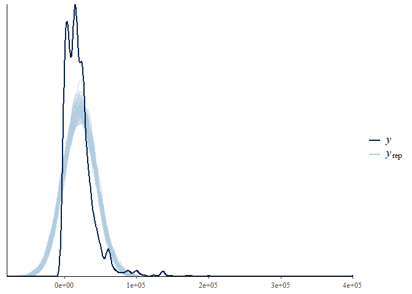
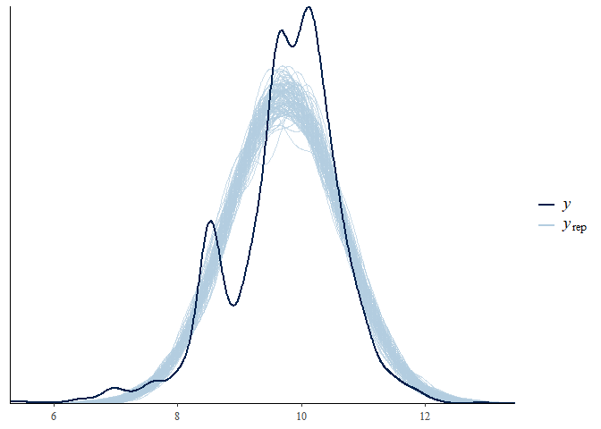
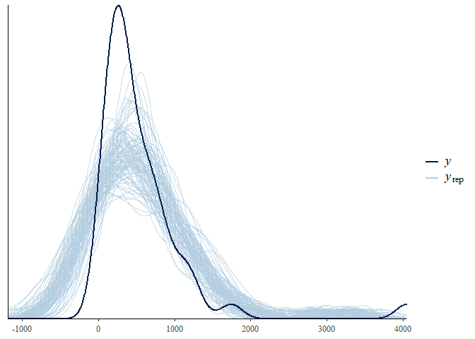
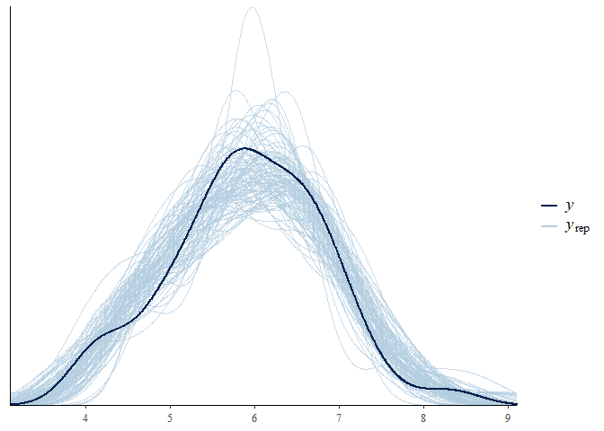

#12.1 Linear transformations

```r
earnings <- here("..", "Earnings", "data", "earnings.csv")
earnings <- read.csv(earnings)
earnings
```

```
##      height weight male   earn   earnk ethnicity education mother_education
## 1        74    210    1  50000  50.000     White        16               16
## 2        66    125    0  60000  60.000     White        16               16
## 3        64    126    0  30000  30.000     White        16               16
## 4        65    200    0  25000  25.000     White        17               17
## 5        63    110    0  50000  50.000     Other        16               16
## 6        68    165    0  62000  62.000     Black        18               18
## 7        63    190    0  51000  51.000     White        17               17
## 8        64    125    0   9000   9.000     White        15               15
## 9        62    200    0  29000  29.000     White        12               12
## 10       73    230    1  32000  32.000     White        17               17
## 11       72    176    1   2000   2.000  Hispanic        15               15
## 12       72    265    1  35000  35.000     White        NA               99
## 13       72    160    1  27000  27.000     White        12               12
## 14       70    225    1   6530   6.530     White        16               16
## 15       63    107    0      0   0.000     White        14               14
## 16       68    170    1  30000  30.000     White        11               NA
## 17       68    144    1  12000  12.000     White        12               12
## 18       71    193    1  15000  15.000     White        18               18
## 19       65    250    0  12000  12.000     White        12               12
## 20       66    130    0  20000  20.000     White        11               11
## 21       60    100    0      0   0.000     White        12               12
## 22       65    123    0  25000  25.000     White        12               12
## 23       66    130    0  22000  22.000     White        16               16
## 24       65    120    0  25000  25.000     White        16               16
## 25       71    160    1  20000  20.000     White        14               14
## 26       68    172    1  17000  17.000     White        12               12
## 27       68    135    0  40000  40.000     White        14               14
## 28       70    180    1  44000  44.000     White        13               13
## 29       67    112    0      0   0.000     White         9                9
## 30       64    240    0   7000   7.000     Black        12               12
## 31       73    190    1  53000  53.000     Black        13               13
## 32       64    145    0   5000   5.000     Black        12               NA
## 33       62    120    0   5000   5.000     White        13               13
## 34       63    114    0  14000  14.000     White        14               14
## 35       69    170    1  45000  45.000     White        14               14
## 36       67    166    1   5500   5.500     White        14               14
## 37       66    124    0  40000  40.000     White        12               12
## 38       72    175    1  34000  34.000     White        12               12
## 39       63    120    0   5000   5.000     Black        12               12
## 40       63    184    0  10000  10.000     Black        12               12
## 41       68    150    1      0   0.000     White        11               11
## 42       64    150    0  27000  27.000     White        16               16
## 43       73    220    1  62000  62.000     White        14               14
## 44       67    220    0  15000  15.000     White        12               12
## 45       60     NA    0      0   0.000     White        12               12
## 46       72    180    1  50000  50.000     White        16               16
## 47       68    158    0      0   0.000     White        12               NA
## 48       77    255    1  41000  41.000     White        16               16
## 49       64    150    0      0   0.000     White        10               10
## 50       64    130    0  15000  15.000     White        14               14
## 51       64     NA    0  25000  25.000     White        12               12
## 52       63    146    0  25000  25.000     White        16               16
## 53       72    185    1  75000  75.000     White        17               17
## 54       68    180    1  27000  27.000     White        17               17
## 55       64    135    0  12000  12.000     White        12               12
## 56       70    168    1  40000  40.000     White        12               12
## 57       61    138    0   7500   7.500     White        14               14
## 58       65    115    0  25000  25.000     White        12               12
## 59       67    135    0  30000  30.000     Black        14               14
## 60       65    150    0  21000  21.000     White        12               12
## 61       64    120    0  27000  27.000     White        14               14
## 62       73    165    1  45000  45.000     White        16               16
## 63       67    130    0   3000   3.000     White        15               15
## 64       65    170    0  25000  25.000     White        12               12
## 65       65    140    0  24000  24.000     White        12               12
## 66       67    145    0  32000  32.000     White        18               18
## 67       68    145    0  10000  10.000     White        17               17
## 68       70    150    0      0   0.000     White        12               12
## 69       60    100    0  11000  11.000  Hispanic        12               12
## 70       65    105    0  18700  18.700     White        13               13
## 71       62    120    0  20000  20.000     White        12               12
## 72       72    160    1   3500   3.500     White        10               10
## 73       67    206    1  13000  13.000     Black         8                8
## 74       70    170    1  25000  25.000     White        12               12
## 75       70    183    1  21000  21.000     White        17               17
## 76       68    150    0  34000  34.000     White        17               17
## 77       66    115    0   5000   5.000     Black        12               12
## 78       60    120    0   6000   6.000     White        12               12
## 79       71    195    1  17000  17.000     White        12               12
## 80       71    140    1  35000  35.000     White        12               NA
## 81       73    180    1   4000   4.000     White        13               13
## 82       64    115    0   5000   5.000     White        16               16
## 83       68    150    0  14000  14.000     White        14               14
## 84       66    118    0  10000  10.000     White        12               12
## 85       69    155    1  25000  25.000     White        16               16
## 86       63    126    0      0   0.000     White         8               NA
## 87       70    130    1  87000  87.000     White        18               18
## 88       63    130    0  16000  16.000     White        14               14
## 89       66    123    0      0   0.000     Black        13               13
## 90       66    110    0  15000  15.000     White        12               12
## 91       64    200    0      0   0.000     White        12               NA
## 92       62    130    1  16000  16.000  Hispanic        14               14
## 93       66    190    0  25000  25.000     White        18               18
## 94       64    116    0  16500  16.500     White        14               14
## 95       68    170    1  15000  15.000     White        12               12
## 96       64    190    0   4000   4.000     White         9                9
## 97       67    342    0   3840   3.840     White         9                9
## 98       60     90    0   5000   5.000     White         6               NA
## 99       71    200    1  22000  22.000     White        12               12
## 100      60    135    0    200   0.200     White        16               16
## 101      66    140    0  26000  26.000     White        16               16
## 102      66    120    0   2500   2.500     White        15               15
## 103      65    125    0  17000  17.000     White        14               14
## 104      63    112    0  25000  25.000     White        16               16
## 105      70    130    0   8000   8.000     White        13               13
## 106      68    215    1  25000  25.000     White        12               NA
## 107      65     98    0      0   0.000     White        13               13
## 108      66    138    0  12000  12.000     White        13               13
## 109      62    123    0  10000  10.000     White        12               12
## 110      60    105    0   5000   5.000     White         8                8
## 111      76    220    1 100000 100.000     White        16               16
## 112      66    140    0  10000  10.000     White        15               15
## 113      64    173    0      0   0.000     White        14               14
## 114      72    185    1  15000  15.000     White        12               12
## 115      66    190    0  45000  45.000     Other        12               12
## 116      69    190    1  15000  15.000     Black        11               NA
## 117      67    115    0   2400   2.400  Hispanic         8                8
## 118      68    150    1  30000  30.000  Hispanic        12               12
## 119      70    150    1  30000  30.000     White        12               12
## 120      62    125    0  10000  10.000     White        12               12
## 121      63    137    0   5000   5.000     White        13               13
## 122      66    125    0  12000  12.000     White        13               13
## 123      70     80    0  20000  20.000     White        10               10
## 124      68    160    0  20000  20.000     White        12               12
## 125      70    160    1  20000  20.000     White        14               14
## 126      65    125    0  25000  25.000     White        18               18
## 127      68    110    0   5000   5.000     White         8               NA
## 128      66    133    0      0   0.000     White        12               12
## 129      71    180    1  25000  25.000     White        18               18
## 130      66    135    0   1200   1.200     White        12               12
## 131      62    130    0   5000   5.000     White        12               12
## 132      68    120    0    700   0.700     White        16               16
## 133      70    150    1  20000  20.000     White        16               16
## 134      61    110    0  10000  10.000  Hispanic        12               12
## 135      63    128    0  30000  30.000     White        12               12
## 136      72    185    1  25000  25.000  Hispanic         8               NA
## 137      64    200    0  40000  40.000     White        14               14
## 138      67    155    1  25000  25.000     White        12               NA
## 139      66    135    0  45000  45.000     White        18               18
## 140      61    130    0  10000  10.000     White        17               17
## 141      69    132    0  60000  60.000     White        18               18
## 142      62    103    0  45000  45.000     White        12               12
## 143      64    150    0      0   0.000     White        12               NA
## 144      68    130    0  18000  18.000     White        12               12
## 145      60    128    0  15000  15.000     White        12               NA
## 146      71    155    1  50000  50.000     White        18               18
## 147      64    155    0  16040  16.040     White        12               NA
## 148      67    140    0  15000  15.000     Black        14               14
## 149      69    160    1  10000  10.000     White        17               17
## 150      67    185    0  33000  33.000     White        13               13
## 151      68    130    0  18000  18.000     White        12               12
## 152      63    105    0  15000  15.000     White        12               12
## 153      71    145    1  21000  21.000     White        12               NA
## 154      64    124    0  21000  21.000     Black        17               17
## 155      68    170    1  37000  37.000     White        11               11
## 156      68    126    0  38000  38.000     White        17               17
## 157      66    142    0  17000  17.000  Hispanic        14               14
## 158      66    130    0      0   0.000     White        12               12
## 159      66    130    0      0   0.000     Other        16               16
## 160      60    100    0  15000  15.000     White        16               16
## 161      77    210    1  32000  32.000     White        16               16
## 162      67    160    0  27500  27.500     White        12               12
## 163      66    140    1  15000  15.000     White        12               NA
## 164      62    120    0  16500  16.500     White        12               12
## 165      64    118    0      0   0.000     White        17               17
## 166      72    175    0      0   0.000     White        12               12
## 167      67    150    0  25000  25.000     White        18               18
## 168      61    116    0  27000  27.000     White        18               18
## 169      64    220    0   5000   5.000     White        12               NA
## 170      62    125    0  70000  70.000     White        16               16
## 171      63    150    0   5000   5.000     White        12               12
## 172      68    135    1   5000   5.000     White        16               16
## 173      69    158    1  62000  62.000     Other        18               18
## 174      64    160    0  15000  15.000     Black        12               12
## 175      64    158    0  20000  20.000     White        15               15
## 176      72    185    1   4000   4.000     White        15               15
## 177      72    172    1  75000  75.000     White        12               12
## 178      64    130    0  60000  60.000     White        16               16
## 179      61    150    0   5000   5.000     White        13               13
## 180      74    230    1  30000  30.000     White        12               12
## 181      70    165    1  70000  70.000     White        14               14
## 182      64    115    0   5000   5.000     White        16               16
## 183      71    195    1  50000  50.000     White        16               16
## 184      63    120    0  44000  44.000     White        12               12
## 185      73    215    1  40000  40.000     White        18               18
## 186      64    133    0  30000  30.000     White        14               14
## 187      73    200    1  15000  15.000     Black        14               14
## 188      63    150    0  35000  35.000     White        15               15
## 189      62    130    0      0   0.000     White        16               16
## 190      62    140    0  10000  10.000     White        16               16
## 191      70    170    0  23000  23.000     White        17               17
## 192      62    115    0      0   0.000     White        12               12
## 193      71    175    1  45000  45.000     White        17               17
## 194      71    170    1  15000  15.000     White        14               14
## 195      70    169    0   4000   4.000     White        14               14
## 196      67    160    1  17000  17.000     White        14               14
## 197      64    130    0  30000  30.000     White        12               12
## 198      67    112    0  27500  27.500     White        12               12
## 199      62    140    0   5688   5.688     White         8                8
## 200      62    137    0  18000  18.000  Hispanic        13               13
## 201      67    170    1  35000  35.000     White        14               14
## 202      66    160    0  45000  45.000     White        17               17
## 203      68    185    1  43000  43.000     Black        13               13
## 204      62    140    0  32000  32.000     Black        14               14
## 205      62    118    0  25000  25.000     Black        12               12
## 206      66    148    0      0   0.000     Black         5                5
## 207      68    165    0  10000  10.000     Black        18               18
## 208      65    130    0  50000  50.000  Hispanic        12               12
## 209      74    160    1  15000  15.000     White        12               12
## 210      74    185    1  60000  60.000     White        13               13
## 211      71    175    1  30000  30.000     White        15               15
## 212      68    150    0  21000  21.000     Other        12               12
## 213      62    110    0   2400   2.400     White        16               16
## 214      68    240    0   5000   5.000     White        10               10
## 215      62    150    0  35000  35.000     Black        15               15
## 216      66    136    0   1000   1.000     White        15               15
## 217      68    170    1  27000  27.000     White        12               12
## 218      60    115    0   6600   6.600  Hispanic        14               14
## 219      68    164    1  16000  16.000     White         8                8
## 220      72    185    1  90000  90.000     White        12               12
## 221      66    185    0   8000   8.000     White        12               12
## 222      68    150    1  20000  20.000     White        10               NA
## 223      68    130    0  15000  15.000     White        12               12
## 224      69    180    0  12000  12.000     White        12               12
## 225      63    170    0  25000  25.000     White         9                9
## 226      64    128    0  24000  24.000     White        16               16
## 227      65    175    0  20000  20.000     White        14               14
## 228      61    128    0  19000  19.000     White        12               12
## 229      71    180    1  25000  25.000     White         8               NA
## 230      72    172    1  10000  10.000     White        12               12
## 231      66    125    0  40000  40.000     White        16               16
## 232      69    175    1  62000  62.000     Black         8               NA
## 233      63    105    0  25000  25.000     Black        13               13
## 234      62     NA    0      0   0.000     White        10               10
## 235      60    145    0      0   0.000  Hispanic        10               10
## 236      62    138    0  10000  10.000     White         8               NA
## 237      68    160    1  25000  25.000     White        14               14
## 238      70    150    1  25000  25.000     White        12               12
## 239      71    165    1  25000  25.000     White        14               14
## 240      71    209    1  19000  19.000     White        16               16
## 241      68    210    1  44000  44.000     White        16               16
## 242      66    145    0      0   0.000     White        12               12
## 243      63    140    0      0   0.000     White        18               18
## 244      60    105    0  15000  15.000     White        14               14
## 245      63    137    0  17000  17.000     White        12               12
## 246      68    150    1  24000  24.000     White        12               12
## 247      70    150    1  50000  50.000     White        16               16
## 248      64    170    0  23000  23.000     White        12               12
## 249      70    143    1  13000  13.000     White        12               12
## 250      66    178    0  20000  20.000     Black        NA               NA
## 251      66     NA    0  45000  45.000     White        12               12
## 252      68    180    1  65000  65.000     White        16               16
## 253      61    135    0   7000   7.000     White        12               12
## 254      68    180    1  40000  40.000     White        18               18
## 255      66    145    0  15000  15.000     White        17               17
## 256      70    164    1  20000  20.000     White        16               16
## 257      68    150    1  25000  25.000     White         6               NA
## 258      71    175    1  20000  20.000     White        12               12
## 259      63    175    1   5000   5.000     White         9               NA
## 260      65    195    0  20000  20.000     White        12               12
## 261      66    150    0  25000  25.000     White        12               12
## 262      64    110    0  15000  15.000     White        14               14
## 263      70    195    1  49000  49.000     White        13               13
## 264      70    165    1  25000  25.000     White         8                8
## 265      64    102    0      0   0.000     White        12               NA
## 266      63    150    0      0   0.000     White        16               16
## 267      62    158    0  25000  25.000     White        12               12
## 268      65    160    0  30000  30.000     White        12               12
## 269      66    142    0  25000  25.000     White        12               12
## 270      60    125    0  35000  35.000     White        16               16
## 271      66    128    0  11000  11.000     White        14               14
## 272      61    160    0  16000  16.000     White        15               15
## 273      72    145    1  35000  35.000     White        14               14
## 274      74    240    1 125000 125.000     White        18               18
## 275      67    185    0  23000  23.000     White        12               12
## 276      66    170    0  17000  17.000     White        16               16
## 277      62    125    0      0   0.000     White        13               13
## 278      62    115    0  27000  27.000     White        12               12
## 279      72    180    1  70000  70.000     White        14               14
## 280      65    170    0  35000  35.000     White        15               15
## 281      60    150    0  10000  10.000     White        12               12
## 282      64    107    0  15000  15.000     White        13               NA
## 283      62    135    0  35000  35.000     White        15               15
## 284      66    130    0  15000  15.000     White        12               12
## 285      64    250    0  12000  12.000     White        12               12
## 286      71    135    1   8000   8.000     White        12               NA
## 287      65    130    0   8000   8.000     White        12               12
## 288      73    225    1  35000  35.000     White        18               18
## 289      69    175    1  45000  45.000     White        11               NA
## 290      64    175    0      0   0.000     White        12               12
## 291      64    118    0   5000   5.000     White        12               12
## 292      64    123    0  15000  15.000     White        14               14
## 293      61    136    0  15000  15.000     White        12               12
## 294      67    240    0  24000  24.000     White        18               18
## 295      62    189    0  25000  25.000     White        13               13
## 296      63    165    0  25000  25.000     Black        14               14
## 297      67    105    1  20000  20.000     Other        10               10
## 298      68    140    0  24000  24.000     White        12               12
## 299      72    165    1  44000  44.000     White        16               16
## 300      70    187    1  69000  69.000     White        12               12
## 301      70    188    1  62000  62.000     White        18               18
## 302      60    145    0  25000  25.000     Black        15               15
## 303      67    170    1  32000  32.000     Black        14               14
## 304      63    125    0  20000  20.000     Black        12               12
## 305      66    112    0  32000  32.000     Other        18               18
## 306      66    135    0  25000  25.000     White        17               17
## 307      71    185    1 170000 170.000     White        18               18
## 308      66    185    0      0   0.000     Black        11               11
## 309      67    170    1  35000  35.000     White        16               16
## 310      76    194    1  40000  40.000     Black        16               16
## 311      69    155    1  33000  33.000     White        14               14
## 312      65    145    0  18000  18.000     White        12               12
## 313      62    120    0  30000  30.000     White        13               13
## 314      62    112    0  26000  26.000     White        12               12
## 315      62    120    0   5000   5.000     White        12               12
## 316      69    163    0   5000   5.000     White        12               12
## 317      62    130    0  20000  20.000     White        16               16
## 318      61    105    0  17000  17.000     White        12               12
## 319      65    138    0  32000  32.000     White        14               14
## 320      72    170    1  15000  15.000     White        14               14
## 321      66    120    0      0   0.000     White        17               17
## 322      72    248    1  50000  50.000     White        14               14
## 323      64    138    0   8000   8.000     White        12               NA
## 324      71    190    1  40000  40.000     White        14               14
## 325      72    185    1  40000  40.000     White        15               15
## 326      66    130    1  32750  32.750     White        12               12
## 327      68    170    1   5000   5.000     White        12               12
## 328      65    185    0  20000  20.000     White        14               14
## 329      65    128    0  36000  36.000     Black        15               15
## 330      62    170    0   6000   6.000     White        12               NA
## 331      66    160    0  12000  12.000  Hispanic        14               14
## 332      67    150    1  60000  60.000     White        14               14
## 333      64    135    0  40000  40.000     White        13               13
## 334      74    185    1   5000   5.000  Hispanic        13               13
## 335      63    117    0  43000  43.000     White        12               12
## 336      67    150    0  45000  45.000     White        16               16
## 337      68    190    0   6000   6.000     White        18               18
## 338      64    154    0   8000   8.000     Other        10               NA
## 339      64    170    0  20000  20.000     Black        13               13
## 340      66    165    1  17000  17.000     Black        12               12
## 341      65    112    0   2000   2.000     White        12               NA
## 342      65    180    1  65000  65.000     White        12               12
## 343      72    180    1  50000  50.000     White        12               12
## 344      68    128    0      0   0.000     White        11               11
## 345      63    170    0      0   0.000     White        11               11
## 346      70    220    1  15000  15.000     White        13               NA
## 347      68    140    0  11000  11.000     White        12               12
## 348      74    190    1  35000  35.000     White        18               18
## 349      63    185    1  27000  27.000     White        12               12
## 350      64    135    0   3500   3.500     White        12               12
## 351      65    132    0  15000  15.000     White         7                7
## 352      68    180    1  42000  42.000     White        12               12
## 353      61    200    0  15000  15.000     White        12               12
## 354      67    130    0  20000  20.000     White        18               18
## 355      67    125    0  15000  15.000     White        12               12
## 356      73    207    1  10000  10.000     White        12               12
## 357      62    105    0      0   0.000     White        12               NA
## 358      70    176    1   6000   6.000     White         8                8
## 359      71    200    1  25000  25.000     White        12               NA
## 360      65    200    0  17000  17.000  Hispanic        16               NA
## 361      69    148    1  35000  35.000  Hispanic        16               16
## 362      77    203    1  28000  28.000     White        14               14
## 363      68    165    0  15000  15.000     White        12               NA
## 364      62    110    0  20000  20.000     White        17               17
## 365      64    128    0  20000  20.000     White        12               12
## 366      67    150    1  10500  10.500  Hispanic        12               12
## 367      70    165    1  13000  13.000     White        16               16
## 368      62    123    0  10000  10.000     White        12               12
## 369      63    170    0   3000   3.000     White        12               12
## 370      62    116    0  24000  24.000     White        14               14
## 371      63    117    0      0   0.000     White        17               17
## 372      69    160    0  17000  17.000     White        13               13
## 373      64    122    0  11000  11.000     White        12               12
## 374      64    154    0      0   0.000     White        14               14
## 375      69    185    0  32000  32.000     White        14               14
## 376      59     95    0  17000  17.000     White        15               15
## 377      61    115    0  15000  15.000     White        16               16
## 378      60    125    0  25000  25.000     White        12               12
## 379      72    225    1 136500 136.500     White        12               12
## 380      66     NA    0   3000   3.000     Other        12               12
## 381      63    160    0  15000  15.000     White         8               NA
## 382      65    150    0      0   0.000     White        12               12
## 383      70    200    1  25000  25.000     White        18               18
## 384      72    250    1   5000   5.000     White        14               14
## 385      62    125    0   2100   2.100     Black        12               12
## 386      70    148    1  15000  15.000     Black        10               10
## 387      60    120    0  15000  15.000     White        13               NA
## 388      66    140    0  15000  15.000     Black        12               12
## 389      64    160    1  15000  15.000  Hispanic        12               12
## 390      71    180    1  15000  15.000     White        16               16
## 391      73    250    1   5000   5.000     Black        12               12
## 392      75    180    1   3192   3.192     Black        11               11
## 393      62    110    0  15000  15.000     Other        12               12
## 394      63    123    0  17000  17.000     White        17               17
## 395      65    150    0  30000  30.000     White        13               13
## 396      70    135    1  15000  15.000     White        12               12
## 397      64    110    0   5000   5.000     White        16               16
## 398      68    170    0  24000  24.000     White        16               16
## 399      65    154    0  10000  10.000     White        14               14
## 400      69    150    1  50000  50.000     White         8                8
## 401      64    170    0  15000  15.000     White        11               NA
## 402      72    168    1  50000  50.000     White        16               16
## 403      69    160    1 136500 136.500     White        12               12
## 404      64    150    0  20000  20.000     White        17               17
## 405      63    108    0  30000  30.000  Hispanic        18               18
## 406      68    122    0   5000   5.000     White        18               18
## 407      64    135    0      0   0.000     White        12               12
## 408      66    130    0      0   0.000     White        10               10
## 409      70    165    1  25000  25.000     White        12               12
## 410      63    134    0      0   0.000     White         5               NA
## 411      73    180    0  22000  22.000     White        14               14
## 412      75    200    1  27000  27.000     White        12               12
## 413      65    210    0   4000   4.000     White        12               12
## 414      64    140    0  35000  35.000     White        16               16
## 415      66    160    0  17500  17.500     White        17               17
## 416      66    112    0  16500  16.500     White        14               14
## 417      64    190    0  28000  28.000     White        16               16
## 418      66    140    0  52000  52.000     White        18               18
## 419      64    108    0  15000  15.000     White        16               16
## 420      63    140    0  19000  19.000     White        13               13
## 421      63    125    0      0   0.000     White        13               13
## 422      67    132    0   5000   5.000     Black        12               12
## 423      69    135    0  15000  15.000     White        12               12
## 424      73    170    1  27000  27.000     White        12               12
## 425      72    171    1  15000  15.000     White         8                8
## 426      66    196    0      0   0.000     White        12               12
## 427      72    195    1  15000  15.000     White        14               14
## 428      64    150    0  14500  14.500     White        12               NA
## 429      64    106    0  24000  24.000     White        13               13
## 430      61    115    0   5000   5.000     White        12               12
## 431      68    145    1  18000  18.000     White        15               15
## 432      62    118    0   4000   4.000     White        12               12
## 433      64    129    0  15000  15.000     White        12               NA
## 434      69     NA    0   4000   4.000     White        13               13
## 435      66    160    0  20000  20.000     White        15               15
## 436      60     98    0    700   0.700     White        12               12
## 437      64    123    0  25000  25.000     White        15               15
## 438      65    220    0  24000  24.000     White        12               12
## 439      60    125    0  15000  15.000     White        12               NA
## 440      76    215    1  27000  27.000     White        12               12
## 441      72     NA    0  12000  12.000     White        12               12
## 442      72    185    1 400000 400.000     White        12               12
## 443      62    145    0  22000  22.000     White        18               18
## 444      62    140    0  30000  30.000     White        13               13
## 445      70    160    1  45000  45.000     White        16               16
## 446      71    205    1  35000  35.000     White        12               12
## 447      74    195    1  20000  20.000     White        12               12
## 448      65    138    0  32000  32.000     White        16               16
## 449      63    160    0   6000   6.000     Other        12               12
## 450      67    150    0  12000  12.000     White        12               12
## 451      65    128    0      0   0.000     White        16               16
## 452      63    145    0  10000  10.000     White        12               12
## 453      65    126    0   1000   1.000     White        12               12
## 454      64    136    0  12000  12.000     White        15               NA
## 455      65    140    0  16000  16.000     White        12               12
## 456      63    125    0  15000  15.000     White        13               13
## 457      68    240    0      0   0.000     White        16               16
## 458      63    140    0  25000  25.000     White        16               16
## 459      70    135    0  25000  25.000     White        12               12
## 460      68    180    1  32000  32.000     White        12               12
## 461      67    165    1  35000  35.000     White        14               14
## 462      68    130    1  25000  25.000     White        12               12
## 463      66    135    0  25000  25.000     White        12               12
## 464      65    125    0   6000   6.000     White        12               12
## 465      69    165    1  80000  80.000     White        14               14
## 466      68    145    0  20000  20.000     White        14               14
## 467      66    187    0   1000   1.000     White        17               17
## 468      71    165    1  28000  28.000  Hispanic        13               13
## 469      64    125    1  26000  26.000  Hispanic        16               16
## 470      74    210    1  27000  27.000     White        12               12
## 471      62    112    0  18000  18.000     White        13               13
## 472      65    200    0   2000   2.000     White        12               12
## 473      69    195    1  20000  20.000     White        12               12
## 474      72    185    1  15000  15.000     Black        12               12
## 475      66    221    0   6000   6.000     White        16               16
## 476      70    180    1  15000  15.000     White        11               11
## 477      61    170    0  15000  15.000     White        12               NA
## 478      60    110    0      0   0.000     White        10               10
## 479      70    190    1   5000   5.000     White        12               12
## 480      73    130    0   5000   5.000     White        11               11
## 481      66    160    0  15000  15.000     White        12               12
## 482      57    130    0  45000  45.000  Hispanic        12               12
## 483      67    210    1  25000  25.000     White        11               11
## 484      73    180    1  12000  12.000     White        12               NA
## 485      65    115    0      0   0.000     White        18               18
## 486      62    120    0  15000  15.000     White        12               12
## 487      76    165    1  12000  12.000     White        12               12
## 488      70    175    1  30000  30.000     White        14               14
## 489      64    160    0      0   0.000     White        12               12
## 490      63    130    0   4000   4.000     Black        15               15
## 491      67    185    0   5000   5.000     Black        11               11
## 492      63    115    0  26000  26.000     Black        13               13
## 493      69    190    0   5000   5.000     White         9                9
## 494      67    200    0  15000  15.000     White         9                9
## 495      66    180    0  15000  15.000     Black        12               12
## 496      61    140    0   5000   5.000     Black        12               12
## 497      70    164    1  23000  23.000     Black        12               12
## 498      71    175    1  21000  21.000     White        12               12
## 499      65    135    0  25000  25.000     White        12               12
## 500      70    157    1  18000  18.000     White        16               NA
## 501      63    150    0   4000   4.000     White        13               13
## 502      64    116    0  23900  23.900     White        12               12
## 503      68    145    1  35000  35.000     White        12               NA
## 504      64    123    0  35000  35.000     White        18               18
## 505      67    140    1  26000  26.000     White        14               14
## 506      66    172    1  25000  25.000     White        16               16
## 507      68    118    0  23500  23.500     White        13               13
## 508      65    135    0  12000  12.000     White        12               12
## 509      67    140    0  15000  15.000     White        12               12
## 510      61    165    0  25000  25.000     White         8               NA
## 511      73    210    1   3000   3.000     White        17               17
## 512      63    200    0  15000  15.000     White        12               12
## 513      66    145    0  20000  20.000     White        12               12
## 514      64    200    0   6000   6.000     White        12               12
## 515      71    160    1  14000  14.000     White        12               12
## 516      63    123    0  15000  15.000     White        16               16
## 517      71    180    1 175000 175.000     White        16               16
## 518      63    118    0      0   0.000     White        12               12
## 519      64    128    0  62000  62.000     White        16               16
## 520      73    170    1   1000   1.000     White        18               18
## 521      65    140    0  10000  10.000     White        14               14
## 522      66    120    1  45000  45.000     White        13               NA
## 523      66    120    0  15000  15.000     White        12               NA
## 524      60    135    0  45000  45.000     White        15               15
## 525      68    165    0  50000  50.000     White        18               18
## 526      59    140    0  20000  20.000     White        13               13
## 527      70    215    1   5000   5.000     White        12               12
## 528      70    165    1  35000  35.000     White        16               16
## 529      72    152    1  40000  40.000     White        16               16
## 530      64    135    0  35000  35.000     White        12               12
## 531      72    200    1  25000  25.000     White        12               12
## 532      66    170    0  50000  50.000     White        16               16
## 533      70    205    1 100000 100.000     White        18               18
## 534      69    145    1  35000  35.000     White        13               NA
## 535      66    115    0      0   0.000     White        12               12
## 536      68    175    0  24000  24.000     White        12               12
## 537      64    120    0      0   0.000     White        12               12
## 538      67    140    0  25000  25.000     White        14               14
## 539      63    124    0      0   0.000     White        12               12
## 540      74    268    1  35000  35.000     White        17               17
## 541      73    230    1  38000  38.000     White        16               NA
## 542      70    200    1  35000  35.000     White        13               13
## 543      60    130    0  25000  25.000     White         8                8
## 544      67    160    1  30000  30.000     White        12               12
## 545      64    136    0   5000   5.000  Hispanic        12               12
## 546      67    160    1 148000 148.000     White        18               18
## 547      70    165    1  30000  30.000     White        12               12
## 548      64    120    0   6500   6.500     White        15               15
## 549      62     95    0   3000   3.000     White        16               16
## 550      72    175    1  25000  25.000     White        15               15
## 551      66    200    0      0   0.000     White         8               NA
## 552      69    230    1  23000  23.000     White        18               18
## 553      82    175    1  45000  45.000     White        18               NA
## 554      63    150    0  35000  35.000     White        16               16
## 555      68    155    1  40000  40.000     White        17               17
## 556      72    180    1  30000  30.000     White        14               14
## 557      63    210    0      0   0.000     White        14               14
## 558      63    210    0  14000  14.000     White        12               12
## 559      69     NA    0  15000  15.000     White        12               12
## 560      64    120    0  26000  26.000     White        18               18
## 561      71    195    0   8000   8.000     White        12               12
## 562      64    123    0  24000  24.000     Black        16               16
## 563      72    135    1      0   0.000     White         8                8
## 564      62    125    0      0   0.000     White        12               12
## 565      66    180    0      0   0.000     White        10               10
## 566      72    200    1  15000  15.000     White        12               NA
## 567      66    140    1   5124   5.124     White         8                8
## 568      61    110    0  10000  10.000     White        15               15
## 569      64    165    0   5000   5.000     White         7               NA
## 570      62    111    0   5000   5.000     Black        13               13
## 571      69    125    0      0   0.000     White        13               13
## 572      68    145    0  12000  12.000     White        16               16
## 573      66    155    0      0   0.000     White        12               12
## 574      68    180    1  50000  50.000     White        17               17
## 575      71    158    1 136500 136.500     White        16               16
## 576      64    125    0  23000  23.000     White        13               13
## 577      61    118    0      0   0.000     White        16               16
## 578      68    155    0  25000  25.000     White        12               12
## 579      63    174    0   5000   5.000     White         9               NA
## 580      65    138    0   5000   5.000     White        12               NA
## 581      64    110    0   5000   5.000     White        12               12
## 582      65    130    0  15000  15.000     White        12               12
## 583      64    125    0   5000   5.000     White        14               14
## 584      66    130    1  40000  40.000     Black        14               14
## 585      62    124    0   6000   6.000     Black        13               13
## 586      71    170    1 100000 100.000     White        18               18
## 587      65    160    0   5000   5.000     Black        16               16
## 588      64    190    0  45000  45.000     White         8               NA
## 589      60    120    0  25000  25.000     Black        12               12
## 590      66    156    1 110000 110.000     White        18               18
## 591      61    102    0  25000  25.000     White        13               13
## 592      72    145    1  41000  41.000  Hispanic        13               NA
## 593      70    145    0  25000  25.000     White        12               12
## 594      63    130    0  23000  23.000     White        13               13
## 595      68    132    0  15000  15.000     White        14               NA
## 596      63    120    0      0   0.000     White        12               12
## 597      70    165    1  21000  21.000     White        12               12
## 598      62    150    0   4000   4.000     White        12               12
## 599      71    280    1  25000  25.000     White        12               12
## 600      70    170    1  30000  30.000     White        18               18
## 601      64    159    0  14000  14.000     White        11               11
## 602      63    115    0   6000   6.000     White        12               12
## 603      65    144    0  14000  14.000     White        12               12
## 604      71    175    1  43000  43.000     White        12               12
## 605      62    128    0  25000  25.000     White        15               15
## 606      73    195    1  40000  40.000     White        12               12
## 607      64    135    0  25000  25.000     White        16               16
## 608      68    220    1  65000  65.000     White        17               17
## 609      76    210    1  16000  16.000     White        15               15
## 610      73    196    1 136500 136.500     White        16               16
## 611      70    160    1  87000  87.000     White        18               NA
## 612      66    120    0   8000   8.000     White        12               12
## 613      64     NA    0  20000  20.000     White        15               15
## 614      60     NA    0  14000  14.000     White        14               14
## 615      68    140    1  45000  45.000     White        12               12
## 616      61    180    0   8000   8.000     White        11               NA
## 617      65    185    0  15000  15.000     White        10               NA
## 618      66    130    1  12000  12.000     White        12               12
## 619      63    132    0   8000   8.000     White        14               14
## 620      63    105    0  16000  16.000     White        15               15
## 621      67     NA    0  25000  25.000     White        12               NA
## 622      74    170    1   6000   6.000     White        15               15
## 623      66    160    0 136500 136.500     White        12               NA
## 624      70    180    1  19000  19.000     White        12               12
## 625      68    155    0  21000  21.000     White        13               13
## 626      70    131    0  43000  43.000     White        18               18
## 627      69    190    1  35000  35.000     White        15               15
## 628      70    175    1   8000   8.000     White        10               NA
## 629      63    125    0  21000  21.000     White        14               14
## 630      65    135    0   5800   5.800     White        12               12
## 631      69    185    1  17000  17.000     White        12               NA
## 632      65    120    0  45000  45.000     White        12               NA
## 633      68    140    1  24000  24.000     White        14               14
## 634      62    140    0   5000   5.000     White        11               11
## 635      70    185    1  62000  62.000     White        11               11
## 636      66    150    0  11000  11.000     White        12               12
## 637      65    225    1  10000  10.000     White        13               NA
## 638      70    185    1  40000  40.000     White        14               14
## 639      66    163    0      0   0.000     Black        12               NA
## 640      70    170    1  40000  40.000     White        12               NA
## 641      66    165    0  24000  24.000     Black        14               NA
## 642      68    160    1  50000  50.000     Black        18               18
## 643      68     NA    0  25000  25.000     White        12               12
## 644      68    160    1  24000  24.000     White        16               16
## 645      68    120    1  20000  20.000     White        16               16
## 646      63    120    0  15000  15.000     White        16               16
## 647      70    195    1  60000  60.000     White        18               18
## 648      65    155    0  11000  11.000     White        13               13
## 649      64    115    0   5000   5.000     White        15               15
## 650      63    113    0 136500 136.500     White        17               17
## 651      69    180    1  87000  87.000     White        18               18
## 652      65    135    0  27000  27.000     White        16               16
## 653      77    241    1  89000  89.000     White        16               16
## 654      70    175    1  40000  40.000     White        14               14
## 655      64    120    0  15000  15.000     White        16               16
## 656      64    130    0   1000   1.000     White        14               14
## 657      62    180    0      0   0.000     White        12               12
## 658      64     NA    0  22000  22.000     White        12               12
## 659      64    184    0  12000  12.000     White         8                8
## 660      63    125    0  22000  22.000     White        16               16
## 661      58    180    0  40000  40.000     Black        12               12
## 662      73    182    1  25000  25.000     Black        10               NA
## 663      66    182    0      0   0.000     White        12               12
## 664      64    120    0  62000  62.000     White        16               16
## 665      62    150    0  40000  40.000     White        16               16
## 666      61    123    0      0   0.000     White        13               13
## 667      64    113    0  35000  35.000  Hispanic        14               14
## 668      64    119    0   7000   7.000     White        12               12
## 669      70    190    1  25000  25.000     White        14               14
## 670      62    118    0  14000  14.000     White        12               12
## 671      62    120    0   5000   5.000     White        12               12
## 672      64    150    0  15000  15.000     White        12               12
## 673      66    240    0      0   0.000     Black        14               14
## 674      66    150    0   6000   6.000     White        13               13
## 675      69    223    0  11000  11.000     Black        12               NA
## 676      64    132    0  10000  10.000     White        13               13
## 677      62    168    0      0   0.000     White        12               12
## 678      62    118    0   5000   5.000     White        12               12
## 679      71    193    1  20000  20.000     White        14               14
## 680      59    108    0  35000  35.000     White        12               NA
## 681      62    155    0   7000   7.000     White        12               12
## 682      68    185    1  38000  38.000     White         9                9
## 683      68    175    1  29000  29.000     White         9               NA
## 684      62    122    0  20000  20.000     White        10               10
## 685      63    160    0   8000   8.000     White        12               12
## 686      69    175    1  36000  36.000     White        16               16
## 687      67    228    0   1500   1.500     White        12               12
## 688      64    135    0  42000  42.000     White        18               18
## 689      68    135    0  35000  35.000     White        17               17
## 690      70    165    1  25000  25.000     White        12               12
## 691      76    150    1   5000   5.000     White         9                9
## 692      69    140    1  13000  13.000     White        10               10
## 693      66    133    0  20000  20.000     White        11               11
## 694      66     98    0  10000  10.000     White        12               NA
## 695      72    194    1  50000  50.000     Other        15               15
## 696      69    145    1  30000  30.000     Black        11               11
## 697      69    160    1   7000   7.000     White        12               NA
## 698      62    118    0  15000  15.000     Black        12               12
## 699      60    200    0  31000  31.000     Black        12               NA
## 700      66    149    0  15000  15.000     Black        12               12
## 701      60    135    0      0   0.000     White        18               18
## 702      67    170    1  50000  50.000     White        16               16
## 703      67    120    0   5000   5.000  Hispanic        11               11
## 704      66    140    1   5000   5.000     White        15               15
## 705      70    150    0    600   0.600     Black        12               12
## 706      64    150    0  14000  14.000     Black         8                8
## 707      60    105    0  40000  40.000     Other        18               18
## 708      68    170    1  24000  24.000     White        18               18
## 709      66    150    0  25000  25.000     Black        12               NA
## 710      73    180    1  22000  22.000     Black        12               12
## 711      72    215    1  20000  20.000     White         8                8
## 712      64    145    0  20112  20.112     White        12               NA
## 713      67    135    1  12000  12.000     White        13               13
## 714      71    180    1  15000  15.000     Black         8               NA
## 715      70    221    1  20000  20.000     White        18               18
## 716      66    129    0   5000   5.000     White         8                8
## 717      67    140    0  41000  41.000     White        13               13
## 718      71    155    1  13000  13.000     Black         9                9
## 719      63    136    0      0   0.000     White        12               12
## 720      73    170    1  60000  60.000     White        16               16
## 721      70    155    1  24000  24.000     White        16               16
## 722      70    165    1  38000  38.000     White        16               16
## 723      71    128    0   3000   3.000     White        14               14
## 724      66    110    0  13000  13.000     White        12               12
## 725      75    160    1   5000   5.000     White        12               12
## 726      60     92    0  20000  20.000     White        14               14
## 727      72    230    1  22000  22.000     White        12               12
## 728      70    256    0  35000  35.000     White        14               14
## 729      63    118    0      0   0.000     Black        16               16
## 730      75    230    1  28000  28.000     Black         9               NA
## 731      60    110    0  22000  22.000     White        12               12
## 732      73    186    1  30000  30.000     Black        12               NA
## 733      65    165    1   5000   5.000     Black         6               NA
## 734      65    210    0  30000  30.000     Black        12               12
## 735      63    135    0  35000  35.000     White        17               17
## 736      67    140    1  30000  30.000     White        16               16
## 737      61    130    0  32000  32.000     White        12               12
## 738      69    135    0  26000  26.000     White        17               17
## 739      64    144    0  22000  22.000     White        14               14
## 740      62    190    0  15000  15.000     White        14               NA
## 741      70    150    1  25000  25.000     White        12               12
## 742      68    147    0  11000  11.000     White        10               10
## 743      67    140    1  15000  15.000     White        12               NA
## 744      62    130    0  13000  13.000     White        12               NA
## 745      64    180    0  10000  10.000     White        15               15
## 746      68    110    0      0   0.000     White        12               12
## 747      72    200    1  35000  35.000     White        16               16
## 748      68    120    0  12000  12.000     White        12               12
## 749      64    130    0  25000  25.000     White        17               17
## 750      66    130    1      0   0.000     White        13               13
## 751      64    118    0   7000   7.000     White        11               NA
## 752      73    230    1  57000  57.000     White        14               14
## 753      73    210    1  36000  36.000     White        16               16
## 754      69    175    1  29000  29.000  Hispanic        14               14
## 755      68    133    0   8000   8.000     White        13               13
## 756      71    125    1   3000   3.000     Black        11               11
## 757      63    160    0      0   0.000     White        12               12
## 758      66    205    0  20000  20.000     White        16               16
## 759      66    158    0      0   0.000     White        12               NA
## 760      66    173    1  33000  33.000     White        12               12
## 761      68    210    0  15000  15.000  Hispanic        12               12
## 762      70    235    1  16000  16.000     White        12               12
## 763      62    148    0   5000   5.000     White        12               12
## 764      66    142    0   8000   8.000     White        14               14
## 765      63    122    0  32000  32.000     Black        16               16
## 766      75    175    1  14500  14.500     White        12               12
## 767      67    125    0  13000  13.000     White        12               12
## 768      68    115    1   5000   5.000     White        16               16
## 769      60     NA    0   5000   5.000     Black        12               12
## 770      62    125    0      0   0.000     White        10               NA
## 771      70    200    0   5000   5.000     White        11               NA
## 772      63    160    0   7000   7.000     White         9                9
## 773      65    126    0  50000  50.000     Black        18               18
## 774      69    185    0  12000  12.000     Black        12               12
## 775      71    209    1  19000  19.000     White        14               14
## 776      62    110    0   9000   9.000     White        12               12
## 777      64    110    0  25000  25.000     White        12               12
## 778      65    130    0  20000  20.000     Black        12               NA
## 779      72    170    1  55000  55.000  Hispanic        18               18
## 780      62    145    0  15000  15.000     Black        12               NA
## 781      75    190    1  45000  45.000     White        18               18
## 782      65    120    0  10000  10.000     White        12               12
## 783      65    142    0  15000  15.000     White        12               12
## 784      63    113    0  13000  13.000     White        12               12
## 785      66    120    0  45000  45.000     White        18               18
## 786      64    110    0  20000  20.000     White        13               13
## 787      68    116    0  45000  45.000     White        16               16
## 788      72    185    1  30000  30.000     White        12               12
## 789      64    110    0  12000  12.000     White        12               12
## 790      70    125    0  26000  26.000     White        13               NA
## 791      65    115    0  12500  12.500     White        12               12
## 792      64    130    0   8000   8.000     White        12               12
## 793      64    120    0  15000  15.000  Hispanic        16               16
## 794      67    207    1  65000  65.000     White        14               14
## 795      73    175    1  25000  25.000     White        10               NA
## 796      73    185    1   8000   8.000  Hispanic        14               14
## 797      65    110    1  15000  15.000     Other        14               14
## 798      64    160    0  12000  12.000     White        16               16
## 799      72    195    1  35000  35.000     White        12               12
## 800      67    140    0  35000  35.000     Black        13               13
## 801      67    162    1  40000  40.000     White        16               16
## 802      66    140    0  15000  15.000  Hispanic        14               14
## 803      74    145    1  29000  29.000     White        12               12
## 804      60    114    0   5000   5.000     White        10               10
## 805      64     96    0  15000  15.000     White        12               12
## 806      63    175    0  15000  15.000     White        13               13
## 807      74    250    1  20000  20.000     White        12               NA
## 808      74    205    1   3000   3.000     Black         6               NA
## 809      63    120    0   1000   1.000     Black        16               16
## 810      62    140    0   8000   8.000     Black        11               11
## 811      62    103    0   5000   5.000     White        12               12
## 812      67    160    0  25000  25.000     White        16               16
## 813      75    219    1   5000   5.000     White        13               13
## 814      69    163    1  20000  20.000     White        12               12
## 815      65    133    0  15000  15.000     White        12               12
## 816      73    150    1  30000  30.000     White        12               12
## 817      63    200    0  12000  12.000     White        12               NA
## 818      59     NA    0   5000   5.000     White        11               NA
## 819      60    120    0      0   0.000     White        12               12
## 820      65    122    0  15000  15.000     White        14               14
## 821      64    145    1   5000   5.000     Black        14               14
## 822      64    130    0  15000  15.000     Black        10               NA
## 823      64    135    0  25000  25.000     White        18               NA
## 824      67    210    0  10000  10.000     White        14               14
## 825      69    140    1  16000  16.000     White        12               12
## 826      71    185    1  45000  45.000     White        12               12
## 827      72    170    1  40000  40.000     White        14               14
## 828      72    200    1  15000  15.000     White        12               12
## 829      63    140    0      0   0.000     White        12               12
## 830      66    152    0  20000  20.000     White        13               13
## 831      70    125    1  25000  25.000     White        14               NA
## 832      64    145    0  19000  19.000     White        14               14
## 833      64    128    0  17600  17.600     White        16               16
## 834      68    155    1   7000   7.000     White        12               NA
## 835      74    207    1  30000  30.000     White        12               12
## 836      62    125    0  18000  18.000     White        11               11
## 837      63    135    0  15000  15.000  Hispanic         8                8
## 838      65    135    0  25000  25.000     White        16               16
## 839      66    155    0      0   0.000     White        14               14
## 840      60    120    0   6000   6.000     White         5                5
## 841      69    170    1  70000  70.000     White        18               18
## 842      61    115    0  15000  15.000     Other        16               16
## 843      68    140    1  15000  15.000     White        12               12
## 844      65    135    0  25000  25.000     White        17               17
## 845      66    120    0  35000  35.000     White        16               16
## 846      70    155    1  18000  18.000     White        16               16
## 847      72    165    1  28000  28.000     Black        15               15
## 848      66    160    0  35000  35.000     White        12               12
## 849      67    150    1  25000  25.000  Hispanic        12               12
## 850      64    135    0  15000  15.000  Hispanic        11               11
## 851      71    172    1  22000  22.000  Hispanic        14               14
## 852      63    128    0      0   0.000     White        12               12
## 853      73    190    1  35000  35.000     White        12               NA
## 854      64    140    0  18000  18.000     Black        15               NA
## 855      68    150    1  35000  35.000     White        14               14
## 856      64    115    0  16400  16.400     Black        12               12
## 857      66    135    1  22000  22.000     Black        16               16
## 858      67    128    0  30000  30.000     White        16               NA
## 859      64    135    0  17000  17.000  Hispanic        12               12
## 860      64    147    0  25000  25.000     Black        14               14
## 861      62    138    0  10000  10.000     White        12               12
## 862      69    180    1  40000  40.000     White        12               12
## 863      63    125    0  12500  12.500     White        12               12
## 864      63    180    0  15000  15.000     White        12               NA
## 865      63    135    0  10000  10.000     White        12               12
## 866      72    195    1  35000  35.000     White        15               NA
## 867      61     93    0      0   0.000  Hispanic        16               16
## 868      75    202    1 105000 105.000     White        12               12
## 869      71    160    1  25000  25.000     White        12               12
## 870      70    170    1 100000 100.000     White        18               18
## 871      60    130    0  25000  25.000     White        12               NA
## 872      69    158    1  21000  21.000     White        12               NA
## 873      64    200    0  10000  10.000     White        14               14
## 874      72    222    1  33000  33.000     White        12               12
## 875      69    149    1  26000  26.000     White        18               18
## 876      63    136    0  60000  60.000     White        10               10
## 877      64    110    0  15000  15.000     White        16               16
## 878      71    235    1  18000  18.000     White        16               16
## 879      59    105    0  15000  15.000     White         8               NA
## 880      68    170    1   5000   5.000     White        13               13
## 881      77    270    1  60000  60.000     White        17               17
## 882      68    150    0  12000  12.000     White        14               14
## 883      70    140    1  28000  28.000     Black        18               18
## 884      69    154    1  42000  42.000     White        18               18
## 885      63    103    0   2000   2.000     White        12               12
## 886      65    147    0  10000  10.000     White        16               16
## 887      73    190    1  20000  20.000     Black        18               18
## 888      66    145    1  28000  28.000     Other        15               15
## 889      72    212    1  10000  10.000     Black        17               17
## 890      66    164    1      0   0.000     White        16               NA
## 891      72    161    1  31000  31.000     Black        12               12
## 892      69    172    0  17000  17.000     Black        13               13
## 893      67    220    0  16000  16.000     White        12               NA
## 894      66    170    0  35000  35.000     White        15               15
## 895      67    111    0   3000   3.000     White        12               12
## 896      68    149    0   5000   5.000     White        11               11
## 897      72    155    1  25000  25.000     White        10               NA
## 898      68    150    0  16000  16.000     White        18               18
## 899      65    120    0  35000  35.000     Black        15               15
## 900      62    140    0  27000  27.000     Black        17               17
## 901      69    155    1  25000  25.000     White        17               17
## 902      62    200    0      0   0.000     White        14               14
## 903      70    145    1  40000  40.000     White        16               16
## 904      66    151    0  45000  45.000     White        16               16
## 905      66    185    1  14000  14.000     White        12               12
## 906      66    200    0  25000  25.000     White        14               14
## 907      72    230    1  40000  40.000     White        12               12
## 908      69    187    1  34000  34.000     White        12               NA
## 909      66    205    1  40000  40.000     White        12               NA
## 910      71    190    1  25000  25.000     White        16               16
## 911      69    165    1  35000  35.000     White        14               14
## 912      60    104    0  12000  12.000  Hispanic        12               12
## 913      65     NA    0  30000  30.000     White        17               17
## 914      62    180    0  23000  23.000     White        12               12
## 915      67    150    0   2000   2.000     White        12               12
## 916      67    175    1  20000  20.000     White        14               14
## 917      68    240    0  10000  10.000     Black         9                9
## 918      65    175    0      0   0.000     Black         6               NA
## 919      63    115    0  25000  25.000     White        16               16
## 920      64    210    0   5000   5.000     Other        12               12
## 921      66    150    0   5000   5.000     Black        11               NA
## 922      66    160    0  60000  60.000     Black        16               16
## 923      74    170    1  12000  12.000     Black        16               16
## 924      65    157    0  25000  25.000     White        18               18
## 925      63    180    0  22000  22.000     Black        14               14
## 926      62    130    0      0   0.000     White        12               12
## 927      68    165    1   8000   8.000     White        17               17
## 928      68     NA    0   5000   5.000     White        17               17
## 929      66    124    0   2000   2.000     White        16               16
## 930      64    110    0   5000   5.000     White        14               14
## 931      61    130    0  10000  10.000     White        13               13
## 932      65    122    0  18600  18.600     White        16               16
## 933      62    120    0  20000  20.000     White        14               14
## 934      73    200    1 100000 100.000     White        18               18
## 935      62    135    0  50000  50.000     White        15               15
## 936      70    170    1  27000  27.000     White        12               12
## 937      58    100    0   1000   1.000     Black        12               12
## 938      68    145    1  18000  18.000     White        12               12
## 939      67    140    0  17000  17.000     White        14               14
## 940      64    180    0  10000  10.000     White        12               12
## 941      70    208    1  14000  14.000     White        14               NA
## 942      72    200    1   7200   7.200     White        14               NA
## 943      63    130    0      0   0.000     Other         8                8
## 944      63    112    0  33000  33.000     White        17               17
## 945      66    180    1  23000  23.000     White        12               12
## 946      65    138    0  10000  10.000     White        12               12
## 947      61    124    1  22000  22.000     White        12               12
## 948      61    110    0  13000  13.000  Hispanic        12               12
## 949      67    150    0  33000  33.000     White        12               12
## 950      73    250    1  36000  36.000     White        12               12
## 951      66    180    0  10000  10.000     Black        10               NA
## 952      71    185    0  10000  10.000     Black        14               14
## 953      64    145    0   6000   6.000     White        12               12
## 954      70    199    1  25000  25.000     White        11               NA
## 955      67    165    0  12000  12.000     White        12               12
## 956      62    190    0  10000  10.000     White        11               NA
## 957      67    131    0  21000  21.000     White        12               12
## 958      69    210    1  26000  26.000     White        12               12
## 959      66    170    0  22000  22.000     Black        12               12
## 960      66    155    0  23000  23.000     Black        15               15
## 961      66    150    1  20000  20.000     White        15               15
## 962      66    130    0  10000  10.000     White        13               13
## 963      64    137    0  15000  15.000     White        12               NA
## 964      72    190    1   7000   7.000     Black        14               14
## 965      64    195    0  15000  15.000     White        12               12
## 966      64    170    0      0   0.000     White        12               12
## 967      65    160    0  26000  26.000     White        16               16
## 968      72    150    1  10000  10.000     White        11               11
## 969      63    150    0      0   0.000     White         8                8
## 970      71    185    1   3000   3.000     White        14               14
## 971      64    135    0  27000  27.000  Hispanic        17               17
## 972      70    190    1  25000  25.000     Black        16               16
## 973      66    125    0  35000  35.000     White        18               18
## 974      64    112    0  28000  28.000     White        17               17
## 975      69    154    0  25000  25.000     White        12               12
## 976      67    123    0  15000  15.000     White        12               12
## 977      75    178    1  55000  55.000     White        18               18
## 978      66    125    0  20000  20.000  Hispanic        17               17
## 979      67    125    0   8500   8.500     White        12               12
## 980      68    132    0      0   0.000     White        12               12
## 981      67    142    0  15000  15.000     White        13               13
## 982      75    214    1  30000  30.000     Black         8               NA
## 983      71    175    1  30000  30.000     White        16               16
## 984      62    175    0      0   0.000     White        12               12
## 985      68    180    0   5000   5.000     White        13               13
## 986      67    124    0   5000   5.000     White        14               14
## 987      68    135    0  20000  20.000     White        12               12
## 988      70    183    0  20000  20.000     White        15               NA
## 989      70    151    1  22000  22.000     White         6                6
## 990      67    145    1  25000  25.000     White        16               16
## 991      64    122    0      0   0.000     White        16               16
## 992      64    140    0   5000   5.000     Black        12               NA
## 993      65    120    0  15000  15.000     White        12               12
## 994      71    160    1   3000   3.000     White         8                8
## 995      63    137    0  16000  16.000     White        12               12
## 996      70    175    1  30000  30.000     White        14               14
## 997      64    126    0      0   0.000     White        12               12
## 998      61    148    0  10000  10.000     Black        12               12
## 999      65    162    0  15000  15.000     Black        12               12
## 1000     67    170    1  28000  28.000     White        12               12
## 1001     67    150    0  15000  15.000     White        12               NA
## 1002     68     NA    0  15000  15.000     White        12               12
## 1003     59    110    0   5000   5.000     White         6               NA
## 1004     63    135    0   5000   5.000     White        12               NA
## 1005     65    153    1  31500  31.500     White        14               14
## 1006     66    168    1  95000  95.000     White        18               18
## 1007     68    160    1  45000  45.000     White        17               17
## 1008     69    150    0  20000  20.000     White        12               NA
## 1009     67    145    1  38000  38.000     White        12               12
## 1010     72    250    1  10000  10.000     White         8                8
## 1011     63    139    0  15000  15.000     White        16               16
## 1012     74    199    1  30000  30.000     White        12               12
## 1013     74    225    1  35900  35.900     White        16               16
## 1014     66    104    0  12000  12.000     White        13               13
## 1015     72    165    1  15000  15.000     White        15               15
## 1016     69    115    0  10000  10.000     White        16               16
## 1017     66    150    0  45000  45.000     White        18               18
## 1018     62    175    0   5000   5.000     White        12               12
## 1019     68    130    1   5000   5.000     White        11               11
## 1020     74    185    1  40000  40.000     White        16               16
## 1021     72    180    1  21500  21.500     White        12               12
## 1022     66    132    1  14000  14.000     White        12               NA
## 1023     67    175    1  38000  38.000     Other        17               17
## 1024     65    130    0   1000   1.000     White        12               12
## 1025     66    240    1  14000  14.000     White        12               12
## 1026     65    130    0  15000  15.000     White        12               12
## 1027     64    110    0  15000  15.000     White        16               16
## 1028     62    132    0      0   0.000  Hispanic        12               NA
## 1029     64    160    0  25000  25.000     White        12               NA
## 1030     68    145    0  24000  24.000     White        13               13
## 1031     64    130    0   4500   4.500     White        16               16
## 1032     64    127    0  18000  18.000     White        16               16
## 1033     64    115    0  35000  35.000     White        12               12
## 1034     63    100    0  14000  14.000     White        12               NA
## 1035     69    160    0  10000  10.000     White        12               12
## 1036     67    150    0   9500   9.500     White        12               12
## 1037     63    140    0  11000  11.000     White        15               15
## 1038     67    140    1  17000  17.000     White        12               12
## 1039     60    130    0   6000   6.000     White        13               13
## 1040     62    140    0   2500   2.500     White        11               NA
## 1041     72    163    1  40000  40.000     White        16               16
## 1042     67    190    0      0   0.000     White        14               14
## 1043     67    165    1  25000  25.000     White        16               16
## 1044     68    170    0  15000  15.000     White        13               13
## 1045     66    170    0  28000  28.000     Black        15               15
## 1046     66    136    0  33000  33.000     Black        12               12
## 1047     68    210    0   5000   5.000     White        16               16
## 1048     60    149    0   4000   4.000     White         8               NA
## 1049     67    150    0      0   0.000     White        12               12
## 1050     65    130    1   4100   4.100     White        16               16
## 1051     60     89    1   5000   5.000     White        11               11
## 1052     69    135    0  25000  25.000     White        12               12
## 1053     72    205    1  32000  32.000     White        12               12
## 1054     65    170    1  15000  15.000  Hispanic         9                9
## 1055     69    170    1  15000  15.000     White        14               14
## 1056     64    140    0  13000  13.000     White         8               NA
## 1057     64    150    1   8000   8.000  Hispanic         8                8
## 1058     62    100    0      0   0.000     Other        17               17
## 1059     65    170    0      0   0.000     White        13               13
## 1060     64    125    0  17000  17.000     White        12               12
## 1061     67    137    0  15000  15.000     White        12               12
## 1062     66    170    1  18000  18.000     White        13               13
## 1063     73    165    1  12000  12.000     White        12               12
## 1064     74    295    1   7000   7.000     White         7                7
## 1065     66    121    0      0   0.000     White        12               12
## 1066     65    130    0   1200   1.200     White        14               14
## 1067     72    170    1      0   0.000     White        12               12
## 1068     64    120    0      0   0.000     White        12               12
## 1069     63    165    1  14000  14.000     White        12               12
## 1070     63    115    0  17000  17.000     White        12               12
## 1071     66    150    1  30000  30.000     White        12               12
## 1072     69    196    1   5000   5.000     White         6                6
## 1073     72    230    1      0   0.000     White        10               NA
## 1074     64    140    0  62000  62.000     White        12               12
## 1075     70    260    1  25000  25.000     White        12               NA
## 1076     66    185    0  22000  22.000  Hispanic        12               12
## 1077     63    130    0  15000  15.000     White        12               12
## 1078     73    210    1  27000  27.000     White        12               12
## 1079     63    135    0  20000  20.000     White        16               16
## 1080     69    160    0   9000   9.000     White        11               11
## 1081     66    120    0      0   0.000     White        14               14
## 1082     73    168    1  17000  17.000     White        12               12
## 1083     65    119    0   5000   5.000     White        14               14
## 1084     71    145    1  15000  15.000     White        12               12
## 1085     68    160    0   1800   1.800     White        12               12
## 1086     64    145    0  18000  18.000     White        12               12
## 1087     63    120    0  25000  25.000     White        18               18
## 1088     66    150    0   5000   5.000     Black        14               14
## 1089     70    220    1  20000  20.000     Black        16               16
## 1090     64    115    0  75000  75.000     White        15               15
## 1091     66    170    0   3500   3.500     White        12               12
## 1092     61    130    0  36000  36.000     White        12               NA
## 1093     72    210    1  30000  30.000     White        12               12
## 1094     65    145    0  25000  25.000     White        13               13
## 1095     64    200    0   1000   1.000     White        14               14
## 1096     68    187    1  60000  60.000     White        12               NA
## 1097     64    170    0   5000   5.000     White        12               NA
## 1098     74    195    1  35000  35.000     White        13               NA
## 1099     67    160    1   9000   9.000     White        13               13
## 1100     70    184    1  35000  35.000     White         9                9
## 1101     66    150    0  11000  11.000     White        10               10
## 1102     71    180    1  12000  12.000     White        12               12
## 1103     71    170    1  30000  30.000     White        12               12
## 1104     71    155    1  19000  19.000     Black         7               NA
## 1105     67    215    0   5000   5.000     White        12               12
## 1106     74    205    1   9000   9.000     White         9               NA
## 1107     75    225    1  30000  30.000     White        16               16
## 1108     62    118    0      0   0.000     White        12               12
## 1109     72    150    1   9000   9.000     White        12               12
## 1110     66    145    0  15000  15.000  Hispanic        16               16
## 1111     65    135    0   8000   8.000     Black        12               12
## 1112     70    175    1  25000  25.000     White         8               NA
## 1113     66    129    0  10000  10.000     White        10               10
## 1114     72    160    1  33000  33.000     White        12               NA
## 1115     70    175    1   5000   5.000     Black        10               NA
## 1116     72    185    0   5000   5.000     Black         5               NA
## 1117     64    237    0  15000  15.000     Black         9               NA
## 1118     60    140    0  12000  12.000  Hispanic        12               12
## 1119     64    136    0  18000  18.000     White        15               15
## 1120     61    169    0   5000   5.000  Hispanic         8                8
## 1121     66    181    0  15000  15.000     Black        12               12
## 1122     65    193    0  30000  30.000     White        13               13
## 1123     65    198    0  12500  12.500     White        12               12
## 1124     62    145    0  10000  10.000     Black        12               NA
## 1125     68    212    1   8500   8.500     Black        13               13
## 1126     67    205    0  15000  15.000     White        13               13
## 1127     73    175    1  21000  21.000     Black        14               14
## 1128     63    122    0      0   0.000     White        12               12
## 1129     64    153    0  21000  21.000     White        12               12
## 1130     70    210    1  40000  40.000     White        12               12
## 1131     66    135    0      0   0.000     White        13               13
## 1132     68    160    0  21000  21.000     White        17               17
## 1133     63    123    0      0   0.000     White        13               13
## 1134     66    160    0   5000   5.000     White        12               12
## 1135     71    153    0  22000  22.000     White        17               17
## 1136     73    155    1  30000  30.000     White        14               14
## 1137     64    185    0      0   0.000     White        12               12
## 1138     61    140    0 123000 123.000     White        14               14
## 1139     63    190    0   8000   8.000     White         9               NA
## 1140     63    140    0      0   0.000     White         9               NA
## 1141     62    115    0      0   0.000     White         8                8
## 1142     64    145    0   2000   2.000     White         9                9
## 1143     67    195    0   7600   7.600     White         6               NA
## 1144     67    145    0      0   0.000     White        12               12
## 1145     66    157    0   5000   5.000     White         8               NA
## 1146     72    160    1  15000  15.000     White        14               14
## 1147     66    135    0   5000   5.000     White        15               15
## 1148     66    135    0  15000  15.000     Black        12               12
## 1149     61    114    0      0   0.000     White        18               18
## 1150     63    138    0  10000  10.000     White        12               12
## 1151     73    244    1  35000  35.000     White        12               12
## 1152     64    130    0  15000  15.000     White        12               12
## 1153     66    158    0  15000  15.000     White        16               16
## 1154     70    155    0   4000   4.000     White        12               12
## 1155     68    165    1  16000  16.000     White         8                8
## 1156     67    128    0    200   0.200     White        12               12
## 1157     74    195    1  23000  23.000     White        16               16
## 1158     64    123    0  16000  16.000     White        16               16
## 1159     61    130    0      0   0.000     White        12               12
## 1160     66    250    0      0   0.000     White        12               12
## 1161     60    200    0   6000   6.000     White        12               12
## 1162     59    125    0    600   0.600     White         9                9
## 1163     62    160    0      0   0.000     Black        16               16
## 1164     62    187    0      0   0.000     Black        14               14
## 1165     62    124    0  25000  25.000     Black        12               12
## 1166     62    210    0      0   0.000     White        12               12
## 1167     75    201    1  28000  28.000     Other        16               16
## 1168     66    155    0  15000  15.000     White         8               NA
## 1169     66    160    0   4000   4.000     White         8                8
## 1170     64    129    1  15000  15.000     White        12               12
## 1171     71    172    1  15000  15.000     White        12               12
## 1172     66    150    0  25000  25.000     White        18               18
## 1173     70    170    1   5000   5.000     White        13               13
## 1174     61    117    0      0   0.000     White        10               NA
## 1175     63    123    0  25000  25.000     White        12               12
## 1176     67    117    0  15000  15.000     White        12               12
## 1177     74    230    0  15000  15.000     White        12               12
## 1178     69    180    1  40000  40.000     White        11               NA
## 1179     70    255    1  30000  30.000     White        11               11
## 1180     66    195    0   5000   5.000     White        12               12
## 1181     74    200    1  35000  35.000     White        14               14
## 1182     65    200    0  16000  16.000     White        14               14
## 1183     63    145    0   5000   5.000     White        12               12
## 1184     64    128    0  28000  28.000     White        16               16
## 1185     68    206    1  20000  20.000     White        15               15
## 1186     66    140    1  21000  21.000     White        13               13
## 1187     69    210    1  17000  17.000     Black        12               NA
## 1188     60    115    0  24000  24.000     White        13               13
## 1189     61    110    0  25000  25.000     White        12               12
## 1190     75    162    1  40000  40.000     White        12               12
## 1191     70    220    1  15000  15.000     White         9                9
## 1192     63    145    0      0   0.000  Hispanic         9                9
## 1193     69    150    1      0   0.000     White        13               13
## 1194     66    165    0      0   0.000     White        16               16
## 1195     64    120    0   8000   8.000     White        13               13
## 1196     63    175    0  19000  19.000  Hispanic        15               15
## 1197     64    178    0   5000   5.000     White        12               NA
## 1198     64    120    0  10000  10.000  Hispanic        11               NA
## 1199     67    138    0  45000  45.000     White        16               16
## 1200     64    145    1   5000   5.000     Black        17               17
## 1201     72    160    1      0   0.000     White        14               14
## 1202     63    142    0  24000  24.000     Black        14               14
## 1203     67    100    0   5000   5.000     White        14               14
## 1204     63    155    0  15000  15.000  Hispanic        14               14
## 1205     66    160    1  33000  33.000     White        16               16
## 1206     65    125    0  24000  24.000     White        14               14
## 1207     63    135    0   6000   6.000     White        13               13
## 1208     66    129    0  90000  90.000     White        14               NA
## 1209     64    190    0      0   0.000     White        16               16
## 1210     64    170    0  57000  57.000     White        18               18
## 1211     68    125    0  15000  15.000     White        14               14
## 1212     71    195    1  13800  13.800     White        14               14
## 1213     71    280    1  30000  30.000     White        18               18
## 1214     72    155    1  15000  15.000     White        12               12
## 1215     60    115    0  15000  15.000     White        14               14
## 1216     70    170    1  31000  31.000     White        12               12
## 1217     74    180    1  33000  33.000     White        17               17
## 1218     68    175    1  30000  30.000     White        18               18
## 1219     74    218    1  12000  12.000     White        12               12
## 1220     75    150    1   5000   5.000     White        12               12
## 1221     68    171    1  21000  21.000     White        12               12
## 1222     72    185    1  45000  45.000     White        12               12
## 1223     63    140    0  28000  28.000     White        18               18
## 1224     71    225    1  25000  25.000     White         9                9
## 1225     72    210    1  12000  12.000     White        12               12
## 1226     64    170    0  19000  19.000     White        12               12
## 1227     63    200    0   6000   6.000     White        14               14
## 1228     66    230    0   5300   5.300     White        13               13
## 1229     66    121    0   5000   5.000     Black        12               12
## 1230     61     87    0  15000  15.000     White        13               13
## 1231     60    110    1   5000   5.000     Black         2               NA
## 1232     62    120    0      0   0.000     White        12               12
## 1233     65    145    0  15000  15.000     White        11               NA
## 1234     73    215    1  17000  17.000     White        12               12
## 1235     66    165    0   4700   4.700     Black        12               NA
## 1236     67    139    0   5000   5.000     White        12               12
## 1237     68    113    0      0   0.000     White        12               12
## 1238     62    150    0   9500   9.500     White        12               12
## 1239     65    150    1   1700   1.700     White        12               12
## 1240     63    130    0      0   0.000     White        14               14
## 1241     62    141    0   5400   5.400     White        12               12
## 1242     68    160    1  10000  10.000     White        12               12
## 1243     59     99    0  25000  25.000     White        15               15
## 1244     62    180    0      0   0.000     White        12               12
## 1245     69    165    1   5000   5.000     White        13               13
## 1246     70    135    0  25000  25.000     White        14               14
## 1247     66    180    1  15000  15.000     White         8                8
## 1248     64    102    0      0   0.000     White         9                9
## 1249     59    120    0  15000  15.000     White        12               NA
## 1250     62    100    0  25000  25.000     White        10               NA
## 1251     68    190    1  30000  30.000     White        12               12
## 1252     68    157    0  35000  35.000     White        16               16
## 1253     63    220    0  25000  25.000     White        11               NA
## 1254     63    130    0  28000  28.000     White        18               18
## 1255     63    100    0  42000  42.000     White        12               12
## 1256     68    170    1  45000  45.000     White        12               12
## 1257     64    121    0  55000  55.000     White        12               12
## 1258     65    128    0   5000   5.000     White        15               15
## 1259     72    220    1  62000  62.000     White        17               17
## 1260     70    135    0  36000  36.000     White        16               16
## 1261     66    140    0  15000  15.000     White        12               12
## 1262     70    155    1  25000  25.000     White        10               NA
## 1263     72    220    1  19000  19.000     White        12               12
## 1264     69    165    1  38000  38.000     White        11               11
## 1265     63    120    0  15000  15.000     White        14               14
## 1266     58    114    0   4500   4.500     White         5               NA
## 1267     63    115    0  96000  96.000     White        14               14
## 1268     63    115    0  11000  11.000     White        12               12
## 1269     73    312    1   9000   9.000     White        15               15
## 1270     69    127    0   5000   5.000     White        14               14
## 1271     70    160    1  50000  50.000     White        12               12
## 1272     66    115    0      0   0.000     White        12               NA
## 1273     60    170    0   5000   5.000     White        15               15
## 1274     66    185    0      0   0.000     White        16               16
## 1275     65    185    0   6000   6.000     White        13               13
## 1276     72    180    1 100000 100.000     White        13               13
## 1277     62    130    0  16500  16.500     White        13               13
## 1278     72    200    1  25000  25.000     White        12               12
## 1279     69    185    1      0   0.000     White        12               12
## 1280     65    120    0  15000  15.000     Black        12               12
## 1281     73    134    1  15000  15.000     Black        14               14
## 1282     66    140    0  15000  15.000     Black        12               12
## 1283     72    280    1  32000  32.000     White        14               14
## 1284     73    230    1  30000  30.000     White        18               18
## 1285     68    150    0  10000  10.000     White        16               16
## 1286     59    180    0  15000  15.000     White        12               12
## 1287     64    128    0      0   0.000     White        12               NA
## 1288     66    125    0  15000  15.000     White        12               12
## 1289     60    129    0   6500   6.500     White         8                8
## 1290     60    124    0  26000  26.000     White        18               18
## 1291     65    140    0  17000  17.000     White        12               12
## 1292     63    150    0  22000  22.000     Other        18               18
## 1293     64    145    0  10000  10.000     White        12               12
## 1294     71    165    1  50000  50.000     White        14               14
## 1295     67    162    1  20000  20.000     White        12               12
## 1296     63    145    0   5000   5.000     White        12               NA
## 1297     67    150    0      0   0.000     White        13               13
## 1298     63    160    0    400   0.400     White        12               12
## 1299     72    160    1  30000  30.000     White        12               NA
## 1300     65    125    0  16000  16.000     White        14               14
## 1301     66    112    0  62000  62.000     White        14               14
## 1302     66    160    0  10000  10.000     White        12               NA
## 1303     63    115    0  14000  14.000     White        13               13
## 1304     65    112    0   5000   5.000     White        15               15
## 1305     74    210    1  40000  40.000     White        16               16
## 1306     67    170    0   5000   5.000     White        13               13
## 1307     68    185    0  25000  25.000     White        17               17
## 1308     65    150    0  12000  12.000     White        12               12
## 1309     64    137    0  58000  58.000     White        16               16
## 1310     68    128    0  18000  18.000     White        16               16
## 1311     65    147    1   1000   1.000     White        12               12
## 1312     72    265    1  21000  21.000     White        17               17
## 1313     66    158    1  11000  11.000     Black        12               12
## 1314     69    220    1  15000  15.000     White         7                7
## 1315     64    130    0  13000  13.000     White        12               12
## 1316     64    140    0      0   0.000     White        12               12
## 1317     60    110    0  20000  20.000     Other        16               16
## 1318     72    220    1  25000  25.000     Black        12               12
## 1319     70    205    1   5000   5.000  Hispanic         8                8
## 1320     64    130    0    600   0.600     White        12               12
## 1321     67    190    1  25000  25.000     Black        14               14
## 1322     69    178    1  15000  15.000     White        12               NA
## 1323     68    140    1  36000  36.000     White        12               12
## 1324     64    175    0  15000  15.000     Other        13               NA
## 1325     64    142    0  35000  35.000     White        14               14
## 1326     66    185    0   3500   3.500     White        12               12
## 1327     65    120    0  19005  19.005     White        16               16
## 1328     70    170    1  62000  62.000     White        14               14
## 1329     69    195    1  62000  62.000     White        16               16
## 1330     70    135    1  25000  25.000     White        12               12
## 1331     66    180    1  50000  50.000     White        12               NA
## 1332     64    180    0      0   0.000     White        12               12
## 1333     66    160    0      0   0.000     White        13               13
## 1334     66    140    1  40000  40.000     White        12               12
## 1335     74    190    1  26000  26.000     White        18               18
## 1336     66    132    0   5000   5.000     White        12               NA
## 1337     62    120    0  22000  22.000     White        12               12
## 1338     66    164    0  21000  21.000     White        17               17
## 1339     62    198    0   6108   6.108     White        12               12
## 1340     65    145    0  30000  30.000     Black        18               18
## 1341     66    165    0  15000  15.000     White        11               NA
## 1342     64    160    0  15000  15.000     White        12               12
## 1343     63    129    0   6000   6.000     White        12               12
## 1344     66    150    0  15000  15.000     White         8               NA
## 1345     71    173    1  27000  27.000     White        16               16
## 1346     64    150    0   5000   5.000  Hispanic        10               10
## 1347     66    160    0   4000   4.000     White        16               16
## 1348     62    165    0   4416   4.416     Other         6               NA
## 1349     66    144    0   5000   5.000     White        12               12
## 1350     64    225    0   5000   5.000     Black         9               NA
## 1351     67     NA    0  30000  30.000     White        16               16
## 1352     62    130    0      0   0.000     White        12               12
## 1353     63    125    0   5000   5.000     White        10               NA
## 1354     65    153    0      0   0.000     White         9                9
## 1355     67    175    1  45000  45.000     White        18               18
## 1356     61    130    0  18000  18.000     White        14               14
## 1357     66    125    0   6000   6.000     White        15               15
## 1358     61    155    0      0   0.000     White        12               12
## 1359     72    200    1  14000  14.000     White        12               12
## 1360     69    125    0  35000  35.000     White        14               14
## 1361     64    120    0  15000  15.000     White        16               16
## 1362     63    126    0  12000  12.000     Black        12               12
## 1363     60    175    0   1000   1.000     White        12               NA
## 1364     70    195    1  32000  32.000     Black        15               15
## 1365     66    155    0  15000  15.000     White        15               15
## 1366     69    210    1  62000  62.000     White        17               17
## 1367     72    140    1   5000   5.000     White        12               12
## 1368     73    185    1   1500   1.500     White        12               12
## 1369     64    130    0  30000  30.000     White        12               12
## 1370     66    138    0   5000   5.000     White        13               13
## 1371     65    150    0   3000   3.000     Black        16               16
## 1372     71    165    1  35000  35.000     White        15               15
## 1373     64    135    0  35000  35.000     White        12               12
## 1374     63    114    0      0   0.000     White        12               12
## 1375     63    132    0      0   0.000     White        16               16
## 1376     72    175    1  70000  70.000     White        15               15
## 1377     67    140    0  21000  21.000     White        16               16
## 1378     69    145    1  50000  50.000     White        11               11
## 1379     71    175    1  15000  15.000     White         9                9
## 1380     68    132    1      0   0.000  Hispanic        10               NA
## 1381     64    140    0  15000  15.000     White        12               NA
## 1382     73    172    1      0   0.000     Black        12               12
## 1383     62    142    0   5000   5.000     Black         9               NA
## 1384     66    150    0   9000   9.000     Black         8                8
## 1385     68    190    1  25000  25.000     White        12               12
## 1386     64    185    0  15000  15.000     Black        14               14
## 1387     63    140    0  10000  10.000     Black        14               14
## 1388     65    125    0      0   0.000     White        12               12
## 1389     66    140    0   5000   5.000     Black        18               18
## 1390     64    126    1  87000  87.000     White        12               12
## 1391     71    175    1  30000  30.000     White        12               12
## 1392     72    185    1  16000  16.000     White        14               NA
## 1393     68    135    1  20000  20.000     White        12               12
## 1394     64    142    0      0   0.000     White        12               12
## 1395     72    185    1 100000 100.000     White        17               17
## 1396     72    240    1  62000  62.000     White        12               12
## 1397     66    133    0  10000  10.000     White        12               12
## 1398     72    147    0  62000  62.000     White        18               18
## 1399     66    200    1  35000  35.000     White        14               14
## 1400     65    135    0   7000   7.000     White        16               16
## 1401     65    230    0      0   0.000     White        12               12
## 1402     66    165    0      0   0.000     White        12               12
## 1403     65    230    0      0   0.000     White        11               11
## 1404     71    180    1   8000   8.000     Black        14               14
## 1405     74    270    1  11000  11.000     White        10               10
## 1406     70    217    1  25000  25.000     White         9                9
## 1407     64    130    0  25000  25.000     White        14               14
## 1408     69    175    1  30000  30.000     White        14               14
## 1409     63    120    0  15000  15.000     White        12               12
## 1410     66    130    1      0   0.000     White        12               12
## 1411     63    105    0  48000  48.000     White        18               18
## 1412     68    145    0  17000  17.000     White        12               12
## 1413     66    180    1  15000  15.000     White        12               NA
## 1414     78    200    1  25000  25.000     White        12               NA
## 1415     71    111    0      0   0.000     White         8               NA
## 1416     73    167    1  26000  26.000     White        16               16
## 1417     69    165    1  25000  25.000     White        12               12
## 1418     63    185    0  10000  10.000     White        12               12
## 1419     62    130    0  25000  25.000     White        18               18
## 1420     65    125    0      0   0.000     White        11               11
## 1421     71    180    1  60000  60.000     White        18               18
## 1422     65    115    0  22000  22.000     White        18               18
## 1423     62    129    0   5000   5.000     White        12               12
## 1424     70    180    1  15000  15.000     White        12               12
## 1425     64    145    0   5000   5.000     White        12               12
## 1426     72    215    1  15000  15.000     White        16               16
## 1427     64    145    0   6200   6.200     White        13               13
## 1428     65    132    0  24000  24.000     White        16               16
## 1429     71    143    1  20000  20.000     White        14               14
## 1430     70    150    0   7000   7.000     White        14               14
## 1431     73    155    1      0   0.000     Black        12               12
## 1432     67    115    0   5000   5.000     White        15               15
## 1433     62    121    0  15000  15.000     White        12               NA
## 1434     68    275    0  30000  30.000     Black        16               16
## 1435     66    130    0  23000  23.000     White        18               18
## 1436     64    130    0  20000  20.000     White        12               12
## 1437     66    170    0   3000   3.000     White        16               16
## 1438     63    135    0      0   0.000     White        12               12
## 1439     70    140    1  30000  30.000     White        16               16
## 1440     64    130    0  12000  12.000     White        14               14
## 1441     66    150    0  35000  35.000     White         5               NA
## 1442     66    126    0      0   0.000     White         7                7
## 1443     63    140    0      0   0.000     White        10               NA
## 1444     71    190    1  40000  40.000     White        12               12
## 1445     64    150    0  15000  15.000     White        14               14
## 1446     63    153    0  36000  36.000     White        16               16
## 1447     66    145    0  10000  10.000     White        12               12
## 1448     63    225    0      0   0.000     White        11               NA
## 1449     68    120    0  13000  13.000     White        14               14
## 1450     65    265    0      0   0.000     White        12               12
## 1451     61    120    0      0   0.000     White        14               14
## 1452     62    128    0  10000  10.000     Black        12               12
## 1453     69    175    1  30000  30.000  Hispanic        12               12
## 1454     69    170    1   5000   5.000     White        11               11
## 1455     65    140    0  25000  25.000     White        12               12
## 1456     64    150    1  23000  23.000     White        13               13
## 1457     70    180    1  20000  20.000     White        17               17
## 1458     65    130    0  19000  19.000     White        13               13
## 1459     68    149    0  62000  62.000     White        16               16
## 1460     61    132    1  20000  20.000     Black        11               11
## 1461     64    180    1  28000  28.000     Black        14               14
## 1462     65    119    0  13000  13.000     White        10               10
## 1463     64    185    1  12000  12.000     White        12               12
## 1464     63    135    0  25000  25.000     White        18               18
## 1465     69    140    1  20000  20.000     White        11               11
## 1466     66    185    0  15000  15.000     White        14               14
## 1467     61    123    0  15000  15.000     White         8                8
## 1468     74    190    1  25000  25.000     White        12               12
## 1469     68    165    0  25000  25.000     White        13               13
## 1470     68    155    0      0   0.000     White        12               12
## 1471     65    205    0      0   0.000     White        14               14
## 1472     67    132    0  18000  18.000     White        16               16
## 1473     65    115    0      0   0.000     White        12               12
## 1474     64    120    0      0   0.000     White        18               18
## 1475     62    170    0   6000   6.000     White        10               10
## 1476     72    160    1  16000  16.000     White        13               13
## 1477     73    175    1  45000  45.000     White        16               16
## 1478     60    115    0  15000  15.000     White        12               12
## 1479     70    172    1  25000  25.000     White        14               14
## 1480     64    145    0  12000  12.000     White        14               14
## 1481     68    160    0   2000   2.000     White        12               12
## 1482     63    110    0  10000  10.000     White        12               12
## 1483     71    185    1  14000  14.000     White        12               12
## 1484     64    200    0  15000  15.000     White        12               12
## 1485     67    200    0      0   0.000     White        11               11
## 1486     60    140    0  10000  10.000     White        12               NA
## 1487     64    180    0   5000   5.000     White        10               NA
## 1488     66    157    0   1200   1.200     White         4               NA
## 1489     64    155    0  25000  25.000     White        12               NA
## 1490     59    113    0  15000  15.000     White        14               14
## 1491     63    150    0  10000  10.000     White        13               13
## 1492     66    140    1   2000   2.000     White        12               12
## 1493     66    125    0      0   0.000     White        12               12
## 1494     65     NA    0   4000   4.000     White        13               13
## 1495     70    140    1   5000   5.000     White         8               NA
## 1496     64    145    0  10000  10.000     White        14               14
## 1497     61     NA    0   5000   5.000     White        13               13
## 1498     66    123    0  15000  15.000     White        12               NA
## 1499     61     96    0   5000   5.000  Hispanic        16               16
## 1500     66    108    0   1500   1.500     White        12               12
## 1501     66    145    1  18000  18.000  Hispanic        17               17
## 1502     73    175    1   4000   4.000     White        15               15
## 1503     72    150    1  28000  28.000     White        16               16
## 1504     74    180    0  10000  10.000     White        14               14
## 1505     65    118    0   3000   3.000     White        16               16
## 1506     64    110    0      0   0.000     White        14               14
## 1507     62    125    0  25000  25.000     White        18               18
## 1508     71    240    1  12000  12.000     White        12               12
## 1509     62    147    0  15000  15.000     White        12               12
## 1510     68    158    0  19000  19.000     White        13               13
## 1511     61    235    0      0   0.000     White        12               12
## 1512     70    184    1  36000  36.000     White        16               16
## 1513     64    180    0   7000   7.000     White        16               16
## 1514     59     85    0  35000  35.000     White        11               11
## 1515     68    168    1  40000  40.000     White        18               18
## 1516     68    130    1  15000  15.000     White        14               14
## 1517     69    130    0   8000   8.000     White        13               13
## 1518     69    190    0  25000  25.000     White        14               14
## 1519     72    185    1  20000  20.000     White        12               12
## 1520     75    214    1  28000  28.000     White        18               18
## 1521     69    180    1  22000  22.000     White        14               14
## 1522     71    150    1  15000  15.000     White        14               14
## 1523     72    210    1  21500  21.500     Black        13               13
## 1524     68    160    0   3000   3.000     White        12               12
## 1525     64    110    0  25000  25.000     Other        12               12
## 1526     72    190    1  23000  23.000     White        13               13
## 1527     66    165    0  15000  15.000     White        18               18
## 1528     72    197    1  18000  18.000     White        12               12
## 1529     67    128    1   5000   5.000  Hispanic         8               NA
## 1530     67    156    1  20000  20.000     White        16               16
## 1531     66    150    0  62000  62.000     White        14               14
## 1532     72    164    1  62000  62.000     White        14               14
## 1533     64    120    0   5000   5.000     White        13               13
## 1534     63    110    0  16000  16.000  Hispanic        12               12
## 1535     69    181    1  15000  15.000     White        12               12
## 1536     63    118    0  53000  53.000  Hispanic        17               17
## 1537     70    200    1  15000  15.000  Hispanic        17               17
## 1538     72    162    1  26000  26.000     White        12               NA
## 1539     70    145    0  20000  20.000     White        12               12
## 1540     65    110    0   4000   4.000     Other        12               12
## 1541     73    200    1  10000  10.000     White        16               16
## 1542     75    220    1  25000  25.000     White        12               12
## 1543     69    230    1  43000  43.000     White        12               12
## 1544     69    180    1  17000  17.000     Other        14               14
## 1545     61    230    0   4000   4.000  Hispanic        12               12
## 1546     71    185    1  87000  87.000     White        18               18
## 1547     72    175    1  30000  30.000  Hispanic        13               13
## 1548     65    135    0  25000  25.000     White        16               16
## 1549     73    195    1  50000  50.000     White        15               15
## 1550     64    123    0  25000  25.000     White        18               18
## 1551     67    137    0  55000  55.000     White        18               18
## 1552     63    145    0  28000  28.000     White        16               16
## 1553     66    160    0      0   0.000     White        12               12
## 1554     72    150    1  15000  15.000     White         7               NA
## 1555     64    135    0   5000   5.000     White        12               12
## 1556     62    200    0   5000   5.000     White        14               14
## 1557     65    130    0  18000  18.000     White        13               13
## 1558     72    175    1  21000  21.000  Hispanic        15               NA
## 1559     59    180    0  15000  15.000  Hispanic         9               NA
## 1560     67    115    0  12000  12.000     White        12               12
## 1561     65    164    0  33000  33.000  Hispanic        16               16
## 1562     64    140    0  15000  15.000     White        16               NA
## 1563     72    175    1  50000  50.000  Hispanic        13               13
## 1564     65    231    0   6000   6.000  Hispanic         9                9
## 1565     64    140    0  16000  16.000     White        14               14
## 1566     68    150    1  35000  35.000     White        12               12
## 1567     68    260    0  25000  25.000     White        12               12
## 1568     66    155    0  35000  35.000     White        17               17
## 1569     76    210    1  20000  20.000     White        14               NA
## 1570     63    118    0  18000  18.000     White        12               12
## 1571     74    225    1  34000  34.000     White        14               14
## 1572     68    155    1  25000  25.000     White        16               16
## 1573     61    110    0  15000  15.000     White        14               14
## 1574     64    140    0  20000  20.000     White        16               16
## 1575     72    200    1  20000  20.000     White        17               17
## 1576     68    170    1  33000  33.000     White        12               12
## 1577     71    150    1  20000  20.000     White        12               NA
## 1578     63    126    0  15000  15.000     White        12               12
## 1579     65    158    0   4000   4.000     White        12               12
## 1580     60    130    0  20000  20.000     White         8               NA
## 1581     72    200    1  40000  40.000     White        16               16
## 1582     64    132    0  14000  14.000     White        14               14
## 1583     68    170    0  12000  12.000     White        12               12
## 1584     61    105    0  25000  25.000     White        12               12
## 1585     63    136    0  10000  10.000     White        17               NA
## 1586     67    138    0  70000  70.000     White        10               NA
## 1587     67    140    0  38000  38.000     White        17               17
## 1588     63    125    0  14000  14.000     White        12               12
## 1589     71    164    1  62000  62.000     White        18               NA
## 1590     63    108    0      0   0.000     White        15               15
## 1591     60    100    0  15000  15.000     White        13               13
## 1592     74    215    1  17000  17.000     White        16               16
## 1593     66    125    0  25000  25.000     White        15               15
## 1594     69    158    1  60000  60.000     White        14               14
## 1595     67    180    0  15000  15.000     White        15               NA
## 1596     65    145    1  25000  25.000     White        16               16
## 1597     62    131    1  18000  18.000  Hispanic        12               12
## 1598     65    145    1      0   0.000     White        12               12
## 1599     64    140    0  45000  45.000     White        17               17
## 1600     72    175    1  70000  70.000     White        18               18
## 1601     66     NA    0      0   0.000  Hispanic        11               11
## 1602     65    130    0  30000  30.000     White        18               NA
## 1603     67    167    0 100000 100.000     White        15               15
## 1604     62    145    0   8000   8.000     White        12               12
## 1605     71    185    1  30000  30.000     White        16               16
## 1606     62    115    0      0   0.000     White        11               11
## 1607     71    192    1  27000  27.000     White        14               14
## 1608     70    270    1  47000  47.000     White        18               18
## 1609     67    135    1  12000  12.000  Hispanic        12               12
## 1610     72    190    1  35000  35.000     White        16               16
## 1611     62    130    0  24000  24.000     White        17               17
## 1612     63    165    0  13000  13.000  Hispanic        12               12
## 1613     61    102    0  80000  80.000     White        14               14
## 1614     72    130    1   5000   5.000     White        12               12
## 1615     65    110    0      0   0.000     White        12               12
## 1616     63    153    0  25000  25.000     White        10               10
## 1617     66    240    1  28000  28.000     White        12               12
## 1618     64    125    0   8000   8.000     White        15               15
## 1619     66    110    0  10000  10.000     White        13               13
## 1620     68    155    0   9000   9.000     White        14               14
## 1621     60    150    0  20000  20.000     White        12               12
## 1622     65    200    1  12000  12.000     White        12               NA
## 1623     65    130    0  15000  15.000     White        14               14
## 1624     61    110    0  20000  20.000     White        14               14
## 1625     68    200    0  15000  15.000     White        16               16
## 1626     64    134    0  28000  28.000     White        14               14
## 1627     66    140    0    265   0.265     White        15               15
## 1628     69    157    1  35000  35.000     White        14               14
## 1629     67     NA    0  25000  25.000     White        12               12
## 1630     66    165    0  26000  26.000  Hispanic        14               14
## 1631     67    118    0  27000  27.000     White        17               17
## 1632     68    180    0  14000  14.000     White        12               12
## 1633     66    140    1  32000  32.000     White        16               16
## 1634     69    112    0  10000  10.000     White        14               14
## 1635     72    135    1  15000  15.000     White        12               12
## 1636     69    190    1   7000   7.000     White        16               16
## 1637     71    182    1  28000  28.000     White        17               17
## 1638     74    250    1  60000  60.000     White        13               13
## 1639     60    130    0  25000  25.000     White        14               14
## 1640     69    170    1  12000  12.000     White         4                4
## 1641     65     NA    0      0   0.000     White        13               13
## 1642     65     NA    0      0   0.000     White        12               12
## 1643     75    200    0  15000  15.000     White        13               13
## 1644     65    125    0  40000  40.000     White        14               14
## 1645     63    110    0  25000  25.000     White        16               16
## 1646     72    135    1  15000  15.000     White         6               NA
## 1647     60    112    0  35000  35.000     White        12               12
## 1648     72    225    1  15000  15.000     White        11               NA
## 1649     64    120    0  26000  26.000     White        15               15
## 1650     59    100    0      0   0.000     Black        12               12
## 1651     71    170    1      0   0.000     Other        12               12
## 1652     72    165    1  26000  26.000  Hispanic        16               16
## 1653     63    108    0  18720  18.720     Black        10               10
## 1654     68    155    0      0   0.000     Black        12               12
## 1655     62    148    0   5000   5.000     Other        11               NA
## 1656     64    152    0  12000  12.000     Black        12               NA
## 1657     70    210    1  80000  80.000     White        17               17
## 1658     66    120    0  48000  48.000     White        13               13
## 1659     63    125    0   5000   5.000     White        18               18
## 1660     62    135    1  18000  18.000     Other        16               16
## 1661     70    150    1  85000  85.000     White        15               15
## 1662     64    175    0  35000  35.000     Black        12               12
## 1663     69    150    1   5000   5.000     White        16               16
## 1664     64    140    0   9000   9.000  Hispanic        13               13
## 1665     67    125    0  30000  30.000     White        16               16
## 1666     72    250    1  80000  80.000     White        14               14
## 1667     65    124    0  35000  35.000     White        16               16
## 1668     63    210    0  12000  12.000     White        14               14
## 1669     70    190    1 200000 200.000     White        18               18
## 1670     64    128    0   4000   4.000     White        16               16
## 1671     68    165    1   2000   2.000     White        12               12
## 1672     66    190    0  24000  24.000     White        18               18
## 1673     66    165    1   2000   2.000  Hispanic        15               15
## 1674     70    185    1  15000  15.000     White        17               17
## 1675     70    225    1  15000  15.000     White        12               12
## 1676     62    150    0   6000   6.000     White        12               12
## 1677     66    150    1   5000   5.000     White        12               12
## 1678     66    130    0   1500   1.500  Hispanic        12               NA
## 1679     64    130    0  28000  28.000     White        18               18
## 1680     70    150    0   9000   9.000     White        12               12
## 1681     74    175    1  60000  60.000     White        14               14
## 1682     66    150    1   1200   1.200     White        12               12
## 1683     62    185    0   1400   1.400  Hispanic         3                3
## 1684     68    160    0  15000  15.000     White        16               16
## 1685     66    180    0   7000   7.000     White        13               13
## 1686     70    190    1  25000  25.000     White        12               NA
## 1687     62    130    0  21000  21.000     White        12               12
## 1688     69    107    1  44000  44.000     White        12               12
## 1689     68    164    1  29000  29.000     Black        16               16
## 1690     72    165    1   3000   3.000  Hispanic        14               14
## 1691     64    140    1  12000  12.000     Black        13               13
## 1692     64    110    0      0   0.000  Hispanic        16               16
## 1693     60    200    0      0   0.000  Hispanic         9                9
## 1694     72    195    1  20000  20.000  Hispanic        12               12
## 1695     62    146    0   1200   1.200     Black         5               NA
## 1696     64    104    0  25000  25.000     White        12               12
## 1697     74    215    1  37000  37.000     White        16               16
## 1698     66    150    1   8000   8.000     Other        10               NA
## 1699     68    135    1  35000  35.000  Hispanic        16               16
## 1700     67    145    1  25000  25.000  Hispanic        14               14
## 1701     62    110    1  25000  25.000     Other        14               14
## 1702     71    160    0  18000  18.000     White        10               10
## 1703     63    130    0  30000  30.000     Black        16               16
## 1704     66    133    1   5000   5.000     Other        14               14
## 1705     69    165    1  20000  20.000     White        18               18
## 1706     71    160    1  12000  12.000  Hispanic         6                6
## 1707     64    180    0      0   0.000  Hispanic        12               NA
## 1708     66    125    0  10000  10.000     White        12               12
## 1709     72    195    1  18000  18.000     White        14               NA
## 1710     62    115    0      0   0.000  Hispanic        15               15
## 1711     65    130    0  15000  15.000  Hispanic        12               12
## 1712     72    181    1  20000  20.000     Black        12               NA
## 1713     68    150    0  31000  31.000     White        16               16
## 1714     70    160    1  25000  25.000     Black        12               NA
## 1715     64    150    1   6000   6.000  Hispanic        10               10
## 1716     64    140    0      0   0.000     White        12               12
## 1717     68    182    1  35000  35.000     Black        12               12
## 1718     70    150    1  12000  12.000     White        13               13
## 1719     66    155    0  13000  13.000     White        16               16
## 1720     67    210    0  26000  26.000     White        17               17
## 1721     68    130    0  15000  15.000     Black        11               11
## 1722     64    140    0  30000  30.000     White        17               17
## 1723     65    122    0   2000   2.000     White        14               14
## 1724     70    150    1   5000   5.000     Other        13               13
## 1725     71    150    0  53000  53.000     White        14               14
## 1726     64    127    0      0   0.000     White        12               12
## 1727     62    102    0   2000   2.000     White        13               13
## 1728     71    155    1  25000  25.000     White        17               17
## 1729     74    185    1   5000   5.000     White        12               12
## 1730     64    105    0  21000  21.000     White        13               13
## 1731     64     NA    0  15000  15.000     White        14               14
## 1732     70    130    0  17000  17.000     White        15               15
## 1733     73    155    1   5000   5.000     White        16               16
## 1734     64    135    0  12000  12.000     White        13               13
## 1735     70    230    1  42000  42.000  Hispanic        14               14
## 1736     74    205    1  21000  21.000     White        12               12
## 1737     63    170    0   6000   6.000  Hispanic        12               12
## 1738     59    107    0      0   0.000  Hispanic        12               12
## 1739     74    190    1  25000  25.000     White        14               14
## 1740     66    119    0   3000   3.000     White        14               14
## 1741     65    150    0   3600   3.600     White        15               NA
## 1742     71    155    1   4000   4.000     White        12               12
## 1743     69    160    1  20000  20.000     White        14               NA
## 1744     72    160    1  45000  45.000     White        18               18
## 1745     70    165    1 136500 136.500     White        16               16
## 1746     60    220    1  52000  52.000     White        15               15
## 1747     64    130    0  60000  60.000     White        12               12
## 1748     64    122    0  15000  15.000     White        13               NA
## 1749     72    190    1  90000  90.000     White        16               16
## 1750     63    160    0  35000  35.000     White        12               NA
## 1751     72    156    1  25000  25.000  Hispanic        13               13
## 1752     66    185    1  15000  15.000     White        12               12
## 1753     61    180    0  26000  26.000     White        14               14
## 1754     62    150    0      0   0.000  Hispanic        13               NA
## 1755     69    140    1   2000   2.000     White        12               12
## 1756     67    145    0  16000  16.000     White        12               NA
## 1757     65    130    0  24000  24.000  Hispanic        11               NA
## 1758     68    172    1  15000  15.000  Hispanic        16               16
## 1759     74    170    1  42000  42.000     White        17               17
## 1760     63    150    0      0   0.000     White        15               15
## 1761     65    135    0  10000  10.000     White        12               12
## 1762     71    220    1  17000  17.000  Hispanic        13               13
## 1763     64     NA    0  30000  30.000     White        14               14
## 1764     65    120    0      0   0.000     White        16               16
## 1765     69    160    0  32000  32.000     White        17               17
## 1766     64    135    0  36000  36.000  Hispanic        17               17
## 1767     72    190    1  10000  10.000  Hispanic        13               13
## 1768     63    130    0  20000  20.000     White        15               15
## 1769     65    110    0  24000  24.000     White        12               12
## 1770     72    180    1  17000  17.000     White        12               12
## 1771     65    137    0  23000  23.000     White        14               14
## 1772     64    125    0  25000  25.000     White        12               12
## 1773     71    200    1  50000  50.000     White        12               12
## 1774     63    145    0      0   0.000     White        14               14
## 1775     62    120    0  20000  20.000     White        12               12
## 1776     66    145    0  30000  30.000     White        16               16
## 1777     64    190    0   7000   7.000     White        10               10
## 1778     67    120    1   7000   7.000     White        10               10
## 1779     68    185    1  30000  30.000     White        11               11
## 1780     66    130    0   3000   3.000     White        12               12
## 1781     66    145    0  20000  20.000     White        14               14
## 1782     66    139    0  40000  40.000     White        16               16
## 1783     67    150    1  10000  10.000     White        12               12
## 1784     66    240    1  16000  16.000     White        12               12
## 1785     63    225    0  11000  11.000     White         9                9
## 1786     68    175    0  16000  16.000     White        13               13
## 1787     70    185    1  18000  18.000     White        12               12
## 1788     63    115    0  12000  12.000     White        16               16
## 1789     70    170    1   4000   4.000     Black        14               14
## 1790     72    195    1  60000  60.000     White        12               12
## 1791     75    180    1  43000  43.000     White        17               17
## 1792     62    180    0  31000  31.000     White        14               14
## 1793     68    150    0  50000  50.000     White        17               17
## 1794     68    165    0  27000  27.000     White        14               14
## 1795     70    158    1  30000  30.000     White        17               17
## 1796     73    195    1  12000  12.000     Black        13               NA
## 1797     66    160    1 136500 136.500     White        18               18
## 1798     69    124    0      0   0.000     White        16               16
## 1799     62    140    0  20000  20.000     White        17               17
## 1800     60    120    0  15000  15.000     Black        12               12
## 1801     64    150    0  25000  25.000     Other        16               16
## 1802     68    190    1   5000   5.000  Hispanic        12               12
## 1803     60    125    0   2000   2.000  Hispanic         6               NA
## 1804     60    140    0   5000   5.000     White        14               14
## 1805     73    170    1   3000   3.000  Hispanic        15               15
## 1806     64    138    0  25000  25.000     Black        16               16
## 1807     66    130    0 110000 110.000     Other        18               18
## 1808     69    155    1  55000  55.000     White        18               18
## 1809     70    170    1  58000  58.000     White        18               18
## 1810     70    165    0  10000  10.000     White        16               16
## 1811     72    165    1  19000  19.000     White        12               12
## 1812     61    120    0  15000  15.000     White        18               18
## 1813     64    130    0   8000   8.000     White        12               12
## 1814     72    194    1  60000  60.000     White        12               12
## 1815     63    155    0  15000  15.000     Other        14               14
## 1816     68    150    1   6000   6.000     White        12               12
##      father_education walk exercise smokenow tense angry age
## 1                  16    3        3        2     0     0  45
## 2                  16    6        5        1     0     0  58
## 3                  16    8        1        2     1     1  29
## 4                  NA    8        1        2     0     0  57
## 5                  16    5        6        2     0     0  91
## 6                  18    1        1        2     2     2  54
## 7                  17    3        1        2     4     4  39
## 8                  15    7        4        1     4     4  26
## 9                  12    2        2        2     0     0  49
## 10                 17    7        1        1     0     0  46
## 11                 15    8        1        2     0     0  21
## 12                 99    1        1        2     0     0  53
## 13                 12    1        2        2     1     1  26
## 14                 NA    4        1        2     0     0  65
## 15                 14    7        4        2     2     2  50
## 16                 NA    7        4        2     0     0  34
## 17                 12    6        5        2     2     2  27
## 18                 18    4        6        2     0     0  51
## 19                 12    5        1        2     1     1  51
## 20                 11    8        1        1     0     0  45
## 21                 12    4        2        1     7     7  27
## 22                 12    1        4        1     0     0  41
## 23                 16    5        1        2     1     1  35
## 24                 16    5        4        2     1     1  29
## 25                 14    7        4        2     0     0  22
## 26                 12    8        1        2     0     0  58
## 27                 14    8        7        2     1     1  29
## 28                 13    8        2        2     4     4  44
## 29                  9    1        1        1     0     0  21
## 30                 12    8        1        2     4     4  55
## 31                 13    6        7        2     2     2  35
## 32                 NA    3        1        1     7     7  23
## 33                 13    2        1        1     0     0  51
## 34                 14    5        3        2     0     0  21
## 35                 14    8        7        2     1     1  36
## 36                 14    6        7        2     0     0  22
## 37                 12    4        4        2     0     0  41
## 38                 NA    2        1        2     0     0  45
## 39                 12    4        1        1     7     7  23
## 40                 12    8        3        2     3     3  35
## 41                 NA    2        7        1     1     1  21
## 42                 16    2        1        1     0     0  60
## 43                 NA    8        1        2     2     2  44
## 44                 12    1        1        2     0     0  69
## 45                 12    8        1        2     0     0  44
## 46                 16    5        6        2     1     1  38
## 47                 NA    3        1        2     0     0  55
## 48                 16    7        7        2     0     0  33
## 49                 10    8        1        2     0     0  19
## 50                 14    4        1        2     3     3  25
## 51                 12    1        5        2     7     7  33
## 52                 16    5        1        2     1     1  72
## 53                 17    8        5        2     4     4  39
## 54                 17    5        2        2     0     0  31
## 55                 12    8        1        2     7     7  26
## 56                 12    7        3        2     0     0  51
## 57                 14    8        1        1     0     0  78
## 58                 12    7        2        1     0     0  46
## 59                 14    8        6        2     7     7  31
## 60                 12    8        1        1     0     0  57
## 61                 14    5        1        2     0     0  26
## 62                 16    7        2        1     0     0  44
## 63                 15    1        1        2     1     1  65
## 64                 12    8        7        2     2     2  30
## 65                 12    1        7        2     1     1  41
## 66                 18    4        5        1     1     1  29
## 67                 17    7        2        2     1     1  30
## 68                 12    5        1        2     0     0  57
## 69                 12    2        1        2     0     0  21
## 70                 13    5        6        2     0     0  32
## 71                 12    2        1        1     7     7  29
## 72                 10    4        7        2     0     0  18
## 73                  8    8        1        2     5     5  56
## 74                 12    1        1        2     0     0  65
## 75                 17    5        5        2     0     0  41
## 76                 17    5        5        2     2     2  49
## 77                 12    7        4        2     1     1  23
## 78                 12    1        1        1     0     0  65
## 79                 12    8        7        1     1     1  28
## 80                 NA    1        2        1     0     0  32
## 81                 13    6        6        2     0     0  18
## 82                 16    8        6        2     1     1  22
## 83                 14    4        1        2     0     0  55
## 84                 12    8        1        2     0     0  57
## 85                 16    2        6        2     4     4  29
## 86                  8    1        1        1     0     0  63
## 87                 18    1        1        2     0     0  60
## 88                 14    4        6        2     0     0  27
## 89                 13    8        3        2     1     1  30
## 90                 12    5        2        2     2     2  33
## 91                 NA    4        1        2     3     3  26
## 92                 NA    1        1        2     0     0  28
## 93                 18    8        2        2     0     0  67
## 94                 14    8        7        2     5     5  43
## 95                 12    3        7        1     0     0  73
## 96                 NA    2        1        2     0     0  68
## 97                 NA    5        1        2     0     0  52
## 98                 NA    1        1        2     0     0  78
## 99                 12    1        6        2     0     0  39
## 100                16    8        1        2     3     3  53
## 101                16    2        5        2     3     3  27
## 102                15    1        1        2     2     2  21
## 103                14    1        1        2     0     0  39
## 104                16    4        5        2     0     0  35
## 105                13    8        7        2     1     1  22
## 106                12    1        3        2     0     0  31
## 107                13    7        1        2     0     0  63
## 108                13    4        1        1     0     0  68
## 109                12    8        6        1     0     0  47
## 110                 8    7        1        2     0     0  77
## 111                16    3        6        2     0     0  51
## 112                15    8        1        1     2     2  67
## 113                14    4        1        1     0     0  38
## 114                12    8        2        2     0     0  39
## 115                12    8        6        2     0     0  43
## 116                NA    4        4        2     0     0  73
## 117                 8    8        4        1     1     1  39
## 118                12    4        6        2     2     2  32
## 119                12    5        6        2     1     1  33
## 120                12    6        4        2     5     5  38
## 121                13    7        2        1     0     0  26
## 122                13    1        1        2     5     5  63
## 123                10    2        1        2     0     0  61
## 124                12    3        1        2     1     1  36
## 125                14    8        7        2     0     0  23
## 126                18    8        7        2     1     1  57
## 127                NA    1        4        2     0     0  82
## 128                12    3        1        2     4     4  59
## 129                18    8        1        2     0     0  76
## 130                12    7        7        2     2     2  20
## 131                NA    6        4        2     0     0  69
## 132                16    4        5        2     0     0  32
## 133                16    1        4        1     0     0  27
## 134                12    8        6        1     0     0  22
## 135                12    7        7        2     0     0  73
## 136                NA    8        1        2     0     0  63
## 137                NA    8        7        2     0     0  56
## 138                NA    8        7        2     0     0  89
## 139                18    5        2        2     0     0  65
## 140                17    7        1        2     0     0  79
## 141                18    8        1        2     0     0  63
## 142                12    8        1        2     0     0  56
## 143                NA    4        7        2     3     3  21
## 144                12    7        1        1     0     0  66
## 145                NA    4        5        2     5     5  74
## 146                18    8        3        2     1     1  42
## 147                NA    8        1        2     3     3  33
## 148                14    8        1        1     7     7  30
## 149                NA    1        7        2     2     2  23
## 150                13    2        1        2     0     0  43
## 151                12    7        7        2     0     0  30
## 152                12    7        1        2     7     7  37
## 153                12    4        7        2     0     0  22
## 154                17    3        1        2     0     0  43
## 155                11    4        4        2     2     2  37
## 156                17    7        6        2     2     2  44
## 157                14    4        4        1     0     0  43
## 158                12    4        3        1     2     2  29
## 159                16    8        2        2     0     0  32
## 160                16    1        1        2     1     1  91
## 161                16    1        7        2     1     1  30
## 162                12    4        1        2     0     0  58
## 163                NA    8        1        1     0     0  76
## 164                12    8        1        1     3     3  44
## 165                17    8        6        2     5     5  30
## 166                12    7        1        2     2     2  51
## 167                18    7        5        2     1     1  35
## 168                18    4        7        2     2     2  43
## 169                12    5        1        1     7     7  28
## 170                16    8        1        2     0     0  38
## 171                12    4        5        2     2     2  40
## 172                16    1        4        2     1     1  24
## 173                18    4        1        2     1     1  30
## 174                12    8        1        1     0     0  59
## 175                15    8        4        1     0     0  26
## 176                15    4        5        1     2     2  21
## 177                12    7        6        2     0     0  39
## 178                16    5        1        2     2     2  35
## 179                13    8        1        2     7     7  31
## 180                12    7        4        1     3     3  38
## 181                14    5        4        1     2     2  35
## 182                16    8        1        2     0     0  60
## 183                16    8        4        1     0     0  41
## 184                12    8        6        1     0     0  39
## 185                18    4        4        1     0     0  40
## 186                14    4        7        2     2     2  43
## 187                NA    8        7        2     2     2  24
## 188                15    6        1        2     0     0  31
## 189                16    5        1        2     6     6  32
## 190                16    3        1        2     7     7  40
## 191                17    6        3        2     5     5  42
## 192                12    1        1        2     7     7  39
## 193                17    6        1        2     0     0  62
## 194                14    8        6        1     0     0  31
## 195                14    8        1        2     0     0  71
## 196                14    1        6        2     0     0  31
## 197                12    6        4        2     3     3  32
## 198                12    3        3        1     1     1  30
## 199                NA    6        1        2     3     3  69
## 200                13    6        1        2     0     0  56
## 201                14    6        7        2     3     3  36
## 202                17    8        1        2     0     0  32
## 203                13    7        1        2     7     7  44
## 204                14    6        2        2     1     1  44
## 205                NA    7        7        2     0     0  20
## 206                NA    6        1        2     1     1  51
## 207                18    3        2        2     4     4  56
## 208                12    8        1        2     1     1  38
## 209                12    2        5        1     3     3  20
## 210                13    8        3        1     0     0  45
## 211                15    1        1        2     0     0  23
## 212                12    8        4        2     5     5  50
## 213                16    3        4        2     7     7  22
## 214                10    8        7        1     0     0  50
## 215                15    2        1        2     2     2  42
## 216                15    5        7        2     0     0  28
## 217                12    8        1        1     3     3  27
## 218                14    8        6        1     2     2  28
## 219                 8    4        1        2     2     2  43
## 220                12    8        7        2     6     6  26
## 221                NA    5        2        1     0     0  42
## 222                NA    1        1        2     0     0  32
## 223                12    6        7        1     5     5  18
## 224                12    8        1        2     0     0  60
## 225                NA    8        2        2     2     2  67
## 226                16    7        3        2     0     0  46
## 227                14    8        3        2     0     0  39
## 228                12    8        1        2     0     0  46
## 229                 8    3        1        1     0     0  53
## 230                12    8        1        2     0     0  49
## 231                16    8        1        1     1     1  34
## 232                NA    1        1        2     0     0  35
## 233                13    7        6        2     3     3  38
## 234                NA    8        1        1     6     6  57
## 235                NA    8        1        2     0     0  48
## 236                NA    2        1        2     0     0  88
## 237                14    8        1        2     0     0  64
## 238                NA    4        6        2     0     0  24
## 239                14    4        5        1     0     0  32
## 240                16    8        4        2     4     4  61
## 241                16    4        4        2     2     2  48
## 242                12    8        6        2     0     0  19
## 243                18    8        1        1     0     0  55
## 244                14    8        2        1     0     0  49
## 245                NA    5        1        2     5     5  36
## 246                12    1        1        2     0     0  56
## 247                16    8        6        2     0     0  38
## 248                12    8        1        2     7     7  37
## 249                12    8        7        2     0     0  74
## 250                NA    8        1        2     0     0  72
## 251                12    4        7        1     7     7  49
## 252                16    1        6        2     1     1  46
## 253                NA    4        1        2     3     3  63
## 254                18    8        2        2     0     0  63
## 255                17    7        1        2     3     3  43
## 256                16    5        5        2     0     0  25
## 257                NA    1        1        1     0     0  77
## 258                12    8        2        2     7     7  50
## 259                 9    2        1        2     0     0  67
## 260                12    8        1        2     0     0  42
## 261                12    3        1        2     0     0  49
## 262                14    8        6        2     0     0  20
## 263                13    7        7        1     0     0  37
## 264                 8    8        7        1     0     0  24
## 265                12    3        1        2     3     3  36
## 266                16    6        4        2     7     7  35
## 267                12    5        1        2     0     0  65
## 268                12    5        1        2     0     0  67
## 269                12    8        1        2     1     1  62
## 270                16    8        1        2     0     0  72
## 271                14    7        1        2     0     0  57
## 272                15    3        7        2     1     1  38
## 273                14    1        7        2     2     2  43
## 274                18    4        1        2     7     7  45
## 275                12    3        1        1     2     2  47
## 276                16    1        1        2     1     1  28
## 277                13    2        2        1     7     7  31
## 278                12    2        1        2     3     3  41
## 279                14    8        7        2     0     0  32
## 280                15    8        1        2     0     0  47
## 281                12    1        1        1     3     3  62
## 282                13    8        4        1     4     4  30
## 283                15    6        6        2     0     0  39
## 284                12    8        5        2     1     1  38
## 285                12    7        6        2     0     0  39
## 286                NA    1        1        1     0     0  68
## 287                12    7        1        1     0     0  50
## 288                18    5        2        2     0     0  50
## 289                NA    8        1        1     0     0  51
## 290                12    8        7        2     0     0  58
## 291                12    7        7        2     4     4  27
## 292                14    4        2        2     0     0  22
## 293                12    6        1        2     3     3  77
## 294                18    7        2        2     3     3  51
## 295                13    5        1        1     5     5  32
## 296                14    4        2        2     0     0  54
## 297                NA    1        1        1     0     0  28
## 298                12    8        4        2     0     0  24
## 299                16    8        4        2     1     1  46
## 300                12    7        1        1     0     0  38
## 301                18    8        4        2     0     0  44
## 302                15    2        1        2     1     1  65
## 303                14    6        6        2     0     0  32
## 304                12    8        1        1     0     0  33
## 305                18    5        2        2     0     0  35
## 306                17    8        5        2     1     1  50
## 307                18    5        4        2     0     0  45
## 308                11    8        5        2     2     2  29
## 309                16    1        7        2     0     0  33
## 310                16    5        6        2     1     1  38
## 311                14    5        7        2     3     3  30
## 312                12    2        3        2     0     0  22
## 313                13    2        1        1     1     1  43
## 314                12    2        1        1     7     7  31
## 315                12    2        2        1     4     4  21
## 316                12    2        1        1     7     7  18
## 317                16    8        1        2     0     0  73
## 318                12    5        6        1     0     0  30
## 319                14    2        1        1     2     2  28
## 320                14    7        6        2     0     0  22
## 321                17    8        6        2     3     3  41
## 322                14    8        1        2     0     0  55
## 323                NA    3        2        2     2     2  39
## 324                14    8        3        2     0     0  51
## 325                15    8        6        2     3     3  41
## 326                NA    7        5        1     0     0  34
## 327                12    8        3        1     5     5  20
## 328                14    3        1        2     0     0  69
## 329                15    8        7        2     0     0  39
## 330                NA    3        7        2     0     0  64
## 331                14    7        7        2     2     2  34
## 332                14    8        7        2     0     0  63
## 333                13    8        2        1     0     0  44
## 334                13    5        7        2     0     0  19
## 335                12    5        6        2     0     0  38
## 336                16    8        1        2     3     3  34
## 337                18    3        1        2     5     5  39
## 338                10    7        1        2     0     0  82
## 339                13    8        1        2     5     5  39
## 340                12    8        6        2     0     0  23
## 341                NA    6        1        1     7     7  32
## 342                12    8        3        2     0     0  28
## 343                12    4        4        2     1     1  41
## 344                11    6        5        1     1     1  54
## 345                11    5        3        2     0     0  29
## 346                NA    1        1        2     0     0  21
## 347                12    8        1        2     1     1  38
## 348                18    5        7        2     0     0  30
## 349                12    1        2        2     1     1  33
## 350                12    8        1        2     0     0  61
## 351                 7    1        1        1     0     0  77
## 352                12    8        4        1     2     2  37
## 353                NA    5        1        2     0     0  61
## 354                18    3        3        2     0     0  29
## 355                12    8        1        1     3     3  29
## 356                12    2        7        2     1     1  21
## 357                NA    1        1        1     2     2  48
## 358                 8    8        7        2     0     0  78
## 359                NA    5        1        2     2     2  80
## 360                NA    8        1        2     3     3  23
## 361                16    8        1        2     0     0  65
## 362                14    8        7        2     0     0  28
## 363                NA    6        3        1     1     1  33
## 364                17    6        1        1     0     0  24
## 365                12    4        1        2     3     3  29
## 366                NA    7        4        2     1     1  42
## 367                16    7        7        2     2     2  22
## 368                12    1        4        2     7     7  52
## 369                NA    8        3        2     5     5  37
## 370                14    1        4        1     7     7  29
## 371                17    1        1        2     4     4  41
## 372                13    1        1        1     7     7  35
## 373                NA    1        1        1     0     0  48
## 374                14    6        1        2     7     7  37
## 375                14    1        4        1     4     4  40
## 376                15    2        1        2     5     5  26
## 377                16    5        6        2     0     0  47
## 378                12    4        1        2     0     0  75
## 379                12    4        4        2     0     0  49
## 380                NA    7        7        2     7     7  35
## 381                NA    8        6        2     0     0  60
## 382                12    1        1        1     0     0  41
## 383                18    8        1        2     1     1  58
## 384                14    2        1        2     0     0  48
## 385                12    6        1        1     6     6  21
## 386                10    8        1        1     0     0  82
## 387                13    8        1        2     0     0  76
## 388                12    2        1        2     3     3  29
## 389                12    8        6        1     0     0  34
## 390                16    2        6        2     2     2  23
## 391                12    7        5        1     0     0  27
## 392                11    8        7        1     0     0  34
## 393                12    6        1        2     0     0  25
## 394                17    5        5        2     1     1  26
## 395                13    7        7        2     7     7  28
## 396                12    1        1        2     0     0  32
## 397                16    7        6        2     0     0  26
## 398                16    6        4        2     1     1  42
## 399                14    8        1        2     0     0  67
## 400                 8    2        7        1     0     0  53
## 401                NA    1        1        2     0     0  77
## 402                16    3        2        2     0     0  53
## 403                12    8        2        1     0     0  38
## 404                17    4        2        2     0     0  49
## 405                18    7        2        2     0     0  54
## 406                18    2        1        2     2     2  41
## 407                12    1        1        1     1     1  63
## 408                10    6        1        2     0     0  48
## 409                12    1        1        2     0     0  37
## 410                 5    7        1        2     0     0  58
## 411                14    5        1        2     0     0  45
## 412                12    1        7        2     0     0  24
## 413                12    4        2        2     1     1  38
## 414                16    8        4        2     0     0  41
## 415                17    4        1        2     0     0  26
## 416                14    7        6        2     3     3  28
## 417                16    3        1        2     5     5  39
## 418                18    2        5        2     0     0  50
## 419                16    2        6        2     0     0  29
## 420                13    8        7        2     2     2  32
## 421                13    8        4        2     0     0  44
## 422                NA    3        1        2     2     2  19
## 423                NA    5        1        2     1     1  34
## 424                12    6        6        1     2     2  23
## 425                 8    1        7        1     6     6  58
## 426                12    1        2        2     5     5  24
## 427                14    8        5        2     1     1  33
## 428                NA    7        1        2     0     0  55
## 429                13    2        1        2     0     0  30
## 430                12    4        2        2     1     1  18
## 431                15    7        7        2     0     0  36
## 432                12    8        2        2     0     0  68
## 433                NA    6        1        2     0     0  85
## 434                13    6        1        2     0     0  57
## 435                15    4        7        2     0     0  53
## 436                12    8        1        2     7     7  36
## 437                NA    7        7        2     0     0  33
## 438                12    4        1        2     2     2  91
## 439                NA    2        1        2     0     0  60
## 440                12    7        7        2     0     0  39
## 441                12    7        7        2     5     5  35
## 442                12    5        4        2     6     6  33
## 443                18    4        7        2     2     2  47
## 444                13    1        1        2     1     1  36
## 445                16    7        6        2     0     0  35
## 446                12    8        3        2     0     0  61
## 447                12    8        2        2     7     7  42
## 448                16    5        1        2     0     0  32
## 449                12    4        1        1     2     2  31
## 450                12    3        1        1     0     0  39
## 451                16    2        1        1     0     0  44
## 452                12    3        1        2     1     1  31
## 453                NA    6        6        1     0     0  18
## 454                NA    7        6        1     0     0  71
## 455                12    7        1        2     1     1  36
## 456                13    7        1        2     2     2  27
## 457                16    8        1        2     5     5  41
## 458                16    4        2        2     0     0  33
## 459                NA    5        7        2     2     2  27
## 460                NA    5        6        2     5     5  30
## 461                14    1        5        2     0     0  43
## 462                12    8        2        1     7     7  24
## 463                12    3        1        2     2     2  23
## 464                12    8        1        1     1     1  28
## 465                14    4        3        1     0     0  44
## 466                14    7        1        2     0     0  25
## 467                17    2        1        2     0     0  38
## 468                13    1        5        1     0     0  38
## 469                16    7        7        2     0     0  23
## 470                12    7        6        2     2     2  24
## 471                13    5        3        2     2     2  41
## 472                12    8        1        2     0     0  59
## 473                12    4        5        2     0     0  66
## 474                12    8        2        2     2     2  19
## 475                16    4        1        2     1     1  48
## 476                11    8        4        2     0     0  32
## 477                NA    1        3        2     0     0  74
## 478                10    1        1        2     0     0  68
## 479                12    2        4        2     2     2  19
## 480                11    8        7        1     0     0  21
## 481                12    7        1        2     1     1  74
## 482                12    2        1        2     0     0  36
## 483                11    8        7        2     0     0  63
## 484                NA    8        3        2     0     0  29
## 485                18    4        5        2     3     3  26
## 486                12    6        1        2     0     0  45
## 487                NA    8        1        1     0     0  57
## 488                14    8        5        2     0     0  76
## 489                12    6        6        2     2     2  30
## 490                15    4        4        2     4     4  22
## 491                11    8        1        2     2     2  18
## 492                13    7        7        2     0     0  37
## 493                NA    8        4        2     0     0  53
## 494                 9    1        1        1     7     7  23
## 495                12    4        4        1     7     7  30
## 496                12    7        7        2     1     1  25
## 497                12    8        7        1     4     4  35
## 498                12    8        1        1     7     7  33
## 499                12    5        1        2     3     3  62
## 500                16    4        1        2     1     1  75
## 501                13    4        6        2     0     0  44
## 502                12    8        7        2     2     2  22
## 503                NA    8        5        2     0     0  68
## 504                18    3        6        2     1     1  40
## 505                14    1        4        1     3     3  30
## 506                16    2        2        2     1     1  36
## 507                13    2        4        1     7     7  27
## 508                12    1        1        2     1     1  22
## 509                12    5        6        2     2     2  20
## 510                NA    7        1        2     0     0  67
## 511                17    5        6        2     0     0  23
## 512                12    2        1        2     0     0  68
## 513                12    1        7        2     0     0  37
## 514                12    8        1        2     2     2  67
## 515                12    1        1        2     0     0  69
## 516                16    3        1        2     2     2  31
## 517                16    8        5        2     2     2  48
## 518                12    3        1        1     1     1  51
## 519                16    5        1        2     1     1  70
## 520                18    7        7        2     3     3  25
## 521                14    6        2        2     0     0  63
## 522                13    4        1        2     0     0  82
## 523                NA    1        1        1     0     0  81
## 524                15    8        1        2     0     0  79
## 525                18    4        1        1     2     2  52
## 526                NA    8        1        2     4     4  41
## 527                12    2        6        1     2     2  42
## 528                16    1        7        2     2     2  30
## 529                16    4        7        2     0     0  28
## 530                12    8        7        2     0     0  72
## 531                12    8        2        1     1     1  33
## 532                16    4        4        2     0     0  54
## 533                18    5        1        1     0     0  57
## 534                NA    1        7        1     0     0  28
## 535                12    5        5        2     2     2  51
## 536                12    3        1        1     0     0  35
## 537                12    4        1        1     4     4  30
## 538                14    8        1        2     2     2  35
## 539                NA    2        1        2     0     0  60
## 540                17    6        1        1     0     0  43
## 541                NA    7        5        2     0     0  74
## 542                13    8        4        1     0     0  29
## 543                 8    8        1        2     0     0  76
## 544                12    8        6        2     0     0  52
## 545                NA    5        1        2     2     2  39
## 546                18    1        4        2     0     0  38
## 547                12    2        1        2     0     0  32
## 548                15    8        6        2     1     1  31
## 549                16    8        2        2     7     7  37
## 550                NA    8        1        1     0     0  75
## 551                 8    1        1        1     2     2  53
## 552                18    3        6        2     0     0  69
## 553                18    4        1        2     1     1  65
## 554                16    8        1        2     0     0  36
## 555                17    8        6        2     2     2  41
## 556                14    8        2        2     1     1  39
## 557                14    8        2        1     7     7  29
## 558                NA    6        5        1     0     0  37
## 559                12    8        1        2     7     7  34
## 560                18    4        2        1     0     0  36
## 561                12    8        7        1     7     7  25
## 562                16    8        6        1     4     4  27
## 563                 8    5        5        1     0     0  20
## 564                12    8        2        1     7     7  25
## 565                10    8        5        2     3     3  38
## 566                NA    1        1        2     0     0  40
## 567                 8    1        1        1     3     3  67
## 568                15    2        4        2     3     3  25
## 569                NA    5        1        1     1     1  38
## 570                13    8        5        2     0     0  20
## 571                NA    8        7        2     1     1  19
## 572                16    7        1        2     7     7  32
## 573                12    5        7        1     7     7  23
## 574                17    7        6        2     0     0  34
## 575                16    5        5        1     0     0  41
## 576                13    4        2        2     1     1  26
## 577                16    7        1        2     1     1  40
## 578                12    4        1        2     0     0  69
## 579                NA    5        1        2     0     0  69
## 580                NA    8        1        2     1     1  91
## 581                12    8        1        2     5     5  18
## 582                12    8        7        1     0     0  38
## 583                14    7        2        2     0     0  19
## 584                14    8        7        1     0     0  34
## 585                13    7        1        2     7     7  26
## 586                NA    8        5        2     0     0  77
## 587                16    8        1        2     7     7  30
## 588                NA    8        1        1     7     7  52
## 589                12    8        5        2     0     0  26
## 590                18    5        5        2     0     0  37
## 591                13    8        4        1     2     2  37
## 592                NA    8        7        2     0     0  32
## 593                NA    5        6        2     0     0  55
## 594                13    4        4        2     0     0  78
## 595                14    8        5        2     0     0  78
## 596                12    7        5        2     7     7  32
## 597                12    8        7        1     1     1  23
## 598                12    5        1        1     7     7  29
## 599                12    8        4        1     0     0  36
## 600                18    4        7        1     1     1  46
## 601                NA    8        1        2     0     0  51
## 602                12    3        2        1     7     7  35
## 603                12    2        1        1     0     0  46
## 604                12    1        6        2     6     6  27
## 605                15    8        5        1     7     7  33
## 606                12    8        1        2     0     0  66
## 607                16    8        1        2     0     0  73
## 608                17    5        5        2     3     3  40
## 609                15    3        4        2     0     0  32
## 610                16    1        1        1     0     0  65
## 611                NA    1        6        2     0     0  54
## 612                12    8        1        2     0     0  71
## 613                15    4        4        2     4     4  39
## 614                14    1        1        2     0     0  72
## 615                12    8        1        2     0     0  74
## 616                NA    1        1        2     0     0  72
## 617                10    3        1        1     0     0  71
## 618                NA    5        4        1     0     0  28
## 619                14    5        5        2     0     0  31
## 620                15    1        1        2     2     2  32
## 621                NA    1        2        2     0     0  43
## 622                15    7        1        1     7     7  73
## 623                12    4        7        2     1     1  45
## 624                12    8        6        2     0     0  32
## 625                13    6        3        1     5     5  39
## 626                18    7        3        2     1     1  46
## 627                15    7        7        2     0     0  21
## 628                NA    8        2        2     0     0  75
## 629                14    7        1        1     1     1  41
## 630                12    8        5        2     5     5  30
## 631                NA    5        1        2     0     0  46
## 632                NA    2        2        1     2     2  42
## 633                14    4        3        1     2     2  49
## 634                NA    1        1        2     3     3  71
## 635                11    1        1        2     0     0  48
## 636                12    8        1        1     3     3  23
## 637                13    5        1        2     0     0  27
## 638                14    4        4        2     0     0  36
## 639                12    8        5        2     0     0  37
## 640                NA    8        4        1     0     0  47
## 641                NA    8        2        2     3     3  29
## 642                18    8        7        2     0     0  34
## 643                12    6        2        1     3     3  25
## 644                16    1        3        2     0     0  26
## 645                16    8        3        2     0     0  33
## 646                16    8        5        2     0     0  23
## 647                18    3        1        2     0     0  50
## 648                13    5        1        2     0     0  47
## 649                15    8        2        2     7     7  40
## 650                17    8        6        2     0     0  84
## 651                18    8        5        2     5     5  39
## 652                16    7        5        2     0     0  30
## 653                16    8        1        2     2     2  41
## 654                14    8        4        2     2     2  28
## 655                16    8        7        2     0     0  26
## 656                14    8        6        2     0     0  20
## 657                12    4        1        1     7     7  28
## 658                12    5        1        2     0     0  60
## 659                 8    1        1        1     0     0  48
## 660                16    4        2        2     2     2  28
## 661                NA    8        1        2     0     0  56
## 662                NA    2        6        2     2     2  55
## 663                12    8        6        2     0     0  58
## 664                16    7        7        2     3     3  40
## 665                16    5        1        2     0     0  44
## 666                13    6        7        2     0     0  42
## 667                14    4        2        2     0     0  53
## 668                12    8        1        2     0     0  28
## 669                NA    8        1        2     0     0  40
## 670                12    6        2        2     0     0  37
## 671                12    8        1        2     1     1  20
## 672                12    2        1        2     0     0  56
## 673                14    1        1        2     0     0  31
## 674                13    7        6        2     0     0  34
## 675                NA    1        1        2     7     7  41
## 676                13    4        1        2     0     0  31
## 677                NA    8        1        2     1     1  59
## 678                12    4        4        1     4     4  32
## 679                14    8        5        2     2     2  41
## 680                NA    7        1        2     0     0  56
## 681                12    4        1        2     0     0  73
## 682                 9    8        2        2     1     1  46
## 683                NA    4        1        1     1     1  58
## 684                NA    4        1        2     0     0  44
## 685                12    4        1        1     0     0  57
## 686                16    8        1        2     0     0  51
## 687                12    7        7        2     1     1  44
## 688                18    6        5        2     1     1  29
## 689                17    8        1        1     1     1  44
## 690                12    1        7        1     0     0  22
## 691                 9    3        6        2     0     0  18
## 692                10    1        1        1     0     0  20
## 693                11    4        1        2     0     0  64
## 694                NA    8        1        2     1     1  71
## 695                15    8        5        1     3     3  49
## 696                11    8        1        2     0     0  51
## 697                NA    7        6        2     0     0  23
## 698                12    8        1        2     0     0  82
## 699                NA    8        1        1     7     7  48
## 700                12    2        2        2     3     3  42
## 701                NA    2        1        2     4     4  41
## 702                16    7        2        2     1     1  49
## 703                11    1        1        2     3     3  18
## 704                15    8        7        2     0     0  20
## 705                12    7        6        2     3     3  18
## 706                NA    8        1        2     0     0  51
## 707                18    8        1        2     0     0  35
## 708                18    5        7        2     5     5  36
## 709                NA    8        1        2     0     0  59
## 710                NA    1        5        1     7     7  24
## 711                 8    4        1        1     1     1  36
## 712                NA    8        5        1     3     3  38
## 713                13    7        1        1     1     1  67
## 714                NA    8        6        1     0     0  37
## 715                18    7        7        1     0     0  69
## 716                 8    4        1        2     0     0  44
## 717                13    7        1        2     1     1  40
## 718                 9    8        1        2     0     0  50
## 719                12    5        5        2     3     3  25
## 720                16    1        4        1     0     0  31
## 721                16    8        7        2     4     4  25
## 722                16    1        7        2     6     6  36
## 723                14    3        2        2     4     4  27
## 724                12    4        2        1     0     0  30
## 725                12    1        2        1     2     2  21
## 726                14    4        5        2     5     5  37
## 727                12    4        7        2     5     5  28
## 728                14    1        1        2     2     2  40
## 729                16    3        7        2     1     1  23
## 730                NA    8        4        2     0     0  55
## 731                12    6        3        1     7     7  41
## 732                12    8        5        2     1     1  44
## 733                NA    8        1        2     0     0  70
## 734                NA    2        1        2     7     7  32
## 735                17    8        1        2     0     0  63
## 736                16    8        4        2     0     0  31
## 737                12    8        1        2     0     0  69
## 738                17    6        5        2     4     4  43
## 739                14    4        6        1     1     1  34
## 740                NA    5        1        2     0     0  72
## 741                12    6        5        2     0     0  33
## 742                10    8        3        1     7     7  24
## 743                NA    8        1        2     0     0  33
## 744                NA    5        1        1     1     1  53
## 745                15    7        7        1     1     1  42
## 746                12    1        1        2     7     7  24
## 747                16    8        6        2     0     0  32
## 748                12    4        4        2     0     0  45
## 749                17    6        1        2     7     7  38
## 750                13    5        7        1     0     0  57
## 751                NA    8        1        1     0     0  64
## 752                14    2        1        1     0     0  37
## 753                16    8        4        2     2     2  37
## 754                14    7        6        2     4     4  29
## 755                13    8        4        2     2     2  19
## 756                11    8        1        2     4     4  18
## 757                12    5        2        2     0     0  64
## 758                16    8        1        2     0     0  41
## 759                NA    8        1        1     3     3  36
## 760                12    7        4        2     1     1  57
## 761                NA    8        1        2     0     0  68
## 762                12    1        1        2     1     1  33
## 763                12    6        7        2     2     2  78
## 764                14    5        4        2     3     3  43
## 765                16    4        1        2     3     3  34
## 766                12    1        3        1     0     0  24
## 767                12    2        2        2     6     6  29
## 768                16    4        5        2     0     0  27
## 769                12    2        1        2     0     0  34
## 770                NA    8        7        2     2     2  20
## 771                11    4        1        2     1     1  57
## 772                 9    7        4        2     1     1  25
## 773                18    7        1        2     0     0  65
## 774                12    8        2        1     3     3  35
## 775                14    8        6        2     0     0  61
## 776                12    8        7        1     0     0  55
## 777                12    2        2        1     4     4  38
## 778                NA    8        1        1     2     2  35
## 779                18    1        1        2     0     0  35
## 780                NA    2        1        2     0     0  71
## 781                18    6        7        1     4     4  31
## 782                12    8        7        1     0     0  40
## 783                12    8        1        2     0     0  67
## 784                12    2        2        1     0     0  19
## 785                18    7        7        2     0     0  30
## 786                13    1        1        1     7     7  31
## 787                16    6        2        2     6     6  29
## 788                12    8        6        2     0     0  26
## 789                12    8        1        2     1     1  34
## 790                13    7        2        2     2     2  33
## 791                12    3        6        1     1     1  27
## 792                12    2        1        1     1     1  29
## 793                16    2        6        2     7     7  32
## 794                14    2        7        1     1     1  25
## 795                10    8        6        1     6     6  21
## 796                14    4        6        2     1     1  21
## 797                14    7        4        2     1     1  21
## 798                16    4        1        1     1     1  40
## 799                12    8        1        2     2     2  42
## 800                13    5        6        2     2     2  37
## 801                16    7        6        2     0     0  31
## 802                14    7        2        2     1     1  24
## 803                12    8        4        2     0     0  22
## 804                10    8        1        1     0     0  74
## 805                12    5        4        1     7     7  33
## 806                13    4        2        2     1     1  31
## 807                NA    4        2        2     1     1  36
## 808                NA    8        5        2     0     0  62
## 809                16    8        2        2     5     5  19
## 810                11    3        2        1     7     7  23
## 811                NA    4        6        1     1     1  18
## 812                16    8        5        2     2     2  27
## 813                13    7        5        1     0     0  22
## 814                12    7        4        2     0     0  57
## 815                12    2        1        1     0     0  26
## 816                12    2        2        2     0     0  34
## 817                12    1        1        1     0     0  35
## 818                NA    1        1        2     3     3  80
## 819                12    7        1        1     7     7  34
## 820                14    8        7        2     2     2  38
## 821                14    4        1        2     0     0  34
## 822                NA    5        2        2     1     1  59
## 823                NA    8        1        2     0     0  78
## 824                14    7        1        2     1     1  32
## 825                12    8        1        1     0     0  19
## 826                12    2        5        1     0     0  29
## 827                14    5        5        2     0     0  54
## 828                12    8        6        1     1     1  26
## 829                12    4        1        2     7     7  62
## 830                13    8        5        1     0     0  33
## 831                NA    3        1        2     0     0  81
## 832                14    7        5        1     0     0  52
## 833                16    2        2        1     3     3  30
## 834                NA    8        1        2     0     0  67
## 835                12    5        4        2     2     2  32
## 836                11    1        1        1     0     0  47
## 837                NA    7        1        1     0     0  41
## 838                16    4        2        1     2     2  47
## 839                14    6        1        2     1     1  55
## 840                 5    8        1        2     7     7  62
## 841                18    7        6        2     0     0  42
## 842                16    5        1        2     0     0  34
## 843                12    8        1        1     0     0  61
## 844                17    8        1        1     0     0  33
## 845                16    4        6        2     0     0  28
## 846                16    5        3        2     0     0  24
## 847                15    2        6        2     0     0  30
## 848                12    8        1        1     0     0  49
## 849                12    8        4        2     1     1  23
## 850                11    8        6        2     0     0  21
## 851                NA    7        2        1     0     0  28
## 852                12    8        6        2     0     0  29
## 853                NA    3        3        2     0     0  30
## 854                15    1        6        2     0     0  46
## 855                14    7        5        1     0     0  37
## 856                12    4        1        2     5     5  21
## 857                16    1        1        1     1     1  37
## 858                NA    4        1        2     0     0  58
## 859                12    4        5        2     2     2  27
## 860                14    8        6        2     7     7  36
## 861                12    6        1        1     3     3  51
## 862                12    1        3        2     1     1  37
## 863                12    2        1        2     0     0  63
## 864                NA    1        1        2     0     0  77
## 865                NA    7        3        2     7     7  30
## 866                NA    1        1        2     3     3  45
## 867                16    8        6        2     2     2  23
## 868                12    2        2        1     1     1  49
## 869                12    2        1        1     1     1  27
## 870                18    8        7        2     1     1  40
## 871                NA    1        1        1     0     0  61
## 872                12    1        1        1     0     0  51
## 873                14    1        1        2     7     7  56
## 874                12    2        1        1     3     3  26
## 875                18    1        7        2     0     0  25
## 876                NA    7        1        2     0     0  78
## 877                16    8        5        2     0     0  84
## 878                16    7        7        2     1     1  45
## 879                NA    8        1        1     0     0  61
## 880                13    6        4        2     0     0  20
## 881                17    8        2        2     0     0  42
## 882                14    8        1        2     3     3  69
## 883                18    8        1        2     0     0  38
## 884                18    5        6        1     0     0  43
## 885                12    8        1        1     0     0  33
## 886                16    1        1        2     1     1  54
## 887                18    8        6        2     0     0  33
## 888                15    8        1        2     0     0  40
## 889                17    4        2        1     0     0  62
## 890                NA    8        1        2     0     0  65
## 891                12    8        6        1     7     7  31
## 892                13    7        1        2     4     4  37
## 893                NA    4        1        2     3     3  39
## 894                15    8        1        2     0     0  38
## 895                12    4        1        1     7     7  26
## 896                11    7        6        1     1     1  78
## 897                NA    1        1        1     0     0  51
## 898                18    8        6        2     4     4  39
## 899                15    8        7        2     3     3  42
## 900                17    5        1        2     0     0  33
## 901                17    5        5        2     1     1  29
## 902                14    8        1        2     1     1  78
## 903                16    4        4        1     1     1  41
## 904                16    5        2        2     0     0  43
## 905                NA    7        1        2     2     2  23
## 906                14    8        1        1     0     0  37
## 907                12    7        5        2     0     0  42
## 908                NA    6        1        1     0     0  35
## 909                12    7        2        2     0     0  34
## 910                16    6        1        2     0     0  83
## 911                14    1        7        2     0     0  28
## 912                12    8        1        1     0     0  51
## 913                17    8        3        2     4     4  43
## 914                12    2        1        1     6     6  40
## 915                12    4        2        2     3     3  30
## 916                14    8        6        1     0     0  25
## 917                NA    3        1        2     0     0  62
## 918                NA    1        1        2     4     4  67
## 919                16    2        1        2     0     0  33
## 920                12    1        1        2     7     7  19
## 921                NA    8        1        1     0     0  64
## 922                16    8        1        2     0     0  43
## 923                NA    4        1        1     3     3  41
## 924                18    2        1        2     1     1  61
## 925                14    2        1        2     0     0  73
## 926                12    4        1        1     2     2  38
## 927                17    2        2        2     0     0  25
## 928                17    8        7        2     0     0  22
## 929                16    7        6        2     1     1  21
## 930                14    8        2        2     0     0  30
## 931                13    7        1        2     0     0  20
## 932                16    6        6        2     0     0  26
## 933                14    8        7        2     0     0  20
## 934                18    2        1        2     0     0  37
## 935                15    1        1        1     2     2  40
## 936                12    6        5        2     1     1  42
## 937                12    8        1        1     0     0  58
## 938                12    4        2        1     4     4  20
## 939                14    4        1        1     7     7  23
## 940                12    8        1        2     0     0  74
## 941                NA    1        1        2     0     0  35
## 942                NA    8        1        1     0     0  66
## 943                 8    4        1        1     3     3  52
## 944                17    7        2        2     0     0  39
## 945                12    1        1        2     0     0  34
## 946                12    4        1        2     0     0  41
## 947                12    2        6        2     2     2  24
## 948                NA    7        1        2     2     2  19
## 949                12    8        6        2     3     3  31
## 950                12    7        1        1     0     0  36
## 951                10    8        1        2     0     0  64
## 952                14    4        1        2     0     0  32
## 953                12    5        3        2     1     1  60
## 954                NA    8        1        2     0     0  63
## 955                12    8        5        2     3     3  43
## 956                NA    5        1        1     1     1  47
## 957                12    6        1        2     2     2  45
## 958                12    5        1        2     1     1  32
## 959                12    8        1        1     0     0  50
## 960                15    4        1        2     0     0  54
## 961                15    8        7        2     1     1  24
## 962                13    4        1        2     0     0  38
## 963                NA    2        1        2     0     0  71
## 964                14    5        5        2     1     1  24
## 965                12    7        1        2     2     2  38
## 966                12    6        1        2     2     2  60
## 967                16    1        1        1     0     0  34
## 968                11    7        5        1     0     0  31
## 969                 8    1        1        2     0     0  57
## 970                14    8        5        2     1     1  20
## 971                17    2        2        2     1     1  41
## 972                16    5        4        1     0     0  52
## 973                18    8        1        2     0     0  39
## 974                17    5        7        2     7     7  25
## 975                12    1        7        1     1     1  22
## 976                12    8        6        2     1     1  27
## 977                18    8        7        2     0     0  30
## 978                17    8        7        2     0     0  26
## 979                12    8        1        1     0     0  44
## 980                12    1        1        2     0     0  58
## 981                13    5        2        1     0     0  31
## 982                NA    6        5        1     0     0  41
## 983                16    1        1        2     0     0  30
## 984                12    8        1        2     0     0  66
## 985                13    6        7        2     2     2  54
## 986                14    2        3        1     0     0  18
## 987                12    7        7        2     1     1  31
## 988                15    7        1        2     1     1  57
## 989                 6    5        1        2     0     0  75
## 990                16    1        6        2     0     0  26
## 991                16    1        1        1     0     0  62
## 992                NA    7        2        2     3     3  33
## 993                12    8        1        1     0     0  64
## 994                 8    8        4        2     2     2  22
## 995                12    6        1        1     0     0  49
## 996                14    8        6        2     1     1  27
## 997                12    8        1        2     0     0  57
## 998                NA    1        1        2     0     0  39
## 999                12    1        5        2     7     7  28
## 1000               12    1        2        2     0     0  46
## 1001               NA    2        2        2     2     2  45
## 1002               12    6        1        2     3     3  69
## 1003               NA    8        1        2     0     0  76
## 1004               NA    7        7        1     7     7  53
## 1005               14    2        4        2     0     0  35
## 1006               18    7        2        2     3     3  52
## 1007               17    7        1        1     0     0  61
## 1008               NA    4        1        2     0     0  53
## 1009               12    1        2        1     7     7  40
## 1010               NA    8        1        2     0     0  70
## 1011               16    7        1        2     0     0  73
## 1012               12    8        1        2     5     5  41
## 1013               16    4        6        2     0     0  42
## 1014               NA    1        7        2     1     1  22
## 1015               15    2        1        2     7     7  35
## 1016               16    2        2        1     0     0  25
## 1017               18    7        5        2     0     0  44
## 1018               12    4        5        2     3     3  19
## 1019               11    8        1        1     0     0  25
## 1020               16    8        6        2     0     0  56
## 1021               12    8        6        1     4     4  27
## 1022               NA    8        1        1     4     4  62
## 1023               17    7        4        2     0     0  54
## 1024               12    8        7        2     0     0  18
## 1025               NA    8        1        2     4     4  73
## 1026               12    8        2        1     1     1  31
## 1027               16    6        2        1     0     0  23
## 1028               NA    8        1        2     0     0  63
## 1029               NA    4        1        2     0     0  70
## 1030               13    7        6        2     0     0  42
## 1031               16    8        4        1     4     4  23
## 1032               16    7        5        2     0     0  63
## 1033               12    8        7        2     0     0  19
## 1034               12    2        2        2     0     0  20
## 1035               12    1        1        2     7     7  28
## 1036               12    2        1        1     1     1  32
## 1037               15    1        1        2     0     0  66
## 1038               12    8        5        2     0     0  67
## 1039               13    8        6        2     0     0  28
## 1040               NA    8        1        2     0     0  58
## 1041               16    7        5        2     0     0  41
## 1042               14    6        5        2     2     2  35
## 1043               16    8        2        2     1     1  39
## 1044               13    8        1        2     2     2  65
## 1045               15    8        2        1     0     0  60
## 1046               12    8        1        2     1     1  45
## 1047               16    8        4        2     0     0  62
## 1048               NA    8        1        2     7     7  64
## 1049               NA    8        6        1     7     7  29
## 1050               16    5        2        1     0     0  30
## 1051               NA    1        1        2     0     0  76
## 1052               12    1        1        2     0     0  82
## 1053               NA    2        7        2     0     0  28
## 1054                9    8        1        1     0     0  40
## 1055               14    7        3        1     0     0  38
## 1056               NA    8        1        1     0     0  58
## 1057                8    1        4        2     0     0  27
## 1058               17    1        1        2     3     3  26
## 1059               13    5        4        2     0     0  56
## 1060               12    8        2        2     1     1  38
## 1061               12    8        1        2     0     0  77
## 1062               13    8        4        2     0     0  32
## 1063               12    7        7        2     1     1  24
## 1064                7    7        1        2     1     1  49
## 1065               12    2        2        2     2     2  24
## 1066               14    6        3        2     1     1  22
## 1067               12    6        7        2     0     0  18
## 1068               12    6        4        2     2     2  18
## 1069               12    1        1        1     0     0  21
## 1070               12    2        1        1     3     3  40
## 1071               12    8        2        2     3     3  42
## 1072                6    8        1        2     0     0  61
## 1073               NA    1        4        2     0     0  63
## 1074               12    7        1        2     0     0  81
## 1075               NA    4        1        2     0     0  53
## 1076               12    5        2        2     0     0  33
## 1077               12    5        4        1     2     2  21
## 1078               12    3        3        2     3     3  91
## 1079               16    3        5        2     0     0  26
## 1080               11    8        7        2     2     2  34
## 1081               14    3        5        2     0     0  24
## 1082               NA    4        5        2     0     0  30
## 1083               14    8        1        2     4     4  21
## 1084               12    1        1        1     4     4  21
## 1085               12    6        1        2     7     7  46
## 1086               12    3        1        2     1     1  46
## 1087               18    8        1        2     0     0  42
## 1088               14    8        6        2     2     2  47
## 1089               16    8        5        2     2     2  41
## 1090               15    7        4        2     1     1  40
## 1091               12    6        3        2     0     0  40
## 1092               12    8        1        2     0     0  71
## 1093               12    5        3        1     3     3  25
## 1094               13    1        7        1     0     0  78
## 1095               14    3        1        2     4     4  26
## 1096               NA    8        1        2     0     0  66
## 1097               NA    1        1        2     1     1  73
## 1098               13    8        1        2     0     0  76
## 1099               13    8        1        1     0     0  33
## 1100                9    7        1        2     0     0  84
## 1101               10    6        1        1     0     0  58
## 1102               12    8        6        2     0     0  52
## 1103               12    7        4        1     0     0  43
## 1104               NA    8        1        1     0     0  57
## 1105               NA    2        1        2     0     0  46
## 1106               NA    1        1        1     0     0  61
## 1107               16    7        2        2     0     0  29
## 1108               12    4        1        2     5     5  33
## 1109               12    2        4        2     2     2  32
## 1110               16    6        5        2     0     0  30
## 1111               12    8        5        2     3     3  31
## 1112               NA    8        1        2     7     7  45
## 1113               10    4        1        2     0     0  75
## 1114               12    8        4        2     1     1  37
## 1115               NA    8        7        2     0     0  60
## 1116               NA    1        1        2     0     0  83
## 1117               NA    8        1        2     0     0  65
## 1118               12    8        1        2     7     7  28
## 1119               15    3        4        1     2     2  37
## 1120                8    5        1        2     0     0  33
## 1121               12    6        1        2     0     0  59
## 1122               13    7        1        2     0     0  61
## 1123               12    5        4        2     3     3  32
## 1124               12    1        1        2     0     0  36
## 1125               13    1        1        2     0     0  71
## 1126               13    1        2        2     0     0  36
## 1127               14    8        1        2     0     0  46
## 1128               12    8        6        2     0     0  29
## 1129               12    2        1        2     0     0  77
## 1130               12    7        2        2     0     0  47
## 1131               13    7        6        2     0     0  24
## 1132               17    4        2        2     0     0  25
## 1133               13    2        5        2     4     4  39
## 1134               12    4        1        2     0     0  52
## 1135               17    2        1        2     2     2  36
## 1136               14    8        4        2     0     0  26
## 1137               12    3        1        1     3     3  28
## 1138               14    8        3        2     0     0  58
## 1139                9    8        1        2     4     4  45
## 1140               NA    1        1        1     1     1  54
## 1141                8    7        1        1     0     0  56
## 1142               NA    3        1        2     0     0  25
## 1143                6    5        1        2     0     0  62
## 1144               12    1        1        2     2     2  18
## 1145               NA    7        1        2     0     0  69
## 1146               14    7        5        2     2     2  22
## 1147               15    1        1        2     0     0  27
## 1148               12    5        1        2     0     0  30
## 1149               18    3        1        2     0     0  45
## 1150               12    2        1        2     4     4  25
## 1151               12    8        2        2     2     2  48
## 1152               12    1        1        2     7     7  26
## 1153               16    7        5        1     0     0  57
## 1154               12    8        3        1     0     0  22
## 1155               NA    2        6        2     0     0  24
## 1156               12    7        1        2     0     0  33
## 1157               16    4        4        2     0     0  25
## 1158               16    8        5        1     2     2  27
## 1159               12    2        1        2     1     1  27
## 1160               12    1        1        2     0     0  52
## 1161               12    2        1        2     3     3  49
## 1162                9    8        1        2     0     0  46
## 1163               16    5        1        2     1     1  36
## 1164               14    8        1        2     2     2  61
## 1165               12    7        1        2     7     7  21
## 1166               12    1        1        2     0     0  25
## 1167               16    8        6        1     0     0  34
## 1168               NA    6        1        1    NA    NA  47
## 1169                8    4        1        2     2     2  66
## 1170               12    8        1        1     2     2  35
## 1171               12    8        7        2     1     1  25
## 1172               18    5        2        2     0     0  36
## 1173               13    1        1        1     0     0  61
## 1174               NA    2        6        1     2     2  35
## 1175               12    4        5        1     0     0  30
## 1176               12    5        1        2     1     1  26
## 1177               NA    4        1        2     0     0  49
## 1178               NA    8        7        1     0     0  44
## 1179               11    5        1        2     0     0  51
## 1180               12    8        1        1     7     7  29
## 1181               14    8        7        2     0     0  34
## 1182               14    2        1        2     3     3  31
## 1183               12    3        1        2     7     7  36
## 1184               16    7        7        2     0     0  40
## 1185               15    1        2        2     7     7  42
## 1186               13    8        7        1     7     7  30
## 1187               NA    7        4        1     2     2  42
## 1188               13    7        1        1     0     0  50
## 1189               12    8        1        2     0     0  75
## 1190               12    4        7        2     1     1  46
## 1191                9    2        2        2     0     0  25
## 1192                9    8        3        2     7     7  23
## 1193               13    6        6        2     0     0  20
## 1194               16    7        1        2     0     0  63
## 1195               13    7        5        1     1     1  19
## 1196               15    1        1        1     0     0  45
## 1197               12    1        1        2     0     0  76
## 1198               NA    8        3        2     2     2  36
## 1199               16    7        6        1     0     0  69
## 1200               17    8        1        2     0     0  33
## 1201               14    7        5        2     0     0  21
## 1202               14    4        5        2     1     1  40
## 1203               14    4        5        2     1     1  19
## 1204               14    4        5        2     1     1  42
## 1205               16    7        7        2     0     0  34
## 1206               14    8        1        2     0     0  24
## 1207               13    4        1        2     0     0  23
## 1208               NA    6        1        2     0     0  55
## 1209               16    6        2        2     4     4  45
## 1210               18    7        6        2     0     0  47
## 1211               14    3        2        2     0     0  21
## 1212               14    4        1        1     1     1  54
## 1213               18    4        2        2     1     1  37
## 1214               12    4        3        1     3     3  40
## 1215               14    7        1        2     0     0  75
## 1216               12    8        7        2     1     1  29
## 1217               17    8        7        2     1     1  40
## 1218               18    8        1        2     0     0  61
## 1219               12    2        1        2     0     0  38
## 1220               12    6        1        2     0     0  22
## 1221               12    6        6        2     0     0  59
## 1222               12    8        7        1     0     0  59
## 1223               18    2        4        2     0     0  46
## 1224                9    1        1        2     0     0  62
## 1225               12    3        2        2     2     2  31
## 1226               12    8        2        2     0     0  46
## 1227               14    8        1        2     6     6  35
## 1228               13    1        1        2     0     0  60
## 1229               12    1        1        2     0     0  21
## 1230               13    1        4        2     7     7  28
## 1231               NA    1        1        2     0     0  90
## 1232               12    2        2        2     3     3  29
## 1233               NA    6        1        1     0     0  59
## 1234               12    8        1        2     4     4  46
## 1235               12    5        1        2     6     6  78
## 1236               12    8        1        2     0     0  75
## 1237               12    1        1        2     0     0  18
## 1238               12    3        1        2     0     0  65
## 1239               12    8        1        2     1     1  22
## 1240               14    8        5        2     1     1  43
## 1241               12    6        1        1     1     1  31
## 1242               12    7        2        2     0     0  31
## 1243               15    7        1        2     0     0  83
## 1244               12    6        3        2     2     2  39
## 1245               NA    4        2        1     0     0  38
## 1246               14    8        4        1     2     2  33
## 1247               NA    8        1        2     0     0  82
## 1248                9    8        1        1     2     2  63
## 1249               NA    1        1        2     0     0  82
## 1250               NA    8        1        1     0     0  73
## 1251               12    4        2        2     1     1  42
## 1252               16    7        5        2     2     2  43
## 1253               NA    4        1        2     7     7  46
## 1254               18    4        2        2     0     0  44
## 1255               12    7        1        1     5     5  40
## 1256               12    8        1        2     0     0  58
## 1257               12    8        7        2     1     1  51
## 1258               15    1        5        2     0     0  39
## 1259               17    6        1        2     2     2  55
## 1260               16    3        2        2     1     1  30
## 1261               12    1        1        2     0     0  81
## 1262               NA    8        2        1     0     0  31
## 1263               12    6        5        2     0     0  28
## 1264               11    4        2        2     0     0  50
## 1265               14    8        4        2     1     1  37
## 1266               NA    1        1        2     0     0  85
## 1267               14    3        7        2     0     0  27
## 1268               12    8        1        2     0     0  47
## 1269               15    8        2        2     0     0  34
## 1270               14    7        7        2     0     0  24
## 1271               12    8        1        1     0     0  51
## 1272               12    7        1        2     0     0  59
## 1273               NA    8        1        2     0     0  56
## 1274               16    8        1        2     0     0  62
## 1275               13    8        1        2     0     0  44
## 1276               13    6        7        2     7     7  22
## 1277               13    7        1        2     1     1  46
## 1278               12    8        1        2     0     0  54
## 1279               12    8        7        2     0     0  18
## 1280               12    5        6        2     7     7  32
## 1281               14    2        2        2     0     0  26
## 1282               12    8        5        2     3     3  40
## 1283               14    7        1        2     0     0  40
## 1284               18    1        1        2     0     0  41
## 1285               16    4        1        2     0     0  42
## 1286               12    1        1        2     0     0  62
## 1287               NA    1        1        1     1     1  35
## 1288               12    8        5        2     0     0  19
## 1289                8    5        1        2     0     0  83
## 1290               18    6        5        2     0     0  63
## 1291               12    8        3        2     0     0  59
## 1292               18    8        1        2     0     0  59
## 1293               NA    8        1        2     0     0  41
## 1294               14    8        7        2     0     0  58
## 1295               12    6        1        2     0     0  35
## 1296               NA    3        1        2     0     0  67
## 1297               13    1        7        2     0     0  59
## 1298               12    4        5        1     3     3  31
## 1299               NA    7        1        1     0     0  67
## 1300               14    5        1        2     1     1  59
## 1301               14    6        2        2     1     1  43
## 1302               NA    3        1        2     0     0  66
## 1303               13    4        6        2     0     0  58
## 1304               15    3        2        2     5     5  20
## 1305               16    5        4        2     0     0  34
## 1306               13    8        1        1     2     2  55
## 1307               17    1        1        1     0     0  47
## 1308               12    2        1        2     1     1  51
## 1309               16    4        7        2     5     5  34
## 1310               16    4        2        2     1     1  26
## 1311               12    7        5        2     0     0  18
## 1312               17    6        7        2     1     1  47
## 1313               12    6        4        1     0     0  62
## 1314                7    6        1        2     0     0  77
## 1315               12    3        1        2     4     4  36
## 1316               12    8        1        1     0     0  53
## 1317               16    6        1        2     0     0  88
## 1318               12    5        7        1     1     1  35
## 1319                8    7        1        1     0     0  74
## 1320               12    5        1        2     0     0  43
## 1321               14    2        4        2     1     1  26
## 1322               12    8        1        1     1     1  91
## 1323               12    2        2        1     0     0  28
## 1324               13    1        1        2     0     0  33
## 1325               14    8        5        2     3     3  36
## 1326               12    8        1        2     0     0  51
## 1327               16    1        7        1     1     1  34
## 1328               14    1        6        2     0     0  54
## 1329               16    7        1        2     0     0  35
## 1330               12    8        2        2     1     1  42
## 1331               NA    8        1        2     0     0  52
## 1332               12    1        1        1     1     1  28
## 1333               13    5        1        2     0     0  26
## 1334               12    8        6        1     0     0  61
## 1335               18    2        4        2     1     1  26
## 1336               12    8        1        2     0     0  72
## 1337               12    2        2        1     0     0  48
## 1338               17    8        1        2     1     1  39
## 1339               12    1        1        2     0     0  65
## 1340               18    8        4        1     3     3  64
## 1341               11    8        1        2     3     3  68
## 1342               12    2        2        2     0     0  79
## 1343               12    1        1        2     0     0  78
## 1344               NA    6        1        2     0     0  75
## 1345               16    7        1        2     2     2  29
## 1346               NA    2        1        2     0     0  26
## 1347               16    7        1        2     7     7  42
## 1348               NA    5        1        2     2     2  72
## 1349               12    3        1        1     0     0  39
## 1350               NA    3        1        1     7     7  62
## 1351               16    8        1        1     0     0  33
## 1352               12    8        6        2     0     0  76
## 1353               NA    8        1        2     0     0  87
## 1354                9    1        1        2     0     0  75
## 1355               18    1        7        2     0     0  40
## 1356               14    5        1        2     3     3  45
## 1357               15    8        6        2     0     0  22
## 1358               NA    7        1        2     1     1  49
## 1359               12    4        4        2     0     0  24
## 1360               14    1        1        2     7     7  24
## 1361               16    8        6        1     0     0  29
## 1362               12    6        3        2     2     2  29
## 1363               NA    5        7        2     7     7  47
## 1364               15    2        2        2     1     1  33
## 1365               15    8        3        1     0     0  25
## 1366               17    8        7        2     4     4  36
## 1367               12    5        6        2     0     0  20
## 1368               12    8        6        2     1     1  19
## 1369               12    8        6        2     0     0  18
## 1370               13    8        1        1     0     0  19
## 1371               16    3        1        2     0     0  23
## 1372               15    8        2        2     0     0  42
## 1373               12    7        5        2     7     7  42
## 1374               12    4        4        2     0     0  45
## 1375               16    7        6        2     7     7  29
## 1376               15    4        1        1     0     0  48
## 1377               16    4        7        2     4     4  28
## 1378               11    2        5        2     1     1  18
## 1379                9    8        7        1     3     3  21
## 1380               NA    2        2        1     5     5  18
## 1381               NA    1        1        1     0     0  30
## 1382               12    5        7        2     2     2  20
## 1383               NA    8        1        2     7     7  63
## 1384                8    2        1        2     0     0  35
## 1385               12    1        1        1     0     0  37
## 1386               14    6        1        2     0     0  63
## 1387               14    8        5        2     1     1  25
## 1388               12    6        1        1     1     1  60
## 1389               18    6        6        2     1     1  43
## 1390               12    8        1        2     1     1  81
## 1391               12    4        1        2     0     0  47
## 1392               14    5        7        2     0     0  21
## 1393               12    8        2        1     0     0  51
## 1394               12    2        1        2     0     0  45
## 1395               17    5        1        2     0     0  54
## 1396               12    6        1        2     1     1  69
## 1397               12    6        1        2     0     0  43
## 1398               18    1        1        2     0     0  35
## 1399               14    7        2        2     0     0  63
## 1400               16    8        4        2     2     2  31
## 1401               12    1        1        2     1     1  62
## 1402               12    1        1        2     0     0  52
## 1403               NA    2        4        2     7     7  38
## 1404               NA    1        6        2     0     0  27
## 1405               10    5        1        1     0     0  50
## 1406               NA    8        7        2     1     1  47
## 1407               14    4        1        1     0     0  45
## 1408               14    1        1        2     1     1  48
## 1409               12    1        1        2     7     7  29
## 1410               12    6        5        2     3     3  26
## 1411               18    4        7        1     0     0  34
## 1412               NA    2        1        2     0     0  46
## 1413               NA    4        1        2     0     0  69
## 1414               NA    4        2        1     0     0  64
## 1415               NA    8        1        2     0     0  70
## 1416               16    8        7        2     0     0  24
## 1417               12    8        1        2     0     0  32
## 1418               12    7        2        2     1     1  61
## 1419               18    6        1        1     0     0  50
## 1420               11    7        1        2     0     0  57
## 1421               18    8        5        2     0     0  53
## 1422               18    7        5        2     0     0  29
## 1423               12    5        6        2     0     0  20
## 1424               12    8        1        2     1     1  77
## 1425               12    3        7        2     0     0  64
## 1426               16    8        1        1     7     7  44
## 1427               13    5        1        2     0     0  83
## 1428               16    2        2        1     7     7  32
## 1429               14    8        7        2     2     2  40
## 1430               14    6        1        2     0     0  30
## 1431               12    1        6        2     1     1  19
## 1432               15    4        1        2     1     1  29
## 1433               NA    7        6        1     0     0  60
## 1434               16    8        1        2     3     3  48
## 1435               18    8        7        2     3     3  28
## 1436               12    2        1        2     0     0  40
## 1437               16    8        6        2     1     1  29
## 1438               12    4        7        2     5     5  31
## 1439               16    2        4        2     0     0  41
## 1440               14    8        5        2     1     1  23
## 1441               NA    1        1        2     7     7  73
## 1442                7    8        1        2     4     4  41
## 1443               NA    2        1        1     4     4  37
## 1444               12    8        4        2     0     0  38
## 1445               14    4        1        2     5     5  23
## 1446               NA    4        1        2     7     7  45
## 1447               12    1        1        1     0     0  53
## 1448               NA    4        1        2     0     0  65
## 1449               14    7        1        2     0     0  48
## 1450               NA    1        1        1     7     7  59
## 1451               14    6        5        2     2     2  41
## 1452               NA    2        1        2     6     6  27
## 1453               12    4        4        2     0     0  37
## 1454               11    5        5        2     1     1  18
## 1455               12    3        5        2     2     2  33
## 1456               13    8        1        1     0     0  32
## 1457               17    8        4        2     0     0  68
## 1458               13    2        1        2     1     1  82
## 1459               16    6        7        2     1     1  60
## 1460               11    7        7        2     0     0  66
## 1461               14    5        7        2     0     0  63
## 1462               NA    8        1        2     7     7  80
## 1463               12    8        1        2     0     0  75
## 1464               18    1        1        2     6     6  36
## 1465               11    8        1        2     0     0  23
## 1466               14    8        1        2     0     0  62
## 1467                8    4        1        2     0     0  78
## 1468               12    8        5        1     0     0  30
## 1469               13    5        6        2     0     0  52
## 1470               12    2        7        2     1     1  34
## 1471               14    4        1        2     2     2  41
## 1472               16    7        5        2     7     7  40
## 1473               12    8        7        1     7     7  18
## 1474               18    4        1        2     0     0  46
## 1475               10    4        1        2     1     1  68
## 1476               13    8        6        2     7     7  23
## 1477               16    4        1        1     0     0  38
## 1478               12    5        7        2     2     2  30
## 1479               14    6        1        2     1     1  69
## 1480               14    5        2        2     5     5  38
## 1481               12    2        5        2     0     0  18
## 1482               12    4        6        2     0     0  18
## 1483               12    8        1        2     7     7  36
## 1484               12    8        1        2     0     0  31
## 1485               11    8        7        2     0     0  37
## 1486               12    2        1        2     0     0  39
## 1487               NA    1        1        2     0     0  70
## 1488                4    3        1        1     4     4  64
## 1489               NA    8        1        2     0     0  74
## 1490               14    1        2        2     0     0  62
## 1491               13    8        1        2     1     1  64
## 1492               12    8        7        2     7     7  18
## 1493               12    3        2        1     7     7  35
## 1494               13    3        1        1     2     2  33
## 1495               NA    8        1        1     0     0  58
## 1496               14    3        2        2     3     3  32
## 1497               13    8        3        1     1     1  22
## 1498               NA    6        1        1     0     0  28
## 1499               16    7        6        2     0     0  22
## 1500               12    8        1        2     1     1  23
## 1501               17    8        7        2     0     0  26
## 1502               15    5        5        2     0     0  24
## 1503               16    7        5        2     0     0  26
## 1504               14    8        6        2     0     0  22
## 1505               16    8        5        2     1     1  22
## 1506               NA    5        5        2     3     3  31
## 1507               18    8        1        2     1     1  68
## 1508               12    3        3        2     1     1  21
## 1509               12    2        1        2     0     0  77
## 1510               13    8        1        1     0     0  45
## 1511               12    2        1        1     2     2  33
## 1512               16    2        1        1     1     1  39
## 1513               16    5        6        2     0     0  59
## 1514               11    8        4        1     0     0  34
## 1515               18    7        1        2     0     0  43
## 1516               14    3        1        1     0     0  25
## 1517               13    2        1        1     0     0  43
## 1518               14    8        1        2     0     0  55
## 1519               12    1        7        2     0     0  23
## 1520               18    7        6        2     0     0  38
## 1521               14    1        4        2     7     7  35
## 1522               14    1        5        2     0     0  31
## 1523               13    7        7        2     7     7  24
## 1524               12    8        2        1     4     4  23
## 1525               NA    8        1        2     2     2  22
## 1526               NA    7        4        2     7     7  28
## 1527               18    8        4        2     0     0  41
## 1528               12    8        1        2     0     0  73
## 1529                8    8        7        1     0     0  20
## 1530               16    8        5        2     0     0  71
## 1531               14    8        1        2     1     1  59
## 1532               14    7        7        2     0     0  72
## 1533               NA    8        1        2     0     0  69
## 1534               12    7        1        2     7     7  46
## 1535               12    7        4        1     3     3  26
## 1536               17    4        6        1     0     0  32
## 1537               17    8        1        2     0     0  56
## 1538               12    1        7        2     7     7  27
## 1539               12    3        3        1     0     0  33
## 1540               12    7        6        1     1     1  28
## 1541               16    8        7        2     1     1  59
## 1542               12    8        3        1     0     0  33
## 1543               12    2        1        2     0     0  51
## 1544               14    4        4        1     0     0  33
## 1545               12    5        5        2     3     3  38
## 1546               18    4        4        2     0     0  55
## 1547               13    8        7        2     5     5  23
## 1548               16    6        5        2     7     7  32
## 1549               15    8        2        2     7     7  48
## 1550               18    8        5        1     0     0  56
## 1551               18    8        7        2     3     3  51
## 1552               16    4        5        2     5     5  41
## 1553               12    8        4        2     0     0  48
## 1554               NA    8        1        1     0     0  69
## 1555               12    1        4        2     0     0  32
## 1556               14    1        1        2     2     2  48
## 1557               13    5        1        2     1     1  49
## 1558               NA    8        7        2     0     0  62
## 1559                9    6        2        1     4     4  44
## 1560               NA    8        1        1     1     1  33
## 1561               16    1        1        2     0     0  62
## 1562               NA    1        1        2     0     0  81
## 1563               13    8        1        1     2     2  64
## 1564               NA    4        1        2     0     0  74
## 1565               14    5        6        2     2     2  59
## 1566               12    4        6        1     2     2  50
## 1567               NA    8        1        2     7     7  43
## 1568               17    8        2        2     1     1  41
## 1569               14    8        5        2     0     0  26
## 1570               12    7        5        2     3     3  36
## 1571               14    3        6        2     0     0  78
## 1572               16    7        7        2     0     0  25
## 1573               14    1        5        1     0     0  65
## 1574               16    2        1        1     0     0  54
## 1575               17    8        1        2     0     0  77
## 1576               12    7        7        2     0     0  69
## 1577               NA    4        1        2     0     0  66
## 1578               12    8        1        2     0     0  76
## 1579               12    7        7        2     0     0  73
## 1580               NA    2        1        2     0     0  77
## 1581               NA    3        2        1     0     0  33
## 1582               14    7        4        1     3     3  40
## 1583               12    1        1        1     0     0  48
## 1584               12    1        2        2     0     0  31
## 1585               NA    2        1        2     0     0  60
## 1586               NA    8        1        1     0     0  72
## 1587               17    5        5        2     7     7  55
## 1588               12    5        7        2     5     5  28
## 1589               NA    8        4        2     0     0  76
## 1590               15    4        3        2     2     2  33
## 1591               13    1        7        2     0     0  37
## 1592               16    3        1        2     0     0  31
## 1593               15    7        6        2     0     0  24
## 1594               14    8        2        2     0     0  66
## 1595               15    6        1        2     2     2  69
## 1596               16    8        1        2     0     0  86
## 1597               12    8        1        2     0     0  63
## 1598               12    1        1        2     0     0  55
## 1599               17    7        4        2     0     0  54
## 1600               18    7        4        1     0     0  47
## 1601               11    7        1        2     4     4  49
## 1602               18    8        1       NA     0     0  59
## 1603               15    1        1        2     0     0  72
## 1604               12    1        1        2     0     0  51
## 1605               16    4        6        2     0     0  34
## 1606               11    6        1        1     7     7  26
## 1607               14    5        1        1     0     0  32
## 1608               18    8        7        2     1     1  43
## 1609               12    7        7        2     0     0  22
## 1610               16    4        2        1     0     0  70
## 1611               17    5        1        2     1     1  34
## 1612               12    7        1        2     0     0  35
## 1613               14    4        3        1     2     2  37
## 1614               12    7        5        2     3     3  18
## 1615               12    8        6        2     7     7  28
## 1616               10    8        6        1     0     0  60
## 1617               NA    4        3        2     2     2  44
## 1618               15    8        6        2     0     0  20
## 1619               13    8        6        1     1     1  51
## 1620               14    1        3        2     0     0  41
## 1621               12    8        1        2     0     0  37
## 1622               NA    5        1        2     0     0  71
## 1623               14    6        1        2     0     0  66
## 1624               14    8        7        1     7     7  36
## 1625               16    5        2        2     0     0  55
## 1626               14    7        6        2     7     7  36
## 1627               15    4        3        2     0     0  21
## 1628               14    7        1        2     0     0  74
## 1629               12    5        5        2     0     0  30
## 1630               14    7        1        2     2     2  32
## 1631               17    4        1        2     4     4  34
## 1632               12    2        2        2     7     7  30
## 1633               16    2        3        1     2     2  33
## 1634               14    6        1        1     1     1  32
## 1635               12    6        1        2     0     0  26
## 1636               16    7        5        2     0     0  30
## 1637               17    3        4        1     0     0  46
## 1638               13    2        1        2     5     5  54
## 1639               14    8        1        2     0     0  69
## 1640                4    6        1        2     0     0  62
## 1641               13    8        1        1     1     1  63
## 1642               12    4        2        2     0     0  46
## 1643               13    5        1        2     0     0  75
## 1644               14    7        1        2     0     0  69
## 1645               16    6        1        2     0     0  75
## 1646               NA    7        1        2     0     0  81
## 1647               12    1        7        1     7     7  36
## 1648               NA    4        1        1     1     1  63
## 1649               15    3        2        2     3     3  32
## 1650               12    1        1        1     0     0  43
## 1651               12    7        7        2     0     0  20
## 1652               16    8        7        2     0     0  25
## 1653               NA    8        1        1     7     7  36
## 1654               12    8        6        2     7     7  22
## 1655               NA    8        1        2     0     0  59
## 1656               NA    2        1        2     0     0  73
## 1657               17    8        3        2     0     0  39
## 1658               13    8        6        2     0     0  39
## 1659               18    7        6        2     0     0  25
## 1660               16    8        1        2     2     2  27
## 1661               15    8        1        2     0     0  65
## 1662               12    1        5        1     2     2  47
## 1663               16    8        6        2     0     0  22
## 1664               13    2        4        2     0     0  22
## 1665               16    8        6        2     3     3  27
## 1666               14    8        1        1     0     0  58
## 1667               16    1        7        2     4     4  32
## 1668               14    4        1        1     1     1  34
## 1669               18    6        5        2     7     7  34
## 1670               16    6        7        2     0     0  45
## 1671               12    1        7        2     1     1  18
## 1672               18    3        1        1     0     0  69
## 1673               15    8        5        2     0     0  23
## 1674               17    8        4        2     0     0  30
## 1675               12    8        1        2     0     0  65
## 1676               12    1        1        2     0     0  65
## 1677               NA    8        1        2     0     0  75
## 1678               12    5        7        2     7     7  21
## 1679               18    5        2        2     0     0  48
## 1680               12    8        3        2     0     0  35
## 1681               14    7        6        2     0     0  52
## 1682               12    4        1        2     0     0  19
## 1683                3    1        1        2     0     0  64
## 1684               NA    8        7        1     0     0  26
## 1685               13    1        1        2     0     0  43
## 1686               NA    7        1        2     1     1  72
## 1687               12    1        2        2     7     7  31
## 1688               12    1        6        2     0     0  58
## 1689               16    8        7        2     0     0  36
## 1690               14    8        1        2     4     4  18
## 1691               13    2        7        2     0     0  22
## 1692               16    1        1        2     7     7  19
## 1693                9    1        1        2     0     0  39
## 1694               12    8        4        2     0     0  28
## 1695               NA    8        4        2     0     0  73
## 1696               12    7        1        1     1     1  30
## 1697               16    2        7        2     3     3  25
## 1698               NA    7        1        2     3     3  60
## 1699               16    8        4        2     3     3  30
## 1700               14    7        7        2     0     0  23
## 1701               14    6        3        2     0     0  37
## 1702               10    5        7        2     7     7  29
## 1703               16    8        2        2     4     4  36
## 1704               14    8        7        2     3     3  27
## 1705               18    8        6        2     0     0  69
## 1706                6    1        2        2     0     0  40
## 1707               NA    1        7        2     0     0  65
## 1708               12    6        1        2     0     0  68
## 1709               NA    8        1        2     2     2  48
## 1710               15    8        1        2     0     0  59
## 1711               12    7        7        2     7     7  20
## 1712               NA    1        1        2     0     0  26
## 1713               16    8        7        2     1     1  43
## 1714               NA    4        2        2     0     0  56
## 1715               10    1        6        1     0     0  36
## 1716               12    8        7        2     0     0  38
## 1717               12    1        1        1     2     2  70
## 1718               13    1        1        2     0     0  40
## 1719               16    3        5        2     0     0  33
## 1720               17    2        1        2     0     0  34
## 1721               11    2        2        1     7     7  31
## 1722               17    4        6        2     0     0  28
## 1723               14    8        7        2     0     0  41
## 1724               13    4        2        2     3     3  22
## 1725               14    1        1        1     1     1  26
## 1726               12    8        7        2     3     3  36
## 1727               13    1        1        2     7     7  18
## 1728               17    2        7        2     1     1  29
## 1729               12    8        7        1     0     0  18
## 1730               13    4        1        2     1     1  27
## 1731               14    8        1        2     0     0  19
## 1732               15    7        6        2     1     1  27
## 1733               16    7        7        2     0     0  22
## 1734               13    5        2        1     2     2  37
## 1735               14    4        1        2     0     0  44
## 1736               12    1        7        2     4     4  33
## 1737               12    8        1        1     0     0  65
## 1738               12    2        1        1     5     5  46
## 1739               14    1        5        2     0     0  24
## 1740               14    6        3        2     0     0  19
## 1741               15    7        1        2     0     0  67
## 1742               12    8        7        2     4     4  19
## 1743               14    8        5        2     0     0  58
## 1744               18    1        4        2     0     0  38
## 1745               16    6        4        2     0     0  51
## 1746               15    4        2        2     0     0  50
## 1747               12    4        2        2     1     1  43
## 1748               NA    5        4        2     7     7  41
## 1749               16    8        7        2     0     0  50
## 1750               NA    8        1        2     2     2  38
## 1751               13    1        6        1     3     3  19
## 1752               12    1        1        2     1     1  76
## 1753               14    7        1        2     2     2  65
## 1754               NA    5        1        1     7     7  32
## 1755               12    8        7        2     0     0  21
## 1756               12    8        1        2     0     0  61
## 1757               NA    1        1        2     4     4  27
## 1758               16    4        5        2     0     0  28
## 1759               17    8        3        2     0     0  43
## 1760               15    8        7        1     0     0  48
## 1761               12    1        5        1     7     7  43
## 1762               13    7        6        2     0     0  36
## 1763               14    3        2        2     7     7  34
## 1764               16    5        3        2     2     2  22
## 1765               17    2        1        2     0     0  37
## 1766               17    2        7        2     0     0  34
## 1767               13    8        7        2     0     0  20
## 1768               15    8        5        2     5     5  29
## 1769               12    7        2        2     1     1  29
## 1770               12    8        1        1     2     2  32
## 1771               14    5        3        2     0     0  48
## 1772               NA    4        2        2     2     2  33
## 1773               12    4        2        2     0     0  50
## 1774               14    8        7        2     2     2  39
## 1775               12    1        2        2     7     7  30
## 1776               16    2        7        2     0     0  33
## 1777               10    2        1        1     0     0  39
## 1778               10    7        3        2     0     0  78
## 1779               11    6        7        2     2     2  32
## 1780               NA    1        6        2     0     0  24
## 1781               14    8        1        1     0     0  43
## 1782               16    7        1        1     0     0  59
## 1783               12    7        1        2     0     0  77
## 1784               12    8        7        2     0     0  37
## 1785                9    3        1        2     2     2  51
## 1786               13    2        1        1     3     3  43
## 1787               12    4        5        2     0     0  27
## 1788               16    8        7        2     0     0  26
## 1789               NA    7        5        1     7     7  21
## 1790               12    1        1        1     1     1  45
## 1791               17    8        7        2     0     0  40
## 1792               14    8        1        2     2     2  39
## 1793               17    7        4        2     2     2  39
## 1794               14    7        1        2     0     0  29
## 1795               17    8        1        2     0     0  56
## 1796               NA    8        7        2     1     1  21
## 1797               18    8        7        2     0     0  49
## 1798               16    1        4        2     4     4  39
## 1799               17    7        1        1     2     2  30
## 1800               12    1        1        2     0     0  76
## 1801               16    4        1        1     0     0  37
## 1802               12    1        1        1     4     4  21
## 1803               NA    8        1        2     0     0  67
## 1804               14    8        7        2     0     0  68
## 1805               15    8        6        2     1     1  20
## 1806               NA    2        2        2     1     1  40
## 1807               18    8        1        2     1     1  48
## 1808               18    4        1        2     0     0  71
## 1809               18    8        1        2     1     1  53
## 1810               16    1        6        2     6     6  36
## 1811               12    8        2        2     0     0  29
## 1812               18    6        1        2     0     0  82
## 1813               12    1        1        1     7     7  33
## 1814               12    2        1        2     0     0  50
## 1815               14    6        1        2     2     2  69
## 1816               12    1        6        1     2     2  27
```

```r
#raw_data
fit1 <- brm(earn ~ height, data=earnings)
```

```
## Compiling Stan program...
```

```
## Start sampling
```

```
## 
## SAMPLING FOR MODEL '846bff0f7dd783a4415e795b01f0460f' NOW (CHAIN 1).
## Chain 1: 
## Chain 1: Gradient evaluation took 0 seconds
## Chain 1: 1000 transitions using 10 leapfrog steps per transition would take 0 seconds.
## Chain 1: Adjust your expectations accordingly!
## Chain 1: 
## Chain 1: 
## Chain 1: Iteration:    1 / 2000 [  0%]  (Warmup)
## Chain 1: Iteration:  200 / 2000 [ 10%]  (Warmup)
## Chain 1: Iteration:  400 / 2000 [ 20%]  (Warmup)
## Chain 1: Iteration:  600 / 2000 [ 30%]  (Warmup)
## Chain 1: Iteration:  800 / 2000 [ 40%]  (Warmup)
## Chain 1: Iteration: 1000 / 2000 [ 50%]  (Warmup)
## Chain 1: Iteration: 1001 / 2000 [ 50%]  (Sampling)
## Chain 1: Iteration: 1200 / 2000 [ 60%]  (Sampling)
## Chain 1: Iteration: 1400 / 2000 [ 70%]  (Sampling)
## Chain 1: Iteration: 1600 / 2000 [ 80%]  (Sampling)
## Chain 1: Iteration: 1800 / 2000 [ 90%]  (Sampling)
## Chain 1: Iteration: 2000 / 2000 [100%]  (Sampling)
## Chain 1: 
## Chain 1:  Elapsed Time: 0.838 seconds (Warm-up)
## Chain 1:                0.08 seconds (Sampling)
## Chain 1:                0.918 seconds (Total)
## Chain 1: 
## 
## SAMPLING FOR MODEL '846bff0f7dd783a4415e795b01f0460f' NOW (CHAIN 2).
## Chain 2: 
## Chain 2: Gradient evaluation took 0 seconds
## Chain 2: 1000 transitions using 10 leapfrog steps per transition would take 0 seconds.
## Chain 2: Adjust your expectations accordingly!
## Chain 2: 
## Chain 2: 
## Chain 2: Iteration:    1 / 2000 [  0%]  (Warmup)
## Chain 2: Iteration:  200 / 2000 [ 10%]  (Warmup)
## Chain 2: Iteration:  400 / 2000 [ 20%]  (Warmup)
## Chain 2: Iteration:  600 / 2000 [ 30%]  (Warmup)
## Chain 2: Iteration:  800 / 2000 [ 40%]  (Warmup)
## Chain 2: Iteration: 1000 / 2000 [ 50%]  (Warmup)
## Chain 2: Iteration: 1001 / 2000 [ 50%]  (Sampling)
## Chain 2: Iteration: 1200 / 2000 [ 60%]  (Sampling)
## Chain 2: Iteration: 1400 / 2000 [ 70%]  (Sampling)
## Chain 2: Iteration: 1600 / 2000 [ 80%]  (Sampling)
## Chain 2: Iteration: 1800 / 2000 [ 90%]  (Sampling)
## Chain 2: Iteration: 2000 / 2000 [100%]  (Sampling)
## Chain 2: 
## Chain 2:  Elapsed Time: 0.756 seconds (Warm-up)
## Chain 2:                0.083 seconds (Sampling)
## Chain 2:                0.839 seconds (Total)
## Chain 2: 
## 
## SAMPLING FOR MODEL '846bff0f7dd783a4415e795b01f0460f' NOW (CHAIN 3).
## Chain 3: 
## Chain 3: Gradient evaluation took 0 seconds
## Chain 3: 1000 transitions using 10 leapfrog steps per transition would take 0 seconds.
## Chain 3: Adjust your expectations accordingly!
## Chain 3: 
## Chain 3: 
## Chain 3: Iteration:    1 / 2000 [  0%]  (Warmup)
## Chain 3: Iteration:  200 / 2000 [ 10%]  (Warmup)
## Chain 3: Iteration:  400 / 2000 [ 20%]  (Warmup)
## Chain 3: Iteration:  600 / 2000 [ 30%]  (Warmup)
## Chain 3: Iteration:  800 / 2000 [ 40%]  (Warmup)
## Chain 3: Iteration: 1000 / 2000 [ 50%]  (Warmup)
## Chain 3: Iteration: 1001 / 2000 [ 50%]  (Sampling)
## Chain 3: Iteration: 1200 / 2000 [ 60%]  (Sampling)
## Chain 3: Iteration: 1400 / 2000 [ 70%]  (Sampling)
## Chain 3: Iteration: 1600 / 2000 [ 80%]  (Sampling)
## Chain 3: Iteration: 1800 / 2000 [ 90%]  (Sampling)
## Chain 3: Iteration: 2000 / 2000 [100%]  (Sampling)
## Chain 3: 
## Chain 3:  Elapsed Time: 0.78 seconds (Warm-up)
## Chain 3:                0.08 seconds (Sampling)
## Chain 3:                0.86 seconds (Total)
## Chain 3: 
## 
## SAMPLING FOR MODEL '846bff0f7dd783a4415e795b01f0460f' NOW (CHAIN 4).
## Chain 4: 
## Chain 4: Gradient evaluation took 0 seconds
## Chain 4: 1000 transitions using 10 leapfrog steps per transition would take 0 seconds.
## Chain 4: Adjust your expectations accordingly!
## Chain 4: 
## Chain 4: 
## Chain 4: Iteration:    1 / 2000 [  0%]  (Warmup)
## Chain 4: Iteration:  200 / 2000 [ 10%]  (Warmup)
## Chain 4: Iteration:  400 / 2000 [ 20%]  (Warmup)
## Chain 4: Iteration:  600 / 2000 [ 30%]  (Warmup)
## Chain 4: Iteration:  800 / 2000 [ 40%]  (Warmup)
## Chain 4: Iteration: 1000 / 2000 [ 50%]  (Warmup)
## Chain 4: Iteration: 1001 / 2000 [ 50%]  (Sampling)
## Chain 4: Iteration: 1200 / 2000 [ 60%]  (Sampling)
## Chain 4: Iteration: 1400 / 2000 [ 70%]  (Sampling)
## Chain 4: Iteration: 1600 / 2000 [ 80%]  (Sampling)
## Chain 4: Iteration: 1800 / 2000 [ 90%]  (Sampling)
## Chain 4: Iteration: 2000 / 2000 [100%]  (Sampling)
## Chain 4: 
## Chain 4:  Elapsed Time: 0.932 seconds (Warm-up)
## Chain 4:                0.074 seconds (Sampling)
## Chain 4:                1.006 seconds (Total)
## Chain 4:
```

```r
rss <- sum((earnings$earn - (fixef(fit1)[1,1] + fixef(fit1)[2,1]*earnings$height)) ^ 2, na.rm = TRUE)
rsd <- sqrt(rss/(length(earnings[,1])-length(fixef(fit1)[,1])-1))

#standardization example
earnings$z_height <- (earnings$height - mean(earnings$height))/sd(earnings$height)
fit2 <- brm(earn ~ z_height, data = earnings)
```

```
## Compiling Stan program...
```

```
## recompiling to avoid crashing R session
```

```
## Start sampling
```

```
## 
## SAMPLING FOR MODEL '846bff0f7dd783a4415e795b01f0460f' NOW (CHAIN 1).
## Chain 1: 
## Chain 1: Gradient evaluation took 0 seconds
## Chain 1: 1000 transitions using 10 leapfrog steps per transition would take 0 seconds.
## Chain 1: Adjust your expectations accordingly!
## Chain 1: 
## Chain 1: 
## Chain 1: Iteration:    1 / 2000 [  0%]  (Warmup)
## Chain 1: Iteration:  200 / 2000 [ 10%]  (Warmup)
## Chain 1: Iteration:  400 / 2000 [ 20%]  (Warmup)
## Chain 1: Iteration:  600 / 2000 [ 30%]  (Warmup)
## Chain 1: Iteration:  800 / 2000 [ 40%]  (Warmup)
## Chain 1: Iteration: 1000 / 2000 [ 50%]  (Warmup)
## Chain 1: Iteration: 1001 / 2000 [ 50%]  (Sampling)
## Chain 1: Iteration: 1200 / 2000 [ 60%]  (Sampling)
## Chain 1: Iteration: 1400 / 2000 [ 70%]  (Sampling)
## Chain 1: Iteration: 1600 / 2000 [ 80%]  (Sampling)
## Chain 1: Iteration: 1800 / 2000 [ 90%]  (Sampling)
## Chain 1: Iteration: 2000 / 2000 [100%]  (Sampling)
## Chain 1: 
## Chain 1:  Elapsed Time: 1.358 seconds (Warm-up)
## Chain 1:                0.129 seconds (Sampling)
## Chain 1:                1.487 seconds (Total)
## Chain 1: 
## 
## SAMPLING FOR MODEL '846bff0f7dd783a4415e795b01f0460f' NOW (CHAIN 2).
## Chain 2: 
## Chain 2: Gradient evaluation took 0 seconds
## Chain 2: 1000 transitions using 10 leapfrog steps per transition would take 0 seconds.
## Chain 2: Adjust your expectations accordingly!
## Chain 2: 
## Chain 2: 
## Chain 2: Iteration:    1 / 2000 [  0%]  (Warmup)
## Chain 2: Iteration:  200 / 2000 [ 10%]  (Warmup)
## Chain 2: Iteration:  400 / 2000 [ 20%]  (Warmup)
## Chain 2: Iteration:  600 / 2000 [ 30%]  (Warmup)
## Chain 2: Iteration:  800 / 2000 [ 40%]  (Warmup)
## Chain 2: Iteration: 1000 / 2000 [ 50%]  (Warmup)
## Chain 2: Iteration: 1001 / 2000 [ 50%]  (Sampling)
## Chain 2: Iteration: 1200 / 2000 [ 60%]  (Sampling)
## Chain 2: Iteration: 1400 / 2000 [ 70%]  (Sampling)
## Chain 2: Iteration: 1600 / 2000 [ 80%]  (Sampling)
## Chain 2: Iteration: 1800 / 2000 [ 90%]  (Sampling)
## Chain 2: Iteration: 2000 / 2000 [100%]  (Sampling)
## Chain 2: 
## Chain 2:  Elapsed Time: 1.192 seconds (Warm-up)
## Chain 2:                0.128 seconds (Sampling)
## Chain 2:                1.32 seconds (Total)
## Chain 2: 
## 
## SAMPLING FOR MODEL '846bff0f7dd783a4415e795b01f0460f' NOW (CHAIN 3).
## Chain 3: 
## Chain 3: Gradient evaluation took 0 seconds
## Chain 3: 1000 transitions using 10 leapfrog steps per transition would take 0 seconds.
## Chain 3: Adjust your expectations accordingly!
## Chain 3: 
## Chain 3: 
## Chain 3: Iteration:    1 / 2000 [  0%]  (Warmup)
## Chain 3: Iteration:  200 / 2000 [ 10%]  (Warmup)
## Chain 3: Iteration:  400 / 2000 [ 20%]  (Warmup)
## Chain 3: Iteration:  600 / 2000 [ 30%]  (Warmup)
## Chain 3: Iteration:  800 / 2000 [ 40%]  (Warmup)
## Chain 3: Iteration: 1000 / 2000 [ 50%]  (Warmup)
## Chain 3: Iteration: 1001 / 2000 [ 50%]  (Sampling)
## Chain 3: Iteration: 1200 / 2000 [ 60%]  (Sampling)
## Chain 3: Iteration: 1400 / 2000 [ 70%]  (Sampling)
## Chain 3: Iteration: 1600 / 2000 [ 80%]  (Sampling)
## Chain 3: Iteration: 1800 / 2000 [ 90%]  (Sampling)
## Chain 3: Iteration: 2000 / 2000 [100%]  (Sampling)
## Chain 3: 
## Chain 3:  Elapsed Time: 1.147 seconds (Warm-up)
## Chain 3:                0.14 seconds (Sampling)
## Chain 3:                1.287 seconds (Total)
## Chain 3: 
## 
## SAMPLING FOR MODEL '846bff0f7dd783a4415e795b01f0460f' NOW (CHAIN 4).
## Chain 4: 
## Chain 4: Gradient evaluation took 0 seconds
## Chain 4: 1000 transitions using 10 leapfrog steps per transition would take 0 seconds.
## Chain 4: Adjust your expectations accordingly!
## Chain 4: 
## Chain 4: 
## Chain 4: Iteration:    1 / 2000 [  0%]  (Warmup)
## Chain 4: Iteration:  200 / 2000 [ 10%]  (Warmup)
## Chain 4: Iteration:  400 / 2000 [ 20%]  (Warmup)
## Chain 4: Iteration:  600 / 2000 [ 30%]  (Warmup)
## Chain 4: Iteration:  800 / 2000 [ 40%]  (Warmup)
## Chain 4: Iteration: 1000 / 2000 [ 50%]  (Warmup)
## Chain 4: Iteration: 1001 / 2000 [ 50%]  (Sampling)
## Chain 4: Iteration: 1200 / 2000 [ 60%]  (Sampling)
## Chain 4: Iteration: 1400 / 2000 [ 70%]  (Sampling)
## Chain 4: Iteration: 1600 / 2000 [ 80%]  (Sampling)
## Chain 4: Iteration: 1800 / 2000 [ 90%]  (Sampling)
## Chain 4: Iteration: 2000 / 2000 [100%]  (Sampling)
## Chain 4: 
## Chain 4:  Elapsed Time: 0.828 seconds (Warm-up)
## Chain 4:                0.057 seconds (Sampling)
## Chain 4:                0.885 seconds (Total)
## Chain 4:
```

#12.2 Centering and standardizing for models with interactions

```r
kidiq <- here("..", "KidIQ", "data", "kidiq.csv")
kidiq <- read.csv(kidiq)
kidiq
```

```
##     kid_score mom_hs    mom_iq mom_work mom_age
## 1          65      1 121.11753        4      27
## 2          98      1  89.36188        4      25
## 3          85      1 115.44316        4      27
## 4          83      1  99.44964        3      25
## 5         115      1  92.74571        4      27
## 6          98      0 107.90184        1      18
## 7          69      1 138.89311        4      20
## 8         106      1 125.14512        3      23
## 9         102      1  81.61953        1      24
## 10         95      1  95.07307        1      19
## 11         91      1  88.57700        1      23
## 12         58      1  94.85971        4      24
## 13         84      1  88.96280        4      27
## 14         78      1 114.11430        4      26
## 15        102      0 100.53407        2      24
## 16        110      1 120.41915        1      26
## 17        102      1 114.42688        3      23
## 18         99      1 111.59236        3      26
## 19        105      1 133.84923        4      20
## 20        101      0  97.26480        3      17
## 21        102      1 110.09681        4      21
## 22        115      1 126.72399        2      26
## 23        100      1  97.91159        2      20
## 24         87      1  99.92573        4      23
## 25         99      0  97.59501        4      19
## 26         96      1 121.74801        4      27
## 27         72      1  98.74808        3      21
## 28         78      1  97.91525        4      22
## 29         77      1  80.35856        2      24
## 30         98      1 114.30786        2      22
## 31         69      1 109.13832        1      27
## 32        130      1 101.81718        2      23
## 33        109      1 117.96510        3      27
## 34        106      0 108.63350        2      22
## 35         92      1  96.52862        3      27
## 36        100      1  92.87138        4      22
## 37        107      1  95.89813        4      27
## 38         86      1 107.01546        4      25
## 39         90      1  87.19701        1      22
## 40        110      1  89.36188        4      25
## 41        107      1 102.53099        2      21
## 42        113      1 130.16686        3      24
## 43         65      1  83.41410        3      22
## 44        102      1 125.75347        1      24
## 45        103      0  85.81038        4      27
## 46        111      1 126.52007        4      28
## 47         42      1  79.20305        4      21
## 48        100      1 113.16591        1      23
## 49         67      1 110.33139        1      26
## 50         92      1  99.40922        4      28
## 51        100      1 102.42553        2      24
## 52        110      1 124.90044        3      27
## 53         56      1  94.85971        4      24
## 54        107      1  92.36856        3      29
## 55         97      1 101.81718        1      23
## 56         56      0  79.83353        1      21
## 57         95      1  96.22614        2      21
## 58         78      0  82.35547        4      21
## 59         76      0  76.57565        1      24
## 60         86      1 110.01348        1      23
## 61         79      1 111.59236        4      26
## 62         81      1 113.65741        4      17
## 63         79      0 101.16456        4      24
## 64         79      1 101.34109        4      25
## 65         56      1 101.69816        2      22
## 66         52      1  98.81915        2      25
## 67         63      1  93.49820        2      20
## 68         80      1  87.29389        4      24
## 69         87      1  87.31603        4      23
## 70         88      1  86.20946        2      25
## 71         92      1  89.83797        4      23
## 72        100      0 121.87001        1      20
## 73         94      0 127.54438        4      20
## 74        117      1 109.99134        4      24
## 75        102      1  90.44631        4      24
## 76        107      1  88.89490        4      26
## 77         99      1 113.04689        4      22
## 78         73      0  78.01315        4      25
## 79         56      1  95.38965        1      20
## 80         78      0  83.61644        2      21
## 81         94      0  86.24628        2      19
## 82        110      1  95.38965        4      20
## 83        109      1 111.25231        4      24
## 84         86      1 127.01444        1      24
## 85         92      1  89.95195        2      28
## 86         91      1  99.27310        2      24
## 87        123      1  81.16558        1      25
## 88        102      1 110.52129        3      20
## 89        105      1 136.49385        4      23
## 90        114      1 123.86201        1      24
## 91         96      1 134.60239        1      23
## 92         66      1  91.09894        3      23
## 93        104      1 103.26937        2      19
## 94        108      1 126.28707        3      22
## 95         84      1 127.54438        4      20
## 96         83      0  92.47389        4      28
## 97         83      1  84.79409        4      23
## 98         92      0 100.53407        2      24
## 99        109      0 108.00301        4      22
## 100        95      0  78.80714        1      26
## 101        93      1 121.11753        4      27
## 102       114      1 103.05601        2      24
## 103       106      1 100.43719        2      22
## 104        87      1  88.55486        2      24
## 105        65      1  85.30556        4      22
## 106        95      1 119.44862        3      24
## 107        61      1  90.55178        2      21
## 108        73      1  96.33404        4      19
## 109       112      1 127.64492        4      24
## 110       113      1 119.85656        4      27
## 111        49      0 112.01892        1      28
## 112       105      1  92.51431        4      25
## 113       122      1  96.02380        4      22
## 114        96      1  91.41684        4      26
## 115        97      1 103.07815        2      23
## 116        94      1 100.24363        3      26
## 117       117      1  89.81583        4      24
## 118       136      1 115.05736        4      23
## 119        85      0  96.65062        4      20
## 120       116      1 105.57795        4      24
## 121       106      1  97.72169        4      26
## 122        99      1 131.83577        4      27
## 123        94      1 101.81718        1      23
## 124        89      1  93.49820        4      20
## 125       119      1 104.02654        4      26
## 126       112      1 103.70863        4      23
## 127       104      0 107.36886        2      20
## 128        92      1  92.55113        2      19
## 129        86      1  94.44258        2      19
## 130        69      1  93.14479        4      25
## 131        45      1  83.41410        4      22
## 132        57      1  71.03741        2      28
## 133        94      1 127.66706        1      23
## 134       104      1 115.68785        4      23
## 135        89      0  90.97626        1      20
## 136       144      1 132.86534        3      25
## 137        52      1  72.50230        1      26
## 138       102      1 100.71061        4      25
## 139       106      1 132.68880        3      24
## 140        98      1  98.54574        2      22
## 141        97      1 115.66571        3      24
## 142        94      1 117.06280        3      28
## 143       111      1 136.49385        3      23
## 144       100      1 106.54848        2      26
## 145       105      1 134.12631        2      25
## 146        90      1 104.65702        4      26
## 147        98      1  99.37856        2      21
## 148       121      1 100.43719        1      22
## 149       106      1  89.52539        4      26
## 150       121      1 120.92295        4      19
## 151       102      1 113.14377        4      24
## 152        64      1 126.41475        1      29
## 153        99      1 122.73716        4      28
## 154        81      1 115.37527        4      26
## 155        69      1  91.60674        2      20
## 156        84      1  88.66032        2      21
## 157       104      1 107.17896        3      26
## 158       104      1 104.96960        4      23
## 159       107      1 103.86303        4      25
## 160        88      1 110.09681        4      21
## 161        67      0  88.45432        1      20
## 162       103      0 117.03214        1      21
## 163        94      1 125.65659        4      22
## 164       109      1 122.60104        4      24
## 165        94      1 121.04963        3      26
## 166        98      1  93.14479        3      25
## 167       102      1  99.37856        3      21
## 168       104      1 123.89281        4      29
## 169       114      0 113.04323        2      20
## 170        87      1 115.77117        3      21
## 171       102      1 114.93835        4      22
## 172        77      1  93.62088        4      23
## 173       109      1 121.74801        1      27
## 174        94      1  90.34944        4      22
## 175        93      0  83.41044        2      20
## 176        86      1  99.48646        4      19
## 177        97      1 113.91038        4      28
## 178        97      1  97.59501        4      19
## 179        88      1  89.81583        4      24
## 180       103      1 119.58474        4      28
## 181        87      0  97.38165        2      24
## 182        87      1  84.87741        4      21
## 183        90      1 102.32865        4      22
## 184        65      1  99.27310        4      24
## 185       111      0  99.07505        4      18
## 186       109      1  96.92770        3      25
## 187        87      1 108.31325        2      19
## 188        58      1 100.53407        4      24
## 189        87      1  99.48646        4      19
## 190       113      1 113.98761        3      19
## 191        64      0  92.77020        4      18
## 192        78      0  88.02984        4      21
## 193        97      0 106.11156        4      22
## 194        95      0 103.23255        3      25
## 195        75      1  99.29524        4      23
## 196        91      0 106.74204        3      22
## 197        99      1  99.17256        2      20
## 198       108      1 102.44766        1      23
## 199        95      1  92.86771        4      20
## 200       100      1 116.82614        4      20
## 201        85      1  85.42457        1      23
## 202        97      0 115.56517        2      20
## 203       108      1 113.17456        4      29
## 204        90      1 106.86106        1      23
## 205       100      1  95.83024        3      26
## 206        82      0  77.10925        1      22
## 207        94      1  89.29081        2      21
## 208        95      1 112.41274        4      20
## 209       119      1 110.64397        1      23
## 210        98      1 109.53740        1      25
## 211       100      0 107.90184        1      18
## 212       112      1 104.96960        2      23
## 213       136      0 107.68277        2      19
## 214       122      1 109.46632        2      21
## 215       126      1 133.53264        1      19
## 216       116      1 128.80901        2      22
## 217        98      1 101.27002        4      21
## 218        94      1  87.31603        4      23
## 219        93      1 118.09077        4      22
## 220        90      1 120.25564        2      25
## 221        70      1  90.34577        4      20
## 222       110      1  79.90461        4      25
## 223       104      1 136.57717        4      21
## 224        83      1 102.42553        2      24
## 225        99      1 132.68880        4      24
## 226        81      1  96.29722        3      25
## 227       104      1 118.20979        4      23
## 228       109      1 118.09077        4      22
## 229       113      1 101.50460        2      26
## 230        95      0  94.33468        2      21
## 231        74      1  84.67141        1      20
## 232        81      1  86.76887        2      21
## 233        89      1 129.24593        4      26
## 234        93      1 127.78104        4      28
## 235       102      1 106.86106        2      23
## 236        95      1 105.75449        1      25
## 237        85      1 117.03214        4      21
## 238        97      1 119.35174        2      22
## 239        92      1 102.76557        1      26
## 240        78      0 108.20535        3      21
## 241       104      1 126.41475        4      29
## 242       120      1 101.90050        2      21
## 243        83      0  99.15626        2      17
## 244       105      1  91.81275        1      21
## 245        68      1  84.14147        4      24
## 246       104      1  84.35483        4      19
## 247        80      1  79.11972        2      23
## 248       120      1  91.41684        4      26
## 249        94      1  90.44631        2      24
## 250        81      1  79.00071        4      22
## 251       101      1 109.26398        4      22
## 252        61      1  76.75218        4      25
## 253        68      1  97.59501        4      19
## 254       110      1 128.80901        4      22
## 255        89      0 113.65741        1      17
## 256        98      0 114.20669        2      18
## 257       113      1 112.51328        4      24
## 258        50      0  75.33682        1      23
## 259        57      0  81.52265        2      22
## 260        86      1 102.63889        4      19
## 261        83      1 101.18669        1      23
## 262       106      1 112.22284        4      26
## 263       106      0 123.40806        3      25
## 264       104      1  86.56653        3      22
## 265        78      1 100.11695        2      19
## 266        99      1 102.32865        3      22
## 267        91      1  87.94651        1      23
## 268        40      0  80.25801        1      20
## 269        42      0  80.25801        1      20
## 270        69      1  91.07680        4      24
## 271        84      1  85.57897        4      25
## 272        58      1 113.16591        4      23
## 273        42      1 112.05934        2      25
## 274        72      1 101.27002        3      21
## 275        80      0  81.83289        1      19
## 276        58      0  81.09450        3      21
## 277        52      1  81.32908        4      26
## 278       101      1 120.60905        3      20
## 279        63      1 102.44766        4      23
## 280        73      1  90.97626        2      20
## 281        68      1 103.70863        4      23
## 282        60      1 102.32865        4      22
## 283        69      1 121.87001        4      20
## 284        73      0  88.66032        1      21
## 285        75      0  90.02919        1      19
## 286        20      0  83.53312        2      23
## 287        56      1  91.92064        2      19
## 288        49      1  87.19335        1      20
## 289        71      0  80.46402        4      21
## 290        46      0  84.31800        1      25
## 291        54      0  77.73974        3      22
## 292        54      0  82.27215        1      23
## 293        44      1  77.38267        4      25
## 294        74      1  89.71529        3      20
## 295        58      0  79.90461        2      25
## 296        46      1  82.15313        4      22
## 297        76      0  80.26168        2      22
## 298        43      0  77.38267        4      25
## 299        60      0  82.78362        4      22
## 300        58      1  89.20748        4      23
## 301        89      1  89.08847        4      22
## 302        43      0  88.98729        2      18
## 303        94      1 118.92359        1      21
## 304        88      1  83.85102        4      26
## 305        79      1  84.04459        4      22
## 306        87      1 105.05293        4      21
## 307        46      1 107.99935        4      20
## 308        95      1  97.38165        4      24
## 309        92      1 103.79196        4      21
## 310        42      0  97.59501        4      19
## 311        62      1  88.66032        2      21
## 312        52      1 107.24686        2      27
## 313       101      1  89.83797        2      23
## 314        97      1 108.90691        4      25
## 315        85      1 100.63953        3      21
## 316        98      1 118.84027        1      23
## 317        94      1  95.51233        2      23
## 318        90      1  84.77195        2      24
## 319        72      1 100.74743        1      19
## 320        92      1  87.00345        1      26
## 321        75      0  77.85876        4      23
## 322        83      1  85.30189        4      20
## 323        64      1  92.77020        1      18
## 324       101      1  74.86073        4      25
## 325        82      1 115.24858        4      19
## 326        77      1 107.37253        4      22
## 327       101      1 102.20298        4      27
## 328        50      1  97.91159        4      20
## 329        90      1  96.85662        4      21
## 330       103      1 111.46567        2      19
## 331        96      1 109.46632        3      21
## 332        50      1  82.25001        4      24
## 333        47      1  92.77020        4      18
## 334        73      1 115.56883        2      22
## 335        62      0  84.04459        4      22
## 336        77      1 116.19932        4      22
## 337        64      1  99.29524        4      23
## 338        52      1  87.19335        2      20
## 339        61      1  76.71177        4      28
## 340        86      1  80.69860        2      26
## 341        41      0  82.46337        1      19
## 342        83      1  85.17989        4      27
## 343        64      1  93.07371        4      21
## 344        83      1  88.57700        4      23
## 345       116      1 103.05601        4      24
## 346       100      0  86.87677        3      19
## 347        42      0  97.91525        4      22
## 348        74      1 120.92295        4      19
## 349        76      1  91.72942        4      23
## 350        92      1  87.50725        4      19
## 351        98      1  90.44631        4      24
## 352        96      1  84.16360        3      23
## 353        67      1  96.65428        4      22
## 354        84      1  95.70355        2      19
## 355       111      1  88.76822        4      19
## 356        41      0  92.13972        1      18
## 357        68      1 108.00301        3      22
## 358       107      1  80.38935        3      29
## 359        82      0  99.80304        4      20
## 360        89      1  90.02919        4      19
## 361        83      1  93.93878        4      26
## 362        73      1 103.70863        4      23
## 363        74      1  77.10925        4      22
## 364        94      1 117.55716        2      24
## 365        58      1  79.83353        2      21
## 366        76      1  83.61644        2      21
## 367        61      1  88.73140        4      25
## 368        38      1  82.78362        4      22
## 369       100      1  86.87677        4      19
## 370        84      1  88.73140        4      25
## 371        99      1  92.24089        4      22
## 372        86      1  90.55178        1      21
## 373        94      1  84.14147        4      24
## 374        90      1  93.07371        2      21
## 375        50      0  85.83487        2      18
## 376       112      1  98.85598        4      19
## 377        58      1  95.51233        2      23
## 378        87      1 101.06768        2      22
## 379        76      1  85.93238        1      20
## 380        68      1  82.78362        2      22
## 381       110      1  98.66476        2      23
## 382        88      0  82.14947        3      20
## 383        87      0  85.61580        1      19
## 384        54      0  79.43763        1      26
## 385        49      0  75.33682        1      23
## 386        56      1  80.89216        2      22
## 387        79      1 115.77117        3      21
## 388        82      1  97.15910        4      27
## 389        80      0  80.89216        1      22
## 390        60      1  79.50553        4      27
## 391       102      1  98.01213        4      24
## 392        87      1 108.86650        4      28
## 393        42      0  80.69860        4      26
## 394       119      1 100.74743        4      19
## 395        84      1  91.09894        4      23
## 396        86      1  82.98596        1      21
## 397       113      1  89.71529        4      20
## 398        72      1 131.01071        4      19
## 399       104      1 124.51463        4      23
## 400        94      1  91.61041        4      22
## 401        78      0  92.99039        1      23
## 402        80      0  91.88382        1      25
## 403        67      0  88.69098        1      28
## 404       104      1 126.09351        3      26
## 405        96      0  84.98531        3      19
## 406        65      0  82.98596        1      21
## 407        64      1 101.79504        3      24
## 408        95      1 100.24363        2      26
## 409        56      1 110.01348        4      23
## 410        75      0  88.57700        2      23
## 411        91      1 106.74204        3      22
## 412       106      1  95.29214        2      18
## 413        76      1 108.31325        1      19
## 414        90      1 110.33139        3      26
## 415       108      1 116.82980        4      22
## 416        86      0  86.68554        1      23
## 417        85      1  96.85662        2      21
## 418       104      0  90.24826        1      18
## 419        87      1  89.29081        4      21
## 420        41      0  74.23025        1      25
## 421       106      0  91.88382        4      25
## 422        76      0  96.46072        3      26
## 423       100      0  97.40379        4      23
## 424        89      1 131.53329        4      21
## 425        42      1  78.24456        2      27
## 426       102      1 127.67572        4      29
## 427       104      1 124.51463        4      23
## 428        59      0  80.46402        4      21
## 429        93      0  74.86073        2      25
## 430        94      0  84.87741        4      21
## 431        76      1  92.99039        4      23
## 432        50      0  94.85971        2      24
## 433        88      1  96.85662        2      21
## 434        70      1  91.25334        2      25
```

```r
#no standardization
fit3 <- brm(kid_score ~ mom_hs + mom_iq + mom_hs:mom_iq, data=kidiq)
```

```
## Compiling Stan program...
```

```
## Start sampling
```

```
## 
## SAMPLING FOR MODEL '631ef10f1b6d0066aafaf617a36e68fe' NOW (CHAIN 1).
## Chain 1: 
## Chain 1: Gradient evaluation took 0 seconds
## Chain 1: 1000 transitions using 10 leapfrog steps per transition would take 0 seconds.
## Chain 1: Adjust your expectations accordingly!
## Chain 1: 
## Chain 1: 
## Chain 1: Iteration:    1 / 2000 [  0%]  (Warmup)
## Chain 1: Iteration:  200 / 2000 [ 10%]  (Warmup)
## Chain 1: Iteration:  400 / 2000 [ 20%]  (Warmup)
## Chain 1: Iteration:  600 / 2000 [ 30%]  (Warmup)
## Chain 1: Iteration:  800 / 2000 [ 40%]  (Warmup)
## Chain 1: Iteration: 1000 / 2000 [ 50%]  (Warmup)
## Chain 1: Iteration: 1001 / 2000 [ 50%]  (Sampling)
## Chain 1: Iteration: 1200 / 2000 [ 60%]  (Sampling)
## Chain 1: Iteration: 1400 / 2000 [ 70%]  (Sampling)
## Chain 1: Iteration: 1600 / 2000 [ 80%]  (Sampling)
## Chain 1: Iteration: 1800 / 2000 [ 90%]  (Sampling)
## Chain 1: Iteration: 2000 / 2000 [100%]  (Sampling)
## Chain 1: 
## Chain 1:  Elapsed Time: 0.525 seconds (Warm-up)
## Chain 1:                0.472 seconds (Sampling)
## Chain 1:                0.997 seconds (Total)
## Chain 1: 
## 
## SAMPLING FOR MODEL '631ef10f1b6d0066aafaf617a36e68fe' NOW (CHAIN 2).
## Chain 2: 
## Chain 2: Gradient evaluation took 0.001 seconds
## Chain 2: 1000 transitions using 10 leapfrog steps per transition would take 10 seconds.
## Chain 2: Adjust your expectations accordingly!
## Chain 2: 
## Chain 2: 
## Chain 2: Iteration:    1 / 2000 [  0%]  (Warmup)
## Chain 2: Iteration:  200 / 2000 [ 10%]  (Warmup)
## Chain 2: Iteration:  400 / 2000 [ 20%]  (Warmup)
## Chain 2: Iteration:  600 / 2000 [ 30%]  (Warmup)
## Chain 2: Iteration:  800 / 2000 [ 40%]  (Warmup)
## Chain 2: Iteration: 1000 / 2000 [ 50%]  (Warmup)
## Chain 2: Iteration: 1001 / 2000 [ 50%]  (Sampling)
## Chain 2: Iteration: 1200 / 2000 [ 60%]  (Sampling)
## Chain 2: Iteration: 1400 / 2000 [ 70%]  (Sampling)
## Chain 2: Iteration: 1600 / 2000 [ 80%]  (Sampling)
## Chain 2: Iteration: 1800 / 2000 [ 90%]  (Sampling)
## Chain 2: Iteration: 2000 / 2000 [100%]  (Sampling)
## Chain 2: 
## Chain 2:  Elapsed Time: 0.402 seconds (Warm-up)
## Chain 2:                0.358 seconds (Sampling)
## Chain 2:                0.76 seconds (Total)
## Chain 2: 
## 
## SAMPLING FOR MODEL '631ef10f1b6d0066aafaf617a36e68fe' NOW (CHAIN 3).
## Chain 3: 
## Chain 3: Gradient evaluation took 0 seconds
## Chain 3: 1000 transitions using 10 leapfrog steps per transition would take 0 seconds.
## Chain 3: Adjust your expectations accordingly!
## Chain 3: 
## Chain 3: 
## Chain 3: Iteration:    1 / 2000 [  0%]  (Warmup)
## Chain 3: Iteration:  200 / 2000 [ 10%]  (Warmup)
## Chain 3: Iteration:  400 / 2000 [ 20%]  (Warmup)
## Chain 3: Iteration:  600 / 2000 [ 30%]  (Warmup)
## Chain 3: Iteration:  800 / 2000 [ 40%]  (Warmup)
## Chain 3: Iteration: 1000 / 2000 [ 50%]  (Warmup)
## Chain 3: Iteration: 1001 / 2000 [ 50%]  (Sampling)
## Chain 3: Iteration: 1200 / 2000 [ 60%]  (Sampling)
## Chain 3: Iteration: 1400 / 2000 [ 70%]  (Sampling)
## Chain 3: Iteration: 1600 / 2000 [ 80%]  (Sampling)
## Chain 3: Iteration: 1800 / 2000 [ 90%]  (Sampling)
## Chain 3: Iteration: 2000 / 2000 [100%]  (Sampling)
## Chain 3: 
## Chain 3:  Elapsed Time: 0.43 seconds (Warm-up)
## Chain 3:                0.426 seconds (Sampling)
## Chain 3:                0.856 seconds (Total)
## Chain 3: 
## 
## SAMPLING FOR MODEL '631ef10f1b6d0066aafaf617a36e68fe' NOW (CHAIN 4).
## Chain 4: 
## Chain 4: Gradient evaluation took 0 seconds
## Chain 4: 1000 transitions using 10 leapfrog steps per transition would take 0 seconds.
## Chain 4: Adjust your expectations accordingly!
## Chain 4: 
## Chain 4: 
## Chain 4: Iteration:    1 / 2000 [  0%]  (Warmup)
## Chain 4: Iteration:  200 / 2000 [ 10%]  (Warmup)
## Chain 4: Iteration:  400 / 2000 [ 20%]  (Warmup)
## Chain 4: Iteration:  600 / 2000 [ 30%]  (Warmup)
## Chain 4: Iteration:  800 / 2000 [ 40%]  (Warmup)
## Chain 4: Iteration: 1000 / 2000 [ 50%]  (Warmup)
## Chain 4: Iteration: 1001 / 2000 [ 50%]  (Sampling)
## Chain 4: Iteration: 1200 / 2000 [ 60%]  (Sampling)
## Chain 4: Iteration: 1400 / 2000 [ 70%]  (Sampling)
## Chain 4: Iteration: 1600 / 2000 [ 80%]  (Sampling)
## Chain 4: Iteration: 1800 / 2000 [ 90%]  (Sampling)
## Chain 4: Iteration: 2000 / 2000 [100%]  (Sampling)
## Chain 4: 
## Chain 4:  Elapsed Time: 0.323 seconds (Warm-up)
## Chain 4:                0.308 seconds (Sampling)
## Chain 4:                0.631 seconds (Total)
## Chain 4:
```

```r
#1:Centering by subtracting the mean of the data
kidiq$c_mom_hs <- kidiq$mom_hs - mean(kidiq$mom_hs)
kidiq$c_mom_iq <- kidiq$mom_iq - mean(kidiq$mom_iq)
fit4 <- brm(kid_score ~ c_mom_hs + c_mom_iq + c_mom_hs:c_mom_iq, data=kidiq)
```

```
## Compiling Stan program...
```

```
## recompiling to avoid crashing R session
```

```
## Start sampling
```

```
## 
## SAMPLING FOR MODEL '631ef10f1b6d0066aafaf617a36e68fe' NOW (CHAIN 1).
## Chain 1: 
## Chain 1: Gradient evaluation took 0 seconds
## Chain 1: 1000 transitions using 10 leapfrog steps per transition would take 0 seconds.
## Chain 1: Adjust your expectations accordingly!
## Chain 1: 
## Chain 1: 
## Chain 1: Iteration:    1 / 2000 [  0%]  (Warmup)
## Chain 1: Iteration:  200 / 2000 [ 10%]  (Warmup)
## Chain 1: Iteration:  400 / 2000 [ 20%]  (Warmup)
## Chain 1: Iteration:  600 / 2000 [ 30%]  (Warmup)
## Chain 1: Iteration:  800 / 2000 [ 40%]  (Warmup)
## Chain 1: Iteration: 1000 / 2000 [ 50%]  (Warmup)
## Chain 1: Iteration: 1001 / 2000 [ 50%]  (Sampling)
## Chain 1: Iteration: 1200 / 2000 [ 60%]  (Sampling)
## Chain 1: Iteration: 1400 / 2000 [ 70%]  (Sampling)
## Chain 1: Iteration: 1600 / 2000 [ 80%]  (Sampling)
## Chain 1: Iteration: 1800 / 2000 [ 90%]  (Sampling)
## Chain 1: Iteration: 2000 / 2000 [100%]  (Sampling)
## Chain 1: 
## Chain 1:  Elapsed Time: 0.127 seconds (Warm-up)
## Chain 1:                0.065 seconds (Sampling)
## Chain 1:                0.192 seconds (Total)
## Chain 1: 
## 
## SAMPLING FOR MODEL '631ef10f1b6d0066aafaf617a36e68fe' NOW (CHAIN 2).
## Chain 2: 
## Chain 2: Gradient evaluation took 0 seconds
## Chain 2: 1000 transitions using 10 leapfrog steps per transition would take 0 seconds.
## Chain 2: Adjust your expectations accordingly!
## Chain 2: 
## Chain 2: 
## Chain 2: Iteration:    1 / 2000 [  0%]  (Warmup)
## Chain 2: Iteration:  200 / 2000 [ 10%]  (Warmup)
## Chain 2: Iteration:  400 / 2000 [ 20%]  (Warmup)
## Chain 2: Iteration:  600 / 2000 [ 30%]  (Warmup)
## Chain 2: Iteration:  800 / 2000 [ 40%]  (Warmup)
## Chain 2: Iteration: 1000 / 2000 [ 50%]  (Warmup)
## Chain 2: Iteration: 1001 / 2000 [ 50%]  (Sampling)
## Chain 2: Iteration: 1200 / 2000 [ 60%]  (Sampling)
## Chain 2: Iteration: 1400 / 2000 [ 70%]  (Sampling)
## Chain 2: Iteration: 1600 / 2000 [ 80%]  (Sampling)
## Chain 2: Iteration: 1800 / 2000 [ 90%]  (Sampling)
## Chain 2: Iteration: 2000 / 2000 [100%]  (Sampling)
## Chain 2: 
## Chain 2:  Elapsed Time: 0.141 seconds (Warm-up)
## Chain 2:                0.08 seconds (Sampling)
## Chain 2:                0.221 seconds (Total)
## Chain 2: 
## 
## SAMPLING FOR MODEL '631ef10f1b6d0066aafaf617a36e68fe' NOW (CHAIN 3).
## Chain 3: 
## Chain 3: Gradient evaluation took 0 seconds
## Chain 3: 1000 transitions using 10 leapfrog steps per transition would take 0 seconds.
## Chain 3: Adjust your expectations accordingly!
## Chain 3: 
## Chain 3: 
## Chain 3: Iteration:    1 / 2000 [  0%]  (Warmup)
## Chain 3: Iteration:  200 / 2000 [ 10%]  (Warmup)
## Chain 3: Iteration:  400 / 2000 [ 20%]  (Warmup)
## Chain 3: Iteration:  600 / 2000 [ 30%]  (Warmup)
## Chain 3: Iteration:  800 / 2000 [ 40%]  (Warmup)
## Chain 3: Iteration: 1000 / 2000 [ 50%]  (Warmup)
## Chain 3: Iteration: 1001 / 2000 [ 50%]  (Sampling)
## Chain 3: Iteration: 1200 / 2000 [ 60%]  (Sampling)
## Chain 3: Iteration: 1400 / 2000 [ 70%]  (Sampling)
## Chain 3: Iteration: 1600 / 2000 [ 80%]  (Sampling)
## Chain 3: Iteration: 1800 / 2000 [ 90%]  (Sampling)
## Chain 3: Iteration: 2000 / 2000 [100%]  (Sampling)
## Chain 3: 
## Chain 3:  Elapsed Time: 0.13 seconds (Warm-up)
## Chain 3:                0.088 seconds (Sampling)
## Chain 3:                0.218 seconds (Total)
## Chain 3: 
## 
## SAMPLING FOR MODEL '631ef10f1b6d0066aafaf617a36e68fe' NOW (CHAIN 4).
## Chain 4: 
## Chain 4: Gradient evaluation took 0 seconds
## Chain 4: 1000 transitions using 10 leapfrog steps per transition would take 0 seconds.
## Chain 4: Adjust your expectations accordingly!
## Chain 4: 
## Chain 4: 
## Chain 4: Iteration:    1 / 2000 [  0%]  (Warmup)
## Chain 4: Iteration:  200 / 2000 [ 10%]  (Warmup)
## Chain 4: Iteration:  400 / 2000 [ 20%]  (Warmup)
## Chain 4: Iteration:  600 / 2000 [ 30%]  (Warmup)
## Chain 4: Iteration:  800 / 2000 [ 40%]  (Warmup)
## Chain 4: Iteration: 1000 / 2000 [ 50%]  (Warmup)
## Chain 4: Iteration: 1001 / 2000 [ 50%]  (Sampling)
## Chain 4: Iteration: 1200 / 2000 [ 60%]  (Sampling)
## Chain 4: Iteration: 1400 / 2000 [ 70%]  (Sampling)
## Chain 4: Iteration: 1600 / 2000 [ 80%]  (Sampling)
## Chain 4: Iteration: 1800 / 2000 [ 90%]  (Sampling)
## Chain 4: Iteration: 2000 / 2000 [100%]  (Sampling)
## Chain 4: 
## Chain 4:  Elapsed Time: 0.152 seconds (Warm-up)
## Chain 4:                0.08 seconds (Sampling)
## Chain 4:                0.232 seconds (Total)
## Chain 4:
```

```r
#2:Using a conventional centering point
kidiq$c2_mom_hs <- kidiq$mom_hs - 0.5
kidiq$c2_mom_iq <- kidiq$mom_iq - 100
fit5 <-brm(kid_score ~ c2_mom_hs + c2_mom_iq + c2_mom_hs:c2_mom_iq, data=kidiq)
```

```
## Compiling Stan program...
```

```
## recompiling to avoid crashing R session
```

```
## Start sampling
```

```
## 
## SAMPLING FOR MODEL '631ef10f1b6d0066aafaf617a36e68fe' NOW (CHAIN 1).
## Chain 1: 
## Chain 1: Gradient evaluation took 0 seconds
## Chain 1: 1000 transitions using 10 leapfrog steps per transition would take 0 seconds.
## Chain 1: Adjust your expectations accordingly!
## Chain 1: 
## Chain 1: 
## Chain 1: Iteration:    1 / 2000 [  0%]  (Warmup)
## Chain 1: Iteration:  200 / 2000 [ 10%]  (Warmup)
## Chain 1: Iteration:  400 / 2000 [ 20%]  (Warmup)
## Chain 1: Iteration:  600 / 2000 [ 30%]  (Warmup)
## Chain 1: Iteration:  800 / 2000 [ 40%]  (Warmup)
## Chain 1: Iteration: 1000 / 2000 [ 50%]  (Warmup)
## Chain 1: Iteration: 1001 / 2000 [ 50%]  (Sampling)
## Chain 1: Iteration: 1200 / 2000 [ 60%]  (Sampling)
## Chain 1: Iteration: 1400 / 2000 [ 70%]  (Sampling)
## Chain 1: Iteration: 1600 / 2000 [ 80%]  (Sampling)
## Chain 1: Iteration: 1800 / 2000 [ 90%]  (Sampling)
## Chain 1: Iteration: 2000 / 2000 [100%]  (Sampling)
## Chain 1: 
## Chain 1:  Elapsed Time: 0.139 seconds (Warm-up)
## Chain 1:                0.084 seconds (Sampling)
## Chain 1:                0.223 seconds (Total)
## Chain 1: 
## 
## SAMPLING FOR MODEL '631ef10f1b6d0066aafaf617a36e68fe' NOW (CHAIN 2).
## Chain 2: 
## Chain 2: Gradient evaluation took 0 seconds
## Chain 2: 1000 transitions using 10 leapfrog steps per transition would take 0 seconds.
## Chain 2: Adjust your expectations accordingly!
## Chain 2: 
## Chain 2: 
## Chain 2: Iteration:    1 / 2000 [  0%]  (Warmup)
## Chain 2: Iteration:  200 / 2000 [ 10%]  (Warmup)
## Chain 2: Iteration:  400 / 2000 [ 20%]  (Warmup)
## Chain 2: Iteration:  600 / 2000 [ 30%]  (Warmup)
## Chain 2: Iteration:  800 / 2000 [ 40%]  (Warmup)
## Chain 2: Iteration: 1000 / 2000 [ 50%]  (Warmup)
## Chain 2: Iteration: 1001 / 2000 [ 50%]  (Sampling)
## Chain 2: Iteration: 1200 / 2000 [ 60%]  (Sampling)
## Chain 2: Iteration: 1400 / 2000 [ 70%]  (Sampling)
## Chain 2: Iteration: 1600 / 2000 [ 80%]  (Sampling)
## Chain 2: Iteration: 1800 / 2000 [ 90%]  (Sampling)
## Chain 2: Iteration: 2000 / 2000 [100%]  (Sampling)
## Chain 2: 
## Chain 2:  Elapsed Time: 0.138 seconds (Warm-up)
## Chain 2:                0.101 seconds (Sampling)
## Chain 2:                0.239 seconds (Total)
## Chain 2: 
## 
## SAMPLING FOR MODEL '631ef10f1b6d0066aafaf617a36e68fe' NOW (CHAIN 3).
## Chain 3: 
## Chain 3: Gradient evaluation took 0 seconds
## Chain 3: 1000 transitions using 10 leapfrog steps per transition would take 0 seconds.
## Chain 3: Adjust your expectations accordingly!
## Chain 3: 
## Chain 3: 
## Chain 3: Iteration:    1 / 2000 [  0%]  (Warmup)
## Chain 3: Iteration:  200 / 2000 [ 10%]  (Warmup)
## Chain 3: Iteration:  400 / 2000 [ 20%]  (Warmup)
## Chain 3: Iteration:  600 / 2000 [ 30%]  (Warmup)
## Chain 3: Iteration:  800 / 2000 [ 40%]  (Warmup)
## Chain 3: Iteration: 1000 / 2000 [ 50%]  (Warmup)
## Chain 3: Iteration: 1001 / 2000 [ 50%]  (Sampling)
## Chain 3: Iteration: 1200 / 2000 [ 60%]  (Sampling)
## Chain 3: Iteration: 1400 / 2000 [ 70%]  (Sampling)
## Chain 3: Iteration: 1600 / 2000 [ 80%]  (Sampling)
## Chain 3: Iteration: 1800 / 2000 [ 90%]  (Sampling)
## Chain 3: Iteration: 2000 / 2000 [100%]  (Sampling)
## Chain 3: 
## Chain 3:  Elapsed Time: 0.255 seconds (Warm-up)
## Chain 3:                0.119 seconds (Sampling)
## Chain 3:                0.374 seconds (Total)
## Chain 3: 
## 
## SAMPLING FOR MODEL '631ef10f1b6d0066aafaf617a36e68fe' NOW (CHAIN 4).
## Chain 4: 
## Chain 4: Gradient evaluation took 0 seconds
## Chain 4: 1000 transitions using 10 leapfrog steps per transition would take 0 seconds.
## Chain 4: Adjust your expectations accordingly!
## Chain 4: 
## Chain 4: 
## Chain 4: Iteration:    1 / 2000 [  0%]  (Warmup)
## Chain 4: Iteration:  200 / 2000 [ 10%]  (Warmup)
## Chain 4: Iteration:  400 / 2000 [ 20%]  (Warmup)
## Chain 4: Iteration:  600 / 2000 [ 30%]  (Warmup)
## Chain 4: Iteration:  800 / 2000 [ 40%]  (Warmup)
## Chain 4: Iteration: 1000 / 2000 [ 50%]  (Warmup)
## Chain 4: Iteration: 1001 / 2000 [ 50%]  (Sampling)
## Chain 4: Iteration: 1200 / 2000 [ 60%]  (Sampling)
## Chain 4: Iteration: 1400 / 2000 [ 70%]  (Sampling)
## Chain 4: Iteration: 1600 / 2000 [ 80%]  (Sampling)
## Chain 4: Iteration: 1800 / 2000 [ 90%]  (Sampling)
## Chain 4: Iteration: 2000 / 2000 [100%]  (Sampling)
## Chain 4: 
## Chain 4:  Elapsed Time: 0.173 seconds (Warm-up)
## Chain 4:                0.102 seconds (Sampling)
## Chain 4:                0.275 seconds (Total)
## Chain 4:
```

```r
#3:Standardizing by subtracting the mean and dividing by 2 standard deviations
kidiq$z_mom_hs <- (kidiq$mom_hs - mean(kidiq$mom_hs))/(2*sd(kidiq$mom_hs))
kidiq$z_mom_iq <- (kidiq$mom_iq - mean(kidiq$mom_iq))/(2*sd(kidiq$mom_iq))
fit6 <-brm(kid_score ~ z_mom_hs + z_mom_iq + z_mom_hs:z_mom_iq, data=kidiq)
```

```
## Compiling Stan program...
```

```
## recompiling to avoid crashing R session
```

```
## Start sampling
```

```
## 
## SAMPLING FOR MODEL '631ef10f1b6d0066aafaf617a36e68fe' NOW (CHAIN 1).
## Chain 1: 
## Chain 1: Gradient evaluation took 0 seconds
## Chain 1: 1000 transitions using 10 leapfrog steps per transition would take 0 seconds.
## Chain 1: Adjust your expectations accordingly!
## Chain 1: 
## Chain 1: 
## Chain 1: Iteration:    1 / 2000 [  0%]  (Warmup)
## Chain 1: Iteration:  200 / 2000 [ 10%]  (Warmup)
## Chain 1: Iteration:  400 / 2000 [ 20%]  (Warmup)
## Chain 1: Iteration:  600 / 2000 [ 30%]  (Warmup)
## Chain 1: Iteration:  800 / 2000 [ 40%]  (Warmup)
## Chain 1: Iteration: 1000 / 2000 [ 50%]  (Warmup)
## Chain 1: Iteration: 1001 / 2000 [ 50%]  (Sampling)
## Chain 1: Iteration: 1200 / 2000 [ 60%]  (Sampling)
## Chain 1: Iteration: 1400 / 2000 [ 70%]  (Sampling)
## Chain 1: Iteration: 1600 / 2000 [ 80%]  (Sampling)
## Chain 1: Iteration: 1800 / 2000 [ 90%]  (Sampling)
## Chain 1: Iteration: 2000 / 2000 [100%]  (Sampling)
## Chain 1: 
## Chain 1:  Elapsed Time: 0.589 seconds (Warm-up)
## Chain 1:                0.335 seconds (Sampling)
## Chain 1:                0.924 seconds (Total)
## Chain 1: 
## 
## SAMPLING FOR MODEL '631ef10f1b6d0066aafaf617a36e68fe' NOW (CHAIN 2).
## Chain 2: 
## Chain 2: Gradient evaluation took 0 seconds
## Chain 2: 1000 transitions using 10 leapfrog steps per transition would take 0 seconds.
## Chain 2: Adjust your expectations accordingly!
## Chain 2: 
## Chain 2: 
## Chain 2: Iteration:    1 / 2000 [  0%]  (Warmup)
## Chain 2: Iteration:  200 / 2000 [ 10%]  (Warmup)
## Chain 2: Iteration:  400 / 2000 [ 20%]  (Warmup)
## Chain 2: Iteration:  600 / 2000 [ 30%]  (Warmup)
## Chain 2: Iteration:  800 / 2000 [ 40%]  (Warmup)
## Chain 2: Iteration: 1000 / 2000 [ 50%]  (Warmup)
## Chain 2: Iteration: 1001 / 2000 [ 50%]  (Sampling)
## Chain 2: Iteration: 1200 / 2000 [ 60%]  (Sampling)
## Chain 2: Iteration: 1400 / 2000 [ 70%]  (Sampling)
## Chain 2: Iteration: 1600 / 2000 [ 80%]  (Sampling)
## Chain 2: Iteration: 1800 / 2000 [ 90%]  (Sampling)
## Chain 2: Iteration: 2000 / 2000 [100%]  (Sampling)
## Chain 2: 
## Chain 2:  Elapsed Time: 0.431 seconds (Warm-up)
## Chain 2:                0.143 seconds (Sampling)
## Chain 2:                0.574 seconds (Total)
## Chain 2: 
## 
## SAMPLING FOR MODEL '631ef10f1b6d0066aafaf617a36e68fe' NOW (CHAIN 3).
## Chain 3: 
## Chain 3: Gradient evaluation took 0 seconds
## Chain 3: 1000 transitions using 10 leapfrog steps per transition would take 0 seconds.
## Chain 3: Adjust your expectations accordingly!
## Chain 3: 
## Chain 3: 
## Chain 3: Iteration:    1 / 2000 [  0%]  (Warmup)
## Chain 3: Iteration:  200 / 2000 [ 10%]  (Warmup)
## Chain 3: Iteration:  400 / 2000 [ 20%]  (Warmup)
## Chain 3: Iteration:  600 / 2000 [ 30%]  (Warmup)
## Chain 3: Iteration:  800 / 2000 [ 40%]  (Warmup)
## Chain 3: Iteration: 1000 / 2000 [ 50%]  (Warmup)
## Chain 3: Iteration: 1001 / 2000 [ 50%]  (Sampling)
## Chain 3: Iteration: 1200 / 2000 [ 60%]  (Sampling)
## Chain 3: Iteration: 1400 / 2000 [ 70%]  (Sampling)
## Chain 3: Iteration: 1600 / 2000 [ 80%]  (Sampling)
## Chain 3: Iteration: 1800 / 2000 [ 90%]  (Sampling)
## Chain 3: Iteration: 2000 / 2000 [100%]  (Sampling)
## Chain 3: 
## Chain 3:  Elapsed Time: 0.328 seconds (Warm-up)
## Chain 3:                0.109 seconds (Sampling)
## Chain 3:                0.437 seconds (Total)
## Chain 3: 
## 
## SAMPLING FOR MODEL '631ef10f1b6d0066aafaf617a36e68fe' NOW (CHAIN 4).
## Chain 4: 
## Chain 4: Gradient evaluation took 0 seconds
## Chain 4: 1000 transitions using 10 leapfrog steps per transition would take 0 seconds.
## Chain 4: Adjust your expectations accordingly!
## Chain 4: 
## Chain 4: 
## Chain 4: Iteration:    1 / 2000 [  0%]  (Warmup)
## Chain 4: Iteration:  200 / 2000 [ 10%]  (Warmup)
## Chain 4: Iteration:  400 / 2000 [ 20%]  (Warmup)
## Chain 4: Iteration:  600 / 2000 [ 30%]  (Warmup)
## Chain 4: Iteration:  800 / 2000 [ 40%]  (Warmup)
## Chain 4: Iteration: 1000 / 2000 [ 50%]  (Warmup)
## Chain 4: Iteration: 1001 / 2000 [ 50%]  (Sampling)
## Chain 4: Iteration: 1200 / 2000 [ 60%]  (Sampling)
## Chain 4: Iteration: 1400 / 2000 [ 70%]  (Sampling)
## Chain 4: Iteration: 1600 / 2000 [ 80%]  (Sampling)
## Chain 4: Iteration: 1800 / 2000 [ 90%]  (Sampling)
## Chain 4: Iteration: 2000 / 2000 [100%]  (Sampling)
## Chain 4: 
## Chain 4:  Elapsed Time: 0.266 seconds (Warm-up)
## Chain 4:                0.129 seconds (Sampling)
## Chain 4:                0.395 seconds (Total)
## Chain 4:
```

#12.4 Logarithmic transformations

```r
logmodel_1 <- brm(log(earn) ~ height,  data=subset(earnings, earn>0))
```

```
## Compiling Stan program...
```

```
## Start sampling
```

```
## 
## SAMPLING FOR MODEL '172fb65cab33bd62712aabe69601c211' NOW (CHAIN 1).
## Chain 1: 
## Chain 1: Gradient evaluation took 0 seconds
## Chain 1: 1000 transitions using 10 leapfrog steps per transition would take 0 seconds.
## Chain 1: Adjust your expectations accordingly!
## Chain 1: 
## Chain 1: 
## Chain 1: Iteration:    1 / 2000 [  0%]  (Warmup)
## Chain 1: Iteration:  200 / 2000 [ 10%]  (Warmup)
## Chain 1: Iteration:  400 / 2000 [ 20%]  (Warmup)
## Chain 1: Iteration:  600 / 2000 [ 30%]  (Warmup)
## Chain 1: Iteration:  800 / 2000 [ 40%]  (Warmup)
## Chain 1: Iteration: 1000 / 2000 [ 50%]  (Warmup)
## Chain 1: Iteration: 1001 / 2000 [ 50%]  (Sampling)
## Chain 1: Iteration: 1200 / 2000 [ 60%]  (Sampling)
## Chain 1: Iteration: 1400 / 2000 [ 70%]  (Sampling)
## Chain 1: Iteration: 1600 / 2000 [ 80%]  (Sampling)
## Chain 1: Iteration: 1800 / 2000 [ 90%]  (Sampling)
## Chain 1: Iteration: 2000 / 2000 [100%]  (Sampling)
## Chain 1: 
## Chain 1:  Elapsed Time: 0.084 seconds (Warm-up)
## Chain 1:                0.087 seconds (Sampling)
## Chain 1:                0.171 seconds (Total)
## Chain 1: 
## 
## SAMPLING FOR MODEL '172fb65cab33bd62712aabe69601c211' NOW (CHAIN 2).
## Chain 2: 
## Chain 2: Gradient evaluation took 0 seconds
## Chain 2: 1000 transitions using 10 leapfrog steps per transition would take 0 seconds.
## Chain 2: Adjust your expectations accordingly!
## Chain 2: 
## Chain 2: 
## Chain 2: Iteration:    1 / 2000 [  0%]  (Warmup)
## Chain 2: Iteration:  200 / 2000 [ 10%]  (Warmup)
## Chain 2: Iteration:  400 / 2000 [ 20%]  (Warmup)
## Chain 2: Iteration:  600 / 2000 [ 30%]  (Warmup)
## Chain 2: Iteration:  800 / 2000 [ 40%]  (Warmup)
## Chain 2: Iteration: 1000 / 2000 [ 50%]  (Warmup)
## Chain 2: Iteration: 1001 / 2000 [ 50%]  (Sampling)
## Chain 2: Iteration: 1200 / 2000 [ 60%]  (Sampling)
## Chain 2: Iteration: 1400 / 2000 [ 70%]  (Sampling)
## Chain 2: Iteration: 1600 / 2000 [ 80%]  (Sampling)
## Chain 2: Iteration: 1800 / 2000 [ 90%]  (Sampling)
## Chain 2: Iteration: 2000 / 2000 [100%]  (Sampling)
## Chain 2: 
## Chain 2:  Elapsed Time: 0.101 seconds (Warm-up)
## Chain 2:                0.096 seconds (Sampling)
## Chain 2:                0.197 seconds (Total)
## Chain 2: 
## 
## SAMPLING FOR MODEL '172fb65cab33bd62712aabe69601c211' NOW (CHAIN 3).
## Chain 3: 
## Chain 3: Gradient evaluation took 0 seconds
## Chain 3: 1000 transitions using 10 leapfrog steps per transition would take 0 seconds.
## Chain 3: Adjust your expectations accordingly!
## Chain 3: 
## Chain 3: 
## Chain 3: Iteration:    1 / 2000 [  0%]  (Warmup)
## Chain 3: Iteration:  200 / 2000 [ 10%]  (Warmup)
## Chain 3: Iteration:  400 / 2000 [ 20%]  (Warmup)
## Chain 3: Iteration:  600 / 2000 [ 30%]  (Warmup)
## Chain 3: Iteration:  800 / 2000 [ 40%]  (Warmup)
## Chain 3: Iteration: 1000 / 2000 [ 50%]  (Warmup)
## Chain 3: Iteration: 1001 / 2000 [ 50%]  (Sampling)
## Chain 3: Iteration: 1200 / 2000 [ 60%]  (Sampling)
## Chain 3: Iteration: 1400 / 2000 [ 70%]  (Sampling)
## Chain 3: Iteration: 1600 / 2000 [ 80%]  (Sampling)
## Chain 3: Iteration: 1800 / 2000 [ 90%]  (Sampling)
## Chain 3: Iteration: 2000 / 2000 [100%]  (Sampling)
## Chain 3: 
## Chain 3:  Elapsed Time: 0.099 seconds (Warm-up)
## Chain 3:                0.098 seconds (Sampling)
## Chain 3:                0.197 seconds (Total)
## Chain 3: 
## 
## SAMPLING FOR MODEL '172fb65cab33bd62712aabe69601c211' NOW (CHAIN 4).
## Chain 4: 
## Chain 4: Gradient evaluation took 0 seconds
## Chain 4: 1000 transitions using 10 leapfrog steps per transition would take 0 seconds.
## Chain 4: Adjust your expectations accordingly!
## Chain 4: 
## Chain 4: 
## Chain 4: Iteration:    1 / 2000 [  0%]  (Warmup)
## Chain 4: Iteration:  200 / 2000 [ 10%]  (Warmup)
## Chain 4: Iteration:  400 / 2000 [ 20%]  (Warmup)
## Chain 4: Iteration:  600 / 2000 [ 30%]  (Warmup)
## Chain 4: Iteration:  800 / 2000 [ 40%]  (Warmup)
## Chain 4: Iteration: 1000 / 2000 [ 50%]  (Warmup)
## Chain 4: Iteration: 1001 / 2000 [ 50%]  (Sampling)
## Chain 4: Iteration: 1200 / 2000 [ 60%]  (Sampling)
## Chain 4: Iteration: 1400 / 2000 [ 70%]  (Sampling)
## Chain 4: Iteration: 1600 / 2000 [ 80%]  (Sampling)
## Chain 4: Iteration: 1800 / 2000 [ 90%]  (Sampling)
## Chain 4: Iteration: 2000 / 2000 [100%]  (Sampling)
## Chain 4: 
## Chain 4:  Elapsed Time: 0.11 seconds (Warm-up)
## Chain 4:                0.092 seconds (Sampling)
## Chain 4:                0.202 seconds (Total)
## Chain 4:
```

```r
yrep_1 <- posterior_predict(fit1)
n_sims <- nrow(yrep_1)
subset <- sample(n_sims, 100)
ppc_dens_overlay(earnings$earn, yrep_1[subset,])
```

<!-- -->

```r
yrep_log_1 <- posterior_predict(logmodel_1)
n_sims <- nrow(yrep_log_1)
subset <- sample(n_sims, 100)
ppc_dens_overlay(log(earnings$earn[earnings$earn>0]), yrep_log_1[subset,])
```

<!-- -->

```r
logmodel_1a <- brm(log10(earn) ~ height, data=subset(earnings, earn>0))
```

```
## Compiling Stan program...
## Start sampling
```

```
## 
## SAMPLING FOR MODEL '1690c88fb07081623316d895b7689c36' NOW (CHAIN 1).
## Chain 1: 
## Chain 1: Gradient evaluation took 0 seconds
## Chain 1: 1000 transitions using 10 leapfrog steps per transition would take 0 seconds.
## Chain 1: Adjust your expectations accordingly!
## Chain 1: 
## Chain 1: 
## Chain 1: Iteration:    1 / 2000 [  0%]  (Warmup)
## Chain 1: Iteration:  200 / 2000 [ 10%]  (Warmup)
## Chain 1: Iteration:  400 / 2000 [ 20%]  (Warmup)
## Chain 1: Iteration:  600 / 2000 [ 30%]  (Warmup)
## Chain 1: Iteration:  800 / 2000 [ 40%]  (Warmup)
## Chain 1: Iteration: 1000 / 2000 [ 50%]  (Warmup)
## Chain 1: Iteration: 1001 / 2000 [ 50%]  (Sampling)
## Chain 1: Iteration: 1200 / 2000 [ 60%]  (Sampling)
## Chain 1: Iteration: 1400 / 2000 [ 70%]  (Sampling)
## Chain 1: Iteration: 1600 / 2000 [ 80%]  (Sampling)
## Chain 1: Iteration: 1800 / 2000 [ 90%]  (Sampling)
## Chain 1: Iteration: 2000 / 2000 [100%]  (Sampling)
## Chain 1: 
## Chain 1:  Elapsed Time: 0.136 seconds (Warm-up)
## Chain 1:                0.121 seconds (Sampling)
## Chain 1:                0.257 seconds (Total)
## Chain 1: 
## 
## SAMPLING FOR MODEL '1690c88fb07081623316d895b7689c36' NOW (CHAIN 2).
## Chain 2: 
## Chain 2: Gradient evaluation took 0 seconds
## Chain 2: 1000 transitions using 10 leapfrog steps per transition would take 0 seconds.
## Chain 2: Adjust your expectations accordingly!
## Chain 2: 
## Chain 2: 
## Chain 2: Iteration:    1 / 2000 [  0%]  (Warmup)
## Chain 2: Iteration:  200 / 2000 [ 10%]  (Warmup)
## Chain 2: Iteration:  400 / 2000 [ 20%]  (Warmup)
## Chain 2: Iteration:  600 / 2000 [ 30%]  (Warmup)
## Chain 2: Iteration:  800 / 2000 [ 40%]  (Warmup)
## Chain 2: Iteration: 1000 / 2000 [ 50%]  (Warmup)
## Chain 2: Iteration: 1001 / 2000 [ 50%]  (Sampling)
## Chain 2: Iteration: 1200 / 2000 [ 60%]  (Sampling)
## Chain 2: Iteration: 1400 / 2000 [ 70%]  (Sampling)
## Chain 2: Iteration: 1600 / 2000 [ 80%]  (Sampling)
## Chain 2: Iteration: 1800 / 2000 [ 90%]  (Sampling)
## Chain 2: Iteration: 2000 / 2000 [100%]  (Sampling)
## Chain 2: 
## Chain 2:  Elapsed Time: 0.148 seconds (Warm-up)
## Chain 2:                0.132 seconds (Sampling)
## Chain 2:                0.28 seconds (Total)
## Chain 2: 
## 
## SAMPLING FOR MODEL '1690c88fb07081623316d895b7689c36' NOW (CHAIN 3).
## Chain 3: 
## Chain 3: Gradient evaluation took 0 seconds
## Chain 3: 1000 transitions using 10 leapfrog steps per transition would take 0 seconds.
## Chain 3: Adjust your expectations accordingly!
## Chain 3: 
## Chain 3: 
## Chain 3: Iteration:    1 / 2000 [  0%]  (Warmup)
## Chain 3: Iteration:  200 / 2000 [ 10%]  (Warmup)
## Chain 3: Iteration:  400 / 2000 [ 20%]  (Warmup)
## Chain 3: Iteration:  600 / 2000 [ 30%]  (Warmup)
## Chain 3: Iteration:  800 / 2000 [ 40%]  (Warmup)
## Chain 3: Iteration: 1000 / 2000 [ 50%]  (Warmup)
## Chain 3: Iteration: 1001 / 2000 [ 50%]  (Sampling)
## Chain 3: Iteration: 1200 / 2000 [ 60%]  (Sampling)
## Chain 3: Iteration: 1400 / 2000 [ 70%]  (Sampling)
## Chain 3: Iteration: 1600 / 2000 [ 80%]  (Sampling)
## Chain 3: Iteration: 1800 / 2000 [ 90%]  (Sampling)
## Chain 3: Iteration: 2000 / 2000 [100%]  (Sampling)
## Chain 3: 
## Chain 3:  Elapsed Time: 0.131 seconds (Warm-up)
## Chain 3:                0.126 seconds (Sampling)
## Chain 3:                0.257 seconds (Total)
## Chain 3: 
## 
## SAMPLING FOR MODEL '1690c88fb07081623316d895b7689c36' NOW (CHAIN 4).
## Chain 4: 
## Chain 4: Gradient evaluation took 0 seconds
## Chain 4: 1000 transitions using 10 leapfrog steps per transition would take 0 seconds.
## Chain 4: Adjust your expectations accordingly!
## Chain 4: 
## Chain 4: 
## Chain 4: Iteration:    1 / 2000 [  0%]  (Warmup)
## Chain 4: Iteration:  200 / 2000 [ 10%]  (Warmup)
## Chain 4: Iteration:  400 / 2000 [ 20%]  (Warmup)
## Chain 4: Iteration:  600 / 2000 [ 30%]  (Warmup)
## Chain 4: Iteration:  800 / 2000 [ 40%]  (Warmup)
## Chain 4: Iteration: 1000 / 2000 [ 50%]  (Warmup)
## Chain 4: Iteration: 1001 / 2000 [ 50%]  (Sampling)
## Chain 4: Iteration: 1200 / 2000 [ 60%]  (Sampling)
## Chain 4: Iteration: 1400 / 2000 [ 70%]  (Sampling)
## Chain 4: Iteration: 1600 / 2000 [ 80%]  (Sampling)
## Chain 4: Iteration: 1800 / 2000 [ 90%]  (Sampling)
## Chain 4: Iteration: 2000 / 2000 [100%]  (Sampling)
## Chain 4: 
## Chain 4:  Elapsed Time: 0.161 seconds (Warm-up)
## Chain 4:                0.121 seconds (Sampling)
## Chain 4:                0.282 seconds (Total)
## Chain 4:
```

```r
logmodel_2 <- brm(log(earn) ~ height + male, data=subset(earnings, earn>0))
```

```
## Compiling Stan program...
```

```
## recompiling to avoid crashing R session
```

```
## Start sampling
```

```
## 
## SAMPLING FOR MODEL '172fb65cab33bd62712aabe69601c211' NOW (CHAIN 1).
## Chain 1: 
## Chain 1: Gradient evaluation took 0 seconds
## Chain 1: 1000 transitions using 10 leapfrog steps per transition would take 0 seconds.
## Chain 1: Adjust your expectations accordingly!
## Chain 1: 
## Chain 1: 
## Chain 1: Iteration:    1 / 2000 [  0%]  (Warmup)
## Chain 1: Iteration:  200 / 2000 [ 10%]  (Warmup)
## Chain 1: Iteration:  400 / 2000 [ 20%]  (Warmup)
## Chain 1: Iteration:  600 / 2000 [ 30%]  (Warmup)
## Chain 1: Iteration:  800 / 2000 [ 40%]  (Warmup)
## Chain 1: Iteration: 1000 / 2000 [ 50%]  (Warmup)
## Chain 1: Iteration: 1001 / 2000 [ 50%]  (Sampling)
## Chain 1: Iteration: 1200 / 2000 [ 60%]  (Sampling)
## Chain 1: Iteration: 1400 / 2000 [ 70%]  (Sampling)
## Chain 1: Iteration: 1600 / 2000 [ 80%]  (Sampling)
## Chain 1: Iteration: 1800 / 2000 [ 90%]  (Sampling)
## Chain 1: Iteration: 2000 / 2000 [100%]  (Sampling)
## Chain 1: 
## Chain 1:  Elapsed Time: 0.115 seconds (Warm-up)
## Chain 1:                0.083 seconds (Sampling)
## Chain 1:                0.198 seconds (Total)
## Chain 1: 
## 
## SAMPLING FOR MODEL '172fb65cab33bd62712aabe69601c211' NOW (CHAIN 2).
## Chain 2: 
## Chain 2: Gradient evaluation took 0 seconds
## Chain 2: 1000 transitions using 10 leapfrog steps per transition would take 0 seconds.
## Chain 2: Adjust your expectations accordingly!
## Chain 2: 
## Chain 2: 
## Chain 2: Iteration:    1 / 2000 [  0%]  (Warmup)
## Chain 2: Iteration:  200 / 2000 [ 10%]  (Warmup)
## Chain 2: Iteration:  400 / 2000 [ 20%]  (Warmup)
## Chain 2: Iteration:  600 / 2000 [ 30%]  (Warmup)
## Chain 2: Iteration:  800 / 2000 [ 40%]  (Warmup)
## Chain 2: Iteration: 1000 / 2000 [ 50%]  (Warmup)
## Chain 2: Iteration: 1001 / 2000 [ 50%]  (Sampling)
## Chain 2: Iteration: 1200 / 2000 [ 60%]  (Sampling)
## Chain 2: Iteration: 1400 / 2000 [ 70%]  (Sampling)
## Chain 2: Iteration: 1600 / 2000 [ 80%]  (Sampling)
## Chain 2: Iteration: 1800 / 2000 [ 90%]  (Sampling)
## Chain 2: Iteration: 2000 / 2000 [100%]  (Sampling)
## Chain 2: 
## Chain 2:  Elapsed Time: 0.13 seconds (Warm-up)
## Chain 2:                0.119 seconds (Sampling)
## Chain 2:                0.249 seconds (Total)
## Chain 2: 
## 
## SAMPLING FOR MODEL '172fb65cab33bd62712aabe69601c211' NOW (CHAIN 3).
## Chain 3: 
## Chain 3: Gradient evaluation took 0 seconds
## Chain 3: 1000 transitions using 10 leapfrog steps per transition would take 0 seconds.
## Chain 3: Adjust your expectations accordingly!
## Chain 3: 
## Chain 3: 
## Chain 3: Iteration:    1 / 2000 [  0%]  (Warmup)
## Chain 3: Iteration:  200 / 2000 [ 10%]  (Warmup)
## Chain 3: Iteration:  400 / 2000 [ 20%]  (Warmup)
## Chain 3: Iteration:  600 / 2000 [ 30%]  (Warmup)
## Chain 3: Iteration:  800 / 2000 [ 40%]  (Warmup)
## Chain 3: Iteration: 1000 / 2000 [ 50%]  (Warmup)
## Chain 3: Iteration: 1001 / 2000 [ 50%]  (Sampling)
## Chain 3: Iteration: 1200 / 2000 [ 60%]  (Sampling)
## Chain 3: Iteration: 1400 / 2000 [ 70%]  (Sampling)
## Chain 3: Iteration: 1600 / 2000 [ 80%]  (Sampling)
## Chain 3: Iteration: 1800 / 2000 [ 90%]  (Sampling)
## Chain 3: Iteration: 2000 / 2000 [100%]  (Sampling)
## Chain 3: 
## Chain 3:  Elapsed Time: 0.115 seconds (Warm-up)
## Chain 3:                0.098 seconds (Sampling)
## Chain 3:                0.213 seconds (Total)
## Chain 3: 
## 
## SAMPLING FOR MODEL '172fb65cab33bd62712aabe69601c211' NOW (CHAIN 4).
## Chain 4: 
## Chain 4: Gradient evaluation took 0 seconds
## Chain 4: 1000 transitions using 10 leapfrog steps per transition would take 0 seconds.
## Chain 4: Adjust your expectations accordingly!
## Chain 4: 
## Chain 4: 
## Chain 4: Iteration:    1 / 2000 [  0%]  (Warmup)
## Chain 4: Iteration:  200 / 2000 [ 10%]  (Warmup)
## Chain 4: Iteration:  400 / 2000 [ 20%]  (Warmup)
## Chain 4: Iteration:  600 / 2000 [ 30%]  (Warmup)
## Chain 4: Iteration:  800 / 2000 [ 40%]  (Warmup)
## Chain 4: Iteration: 1000 / 2000 [ 50%]  (Warmup)
## Chain 4: Iteration: 1001 / 2000 [ 50%]  (Sampling)
## Chain 4: Iteration: 1200 / 2000 [ 60%]  (Sampling)
## Chain 4: Iteration: 1400 / 2000 [ 70%]  (Sampling)
## Chain 4: Iteration: 1600 / 2000 [ 80%]  (Sampling)
## Chain 4: Iteration: 1800 / 2000 [ 90%]  (Sampling)
## Chain 4: Iteration: 2000 / 2000 [100%]  (Sampling)
## Chain 4: 
## Chain 4:  Elapsed Time: 0.111 seconds (Warm-up)
## Chain 4:                0.114 seconds (Sampling)
## Chain 4:                0.225 seconds (Total)
## Chain 4:
```

```r
logmodel_3 <- brm(log(earn) ~ height + male + height:male, data=subset(earnings, earn>0))
```

```
## Compiling Stan program...
```

```
## recompiling to avoid crashing R session
```

```
## Start sampling
```

```
## 
## SAMPLING FOR MODEL '172fb65cab33bd62712aabe69601c211' NOW (CHAIN 1).
## Chain 1: 
## Chain 1: Gradient evaluation took 0 seconds
## Chain 1: 1000 transitions using 10 leapfrog steps per transition would take 0 seconds.
## Chain 1: Adjust your expectations accordingly!
## Chain 1: 
## Chain 1: 
## Chain 1: Iteration:    1 / 2000 [  0%]  (Warmup)
## Chain 1: Iteration:  200 / 2000 [ 10%]  (Warmup)
## Chain 1: Iteration:  400 / 2000 [ 20%]  (Warmup)
## Chain 1: Iteration:  600 / 2000 [ 30%]  (Warmup)
## Chain 1: Iteration:  800 / 2000 [ 40%]  (Warmup)
## Chain 1: Iteration: 1000 / 2000 [ 50%]  (Warmup)
## Chain 1: Iteration: 1001 / 2000 [ 50%]  (Sampling)
## Chain 1: Iteration: 1200 / 2000 [ 60%]  (Sampling)
## Chain 1: Iteration: 1400 / 2000 [ 70%]  (Sampling)
## Chain 1: Iteration: 1600 / 2000 [ 80%]  (Sampling)
## Chain 1: Iteration: 1800 / 2000 [ 90%]  (Sampling)
## Chain 1: Iteration: 2000 / 2000 [100%]  (Sampling)
## Chain 1: 
## Chain 1:  Elapsed Time: 1.564 seconds (Warm-up)
## Chain 1:                1.922 seconds (Sampling)
## Chain 1:                3.486 seconds (Total)
## Chain 1: 
## 
## SAMPLING FOR MODEL '172fb65cab33bd62712aabe69601c211' NOW (CHAIN 2).
## Chain 2: 
## Chain 2: Gradient evaluation took 0 seconds
## Chain 2: 1000 transitions using 10 leapfrog steps per transition would take 0 seconds.
## Chain 2: Adjust your expectations accordingly!
## Chain 2: 
## Chain 2: 
## Chain 2: Iteration:    1 / 2000 [  0%]  (Warmup)
## Chain 2: Iteration:  200 / 2000 [ 10%]  (Warmup)
## Chain 2: Iteration:  400 / 2000 [ 20%]  (Warmup)
## Chain 2: Iteration:  600 / 2000 [ 30%]  (Warmup)
## Chain 2: Iteration:  800 / 2000 [ 40%]  (Warmup)
## Chain 2: Iteration: 1000 / 2000 [ 50%]  (Warmup)
## Chain 2: Iteration: 1001 / 2000 [ 50%]  (Sampling)
## Chain 2: Iteration: 1200 / 2000 [ 60%]  (Sampling)
## Chain 2: Iteration: 1400 / 2000 [ 70%]  (Sampling)
## Chain 2: Iteration: 1600 / 2000 [ 80%]  (Sampling)
## Chain 2: Iteration: 1800 / 2000 [ 90%]  (Sampling)
## Chain 2: Iteration: 2000 / 2000 [100%]  (Sampling)
## Chain 2: 
## Chain 2:  Elapsed Time: 1.547 seconds (Warm-up)
## Chain 2:                1.838 seconds (Sampling)
## Chain 2:                3.385 seconds (Total)
## Chain 2: 
## 
## SAMPLING FOR MODEL '172fb65cab33bd62712aabe69601c211' NOW (CHAIN 3).
## Chain 3: 
## Chain 3: Gradient evaluation took 0 seconds
## Chain 3: 1000 transitions using 10 leapfrog steps per transition would take 0 seconds.
## Chain 3: Adjust your expectations accordingly!
## Chain 3: 
## Chain 3: 
## Chain 3: Iteration:    1 / 2000 [  0%]  (Warmup)
## Chain 3: Iteration:  200 / 2000 [ 10%]  (Warmup)
## Chain 3: Iteration:  400 / 2000 [ 20%]  (Warmup)
## Chain 3: Iteration:  600 / 2000 [ 30%]  (Warmup)
## Chain 3: Iteration:  800 / 2000 [ 40%]  (Warmup)
## Chain 3: Iteration: 1000 / 2000 [ 50%]  (Warmup)
## Chain 3: Iteration: 1001 / 2000 [ 50%]  (Sampling)
## Chain 3: Iteration: 1200 / 2000 [ 60%]  (Sampling)
## Chain 3: Iteration: 1400 / 2000 [ 70%]  (Sampling)
## Chain 3: Iteration: 1600 / 2000 [ 80%]  (Sampling)
## Chain 3: Iteration: 1800 / 2000 [ 90%]  (Sampling)
## Chain 3: Iteration: 2000 / 2000 [100%]  (Sampling)
## Chain 3: 
## Chain 3:  Elapsed Time: 1.523 seconds (Warm-up)
## Chain 3:                1.71 seconds (Sampling)
## Chain 3:                3.233 seconds (Total)
## Chain 3: 
## 
## SAMPLING FOR MODEL '172fb65cab33bd62712aabe69601c211' NOW (CHAIN 4).
## Chain 4: 
## Chain 4: Gradient evaluation took 0 seconds
## Chain 4: 1000 transitions using 10 leapfrog steps per transition would take 0 seconds.
## Chain 4: Adjust your expectations accordingly!
## Chain 4: 
## Chain 4: 
## Chain 4: Iteration:    1 / 2000 [  0%]  (Warmup)
## Chain 4: Iteration:  200 / 2000 [ 10%]  (Warmup)
## Chain 4: Iteration:  400 / 2000 [ 20%]  (Warmup)
## Chain 4: Iteration:  600 / 2000 [ 30%]  (Warmup)
## Chain 4: Iteration:  800 / 2000 [ 40%]  (Warmup)
## Chain 4: Iteration: 1000 / 2000 [ 50%]  (Warmup)
## Chain 4: Iteration: 1001 / 2000 [ 50%]  (Sampling)
## Chain 4: Iteration: 1200 / 2000 [ 60%]  (Sampling)
## Chain 4: Iteration: 1400 / 2000 [ 70%]  (Sampling)
## Chain 4: Iteration: 1600 / 2000 [ 80%]  (Sampling)
## Chain 4: Iteration: 1800 / 2000 [ 90%]  (Sampling)
## Chain 4: Iteration: 2000 / 2000 [100%]  (Sampling)
## Chain 4: 
## Chain 4:  Elapsed Time: 1.415 seconds (Warm-up)
## Chain 4:                1.787 seconds (Sampling)
## Chain 4:                3.202 seconds (Total)
## Chain 4:
```

#12.5 Other transformations

```r
fit7 <- brm(kid_score ~ factor(mom_work), data=kidiq)
```

```
## Compiling Stan program...
```

```
## recompiling to avoid crashing R session
```

```
## Start sampling
```

```
## 
## SAMPLING FOR MODEL '631ef10f1b6d0066aafaf617a36e68fe' NOW (CHAIN 1).
## Chain 1: 
## Chain 1: Gradient evaluation took 0 seconds
## Chain 1: 1000 transitions using 10 leapfrog steps per transition would take 0 seconds.
## Chain 1: Adjust your expectations accordingly!
## Chain 1: 
## Chain 1: 
## Chain 1: Iteration:    1 / 2000 [  0%]  (Warmup)
## Chain 1: Iteration:  200 / 2000 [ 10%]  (Warmup)
## Chain 1: Iteration:  400 / 2000 [ 20%]  (Warmup)
## Chain 1: Iteration:  600 / 2000 [ 30%]  (Warmup)
## Chain 1: Iteration:  800 / 2000 [ 40%]  (Warmup)
## Chain 1: Iteration: 1000 / 2000 [ 50%]  (Warmup)
## Chain 1: Iteration: 1001 / 2000 [ 50%]  (Sampling)
## Chain 1: Iteration: 1200 / 2000 [ 60%]  (Sampling)
## Chain 1: Iteration: 1400 / 2000 [ 70%]  (Sampling)
## Chain 1: Iteration: 1600 / 2000 [ 80%]  (Sampling)
## Chain 1: Iteration: 1800 / 2000 [ 90%]  (Sampling)
## Chain 1: Iteration: 2000 / 2000 [100%]  (Sampling)
## Chain 1: 
## Chain 1:  Elapsed Time: 0.242 seconds (Warm-up)
## Chain 1:                0.103 seconds (Sampling)
## Chain 1:                0.345 seconds (Total)
## Chain 1: 
## 
## SAMPLING FOR MODEL '631ef10f1b6d0066aafaf617a36e68fe' NOW (CHAIN 2).
## Chain 2: 
## Chain 2: Gradient evaluation took 0 seconds
## Chain 2: 1000 transitions using 10 leapfrog steps per transition would take 0 seconds.
## Chain 2: Adjust your expectations accordingly!
## Chain 2: 
## Chain 2: 
## Chain 2: Iteration:    1 / 2000 [  0%]  (Warmup)
## Chain 2: Iteration:  200 / 2000 [ 10%]  (Warmup)
## Chain 2: Iteration:  400 / 2000 [ 20%]  (Warmup)
## Chain 2: Iteration:  600 / 2000 [ 30%]  (Warmup)
## Chain 2: Iteration:  800 / 2000 [ 40%]  (Warmup)
## Chain 2: Iteration: 1000 / 2000 [ 50%]  (Warmup)
## Chain 2: Iteration: 1001 / 2000 [ 50%]  (Sampling)
## Chain 2: Iteration: 1200 / 2000 [ 60%]  (Sampling)
## Chain 2: Iteration: 1400 / 2000 [ 70%]  (Sampling)
## Chain 2: Iteration: 1600 / 2000 [ 80%]  (Sampling)
## Chain 2: Iteration: 1800 / 2000 [ 90%]  (Sampling)
## Chain 2: Iteration: 2000 / 2000 [100%]  (Sampling)
## Chain 2: 
## Chain 2:  Elapsed Time: 0.22 seconds (Warm-up)
## Chain 2:                0.088 seconds (Sampling)
## Chain 2:                0.308 seconds (Total)
## Chain 2: 
## 
## SAMPLING FOR MODEL '631ef10f1b6d0066aafaf617a36e68fe' NOW (CHAIN 3).
## Chain 3: 
## Chain 3: Gradient evaluation took 0 seconds
## Chain 3: 1000 transitions using 10 leapfrog steps per transition would take 0 seconds.
## Chain 3: Adjust your expectations accordingly!
## Chain 3: 
## Chain 3: 
## Chain 3: Iteration:    1 / 2000 [  0%]  (Warmup)
## Chain 3: Iteration:  200 / 2000 [ 10%]  (Warmup)
## Chain 3: Iteration:  400 / 2000 [ 20%]  (Warmup)
## Chain 3: Iteration:  600 / 2000 [ 30%]  (Warmup)
## Chain 3: Iteration:  800 / 2000 [ 40%]  (Warmup)
## Chain 3: Iteration: 1000 / 2000 [ 50%]  (Warmup)
## Chain 3: Iteration: 1001 / 2000 [ 50%]  (Sampling)
## Chain 3: Iteration: 1200 / 2000 [ 60%]  (Sampling)
## Chain 3: Iteration: 1400 / 2000 [ 70%]  (Sampling)
## Chain 3: Iteration: 1600 / 2000 [ 80%]  (Sampling)
## Chain 3: Iteration: 1800 / 2000 [ 90%]  (Sampling)
## Chain 3: Iteration: 2000 / 2000 [100%]  (Sampling)
## Chain 3: 
## Chain 3:  Elapsed Time: 0.26 seconds (Warm-up)
## Chain 3:                0.089 seconds (Sampling)
## Chain 3:                0.349 seconds (Total)
## Chain 3: 
## 
## SAMPLING FOR MODEL '631ef10f1b6d0066aafaf617a36e68fe' NOW (CHAIN 4).
## Chain 4: 
## Chain 4: Gradient evaluation took 0 seconds
## Chain 4: 1000 transitions using 10 leapfrog steps per transition would take 0 seconds.
## Chain 4: Adjust your expectations accordingly!
## Chain 4: 
## Chain 4: 
## Chain 4: Iteration:    1 / 2000 [  0%]  (Warmup)
## Chain 4: Iteration:  200 / 2000 [ 10%]  (Warmup)
## Chain 4: Iteration:  400 / 2000 [ 20%]  (Warmup)
## Chain 4: Iteration:  600 / 2000 [ 30%]  (Warmup)
## Chain 4: Iteration:  800 / 2000 [ 40%]  (Warmup)
## Chain 4: Iteration: 1000 / 2000 [ 50%]  (Warmup)
## Chain 4: Iteration: 1001 / 2000 [ 50%]  (Sampling)
## Chain 4: Iteration: 1200 / 2000 [ 60%]  (Sampling)
## Chain 4: Iteration: 1400 / 2000 [ 70%]  (Sampling)
## Chain 4: Iteration: 1600 / 2000 [ 80%]  (Sampling)
## Chain 4: Iteration: 1800 / 2000 [ 90%]  (Sampling)
## Chain 4: Iteration: 2000 / 2000 [100%]  (Sampling)
## Chain 4: 
## Chain 4:  Elapsed Time: 0.315 seconds (Warm-up)
## Chain 4:                0.086 seconds (Sampling)
## Chain 4:                0.401 seconds (Total)
## Chain 4:
```

#12.6 Building and comparing regression models for prediction

```r
mesquite <- here("..", "Mesquite", "data", "mesquite.dat")
mesquite <- read.table(mesquite, header = TRUE)
mesquite
```

```
##    obs group diam1 diam2 total_height canopy_height density weight
## 1    1   MCD  1.80  1.15         1.30          1.00       1  401.3
## 2    2   MCD  1.70  1.35         1.35          1.33       1  513.7
## 3    3   MCD  2.80  2.55         2.16          0.60       1 1179.2
## 4    4   MCD  1.30  0.85         1.80          1.20       1  308.0
## 5    5   MCD  3.30  1.90         1.55          1.05       1  855.2
## 6    6   MCD  1.40  1.40         1.20          1.00       1  268.7
## 7    7   MCD  1.50  0.50         1.00          0.90       1  155.5
## 8    8   MCD  3.90  2.30         1.70          1.30       2 1253.2
## 9    9   MCD  1.80  1.35         0.80          0.60       1  328.0
## 10  10   MCD  2.10  1.60         1.20          0.80       1  614.6
## 11  11   MCD  0.80  0.63         0.90          0.60       1   60.2
## 12  12   MCD  1.30  0.95         1.35          0.95       1  269.6
## 13  13   MCD  1.20  0.90         1.40          1.20       1  448.4
## 14  14   MCD  1.50  0.70         1.00          0.70       1  120.4
## 15  15   MCD  2.80  1.70         1.70          1.20       1  378.7
## 16  16   MCD  1.40  0.85         1.50          1.10       1  266.4
## 17  17   MCD  1.50  0.60         0.65          0.64       1  138.9
## 18  18   MCD  2.40  2.40         1.50          1.20       1 1020.8
## 19  19   MCD  1.90  1.55         1.70          1.20       1  635.7
## 20  20   MCD  2.30  1.60         1.70          1.30       1  621.8
## 21  21   MCD  2.10  1.70         1.50          1.00       1  579.8
## 22  22   MCD  2.40  1.30         1.50          0.90       2  326.8
## 23  23   MCD  1.00  0.40         1.20          1.00       1   66.7
## 24  24   MCD  1.30  0.60         0.70          0.50       1   68.0
## 25  25   MCD  1.10  0.70         1.20          0.90       1  153.1
## 26  26   MCD  1.30  1.20         0.80          0.60       1  256.4
## 27  27   ALS  2.50  2.30         1.70          1.40       5  723.0
## 28  28   ALS  5.20  4.00         3.00          2.50       9 4052.0
## 29  29   ALS  2.00  1.60         1.70          1.40       1  345.0
## 30  30   ALS  1.60  1.60         1.60          1.30       1  330.9
## 31  31   ALS  1.40  1.00         1.50          1.10       1  163.5
## 32  32   ALS  3.20  1.90         1.90          1.50       3 1160.0
## 33  33   ALS  1.90  1.80         1.10          0.80       1  386.6
## 34  34   ALS  2.40  2.40         1.60          1.10       3  693.5
## 35  35   ALS  2.50  1.80         2.00          1.30       7  674.4
## 36  36   ALS  2.10  1.50         1.25          0.85       1  217.5
## 37  37   ALS  2.40  2.20         2.00          1.50       2  771.3
## 38  38   ALS  2.40  1.70         1.30          1.20       2  341.7
## 39  39   ALS  1.90  1.20         1.45          1.15       2  125.7
## 40  40   ALS  2.70  2.50         2.20          1.50       3  462.5
## 41  41   ALS  1.30  1.10         0.70          0.70       1   64.5
## 42  42   ALS  2.90  2.70         1.90          1.90       1  850.6
## 43  43   ALS  2.10  1.00         1.80          1.50       2  226.0
## 44  44   ALS  4.10  3.80         2.00          1.50       2 1745.1
## 45  45   ALS  2.80  2.50         2.20          1.50       1  908.0
## 46  46   ALS  1.27  1.00         0.92          0.62       1  213.5
```

```r
fit_1 <- brm(formula = weight ~ diam1 + diam2 + canopy_height +
                    total_height + density + group, data=mesquite)
```

```
## Compiling Stan program...
```

```
## Start sampling
```

```
## 
## SAMPLING FOR MODEL '976306aa7d9b5fe9f57af6ab870e829e' NOW (CHAIN 1).
## Chain 1: 
## Chain 1: Gradient evaluation took 0 seconds
## Chain 1: 1000 transitions using 10 leapfrog steps per transition would take 0 seconds.
## Chain 1: Adjust your expectations accordingly!
## Chain 1: 
## Chain 1: 
## Chain 1: Iteration:    1 / 2000 [  0%]  (Warmup)
## Chain 1: Iteration:  200 / 2000 [ 10%]  (Warmup)
## Chain 1: Iteration:  400 / 2000 [ 20%]  (Warmup)
## Chain 1: Iteration:  600 / 2000 [ 30%]  (Warmup)
## Chain 1: Iteration:  800 / 2000 [ 40%]  (Warmup)
## Chain 1: Iteration: 1000 / 2000 [ 50%]  (Warmup)
## Chain 1: Iteration: 1001 / 2000 [ 50%]  (Sampling)
## Chain 1: Iteration: 1200 / 2000 [ 60%]  (Sampling)
## Chain 1: Iteration: 1400 / 2000 [ 70%]  (Sampling)
## Chain 1: Iteration: 1600 / 2000 [ 80%]  (Sampling)
## Chain 1: Iteration: 1800 / 2000 [ 90%]  (Sampling)
## Chain 1: Iteration: 2000 / 2000 [100%]  (Sampling)
## Chain 1: 
## Chain 1:  Elapsed Time: 0.415 seconds (Warm-up)
## Chain 1:                0.103 seconds (Sampling)
## Chain 1:                0.518 seconds (Total)
## Chain 1: 
## 
## SAMPLING FOR MODEL '976306aa7d9b5fe9f57af6ab870e829e' NOW (CHAIN 2).
## Chain 2: 
## Chain 2: Gradient evaluation took 0 seconds
## Chain 2: 1000 transitions using 10 leapfrog steps per transition would take 0 seconds.
## Chain 2: Adjust your expectations accordingly!
## Chain 2: 
## Chain 2: 
## Chain 2: Iteration:    1 / 2000 [  0%]  (Warmup)
## Chain 2: Iteration:  200 / 2000 [ 10%]  (Warmup)
## Chain 2: Iteration:  400 / 2000 [ 20%]  (Warmup)
## Chain 2: Iteration:  600 / 2000 [ 30%]  (Warmup)
## Chain 2: Iteration:  800 / 2000 [ 40%]  (Warmup)
## Chain 2: Iteration: 1000 / 2000 [ 50%]  (Warmup)
## Chain 2: Iteration: 1001 / 2000 [ 50%]  (Sampling)
## Chain 2: Iteration: 1200 / 2000 [ 60%]  (Sampling)
## Chain 2: Iteration: 1400 / 2000 [ 70%]  (Sampling)
## Chain 2: Iteration: 1600 / 2000 [ 80%]  (Sampling)
## Chain 2: Iteration: 1800 / 2000 [ 90%]  (Sampling)
## Chain 2: Iteration: 2000 / 2000 [100%]  (Sampling)
## Chain 2: 
## Chain 2:  Elapsed Time: 0.459 seconds (Warm-up)
## Chain 2:                0.085 seconds (Sampling)
## Chain 2:                0.544 seconds (Total)
## Chain 2: 
## 
## SAMPLING FOR MODEL '976306aa7d9b5fe9f57af6ab870e829e' NOW (CHAIN 3).
## Chain 3: 
## Chain 3: Gradient evaluation took 0 seconds
## Chain 3: 1000 transitions using 10 leapfrog steps per transition would take 0 seconds.
## Chain 3: Adjust your expectations accordingly!
## Chain 3: 
## Chain 3: 
## Chain 3: Iteration:    1 / 2000 [  0%]  (Warmup)
## Chain 3: Iteration:  200 / 2000 [ 10%]  (Warmup)
## Chain 3: Iteration:  400 / 2000 [ 20%]  (Warmup)
## Chain 3: Iteration:  600 / 2000 [ 30%]  (Warmup)
## Chain 3: Iteration:  800 / 2000 [ 40%]  (Warmup)
## Chain 3: Iteration: 1000 / 2000 [ 50%]  (Warmup)
## Chain 3: Iteration: 1001 / 2000 [ 50%]  (Sampling)
## Chain 3: Iteration: 1200 / 2000 [ 60%]  (Sampling)
## Chain 3: Iteration: 1400 / 2000 [ 70%]  (Sampling)
## Chain 3: Iteration: 1600 / 2000 [ 80%]  (Sampling)
## Chain 3: Iteration: 1800 / 2000 [ 90%]  (Sampling)
## Chain 3: Iteration: 2000 / 2000 [100%]  (Sampling)
## Chain 3: 
## Chain 3:  Elapsed Time: 0.437 seconds (Warm-up)
## Chain 3:                0.094 seconds (Sampling)
## Chain 3:                0.531 seconds (Total)
## Chain 3: 
## 
## SAMPLING FOR MODEL '976306aa7d9b5fe9f57af6ab870e829e' NOW (CHAIN 4).
## Chain 4: 
## Chain 4: Gradient evaluation took 0 seconds
## Chain 4: 1000 transitions using 10 leapfrog steps per transition would take 0 seconds.
## Chain 4: Adjust your expectations accordingly!
## Chain 4: 
## Chain 4: 
## Chain 4: Iteration:    1 / 2000 [  0%]  (Warmup)
## Chain 4: Iteration:  200 / 2000 [ 10%]  (Warmup)
## Chain 4: Iteration:  400 / 2000 [ 20%]  (Warmup)
## Chain 4: Iteration:  600 / 2000 [ 30%]  (Warmup)
## Chain 4: Iteration:  800 / 2000 [ 40%]  (Warmup)
## Chain 4: Iteration: 1000 / 2000 [ 50%]  (Warmup)
## Chain 4: Iteration: 1001 / 2000 [ 50%]  (Sampling)
## Chain 4: Iteration: 1200 / 2000 [ 60%]  (Sampling)
## Chain 4: Iteration: 1400 / 2000 [ 70%]  (Sampling)
## Chain 4: Iteration: 1600 / 2000 [ 80%]  (Sampling)
## Chain 4: Iteration: 1800 / 2000 [ 90%]  (Sampling)
## Chain 4: Iteration: 2000 / 2000 [100%]  (Sampling)
## Chain 4: 
## Chain 4:  Elapsed Time: 0.534 seconds (Warm-up)
## Chain 4:                0.088 seconds (Sampling)
## Chain 4:                0.622 seconds (Total)
## Chain 4:
```

```r
(loo_1 <- loo(fit_1))
```

```
## Warning: Found 2 observations with a pareto_k > 0.7 in model 'fit_1'. It is
## recommended to set 'moment_match = TRUE' in order to perform moment matching for
## problematic observations.
```

```
## 
## Computed from 4000 by 46 log-likelihood matrix
## 
##          Estimate   SE
## elpd_loo   -334.7 13.2
## p_loo        16.5  9.1
## looic       669.3 26.5
## ------
## Monte Carlo SE of elpd_loo is NA.
## 
## Pareto k diagnostic values:
##                          Count Pct.    Min. n_eff
## (-Inf, 0.5]   (good)     43    93.5%   919       
##  (0.5, 0.7]   (ok)        1     2.2%   105       
##    (0.7, 1]   (bad)       1     2.2%   100       
##    (1, Inf)   (very bad)  1     2.2%   2         
## See help('pareto-k-diagnostic') for details.
```

```r
(kfold_1 <- kfold(fit_1, K=10))
```

```
## Fitting model 1 out of 10
```

```
## Fitting model 2 out of 10
```

```
## Fitting model 3 out of 10
```

```
## Fitting model 4 out of 10
```

```
## Fitting model 5 out of 10
```

```
## Fitting model 6 out of 10
```

```
## Fitting model 7 out of 10
```

```
## Fitting model 8 out of 10
```

```
## Fitting model 9 out of 10
```

```
## Fitting model 10 out of 10
```

```
## Start sampling
## Start sampling
## Start sampling
## Start sampling
## Start sampling
## Start sampling
## Start sampling
## Start sampling
## Start sampling
## Start sampling
```

```
## 
## Based on 10-fold cross-validation
## 
##            Estimate   SE
## elpd_kfold   -350.1 28.5
## p_kfold        31.9 24.8
## kfoldic       700.1 57.1
```

```r
fit_2 <- brm(formula = log(weight) ~ log(diam1) + log(diam2) + log(canopy_height) +
                    log(total_height) + log(density) + group, data=mesquite)
```

```
## Compiling Stan program...
## Start sampling
```

```
## 
## SAMPLING FOR MODEL '6b3c364e4f3806a090f6593b0752cfb1' NOW (CHAIN 1).
## Chain 1: 
## Chain 1: Gradient evaluation took 0 seconds
## Chain 1: 1000 transitions using 10 leapfrog steps per transition would take 0 seconds.
## Chain 1: Adjust your expectations accordingly!
## Chain 1: 
## Chain 1: 
## Chain 1: Iteration:    1 / 2000 [  0%]  (Warmup)
## Chain 1: Iteration:  200 / 2000 [ 10%]  (Warmup)
## Chain 1: Iteration:  400 / 2000 [ 20%]  (Warmup)
## Chain 1: Iteration:  600 / 2000 [ 30%]  (Warmup)
## Chain 1: Iteration:  800 / 2000 [ 40%]  (Warmup)
## Chain 1: Iteration: 1000 / 2000 [ 50%]  (Warmup)
## Chain 1: Iteration: 1001 / 2000 [ 50%]  (Sampling)
## Chain 1: Iteration: 1200 / 2000 [ 60%]  (Sampling)
## Chain 1: Iteration: 1400 / 2000 [ 70%]  (Sampling)
## Chain 1: Iteration: 1600 / 2000 [ 80%]  (Sampling)
## Chain 1: Iteration: 1800 / 2000 [ 90%]  (Sampling)
## Chain 1: Iteration: 2000 / 2000 [100%]  (Sampling)
## Chain 1: 
## Chain 1:  Elapsed Time: 0.09 seconds (Warm-up)
## Chain 1:                0.092 seconds (Sampling)
## Chain 1:                0.182 seconds (Total)
## Chain 1: 
## 
## SAMPLING FOR MODEL '6b3c364e4f3806a090f6593b0752cfb1' NOW (CHAIN 2).
## Chain 2: 
## Chain 2: Gradient evaluation took 0 seconds
## Chain 2: 1000 transitions using 10 leapfrog steps per transition would take 0 seconds.
## Chain 2: Adjust your expectations accordingly!
## Chain 2: 
## Chain 2: 
## Chain 2: Iteration:    1 / 2000 [  0%]  (Warmup)
## Chain 2: Iteration:  200 / 2000 [ 10%]  (Warmup)
## Chain 2: Iteration:  400 / 2000 [ 20%]  (Warmup)
## Chain 2: Iteration:  600 / 2000 [ 30%]  (Warmup)
## Chain 2: Iteration:  800 / 2000 [ 40%]  (Warmup)
## Chain 2: Iteration: 1000 / 2000 [ 50%]  (Warmup)
## Chain 2: Iteration: 1001 / 2000 [ 50%]  (Sampling)
## Chain 2: Iteration: 1200 / 2000 [ 60%]  (Sampling)
## Chain 2: Iteration: 1400 / 2000 [ 70%]  (Sampling)
## Chain 2: Iteration: 1600 / 2000 [ 80%]  (Sampling)
## Chain 2: Iteration: 1800 / 2000 [ 90%]  (Sampling)
## Chain 2: Iteration: 2000 / 2000 [100%]  (Sampling)
## Chain 2: 
## Chain 2:  Elapsed Time: 0.088 seconds (Warm-up)
## Chain 2:                0.097 seconds (Sampling)
## Chain 2:                0.185 seconds (Total)
## Chain 2: 
## 
## SAMPLING FOR MODEL '6b3c364e4f3806a090f6593b0752cfb1' NOW (CHAIN 3).
## Chain 3: 
## Chain 3: Gradient evaluation took 0 seconds
## Chain 3: 1000 transitions using 10 leapfrog steps per transition would take 0 seconds.
## Chain 3: Adjust your expectations accordingly!
## Chain 3: 
## Chain 3: 
## Chain 3: Iteration:    1 / 2000 [  0%]  (Warmup)
## Chain 3: Iteration:  200 / 2000 [ 10%]  (Warmup)
## Chain 3: Iteration:  400 / 2000 [ 20%]  (Warmup)
## Chain 3: Iteration:  600 / 2000 [ 30%]  (Warmup)
## Chain 3: Iteration:  800 / 2000 [ 40%]  (Warmup)
## Chain 3: Iteration: 1000 / 2000 [ 50%]  (Warmup)
## Chain 3: Iteration: 1001 / 2000 [ 50%]  (Sampling)
## Chain 3: Iteration: 1200 / 2000 [ 60%]  (Sampling)
## Chain 3: Iteration: 1400 / 2000 [ 70%]  (Sampling)
## Chain 3: Iteration: 1600 / 2000 [ 80%]  (Sampling)
## Chain 3: Iteration: 1800 / 2000 [ 90%]  (Sampling)
## Chain 3: Iteration: 2000 / 2000 [100%]  (Sampling)
## Chain 3: 
## Chain 3:  Elapsed Time: 0.105 seconds (Warm-up)
## Chain 3:                0.087 seconds (Sampling)
## Chain 3:                0.192 seconds (Total)
## Chain 3: 
## 
## SAMPLING FOR MODEL '6b3c364e4f3806a090f6593b0752cfb1' NOW (CHAIN 4).
## Chain 4: 
## Chain 4: Gradient evaluation took 0 seconds
## Chain 4: 1000 transitions using 10 leapfrog steps per transition would take 0 seconds.
## Chain 4: Adjust your expectations accordingly!
## Chain 4: 
## Chain 4: 
## Chain 4: Iteration:    1 / 2000 [  0%]  (Warmup)
## Chain 4: Iteration:  200 / 2000 [ 10%]  (Warmup)
## Chain 4: Iteration:  400 / 2000 [ 20%]  (Warmup)
## Chain 4: Iteration:  600 / 2000 [ 30%]  (Warmup)
## Chain 4: Iteration:  800 / 2000 [ 40%]  (Warmup)
## Chain 4: Iteration: 1000 / 2000 [ 50%]  (Warmup)
## Chain 4: Iteration: 1001 / 2000 [ 50%]  (Sampling)
## Chain 4: Iteration: 1200 / 2000 [ 60%]  (Sampling)
## Chain 4: Iteration: 1400 / 2000 [ 70%]  (Sampling)
## Chain 4: Iteration: 1600 / 2000 [ 80%]  (Sampling)
## Chain 4: Iteration: 1800 / 2000 [ 90%]  (Sampling)
## Chain 4: Iteration: 2000 / 2000 [100%]  (Sampling)
## Chain 4: 
## Chain 4:  Elapsed Time: 0.089 seconds (Warm-up)
## Chain 4:                0.108 seconds (Sampling)
## Chain 4:                0.197 seconds (Total)
## Chain 4:
```

```r
(loo_2 <- loo(fit_2))
```

```
## 
## Computed from 4000 by 46 log-likelihood matrix
## 
##          Estimate   SE
## elpd_loo    -19.4  5.3
## p_loo         7.6  1.5
## looic        38.9 10.6
## ------
## Monte Carlo SE of elpd_loo is 0.1.
## 
## Pareto k diagnostic values:
##                          Count Pct.    Min. n_eff
## (-Inf, 0.5]   (good)     43    93.5%   1242      
##  (0.5, 0.7]   (ok)        3     6.5%   439       
##    (0.7, 1]   (bad)       0     0.0%   <NA>      
##    (1, Inf)   (very bad)  0     0.0%   <NA>      
## 
## All Pareto k estimates are ok (k < 0.7).
## See help('pareto-k-diagnostic') for details.
```

```r
(kfold_2 <- kfold(fit_2, K=10))
```

```
## Fitting model 1 out of 10
```

```
## Fitting model 2 out of 10
```

```
## Fitting model 3 out of 10
```

```
## Fitting model 4 out of 10
```

```
## Fitting model 5 out of 10
```

```
## Fitting model 6 out of 10
```

```
## Fitting model 7 out of 10
```

```
## Fitting model 8 out of 10
```

```
## Fitting model 9 out of 10
```

```
## Fitting model 10 out of 10
```

```
## Start sampling
## Start sampling
## Start sampling
## Start sampling
## Start sampling
## Start sampling
## Start sampling
## Start sampling
## Start sampling
## Start sampling
```

```
## 
## Based on 10-fold cross-validation
## 
##            Estimate   SE
## elpd_kfold    -24.1  6.3
## p_kfold        12.2  2.7
## kfoldic        48.2 12.6
```

```r
loo_compare(kfold_1, kfold_2)
```

```
## Warning: Not all models have the same y variable. ('yhash' attributes do not
## match)
```

```
##       elpd_diff se_diff
## fit_2    0.0       0.0 
## fit_1 -326.0      28.6
```

```r
loo_2_with_jacobian <- loo_2
loo_2_with_jacobian$pointwise[,1] <- loo_2_with_jacobian$pointwise[,1] -
  log(mesquite$weight)

sum(loo_2_with_jacobian$pointwise[,1])
```

```
## [1] -291.7405
```

```r
loo_compare(kfold_1, loo_2_with_jacobian)
```

```
## Warning: Not all models have the same y variable. ('yhash' attributes do not
## match)
```

```
## Warning: Comparing LOO-CV to K-fold-CV. For a more accurate comparison use the
## same number of folds or loo for all models compared.
```

```
##       elpd_diff se_diff
## fit_2   0.0       0.0  
## fit_1 -58.3      26.3
```

```r
yrep_1 <- posterior_predict(fit_1)
n_sims <- nrow(yrep_1)
subset <- sample(n_sims, 100)
ppc_dens_overlay(mesquite$weight, yrep_1[subset,])
```

<!-- -->

```r
yrep_2 <- posterior_predict(fit_2)
ppc_dens_overlay(log(mesquite$weight), yrep_2[subset,])
```

<!-- -->

```r
mesquite$canopy_volume <- mesquite$diam1 * mesquite$diam2 * mesquite$canopy_height
fit_3 <- brm(log(weight) ~ log(canopy_volume), data=mesquite)
```

```
## Compiling Stan program...
```

```
## recompiling to avoid crashing R session
```

```
## Start sampling
```

```
## 
## SAMPLING FOR MODEL '6b3c364e4f3806a090f6593b0752cfb1' NOW (CHAIN 1).
## Chain 1: 
## Chain 1: Gradient evaluation took 0 seconds
## Chain 1: 1000 transitions using 10 leapfrog steps per transition would take 0 seconds.
## Chain 1: Adjust your expectations accordingly!
## Chain 1: 
## Chain 1: 
## Chain 1: Iteration:    1 / 2000 [  0%]  (Warmup)
## Chain 1: Iteration:  200 / 2000 [ 10%]  (Warmup)
## Chain 1: Iteration:  400 / 2000 [ 20%]  (Warmup)
## Chain 1: Iteration:  600 / 2000 [ 30%]  (Warmup)
## Chain 1: Iteration:  800 / 2000 [ 40%]  (Warmup)
## Chain 1: Iteration: 1000 / 2000 [ 50%]  (Warmup)
## Chain 1: Iteration: 1001 / 2000 [ 50%]  (Sampling)
## Chain 1: Iteration: 1200 / 2000 [ 60%]  (Sampling)
## Chain 1: Iteration: 1400 / 2000 [ 70%]  (Sampling)
## Chain 1: Iteration: 1600 / 2000 [ 80%]  (Sampling)
## Chain 1: Iteration: 1800 / 2000 [ 90%]  (Sampling)
## Chain 1: Iteration: 2000 / 2000 [100%]  (Sampling)
## Chain 1: 
## Chain 1:  Elapsed Time: 0.041 seconds (Warm-up)
## Chain 1:                0.043 seconds (Sampling)
## Chain 1:                0.084 seconds (Total)
## Chain 1: 
## 
## SAMPLING FOR MODEL '6b3c364e4f3806a090f6593b0752cfb1' NOW (CHAIN 2).
## Chain 2: 
## Chain 2: Gradient evaluation took 0 seconds
## Chain 2: 1000 transitions using 10 leapfrog steps per transition would take 0 seconds.
## Chain 2: Adjust your expectations accordingly!
## Chain 2: 
## Chain 2: 
## Chain 2: Iteration:    1 / 2000 [  0%]  (Warmup)
## Chain 2: Iteration:  200 / 2000 [ 10%]  (Warmup)
## Chain 2: Iteration:  400 / 2000 [ 20%]  (Warmup)
## Chain 2: Iteration:  600 / 2000 [ 30%]  (Warmup)
## Chain 2: Iteration:  800 / 2000 [ 40%]  (Warmup)
## Chain 2: Iteration: 1000 / 2000 [ 50%]  (Warmup)
## Chain 2: Iteration: 1001 / 2000 [ 50%]  (Sampling)
## Chain 2: Iteration: 1200 / 2000 [ 60%]  (Sampling)
## Chain 2: Iteration: 1400 / 2000 [ 70%]  (Sampling)
## Chain 2: Iteration: 1600 / 2000 [ 80%]  (Sampling)
## Chain 2: Iteration: 1800 / 2000 [ 90%]  (Sampling)
## Chain 2: Iteration: 2000 / 2000 [100%]  (Sampling)
## Chain 2: 
## Chain 2:  Elapsed Time: 0.047 seconds (Warm-up)
## Chain 2:                0.048 seconds (Sampling)
## Chain 2:                0.095 seconds (Total)
## Chain 2: 
## 
## SAMPLING FOR MODEL '6b3c364e4f3806a090f6593b0752cfb1' NOW (CHAIN 3).
## Chain 3: 
## Chain 3: Gradient evaluation took 0 seconds
## Chain 3: 1000 transitions using 10 leapfrog steps per transition would take 0 seconds.
## Chain 3: Adjust your expectations accordingly!
## Chain 3: 
## Chain 3: 
## Chain 3: Iteration:    1 / 2000 [  0%]  (Warmup)
## Chain 3: Iteration:  200 / 2000 [ 10%]  (Warmup)
## Chain 3: Iteration:  400 / 2000 [ 20%]  (Warmup)
## Chain 3: Iteration:  600 / 2000 [ 30%]  (Warmup)
## Chain 3: Iteration:  800 / 2000 [ 40%]  (Warmup)
## Chain 3: Iteration: 1000 / 2000 [ 50%]  (Warmup)
## Chain 3: Iteration: 1001 / 2000 [ 50%]  (Sampling)
## Chain 3: Iteration: 1200 / 2000 [ 60%]  (Sampling)
## Chain 3: Iteration: 1400 / 2000 [ 70%]  (Sampling)
## Chain 3: Iteration: 1600 / 2000 [ 80%]  (Sampling)
## Chain 3: Iteration: 1800 / 2000 [ 90%]  (Sampling)
## Chain 3: Iteration: 2000 / 2000 [100%]  (Sampling)
## Chain 3: 
## Chain 3:  Elapsed Time: 0.037 seconds (Warm-up)
## Chain 3:                0.035 seconds (Sampling)
## Chain 3:                0.072 seconds (Total)
## Chain 3: 
## 
## SAMPLING FOR MODEL '6b3c364e4f3806a090f6593b0752cfb1' NOW (CHAIN 4).
## Chain 4: 
## Chain 4: Gradient evaluation took 0 seconds
## Chain 4: 1000 transitions using 10 leapfrog steps per transition would take 0 seconds.
## Chain 4: Adjust your expectations accordingly!
## Chain 4: 
## Chain 4: 
## Chain 4: Iteration:    1 / 2000 [  0%]  (Warmup)
## Chain 4: Iteration:  200 / 2000 [ 10%]  (Warmup)
## Chain 4: Iteration:  400 / 2000 [ 20%]  (Warmup)
## Chain 4: Iteration:  600 / 2000 [ 30%]  (Warmup)
## Chain 4: Iteration:  800 / 2000 [ 40%]  (Warmup)
## Chain 4: Iteration: 1000 / 2000 [ 50%]  (Warmup)
## Chain 4: Iteration: 1001 / 2000 [ 50%]  (Sampling)
## Chain 4: Iteration: 1200 / 2000 [ 60%]  (Sampling)
## Chain 4: Iteration: 1400 / 2000 [ 70%]  (Sampling)
## Chain 4: Iteration: 1600 / 2000 [ 80%]  (Sampling)
## Chain 4: Iteration: 1800 / 2000 [ 90%]  (Sampling)
## Chain 4: Iteration: 2000 / 2000 [100%]  (Sampling)
## Chain 4: 
## Chain 4:  Elapsed Time: 0.037 seconds (Warm-up)
## Chain 4:                0.058 seconds (Sampling)
## Chain 4:                0.095 seconds (Total)
## Chain 4:
```

```r
mesquite$canopy_area <- mesquite$diam1 * mesquite$diam2
mesquite$canopy_shape <- mesquite$diam1 / mesquite$diam2
fit_4 <- brm(formula = log(weight) ~ log(canopy_volume) + log(canopy_area) +
                    log(canopy_shape) + log(total_height) + log(density) + group, data=mesquite)
```

```
## Compiling Stan program...
```

```
## recompiling to avoid crashing R session
```

```
## Start sampling
```

```
## 
## SAMPLING FOR MODEL '6b3c364e4f3806a090f6593b0752cfb1' NOW (CHAIN 1).
## Chain 1: 
## Chain 1: Gradient evaluation took 0 seconds
## Chain 1: 1000 transitions using 10 leapfrog steps per transition would take 0 seconds.
## Chain 1: Adjust your expectations accordingly!
## Chain 1: 
## Chain 1: 
## Chain 1: Iteration:    1 / 2000 [  0%]  (Warmup)
## Chain 1: Iteration:  200 / 2000 [ 10%]  (Warmup)
## Chain 1: Iteration:  400 / 2000 [ 20%]  (Warmup)
## Chain 1: Iteration:  600 / 2000 [ 30%]  (Warmup)
## Chain 1: Iteration:  800 / 2000 [ 40%]  (Warmup)
## Chain 1: Iteration: 1000 / 2000 [ 50%]  (Warmup)
## Chain 1: Iteration: 1001 / 2000 [ 50%]  (Sampling)
## Chain 1: Iteration: 1200 / 2000 [ 60%]  (Sampling)
## Chain 1: Iteration: 1400 / 2000 [ 70%]  (Sampling)
## Chain 1: Iteration: 1600 / 2000 [ 80%]  (Sampling)
## Chain 1: Iteration: 1800 / 2000 [ 90%]  (Sampling)
## Chain 1: Iteration: 2000 / 2000 [100%]  (Sampling)
## Chain 1: 
## Chain 1:  Elapsed Time: 0.147 seconds (Warm-up)
## Chain 1:                0.149 seconds (Sampling)
## Chain 1:                0.296 seconds (Total)
## Chain 1: 
## 
## SAMPLING FOR MODEL '6b3c364e4f3806a090f6593b0752cfb1' NOW (CHAIN 2).
## Chain 2: 
## Chain 2: Gradient evaluation took 0 seconds
## Chain 2: 1000 transitions using 10 leapfrog steps per transition would take 0 seconds.
## Chain 2: Adjust your expectations accordingly!
## Chain 2: 
## Chain 2: 
## Chain 2: Iteration:    1 / 2000 [  0%]  (Warmup)
## Chain 2: Iteration:  200 / 2000 [ 10%]  (Warmup)
## Chain 2: Iteration:  400 / 2000 [ 20%]  (Warmup)
## Chain 2: Iteration:  600 / 2000 [ 30%]  (Warmup)
## Chain 2: Iteration:  800 / 2000 [ 40%]  (Warmup)
## Chain 2: Iteration: 1000 / 2000 [ 50%]  (Warmup)
## Chain 2: Iteration: 1001 / 2000 [ 50%]  (Sampling)
## Chain 2: Iteration: 1200 / 2000 [ 60%]  (Sampling)
## Chain 2: Iteration: 1400 / 2000 [ 70%]  (Sampling)
## Chain 2: Iteration: 1600 / 2000 [ 80%]  (Sampling)
## Chain 2: Iteration: 1800 / 2000 [ 90%]  (Sampling)
## Chain 2: Iteration: 2000 / 2000 [100%]  (Sampling)
## Chain 2: 
## Chain 2:  Elapsed Time: 0.145 seconds (Warm-up)
## Chain 2:                0.139 seconds (Sampling)
## Chain 2:                0.284 seconds (Total)
## Chain 2: 
## 
## SAMPLING FOR MODEL '6b3c364e4f3806a090f6593b0752cfb1' NOW (CHAIN 3).
## Chain 3: 
## Chain 3: Gradient evaluation took 0 seconds
## Chain 3: 1000 transitions using 10 leapfrog steps per transition would take 0 seconds.
## Chain 3: Adjust your expectations accordingly!
## Chain 3: 
## Chain 3: 
## Chain 3: Iteration:    1 / 2000 [  0%]  (Warmup)
## Chain 3: Iteration:  200 / 2000 [ 10%]  (Warmup)
## Chain 3: Iteration:  400 / 2000 [ 20%]  (Warmup)
## Chain 3: Iteration:  600 / 2000 [ 30%]  (Warmup)
## Chain 3: Iteration:  800 / 2000 [ 40%]  (Warmup)
## Chain 3: Iteration: 1000 / 2000 [ 50%]  (Warmup)
## Chain 3: Iteration: 1001 / 2000 [ 50%]  (Sampling)
## Chain 3: Iteration: 1200 / 2000 [ 60%]  (Sampling)
## Chain 3: Iteration: 1400 / 2000 [ 70%]  (Sampling)
## Chain 3: Iteration: 1600 / 2000 [ 80%]  (Sampling)
## Chain 3: Iteration: 1800 / 2000 [ 90%]  (Sampling)
## Chain 3: Iteration: 2000 / 2000 [100%]  (Sampling)
## Chain 3: 
## Chain 3:  Elapsed Time: 0.136 seconds (Warm-up)
## Chain 3:                0.147 seconds (Sampling)
## Chain 3:                0.283 seconds (Total)
## Chain 3: 
## 
## SAMPLING FOR MODEL '6b3c364e4f3806a090f6593b0752cfb1' NOW (CHAIN 4).
## Chain 4: 
## Chain 4: Gradient evaluation took 0 seconds
## Chain 4: 1000 transitions using 10 leapfrog steps per transition would take 0 seconds.
## Chain 4: Adjust your expectations accordingly!
## Chain 4: 
## Chain 4: 
## Chain 4: Iteration:    1 / 2000 [  0%]  (Warmup)
## Chain 4: Iteration:  200 / 2000 [ 10%]  (Warmup)
## Chain 4: Iteration:  400 / 2000 [ 20%]  (Warmup)
## Chain 4: Iteration:  600 / 2000 [ 30%]  (Warmup)
## Chain 4: Iteration:  800 / 2000 [ 40%]  (Warmup)
## Chain 4: Iteration: 1000 / 2000 [ 50%]  (Warmup)
## Chain 4: Iteration: 1001 / 2000 [ 50%]  (Sampling)
## Chain 4: Iteration: 1200 / 2000 [ 60%]  (Sampling)
## Chain 4: Iteration: 1400 / 2000 [ 70%]  (Sampling)
## Chain 4: Iteration: 1600 / 2000 [ 80%]  (Sampling)
## Chain 4: Iteration: 1800 / 2000 [ 90%]  (Sampling)
## Chain 4: Iteration: 2000 / 2000 [100%]  (Sampling)
## Chain 4: 
## Chain 4:  Elapsed Time: 0.14 seconds (Warm-up)
## Chain 4:                0.145 seconds (Sampling)
## Chain 4:                0.285 seconds (Total)
## Chain 4:
```

```r
fit_5 <- brm(log(weight) ~ log(canopy_volume) + log(canopy_shape) + group,
                  data=mesquite)
```

```
## Compiling Stan program...
```

```
## recompiling to avoid crashing R session
```

```
## Start sampling
```

```
## 
## SAMPLING FOR MODEL '6b3c364e4f3806a090f6593b0752cfb1' NOW (CHAIN 1).
## Chain 1: 
## Chain 1: Gradient evaluation took 0 seconds
## Chain 1: 1000 transitions using 10 leapfrog steps per transition would take 0 seconds.
## Chain 1: Adjust your expectations accordingly!
## Chain 1: 
## Chain 1: 
## Chain 1: Iteration:    1 / 2000 [  0%]  (Warmup)
## Chain 1: Iteration:  200 / 2000 [ 10%]  (Warmup)
## Chain 1: Iteration:  400 / 2000 [ 20%]  (Warmup)
## Chain 1: Iteration:  600 / 2000 [ 30%]  (Warmup)
## Chain 1: Iteration:  800 / 2000 [ 40%]  (Warmup)
## Chain 1: Iteration: 1000 / 2000 [ 50%]  (Warmup)
## Chain 1: Iteration: 1001 / 2000 [ 50%]  (Sampling)
## Chain 1: Iteration: 1200 / 2000 [ 60%]  (Sampling)
## Chain 1: Iteration: 1400 / 2000 [ 70%]  (Sampling)
## Chain 1: Iteration: 1600 / 2000 [ 80%]  (Sampling)
## Chain 1: Iteration: 1800 / 2000 [ 90%]  (Sampling)
## Chain 1: Iteration: 2000 / 2000 [100%]  (Sampling)
## Chain 1: 
## Chain 1:  Elapsed Time: 0.053 seconds (Warm-up)
## Chain 1:                0.055 seconds (Sampling)
## Chain 1:                0.108 seconds (Total)
## Chain 1: 
## 
## SAMPLING FOR MODEL '6b3c364e4f3806a090f6593b0752cfb1' NOW (CHAIN 2).
## Chain 2: 
## Chain 2: Gradient evaluation took 0 seconds
## Chain 2: 1000 transitions using 10 leapfrog steps per transition would take 0 seconds.
## Chain 2: Adjust your expectations accordingly!
## Chain 2: 
## Chain 2: 
## Chain 2: Iteration:    1 / 2000 [  0%]  (Warmup)
## Chain 2: Iteration:  200 / 2000 [ 10%]  (Warmup)
## Chain 2: Iteration:  400 / 2000 [ 20%]  (Warmup)
## Chain 2: Iteration:  600 / 2000 [ 30%]  (Warmup)
## Chain 2: Iteration:  800 / 2000 [ 40%]  (Warmup)
## Chain 2: Iteration: 1000 / 2000 [ 50%]  (Warmup)
## Chain 2: Iteration: 1001 / 2000 [ 50%]  (Sampling)
## Chain 2: Iteration: 1200 / 2000 [ 60%]  (Sampling)
## Chain 2: Iteration: 1400 / 2000 [ 70%]  (Sampling)
## Chain 2: Iteration: 1600 / 2000 [ 80%]  (Sampling)
## Chain 2: Iteration: 1800 / 2000 [ 90%]  (Sampling)
## Chain 2: Iteration: 2000 / 2000 [100%]  (Sampling)
## Chain 2: 
## Chain 2:  Elapsed Time: 0.041 seconds (Warm-up)
## Chain 2:                0.04 seconds (Sampling)
## Chain 2:                0.081 seconds (Total)
## Chain 2: 
## 
## SAMPLING FOR MODEL '6b3c364e4f3806a090f6593b0752cfb1' NOW (CHAIN 3).
## Chain 3: 
## Chain 3: Gradient evaluation took 0 seconds
## Chain 3: 1000 transitions using 10 leapfrog steps per transition would take 0 seconds.
## Chain 3: Adjust your expectations accordingly!
## Chain 3: 
## Chain 3: 
## Chain 3: Iteration:    1 / 2000 [  0%]  (Warmup)
## Chain 3: Iteration:  200 / 2000 [ 10%]  (Warmup)
## Chain 3: Iteration:  400 / 2000 [ 20%]  (Warmup)
## Chain 3: Iteration:  600 / 2000 [ 30%]  (Warmup)
## Chain 3: Iteration:  800 / 2000 [ 40%]  (Warmup)
## Chain 3: Iteration: 1000 / 2000 [ 50%]  (Warmup)
## Chain 3: Iteration: 1001 / 2000 [ 50%]  (Sampling)
## Chain 3: Iteration: 1200 / 2000 [ 60%]  (Sampling)
## Chain 3: Iteration: 1400 / 2000 [ 70%]  (Sampling)
## Chain 3: Iteration: 1600 / 2000 [ 80%]  (Sampling)
## Chain 3: Iteration: 1800 / 2000 [ 90%]  (Sampling)
## Chain 3: Iteration: 2000 / 2000 [100%]  (Sampling)
## Chain 3: 
## Chain 3:  Elapsed Time: 0.057 seconds (Warm-up)
## Chain 3:                0.035 seconds (Sampling)
## Chain 3:                0.092 seconds (Total)
## Chain 3: 
## 
## SAMPLING FOR MODEL '6b3c364e4f3806a090f6593b0752cfb1' NOW (CHAIN 4).
## Chain 4: 
## Chain 4: Gradient evaluation took 0 seconds
## Chain 4: 1000 transitions using 10 leapfrog steps per transition would take 0 seconds.
## Chain 4: Adjust your expectations accordingly!
## Chain 4: 
## Chain 4: 
## Chain 4: Iteration:    1 / 2000 [  0%]  (Warmup)
## Chain 4: Iteration:  200 / 2000 [ 10%]  (Warmup)
## Chain 4: Iteration:  400 / 2000 [ 20%]  (Warmup)
## Chain 4: Iteration:  600 / 2000 [ 30%]  (Warmup)
## Chain 4: Iteration:  800 / 2000 [ 40%]  (Warmup)
## Chain 4: Iteration: 1000 / 2000 [ 50%]  (Warmup)
## Chain 4: Iteration: 1001 / 2000 [ 50%]  (Sampling)
## Chain 4: Iteration: 1200 / 2000 [ 60%]  (Sampling)
## Chain 4: Iteration: 1400 / 2000 [ 70%]  (Sampling)
## Chain 4: Iteration: 1600 / 2000 [ 80%]  (Sampling)
## Chain 4: Iteration: 1800 / 2000 [ 90%]  (Sampling)
## Chain 4: Iteration: 2000 / 2000 [100%]  (Sampling)
## Chain 4: 
## Chain 4:  Elapsed Time: 0.046 seconds (Warm-up)
## Chain 4:                0.037 seconds (Sampling)
## Chain 4:                0.083 seconds (Total)
## Chain 4:
```

#12.7 Models for regression coefficients

```r
data <- here("..", "Student", "data", "student-merged.csv")
data <- read.csv(data)
data
```

```
##     G1mat G2mat G3mat G1por G2por G3por school sex age address famsize Pstatus
## 1       7    10    10    13    13    13      0   0  15       0       0       1
## 2       8     6     5    13    11    11      0   0  15       0       0       1
## 3      14    13    13    14    13    12      0   0  15       0       0       1
## 4      10     9     8    10    11    10      0   0  15       0       0       1
## 5      10    10    10    13    13    13      0   0  15       0       0       1
## 6      12    12    11    11    12    12      0   0  15       0       0       1
## 7      12     0     0    10    11    12      0   0  15       0       0       1
## 8       8     9     8    11    10    11      0   0  15       0       1       1
## 9      16    16    16    15    15    15      0   0  15       0       1       1
## 10     10    11    11    10    10    10      0   0  15       1       0       0
## 11     14    15    15    15    14    15      0   0  15       1       0       0
## 12      8     0     0    11    12    13      0   0  15       1       0       1
## 13      9    10    10    13    12    12      0   0  15       1       0       1
## 14      8    11    11    12    12    12      0   0  15       1       0       1
## 15     10    11    11    13    12    13      0   0  15       1       0       1
## 16     16    15    15    14    14    14      0   0  15       1       0       1
## 17     10    12    12    10    12    13      0   0  15       1       0       1
## 18      7     8     8    10    10    10      0   0  15       1       0       1
## 19      8     7     6    11    11    11      0   0  15       1       0       1
## 20      6     7     0    11    11    11      0   0  15       1       0       1
## 21      7     6     6    11    10    10      0   0  15       1       0       1
## 22     15    14    15    14    14    14      0   0  15       1       0       1
## 23     13    14    14    15    15    15      0   0  15       1       0       1
## 24     16    17    18    14    13    13      0   0  15       1       0       1
## 25     11     0     0    13    14    15      0   0  15       1       0       1
## 26      8    10    11    13    12    12      0   0  15       1       0       1
## 27      7     9     8    12    11    12      0   0  15       1       0       1
## 28      7     7     7    13    12    12      0   0  15       1       0       1
## 29     10     8     9    14    14    14      0   0  15       1       0       1
## 30      9    11    11    13    13    13      0   0  15       1       0       1
## 31     16    16    15    13    14    14      0   0  15       1       0       1
## 32     10    13    13    13    12    13      0   0  15       1       1       0
## 33      7    10    11    10    11    11      0   0  15       1       1       0
## 34      8     8     6    10    11    11      0   0  15       1       1       0
## 35      7     8    10    12    13    12      0   0  15       1       1       1
## 36      7     6     6    12    11    11      0   0  15       1       1       1
## 37     11    13    13    16    14    16      0   0  15       1       1       1
## 38     10    10    10    13    12    12      0   0  15       1       1       1
## 39     10    10    11    13    13    13      0   0  16       0       0       1
## 40      7    10    10    11    11    11      0   0  16       0       0       1
## 41     10    11    11    17    16    16      0   0  16       0       0       1
## 42      8     9    10    12    13    12      0   0  16       1       0       0
## 43     12    13    14    13    13    13      0   0  16       1       0       0
## 44      7     7     7    11    11    12      0   0  16       1       0       0
## 45      4     0     0     9     9    10      0   0  16       1       0       0
## 46     12    11    11    15    13    14      0   0  16       1       0       0
## 47      9     9    10    12    13    13      0   0  16       1       0       1
## 48     10     8    11    10    10    16      0   0  16       1       0       1
## 49      8     7     0    14    13    13      0   0  16       1       0       1
## 50      8     9    10    13    12    12      0   0  16       1       0       1
## 51     13    12    12     9    10    10      0   0  16       1       0       1
## 52     10    13    13     8    10    10      0   0  16       1       0       1
## 53      6     7     0    12    12    13      0   0  16       1       0       1
## 54      8     7     8    12    11    11      0   0  16       1       0       1
## 55     11    11    11    13    13    13      0   0  16       1       0       1
## 56     13    13    11    13    12    14      0   0  16       1       0       1
## 57      6     9     8    10    11    12      0   0  16       1       0       1
## 58      8    10    10    11    12    12      0   0  16       1       0       1
## 59     11    12    13    12    12    13      0   0  16       1       0       1
## 60     16    16    17    13    13    14      0   0  16       1       0       1
## 61      7     7     6    10     9    10      0   0  16       1       0       1
## 62     12    13    12    14    15    16      0   0  16       1       0       1
## 63      6    10    10    11    13    13      0   0  16       1       0       1
## 64      7     7     8     9    11    11      0   0  16       1       0       1
## 65      8    10    10    13    14    14      0   0  16       1       0       1
## 66     11    12    11    11    11    11      0   0  16       1       0       1
## 67      5     5     5    12    11    11      0   0  16       1       0       1
## 68     14    15    16    17    17    18      0   0  16       1       0       1
## 69     15    16    16    16    15    16      0   0  16       1       0       1
## 70     11    10    10    13    14    14      0   0  16       1       0       1
## 71     16    16    16    14    14    15      0   0  16       1       0       1
## 72      7     9     8    12    13    13      0   0  16       1       0       1
## 73     10     9     9    14    13    13      0   0  16       1       0       1
## 74     11    12    13    14    15    15      0   0  16       1       0       1
## 75     14    14    14    16    16    17      0   0  16       1       0       1
## 76     14    14    14    17    17    17      0   0  16       1       0       1
## 77     11    14    14    12    13    13      0   0  16       1       0       1
## 78     13    14    14    13    13    14      0   0  16       1       0       1
## 79     13    13    14    15    16    16      0   0  16       1       0       1
## 80     11    12    11    13    12    13      0   0  16       1       1       0
## 81     14    14    13    10    11    11      0   0  16       1       1       1
## 82      8    10     9    13    13    10      0   0  16       1       1       1
## 83      8     7     6    13    11    11      0   0  16       1       1       1
## 84     10    10     9    10    11    11      0   0  16       1       1       1
## 85      7    10    11    11    11    10      0   0  16       1       1       1
## 86     12    13    13    14    13    13      0   0  16       1       1       1
## 87     13    13    13    14    12    13      0   0  16       1       1       1
## 88      7     6     6    12    13    12      0   0  16       1       1       1
## 89     10    11     9    14    14    15      0   0  16       1       1       1
## 90     16    15    15    16    15    16      0   0  16       1       1       1
## 91     14    15    16    15    15    14      0   0  16       1       1       1
## 92      9     9    10    11    10    11      0   0  16       1       1       1
## 93      9    10    10    14    14    16      0   0  17       0       0       0
## 94     13    11    11    13    13    13      0   0  17       0       0       1
## 95      6     6     6    11    10    11      0   0  17       0       0       1
## 96      7     6     6    13    13    13      0   0  17       0       0       1
## 97     12    14    14    15    15    15      0   0  17       0       0       1
## 98     11    11    10    15    15    17      0   0  17       0       0       1
## 99      7     7     7    11    12    12      0   0  17       0       0       1
## 100    11    11    11    11    11    10      0   0  17       0       1       1
## 101    18    18    18    18    19    19      0   0  17       0       1       1
## 102     8    10    10    12    11    11      0   0  17       0       1       1
## 103    12    10    12    15    15    16      0   0  17       1       0       0
## 104     9     8     0    10    12    14      0   0  17       1       0       0
## 105     8     7     9    12    13    14      0   0  17       1       0       0
## 106    13    13    13    15    14    17      0   0  17       1       0       0
## 107     6     5     6    10    13    13      0   0  17       1       0       0
## 108     5     5     6     9    11    11      0   0  17       1       0       1
## 109     6     5     0    12    12    12      0   0  17       1       0       1
## 110     8     8     9    12    11    12      0   0  17       1       0       1
## 111     9     9    10    14    15    15      0   0  17       1       0       1
## 112    13    12    12    13    13    14      0   0  17       1       0       1
## 113     9    10    10    12    12    13      0   0  17       1       0       1
## 114    10     9    11    12    12    14      0   0  17       1       0       1
## 115    11     9     9    14    13    13      0   0  17       1       0       1
## 116     7     7     8    12    13    13      0   0  17       1       0       1
## 117    10    10    10    15    16    16      0   0  17       1       0       1
## 118    16    17    17    17    18    17      0   0  17       1       0       1
## 119    12    14    15    17    18    17      0   0  17       1       0       1
## 120    17    17    18    18    18    18      0   0  17       1       0       1
## 121    16    15    15    17    18    17      0   0  17       1       0       1
## 122     7     8     0    12    13    15      0   0  17       1       0       1
## 123    10     9     9    15    12    13      0   0  17       1       0       1
## 124    10     9     9     8     9     8      0   0  17       1       0       1
## 125    16    15    15    11    13    14      0   0  17       1       0       1
## 126    15    12    14    16    16    16      0   0  17       1       0       1
## 127    13    15    15    11    12    13      0   0  17       1       0       1
## 128    15    15    15    17    18    18      0   0  17       1       0       1
## 129     6     6     4    11     9    10      0   0  17       1       0       1
## 130    11    11    12    13    13    13      0   0  17       1       0       1
## 131    18    18    18    14    15    16      0   0  17       1       0       1
## 132    10     9     9    11    11    12      0   0  17       1       0       1
## 133    10     9     9    13    12    13      0   0  17       1       0       1
## 134    14    14    14    15    14    15      0   0  17       1       0       1
## 135    16    15    15    14    14    15      0   0  17       1       1       1
## 136    10    13    12    13    12    12      0   0  17       1       1       1
## 137    12    12    12    12    12    12      0   0  17       1       1       1
## 138    10     9     0    10    11    12      0   0  17       1       1       1
## 139    14    15    15    14    15    16      0   0  17       1       1       1
## 140    14    15    15    14    16    15      0   0  17       1       1       1
## 141     9     9     8    14    13    14      0   0  17       1       1       1
## 142    14    12    13    14    15    17      0   0  17       1       1       1
## 143    13    13    14    14    12    12      0   0  17       1       1       1
## 144    10     9     9    12     9    10      0   0  18       0       0       0
## 145     9     8    10    11    10    11      0   0  18       0       0       1
## 146     6     0     0     8     9    10      0   0  18       0       0       1
## 147    10     9     0    14    13    14      0   0  18       0       0       1
## 148     9     8     7     8     8     8      0   0  18       0       0       1
## 149    12    10    11    10    11    12      0   0  18       0       0       1
## 150    12    12    12    17    17    18      0   0  18       0       1       1
## 151     5     6     6     0    11    11      0   0  18       1       0       0
## 152     8     9    10    12    13    13      0   0  18       1       0       1
## 153     8     9    10    14    14    14      0   0  18       1       0       1
## 154     7     0     0    12    10    11      0   0  18       1       0       1
## 155     8     8     0    12    12    15      0   0  18       1       0       1
## 156    18    18    19    18    18    18      0   0  18       1       0       1
## 157     9    10     0    11    12    13      0   0  18       1       0       1
## 158    11    10    10    11    12    14      0   0  18       1       0       1
## 159    15    14    14    16    16    16      0   0  18       1       0       1
## 160    13    13    14    14    16    17      0   0  18       1       0       1
## 161     7     0     0    10    11    12      0   0  18       1       0       1
## 162     9    10     9    14    15    17      0   0  18       1       0       1
## 163    14    13    14    16    17    17      0   0  18       1       0       1
## 164    17    18    18    15    15    15      0   0  18       1       0       1
## 165     9     8     8    14    12    13      0   0  18       1       0       1
## 166    11    11    11    12    11    13      0   0  18       1       0       1
## 167    12    10    11    14    15    15      0   0  18       1       1       0
## 168    11    11    11    13    13    13      0   0  18       1       1       1
## 169     8     8     0    10     9    12      0   0  18       1       1       1
## 170    16    15    17    14    14    15      0   0  18       1       1       1
## 171    10     8     8    13    14    14      0   0  18       1       1       1
## 172     7     8     9     9    10    11      0   0  19       1       0       1
## 173     8     8     8    12    12    12      0   0  19       1       0       1
## 174     9     9     9    11    12    12      0   0  19       1       0       1
## 175    10     9     0    14    13    13      0   0  19       1       0       1
## 176     9     9     9    10     9    10      0   1  15       0       0       1
## 177    11     8     8     7     8     8      0   1  15       0       0       1
## 178     9     0     0    12    11    11      0   1  15       0       0       1
## 179    17    16    16    13    14    15      0   1  15       0       0       1
## 180    10    13    13    12    10    11      0   1  15       0       0       1
## 181    14    16    16    14    14    15      0   1  15       1       0       0
## 182    16    18    18    16    16    16      0   1  15       1       0       0
## 183    13    13    12    11    12    12      0   1  15       1       0       0
## 184    12    12    11    11    12    12      0   1  15       1       0       1
## 185     8     8    11     9    10    10      0   1  15       1       0       1
## 186    16    14    15    14    13    13      0   1  15       1       0       1
## 187    11    10    11    10     9     9      0   1  15       1       0       1
## 188    10    12    12    11    11    12      0   1  15       1       0       1
## 189    14    15    15    12    12    13      0   1  15       1       0       1
## 190    14    13    13    14    13    14      0   1  15       1       0       1
## 191    13    13    12     9     9     9      0   1  15       1       0       1
## 192    11    11    10    12    11    11      0   1  15       1       0       1
## 193    15    16    15    11    11    11      0   1  15       1       0       1
## 194    10    10    10    11     9    10      0   1  15       1       0       1
## 195    15    15    14    11    12    13      0   1  15       1       0       1
## 196    10    10    11    12    12    13      0   1  15       1       0       1
## 197     9     9    10    11    11    11      0   1  15       1       0       1
## 198    13    14    15    12    13    14      0   1  15       1       0       1
## 199     7     9     0     9    11    11      0   1  15       1       0       1
## 200    12    15    15    11    12    12      0   1  15       1       0       1
## 201     9    11    12    10    11    11      0   1  15       1       0       1
## 202    11    13    14    16    15    16      0   1  15       1       0       1
## 203    10    13    14    12    13    12      0   1  15       1       0       1
## 204    17    16    17    15    15    15      0   1  15       1       0       1
## 205    19    18    18    14    15    15      0   1  15       1       0       1
## 206    14    15    15    15    15    16      0   1  15       1       0       1
## 207     8     9    10    12    11    11      0   1  15       1       1       0
## 208    16    18    19    15    16    17      0   1  15       1       1       0
## 209    11    11    10    10     9     9      0   1  15       1       1       0
## 210    18    19    19    13    14    14      0   1  15       1       1       0
## 211     9    10     9    14    13    14      0   1  15       1       1       1
## 212    11    13    14    11    12    12      0   1  15       1       1       1
## 213    15    15    15    13    12    13      0   1  15       1       1       1
## 214     8    10    12    13    12    12      0   1  15       1       1       1
## 215    18    19    19    18    17    18      0   1  15       1       1       1
## 216    15    16    18    14    14    14      0   1  15       1       1       1
## 217    14    14    14    12    13    12      0   1  15       1       1       1
## 218    12    12    12    10    11    11      0   1  15       1       1       1
## 219    15    16    15    13    13    13      0   1  16       0       0       0
## 220     8     9     8    14    13    12      0   1  16       0       0       1
## 221    17    15    15    12    10    11      0   1  16       0       0       1
## 222     8     9    10    11    10    10      0   1  16       0       0       1
## 223    10     8     9    10     9    11      0   1  16       0       0       1
## 224    11    15    15     9    11    11      0   1  16       0       0       1
## 225    18    18    18    14    14    15      0   1  16       0       0       1
## 226     9     9    10    10    11    12      0   1  16       0       1       1
## 227    13    15    15    11    12    11      0   1  16       1       0       1
## 228    13    15    16    16    17    18      0   1  16       1       0       1
## 229    11    12    11    10     9    11      0   1  16       1       0       1
## 230    18    18    18    15    16    16      0   1  16       1       0       1
## 231    10    10    10     9    10    11      0   1  16       1       0       1
## 232    11    10    10    12    10    11      0   1  16       1       0       1
## 233    13    14    14    13    12    12      0   1  16       1       0       1
## 234    12    12    14    13    13    14      0   1  16       1       0       1
## 235    13    15    15    13    11    11      0   1  16       1       0       1
## 236    11     9    10    12    12    12      0   1  16       1       0       1
## 237    12    14    15    12    12    12      0   1  16       1       0       1
## 238     7    10    10     9    11    10      0   1  16       1       0       1
## 239    10    12    12    10    10     1      0   1  16       1       0       1
## 240    13    14    13    14    14    15      0   1  16       1       0       1
## 241    16    18    18    13    14    14      0   1  16       1       0       1
## 242    16    18    18    11    12    13      0   1  16       1       0       1
## 243    12    13    12    13    14    14      0   1  16       1       0       1
## 244    12    13    12    11    12    13      0   1  16       1       0       1
## 245     6     5     0     9     9    10      0   1  16       1       0       1
## 246    19    19    20    17    17    17      0   1  16       1       0       1
## 247     9     8     8    11    10    11      0   1  16       1       0       1
## 248    14    11    13    12    13    13      0   1  16       1       0       1
## 249    14    13    13    13    13    14      0   1  16       1       0       1
## 250    13    12    12    14    15    15      0   1  16       1       0       1
## 251    13    12    12    15    13    13      0   1  16       1       0       1
## 252     7     7     5     9     9     8      0   1  16       1       0       1
## 253    16    17    17    16    16    16      0   1  16       1       0       1
## 254     7     6     0    16    14    14      0   1  16       1       0       1
## 255     7     6     0     9     9     8      0   1  16       1       0       1
## 256    15    15    16    16    14    14      0   1  16       1       0       1
## 257    15    15    16     9     9     8      0   1  16       1       0       1
## 258    10    12    11    12    11    12      0   1  16       1       0       1
## 259    11    11    11    12    12    13      0   1  16       1       1       0
## 260     8     6     7     9     9    10      0   1  16       1       1       0
## 261     9     7     6     9     9     9      0   1  16       1       1       1
## 262    14    12    12    10    10    10      0   1  16       1       1       1
## 263    12    13    14     9    10    10      0   1  16       1       1       1
## 264    15    15    15    13    14    16      0   1  16       1       1       1
## 265    12    12    11    13    12    13      0   1  16       1       1       1
## 266    13    13    12    10    10    10      0   1  16       1       1       1
## 267     9     9     9    12    11    11      0   1  16       1       1       1
## 268    15    15    16    12    13    14      0   1  16       1       1       1
## 269     8    10    10    12    12    12      0   1  16       1       1       1
## 270    15    15    15    12    12    13      0   1  16       1       1       1
## 271     6     0     0    14    14    15      0   1  16       1       1       1
## 272    15    14    14    16    17    18      0   1  17       0       0       1
## 273     8     9    10     9     9    10      0   1  17       0       0       1
## 274     9     7     8    12    11    11      0   1  17       0       0       1
## 275     8    12    12    12    12    13      0   1  17       0       0       1
## 276    11    11    11    12    13    13      0   1  17       0       0       1
## 277    11    10    10    11    10    10      0   1  17       0       0       1
## 278    10     0     0    10     9    10      0   1  17       0       0       1
## 279    10    11    12    12    12    12      0   1  17       0       1       0
## 280     5     8     7     8     8     8      0   1  17       0       1       1
## 281    16    12    13     9     8    10      0   1  17       0       1       1
## 282     7     6     0     8     8     9      0   1  17       0       1       1
## 283    12    10    11    12    12    12      0   1  17       1       0       1
## 284     7     8     8    10    11    12      0   1  17       1       0       1
## 285     5     0     0     9     9    10      0   1  17       1       0       1
## 286     5     0     0     9     7     6      0   1  17       1       0       1
## 287     8     8    10     9     9    10      0   1  17       1       0       1
## 288     8     8    10     9     7     6      0   1  17       1       0       1
## 289    12    12    13     9    12    13      0   1  17       1       0       1
## 290     9     9    10    11    11    14      0   1  17       1       0       1
## 291     6     5     5     8     8     7      0   1  17       1       0       1
## 292    14    12    11    14    15    15      0   1  17       1       0       1
## 293     6     5     6    11     9    10      0   1  17       1       0       1
## 294    14    15    16    17    18    17      0   1  17       1       0       1
## 295    12    12    11    11    13    14      0   1  17       1       0       1
## 296    10    10    11    11    11    13      0   1  17       1       0       1
## 297    17    15    16    13    13    14      0   1  17       1       0       1
## 298    11     9     9    13    13    13      0   1  17       1       0       1
## 299    11     9    10    13    13    13      0   1  17       1       1       0
## 300     8     8     8    11    11    10      0   1  17       1       1       0
## 301     7     9     8     9    10    10      0   1  17       1       1       1
## 302    14    13    13    16    16    16      0   1  17       1       1       1
## 303    12    11    12    10    11    11      0   1  17       1       1       1
## 304    12    12    12    15    15    15      0   1  17       1       1       1
## 305    10     9     9    10    11    11      0   1  17       1       1       1
## 306    11    11    10    12    13    13      0   1  17       1       1       1
## 307    12    12    13    13    12    12      0   1  17       1       1       1
## 308    13    11    10    11     9    10      0   1  17       1       1       1
## 309    13    12    12    10    11    12      0   1  18       0       0       1
## 310    16    15    16    15    14    17      0   1  18       0       0       1
## 311    17    17    17    15    16    16      0   1  18       0       1       0
## 312    14    13    14    14    15    15      0   1  18       0       1       1
## 313     3     5     5    10     9    10      0   1  18       0       1       1
## 314    15    14    14    16    16    16      0   1  18       1       0       1
## 315     6     9     8     7     8     6      0   1  18       1       0       1
## 316    15    14    14    14    15    15      0   1  18       1       0       1
## 317    12    13    13    10     9    10      0   1  18       1       0       1
## 318     7     7     0     8     7     8      0   1  18       1       0       1
## 319     6     7     8    12    11    11      0   1  18       1       0       1
## 320     6     8     8     7     8     7      0   1  18       1       0       1
## 321    10     9    10    10    12    14      0   1  18       1       0       1
## 322    12    11    11    15    16    16      0   1  18       1       0       1
## 323     8     8     8    10    10    11      0   1  18       1       0       1
## 324    10    10     9    14    13    14      0   1  18       1       0       1
## 325     9    12    11    13    14    13      0   1  18       1       0       1
## 326     9     9     9    12    12    13      0   1  18       1       0       1
## 327     9     9     9    11    12    12      0   1  18       1       0       1
## 328    10    10     0    12    12    13      0   1  18       1       0       1
## 329    10    10     0    11    12    12      0   1  18       1       0       1
## 330    15    13    15    17    17    17      0   1  18       1       1       0
## 331     6     5     0    11     9     0      0   1  18       1       1       1
## 332    10     8     9     9    10    11      0   1  18       1       1       1
## 333     9     8     8    11    11    12      0   1  18       1       1       1
## 334     6     6     8    10    10    10      0   1  18       1       1       1
## 335    16    15    15    16    16    17      0   1  18       1       1       1
## 336    10    11    10    10    10    10      0   1  18       1       1       1
## 337    16    15    16    18    18    17      0   1  18       1       1       1
## 338    15    12    12    10    10    11      0   1  19       0       0       1
## 339     5     0     0    11     9    11      0   1  19       1       0       1
## 340    11    11    11    11    13    14      0   1  19       1       1       0
## 341    17    18    18    14    15    15      0   1  20       1       0       0
## 342     6     8     8     7     8     5      0   1  22       1       0       1
## 343     7     6     0     8     8     9      1   0  17       0       0       1
## 344     6     5     5     7     8     9      1   0  17       0       0       1
## 345    12    11    12    13    13    13      1   0  17       0       0       1
## 346    10    10    10     8     9     9      1   0  17       0       0       1
## 347    12    13    13    12    12    12      1   0  17       0       0       1
## 348    13    11    11    10    11    12      1   0  17       1       0       1
## 349    12    12    11    15    14    15      1   0  17       1       1       0
## 350    16    15    15    15    14    15      1   0  17       1       1       1
## 351     8     8    10    10    11    12      1   0  18       0       0       1
## 352    10     9    10    14    17    15      1   0  18       0       0       1
## 353    14    12    11     7     5     0      1   0  18       0       0       1
## 354     6     5     6     7     9    10      1   0  18       0       0       1
## 355    19    18    19    15    17    17      1   0  18       0       1       1
## 356     8     9    10    13    14    14      1   0  18       0       1       1
## 357     6     5     0     7     8     7      1   0  18       1       0       1
## 358     6     5     0    11    12     9      1   0  18       1       0       1
## 359    11    10    10    10    10    10      1   0  18       1       0       1
## 360    15    15    15    16    16    16      1   0  18       1       0       1
## 361    10     9     9    10    10    10      1   0  18       1       0       1
## 362    11    11    10    13    12    13      1   0  18       1       0       1
## 363    18    16    16    19    17    18      1   0  18       1       1       1
## 364     7     9     8    15    15    16      1   0  18       1       1       1
## 365     7     5     0    10    11    10      1   0  19       0       0       1
## 366    13    11    11    10    11    11      1   1  17       0       0       1
## 367    11    11    10    14    15    16      1   1  17       1       0       1
## 368    13    13    13     8     9    10      1   1  17       1       0       1
## 369    14    16    16    10    10    10      1   1  17       1       1       1
## 370    10    10    10     8    10     9      1   1  18       0       0       1
## 371     7     6     7     7     7     0      1   1  18       0       0       1
## 372    11    13    13     9    10    11      1   1  18       0       0       1
## 373     6     5     5     7     7     0      1   1  18       0       0       1
## 374    14    12    12     9    10    10      1   1  18       0       1       1
## 375    11    12    10    10    11    11      1   1  18       0       1       1
## 376    15    14    14    17    18    19      1   1  18       1       0       1
## 377    10    10    10    14    13    14      1   1  18       1       1       1
## 378     8     7     8     9    10     9      1   1  18       1       1       1
## 379    13    13    13    15    16    16      1   1  18       1       1       1
## 380     8     8     8     8     9    10      1   1  19       0       0       1
## 381     8     7     8    10     9    11      1   1  19       0       0       1
## 382     6     5     0     5     8     0      1   1  19       0       0       1
##     Medu Fedu traveltime studytime failures schoolsup famsup paid activities
## 1      1    1          2         4        1         1      1    1          1
## 2      1    1          1         2        2         1      1    0          0
## 3      2    2          1         1        0         1      1    1          1
## 4      2    4          1         3        0         1      1    1          1
## 5      3    3          2         3        2         0      1    1          1
## 6      3    4          1         3        0         1      1    1          1
## 7      3    4          2         3        2         0      1    0          0
## 8      2    2          2         2        0         1      1    1          0
## 9      3    1          2         4        0         0      1    0          0
## 10     3    3          1         4        0         1      0    0          0
## 11     4    3          1         2        0         0      1    1          1
## 12     1    1          3         1        0         0      1    0          1
## 13     1    1          1         2        0         0      1    0          1
## 14     1    1          1         2        0         0      1    1          0
## 15     1    2          1         2        0         0      1    1          0
## 16     1    2          1         2        0         0      0    0          0
## 17     2    1          3         3        0         0      1    0          1
## 18     2    2          1         4        0         1      1    1          0
## 19     2    3          2         1        0         0      1    0          1
## 20     3    2          1         2        3         0      1    0          0
## 21     3    2          2         2        0         1      1    1          0
## 22     4    2          1         3        0         0      1    1          1
## 23     4    2          1         3        0         0      1    0          1
## 24     4    3          1         1        0         0      0    1          1
## 25     4    4          1         3        0         0      1    0          1
## 26     4    4          1         1        0         1      1    1          0
## 27     4    4          2         2        2         0      0    1          0
## 28     4    4          1         2        1         1      1    0          1
## 29     4    4          1         2        0         0      1    1          0
## 30     4    4          1         3        0         0      1    1          1
## 31     4    4          2         1        0         0      0    0          1
## 32     3    3          1         1        0         0      0    1          0
## 33     3    4          1         2        0         1      0    0          1
## 34     4    3          1         2        0         1      1    1          1
## 35     1    1          1         2        3         1      0    1          0
## 36     3    2          1         2        0         0      1    1          0
## 37     4    2          1         2        0         0      1    1          0
## 38     4    3          1         2        0         1      0    0          1
## 39     2    2          2         4        0         0      1    1          1
## 40     3    3          1         3        1         1      1    0          1
## 41     4    4          1         2        0         0      1    0          1
## 42     2    1          1         2        0         0      0    1          1
## 43     2    2          1         2        0         1      1    1          0
## 44     3    1          1         2        3         0      1    1          0
## 45     3    3          2         1        2         0      1    0          1
## 46     3    4          1         1        0         0      0    0          0
## 47     1    1          2         1        0         0      1    1          0
## 48     1    1          4         1        0         1      1    0          1
## 49     1    3          1         2        3         0      0    0          1
## 50     2    1          1         2        0         0      1    1          0
## 51     2    1          1         1        0         0      0    0          0
## 52     2    2          1         2        1         1      0    0          1
## 53     2    2          1         2        0         0      1    1          0
## 54     2    2          1         2        0         0      0    1          0
## 55     2    2          1         4        0         0      0    1          0
## 56     2    2          2         2        0         0      0    1          1
## 57     2    2          1         1        2         0      1    1          0
## 58     2    3          1         2        0         1      1    1          1
## 59     2    3          1         2        0         0      0    0          0
## 60     2    3          1         2        0         1      0    0          0
## 61     3    1          1         4        0         1      1    1          0
## 62     3    2          1         2        0         0      1    1          0
## 63     3    3          1         2        0         0      1    1          0
## 64     3    3          1         3        0         0      1    1          0
## 65     3    3          3         2        0         1      1    0          1
## 66     3    3          1         2        0         1      1    1          1
## 67     3    4          1         2        0         0      1    0          0
## 68     4    2          1         2        0         0      0    1          0
## 69     4    2          1         2        0         0      1    0          0
## 70     4    2          2         2        0         0      1    1          1
## 71     4    3          1         2        0         0      1    0          1
## 72     4    3          1         3        0         1      1    1          0
## 73     4    3          1         3        0         1      1    1          1
## 74     4    3          1         2        0         0      0    1          1
## 75     4    4          1         2        0         0      1    1          0
## 76     4    4          1         1        0         0      1    0          0
## 77     4    4          1         1        0         0      0    0          1
## 78     4    4          1         3        0         0      1    1          1
## 79     4    4          1         3        0         0      1    0          1
## 80     3    3          1         2        0         0      1    0          0
## 81     1    1          1         1        0         0      0    0          0
## 82     1    2          1         2        0         1      0    0          1
## 83     2    2          1         2        0         0      1    0          0
## 84     2    2          2         2        1         1      0    0          1
## 85     2    2          2         2        1         0      1    0          1
## 86     2    2          3         2        0         0      1    1          0
## 87     2    4          2         2        0         0      1    1          1
## 88     3    1          1         2        0         1      1    0          0
## 89     3    3          2         2        0         0      1    1          1
## 90     4    3          3         2        0         0      1    0          1
## 91     4    4          1         3        0         0      1    1          1
## 92     4    4          1         2        0         0      1    1          0
## 93     3    2          1         2        0         0      1    1          0
## 94     2    1          3         2        0         0      0    0          1
## 95     2    1          2         2        0         0      1    0          1
## 96     2    2          1         1        0         0      1    0          0
## 97     2    4          1         3        0         0      1    0          0
## 98     3    4          1         3        0         0      1    1          1
## 99     4    3          2         3        0         0      1    1          1
## 100    2    2          1         3        0         0      1    1          1
## 101    3    1          2         4        0         0      1    1          0
## 102    4    4          1         1        0         0      1    1          0
## 103    2    1          2         3        0         0      0    0          1
## 104    2    2          1         2        1         0      1    0          0
## 105    3    3          1         2        0         0      1    0          0
## 106    4    3          1         2        0         0      1    1          0
## 107    4    4          2         2        0         1      1    0          0
## 108    1    1          1         2        0         0      1    0          0
## 109    1    1          1         3        1         0      1    0          1
## 110    1    1          1         2        0         0      0    0          1
## 111    1    1          1         2        0         0      1    1          0
## 112    1    1          1         3        0         0      1    1          0
## 113    2    2          1         3        0         0      1    1          1
## 114    2    2          1         2        0         0      1    0          0
## 115    2    2          1         2        0         0      1    0          0
## 116    2    3          2         1        0         0      1    1          0
## 117    2    4          2         2        0         0      1    1          0
## 118    2    4          1         2        0         0      1    0          1
## 119    3    1          1         3        0         0      1    0          0
## 120    3    2          1         4        0         0      1    1          1
## 121    3    2          1         2        0         0      0    0          1
## 122    3    2          1         2        0         0      1    1          0
## 123    3    3          1         3        0         0      0    0          1
## 124    3    4          1         3        1         0      1    1          0
## 125    3    4          1         3        0         0      0    0          0
## 126    4    2          2         3        0         0      1    1          0
## 127    4    3          1         3        0         0      1    1          1
## 128    4    3          1         3        0         0      1    1          0
## 129    4    3          1         2        2         0      0    1          0
## 130    4    4          1         1        0         1      1    0          0
## 131    4    4          2         1        1         0      1    0          0
## 132    4    4          1         3        0         0      1    1          1
## 133    4    4          1         3        0         0      1    1          1
## 134    4    4          2         3        0         0      1    1          0
## 135    0    2          2         3        0         0      0    0          0
## 136    2    2          1         1        0         0      1    0          0
## 137    2    2          2         2        0         1      1    1          0
## 138    2    2          1         4        0         0      0    1          1
## 139    2    4          1         2        0         0      0    0          1
## 140    3    2          2         2        0         0      0    1          0
## 141    3    3          1         2        0         0      1    0          1
## 142    4    2          1         4        0         0      1    1          1
## 143    4    3          1         2        0         0      0    0          1
## 144    3    2          2         2        0         0      0    0          0
## 145    1    1          3         1        3         0      1    0          1
## 146    2    1          2         2        0         0      1    0          0
## 147    2    2          2         4        0         0      0    0          1
## 148    3    1          1         2        1         0      0    0          1
## 149    4    4          2         2        0         0      0    1          1
## 150    1    1          2         4        0         0      1    1          1
## 151    4    4          2         2        0         1      0    0          0
## 152    1    1          2         2        0         1      0    0          1
## 153    1    1          2         2        0         1      0    0          1
## 154    2    1          2         3        0         0      1    1          0
## 155    2    1          2         2        0         0      1    1          1
## 156    2    2          1         3        0         0      1    1          0
## 157    2    2          1         3        0         0      1    1          1
## 158    2    3          1         3        0         0      1    0          0
## 159    2    3          1         4        0         0      1    1          1
## 160    3    2          1         3        0         0      0    0          0
## 161    3    3          1         2        0         0      0    0          1
## 162    4    3          1         3        0         0      1    1          1
## 163    4    3          1         4        0         0      1    1          0
## 164    4    3          1         2        0         0      1    1          0
## 165    4    4          1         2        1         1      1    0          1
## 166    4    4          1         2        0         0      1    1          0
## 167    4    4          1         2        0         0      1    0          0
## 168    1    1          2         2        0         0      1    1          0
## 169    2    2          1         2        0         0      0    0          1
## 170    3    3          1         4        0         0      1    0          0
## 171    4    3          2         2        0         0      1    1          0
## 172    0    1          1         2        3         0      1    0          0
## 173    3    3          1         4        0         0      1    1          1
## 174    3    3          1         2        2         0      1    1          1
## 175    4    4          2         2        0         0      1    1          1
## 176    2    1          1         2        0         0      0    0          1
## 177    2    3          1         2        0         1      0    1          1
## 178    3    4          4         2        0         0      1    0          0
## 179    4    3          1         2        0         0      1    0          1
## 180    4    4          4         4        0         0      1    1          1
## 181    2    2          1         3        0         0      1    0          0
## 182    3    4          1         2        0         0      1    1          1
## 183    4    4          1         4        0         0      1    0          1
## 184    2    2          1         1        0         0      1    1          0
## 185    2    2          1         1        0         1      1    0          0
## 186    2    2          1         4        0         0      1    1          1
## 187    2    3          1         3        0         1      0    1          0
## 188    2    3          1         1        0         1      1    1          1
## 189    3    4          1         2        0         0      1    1          1
## 190    3    4          1         1        0         0      0    0          0
## 191    3    4          1         1        0         1      0    0          0
## 192    4    0          2         4        0         0      0    0          1
## 193    4    2          1         1        0         0      0    1          0
## 194    4    2          1         4        0         0      0    0          0
## 195    4    2          1         2        0         0      1    1          0
## 196    4    3          2         2        0         0      1    1          0
## 197    4    3          1         2        0         0      1    1          1
## 198    4    3          1         2        0         0      0    0          0
## 199    4    3          2         4        0         1      1    0          0
## 200    4    4          1         1        0         0      1    1          0
## 201    4    4          1         2        0         0      1    1          0
## 202    4    4          2         2        0         0      1    0          1
## 203    4    4          1         1        0         0      1    0          1
## 204    4    4          2         2        0         0      1    0          1
## 205    4    4          1         2        0         0      1    0          1
## 206    4    4          1         2        0         0      1    0          1
## 207    2    1          4         1        3         0      0    0          0
## 208    3    2          1         2        0         0      1    1          0
## 209    4    2          2         1        1         0      0    0          0
## 210    4    4          1         1        0         0      0    0          1
## 211    1    2          1         2        0         1      1    0          1
## 212    2    2          1         4        0         0      1    0          1
## 213    2    2          2         2        0         0      0    1          1
## 214    3    3          1         2        0         0      0    0          1
## 215    4    2          1         1        0         0      0    0          0
## 216    4    3          1         3        0         0      1    0          1
## 217    4    4          1         1        0         0      1    1          1
## 218    4    4          1         1        0         0      1    0          0
## 219    4    4          2         3        0         0      1    0          1
## 220    2    1          2         1        0         0      0    0          1
## 221    2    2          3         1        0         0      0    0          0
## 222    3    3          1         1        0         0      1    0          1
## 223    4    2          1         1        0         0      1    0          1
## 224    4    3          2         1        0         1      1    0          1
## 225    4    4          1         1        0         0      0    1          1
## 226    3    3          3         1        0         0      1    1          1
## 227    0    2          1         1        0         0      0    1          0
## 228    1    0          2         2        0         0      1    1          1
## 229    1    2          1         1        0         0      1    1          1
## 230    2    1          3         1        0         0      0    0          0
## 231    2    2          1         2        0         0      0    0          0
## 232    2    2          2         2        1         0      0    1          1
## 233    2    3          2         1        0         0      0    0          0
## 234    3    1          1         1        0         0      0    0          1
## 235    3    1          2         4        0         0      1    1          0
## 236    3    2          2         3        0         0      0    0          1
## 237    3    2          1         1        0         0      1    1          0
## 238    3    3          3         2        0         1      1    0          0
## 239    3    3          1         2        1         0      1    1          0
## 240    3    3          2         1        0         0      0    0          1
## 241    3    3          1         3        0         0      1    0          1
## 242    3    3          1         3        0         0      1    0          1
## 243    3    3          1         2        0         0      0    1          1
## 244    3    3          1         2        0         0      0    1          1
## 245    3    4          3         1        2         0      1    0          1
## 246    4    3          1         4        0         0      0    0          1
## 247    4    3          1         2        0         0      1    1          1
## 248    4    4          1         1        0         0      1    0          1
## 249    4    4          1         2        0         0      1    1          1
## 250    4    4          1         1        0         0      0    0          1
## 251    4    4          1         1        0         0      0    0          1
## 252    4    4          1         1        0         1      1    1          1
## 253    4    4          1         3        0         0      1    0          1
## 254    4    4          1         1        0         0      1    0          0
## 255    4    4          1         1        0         0      1    0          0
## 256    4    4          1         2        0         0      1    0          1
## 257    4    4          1         2        0         0      1    0          1
## 258    4    4          1         2        0         0      1    1          1
## 259    3    4          1         2        0         1      1    0          1
## 260    4    4          1         2        0         0      1    0          0
## 261    1    1          2         2        0         0      1    1          0
## 262    1    1          1         2        1         0      0    0          0
## 263    2    1          1         1        1         0      0    0          1
## 264    2    1          1         2        0         0      0    1          1
## 265    2    2          1         2        0         0      0    0          0
## 266    2    2          2         2        0         0      1    0          1
## 267    2    2          2         1        2         0      1    0          1
## 268    4    2          1         2        0         0      0    0          1
## 269    4    3          1         1        0         0      0    1          1
## 270    4    3          1         2        0         0      1    1          1
## 271    4    3          1         1        0         0      0    0          1
## 272    1    2          1         2        0         0      1    1          1
## 273    1    2          1         2        0         0      0    0          0
## 274    1    3          3         2        1         0      1    0          1
## 275    2    1          1         1        0         0      0    0          0
## 276    2    2          2         2        0         0      1    1          1
## 277    2    2          4         1        0         0      1    0          0
## 278    3    4          3         2        0         0      0    0          0
## 279    4    4          2         2        0         0      1    1          0
## 280    1    1          4         2        3         0      0    0          1
## 281    1    2          1         1        0         0      0    0          0
## 282    2    1          2         1        2         0      0    0          1
## 283    1    1          1         2        0         0      0    1          0
## 284    1    2          2         2        0         0      0    1          1
## 285    2    1          1         1        3         0      1    0          0
## 286    2    1          1         1        3         0      1    0          0
## 287    2    1          2         1        3         1      1    0          1
## 288    2    1          2         1        3         1      1    0          1
## 289    2    3          2         1        0         0      0    0          0
## 290    3    1          1         2        0         0      0    1          1
## 291    3    2          1         1        3         0      1    0          1
## 292    3    3          1         1        0         0      1    1          0
## 293    3    3          1         2        0         0      0    0          1
## 294    3    3          1         1        0         0      0    0          1
## 295    3    3          1         2        0         0      1    0          1
## 296    4    3          1         2        0         0      1    0          1
## 297    4    4          1         1        0         0      0    0          0
## 298    4    4          1         2        0         1      1    0          1
## 299    3    2          1         1        1         0      0    0          0
## 300    4    1          2         1        0         0      0    1          1
## 301    1    1          2         1        1         0      1    0          1
## 302    2    2          1         2        0         0      0    1          1
## 303    2    3          1         2        0         0      1    1          0
## 304    4    3          2         2        0         0      0    0          1
## 305    4    3          2         2        0         0      0    1          1
## 306    4    4          2         1        0         0      0    1          0
## 307    4    4          1         2        0         0      1    1          0
## 308    4    4          1         2        0         0      1    1          1
## 309    3    2          1         3        0         0      0    0          1
## 310    4    3          1         3        0         0      0    0          0
## 311    3    4          2         2        0         0      1    1          1
## 312    3    2          2         3        0         0      1    1          1
## 313    3    3          1         2        1         0      1    0          0
## 314    2    1          1         2        0         0      0    0          1
## 315    2    1          1         1        1         0      0    0          0
## 316    2    1          1         3        0         0      0    1          1
## 317    2    2          2         2        0         0      1    1          0
## 318    2    2          1         2        1         0      0    0          0
## 319    2    2          1         2        1         0      1    1          1
## 320    3    2          2         1        1         0      0    0          0
## 321    4    2          1         2        0         0      1    1          1
## 322    4    2          1         2        0         0      1    1          1
## 323    4    3          1         2        0         0      1    1          0
## 324    4    3          1         3        0         0      1    1          0
## 325    4    4          1         3        0         0      0    0          1
## 326    4    4          2         1        0         0      0    1          1
## 327    4    4          2         1        0         0      0    1          1
## 328    4    4          1         2        1         0      1    0          1
## 329    4    4          1         2        1         0      1    0          1
## 330    4    4          1         2        0         0      1    1          1
## 331    1    1          1         1        3         0      0    0          0
## 332    2    1          4         2        0         1      1    1          1
## 333    2    2          1         4        0         0      1    0          1
## 334    3    3          1         2        1         0      1    1          0
## 335    3    4          1         2        0         0      0    0          1
## 336    4    3          2         1        0         0      0    1          1
## 337    4    4          1         1        0         0      1    1          0
## 338    3    3          1         2        1         0      0    0          1
## 339    3    2          1         1        3         0      1    0          0
## 340    4    3          1         2        0         0      1    0          0
## 341    3    2          1         1        0         0      0    0          1
## 342    3    1          1         1        3         0      0    0          0
## 343    1    1          3         1        1         0      1    1          0
## 344    1    2          1         1        0         0      0    0          1
## 345    1    2          2         2        0         0      0    0          0
## 346    3    1          1         2        0         0      1    1          1
## 347    4    4          2         2        0         0      1    1          1
## 348    2    2          1         3        0         0      0    0          1
## 349    3    2          2         2        0         0      0    0          0
## 350    4    4          1         2        0         0      1    1          1
## 351    1    1          4         3        0         0      0    0          0
## 352    2    2          2         3        0         0      0    1          0
## 353    4    4          3         2        0         0      1    1          0
## 354    4    4          3         1        0         0      1    1          1
## 355    4    4          2         3        0         0      0    0          0
## 356    4    4          1         2        0         0      0    1          1
## 357    1    1          2         2        1         0      0    0          1
## 358    1    1          2         2        1         0      0    0          1
## 359    2    3          2         1        0         0      1    1          0
## 360    3    3          1         2        0         0      0    1          0
## 361    3    3          1         2        0         0      1    0          0
## 362    3    3          2         2        0         0      1    0          0
## 363    1    1          2         3        0         0      0    0          0
## 364    3    1          1         2        0         0      1    1          0
## 365    2    3          1         3        1         0      0    0          1
## 366    4    3          2         2        0         0      1    1          1
## 367    2    3          2         2        0         0      0    0          1
## 368    3    3          2         2        0         0      1    1          0
## 369    3    1          2         1        0         0      0    0          0
## 370    1    3          2         2        0         0      1    1          0
## 371    2    1          2         1        0         0      0    0          1
## 372    3    2          2         1        1         0      1    0          0
## 373    4    2          2         1        1         0      0    1          0
## 374    1    2          3         1        0         0      1    1          1
## 375    3    2          3         1        0         0      0    0          0
## 376    4    4          1         2        0         0      0    1          1
## 377    1    1          2         1        0         0      0    0          0
## 378    1    3          1         1        1         0      0    0          0
## 379    4    4          2         3        0         0      0    1          0
## 380    1    1          3         1        1         0      1    0          0
## 381    1    1          3         2        3         0      0    0          0
## 382    1    1          2         1        1         0      0    0          0
##     nursery higher internet romantic famrel freetime goout Dalc Walc health
## 1         1      1        1        0      3        1     2    1    1      1
## 2         0      1        1        1      3        3     4    2    4      5
## 3         1      1        0        0      4        3     1    1    1      2
## 4         1      1        1        0      4        3     2    1    1      5
## 5         1      1        1        1      4        2     1    2    3      3
## 6         1      1        1        0      4        3     2    1    1      5
## 7         1      1        1        1      4        2     2    2    2      5
## 8         1      1        1        0      4        1     3    1    3      4
## 9         0      1        1        0      4        4     2    2    3      3
## 10        1      1        0        0      4        3     3    1    1      4
## 11        1      1        1        0      4        3     2    1    1      1
## 12        0      1        1        1      4        3     3    1    2      4
## 13        0      1        1        0      4        3     2    2    3      4
## 14        1      1        1        0      4        4     2    1    2      5
## 15        0      1        1        0      4        3     2    1    1      5
## 16        0      1        1        0      3        2     3    1    2      1
## 17        1      1        1        0      5        2     2    1    1      4
## 18        1      1        1        0      5        1     2    1    1      3
## 19        1      1        0        0      3        5     1    1    1      5
## 20        1      1        1        0      3        3     2    1    1      3
## 21        1      1        1        0      4        3     5    1    1      2
## 22        1      1        1        1      3        2     2    1    1      5
## 23        1      1        1        0      5        3     3    1    3      1
## 24        1      1        1        0      4        5     5    1    3      1
## 25        1      1        1        1      4        3     3    1    1      5
## 26        1      1        1        0      3        3     4    2    3      5
## 27        1      1        1        1      4        4     4    2    3      5
## 28        0      1        1        0      4        4     4    1    1      3
## 29        1      1        1        0      3        3     3    1    2      2
## 30        1      1        1        0      4        2     2    1    1      5
## 31        1      1        1        0      4        3     2    1    1      5
## 32        1      1        1        0      5        3     4    4    4      1
## 33        1      1        1        1      5        3     2    1    1      1
## 34        1      1        1        1      5        2     2    1    1      5
## 35        1      1        1        0      4        3     2    2    3      3
## 36        1      1        1        0      4        4     4    1    1      5
## 37        1      1        1        0      4        3     3    1    1      5
## 38        1      1        1        1      4        4     4    2    4      2
## 39        0      1        1        0      5        3     5    1    1      5
## 40        1      1        1        0      4        1     2    1    1      2
## 41        1      1        0        0      2        4     4    2    3      4
## 42        1      1        1        1      5        3     4    1    1      2
## 43        1      1        1        0      3        3     4    1    1      4
## 44        1      1        1        0      2        3     3    2    2      4
## 45        0      1        1        1      4        3     2    1    1      5
## 46        1      1        1        0      3        2     1    1    4      5
## 47        1      1        0        0      4        3     2    1    4      5
## 48        0      1        1        1      5        5     5    5    5      5
## 49        0      1        1        1      4        3     5    1    1      3
## 50        1      1        0        1      4        3     5    1    1      5
## 51        1      1        1        1      4        5     2    1    1      5
## 52        1      1        1        0      3        1     2    1    1      5
## 53        0      1        1        0      5        1     5    1    1      4
## 54        1      1        1        1      5        4     4    1    1      5
## 55        1      1        1        1      5        2     3    1    3      3
## 56        0      1        1        0      3        4     4    1    4      5
## 57        0      1        1        0      1        2     2    1    3      5
## 58        1      1        0        0      4        4     3    1    3      4
## 59        1      1        1        0      4        3     3    1    1      2
## 60        1      1        1        0      2        3     1    1    1      3
## 61        1      1        1        0      4        3     3    1    2      5
## 62        1      1        1        0      1        2     2    1    2      1
## 63        1      1        0        0      4        3     2    1    2      5
## 64        1      1        1        1      4        3     3    1    3      4
## 65        1      1        0        0      5        3     2    1    1      4
## 66        1      1        1        0      4        3     3    2    4      5
## 67        1      1        1        0      2        4     3    1    2      3
## 68        1      1        1        1      4        2     3    1    1      3
## 69        1      1        1        0      4        2     3    1    1      5
## 70        1      1        1        0      5        3     3    1    1      1
## 71        1      1        1        0      4        3     5    1    5      2
## 72        1      1        1        0      5        3     5    1    1      3
## 73        1      1        1        0      3        4     4    2    4      4
## 74        1      1        1        1      1        3     2    1    1      1
## 75        1      1        1        1      4        4     2    1    1      3
## 76        1      1        1        0      4        4     4    1    2      2
## 77        0      1        1        0      5        3     4    1    2      1
## 78        1      1        1        0      3        2     3    1    2      2
## 79        0      1        1        0      5        3     2    1    1      5
## 80        1      1        1        0      2        3     5    1    4      3
## 81        1      1        1        0      3        4     4    3    3      1
## 82        1      1        1        0      4        4     3    1    1      1
## 83        1      1        0        0      4        3     4    1    2      2
## 84        1      1        1        0      4        3     3    2    2      5
## 85        0      1        1        1      3        3     3    1    2      3
## 86        1      1        1        0      4        3     3    2    3      4
## 87        1      1        1        1      4        2     2    1    2      5
## 88        1      1        0        0      3        3     3    2    3      2
## 89        1      1        1        0      4        4     5    1    1      4
## 90        1      1        1        0      5        4     3    1    2      1
## 91        1      1        1        1      5        4     5    1    1      4
## 92        1      1        1        0      4        5     2    1    2      3
## 93        1      1        1        0      4        3     3    2    3      2
## 94        1      1        0        0      2        1     1    1    1      3
## 95        1      1        1        0      4        2     5    1    2      5
## 96        1      1        1        0      5        3     2    1    2      3
## 97        1      1        1        1      4        4     3    1    1      5
## 98        0      1        1        0      4        3     4    2    5      5
## 99        1      1        1        1      4        4     2    1    1      4
## 100       1      1        1        0      3        3     2    2    2      3
## 101       1      1        0        0      3        1     2    1    1      3
## 102       1      1        0        0      5        2     1    1    2      3
## 103       1      1        1        1      3        2     3    1    2      3
## 104       1      1        1        1      3        3     1    1    2      4
## 105       0      1        1        1      3        3     3    1    3      3
## 106       1      1        1        1      5        2     2    1    2      5
## 107       1      1        0        0      4        1     4    1    1      1
## 108       0      1        1        0      5        3     3    1    1      3
## 109       1      1        0        1      4        3     4    1    1      5
## 110       1      1        1        0      5        3     3    1    1      3
## 111       0      1        0        0      4        4     4    1    3      1
## 112       1      1        1        0      4        3     3    1    1      3
## 113       1      1        1        0      4        3     3    1    1      4
## 114       0      1        1        0      5        4     5    1    2      5
## 115       1      1        0        1      4        2     2    1    1      3
## 116       1      1        0        0      3        3     3    1    4      3
## 117       1      1        1        1      4        3     3    1    1      1
## 118       1      1        0        0      5        4     2    2    3      5
## 119       0      1        1        0      3        4     3    2    3      5
## 120       0      1        1        0      5        2     2    1    2      5
## 121       0      1        1        0      5        3     4    1    3      3
## 122       1      1        1        1      4        3     2    2    3      2
## 123       0      1        0        0      3        2     3    1    1      4
## 124       1      1        1        1      4        4     3    3    4      5
## 125       1      1        1        0      4        4     5    1    3      5
## 126       1      1        1        0      4        3     3    1    1      3
## 127       1      1        1        1      4        4     3    1    3      4
## 128       1      1        1        0      4        2     2    1    2      3
## 129       1      1        1        1      3        4     5    2    4      1
## 130       1      1        0        1      4        2     1    1    1      4
## 131       1      1        1        0      4        2     4    2    3      2
## 132       1      1        1        0      5        4     4    1    3      4
## 133       1      1        1        0      5        4     4    1    3      4
## 134       0      1        1        1      4        3     3    1    2      4
## 135       1      1        1        0      3        3     3    2    3      2
## 136       1      1        1        1      3        4     4    1    3      5
## 137       1      1        1        1      4        4     4    2    3      5
## 138       1      1        1        1      3        4     1    1    1      2
## 139       1      1        1        1      4        3     2    1    1      5
## 140       1      1        1        0      4        4     4    1    3      1
## 141       1      1        1        1      5        3     3    2    3      1
## 142       1      1        1        0      4        2     3    1    1      4
## 143       1      1        1        1      3        2     3    1    2      3
## 144       0      0        1        1      4        1     1    1    1      5
## 145       0      1        0        0      5        2     5    1    5      4
## 146       1      0        1        1      4        3     5    1    2      3
## 147       1      1        0        0      4        4     4    1    1      4
## 148       1      1        1        1      5        3     3    1    1      4
## 149       1      1        1        0      4        3     4    2    2      4
## 150       1      1        0        0      5        2     2    1    1      3
## 151       1      1        0        0      4        3     4    1    1      3
## 152       1      1        1        0      5        4     4    1    1      4
## 153       1      1        1        0      5        4     4    1    1      4
## 154       0      1        1        1      4        4     4    1    1      3
## 155       1      1        1        0      5        3     3    1    2      1
## 156       1      1        1        0      4        3     3    1    2      2
## 157       1      1        1        1      4        3     3    1    1      3
## 158       1      1        1        0      4        3     3    1    2      3
## 159       1      1        1        1      4        5     5    1    3      2
## 160       1      1        1        1      5        4     3    2    3      1
## 161       1      1        1        0      5        3     4    1    1      4
## 162       1      1        1        1      4        3     4    1    1      5
## 163       1      1        1        0      4        3     3    1    1      3
## 164       1      1        1        1      3        1     2    1    3      2
## 165       1      1        1        1      2        4     4    1    1      4
## 166       1      1        1        0      4        4     4    3    3      5
## 167       1      1        1        1      4        2     4    1    1      4
## 168       0      1        0        0      4        4     3    1    1      3
## 169       0      1        1        1      4        3     3    1    1      2
## 170       1      1        1        0      5        3     3    1    1      1
## 171       1      1        1        1      4        4     5    1    2      2
## 172       0      0        0        0      3        4     2    1    1      5
## 173       1      1        1        0      4        3     3    1    2      3
## 174       1      1        1        0      4        3     5    3    3      5
## 175       1      1        1        0      2        3     4    2    3      2
## 176       1      1        1        1      5        4     2    1    1      5
## 177       1      1        0        0      4        4     4    1    1      1
## 178       1      1        0        1      5        3     3    1    1      5
## 179       1      1        1        1      4        5     2    1    1      5
## 180       1      1        1        1      1        3     5    3    5      1
## 181       1      1        1        1      4        5     2    1    1      3
## 182       1      1        1        0      5        4     4    1    1      1
## 183       0      1        1        1      1        3     3    5    5      3
## 184       1      1        1        0      4        2     2    1    2      5
## 185       1      1        1        0      5        4     1    1    1      1
## 186       1      1        1        0      5        5     4    1    2      5
## 187       0      1        1        0      5        3     2    1    2      5
## 188       0      1        1        1      3        2     2    1    3      3
## 189       1      1        1        0      5        5     1    1    1      5
## 190       1      1        1        0      3        4     3    1    2      4
## 191       1      1        1        0      5        5     5    3    2      5
## 192       1      1        1        0      3        4     3    1    1      1
## 193       1      1        1        0      2        2     4    2    4      1
## 194       1      1        1        0      3        3     3    1    1      3
## 195       1      1        0        0      4        3     3    2    2      5
## 196       1      1        1        0      5        4     3    1    2      3
## 197       1      1        1        0      4        3     3    2    3      5
## 198       1      1        1        0      4        4     1    1    1      1
## 199       1      1        1        0      2        2     2    1    1      3
## 200       1      1        1        0      5        4     2    1    1      5
## 201       0      1        1        0      5        4     2    3    4      5
## 202       1      1        0        0      4        4     3    1    1      2
## 203       0      1        1        0      5        3     3    1    1      5
## 204       1      1        1        0      4        3     1    1    1      5
## 205       1      1        1        0      4        3     3    1    1      5
## 206       1      1        0        0      3        2     2    1    1      5
## 207       1      1        1        0      4        5     5    2    5      5
## 208       1      1        1        0      4        2     2    1    1      1
## 209       1      1        0        0      5        5     5    3    4      5
## 210       1      1        1        0      5        5     3    1    1      4
## 211       1      1        1        0      4        3     2    1    1      5
## 212       1      1        1        0      4        3     4    1    1      4
## 213       1      1        1        0      5        3     3    1    3      4
## 214       0      1        1        0      5        3     2    1    1      2
## 215       1      1        1        0      3        5     2    1    1      3
## 216       1      1        1        0      5        4     3    1    1      4
## 217       1      1        1        0      4        3     3    1    3      5
## 218       0      1        1        1      5        4     3    2    4      5
## 219       1      1        1        1      2        4     3    1    1      5
## 220       0      1        0        0      3        3     2    1    3      3
## 221       0      1        0        0      4        2     2    1    2      3
## 222       1      1        1        0      4        3     2    3    4      5
## 223       1      1        1        1      4        3     3    3    4      3
## 224       0      1        1        0      3        3     3    1    1      4
## 225       1      1        1        0      3        5     5    2    5      4
## 226       1      1        1        0      3        3     4    3    5      3
## 227       0      1        1        0      4        3     2    2    4      5
## 228       1      1        1        1      4        3     2    1    1      3
## 229       1      1        1        1      3        3     3    1    2      3
## 230       1      1        1        0      4        3     3    1    1      4
## 231       1      0        1        0      4        3     5    2    4      4
## 232       0      1        1        0      4        4     2    1    1      3
## 233       1      1        1        0      5        3     3    1    1      3
## 234       1      1        0        0      5        3     2    2    2      5
## 235       1      1        1        0      4        3     2    1    1      5
## 236       1      1        1        1      5        3     3    1    3      2
## 237       0      1        1        0      5        4     3    1    1      5
## 238       0      1        1        0      5        3     3    1    3      2
## 239       1      1        1        1      4        5     5    4    4      5
## 240       1      1        1        0      5        4     2    1    1      5
## 241       1      1        1        0      5        3     3    1    1      5
## 242       1      1        1        0      5        3     3    1    1      5
## 243       1      1        1        1      4        2     3    1    2      3
## 244       1      1        1        1      4        2     3    1    2      3
## 245       0      1        1        0      3        4     5    2    4      2
## 246       1      1        1        0      4        2     2    1    1      2
## 247       1      1        1        0      3        4     3    2    3      3
## 248       1      1        1        0      3        4     4    1    4      5
## 249       1      1        1        0      4        2     4    2    4      1
## 250       1      1        1        0      5        3     2    1    2      5
## 251       1      1        1        0      5        3     2    1    2      5
## 252       1      1        1        0      4        5     5    5    5      4
## 253       1      1        1        1      4        4     3    1    1      4
## 254       1      0        1        1      3        3     2    2    1      5
## 255       1      0        1        1      3        3     2    2    1      5
## 256       1      1        1        0      5        4     4    1    2      5
## 257       1      1        1        0      5        4     4    1    2      5
## 258       1      1        1        1      4        4     5    5    5      5
## 259       1      1        1        0      5        3     3    1    1      5
## 260       1      1        0        0      4        1     3    3    5      5
## 261       1      1        1        0      3        4     2    1    1      5
## 262       1      1        0        1      4        4     4    1    3      5
## 263       1      1        0        1      4        4     4    3    5      5
## 264       1      1        1        1      4        2     3    1    2      5
## 265       1      1        1        0      4        4     4    1    1      3
## 266       1      1        1        0      5        4     4    2    4      5
## 267       1      1        1        0      2        3     3    2    2      2
## 268       1      1        1        0      4        5     1    1    3      5
## 269       1      1        1        0      3        1     3    1    3      5
## 270       1      1        1        0      5        4     2    1    2      5
## 271       0      1        1        0      5        4     5    1    1      3
## 272       0      1        0        1      3        5     2    2    2      1
## 273       1      1        0        0      3        1     3    1    5      3
## 274       1      1        1        0      5        2     4    1    4      5
## 275       0      1        1        0      4        4     2    2    4      5
## 276       1      1        1        0      4        5     2    1    1      1
## 277       1      1        1        0      4        4     5    5    5      4
## 278       1      1        0        0      5        4     5    2    4      5
## 279       1      1        1        0      3        3     3    2    3      4
## 280       1      0        0        1      5        3     5    1    5      5
## 281       1      1        0        0      2        2     2    3    3      5
## 282       1      0        1        1      3        3     2    2    2      5
## 283       0      1        1        0      4        3     3    1    2      4
## 284       0      1        1        0      4        4     4    4    5      5
## 285       1      1        1        0      5        4     5    1    2      5
## 286       1      1        1        0      5        4     5    1    2      5
## 287       1      0        1        0      4        5     1    1    1      3
## 288       1      0        1        0      4        5     1    1    1      3
## 289       1      1        1        0      5        2     2    1    1      2
## 290       1      1        1        1      5        4     4    3    4      5
## 291       1      1        1        0      5        5     5    2    4      5
## 292       1      1        1        0      4        4     3    1    3      5
## 293       0      1        1        0      4        3     4    1    4      4
## 294       0      1        1        0      4        3     5    3    5      5
## 295       1      1        1        1      4        3     4    2    3      4
## 296       1      1        1        1      5        2     3    1    1      2
## 297       1      1        1        0      5        2     3    1    2      5
## 298       1      1        1        1      4        5     5    1    3      2
## 299       1      1        1        0      4        4     4    3    4      3
## 300       1      1        1        1      4        5     4    2    4      5
## 301       1      1        1        0      4        4     4    1    2      5
## 302       0      1        1        1      4        4     2    5    5      4
## 303       0      1        1        0      5        3     3    1    3      3
## 304       1      1        1        1      2        5     5    1    4      5
## 305       1      1        1        0      4        4     4    4    4      4
## 306       1      1        1        0      4        1     1    2    2      5
## 307       1      1        1        1      5        3     5    4    5      3
## 308       1      1        1        0      4        4     4    1    3      5
## 309       0      1        0        0      5        3     2    1    1      3
## 310       1      1        1        1      5        3     2    1    2      4
## 311       1      1        1        0      4        2     5    3    4      1
## 312       1      1        1        0      5        4     2    1    1      4
## 313       1      1        1        1      4        3     3    1    3      5
## 314       1      1        1        0      5        2     4    1    2      4
## 315       0      0        1        0      3        2     5    2    5      5
## 316       1      1        1        0      4        2     4    1    3      2
## 317       1      1        1        0      3        3     3    5    5      4
## 318       1      0        1        0      5        5     4    3    5      2
## 319       1      1        1        0      4        4     4    2    4      5
## 320       1      0        1        0      4        4     5    2    4      5
## 321       1      1        1        1      5        4     5    1    3      5
## 322       1      1        1        1      4        3     2    1    4      5
## 323       0      1        1        0      4        3     2    1    1      3
## 324       1      1        1        1      5        4     5    2    3      5
## 325       1      1        1        0      4        3     3    2    2      3
## 326       1      1        1        0      3        2     4    1    4      3
## 327       1      1        1        0      3        2     4    1    4      3
## 328       1      1        1        0      4        3     3    2    2      2
## 329       1      1        1        0      4        3     3    2    2      2
## 330       1      1        1        0      5        4     3    1    1      2
## 331       1      0        1        1      2        3     5    2    5      4
## 332       1      1        1        1      4        3     2    4    5      3
## 333       1      1        1        0      4        5     5    2    4      5
## 334       1      1        1        0      3        2     4    2    4      4
## 335       1      1        1        1      4        3     3    1    3      5
## 336       1      1        1        0      4        2     3    1    2      1
## 337       1      1        1        1      1        4     2    2    2      1
## 338       1      1        0        1      4        5     3    1    2      5
## 339       1      0        1        1      4        5     4    1    1      4
## 340       1      1        1        0      4        3     1    1    1      1
## 341       1      1        0        0      5        5     3    1    1      5
## 342       0      0        1        1      5        4     5    5    5      1
## 343       1      1        1        1      5        2     1    1    2      1
## 344       1      1        1        0      3        5     5    1    3      1
## 345       0      1        0        0      3        2     2    1    2      3
## 346       0      1        1        0      4        5     4    2    3      1
## 347       1      1        1        0      4        3     3    1    2      5
## 348       1      1        0        1      3        4     3    1    1      3
## 349       1      1        0        1      1        2     3    1    2      5
## 350       1      1        1        1      2        3     4    1    1      1
## 351       1      1        1        0      4        3     2    1    2      4
## 352       1      1        0        0      5        3     3    1    3      4
## 353       0      1        1        1      3        2     2    4    2      5
## 354       1      1        1        1      4        4     3    2    2      5
## 355       1      1        1        0      5        4     4    1    1      1
## 356       1      1        1        0      5        4     3    3    4      2
## 357       1      1        0        0      1        1     1    1    1      5
## 358       1      1        0        0      1        1     1    1    1      5
## 359       1      1        1        1      5        2     3    1    2      4
## 360       1      1        1        1      4        1     3    1    2      1
## 361       1      1        0        1      5        3     4    1    1      5
## 362       1      1        1        1      4        3     2    1    3      3
## 363       1      1        1        0      5        3     2    1    1      4
## 364       1      1        1        0      4        3     4    1    1      1
## 365       0      1        1        0      5        4     2    1    2      5
## 366       0      1        1        1      4        5     5    1    3      2
## 367       1      1        1        0      4        4     3    1    1      3
## 368       1      1        1        0      4        5     4    2    3      3
## 369       0      1        1        0      2        4     5    3    4      2
## 370       1      1        0        0      3        3     4    2    4      3
## 371       0      1        1        1      4        4     3    1    3      5
## 372       0      1        1        0      2        5     5    5    5      5
## 373       1      1        0        0      5        4     3    4    3      3
## 374       1      0        1        1      4        3     3    2    3      3
## 375       0      1        1        0      4        4     1    3    4      5
## 376       0      1        1        0      3        2     4    1    4      2
## 377       0      1        1        1      3        3     2    1    2      3
## 378       1      0        1        1      4        3     3    2    3      3
## 379       1      1        1        1      4        2     2    2    2      5
## 380       1      1        1        0      4        4     4    3    3      5
## 381       1      1        1        0      5        4     4    3    3      2
## 382       1      1        0        0      4        3     2    1    3      5
##     absences
## 1          2
## 2          2
## 3          8
## 4          2
## 5          8
## 6          2
## 7          0
## 8          2
## 9         12
## 10        10
## 11         0
## 12         0
## 13         2
## 14         0
## 15         2
## 16         2
## 17         4
## 18         8
## 19         0
## 20         0
## 21        26
## 22         2
## 23         4
## 24         4
## 25         0
## 26         0
## 27         6
## 28         2
## 29         0
## 30         2
## 31         0
## 32         6
## 33         0
## 34         8
## 35        10
## 36        10
## 37         2
## 38         0
## 39         6
## 40         0
## 41         6
## 42         8
## 43         0
## 44         5
## 45         0
## 46        16
## 47         6
## 48         6
## 49         0
## 50         2
## 51        20
## 52         6
## 53         0
## 54         0
## 55         0
## 56         2
## 57        14
## 58         6
## 59        10
## 60         2
## 61         4
## 62        14
## 63         4
## 64         0
## 65         4
## 66        54
## 67        12
## 68         0
## 69         2
## 70         0
## 71         2
## 72         0
## 73         2
## 74        10
## 75         0
## 76         4
## 77         6
## 78         6
## 79         0
## 80        12
## 81         2
## 82         4
## 83         4
## 84        14
## 85        25
## 86         2
## 87         2
## 88         4
## 89         4
## 90         2
## 91         4
## 92         0
## 93         4
## 94         2
## 95         2
## 96        18
## 97         7
## 98         0
## 99         6
## 100        3
## 101        6
## 102       12
## 103       10
## 104        0
## 105        6
## 106       23
## 107        6
## 108        4
## 109        0
## 110        0
## 111        4
## 112        6
## 113        4
## 114        4
## 115       12
## 116        3
## 117        2
## 118        0
## 119        1
## 120        0
## 121       10
## 122        0
## 123        4
## 124       28
## 125       16
## 126        0
## 127        0
## 128        0
## 129       22
## 130        0
## 131       24
## 132        7
## 133        7
## 134        4
## 135        0
## 136       12
## 137        6
## 138        0
## 139        0
## 140        2
## 141       56
## 142        6
## 143       14
## 144       75
## 145        6
## 146        0
## 147        0
## 148       16
## 149        8
## 150        1
## 151        6
## 152        4
## 153        4
## 154        0
## 155        0
## 156        5
## 157        0
## 158        4
## 159        4
## 160        7
## 161        0
## 162        9
## 163        0
## 164       21
## 165       15
## 166        2
## 167       14
## 168        2
## 169        0
## 170        7
## 171       10
## 172        2
## 173       10
## 174       15
## 175        0
## 176        8
## 177        2
## 178        0
## 179        0
## 180        6
## 181        0
## 182        0
## 183        4
## 184        2
## 185        0
## 186        6
## 187        4
## 188        2
## 189        0
## 190        6
## 191        0
## 192        8
## 193        4
## 194        0
## 195        2
## 196        2
## 197        6
## 198        0
## 199        0
## 200        0
## 201        0
## 202        2
## 203        4
## 204        0
## 205        2
## 206        4
## 207        0
## 208        0
## 209        6
## 210        6
## 211        2
## 212        6
## 213        4
## 214        0
## 215       10
## 216        2
## 217        2
## 218        8
## 219        7
## 220        0
## 221        2
## 222        8
## 223       10
## 224        2
## 225        8
## 226        8
## 227        0
## 228        2
## 229        2
## 230        6
## 231        4
## 232       12
## 233        0
## 234        2
## 235        0
## 236       10
## 237        0
## 238        6
## 239        4
## 240        0
## 241        2
## 242        2
## 243        2
## 244        2
## 245        0
## 246        4
## 247       10
## 248       18
## 249        2
## 250        0
## 251        0
## 252       14
## 253        0
## 254        0
## 255        0
## 256        2
## 257        2
## 258       16
## 259        4
## 260       18
## 261       18
## 262        0
## 263        6
## 264        0
## 265        0
## 266        0
## 267        8
## 268        2
## 269        4
## 270       10
## 271        0
## 272        2
## 273        4
## 274       20
## 275        0
## 276        4
## 277        8
## 278        0
## 279        2
## 280        0
## 281        8
## 282        0
## 283        2
## 284       12
## 285        0
## 286        0
## 287        2
## 288        2
## 289        4
## 290        2
## 291       16
## 292        4
## 293        4
## 294        3
## 295       12
## 296        4
## 297        4
## 298       14
## 299       19
## 300       30
## 301        2
## 302        4
## 303        2
## 304       14
## 305        4
## 306        0
## 307       13
## 308        0
## 309        1
## 310        9
## 311       13
## 312        8
## 313        8
## 314        8
## 315        4
## 316        6
## 317        0
## 318        0
## 319       15
## 320        0
## 321       10
## 322       11
## 323        2
## 324        0
## 325        3
## 326       22
## 327       22
## 328        0
## 329        0
## 330        9
## 331        0
## 332       14
## 333        2
## 334       13
## 335       11
## 336        8
## 337        5
## 338        0
## 339        0
## 340       12
## 341        0
## 342       16
## 343        0
## 344       14
## 345        0
## 346       17
## 347        4
## 348        8
## 349        2
## 350        0
## 351        2
## 352        2
## 353       10
## 354        7
## 355        0
## 356        4
## 357        0
## 358        0
## 359        0
## 360        0
## 361        0
## 362        0
## 363        0
## 364        0
## 365        0
## 366        4
## 367        2
## 368        2
## 369        3
## 370        4
## 371        5
## 372       10
## 373       14
## 374        3
## 375        0
## 376        4
## 377        4
## 378        7
## 379        0
## 380        4
## 381        8
## 382        0
```

```r
predictors <- c("school","sex","age","address","famsize","Pstatus","Medu","Fedu",
                "traveltime","studytime","failures","schoolsup","famsup","paid","activities",
                "nursery", "higher", "internet", "romantic","famrel","freetime","goout","Dalc",
                "Walc","health","absences")
data_G3mat <- subset(data, subset=G3mat>0, select=c("G3mat",predictors))
fit0 <- brm(G3mat ~ ., data=data_G3mat)
```

```
## Compiling Stan program...
```

```
## Start sampling
```

```
## 
## SAMPLING FOR MODEL 'e3d329dd00447afcb99bf1ff27cf6f87' NOW (CHAIN 1).
## Chain 1: 
## Chain 1: Gradient evaluation took 0 seconds
## Chain 1: 1000 transitions using 10 leapfrog steps per transition would take 0 seconds.
## Chain 1: Adjust your expectations accordingly!
## Chain 1: 
## Chain 1: 
## Chain 1: Iteration:    1 / 2000 [  0%]  (Warmup)
## Chain 1: Iteration:  200 / 2000 [ 10%]  (Warmup)
## Chain 1: Iteration:  400 / 2000 [ 20%]  (Warmup)
## Chain 1: Iteration:  600 / 2000 [ 30%]  (Warmup)
## Chain 1: Iteration:  800 / 2000 [ 40%]  (Warmup)
## Chain 1: Iteration: 1000 / 2000 [ 50%]  (Warmup)
## Chain 1: Iteration: 1001 / 2000 [ 50%]  (Sampling)
## Chain 1: Iteration: 1200 / 2000 [ 60%]  (Sampling)
## Chain 1: Iteration: 1400 / 2000 [ 70%]  (Sampling)
## Chain 1: Iteration: 1600 / 2000 [ 80%]  (Sampling)
## Chain 1: Iteration: 1800 / 2000 [ 90%]  (Sampling)
## Chain 1: Iteration: 2000 / 2000 [100%]  (Sampling)
## Chain 1: 
## Chain 1:  Elapsed Time: 0.325 seconds (Warm-up)
## Chain 1:                0.192 seconds (Sampling)
## Chain 1:                0.517 seconds (Total)
## Chain 1: 
## 
## SAMPLING FOR MODEL 'e3d329dd00447afcb99bf1ff27cf6f87' NOW (CHAIN 2).
## Chain 2: 
## Chain 2: Gradient evaluation took 0 seconds
## Chain 2: 1000 transitions using 10 leapfrog steps per transition would take 0 seconds.
## Chain 2: Adjust your expectations accordingly!
## Chain 2: 
## Chain 2: 
## Chain 2: Iteration:    1 / 2000 [  0%]  (Warmup)
## Chain 2: Iteration:  200 / 2000 [ 10%]  (Warmup)
## Chain 2: Iteration:  400 / 2000 [ 20%]  (Warmup)
## Chain 2: Iteration:  600 / 2000 [ 30%]  (Warmup)
## Chain 2: Iteration:  800 / 2000 [ 40%]  (Warmup)
## Chain 2: Iteration: 1000 / 2000 [ 50%]  (Warmup)
## Chain 2: Iteration: 1001 / 2000 [ 50%]  (Sampling)
## Chain 2: Iteration: 1200 / 2000 [ 60%]  (Sampling)
## Chain 2: Iteration: 1400 / 2000 [ 70%]  (Sampling)
## Chain 2: Iteration: 1600 / 2000 [ 80%]  (Sampling)
## Chain 2: Iteration: 1800 / 2000 [ 90%]  (Sampling)
## Chain 2: Iteration: 2000 / 2000 [100%]  (Sampling)
## Chain 2: 
## Chain 2:  Elapsed Time: 0.302 seconds (Warm-up)
## Chain 2:                0.211 seconds (Sampling)
## Chain 2:                0.513 seconds (Total)
## Chain 2: 
## 
## SAMPLING FOR MODEL 'e3d329dd00447afcb99bf1ff27cf6f87' NOW (CHAIN 3).
## Chain 3: 
## Chain 3: Gradient evaluation took 0 seconds
## Chain 3: 1000 transitions using 10 leapfrog steps per transition would take 0 seconds.
## Chain 3: Adjust your expectations accordingly!
## Chain 3: 
## Chain 3: 
## Chain 3: Iteration:    1 / 2000 [  0%]  (Warmup)
## Chain 3: Iteration:  200 / 2000 [ 10%]  (Warmup)
## Chain 3: Iteration:  400 / 2000 [ 20%]  (Warmup)
## Chain 3: Iteration:  600 / 2000 [ 30%]  (Warmup)
## Chain 3: Iteration:  800 / 2000 [ 40%]  (Warmup)
## Chain 3: Iteration: 1000 / 2000 [ 50%]  (Warmup)
## Chain 3: Iteration: 1001 / 2000 [ 50%]  (Sampling)
## Chain 3: Iteration: 1200 / 2000 [ 60%]  (Sampling)
## Chain 3: Iteration: 1400 / 2000 [ 70%]  (Sampling)
## Chain 3: Iteration: 1600 / 2000 [ 80%]  (Sampling)
## Chain 3: Iteration: 1800 / 2000 [ 90%]  (Sampling)
## Chain 3: Iteration: 2000 / 2000 [100%]  (Sampling)
## Chain 3: 
## Chain 3:  Elapsed Time: 0.32 seconds (Warm-up)
## Chain 3:                0.198 seconds (Sampling)
## Chain 3:                0.518 seconds (Total)
## Chain 3: 
## 
## SAMPLING FOR MODEL 'e3d329dd00447afcb99bf1ff27cf6f87' NOW (CHAIN 4).
## Chain 4: 
## Chain 4: Gradient evaluation took 0 seconds
## Chain 4: 1000 transitions using 10 leapfrog steps per transition would take 0 seconds.
## Chain 4: Adjust your expectations accordingly!
## Chain 4: 
## Chain 4: 
## Chain 4: Iteration:    1 / 2000 [  0%]  (Warmup)
## Chain 4: Iteration:  200 / 2000 [ 10%]  (Warmup)
## Chain 4: Iteration:  400 / 2000 [ 20%]  (Warmup)
## Chain 4: Iteration:  600 / 2000 [ 30%]  (Warmup)
## Chain 4: Iteration:  800 / 2000 [ 40%]  (Warmup)
## Chain 4: Iteration: 1000 / 2000 [ 50%]  (Warmup)
## Chain 4: Iteration: 1001 / 2000 [ 50%]  (Sampling)
## Chain 4: Iteration: 1200 / 2000 [ 60%]  (Sampling)
## Chain 4: Iteration: 1400 / 2000 [ 70%]  (Sampling)
## Chain 4: Iteration: 1600 / 2000 [ 80%]  (Sampling)
## Chain 4: Iteration: 1800 / 2000 [ 90%]  (Sampling)
## Chain 4: Iteration: 2000 / 2000 [100%]  (Sampling)
## Chain 4: 
## Chain 4:  Elapsed Time: 0.287 seconds (Warm-up)
## Chain 4:                0.235 seconds (Sampling)
## Chain 4:                0.522 seconds (Total)
## Chain 4:
```

```r
datastd_G3mat <- data_G3mat
datastd_G3mat[,predictors] <-scale(data_G3mat[,predictors])
fit__1 <- stan_glm(G3mat ~ ., data=datastd_G3mat)
```

```
## 
## SAMPLING FOR MODEL 'continuous' NOW (CHAIN 1).
## Chain 1: 
## Chain 1: Gradient evaluation took 0 seconds
## Chain 1: 1000 transitions using 10 leapfrog steps per transition would take 0 seconds.
## Chain 1: Adjust your expectations accordingly!
## Chain 1: 
## Chain 1: 
## Chain 1: Iteration:    1 / 2000 [  0%]  (Warmup)
## Chain 1: Iteration:  200 / 2000 [ 10%]  (Warmup)
## Chain 1: Iteration:  400 / 2000 [ 20%]  (Warmup)
## Chain 1: Iteration:  600 / 2000 [ 30%]  (Warmup)
## Chain 1: Iteration:  800 / 2000 [ 40%]  (Warmup)
## Chain 1: Iteration: 1000 / 2000 [ 50%]  (Warmup)
## Chain 1: Iteration: 1001 / 2000 [ 50%]  (Sampling)
## Chain 1: Iteration: 1200 / 2000 [ 60%]  (Sampling)
## Chain 1: Iteration: 1400 / 2000 [ 70%]  (Sampling)
## Chain 1: Iteration: 1600 / 2000 [ 80%]  (Sampling)
## Chain 1: Iteration: 1800 / 2000 [ 90%]  (Sampling)
## Chain 1: Iteration: 2000 / 2000 [100%]  (Sampling)
## Chain 1: 
## Chain 1:  Elapsed Time: 0.302 seconds (Warm-up)
## Chain 1:                0.358 seconds (Sampling)
## Chain 1:                0.66 seconds (Total)
## Chain 1: 
## 
## SAMPLING FOR MODEL 'continuous' NOW (CHAIN 2).
## Chain 2: 
## Chain 2: Gradient evaluation took 0 seconds
## Chain 2: 1000 transitions using 10 leapfrog steps per transition would take 0 seconds.
## Chain 2: Adjust your expectations accordingly!
## Chain 2: 
## Chain 2: 
## Chain 2: Iteration:    1 / 2000 [  0%]  (Warmup)
## Chain 2: Iteration:  200 / 2000 [ 10%]  (Warmup)
## Chain 2: Iteration:  400 / 2000 [ 20%]  (Warmup)
## Chain 2: Iteration:  600 / 2000 [ 30%]  (Warmup)
## Chain 2: Iteration:  800 / 2000 [ 40%]  (Warmup)
## Chain 2: Iteration: 1000 / 2000 [ 50%]  (Warmup)
## Chain 2: Iteration: 1001 / 2000 [ 50%]  (Sampling)
## Chain 2: Iteration: 1200 / 2000 [ 60%]  (Sampling)
## Chain 2: Iteration: 1400 / 2000 [ 70%]  (Sampling)
## Chain 2: Iteration: 1600 / 2000 [ 80%]  (Sampling)
## Chain 2: Iteration: 1800 / 2000 [ 90%]  (Sampling)
## Chain 2: Iteration: 2000 / 2000 [100%]  (Sampling)
## Chain 2: 
## Chain 2:  Elapsed Time: 0.355 seconds (Warm-up)
## Chain 2:                0.359 seconds (Sampling)
## Chain 2:                0.714 seconds (Total)
## Chain 2: 
## 
## SAMPLING FOR MODEL 'continuous' NOW (CHAIN 3).
## Chain 3: 
## Chain 3: Gradient evaluation took 0 seconds
## Chain 3: 1000 transitions using 10 leapfrog steps per transition would take 0 seconds.
## Chain 3: Adjust your expectations accordingly!
## Chain 3: 
## Chain 3: 
## Chain 3: Iteration:    1 / 2000 [  0%]  (Warmup)
## Chain 3: Iteration:  200 / 2000 [ 10%]  (Warmup)
## Chain 3: Iteration:  400 / 2000 [ 20%]  (Warmup)
## Chain 3: Iteration:  600 / 2000 [ 30%]  (Warmup)
## Chain 3: Iteration:  800 / 2000 [ 40%]  (Warmup)
## Chain 3: Iteration: 1000 / 2000 [ 50%]  (Warmup)
## Chain 3: Iteration: 1001 / 2000 [ 50%]  (Sampling)
## Chain 3: Iteration: 1200 / 2000 [ 60%]  (Sampling)
## Chain 3: Iteration: 1400 / 2000 [ 70%]  (Sampling)
## Chain 3: Iteration: 1600 / 2000 [ 80%]  (Sampling)
## Chain 3: Iteration: 1800 / 2000 [ 90%]  (Sampling)
## Chain 3: Iteration: 2000 / 2000 [100%]  (Sampling)
## Chain 3: 
## Chain 3:  Elapsed Time: 0.313 seconds (Warm-up)
## Chain 3:                0.347 seconds (Sampling)
## Chain 3:                0.66 seconds (Total)
## Chain 3: 
## 
## SAMPLING FOR MODEL 'continuous' NOW (CHAIN 4).
## Chain 4: 
## Chain 4: Gradient evaluation took 0 seconds
## Chain 4: 1000 transitions using 10 leapfrog steps per transition would take 0 seconds.
## Chain 4: Adjust your expectations accordingly!
## Chain 4: 
## Chain 4: 
## Chain 4: Iteration:    1 / 2000 [  0%]  (Warmup)
## Chain 4: Iteration:  200 / 2000 [ 10%]  (Warmup)
## Chain 4: Iteration:  400 / 2000 [ 20%]  (Warmup)
## Chain 4: Iteration:  600 / 2000 [ 30%]  (Warmup)
## Chain 4: Iteration:  800 / 2000 [ 40%]  (Warmup)
## Chain 4: Iteration: 1000 / 2000 [ 50%]  (Warmup)
## Chain 4: Iteration: 1001 / 2000 [ 50%]  (Sampling)
## Chain 4: Iteration: 1200 / 2000 [ 60%]  (Sampling)
## Chain 4: Iteration: 1400 / 2000 [ 70%]  (Sampling)
## Chain 4: Iteration: 1600 / 2000 [ 80%]  (Sampling)
## Chain 4: Iteration: 1800 / 2000 [ 90%]  (Sampling)
## Chain 4: Iteration: 2000 / 2000 [100%]  (Sampling)
## Chain 4: 
## Chain 4:  Elapsed Time: 0.315 seconds (Warm-up)
## Chain 4:                0.364 seconds (Sampling)
## Chain 4:                0.679 seconds (Total)
## Chain 4:
```

```r
fit__2 <- stan_glm(G3mat ~ ., data=datastd_G3mat,
                 prior=normal(scale=sd(datastd_G3mat$G3mat)/sqrt(0.3*26)))
```

```
## 
## SAMPLING FOR MODEL 'continuous' NOW (CHAIN 1).
## Chain 1: 
## Chain 1: Gradient evaluation took 0 seconds
## Chain 1: 1000 transitions using 10 leapfrog steps per transition would take 0 seconds.
## Chain 1: Adjust your expectations accordingly!
## Chain 1: 
## Chain 1: 
## Chain 1: Iteration:    1 / 2000 [  0%]  (Warmup)
## Chain 1: Iteration:  200 / 2000 [ 10%]  (Warmup)
## Chain 1: Iteration:  400 / 2000 [ 20%]  (Warmup)
## Chain 1: Iteration:  600 / 2000 [ 30%]  (Warmup)
## Chain 1: Iteration:  800 / 2000 [ 40%]  (Warmup)
## Chain 1: Iteration: 1000 / 2000 [ 50%]  (Warmup)
## Chain 1: Iteration: 1001 / 2000 [ 50%]  (Sampling)
## Chain 1: Iteration: 1200 / 2000 [ 60%]  (Sampling)
## Chain 1: Iteration: 1400 / 2000 [ 70%]  (Sampling)
## Chain 1: Iteration: 1600 / 2000 [ 80%]  (Sampling)
## Chain 1: Iteration: 1800 / 2000 [ 90%]  (Sampling)
## Chain 1: Iteration: 2000 / 2000 [100%]  (Sampling)
## Chain 1: 
## Chain 1:  Elapsed Time: 0.315 seconds (Warm-up)
## Chain 1:                0.343 seconds (Sampling)
## Chain 1:                0.658 seconds (Total)
## Chain 1: 
## 
## SAMPLING FOR MODEL 'continuous' NOW (CHAIN 2).
## Chain 2: 
## Chain 2: Gradient evaluation took 0 seconds
## Chain 2: 1000 transitions using 10 leapfrog steps per transition would take 0 seconds.
## Chain 2: Adjust your expectations accordingly!
## Chain 2: 
## Chain 2: 
## Chain 2: Iteration:    1 / 2000 [  0%]  (Warmup)
## Chain 2: Iteration:  200 / 2000 [ 10%]  (Warmup)
## Chain 2: Iteration:  400 / 2000 [ 20%]  (Warmup)
## Chain 2: Iteration:  600 / 2000 [ 30%]  (Warmup)
## Chain 2: Iteration:  800 / 2000 [ 40%]  (Warmup)
## Chain 2: Iteration: 1000 / 2000 [ 50%]  (Warmup)
## Chain 2: Iteration: 1001 / 2000 [ 50%]  (Sampling)
## Chain 2: Iteration: 1200 / 2000 [ 60%]  (Sampling)
## Chain 2: Iteration: 1400 / 2000 [ 70%]  (Sampling)
## Chain 2: Iteration: 1600 / 2000 [ 80%]  (Sampling)
## Chain 2: Iteration: 1800 / 2000 [ 90%]  (Sampling)
## Chain 2: Iteration: 2000 / 2000 [100%]  (Sampling)
## Chain 2: 
## Chain 2:  Elapsed Time: 0.33 seconds (Warm-up)
## Chain 2:                0.326 seconds (Sampling)
## Chain 2:                0.656 seconds (Total)
## Chain 2: 
## 
## SAMPLING FOR MODEL 'continuous' NOW (CHAIN 3).
## Chain 3: 
## Chain 3: Gradient evaluation took 0 seconds
## Chain 3: 1000 transitions using 10 leapfrog steps per transition would take 0 seconds.
## Chain 3: Adjust your expectations accordingly!
## Chain 3: 
## Chain 3: 
## Chain 3: Iteration:    1 / 2000 [  0%]  (Warmup)
## Chain 3: Iteration:  200 / 2000 [ 10%]  (Warmup)
## Chain 3: Iteration:  400 / 2000 [ 20%]  (Warmup)
## Chain 3: Iteration:  600 / 2000 [ 30%]  (Warmup)
## Chain 3: Iteration:  800 / 2000 [ 40%]  (Warmup)
## Chain 3: Iteration: 1000 / 2000 [ 50%]  (Warmup)
## Chain 3: Iteration: 1001 / 2000 [ 50%]  (Sampling)
## Chain 3: Iteration: 1200 / 2000 [ 60%]  (Sampling)
## Chain 3: Iteration: 1400 / 2000 [ 70%]  (Sampling)
## Chain 3: Iteration: 1600 / 2000 [ 80%]  (Sampling)
## Chain 3: Iteration: 1800 / 2000 [ 90%]  (Sampling)
## Chain 3: Iteration: 2000 / 2000 [100%]  (Sampling)
## Chain 3: 
## Chain 3:  Elapsed Time: 0.357 seconds (Warm-up)
## Chain 3:                0.34 seconds (Sampling)
## Chain 3:                0.697 seconds (Total)
## Chain 3: 
## 
## SAMPLING FOR MODEL 'continuous' NOW (CHAIN 4).
## Chain 4: 
## Chain 4: Gradient evaluation took 0 seconds
## Chain 4: 1000 transitions using 10 leapfrog steps per transition would take 0 seconds.
## Chain 4: Adjust your expectations accordingly!
## Chain 4: 
## Chain 4: 
## Chain 4: Iteration:    1 / 2000 [  0%]  (Warmup)
## Chain 4: Iteration:  200 / 2000 [ 10%]  (Warmup)
## Chain 4: Iteration:  400 / 2000 [ 20%]  (Warmup)
## Chain 4: Iteration:  600 / 2000 [ 30%]  (Warmup)
## Chain 4: Iteration:  800 / 2000 [ 40%]  (Warmup)
## Chain 4: Iteration: 1000 / 2000 [ 50%]  (Warmup)
## Chain 4: Iteration: 1001 / 2000 [ 50%]  (Sampling)
## Chain 4: Iteration: 1200 / 2000 [ 60%]  (Sampling)
## Chain 4: Iteration: 1400 / 2000 [ 70%]  (Sampling)
## Chain 4: Iteration: 1600 / 2000 [ 80%]  (Sampling)
## Chain 4: Iteration: 1800 / 2000 [ 90%]  (Sampling)
## Chain 4: Iteration: 2000 / 2000 [100%]  (Sampling)
## Chain 4: 
## Chain 4:  Elapsed Time: 0.315 seconds (Warm-up)
## Chain 4:                0.352 seconds (Sampling)
## Chain 4:                0.667 seconds (Total)
## Chain 4:
```

```r
p <- length(predictors)
n <- nrow(datastd_G3mat)
p0 <- 6
slab_scale <- sqrt(0.3/p0)*sd(datastd_G3mat$G3mat)
# global scale without sigma, as the scaling by sigma is done inside stan_glm
global_scale <- (p0/(p - p0))/sqrt(n)

fit__3 <- stan_glm(G3mat ~ ., data=datastd_G3mat,
                 prior=hs(global_scale=global_scale, slab_scale=slab_scale))
```

```
## 
## SAMPLING FOR MODEL 'continuous' NOW (CHAIN 1).
## Chain 1: 
## Chain 1: Gradient evaluation took 0 seconds
## Chain 1: 1000 transitions using 10 leapfrog steps per transition would take 0 seconds.
## Chain 1: Adjust your expectations accordingly!
## Chain 1: 
## Chain 1: 
## Chain 1: Iteration:    1 / 2000 [  0%]  (Warmup)
## Chain 1: Iteration:  200 / 2000 [ 10%]  (Warmup)
## Chain 1: Iteration:  400 / 2000 [ 20%]  (Warmup)
## Chain 1: Iteration:  600 / 2000 [ 30%]  (Warmup)
## Chain 1: Iteration:  800 / 2000 [ 40%]  (Warmup)
## Chain 1: Iteration: 1000 / 2000 [ 50%]  (Warmup)
## Chain 1: Iteration: 1001 / 2000 [ 50%]  (Sampling)
## Chain 1: Iteration: 1200 / 2000 [ 60%]  (Sampling)
## Chain 1: Iteration: 1400 / 2000 [ 70%]  (Sampling)
## Chain 1: Iteration: 1600 / 2000 [ 80%]  (Sampling)
## Chain 1: Iteration: 1800 / 2000 [ 90%]  (Sampling)
## Chain 1: Iteration: 2000 / 2000 [100%]  (Sampling)
## Chain 1: 
## Chain 1:  Elapsed Time: 7.006 seconds (Warm-up)
## Chain 1:                3.205 seconds (Sampling)
## Chain 1:                10.211 seconds (Total)
## Chain 1: 
## 
## SAMPLING FOR MODEL 'continuous' NOW (CHAIN 2).
## Chain 2: 
## Chain 2: Gradient evaluation took 0 seconds
## Chain 2: 1000 transitions using 10 leapfrog steps per transition would take 0 seconds.
## Chain 2: Adjust your expectations accordingly!
## Chain 2: 
## Chain 2: 
## Chain 2: Iteration:    1 / 2000 [  0%]  (Warmup)
## Chain 2: Iteration:  200 / 2000 [ 10%]  (Warmup)
## Chain 2: Iteration:  400 / 2000 [ 20%]  (Warmup)
## Chain 2: Iteration:  600 / 2000 [ 30%]  (Warmup)
## Chain 2: Iteration:  800 / 2000 [ 40%]  (Warmup)
## Chain 2: Iteration: 1000 / 2000 [ 50%]  (Warmup)
## Chain 2: Iteration: 1001 / 2000 [ 50%]  (Sampling)
## Chain 2: Iteration: 1200 / 2000 [ 60%]  (Sampling)
## Chain 2: Iteration: 1400 / 2000 [ 70%]  (Sampling)
## Chain 2: Iteration: 1600 / 2000 [ 80%]  (Sampling)
## Chain 2: Iteration: 1800 / 2000 [ 90%]  (Sampling)
## Chain 2: Iteration: 2000 / 2000 [100%]  (Sampling)
## Chain 2: 
## Chain 2:  Elapsed Time: 7.958 seconds (Warm-up)
## Chain 2:                5.952 seconds (Sampling)
## Chain 2:                13.91 seconds (Total)
## Chain 2: 
## 
## SAMPLING FOR MODEL 'continuous' NOW (CHAIN 3).
## Chain 3: 
## Chain 3: Gradient evaluation took 0 seconds
## Chain 3: 1000 transitions using 10 leapfrog steps per transition would take 0 seconds.
## Chain 3: Adjust your expectations accordingly!
## Chain 3: 
## Chain 3: 
## Chain 3: Iteration:    1 / 2000 [  0%]  (Warmup)
## Chain 3: Iteration:  200 / 2000 [ 10%]  (Warmup)
## Chain 3: Iteration:  400 / 2000 [ 20%]  (Warmup)
## Chain 3: Iteration:  600 / 2000 [ 30%]  (Warmup)
## Chain 3: Iteration:  800 / 2000 [ 40%]  (Warmup)
## Chain 3: Iteration: 1000 / 2000 [ 50%]  (Warmup)
## Chain 3: Iteration: 1001 / 2000 [ 50%]  (Sampling)
## Chain 3: Iteration: 1200 / 2000 [ 60%]  (Sampling)
## Chain 3: Iteration: 1400 / 2000 [ 70%]  (Sampling)
## Chain 3: Iteration: 1600 / 2000 [ 80%]  (Sampling)
## Chain 3: Iteration: 1800 / 2000 [ 90%]  (Sampling)
## Chain 3: Iteration: 2000 / 2000 [100%]  (Sampling)
## Chain 3: 
## Chain 3:  Elapsed Time: 8.509 seconds (Warm-up)
## Chain 3:                3.216 seconds (Sampling)
## Chain 3:                11.725 seconds (Total)
## Chain 3: 
## 
## SAMPLING FOR MODEL 'continuous' NOW (CHAIN 4).
## Chain 4: 
## Chain 4: Gradient evaluation took 0 seconds
## Chain 4: 1000 transitions using 10 leapfrog steps per transition would take 0 seconds.
## Chain 4: Adjust your expectations accordingly!
## Chain 4: 
## Chain 4: 
## Chain 4: Iteration:    1 / 2000 [  0%]  (Warmup)
## Chain 4: Iteration:  200 / 2000 [ 10%]  (Warmup)
## Chain 4: Iteration:  400 / 2000 [ 20%]  (Warmup)
## Chain 4: Iteration:  600 / 2000 [ 30%]  (Warmup)
## Chain 4: Iteration:  800 / 2000 [ 40%]  (Warmup)
## Chain 4: Iteration: 1000 / 2000 [ 50%]  (Warmup)
## Chain 4: Iteration: 1001 / 2000 [ 50%]  (Sampling)
## Chain 4: Iteration: 1200 / 2000 [ 60%]  (Sampling)
## Chain 4: Iteration: 1400 / 2000 [ 70%]  (Sampling)
## Chain 4: Iteration: 1600 / 2000 [ 80%]  (Sampling)
## Chain 4: Iteration: 1800 / 2000 [ 90%]  (Sampling)
## Chain 4: Iteration: 2000 / 2000 [100%]  (Sampling)
## Chain 4: 
## Chain 4:  Elapsed Time: 3.553 seconds (Warm-up)
## Chain 4:                3.499 seconds (Sampling)
## Chain 4:                7.052 seconds (Total)
## Chain 4:
```

```r
fit__4 <- stan_glm(G3mat ~ failures + schoolsup + goout + absences, data=datastd_G3mat)
```

```
## 
## SAMPLING FOR MODEL 'continuous' NOW (CHAIN 1).
## Chain 1: 
## Chain 1: Gradient evaluation took 0 seconds
## Chain 1: 1000 transitions using 10 leapfrog steps per transition would take 0 seconds.
## Chain 1: Adjust your expectations accordingly!
## Chain 1: 
## Chain 1: 
## Chain 1: Iteration:    1 / 2000 [  0%]  (Warmup)
## Chain 1: Iteration:  200 / 2000 [ 10%]  (Warmup)
## Chain 1: Iteration:  400 / 2000 [ 20%]  (Warmup)
## Chain 1: Iteration:  600 / 2000 [ 30%]  (Warmup)
## Chain 1: Iteration:  800 / 2000 [ 40%]  (Warmup)
## Chain 1: Iteration: 1000 / 2000 [ 50%]  (Warmup)
## Chain 1: Iteration: 1001 / 2000 [ 50%]  (Sampling)
## Chain 1: Iteration: 1200 / 2000 [ 60%]  (Sampling)
## Chain 1: Iteration: 1400 / 2000 [ 70%]  (Sampling)
## Chain 1: Iteration: 1600 / 2000 [ 80%]  (Sampling)
## Chain 1: Iteration: 1800 / 2000 [ 90%]  (Sampling)
## Chain 1: Iteration: 2000 / 2000 [100%]  (Sampling)
## Chain 1: 
## Chain 1:  Elapsed Time: 0.072 seconds (Warm-up)
## Chain 1:                0.098 seconds (Sampling)
## Chain 1:                0.17 seconds (Total)
## Chain 1: 
## 
## SAMPLING FOR MODEL 'continuous' NOW (CHAIN 2).
## Chain 2: 
## Chain 2: Gradient evaluation took 0 seconds
## Chain 2: 1000 transitions using 10 leapfrog steps per transition would take 0 seconds.
## Chain 2: Adjust your expectations accordingly!
## Chain 2: 
## Chain 2: 
## Chain 2: Iteration:    1 / 2000 [  0%]  (Warmup)
## Chain 2: Iteration:  200 / 2000 [ 10%]  (Warmup)
## Chain 2: Iteration:  400 / 2000 [ 20%]  (Warmup)
## Chain 2: Iteration:  600 / 2000 [ 30%]  (Warmup)
## Chain 2: Iteration:  800 / 2000 [ 40%]  (Warmup)
## Chain 2: Iteration: 1000 / 2000 [ 50%]  (Warmup)
## Chain 2: Iteration: 1001 / 2000 [ 50%]  (Sampling)
## Chain 2: Iteration: 1200 / 2000 [ 60%]  (Sampling)
## Chain 2: Iteration: 1400 / 2000 [ 70%]  (Sampling)
## Chain 2: Iteration: 1600 / 2000 [ 80%]  (Sampling)
## Chain 2: Iteration: 1800 / 2000 [ 90%]  (Sampling)
## Chain 2: Iteration: 2000 / 2000 [100%]  (Sampling)
## Chain 2: 
## Chain 2:  Elapsed Time: 0.074 seconds (Warm-up)
## Chain 2:                0.118 seconds (Sampling)
## Chain 2:                0.192 seconds (Total)
## Chain 2: 
## 
## SAMPLING FOR MODEL 'continuous' NOW (CHAIN 3).
## Chain 3: 
## Chain 3: Gradient evaluation took 0 seconds
## Chain 3: 1000 transitions using 10 leapfrog steps per transition would take 0 seconds.
## Chain 3: Adjust your expectations accordingly!
## Chain 3: 
## Chain 3: 
## Chain 3: Iteration:    1 / 2000 [  0%]  (Warmup)
## Chain 3: Iteration:  200 / 2000 [ 10%]  (Warmup)
## Chain 3: Iteration:  400 / 2000 [ 20%]  (Warmup)
## Chain 3: Iteration:  600 / 2000 [ 30%]  (Warmup)
## Chain 3: Iteration:  800 / 2000 [ 40%]  (Warmup)
## Chain 3: Iteration: 1000 / 2000 [ 50%]  (Warmup)
## Chain 3: Iteration: 1001 / 2000 [ 50%]  (Sampling)
## Chain 3: Iteration: 1200 / 2000 [ 60%]  (Sampling)
## Chain 3: Iteration: 1400 / 2000 [ 70%]  (Sampling)
## Chain 3: Iteration: 1600 / 2000 [ 80%]  (Sampling)
## Chain 3: Iteration: 1800 / 2000 [ 90%]  (Sampling)
## Chain 3: Iteration: 2000 / 2000 [100%]  (Sampling)
## Chain 3: 
## Chain 3:  Elapsed Time: 0.081 seconds (Warm-up)
## Chain 3:                0.098 seconds (Sampling)
## Chain 3:                0.179 seconds (Total)
## Chain 3: 
## 
## SAMPLING FOR MODEL 'continuous' NOW (CHAIN 4).
## Chain 4: 
## Chain 4: Gradient evaluation took 0 seconds
## Chain 4: 1000 transitions using 10 leapfrog steps per transition would take 0 seconds.
## Chain 4: Adjust your expectations accordingly!
## Chain 4: 
## Chain 4: 
## Chain 4: Iteration:    1 / 2000 [  0%]  (Warmup)
## Chain 4: Iteration:  200 / 2000 [ 10%]  (Warmup)
## Chain 4: Iteration:  400 / 2000 [ 20%]  (Warmup)
## Chain 4: Iteration:  600 / 2000 [ 30%]  (Warmup)
## Chain 4: Iteration:  800 / 2000 [ 40%]  (Warmup)
## Chain 4: Iteration: 1000 / 2000 [ 50%]  (Warmup)
## Chain 4: Iteration: 1001 / 2000 [ 50%]  (Sampling)
## Chain 4: Iteration: 1200 / 2000 [ 60%]  (Sampling)
## Chain 4: Iteration: 1400 / 2000 [ 70%]  (Sampling)
## Chain 4: Iteration: 1600 / 2000 [ 80%]  (Sampling)
## Chain 4: Iteration: 1800 / 2000 [ 90%]  (Sampling)
## Chain 4: Iteration: 2000 / 2000 [100%]  (Sampling)
## Chain 4: 
## Chain 4:  Elapsed Time: 0.064 seconds (Warm-up)
## Chain 4:                0.093 seconds (Sampling)
## Chain 4:                0.157 seconds (Total)
## Chain 4:
```
