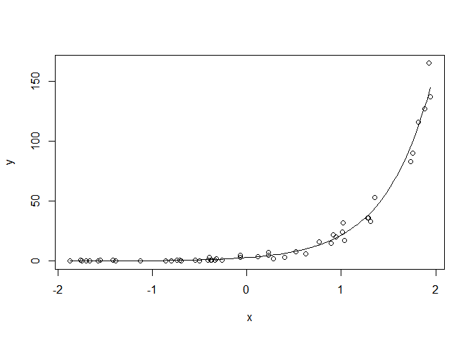
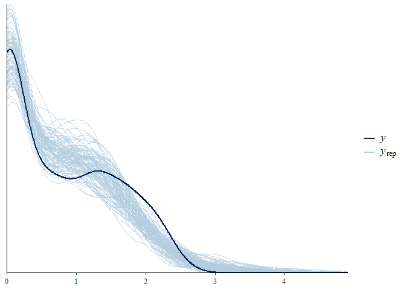
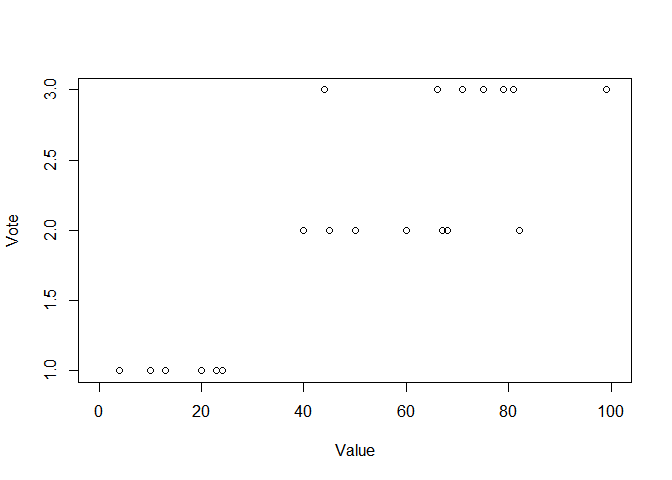

#15.2 Poisson and negative binomial regression

```r
n <- 50
x <- runif(n, -2, 2)
a <- 1
b <- 2
linpred <- a + b*x
y <- rpois(n, exp(linpred))
fake <- data.frame(x=x, y=y)
fit_fake <- stan_glm(y ~ x, family=poisson(link="log"), data=fake)
```

```
## 
## SAMPLING FOR MODEL 'count' NOW (CHAIN 1).
## Chain 1: 
## Chain 1: Gradient evaluation took 0 seconds
## Chain 1: 1000 transitions using 10 leapfrog steps per transition would take 0 seconds.
## Chain 1: Adjust your expectations accordingly!
## Chain 1: 
## Chain 1: 
## Chain 1: Iteration:    1 / 2000 [  0%]  (Warmup)
## Chain 1: Iteration:  200 / 2000 [ 10%]  (Warmup)
## Chain 1: Iteration:  400 / 2000 [ 20%]  (Warmup)
## Chain 1: Iteration:  600 / 2000 [ 30%]  (Warmup)
## Chain 1: Iteration:  800 / 2000 [ 40%]  (Warmup)
## Chain 1: Iteration: 1000 / 2000 [ 50%]  (Warmup)
## Chain 1: Iteration: 1001 / 2000 [ 50%]  (Sampling)
## Chain 1: Iteration: 1200 / 2000 [ 60%]  (Sampling)
## Chain 1: Iteration: 1400 / 2000 [ 70%]  (Sampling)
## Chain 1: Iteration: 1600 / 2000 [ 80%]  (Sampling)
## Chain 1: Iteration: 1800 / 2000 [ 90%]  (Sampling)
## Chain 1: Iteration: 2000 / 2000 [100%]  (Sampling)
## Chain 1: 
## Chain 1:  Elapsed Time: 0.225 seconds (Warm-up)
## Chain 1:                0.236 seconds (Sampling)
## Chain 1:                0.461 seconds (Total)
## Chain 1: 
## 
## SAMPLING FOR MODEL 'count' NOW (CHAIN 2).
## Chain 2: 
## Chain 2: Gradient evaluation took 0 seconds
## Chain 2: 1000 transitions using 10 leapfrog steps per transition would take 0 seconds.
## Chain 2: Adjust your expectations accordingly!
## Chain 2: 
## Chain 2: 
## Chain 2: Iteration:    1 / 2000 [  0%]  (Warmup)
## Chain 2: Iteration:  200 / 2000 [ 10%]  (Warmup)
## Chain 2: Iteration:  400 / 2000 [ 20%]  (Warmup)
## Chain 2: Iteration:  600 / 2000 [ 30%]  (Warmup)
## Chain 2: Iteration:  800 / 2000 [ 40%]  (Warmup)
## Chain 2: Iteration: 1000 / 2000 [ 50%]  (Warmup)
## Chain 2: Iteration: 1001 / 2000 [ 50%]  (Sampling)
## Chain 2: Iteration: 1200 / 2000 [ 60%]  (Sampling)
## Chain 2: Iteration: 1400 / 2000 [ 70%]  (Sampling)
## Chain 2: Iteration: 1600 / 2000 [ 80%]  (Sampling)
## Chain 2: Iteration: 1800 / 2000 [ 90%]  (Sampling)
## Chain 2: Iteration: 2000 / 2000 [100%]  (Sampling)
## Chain 2: 
## Chain 2:  Elapsed Time: 0.231 seconds (Warm-up)
## Chain 2:                0.291 seconds (Sampling)
## Chain 2:                0.522 seconds (Total)
## Chain 2: 
## 
## SAMPLING FOR MODEL 'count' NOW (CHAIN 3).
## Chain 3: 
## Chain 3: Gradient evaluation took 0 seconds
## Chain 3: 1000 transitions using 10 leapfrog steps per transition would take 0 seconds.
## Chain 3: Adjust your expectations accordingly!
## Chain 3: 
## Chain 3: 
## Chain 3: Iteration:    1 / 2000 [  0%]  (Warmup)
## Chain 3: Iteration:  200 / 2000 [ 10%]  (Warmup)
## Chain 3: Iteration:  400 / 2000 [ 20%]  (Warmup)
## Chain 3: Iteration:  600 / 2000 [ 30%]  (Warmup)
## Chain 3: Iteration:  800 / 2000 [ 40%]  (Warmup)
## Chain 3: Iteration: 1000 / 2000 [ 50%]  (Warmup)
## Chain 3: Iteration: 1001 / 2000 [ 50%]  (Sampling)
## Chain 3: Iteration: 1200 / 2000 [ 60%]  (Sampling)
## Chain 3: Iteration: 1400 / 2000 [ 70%]  (Sampling)
## Chain 3: Iteration: 1600 / 2000 [ 80%]  (Sampling)
## Chain 3: Iteration: 1800 / 2000 [ 90%]  (Sampling)
## Chain 3: Iteration: 2000 / 2000 [100%]  (Sampling)
## Chain 3: 
## Chain 3:  Elapsed Time: 0.192 seconds (Warm-up)
## Chain 3:                0.2 seconds (Sampling)
## Chain 3:                0.392 seconds (Total)
## Chain 3: 
## 
## SAMPLING FOR MODEL 'count' NOW (CHAIN 4).
## Chain 4: 
## Chain 4: Gradient evaluation took 0 seconds
## Chain 4: 1000 transitions using 10 leapfrog steps per transition would take 0 seconds.
## Chain 4: Adjust your expectations accordingly!
## Chain 4: 
## Chain 4: 
## Chain 4: Iteration:    1 / 2000 [  0%]  (Warmup)
## Chain 4: Iteration:  200 / 2000 [ 10%]  (Warmup)
## Chain 4: Iteration:  400 / 2000 [ 20%]  (Warmup)
## Chain 4: Iteration:  600 / 2000 [ 30%]  (Warmup)
## Chain 4: Iteration:  800 / 2000 [ 40%]  (Warmup)
## Chain 4: Iteration: 1000 / 2000 [ 50%]  (Warmup)
## Chain 4: Iteration: 1001 / 2000 [ 50%]  (Sampling)
## Chain 4: Iteration: 1200 / 2000 [ 60%]  (Sampling)
## Chain 4: Iteration: 1400 / 2000 [ 70%]  (Sampling)
## Chain 4: Iteration: 1600 / 2000 [ 80%]  (Sampling)
## Chain 4: Iteration: 1800 / 2000 [ 90%]  (Sampling)
## Chain 4: Iteration: 2000 / 2000 [100%]  (Sampling)
## Chain 4: 
## Chain 4:  Elapsed Time: 0.183 seconds (Warm-up)
## Chain 4:                0.27 seconds (Sampling)
## Chain 4:                0.453 seconds (Total)
## Chain 4:
```

```r
print(fit_fake)
```

```
## stan_glm
##  family:       poisson [log]
##  formula:      y ~ x
##  observations: 50
##  predictors:   2
## ------
##             Median MAD_SD
## (Intercept) 1.1    0.1   
## x           2.0    0.1   
## 
## ------
## * For help interpreting the printed output see ?print.stanreg
## * For info on the priors used see ?prior_summary.stanreg
```

```r
plot(x, y)
curve(exp(coef(fit_fake)[1] + coef(fit_fake)[2]*x), add=TRUE)
```

<!-- -->

```r
roaches <- here("..", "Roaches", "data", "roaches.csv")
roaches <- read.csv(roaches)
roaches$roach100 <- roaches$roach1/100
fit_1 <- stan_glm(y ~ roach100 + treatment + senior, family=neg_binomial_2,
                  offset=log(exposure2), data=roaches)
```

```
## 
## SAMPLING FOR MODEL 'count' NOW (CHAIN 1).
## Chain 1: 
## Chain 1: Gradient evaluation took 0.001 seconds
## Chain 1: 1000 transitions using 10 leapfrog steps per transition would take 10 seconds.
## Chain 1: Adjust your expectations accordingly!
## Chain 1: 
## Chain 1: 
## Chain 1: Iteration:    1 / 2000 [  0%]  (Warmup)
## Chain 1: Iteration:  200 / 2000 [ 10%]  (Warmup)
## Chain 1: Iteration:  400 / 2000 [ 20%]  (Warmup)
## Chain 1: Iteration:  600 / 2000 [ 30%]  (Warmup)
## Chain 1: Iteration:  800 / 2000 [ 40%]  (Warmup)
## Chain 1: Iteration: 1000 / 2000 [ 50%]  (Warmup)
## Chain 1: Iteration: 1001 / 2000 [ 50%]  (Sampling)
## Chain 1: Iteration: 1200 / 2000 [ 60%]  (Sampling)
## Chain 1: Iteration: 1400 / 2000 [ 70%]  (Sampling)
## Chain 1: Iteration: 1600 / 2000 [ 80%]  (Sampling)
## Chain 1: Iteration: 1800 / 2000 [ 90%]  (Sampling)
## Chain 1: Iteration: 2000 / 2000 [100%]  (Sampling)
## Chain 1: 
## Chain 1:  Elapsed Time: 1.876 seconds (Warm-up)
## Chain 1:                1.808 seconds (Sampling)
## Chain 1:                3.684 seconds (Total)
## Chain 1: 
## 
## SAMPLING FOR MODEL 'count' NOW (CHAIN 2).
## Chain 2: 
## Chain 2: Gradient evaluation took 0 seconds
## Chain 2: 1000 transitions using 10 leapfrog steps per transition would take 0 seconds.
## Chain 2: Adjust your expectations accordingly!
## Chain 2: 
## Chain 2: 
## Chain 2: Iteration:    1 / 2000 [  0%]  (Warmup)
## Chain 2: Iteration:  200 / 2000 [ 10%]  (Warmup)
## Chain 2: Iteration:  400 / 2000 [ 20%]  (Warmup)
## Chain 2: Iteration:  600 / 2000 [ 30%]  (Warmup)
## Chain 2: Iteration:  800 / 2000 [ 40%]  (Warmup)
## Chain 2: Iteration: 1000 / 2000 [ 50%]  (Warmup)
## Chain 2: Iteration: 1001 / 2000 [ 50%]  (Sampling)
## Chain 2: Iteration: 1200 / 2000 [ 60%]  (Sampling)
## Chain 2: Iteration: 1400 / 2000 [ 70%]  (Sampling)
## Chain 2: Iteration: 1600 / 2000 [ 80%]  (Sampling)
## Chain 2: Iteration: 1800 / 2000 [ 90%]  (Sampling)
## Chain 2: Iteration: 2000 / 2000 [100%]  (Sampling)
## Chain 2: 
## Chain 2:  Elapsed Time: 2.799 seconds (Warm-up)
## Chain 2:                1.981 seconds (Sampling)
## Chain 2:                4.78 seconds (Total)
## Chain 2: 
## 
## SAMPLING FOR MODEL 'count' NOW (CHAIN 3).
## Chain 3: 
## Chain 3: Gradient evaluation took 0 seconds
## Chain 3: 1000 transitions using 10 leapfrog steps per transition would take 0 seconds.
## Chain 3: Adjust your expectations accordingly!
## Chain 3: 
## Chain 3: 
## Chain 3: Iteration:    1 / 2000 [  0%]  (Warmup)
## Chain 3: Iteration:  200 / 2000 [ 10%]  (Warmup)
## Chain 3: Iteration:  400 / 2000 [ 20%]  (Warmup)
## Chain 3: Iteration:  600 / 2000 [ 30%]  (Warmup)
## Chain 3: Iteration:  800 / 2000 [ 40%]  (Warmup)
## Chain 3: Iteration: 1000 / 2000 [ 50%]  (Warmup)
## Chain 3: Iteration: 1001 / 2000 [ 50%]  (Sampling)
## Chain 3: Iteration: 1200 / 2000 [ 60%]  (Sampling)
## Chain 3: Iteration: 1400 / 2000 [ 70%]  (Sampling)
## Chain 3: Iteration: 1600 / 2000 [ 80%]  (Sampling)
## Chain 3: Iteration: 1800 / 2000 [ 90%]  (Sampling)
## Chain 3: Iteration: 2000 / 2000 [100%]  (Sampling)
## Chain 3: 
## Chain 3:  Elapsed Time: 2.103 seconds (Warm-up)
## Chain 3:                2.273 seconds (Sampling)
## Chain 3:                4.376 seconds (Total)
## Chain 3: 
## 
## SAMPLING FOR MODEL 'count' NOW (CHAIN 4).
## Chain 4: 
## Chain 4: Gradient evaluation took 0 seconds
## Chain 4: 1000 transitions using 10 leapfrog steps per transition would take 0 seconds.
## Chain 4: Adjust your expectations accordingly!
## Chain 4: 
## Chain 4: 
## Chain 4: Iteration:    1 / 2000 [  0%]  (Warmup)
## Chain 4: Iteration:  200 / 2000 [ 10%]  (Warmup)
## Chain 4: Iteration:  400 / 2000 [ 20%]  (Warmup)
## Chain 4: Iteration:  600 / 2000 [ 30%]  (Warmup)
## Chain 4: Iteration:  800 / 2000 [ 40%]  (Warmup)
## Chain 4: Iteration: 1000 / 2000 [ 50%]  (Warmup)
## Chain 4: Iteration: 1001 / 2000 [ 50%]  (Sampling)
## Chain 4: Iteration: 1200 / 2000 [ 60%]  (Sampling)
## Chain 4: Iteration: 1400 / 2000 [ 70%]  (Sampling)
## Chain 4: Iteration: 1600 / 2000 [ 80%]  (Sampling)
## Chain 4: Iteration: 1800 / 2000 [ 90%]  (Sampling)
## Chain 4: Iteration: 2000 / 2000 [100%]  (Sampling)
## Chain 4: 
## Chain 4:  Elapsed Time: 1.721 seconds (Warm-up)
## Chain 4:                1.6 seconds (Sampling)
## Chain 4:                3.321 seconds (Total)
## Chain 4:
```

```r
print(fit_1, digits=2)
```

```
## stan_glm
##  family:       neg_binomial_2 [log]
##  formula:      y ~ roach100 + treatment + senior
##  observations: 262
##  predictors:   4
## ------
##             Median MAD_SD
## (Intercept)  2.84   0.23 
## roach100     1.31   0.24 
## treatment   -0.78   0.24 
## senior      -0.33   0.26 
## 
## Auxiliary parameter(s):
##                       Median MAD_SD
## reciprocal_dispersion 0.27   0.03  
## 
## ------
## * For help interpreting the printed output see ?print.stanreg
## * For info on the priors used see ?prior_summary.stanreg
```

```r
yrep_1 <- posterior_predict(fit_1)
n_sims <- nrow(yrep_1)
subset <- sample(n_sims, 100)
ppc_dens_overlay(log10(roaches$y+1), log10(yrep_1[subset,]+1))
```

<!-- -->

```r
test <- function (y){
  mean(y==0)
}
test_rep_1 <- apply(yrep_1, 1, test)

fit_2 <- stan_glm(y ~ roach100 + treatment + senior, family=poisson,
                  offset=log(exposure2), data=roaches)
```

```
## 
## SAMPLING FOR MODEL 'count' NOW (CHAIN 1).
## Chain 1: 
## Chain 1: Gradient evaluation took 0 seconds
## Chain 1: 1000 transitions using 10 leapfrog steps per transition would take 0 seconds.
## Chain 1: Adjust your expectations accordingly!
## Chain 1: 
## Chain 1: 
## Chain 1: Iteration:    1 / 2000 [  0%]  (Warmup)
## Chain 1: Iteration:  200 / 2000 [ 10%]  (Warmup)
## Chain 1: Iteration:  400 / 2000 [ 20%]  (Warmup)
## Chain 1: Iteration:  600 / 2000 [ 30%]  (Warmup)
## Chain 1: Iteration:  800 / 2000 [ 40%]  (Warmup)
## Chain 1: Iteration: 1000 / 2000 [ 50%]  (Warmup)
## Chain 1: Iteration: 1001 / 2000 [ 50%]  (Sampling)
## Chain 1: Iteration: 1200 / 2000 [ 60%]  (Sampling)
## Chain 1: Iteration: 1400 / 2000 [ 70%]  (Sampling)
## Chain 1: Iteration: 1600 / 2000 [ 80%]  (Sampling)
## Chain 1: Iteration: 1800 / 2000 [ 90%]  (Sampling)
## Chain 1: Iteration: 2000 / 2000 [100%]  (Sampling)
## Chain 1: 
## Chain 1:  Elapsed Time: 0.881 seconds (Warm-up)
## Chain 1:                1.182 seconds (Sampling)
## Chain 1:                2.063 seconds (Total)
## Chain 1: 
## 
## SAMPLING FOR MODEL 'count' NOW (CHAIN 2).
## Chain 2: 
## Chain 2: Gradient evaluation took 0 seconds
## Chain 2: 1000 transitions using 10 leapfrog steps per transition would take 0 seconds.
## Chain 2: Adjust your expectations accordingly!
## Chain 2: 
## Chain 2: 
## Chain 2: Iteration:    1 / 2000 [  0%]  (Warmup)
## Chain 2: Iteration:  200 / 2000 [ 10%]  (Warmup)
## Chain 2: Iteration:  400 / 2000 [ 20%]  (Warmup)
## Chain 2: Iteration:  600 / 2000 [ 30%]  (Warmup)
## Chain 2: Iteration:  800 / 2000 [ 40%]  (Warmup)
## Chain 2: Iteration: 1000 / 2000 [ 50%]  (Warmup)
## Chain 2: Iteration: 1001 / 2000 [ 50%]  (Sampling)
## Chain 2: Iteration: 1200 / 2000 [ 60%]  (Sampling)
## Chain 2: Iteration: 1400 / 2000 [ 70%]  (Sampling)
## Chain 2: Iteration: 1600 / 2000 [ 80%]  (Sampling)
## Chain 2: Iteration: 1800 / 2000 [ 90%]  (Sampling)
## Chain 2: Iteration: 2000 / 2000 [100%]  (Sampling)
## Chain 2: 
## Chain 2:  Elapsed Time: 0.959 seconds (Warm-up)
## Chain 2:                0.725 seconds (Sampling)
## Chain 2:                1.684 seconds (Total)
## Chain 2: 
## 
## SAMPLING FOR MODEL 'count' NOW (CHAIN 3).
## Chain 3: 
## Chain 3: Gradient evaluation took 0 seconds
## Chain 3: 1000 transitions using 10 leapfrog steps per transition would take 0 seconds.
## Chain 3: Adjust your expectations accordingly!
## Chain 3: 
## Chain 3: 
## Chain 3: Iteration:    1 / 2000 [  0%]  (Warmup)
## Chain 3: Iteration:  200 / 2000 [ 10%]  (Warmup)
## Chain 3: Iteration:  400 / 2000 [ 20%]  (Warmup)
## Chain 3: Iteration:  600 / 2000 [ 30%]  (Warmup)
## Chain 3: Iteration:  800 / 2000 [ 40%]  (Warmup)
## Chain 3: Iteration: 1000 / 2000 [ 50%]  (Warmup)
## Chain 3: Iteration: 1001 / 2000 [ 50%]  (Sampling)
## Chain 3: Iteration: 1200 / 2000 [ 60%]  (Sampling)
## Chain 3: Iteration: 1400 / 2000 [ 70%]  (Sampling)
## Chain 3: Iteration: 1600 / 2000 [ 80%]  (Sampling)
## Chain 3: Iteration: 1800 / 2000 [ 90%]  (Sampling)
## Chain 3: Iteration: 2000 / 2000 [100%]  (Sampling)
## Chain 3: 
## Chain 3:  Elapsed Time: 0.721 seconds (Warm-up)
## Chain 3:                0.795 seconds (Sampling)
## Chain 3:                1.516 seconds (Total)
## Chain 3: 
## 
## SAMPLING FOR MODEL 'count' NOW (CHAIN 4).
## Chain 4: 
## Chain 4: Gradient evaluation took 0 seconds
## Chain 4: 1000 transitions using 10 leapfrog steps per transition would take 0 seconds.
## Chain 4: Adjust your expectations accordingly!
## Chain 4: 
## Chain 4: 
## Chain 4: Iteration:    1 / 2000 [  0%]  (Warmup)
## Chain 4: Iteration:  200 / 2000 [ 10%]  (Warmup)
## Chain 4: Iteration:  400 / 2000 [ 20%]  (Warmup)
## Chain 4: Iteration:  600 / 2000 [ 30%]  (Warmup)
## Chain 4: Iteration:  800 / 2000 [ 40%]  (Warmup)
## Chain 4: Iteration: 1000 / 2000 [ 50%]  (Warmup)
## Chain 4: Iteration: 1001 / 2000 [ 50%]  (Sampling)
## Chain 4: Iteration: 1200 / 2000 [ 60%]  (Sampling)
## Chain 4: Iteration: 1400 / 2000 [ 70%]  (Sampling)
## Chain 4: Iteration: 1600 / 2000 [ 80%]  (Sampling)
## Chain 4: Iteration: 1800 / 2000 [ 90%]  (Sampling)
## Chain 4: Iteration: 2000 / 2000 [100%]  (Sampling)
## Chain 4: 
## Chain 4:  Elapsed Time: 0.675 seconds (Warm-up)
## Chain 4:                0.62 seconds (Sampling)
## Chain 4:                1.295 seconds (Total)
## Chain 4:
```

```r
yrep_2 <- posterior_predict(fit_2)
print(mean(roaches$y==0))
```

```
## [1] 0.3587786
```

```r
print(mean(yrep_2==0))
```

```
## [1] 0.0006755725
```

```r
test_rep_2 <- apply(yrep_2, 1, test)
```

#15.3 Logistic-binomial model

```r
N <- 100
height <- rnorm(N, 72, 3)
p <- 0.4 + 0.1*(height - 72)/3
n <- rep(20, N)
y <- rbinom(N, n, p)
data <- data.frame(n=n, y=y, height=height)
fit_1a <- stan_glm(cbind(y, n-y) ~ height, family=binomial(link="logit"),
                   data=data)
```

```
## 
## SAMPLING FOR MODEL 'binomial' NOW (CHAIN 1).
## Chain 1: 
## Chain 1: Gradient evaluation took 0.001 seconds
## Chain 1: 1000 transitions using 10 leapfrog steps per transition would take 10 seconds.
## Chain 1: Adjust your expectations accordingly!
## Chain 1: 
## Chain 1: 
## Chain 1: Iteration:    1 / 2000 [  0%]  (Warmup)
## Chain 1: Iteration:  200 / 2000 [ 10%]  (Warmup)
## Chain 1: Iteration:  400 / 2000 [ 20%]  (Warmup)
## Chain 1: Iteration:  600 / 2000 [ 30%]  (Warmup)
## Chain 1: Iteration:  800 / 2000 [ 40%]  (Warmup)
## Chain 1: Iteration: 1000 / 2000 [ 50%]  (Warmup)
## Chain 1: Iteration: 1001 / 2000 [ 50%]  (Sampling)
## Chain 1: Iteration: 1200 / 2000 [ 60%]  (Sampling)
## Chain 1: Iteration: 1400 / 2000 [ 70%]  (Sampling)
## Chain 1: Iteration: 1600 / 2000 [ 80%]  (Sampling)
## Chain 1: Iteration: 1800 / 2000 [ 90%]  (Sampling)
## Chain 1: Iteration: 2000 / 2000 [100%]  (Sampling)
## Chain 1: 
## Chain 1:  Elapsed Time: 1.61 seconds (Warm-up)
## Chain 1:                1.402 seconds (Sampling)
## Chain 1:                3.012 seconds (Total)
## Chain 1: 
## 
## SAMPLING FOR MODEL 'binomial' NOW (CHAIN 2).
## Chain 2: 
## Chain 2: Gradient evaluation took 0.001 seconds
## Chain 2: 1000 transitions using 10 leapfrog steps per transition would take 10 seconds.
## Chain 2: Adjust your expectations accordingly!
## Chain 2: 
## Chain 2: 
## Chain 2: Iteration:    1 / 2000 [  0%]  (Warmup)
## Chain 2: Iteration:  200 / 2000 [ 10%]  (Warmup)
## Chain 2: Iteration:  400 / 2000 [ 20%]  (Warmup)
## Chain 2: Iteration:  600 / 2000 [ 30%]  (Warmup)
## Chain 2: Iteration:  800 / 2000 [ 40%]  (Warmup)
## Chain 2: Iteration: 1000 / 2000 [ 50%]  (Warmup)
## Chain 2: Iteration: 1001 / 2000 [ 50%]  (Sampling)
## Chain 2: Iteration: 1200 / 2000 [ 60%]  (Sampling)
## Chain 2: Iteration: 1400 / 2000 [ 70%]  (Sampling)
## Chain 2: Iteration: 1600 / 2000 [ 80%]  (Sampling)
## Chain 2: Iteration: 1800 / 2000 [ 90%]  (Sampling)
## Chain 2: Iteration: 2000 / 2000 [100%]  (Sampling)
## Chain 2: 
## Chain 2:  Elapsed Time: 1.138 seconds (Warm-up)
## Chain 2:                1.067 seconds (Sampling)
## Chain 2:                2.205 seconds (Total)
## Chain 2: 
## 
## SAMPLING FOR MODEL 'binomial' NOW (CHAIN 3).
## Chain 3: 
## Chain 3: Gradient evaluation took 0.001 seconds
## Chain 3: 1000 transitions using 10 leapfrog steps per transition would take 10 seconds.
## Chain 3: Adjust your expectations accordingly!
## Chain 3: 
## Chain 3: 
## Chain 3: Iteration:    1 / 2000 [  0%]  (Warmup)
## Chain 3: Iteration:  200 / 2000 [ 10%]  (Warmup)
## Chain 3: Iteration:  400 / 2000 [ 20%]  (Warmup)
## Chain 3: Iteration:  600 / 2000 [ 30%]  (Warmup)
## Chain 3: Iteration:  800 / 2000 [ 40%]  (Warmup)
## Chain 3: Iteration: 1000 / 2000 [ 50%]  (Warmup)
## Chain 3: Iteration: 1001 / 2000 [ 50%]  (Sampling)
## Chain 3: Iteration: 1200 / 2000 [ 60%]  (Sampling)
## Chain 3: Iteration: 1400 / 2000 [ 70%]  (Sampling)
## Chain 3: Iteration: 1600 / 2000 [ 80%]  (Sampling)
## Chain 3: Iteration: 1800 / 2000 [ 90%]  (Sampling)
## Chain 3: Iteration: 2000 / 2000 [100%]  (Sampling)
## Chain 3: 
## Chain 3:  Elapsed Time: 1.142 seconds (Warm-up)
## Chain 3:                1.183 seconds (Sampling)
## Chain 3:                2.325 seconds (Total)
## Chain 3: 
## 
## SAMPLING FOR MODEL 'binomial' NOW (CHAIN 4).
## Chain 4: 
## Chain 4: Gradient evaluation took 0.001 seconds
## Chain 4: 1000 transitions using 10 leapfrog steps per transition would take 10 seconds.
## Chain 4: Adjust your expectations accordingly!
## Chain 4: 
## Chain 4: 
## Chain 4: Iteration:    1 / 2000 [  0%]  (Warmup)
## Chain 4: Iteration:  200 / 2000 [ 10%]  (Warmup)
## Chain 4: Iteration:  400 / 2000 [ 20%]  (Warmup)
## Chain 4: Iteration:  600 / 2000 [ 30%]  (Warmup)
## Chain 4: Iteration:  800 / 2000 [ 40%]  (Warmup)
## Chain 4: Iteration: 1000 / 2000 [ 50%]  (Warmup)
## Chain 4: Iteration: 1001 / 2000 [ 50%]  (Sampling)
## Chain 4: Iteration: 1200 / 2000 [ 60%]  (Sampling)
## Chain 4: Iteration: 1400 / 2000 [ 70%]  (Sampling)
## Chain 4: Iteration: 1600 / 2000 [ 80%]  (Sampling)
## Chain 4: Iteration: 1800 / 2000 [ 90%]  (Sampling)
## Chain 4: Iteration: 2000 / 2000 [100%]  (Sampling)
## Chain 4: 
## Chain 4:  Elapsed Time: 1.25 seconds (Warm-up)
## Chain 4:                1.327 seconds (Sampling)
## Chain 4:                2.577 seconds (Total)
## Chain 4:
```

```r
print(fit_1a)
```

```
## stan_glm
##  family:       binomial [logit]
##  formula:      cbind(y, n - y) ~ height
##  observations: 100
##  predictors:   2
## ------
##             Median MAD_SD
## (Intercept) -11.7    1.1 
## height        0.2    0.0 
## 
## ------
## * For help interpreting the printed output see ?print.stanreg
## * For info on the priors used see ?prior_summary.stanreg
```

#15.4 Probit regression: normally distributed latent data

```r
wells <- here("..", "Arsenic", "data", "wells.csv")
wells <- read.csv(wells)
wells
```

```
##      switch arsenic    dist dist100 assoc educ educ4
## 1         1    2.36  16.826 0.16826     0    0  0.00
## 2         1    0.71  47.322 0.47322     0    0  0.00
## 3         0    2.07  20.967 0.20967     0   10  2.50
## 4         1    1.15  21.486 0.21486     0   12  3.00
## 5         1    1.10  40.874 0.40874     1   14  3.50
## 6         1    3.90  69.518 0.69518     1    9  2.25
## 7         1    2.97  80.711 0.80711     1    4  1.00
## 8         1    3.24  55.146 0.55146     0   10  2.50
## 9         1    3.28  52.647 0.52647     1    0  0.00
## 10        1    2.52  75.072 0.75072     1    0  0.00
## 11        1    3.13  29.774 0.29774     1    5  1.25
## 12        1    3.04  34.504 0.34504     0    0  0.00
## 13        1    2.91  63.804 0.63804     1    0  0.00
## 14        1    3.21  73.604 0.73604     1    0  0.00
## 15        1    1.70  67.655 0.67655     1    0  0.00
## 16        1    1.80  80.660 0.80660     1    7  1.75
## 17        1    1.44  52.182 0.52182     0    7  1.75
## 18        1    1.43  52.182 0.52182     1    7  1.75
## 19        1    2.33  50.534 0.50534     1    0  0.00
## 20        1    2.83  31.422 0.31422     0   10  2.50
## 21        1    1.79  33.009 0.33009     1    7  1.75
## 22        1    2.54  37.871 0.37871     0    0  0.00
## 23        1    2.25  48.373 0.48373     1    5  1.25
## 24        1    2.42  47.309 0.47309     0    0  0.00
## 25        1    1.62  67.785 0.67785     0    8  2.00
## 26        1    2.34  81.138 0.81138     1    8  2.00
## 27        1    3.49  95.460 0.95460     0   10  2.50
## 28        1    2.13 114.418 1.14418     0   16  4.00
## 29        1    0.93 157.629 1.57629     1   10  2.50
## 30        1    3.36 151.920 1.51920     1   10  2.50
## 31        1    1.49 107.691 1.07691     0   10  2.50
## 32        1    0.83 105.668 1.05668     0   10  2.50
## 33        1    1.37 105.626 1.05626     1    0  0.00
## 34        0    2.80 107.691 1.07691     0    0  0.00
## 35        0    0.81 107.691 1.07691     0    0  0.00
## 36        1    1.48 125.317 1.25317     1    3  0.75
## 37        0    1.92 107.691 1.07691     1    0  0.00
## 38        1    2.74 107.691 1.07691     0   10  2.50
## 39        1    2.49 107.691 1.07691     1    0  0.00
## 40        0    3.95 107.691 1.07691     0    0  0.00
## 41        1    2.75 107.691 1.07691     0    0  0.00
## 42        1    2.91  54.570 0.54570     0    0  0.00
## 43        1    0.83  54.570 0.54570     0    0  0.00
## 44        1    3.67  54.570 0.54570     1    5  1.25
## 45        1    2.90  54.570 0.54570     0    0  0.00
## 46        1    0.78  54.570 0.54570     1   10  2.50
## 47        0    2.52   3.618 0.03618     1    5  1.25
## 48        1    2.48  58.167 0.58167     0    0  0.00
## 49        1    4.47  72.346 0.72346     0    8  2.00
## 50        1    1.52  40.318 0.40318     0    0  0.00
## 51        1    1.80  67.219 0.67219     0    0  0.00
## 52        0    0.51  99.013 0.99013     0    0  0.00
## 53        1    0.64 115.913 1.15913     1    0  0.00
## 54        1    1.01  71.799 0.71799     1    5  1.25
## 55        1    0.74 141.536 1.41536     0    8  2.00
## 56        1    1.81  84.646 0.84646     1    0  0.00
## 57        1    2.69  65.932 0.65932     0    0  0.00
## 58        1    4.85  67.940 0.67940     1    0  0.00
## 59        1    3.18  64.698 0.64698     0    6  1.50
## 60        1    5.06  62.635 0.62635     1   10  2.50
## 61        1    2.69  47.909 0.47909     0   10  2.50
## 62        1    0.57  24.003 0.24003     0   12  3.00
## 63        1    4.55  17.982 0.17982     0    7  1.75
## 64        0    3.91  11.147 0.11147     1    6  1.50
## 65        1    0.89  39.977 0.39977     1    5  1.25
## 66        0    1.00  69.131 0.69131     0    0  0.00
## 67        1    0.95  37.653 0.37653     1    0  0.00
## 68        1    3.55  32.071 0.32071     1    7  1.75
## 69        1    4.52  19.084 0.19084     0    5  1.25
## 70        1    4.76  23.912 0.23912     0    0  0.00
## 71        1    1.99  28.560 0.28560     1    5  1.25
## 72        0    2.85  21.965 0.21965     0    0  0.00
## 73        0    0.81  91.007 0.91007     0    0  0.00
## 74        1    2.85  26.513 0.26513     1    8  2.00
## 75        1    2.18  23.324 0.23324     0    3  0.75
## 76        1    4.23  31.592 0.31592     0    5  1.25
## 77        1    1.92  31.324 0.31324     1    0  0.00
## 78        1    1.63  38.849 0.38849     0    8  2.00
## 79        1    5.45   9.126 0.09126     1    0  0.00
## 80        0    1.57  19.382 0.19382     0    8  2.00
## 81        1    1.94  12.461 0.12461     0    8  2.00
## 82        1    1.58  14.937 0.14937     0    0  0.00
## 83        1    0.67  13.219 0.13219     1    5  1.25
## 84        1    1.40   6.830 0.06830     0    5  1.25
## 85        0    1.18  30.406 0.30406     1    3  0.75
## 86        0    0.77  18.551 0.18551     1    5  1.25
## 87        0    0.77  24.829 0.24829     0    0  0.00
## 88        1    1.44  28.671 0.28671     0   12  3.00
## 89        0    0.77  20.871 0.20871     1    5  1.25
## 90        1    0.77  20.120 0.20120     1    0  0.00
## 91        0    0.73  13.494 0.13494     1    5  1.25
## 92        1    1.90  19.192 0.19192     0    0  0.00
## 93        0    0.72  28.646 0.28646     0    8  2.00
## 94        0    0.88  16.166 0.16166     0    0  0.00
## 95        0    1.04  27.428 0.27428     0    5  1.25
## 96        0    1.21  15.839 0.15839     1    0  0.00
## 97        1    1.44  14.418 0.14418     1    5  1.25
## 98        0    0.64  29.278 0.29278     1   14  3.50
## 99        0    0.80  43.944 0.43944     1   14  3.50
## 100       1    1.93  20.230 0.20230     0    0  0.00
## 101       0    0.56  50.092 0.50092     0    5  1.25
## 102       0    1.32  66.880 0.66880     0    5  1.25
## 103       0    0.52  69.482 0.69482     0    3  0.75
## 104       0    1.19  48.708 0.48708     1    5  1.25
## 105       0    1.18  22.636 0.22636     1   12  3.00
## 106       0    1.26  10.123 0.10123     0    5  1.25
## 107       0    0.88  42.828 0.42828     0    8  2.00
## 108       0    3.16  21.089 0.21089     0    5  1.25
## 109       0    2.12  47.534 0.47534     0    5  1.25
## 110       1    0.76  15.712 0.15712     0    5  1.25
## 111       0    0.56  12.185 0.12185     0    5  1.25
## 112       0    0.62  23.559 0.23559     0    0  0.00
## 113       1    1.03   1.848 0.01848     0    5  1.25
## 114       0    0.78  90.921 0.90921     0    5  1.25
## 115       0    1.02  93.828 0.93828     1    5  1.25
## 116       0    0.65  82.106 0.82106     1    9  2.25
## 117       1    2.29  46.956 0.46956     1    3  0.75
## 118       1    1.60  24.210 0.24210     1    4  1.00
## 119       1    0.82  43.290 0.43290     0    5  1.25
## 120       1    1.44  25.147 0.25147     0   10  2.50
## 121       1    0.97  14.604 0.14604     0    0  0.00
## 122       0    0.89   1.401 0.01401     0    8  2.00
## 123       1    1.39   8.210 0.08210     0   12  3.00
## 124       1    0.83  18.868 0.18868     0    0  0.00
## 125       1    0.57  23.401 0.23401     0    0  0.00
## 126       1    1.47  18.532 0.18532     1    9  2.25
## 127       1    1.11  36.287 0.36287     0   10  2.50
## 128       1    2.38  40.498 0.40498     0   12  3.00
## 129       0    3.97  90.571 0.90571     0    0  0.00
## 130       1    3.51 115.158 1.15158     1    3  0.75
## 131       0    3.69 112.762 1.12762     1    0  0.00
## 132       1    2.95  93.431 0.93431     1    0  0.00
## 133       0    3.21  97.217 0.97217     0    0  0.00
## 134       1    3.65  88.345 0.88345     1    0  0.00
## 135       1    4.42  41.104 0.41104     1    5  1.25
## 136       1    4.12  46.240 0.46240     0    3  0.75
## 137       1    3.62  65.354 0.65354     1    3  0.75
## 138       1    3.80  43.735 0.43735     1    2  0.50
## 139       1    4.46  61.571 0.61571     0    5  1.25
## 140       1    4.04  78.415 0.78415     1    0  0.00
## 141       1    3.32  63.502 0.63502     0    5  1.25
## 142       0    2.07  69.269 0.69269     1    5  1.25
## 143       1    1.43  57.929 0.57929     1    6  1.50
## 144       1    2.30  85.387 0.85387     0    5  1.25
## 145       1    1.41 110.609 1.10609     0    5  1.25
## 146       1    2.34 111.490 1.11490     1    0  0.00
## 147       1    1.50 176.197 1.76197     0    0  0.00
## 148       0    1.44 172.108 1.72108     0    0  0.00
## 149       0    1.54 177.803 1.77803     0    0  0.00
## 150       1    1.35  22.671 0.22671     1    0  0.00
## 151       1    0.54  27.881 0.27881     1    5  1.25
## 152       1    1.17  19.260 0.19260     0    8  2.00
## 153       0    1.02  24.500 0.24500     0    0  0.00
## 154       1    1.11   6.633 0.06633     0    5  1.25
## 155       0    0.52   7.041 0.07041     0   10  2.50
## 156       0    0.56  30.314 0.30314     1    8  2.00
## 157       1    0.61  21.979 0.21979     1    0  0.00
## 158       1    2.17  10.458 0.10458     1    5  1.25
## 159       0    0.61  74.999 0.74999     0    5  1.25
## 160       1    0.96  81.971 0.81971     1    3  0.75
## 161       1    0.94  92.176 0.92176     1    5  1.25
## 162       1    0.93 106.608 1.06608     1    3  0.75
## 163       0    1.02 103.061 1.03061     1    4  1.00
## 164       0    1.24  86.605 0.86605     0    0  0.00
## 165       0    1.42 110.562 1.10562     0    5  1.25
## 166       0    1.31 122.326 1.22326     0    5  1.25
## 167       0    0.83 122.019 1.22019     0    0  0.00
## 168       0    2.64  57.633 0.57633     1    2  0.50
## 169       0    1.84  39.596 0.39596     0    5  1.25
## 170       0    2.48  39.516 0.39516     0    0  0.00
## 171       0    1.27  21.555 0.21555     0   10  2.50
## 172       0    0.69  51.748 0.51748     0    0  0.00
## 173       1    0.61  13.521 0.13521     1    5  1.25
## 174       0    0.89  31.454 0.31454     0    5  1.25
## 175       1    0.75  89.431 0.89431     0    5  1.25
## 176       0    0.81  19.264 0.19264     1    0  0.00
## 177       0    1.81  53.363 0.53363     1    9  2.25
## 178       0    1.25  30.129 0.30129     1    0  0.00
## 179       1    1.12  27.137 0.27137     1    9  2.25
## 180       1    0.71  28.712 0.28712     1    0  0.00
## 181       1    2.16  20.640 0.20640     1    0  0.00
## 182       1    1.70  36.750 0.36750     0    5  1.25
## 183       1    1.84  49.680 0.49680     0    5  1.25
## 184       0    1.26 102.711 1.02711     1    0  0.00
## 185       0    2.53 108.616 1.08616     1    0  0.00
## 186       0    2.95  96.436 0.96436     0    0  0.00
## 187       0    0.62 100.861 1.00861     0    0  0.00
## 188       1    3.01 137.900 1.37900     0   10  2.50
## 189       0    2.56 124.671 1.24671     1    5  1.25
## 190       1    1.97 151.066 1.51066     0   10  2.50
## 191       0    1.20 121.576 1.21576     1    5  1.25
## 192       0    0.89  32.850 0.32850     0    0  0.00
## 193       0    0.52   8.547 0.08547     0   10  2.50
## 194       1    2.49  27.974 0.27974     0    4  1.00
## 195       1    1.25  29.458 0.29458     0    0  0.00
## 196       0    1.13  19.660 0.19660     1    5  1.25
## 197       1    1.13  47.709 0.47709     0   12  3.00
## 198       1    0.52  71.523 0.71523     0   10  2.50
## 199       1    0.88  67.176 0.67176     1   10  2.50
## 200       0    3.48  69.967 0.69967     0    5  1.25
## 201       0    0.56  83.572 0.83572     0   10  2.50
## 202       0    1.35  71.425 0.71425     0    5  1.25
## 203       1    1.67  71.425 0.71425     0    0  0.00
## 204       0    1.92  71.425 0.71425     0   10  2.50
## 205       0    2.41 190.288 1.90288     0    7  1.75
## 206       0    2.36 186.305 1.86305     0    5  1.25
## 207       0    2.41 218.300 2.18300     0    0  0.00
## 208       1    1.46  53.544 0.53544     0   14  3.50
## 209       1    2.00  63.602 0.63602     0    0  0.00
## 210       1    1.32  67.493 0.67493     0    5  1.25
## 211       1    1.75  66.736 0.66736     0    5  1.25
## 212       1    1.84  47.996 0.47996     0    0  0.00
## 213       0    1.72  54.416 0.54416     0    5  1.25
## 214       0    1.77  94.723 0.94723     0    5  1.25
## 215       1    2.77  70.774 0.70774     0    7  1.75
## 216       1    0.73  11.249 0.11249     1    0  0.00
## 217       1    0.69   4.880 0.04880     1    0  0.00
## 218       0    0.58  18.143 0.18143     1    5  1.25
## 219       1    0.52  15.779 0.15779     1   12  3.00
## 220       1    0.62   0.387 0.00387     1    5  1.25
## 221       1    3.33  14.965 0.14965     1    5  1.25
## 222       0    0.51  24.677 0.24677     0    0  0.00
## 223       0    1.26  17.507 0.17507     1    0  0.00
## 224       1    0.60  22.882 0.22882     0    5  1.25
## 225       1    0.59   6.796 0.06796     0    5  1.25
## 226       1    0.66   8.996 0.08996     1    0  0.00
## 227       1    0.74   2.409 0.02409     1    0  0.00
## 228       1    0.71   9.306 0.09306     1    0  0.00
## 229       1    0.86  21.996 0.21996     1    7  1.75
## 230       0    0.51  14.077 0.14077     0   10  2.50
## 231       1    0.58  29.649 0.29649     1    5  1.25
## 232       0    0.55  11.377 0.11377     0    5  1.25
## 233       1    1.26  29.541 0.29541     0    0  0.00
## 234       0    0.52  33.367 0.33367     0   10  2.50
## 235       0    0.83  26.715 0.26715     0   10  2.50
## 236       0    0.57  21.118 0.21118     0    5  1.25
## 237       0    0.53  71.482 0.71482     0    0  0.00
## 238       0    0.67  71.637 0.71637     1    0  0.00
## 239       1    3.50  23.831 0.23831     0    5  1.25
## 240       1    2.80   5.728 0.05728     1   12  3.00
## 241       1    0.77  15.815 0.15815     1    5  1.25
## 242       1    0.74  32.587 0.32587     1    5  1.25
## 243       1    0.77  40.131 0.40131     0   10  2.50
## 244       1    1.58  49.638 0.49638     1    2  0.50
## 245       1    0.80  24.887 0.24887     0   10  2.50
## 246       0    0.55  47.671 0.47671     1    0  0.00
## 247       1    0.90  56.591 0.56591     1   10  2.50
## 248       0    0.52  74.117 0.74117     0    8  2.00
## 249       1    2.59  81.849 0.81849     1    0  0.00
## 250       1    1.27  86.094 0.86094     1    8  2.00
## 251       0    0.97  71.806 0.71806     0   14  3.50
## 252       0    1.47  61.745 0.61745     1    4  1.00
## 253       0    1.03  25.045 0.25045     0   12  3.00
## 254       0    0.93  19.929 0.19929     1    2  0.50
## 255       0    0.79  50.119 0.50119     0   10  2.50
## 256       0    0.66  53.816 0.53816     1    5  1.25
## 257       0    0.85  33.503 0.33503     1   10  2.50
## 258       0    0.93  58.356 0.58356     0    5  1.25
## 259       0    1.42  17.954 0.17954     0   12  3.00
## 260       0    0.75  28.027 0.28027     0    4  1.00
## 261       0    1.46  31.668 0.31668     0    8  2.00
## 262       0    1.16  34.437 0.34437     0    5  1.25
## 263       0    1.17  50.952 0.50952     0   15  3.75
## 264       1    0.83  60.753 0.60753     1    0  0.00
## 265       1    1.24  74.877 0.74877     0    5  1.25
## 266       1    3.08  57.960 0.57960     0    5  1.25
## 267       1    3.59  61.624 0.61624     0    0  0.00
## 268       1    1.96  76.066 0.76066     0    7  1.75
## 269       1    1.67 105.867 1.05867     0    5  1.25
## 270       0    1.69 112.675 1.12675     0    0  0.00
## 271       0    2.71 197.135 1.97135     1    5  1.25
## 272       0    1.27 304.097 3.04097     1    5  1.25
## 273       0    1.43 339.531 3.39531     0    4  1.00
## 274       0    1.00  70.271 0.70271     0    5  1.25
## 275       0    0.52  92.744 0.92744     0    5  1.25
## 276       0    0.65  55.921 0.55921     0    9  2.25
## 277       0    0.70  50.829 0.50829     1    0  0.00
## 278       0    0.51  37.601 0.37601     0    0  0.00
## 279       0    1.02  17.931 0.17931     0    0  0.00
## 280       1    2.05  11.817 0.11817     0    5  1.25
## 281       1    0.77  18.797 0.18797     1    0  0.00
## 282       1    1.20  17.575 0.17575     0    5  1.25
## 283       1    0.62  22.443 0.22443     0    5  1.25
## 284       1    1.31  27.026 0.27026     1    5  1.25
## 285       1    1.79  17.140 0.17140     0    0  0.00
## 286       1    0.56  25.454 0.25454     0    0  0.00
## 287       1    0.77  45.576 0.45576     0    5  1.25
## 288       1    0.66  52.761 0.52761     0    0  0.00
## 289       1    1.10  30.541 0.30541     0    0  0.00
## 290       1    0.82  16.399 0.16399     1    5  1.25
## 291       1    2.22  29.319 0.29319     0    5  1.25
## 292       1    2.82  36.061 0.36061     1    0  0.00
## 293       0    0.64  22.607 0.22607     0    6  1.50
## 294       1    1.26  27.141 0.27141     1    6  1.50
## 295       1    1.53   9.447 0.09447     1    5  1.25
## 296       1    1.80  16.697 0.16697     0    0  0.00
## 297       1    1.24  50.477 0.50477     1    8  2.00
## 298       0    0.93   9.224 0.09224     0    5  1.25
## 299       1    0.54   6.931 0.06931     1    6  1.50
## 300       1    0.82  27.292 0.27292     0    5  1.25
## 301       1    0.61  25.295 0.25295     0    5  1.25
## 302       0    0.71  52.712 0.52712     1    5  1.25
## 303       1    0.81  51.729 0.51729     0    4  1.00
## 304       1    0.65  68.572 0.68572     1    4  1.00
## 305       1    0.68  23.679 0.23679     1    0  0.00
## 306       1    1.26  45.202 0.45202     1    9  2.25
## 307       1    0.92   9.169 0.09169     0    5  1.25
## 308       1    1.25  16.371 0.16371     1    0  0.00
## 309       1    1.16  19.417 0.19417     0    5  1.25
## 310       1    0.76  57.793 0.57793     1    5  1.25
## 311       1    1.20  43.272 0.43272     0   10  2.50
## 312       0    0.90  19.840 0.19840     0    9  2.25
## 313       1    0.52   5.180 0.05180     0    5  1.25
## 314       1    0.53  42.685 0.42685     0    8  2.00
## 315       0    0.64   5.162 0.05162     1    8  2.00
## 316       1    1.96  38.964 0.38964     1   10  2.50
## 317       1    0.59  58.098 0.58098     0    9  2.25
## 318       1    1.48  61.590 0.61590     0    9  2.25
## 319       1    1.78  32.594 0.32594     0    0  0.00
## 320       1    1.41  30.164 0.30164     0    5  1.25
## 321       1    1.50  18.522 0.18522     0    5  1.25
## 322       1    1.86  24.775 0.24775     0   12  3.00
## 323       1    1.60  35.436 0.35436     1    5  1.25
## 324       1    0.70  31.341 0.31341     0   10  2.50
## 325       0    0.51  15.571 0.15571     1    5  1.25
## 326       1    2.48  27.173 0.27173     0    0  0.00
## 327       1    0.63  49.034 0.49034     0   10  2.50
## 328       1    1.07 135.320 1.35320     1    0  0.00
## 329       0    0.71  37.778 0.37778     0    7  1.75
## 330       1    1.12   3.779 0.03779     1    8  2.00
## 331       0    0.53  49.169 0.49169     0    0  0.00
## 332       0    0.58  50.724 0.50724     1    0  0.00
## 333       1    1.31  26.217 0.26217     0   12  3.00
## 334       1    1.49  20.914 0.20914     0   12  3.00
## 335       1    0.86   3.312 0.03312     0    5  1.25
## 336       1    0.64  35.715 0.35715     0   10  2.50
## 337       1    1.44  52.292 0.52292     0    0  0.00
## 338       0    1.52  60.146 0.60146     0    5  1.25
## 339       1    1.27  44.461 0.44461     0    0  0.00
## 340       0    2.17  70.022 0.70022     1    0  0.00
## 341       0    1.73  95.808 0.95808     0    5  1.25
## 342       1    1.93 121.764 1.21764     0    9  2.25
## 343       1    2.20 127.566 1.27566     0    5  1.25
## 344       1    1.60 120.153 1.20153     0    8  2.00
## 345       1    1.65  66.215 0.66215     0    0  0.00
## 346       0    0.81  54.973 0.54973     1    0  0.00
## 347       0    1.86  73.215 0.73215     0    5  1.25
## 348       0    1.93  33.366 0.33366     1    5  1.25
## 349       1    1.90  87.314 0.87314     0    5  1.25
## 350       0    4.06  95.309 0.95309     0    5  1.25
## 351       1    4.03 128.095 1.28095     1    3  0.75
## 352       1    1.56 109.777 1.09777     0   10  2.50
## 353       0    2.53 138.579 1.38579     0    0  0.00
## 354       0    3.41 162.264 1.62264     0    0  0.00
## 355       0    2.21 155.786 1.55786     0    0  0.00
## 356       0    2.92 105.651 1.05651     0    5  1.25
## 357       0    2.06  93.962 0.93962     0    5  1.25
## 358       1    3.89  72.102 0.72102     0    5  1.25
## 359       1    2.88  55.549 0.55549     0    0  0.00
## 360       0    1.39  49.696 0.49696     0    0  0.00
## 361       1    2.07  45.511 0.45511     0   10  2.50
## 362       0    1.46  50.582 0.50582     0    0  0.00
## 363       1    1.51  81.206 0.81206     0    5  1.25
## 364       0    3.23  95.771 0.95771     0    5  1.25
## 365       1    4.21  76.508 0.76508     0    5  1.25
## 366       1    2.49  56.638 0.56638     0    5  1.25
## 367       1    0.78  38.982 0.38982     1    0  0.00
## 368       1    2.32  30.837 0.30837     0    0  0.00
## 369       1    1.43  60.719 0.60719     0    7  1.75
## 370       1    1.71  29.601 0.29601     0    0  0.00
## 371       1    1.99  77.135 0.77135     0    5  1.25
## 372       1    2.48  95.100 0.95100     0    0  0.00
## 373       1    4.29  50.393 0.50393     1   10  2.50
## 374       1    3.88  49.721 0.49721     0    0  0.00
## 375       1    3.04  72.530 0.72530     1    0  0.00
## 376       1    3.36  25.677 0.25677     1   10  2.50
## 377       1    3.44   8.024 0.08024     1   10  2.50
## 378       0    1.38  63.679 0.63679     0    5  1.25
## 379       0    1.90  53.315 0.53315     0   10  2.50
## 380       1    2.79  45.978 0.45978     0    0  0.00
## 381       1    3.73  69.618 0.69618     0   10  2.50
## 382       1    2.04  72.217 0.72217     0    0  0.00
## 383       1    2.09  55.552 0.55552     0    0  0.00
## 384       1    2.63  81.379 0.81379     1    0  0.00
## 385       1    3.30  81.132 0.81132     1    0  0.00
## 386       1    3.25  51.709 0.51709     0    6  1.50
## 387       1    1.53  55.779 0.55779     0    5  1.25
## 388       1    2.60  26.973 0.26973     0    5  1.25
## 389       1    2.00  28.215 0.28215     0    0  0.00
## 390       1    2.82  71.961 0.71961     1    0  0.00
## 391       1    2.56  75.526 0.75526     0    0  0.00
## 392       0    3.62  45.070 0.45070     0    0  0.00
## 393       1    5.25  80.680 0.80680     0    0  0.00
## 394       1    1.59  96.940 0.96940     0    0  0.00
## 395       1    2.21 115.327 1.15327     0    0  0.00
## 396       1    2.42 108.547 1.08547     0    3  0.75
## 397       1    2.36  86.937 0.86937     0    0  0.00
## 398       1    1.22  94.142 0.94142     0    0  0.00
## 399       1    3.93  81.896 0.81896     1    0  0.00
## 400       0    4.93  54.960 0.54960     0    0  0.00
## 401       1    1.91  46.610 0.46610     0    0  0.00
## 402       1    2.33  68.074 0.68074     0    0  0.00
## 403       1    2.18 102.398 1.02398     0    0  0.00
## 404       1    4.77 107.369 1.07369     1    0  0.00
## 405       1    3.79  84.884 0.84884     0    0  0.00
## 406       1    3.48  84.891 0.84891     0    0  0.00
## 407       0    3.02  58.683 0.58683     0    0  0.00
## 408       1    2.71  68.314 0.68314     1    7  1.75
## 409       1    2.34  38.781 0.38781     0    0  0.00
## 410       1    3.15  81.758 0.81758     1    0  0.00
## 411       1    2.56 102.953 1.02953     1    5  1.25
## 412       1    3.34 107.480 1.07480     0   12  3.00
## 413       1    2.32 120.094 1.20094     1   10  2.50
## 414       1    3.62 135.000 1.35000     1   10  2.50
## 415       1    1.02  71.773 0.71773     0    0  0.00
## 416       1    3.26  33.197 0.33197     1    0  0.00
## 417       1    1.61  47.012 0.47012     1    7  1.75
## 418       1    1.16  60.362 0.60362     1    0  0.00
## 419       0    1.01 128.849 1.28849     1    0  0.00
## 420       0    0.67 144.071 1.44071     1    9  2.25
## 421       0    3.17 110.425 1.10425     0    5  1.25
## 422       0    2.44 113.009 1.13009     1    0  0.00
## 423       0    2.26  78.976 0.78976     0    7  1.75
## 424       1    1.65  52.930 0.52930     1    7  1.75
## 425       1    3.86  14.005 0.14005     0    5  1.25
## 426       1    3.32  18.477 0.18477     1    5  1.25
## 427       1    3.19  61.957 0.61957     0    0  0.00
## 428       1    3.42  66.064 0.66064     1   10  2.50
## 429       1    1.66  60.312 0.60312     0    0  0.00
## 430       1    3.35  74.921 0.74921     0    9  2.25
## 431       1    3.09  73.839 0.73839     0    0  0.00
## 432       1    3.59  61.172 0.61172     0    0  0.00
## 433       1    3.88  10.809 0.10809     1    0  0.00
## 434       1    2.94  65.903 0.65903     1   10  2.50
## 435       1    0.95  34.528 0.34528     1    5  1.25
## 436       1    2.60  63.909 0.63909     0    9  2.25
## 437       1    3.24  74.849 0.74849     0    9  2.25
## 438       1    3.32  81.555 0.81555     0    0  0.00
## 439       1    3.26  66.437 0.66437     0    5  1.25
## 440       1    3.27  60.459 0.60459     0    0  0.00
## 441       1    3.40  43.485 0.43485     0    0  0.00
## 442       1    2.91 116.441 1.16441     0    5  1.25
## 443       1    1.48  84.874 0.84874     0   10  2.50
## 444       1    4.35  62.292 0.62292     0    0  0.00
## 445       1    1.87  70.103 0.70103     0    5  1.25
## 446       1    3.01  60.561 0.60561     0    5  1.25
## 447       0    3.05  45.212 0.45212     0    0  0.00
## 448       1    2.62  49.698 0.49698     0   10  2.50
## 449       1    3.26  32.449 0.32449     0   12  3.00
## 450       1    1.92  47.019 0.47019     1    0  0.00
## 451       1    3.44  62.619 0.62619     0    5  1.25
## 452       1    2.57  30.179 0.30179     0    8  2.00
## 453       1    2.97  47.647 0.47647     1    9  2.25
## 454       0    2.95  52.099 0.52099     1    9  2.25
## 455       1    2.28  95.074 0.95074     0    5  1.25
## 456       1    3.17  80.703 0.80703     0   14  3.50
## 457       1    3.69  80.427 0.80427     0    5  1.25
## 458       0    3.08  81.583 0.81583     1    5  1.25
## 459       1    2.86  47.339 0.47339     1    5  1.25
## 460       0    1.95  44.950 0.44950     1    5  1.25
## 461       1    1.78  29.714 0.29714     0    0  0.00
## 462       0    2.20  45.554 0.45554     0    5  1.25
## 463       1    1.71  31.555 0.31555     0    5  1.25
## 464       0    3.86  58.224 0.58224     0    0  0.00
## 465       1    3.45  40.835 0.40835     0    6  1.50
## 466       1    3.97  47.846 0.47846     0    7  1.75
## 467       1    1.39   9.773 0.09773     0    0  0.00
## 468       0    4.81 185.205 1.85205     0    0  0.00
## 469       1    2.08  82.625 0.82625     0    4  1.00
## 470       0    2.49 112.705 1.12705     1    5  1.25
## 471       0    1.83  98.029 0.98029     1    0  0.00
## 472       0    1.24 112.144 1.12144     1    0  0.00
## 473       0    1.38 133.436 1.33436     0   10  2.50
## 474       0    1.54 163.552 1.63552     0    0  0.00
## 475       0    0.53  18.147 0.18147     0    0  0.00
## 476       0    0.90  27.245 0.27245     1    5  1.25
## 477       0    2.04  15.889 0.15889     1    3  0.75
## 478       1    0.61   5.216 0.05216     0    5  1.25
## 479       0    0.55  11.274 0.11274     0    6  1.50
## 480       0    0.52   9.220 0.09220     0    5  1.25
## 481       0    0.77  23.676 0.23676     1    0  0.00
## 482       0    0.67  23.676 0.23676     1    0  0.00
## 483       0    0.67  35.503 0.35503     1    5  1.25
## 484       0    0.64  31.110 0.31110     0    0  0.00
## 485       0    0.57  24.435 0.24435     0    0  0.00
## 486       1    0.76  24.435 0.24435     1    0  0.00
## 487       1    0.75  24.435 0.24435     1    0  0.00
## 488       1    0.90  24.435 0.24435     1    5  1.25
## 489       0    0.62  24.435 0.24435     1   12  3.00
## 490       1    2.26  23.518 0.23518     1    2  0.50
## 491       1    1.23  30.136 0.30136     1    3  0.75
## 492       0    1.21  28.387 0.28387     1    0  0.00
## 493       1    2.33   6.136 0.06136     0   10  2.50
## 494       0    1.20   6.136 0.06136     1    0  0.00
## 495       1    2.38  24.435 0.24435     0   12  3.00
## 496       1    2.82  24.435 0.24435     0   12  3.00
## 497       0    3.29   6.136 0.06136     1    0  0.00
## 498       0    1.52   6.136 0.06136     1    5  1.25
## 499       0    0.54  55.783 0.55783     1    3  0.75
## 500       0    0.86  11.608 0.11608     1    5  1.25
## 501       1    2.30  19.713 0.19713     0    0  0.00
## 502       1    1.67  24.175 0.24175     1    0  0.00
## 503       0    2.30   3.715 0.03715     1    5  1.25
## 504       1    0.86  30.831 0.30831     0   14  3.50
## 505       0    0.53  12.564 0.12564     1    8  2.00
## 506       0    1.63  12.564 0.12564     1    5  1.25
## 507       0    2.05  12.564 0.12564     1    7  1.75
## 508       0    1.71  58.651 0.58651     1    0  0.00
## 509       0    0.54  45.143 0.45143     0    0  0.00
## 510       1    1.47   6.328 0.06328     0    2  0.50
## 511       1    0.73   6.328 0.06328     0    5  1.25
## 512       1    0.61   6.328 0.06328     0   12  3.00
## 513       1    0.59   6.328 0.06328     1    0  0.00
## 514       1    0.86  24.133 0.24133     0    5  1.25
## 515       0    3.53  94.347 0.94347     1    5  1.25
## 516       0    3.68  76.486 0.76486     0    5  1.25
## 517       0    0.93  57.227 0.57227     0    6  1.50
## 518       0    0.58  45.610 0.45610     0   12  3.00
## 519       1    1.22  43.382 0.43382     0    2  0.50
## 520       0    1.24   6.329 0.06329     0   16  4.00
## 521       0    0.59  23.099 0.23099     1    0  0.00
## 522       0    1.67  16.358 0.16358     0    0  0.00
## 523       0    1.16  25.711 0.25711     1   10  2.50
## 524       0    1.10  47.488 0.47488     1    0  0.00
## 525       0    0.72   3.407 0.03407     0    3  0.75
## 526       0    1.01   5.358 0.05358     1    0  0.00
## 527       0    1.08  62.502 0.62502     1    2  0.50
## 528       0    1.03  27.870 0.27870     1    0  0.00
## 529       1    0.58  48.234 0.48234     1    2  0.50
## 530       0    0.51  31.782 0.31782     1   14  3.50
## 531       1    0.64   3.252 0.03252     1    7  1.75
## 532       1    2.38   3.252 0.03252     1   14  3.50
## 533       0    1.53   3.252 0.03252     1    5  1.25
## 534       1    2.72   3.252 0.03252     1    8  2.00
## 535       1    3.84   3.252 0.03252     0    0  0.00
## 536       0    0.92   3.252 0.03252     1    5  1.25
## 537       0    0.64   3.252 0.03252     1    0  0.00
## 538       0    0.56  13.667 0.13667     1    3  0.75
## 539       1    0.56  21.174 0.21174     1    0  0.00
## 540       0    3.55  12.779 0.12779     0    0  0.00
## 541       0    0.55  50.366 0.50366     1    0  0.00
## 542       1    0.58  29.499 0.29499     1    0  0.00
## 543       0    0.57  34.309 0.34309     0    0  0.00
## 544       0    0.53   4.875 0.04875     1    0  0.00
## 545       1    0.64  15.791 0.15791     0    0  0.00
## 546       0    0.56  16.135 0.16135     1    0  0.00
## 547       0    0.71   7.179 0.07179     1    0  0.00
## 548       0    0.75  20.204 0.20204     0    0  0.00
## 549       0    0.69  21.264 0.21264     0    5  1.25
## 550       0    0.82  32.797 0.32797     1    4  1.00
## 551       0    0.93  27.951 0.27951     0    3  0.75
## 552       0    0.52  33.578 0.33578     1    0  0.00
## 553       1    0.57  14.805 0.14805     0    3  0.75
## 554       0    0.69  11.195 0.11195     0    0  0.00
## 555       0    0.51  10.204 0.10204     0    5  1.25
## 556       1    0.82  21.150 0.21150     1    4  1.00
## 557       1    0.70  15.828 0.15828     0    5  1.25
## 558       1    0.96   8.567 0.08567     1   12  3.00
## 559       1    0.53  14.771 0.14771     1    5  1.25
## 560       0    0.72  38.840 0.38840     1    5  1.25
## 561       0    0.68  33.208 0.33208     1    5  1.25
## 562       0    0.81   7.532 0.07532     1    5  1.25
## 563       0    0.70  38.728 0.38728     1   12  3.00
## 564       1    1.04   4.122 0.04122     1    3  0.75
## 565       1    2.72  24.432 0.24432     1    6  1.50
## 566       1    1.24  24.359 0.24359     1    4  1.00
## 567       1    0.60   8.196 0.08196     0    3  0.75
## 568       1    0.71   3.908 0.03908     1    2  0.50
## 569       0    2.66   9.006 0.09006     0    5  1.25
## 570       1    1.50  22.221 0.22221     1    2  0.50
## 571       1    1.83  18.339 0.18339     1    2  0.50
## 572       1    0.51  14.140 0.14140     1    5  1.25
## 573       0    0.95  19.397 0.19397     1   12  3.00
## 574       0    0.61  25.008 0.25008     1    3  0.75
## 575       0    1.13  32.127 0.32127     1    4  1.00
## 576       1    3.26  18.416 0.18416     0    4  1.00
## 577       1    1.17  16.637 0.16637     1    4  1.00
## 578       1    0.68  22.955 0.22955     1    3  0.75
## 579       1    0.52  15.295 0.15295     1    4  1.00
## 580       1    0.66  23.364 0.23364     0    5  1.25
## 581       0    0.51  47.026 0.47026     0    5  1.25
## 582       0    1.21  36.108 0.36108     0    4  1.00
## 583       0    0.59  86.979 0.86979     0    4  1.00
## 584       1    0.99  38.904 0.38904     0    0  0.00
## 585       1    0.66  19.324 0.19324     1    9  2.25
## 586       0    0.51   1.646 0.01646     1   12  3.00
## 587       1    1.15  18.593 0.18593     1    0  0.00
## 588       0    0.68  20.051 0.20051     1    5  1.25
## 589       0    0.53  11.830 0.11830     1   12  3.00
## 590       0    0.63  33.304 0.33304     1    5  1.25
## 591       1    2.05   8.021 0.08021     1    5  1.25
## 592       0    0.73  19.816 0.19816     0    0  0.00
## 593       0    0.91  21.268 0.21268     1    4  1.00
## 594       0    0.82  17.492 0.17492     1    5  1.25
## 595       0    0.67  29.714 0.29714     1    4  1.00
## 596       1    0.85  25.786 0.25786     0    3  0.75
## 597       0    0.81  23.895 0.23895     0    4  1.00
## 598       0    0.59  11.581 0.11581     1    5  1.25
## 599       0    0.65  26.850 0.26850     1    9  2.25
## 600       0    0.53  13.578 0.13578     1   14  3.50
## 601       0    0.58  25.700 0.25700     1   10  2.50
## 602       0    0.56  12.070 0.12070     1   10  2.50
## 603       0    0.95   7.694 0.07694     0    8  2.00
## 604       0    0.61  22.155 0.22155     0    8  2.00
## 605       0    0.72   8.828 0.08828     0    9  2.25
## 606       1    0.70  19.644 0.19644     1   12  3.00
## 607       0    0.58  36.393 0.36393     0    9  2.25
## 608       0    1.03  39.059 0.39059     1    8  2.00
## 609       1    0.67  51.891 0.51891     0    0  0.00
## 610       1    0.57  30.552 0.30552     0    8  2.00
## 611       0    0.85  34.305 0.34305     1    6  1.50
## 612       1    0.72  40.393 0.40393     1    8  2.00
## 613       1    0.78  16.813 0.16813     1    8  2.00
## 614       0    0.52  26.198 0.26198     0   10  2.50
## 615       0    0.54  11.700 0.11700     1    5  1.25
## 616       0    0.61  51.466 0.51466     1    4  1.00
## 617       1    1.10 131.771 1.31771     1   12  3.00
## 618       1    1.07 119.159 1.19159     1   12  3.00
## 619       1    0.65 128.786 1.28786     0   12  3.00
## 620       1    1.25 101.018 1.01018     1   10  2.50
## 621       1    1.19  99.914 0.99914     1   12  3.00
## 622       0    1.21  90.458 0.90458     1    5  1.25
## 623       1    0.76  79.196 0.79196     1   12  3.00
## 624       0    0.90  65.960 0.65960     0    8  2.00
## 625       1    1.15  80.894 0.80894     1   12  3.00
## 626       0    0.58  50.530 0.50530     0    4  1.00
## 627       1    2.95  24.025 0.24025     1    0  0.00
## 628       1    2.71  81.983 0.81983     0    3  0.75
## 629       0    0.96  71.081 0.71081     1    8  2.00
## 630       1    2.34  83.435 0.83435     0    8  2.00
## 631       1    2.37  84.303 0.84303     0    7  1.75
## 632       1    1.34   8.514 0.08514     0   12  3.00
## 633       1    3.16 122.855 1.22855     0    3  0.75
## 634       0    1.40  23.070 0.23070     1    5  1.25
## 635       1    3.18 114.659 1.14659     0    8  2.00
## 636       0    2.95 126.319 1.26319     0    0  0.00
## 637       0    3.27 136.210 1.36210     1    0  0.00
## 638       0    1.93 155.420 1.55420     0    5  1.25
## 639       0    2.86 178.756 1.78756     1    5  1.25
## 640       0    2.28  58.648 0.58648     1    8  2.00
## 641       1    2.07  13.875 0.13875     1    5  1.25
## 642       1    3.50  25.883 0.25883     1    5  1.25
## 643       1    4.54  30.681 0.30681     0    5  1.25
## 644       1    3.92  36.063 0.36063     1    8  2.00
## 645       1    1.65  28.184 0.28184     1    7  1.75
## 646       1    2.07  47.831 0.47831     1    0  0.00
## 647       1    2.97  25.800 0.25800     0   12  3.00
## 648       1    3.91  49.148 0.49148     1    9  2.25
## 649       1    3.29  48.210 0.48210     1    4  1.00
## 650       1    2.61  35.503 0.35503     0    0  0.00
## 651       1    2.63  38.412 0.38412     0    3  0.75
## 652       1    1.54  66.302 0.66302     1    5  1.25
## 653       1    2.61  54.684 0.54684     1    5  1.25
## 654       1    0.90  18.019 0.18019     1    8  2.00
## 655       1    2.44  44.154 0.44154     1    2  0.50
## 656       1    2.72  47.414 0.47414     1    6  1.50
## 657       1    3.86  33.425 0.33425     0    4  1.00
## 658       1    1.26  55.577 0.55577     1   12  3.00
## 659       1    3.98  33.116 0.33116     1    8  2.00
## 660       1    2.22  11.449 0.11449     1    6  1.50
## 661       0    2.28  28.739 0.28739     1    7  1.75
## 662       1    1.62  23.235 0.23235     1   12  3.00
## 663       1    1.08  27.100 0.27100     1   12  3.00
## 664       1    1.78  23.834 0.23834     1   12  3.00
## 665       1    0.60  25.669 0.25669     1   12  3.00
## 666       1    0.63  14.166 0.14166     1    8  2.00
## 667       1    2.10  28.480 0.28480     1   12  3.00
## 668       1    2.06  16.965 0.16965     1    8  2.00
## 669       1    2.98  25.613 0.25613     1    0  0.00
## 670       1    2.12  35.890 0.35890     0   14  3.50
## 671       1    1.71  13.299 0.13299     0    8  2.00
## 672       1    2.44  25.660 0.25660     1    8  2.00
## 673       1    2.59  29.022 0.29022     0    6  1.50
## 674       0    1.92  31.630 0.31630     1    5  1.25
## 675       1    1.92  23.945 0.23945     0    5  1.25
## 676       1    0.83  55.832 0.55832     1    5  1.25
## 677       1    1.76  50.450 0.50450     1    5  1.25
## 678       1    1.84  57.436 0.57436     1    4  1.00
## 679       1    2.14  89.267 0.89267     1    0  0.00
## 680       1    2.48 122.837 1.22837     1    0  0.00
## 681       0    1.70 144.635 1.44635     1    5  1.25
## 682       1    3.33 166.294 1.66294     0    0  0.00
## 683       0    1.78 157.240 1.57240     0    5  1.25
## 684       1    2.15 151.139 1.51139     1    0  0.00
## 685       1    1.36 157.933 1.57933     1    9  2.25
## 686       1    1.95 165.998 1.65998     1    8  2.00
## 687       1    4.42 188.102 1.88102     1    5  1.25
## 688       1    1.39 174.515 1.74515     1   10  2.50
## 689       1    0.62  65.700 0.65700     0   12  3.00
## 690       1    1.63  61.125 0.61125     0   12  3.00
## 691       0    0.86  25.247 0.25247     0   12  3.00
## 692       0    0.92   2.239 0.02239     0   10  2.50
## 693       0    0.51  25.538 0.25538     1    8  2.00
## 694       0    1.96   9.402 0.09402     1   12  3.00
## 695       0    0.91  27.194 0.27194     1   12  3.00
## 696       1    0.60  25.904 0.25904     1   12  3.00
## 697       1    0.73  18.015 0.18015     1   10  2.50
## 698       1    0.63   9.061 0.09061     1    4  1.00
## 699       0    3.47  30.510 0.30510     0   12  3.00
## 700       1    1.19  51.274 0.51274     1    3  0.75
## 701       1    1.31  35.892 0.35892     1    6  1.50
## 702       1    0.90  42.550 0.42550     1    5  1.25
## 703       1    2.39  30.116 0.30116     0   12  3.00
## 704       1    2.31  27.860 0.27860     0   12  3.00
## 705       1    1.21  45.514 0.45514     1   10  2.50
## 706       1    1.06  42.536 0.42536     0    4  1.00
## 707       1    2.17  48.604 0.48604     0    8  2.00
## 708       1    1.82  43.732 0.43732     0   12  3.00
## 709       1    1.51  31.089 0.31089     1    8  2.00
## 710       1    1.60  35.343 0.35343     0    9  2.25
## 711       1    0.85  32.101 0.32101     0    8  2.00
## 712       1    1.44  30.445 0.30445     0    4  1.00
## 713       1    1.64  43.077 0.43077     1   10  2.50
## 714       1    0.68  28.367 0.28367     0    8  2.00
## 715       1    1.68  28.742 0.28742     1    5  1.25
## 716       1    1.64  23.131 0.23131     1    9  2.25
## 717       1    0.71  15.005 0.15005     0    7  1.75
## 718       1    1.31  45.065 0.45065     1    0  0.00
## 719       1    1.15  51.625 0.51625     0    2  0.50
## 720       1    1.03   8.553 0.08553     1    8  2.00
## 721       1    2.25   8.717 0.08717     1    8  2.00
## 722       1    1.42   4.647 0.04647     0    5  1.25
## 723       0    0.62  20.064 0.20064     1    4  1.00
## 724       1    3.04  18.217 0.18217     0    5  1.25
## 725       1    1.39  32.404 0.32404     0    5  1.25
## 726       0    0.52  48.391 0.48391     0    5  1.25
## 727       0    1.07  23.648 0.23648     0    5  1.25
## 728       0    0.53  44.584 0.44584     0   10  2.50
## 729       1    0.87  21.961 0.21961     1    5  1.25
## 730       0    1.22  21.961 0.21961     1    5  1.25
## 731       0    0.91  14.003 0.14003     1    5  1.25
## 732       0    0.65  34.494 0.34494     1   12  3.00
## 733       0    2.19  67.240 0.67240     1   15  3.75
## 734       0    2.45  70.538 0.70538     1   15  3.75
## 735       1    1.71  91.983 0.91983     1   14  3.50
## 736       1    2.89  35.579 0.35579     1    5  1.25
## 737       1    2.73  35.579 0.35579     1   10  2.50
## 738       1    1.55   4.414 0.04414     1    0  0.00
## 739       1    1.28  71.408 0.71408     0    3  0.75
## 740       1    1.34  75.233 0.75233     1    8  2.00
## 741       1    2.01  95.181 0.95181     0    9  2.25
## 742       0    2.29 102.114 1.02114     0    6  1.50
## 743       0    2.59 114.487 1.14487     1    5  1.25
## 744       1    3.34 113.727 1.13727     0   16  4.00
## 745       1    2.76 123.795 1.23795     0    8  2.00
## 746       1    2.51 113.424 1.13424     1    6  1.50
## 747       1    2.42 143.071 1.43071     0    0  0.00
## 748       0    3.51 152.519 1.52519     0    5  1.25
## 749       1    3.19 142.869 1.42869     0    6  1.50
## 750       1    2.58 134.600 1.34600     0    8  2.00
## 751       1    2.18 126.942 1.26942     1    5  1.25
## 752       1    4.51 118.816 1.18816     0    0  0.00
## 753       1    3.29 110.700 1.10700     0    5  1.25
## 754       1    3.31  89.190 0.89190     0    5  1.25
## 755       0    2.98  79.675 0.79675     1    8  2.00
## 756       1    1.07 132.946 1.32946     1    6  1.50
## 757       0    2.63 125.524 1.25524     0    5  1.25
## 758       0    1.29 115.389 1.15389     0    5  1.25
## 759       1    3.38  99.021 0.99021     1    6  1.50
## 760       1    0.83 117.010 1.17010     1    5  1.25
## 761       1    2.56  75.606 0.75606     1    5  1.25
## 762       0    0.56  69.783 0.69783     0    9  2.25
## 763       0    1.59  52.182 0.52182     0    5  1.25
## 764       0    2.87 134.099 1.34099     1    9  2.25
## 765       0    1.11  95.467 0.95467     1    8  2.00
## 766       0    1.09  64.998 0.64998     0    8  2.00
## 767       0    2.89  43.598 0.43598     1    5  1.25
## 768       0    0.67  33.709 0.33709     1    4  1.00
## 769       0    1.08  20.009 0.20009     1    0  0.00
## 770       0    1.71  22.620 0.22620     1    5  1.25
## 771       0    2.83 106.489 1.06489     0    0  0.00
## 772       1    2.59 137.816 1.37816     0    5  1.25
## 773       1    2.20 155.508 1.55508     0   12  3.00
## 774       1    2.04 152.161 1.52161     0   12  3.00
## 775       0    1.78 202.134 2.02134     0    0  0.00
## 776       0    1.94 170.428 1.70428     0    4  1.00
## 777       0    1.36 120.764 1.20764     1    5  1.25
## 778       1    3.25 131.179 1.31179     0    4  1.00
## 779       0    1.38  72.359 0.72359     0    4  1.00
## 780       1    1.51  50.583 0.50583     1    4  1.00
## 781       0    0.84  75.369 0.75369     0    8  2.00
## 782       0    0.98  79.360 0.79360     0    5  1.25
## 783       0    0.90  93.586 0.93586     1    5  1.25
## 784       0    1.32  80.184 0.80184     1    6  1.50
## 785       0    1.59  82.671 0.82671     1    5  1.25
## 786       0    3.07  70.778 0.70778     0   10  2.50
## 787       0    0.85  34.510 0.34510     0   10  2.50
## 788       0    1.29  56.734 0.56734     1    5  1.25
## 789       0    2.53  49.621 0.49621     0    5  1.25
## 790       0    1.53  73.905 0.73905     1    0  0.00
## 791       0    1.75  68.781 0.68781     1    0  0.00
## 792       0    1.11  52.929 0.52929     1    5  1.25
## 793       1    3.27 134.875 1.34875     1    0  0.00
## 794       0    2.43 150.193 1.50193     1    2  0.50
## 795       0    1.57 138.024 1.38024     0    5  1.25
## 796       0    2.22 119.653 1.19653     1    5  1.25
## 797       0    2.95 112.577 1.12577     1    0  0.00
## 798       0    1.59  17.418 0.17418     0    0  0.00
## 799       0    2.54  28.713 0.28713     1    5  1.25
## 800       0    1.06  38.224 0.38224     1    5  1.25
## 801       1    0.79  39.676 0.39676     0    0  0.00
## 802       1    2.41  13.266 0.13266     1    0  0.00
## 803       0    1.23  19.091 0.19091     1    0  0.00
## 804       0    1.79  19.744 0.19744     1    0  0.00
## 805       0    2.56  77.439 0.77439     1    4  1.00
## 806       1    2.60 132.370 1.32370     1    0  0.00
## 807       0    3.01  67.074 0.67074     1    0  0.00
## 808       0    2.88  38.852 0.38852     1    5  1.25
## 809       0    2.70  16.781 0.16781     0    5  1.25
## 810       0    3.66  28.763 0.28763     1    0  0.00
## 811       0    0.93  14.243 0.14243     1    6  1.50
## 812       0    1.17  32.956 0.32956     1    5  1.25
## 813       0    4.46  38.954 0.38954     1    5  1.25
## 814       0    2.11  67.384 0.67384     1    5  1.25
## 815       0    3.17  82.802 0.82802     1    0  0.00
## 816       0    3.65 104.232 1.04232     1    5  1.25
## 817       0    1.80  54.153 0.54153     1    5  1.25
## 818       0    5.60  53.213 0.53213     1    0  0.00
## 819       0    4.18  31.665 0.31665     1    5  1.25
## 820       1    4.78  45.944 0.45944     0    5  1.25
## 821       1    4.07  37.386 0.37386     0    5  1.25
## 822       1    4.74  14.627 0.14627     0    5  1.25
## 823       1    4.81  27.601 0.27601     0   10  2.50
## 824       1    4.65  35.884 0.35884     1   10  2.50
## 825       1    1.53  52.192 0.52192     0    5  1.25
## 826       1    2.70  31.621 0.31621     0    5  1.25
## 827       1    3.89  82.382 0.82382     1    0  0.00
## 828       0    3.44  97.403 0.97403     0    5  1.25
## 829       0    2.74 124.050 1.24050     1    0  0.00
## 830       0    3.21 126.800 1.26800     1    5  1.25
## 831       1    3.17 117.899 1.17899     1    5  1.25
## 832       0    1.29 115.013 1.15013     1    5  1.25
## 833       0    5.81   9.372 0.09372     1    0  0.00
## 834       1    4.83  50.597 0.50597     1    5  1.25
## 835       1    4.48  17.332 0.17332     1    5  1.25
## 836       1    4.20  32.425 0.32425     1    0  0.00
## 837       1    1.93  62.195 0.62195     1    5  1.25
## 838       1    0.83 108.350 1.08350     1    5  1.25
## 839       1    3.86  67.117 0.67117     1    0  0.00
## 840       1    4.39  66.498 0.66498     1    5  1.25
## 841       1    3.57  52.792 0.52792     1    5  1.25
## 842       0    3.32  72.098 0.72098     1    5  1.25
## 843       1    3.07  92.989 0.92989     1    5  1.25
## 844       1    4.07  72.378 0.72378     1    5  1.25
## 845       1    3.63 111.593 1.11593     1   10  2.50
## 846       1    3.39 112.913 1.12913     1    5  1.25
## 847       1    2.61  84.704 0.84704     0    5  1.25
## 848       1    1.29  67.788 0.67788     1    5  1.25
## 849       1    1.97  96.797 0.96797     1    5  1.25
## 850       1    3.31  81.515 0.81515     1   12  3.00
## 851       1    3.68  94.639 0.94639     1   12  3.00
## 852       1    4.05  96.482 0.96482     0   10  2.50
## 853       0    3.23  75.113 0.75113     1    0  0.00
## 854       1    4.64  57.212 0.57212     0    5  1.25
## 855       1    4.51  50.256 0.50256     0    5  1.25
## 856       0    1.32  31.100 0.31100     0   12  3.00
## 857       1    0.71  18.037 0.18037     0   10  2.50
## 858       1    1.18  12.022 0.12022     1   10  2.50
## 859       0    0.58  22.865 0.22865     1    5  1.25
## 860       1    1.44  38.390 0.38390     1    0  0.00
## 861       1    0.56  19.260 0.19260     0    5  1.25
## 862       1    0.99  21.373 0.21373     1    0  0.00
## 863       0    1.48   7.858 0.07858     1    5  1.25
## 864       0    1.46  35.164 0.35164     1    0  0.00
## 865       1    1.62  63.006 0.63006     1    5  1.25
## 866       0    1.72  72.225 0.72225     1    0  0.00
## 867       0    1.32  74.660 0.74660     1    5  1.25
## 868       0    1.00  58.397 0.58397     1    5  1.25
## 869       1    0.74  50.818 0.50818     1    5  1.25
## 870       1    1.07  41.391 0.41391     0    5  1.25
## 871       1    1.10  39.546 0.39546     1    0  0.00
## 872       1    0.61  30.582 0.30582     1    5  1.25
## 873       1    0.93  25.728 0.25728     1    0  0.00
## 874       1    1.30  26.605 0.26605     1    5  1.25
## 875       1    0.70  16.579 0.16579     1    5  1.25
## 876       0    1.27  19.054 0.19054     1    0  0.00
## 877       1    0.64  10.581 0.10581     1    5  1.25
## 878       0    0.64  19.578 0.19578     0    5  1.25
## 879       1    0.73  10.939 0.10939     0   12  3.00
## 880       0    0.54   9.423 0.09423     1    5  1.25
## 881       1    0.61  18.937 0.18937     1    5  1.25
## 882       1    0.86  23.802 0.23802     1    5  1.25
## 883       0    1.05  15.710 0.15710     1    8  2.00
## 884       1    1.23  32.998 0.32998     1   10  2.50
## 885       0    0.67  32.199 0.32199     0   12  3.00
## 886       1    0.66 102.056 1.02056     1    4  1.00
## 887       0    0.57  12.850 0.12850     1    5  1.25
## 888       0    0.55  21.902 0.21902     1    5  1.25
## 889       1    2.34  41.334 0.41334     0    0  0.00
## 890       1    1.31  42.310 0.42310     1    5  1.25
## 891       1    0.87  39.511 0.39511     0    9  2.25
## 892       1    0.71  16.633 0.16633     0    0  0.00
## 893       1    0.66  24.949 0.24949     0    0  0.00
## 894       0    1.47  42.090 0.42090     0    0  0.00
## 895       0    0.88  48.927 0.48927     0    0  0.00
## 896       1    0.86  14.522 0.14522     0   10  2.50
## 897       1    0.82  49.645 0.49645     1   12  3.00
## 898       0    0.69  56.822 0.56822     1    5  1.25
## 899       0    0.61  15.601 0.15601     0    8  2.00
## 900       0    1.01  43.027 0.43027     1    0  0.00
## 901       1    1.50  43.508 0.43508     1    5  1.25
## 902       1    1.19  78.721 0.78721     1    5  1.25
## 903       1    1.56  52.734 0.52734     1    5  1.25
## 904       1    1.39  48.558 0.48558     0    5  1.25
## 905       1    0.64  21.892 0.21892     1   10  2.50
## 906       1    0.60  24.066 0.24066     1    0  0.00
## 907       1    0.82  26.426 0.26426     1   10  2.50
## 908       1    1.19  56.624 0.56624     0    5  1.25
## 909       1    0.93  35.075 0.35075     0    5  1.25
## 910       1    1.10  29.578 0.29578     1    5  1.25
## 911       0    1.47  21.340 0.21340     1    0  0.00
## 912       1    1.58  21.009 0.21009     1   14  3.50
## 913       1    2.04   7.938 0.07938     1    0  0.00
## 914       0    0.54  35.161 0.35161     0    0  0.00
## 915       1    0.72  10.061 0.10061     1    0  0.00
## 916       1    0.69  46.256 0.46256     1    5  1.25
## 917       0    1.41  48.605 0.48605     1    0  0.00
## 918       0    0.85  24.378 0.24378     1    8  2.00
## 919       0    1.32  27.592 0.27592     1    9  2.25
## 920       0    1.89  43.531 0.43531     1    0  0.00
## 921       0    1.51  91.645 0.91645     1    0  0.00
## 922       1    1.86  92.868 0.92868     1    5  1.25
## 923       1    6.76  70.901 0.70901     0    9  2.25
## 924       1    3.19  67.496 0.67496     1   10  2.50
## 925       1    6.32  27.407 0.27407     0    0  0.00
## 926       1    2.40  57.159 0.57159     0   11  2.75
## 927       1    0.88  19.619 0.19619     1    8  2.00
## 928       0    0.54  11.301 0.11301     0    5  1.25
## 929       1    0.80  41.516 0.41516     0    5  1.25
## 930       0    0.74  13.117 0.13117     1   10  2.50
## 931       1    4.20  26.833 0.26833     1    5  1.25
## 932       1    1.43  23.373 0.23373     0   10  2.50
## 933       1    2.69   2.895 0.02895     0   11  2.75
## 934       0    0.74   4.594 0.04594     0    0  0.00
## 935       1    0.63  42.220 0.42220     1    0  0.00
## 936       1    0.83  60.364 0.60364     0    4  1.00
## 937       0    1.12  69.155 0.69155     0    5  1.25
## 938       1    1.16  59.659 0.59659     0    9  2.25
## 939       0    0.93  57.288 0.57288     1    5  1.25
## 940       1    1.22  56.256 0.56256     1   10  2.50
## 941       0    1.09  16.780 0.16780     0    5  1.25
## 942       0    1.67  34.090 0.34090     0    0  0.00
## 943       1    1.09  33.168 0.33168     1    5  1.25
## 944       1    0.97  12.006 0.12006     1    7  1.75
## 945       0    1.25  51.515 0.51515     0    5  1.25
## 946       1    1.66  60.294 0.60294     0    7  1.75
## 947       0    1.15  27.811 0.27811     1    6  1.50
## 948       1    1.15  44.920 0.44920     1    0  0.00
## 949       0    1.21  55.153 0.55153     0    0  0.00
## 950       1    1.64  66.257 0.66257     1    5  1.25
## 951       0    1.74  51.163 0.51163     0    0  0.00
## 952       0    1.08  49.519 0.49519     1    0  0.00
## 953       0    1.09  19.137 0.19137     1    4  1.00
## 954       0    2.27  33.995 0.33995     1    5  1.25
## 955       0    1.46  34.067 0.34067     0    0  0.00
## 956       0    1.35  45.407 0.45407     0    0  0.00
## 957       1    3.65  76.303 0.76303     1    5  1.25
## 958       0    1.18  55.587 0.55587     1    0  0.00
## 959       0    0.54  79.698 0.79698     1    0  0.00
## 960       0    1.01  92.014 0.92014     0    6  1.50
## 961       1    1.50  76.647 0.76647     1    8  2.00
## 962       1    1.63  78.868 0.78868     0    5  1.25
## 963       1    0.76  62.326 0.62326     0    8  2.00
## 964       1    0.67  54.057 0.54057     1    5  1.25
## 965       1    1.14  16.998 0.16998     1    5  1.25
## 966       0    0.73   3.380 0.03380     1    0  0.00
## 967       1    1.60  50.717 0.50717     1   10  2.50
## 968       1    2.30  22.326 0.22326     0   11  2.75
## 969       0    0.61  59.926 0.59926     1    0  0.00
## 970       1    0.65 162.921 1.62921     0    5  1.25
## 971       0    0.66 163.681 1.63681     0    0  0.00
## 972       0    0.51  33.745 0.33745     0    0  0.00
## 973       0    0.65  72.865 0.72865     0    5  1.25
## 974       0    3.42 153.357 1.53357     0    5  1.25
## 975       0    2.82 213.715 2.13715     1    5  1.25
## 976       0    1.32  98.990 0.98990     0    0  0.00
## 977       0    1.89  93.171 0.93171     1    0  0.00
## 978       0    1.37  85.389 0.85389     0    0  0.00
## 979       0    1.38  70.648 0.70648     0    5  1.25
## 980       0    2.39  50.569 0.50569     0    0  0.00
## 981       0    0.82  28.997 0.28997     1    0  0.00
## 982       0    0.61  84.685 0.84685     0    0  0.00
## 983       0    2.97  75.026 0.75026     0    0  0.00
## 984       0    1.11  11.238 0.11238     0    0  0.00
## 985       0    1.54  96.409 0.96409     0    5  1.25
## 986       0    1.19 103.411 1.03411     1    0  0.00
## 987       0    2.37  49.298 0.49298     1    0  0.00
## 988       0    2.54  40.574 0.40574     1    0  0.00
## 989       0    0.64  90.549 0.90549     0    5  1.25
## 990       0    1.95 114.900 1.14900     0    5  1.25
## 991       0    1.85  84.752 0.84752     0    5  1.25
## 992       0    1.30  88.218 0.88218     0    5  1.25
## 993       1    0.78  42.569 0.42569     0    0  0.00
## 994       1    1.88  39.793 0.39793     0    0  0.00
## 995       1    1.11   3.393 0.03393     0    5  1.25
## 996       0    0.75  10.333 0.10333     1    5  1.25
## 997       1    1.18  15.596 0.15596     1    8  2.00
## 998       0    0.59  32.455 0.32455     1    9  2.25
## 999       1    0.79  23.380 0.23380     0    8  2.00
## 1000      1    1.24  26.487 0.26487     0   10  2.50
## 1001      1    0.97  20.718 0.20718     0    5  1.25
## 1002      1    0.73   8.649 0.08649     1    8  2.00
## 1003      1    0.82  24.794 0.24794     1    9  2.25
## 1004      0    0.75  17.590 0.17590     0    0  0.00
## 1005      0    1.05  42.517 0.42517     1    0  0.00
## 1006      0    0.53  27.733 0.27733     0    0  0.00
## 1007      1    0.55  11.456 0.11456     0    0  0.00
## 1008      0    0.83  23.381 0.23381     1    0  0.00
## 1009      1    0.51  32.488 0.32488     1    8  2.00
## 1010      1    0.74  31.215 0.31215     0    5  1.25
## 1011      1    0.75  12.241 0.12241     1    5  1.25
## 1012      0    0.65  35.478 0.35478     1    8  2.00
## 1013      1    1.04  39.541 0.39541     0    5  1.25
## 1014      1    1.47  40.045 0.40045     0   10  2.50
## 1015      0    1.07   2.109 0.02109     0    8  2.00
## 1016      1    2.11  23.109 0.23109     0    7  1.75
## 1017      0    1.50   7.370 0.07370     0   11  2.75
## 1018      0    1.80  16.686 0.16686     1    0  0.00
## 1019      1    1.80  25.971 0.25971     0    0  0.00
## 1020      1    2.65   7.763 0.07763     1   11  2.75
## 1021      1    1.90   8.967 0.08967     1    0  0.00
## 1022      0    1.71  13.573 0.13573     1    0  0.00
## 1023      0    2.44  45.533 0.45533     0    5  1.25
## 1024      1    0.52  32.531 0.32531     0    5  1.25
## 1025      1    0.99  40.948 0.40948     1   11  2.75
## 1026      1    0.93  58.746 0.58746     0    0  0.00
## 1027      0    0.95  55.110 0.55110     0    7  1.75
## 1028      0    1.56  26.722 0.26722     0    8  2.00
## 1029      0    1.48  19.157 0.19157     0    0  0.00
## 1030      1    1.53  16.232 0.16232     0   10  2.50
## 1031      1    1.48  23.839 0.23839     1    0  0.00
## 1032      1    1.06  57.341 0.57341     0   10  2.50
## 1033      0    1.03  53.812 0.53812     0    0  0.00
## 1034      0    0.67  18.866 0.18866     0   10  2.50
## 1035      0    0.58  26.482 0.26482     0   10  2.50
## 1036      1    0.67  27.929 0.27929     0    0  0.00
## 1037      0    0.56  27.412 0.27412     1    0  0.00
## 1038      1    0.69  33.430 0.33430     0   12  3.00
## 1039      1    0.83  48.334 0.48334     0    5  1.25
## 1040      1    1.11  61.407 0.61407     0    0  0.00
## 1041      0    0.63  59.642 0.59642     1    6  1.50
## 1042      1    1.22  34.282 0.34282     0    0  0.00
## 1043      1    0.98  38.785 0.38785     0    9  2.25
## 1044      1    1.04  35.749 0.35749     0   11  2.75
## 1045      1    0.94  41.589 0.41589     0    0  0.00
## 1046      0    2.16   5.360 0.05360     0   10  2.50
## 1047      1    0.93  24.501 0.24501     0    7  1.75
## 1048      0    0.53  23.792 0.23792     0    8  2.00
## 1049      1    0.98  29.716 0.29716     0    5  1.25
## 1050      0    0.75  28.000 0.28000     0    5  1.25
## 1051      1    0.60  45.028 0.45028     1    4  1.00
## 1052      1    1.47  48.773 0.48773     1    0  0.00
## 1053      1    2.41  43.559 0.43559     0    5  1.25
## 1054      1    0.75  78.533 0.78533     1    8  2.00
## 1055      0    1.02  84.393 0.84393     0    5  1.25
## 1056      0    1.28  88.419 0.88419     1    5  1.25
## 1057      0    1.16 124.914 1.24914     1    5  1.25
## 1058      0    1.46 150.211 1.50211     0    5  1.25
## 1059      0    1.34 110.518 1.10518     1    5  1.25
## 1060      1    2.00  79.316 0.79316     1    0  0.00
## 1061      1    1.15  41.974 0.41974     0    6  1.50
## 1062      1    1.09  59.795 0.59795     0   10  2.50
## 1063      1    1.38 102.740 1.02740     1   10  2.50
## 1064      1    1.99  91.373 0.91373     1    8  2.00
## 1065      1    2.21 134.421 1.34421     0    8  2.00
## 1066      1    1.67 152.891 1.52891     1    0  0.00
## 1067      0    1.49  49.545 0.49545     1    0  0.00
## 1068      0    1.24  39.069 0.39069     1    0  0.00
## 1069      1    1.57 111.248 1.11248     1    5  1.25
## 1070      1    0.75  69.390 0.69390     1    0  0.00
## 1071      1    1.19  28.883 0.28883     0    0  0.00
## 1072      0    1.39  11.209 0.11209     1    5  1.25
## 1073      1    0.98  36.349 0.36349     1    0  0.00
## 1074      1    1.13  30.210 0.30210     1    0  0.00
## 1075      1    0.72  32.100 0.32100     1    0  0.00
## 1076      1    0.95  17.997 0.17997     1    0  0.00
## 1077      1    1.51  29.534 0.29534     1    0  0.00
## 1078      1    1.35  17.154 0.17154     1    0  0.00
## 1079      1    1.42  12.403 0.12403     1    0  0.00
## 1080      0    1.43  38.146 0.38146     1   10  2.50
## 1081      0    0.75  22.738 0.22738     0    0  0.00
## 1082      0    0.98  10.397 0.10397     0    8  2.00
## 1083      1    0.72   5.272 0.05272     1    0  0.00
## 1084      1    1.89  20.514 0.20514     1    0  0.00
## 1085      0    1.72  36.007 0.36007     0    9  2.25
## 1086      0    1.92  29.441 0.29441     0    0  0.00
## 1087      0    0.55  17.639 0.17639     1   10  2.50
## 1088      0    0.53  32.506 0.32506     0    5  1.25
## 1089      1    1.29  35.669 0.35669     1    7  1.75
## 1090      1    0.76  35.669 0.35669     0   11  2.75
## 1091      0    0.53  39.955 0.39955     0    4  1.00
## 1092      1    0.70  60.479 0.60479     1    8  2.00
## 1093      0    0.62  84.752 0.84752     0    0  0.00
## 1094      0    0.69  60.751 0.60751     0    6  1.50
## 1095      1    0.98  24.508 0.24508     0    0  0.00
## 1096      1    0.93  32.991 0.32991     1   10  2.50
## 1097      0    1.23  17.259 0.17259     0    0  0.00
## 1098      0    0.94   8.524 0.08524     1    9  2.25
## 1099      1    1.05  54.193 0.54193     1    0  0.00
## 1100      0    0.85  32.288 0.32288     1    8  2.00
## 1101      0    0.82  36.568 0.36568     0    0  0.00
## 1102      0    0.72  49.761 0.49761     0    0  0.00
## 1103      0    0.61  41.098 0.41098     0    0  0.00
## 1104      0    0.72  12.104 0.12104     0    0  0.00
## 1105      1    1.14  66.454 0.66454     0    5  1.25
## 1106      0    0.69  37.696 0.37696     0    0  0.00
## 1107      0    1.02  22.325 0.22325     0    0  0.00
## 1108      1    0.62  43.954 0.43954     0    4  1.00
## 1109      0    0.57  21.970 0.21970     0    5  1.25
## 1110      0    0.52  24.048 0.24048     0    0  0.00
## 1111      0    0.52  21.146 0.21146     0   11  2.75
## 1112      0    0.51  13.964 0.13964     0    0  0.00
## 1113      0    0.65  22.283 0.22283     1    5  1.25
## 1114      0    0.68  11.061 0.11061     0    0  0.00
## 1115      0    3.73 173.872 1.73872     0   10  2.50
## 1116      0    1.14  89.228 0.89228     0    0  0.00
## 1117      1    1.35  16.644 0.16644     0   12  3.00
## 1118      0    1.00   5.461 0.05461     0   12  3.00
## 1119      0    1.78  23.173 0.23173     0    0  0.00
## 1120      0    0.75  16.156 0.16156     0   12  3.00
## 1121      0    0.66  22.408 0.22408     0    0  0.00
## 1122      0    0.63  14.216 0.14216     0    5  1.25
## 1123      1    1.18  36.053 0.36053     0    5  1.25
## 1124      1    1.05  11.507 0.11507     0   10  2.50
## 1125      0    1.43   8.287 0.08287     1   14  3.50
## 1126      0    0.81  12.226 0.12226     1    3  0.75
## 1127      0    1.25  35.450 0.35450     0   10  2.50
## 1128      0    0.96  10.030 0.10030     0    7  1.75
## 1129      0    0.53  18.933 0.18933     0    0  0.00
## 1130      0    0.71  11.015 0.11015     1    8  2.00
## 1131      0    1.78  13.195 0.13195     0    7  1.75
## 1132      0    1.32  34.722 0.34722     0    5  1.25
## 1133      0    0.56  24.695 0.24695     0    0  0.00
## 1134      1    1.21  39.872 0.39872     0    0  0.00
## 1135      1    1.44  33.152 0.33152     0   10  2.50
## 1136      1    1.63  26.740 0.26740     0    8  2.00
## 1137      0    0.87   6.856 0.06856     1   10  2.50
## 1138      1    0.56  34.969 0.34969     0    5  1.25
## 1139      1    1.92  10.398 0.10398     1    0  0.00
## 1140      0    0.91  38.932 0.38932     1    5  1.25
## 1141      1    1.34  33.906 0.33906     1    5  1.25
## 1142      1    1.43  27.026 0.27026     1   12  3.00
## 1143      0    1.00  45.686 0.45686     0   13  3.25
## 1144      1    0.65   8.277 0.08277     0   10  2.50
## 1145      0    1.49  12.598 0.12598     0    4  1.00
## 1146      1    0.71  28.225 0.28225     1   10  2.50
## 1147      1    1.03  39.934 0.39934     0    9  2.25
## 1148      0    1.05   7.242 0.07242     0    0  0.00
## 1149      1    0.89  40.071 0.40071     0   12  3.00
## 1150      1    3.03  57.105 0.57105     0    8  2.00
## 1151      1    4.77  38.883 0.38883     0    5  1.25
## 1152      1    1.10  59.518 0.59518     0   10  2.50
## 1153      1    1.37  40.545 0.40545     0    0  0.00
## 1154      1    1.41  21.296 0.21296     0    0  0.00
## 1155      1    1.27  33.439 0.33439     0    8  2.00
## 1156      1    0.93  34.503 0.34503     0   10  2.50
## 1157      1    0.91  16.228 0.16228     0    0  0.00
## 1158      1    1.04  51.739 0.51739     0    0  0.00
## 1159      1    1.54  41.655 0.41655     0    5  1.25
## 1160      1    0.92  48.012 0.48012     0    5  1.25
## 1161      1    1.64  40.238 0.40238     0    5  1.25
## 1162      1    1.43  31.334 0.31334     0    0  0.00
## 1163      1    0.85  16.944 0.16944     0    0  0.00
## 1164      1    0.71  17.959 0.17959     0    5  1.25
## 1165      1    0.96  17.767 0.17767     0    0  0.00
## 1166      1    0.75  22.679 0.22679     0    0  0.00
## 1167      1    1.29  32.966 0.32966     1    0  0.00
## 1168      1    0.87  21.939 0.21939     0    0  0.00
## 1169      1    0.58  37.309 0.37309     0    0  0.00
## 1170      1    0.73  14.415 0.14415     0   10  2.50
## 1171      1    1.80  17.184 0.17184     0   10  2.50
## 1172      1    1.82  63.562 0.63562     0    0  0.00
## 1173      1    1.66  62.960 0.62960     0    0  0.00
## 1174      1    0.88  46.527 0.46527     0    0  0.00
## 1175      0    1.23  39.781 0.39781     0    0  0.00
## 1176      1    1.71  29.212 0.29212     0    0  0.00
## 1177      1    0.87  25.416 0.25416     0    5  1.25
## 1178      1    0.76  21.421 0.21421     0    0  0.00
## 1179      0    2.01  35.219 0.35219     0    0  0.00
## 1180      1    1.74  40.785 0.40785     0    0  0.00
## 1181      0    1.78  46.972 0.46972     0    0  0.00
## 1182      0    1.74  83.905 0.83905     0    0  0.00
## 1183      0    2.22  35.180 0.35180     0    5  1.25
## 1184      0    1.29 156.018 1.56018     0    0  0.00
## 1185      0    2.87 116.517 1.16517     0    0  0.00
## 1186      0    1.71 111.881 1.11881     0    5  1.25
## 1187      1    2.21 114.776 1.14776     0   10  2.50
## 1188      1    2.58 119.877 1.19877     1    8  2.00
## 1189      1    1.69 150.331 1.50331     0    0  0.00
## 1190      1    0.70  61.216 0.61216     0    0  0.00
## 1191      1    1.45  44.755 0.44755     0    0  0.00
## 1192      1    1.20  34.742 0.34742     0    0  0.00
## 1193      1    1.22  58.536 0.58536     0    0  0.00
## 1194      0    1.36  49.791 0.49791     0    5  1.25
## 1195      1    1.12  57.441 0.57441     0    0  0.00
## 1196      1    0.88  16.033 0.16033     0    5  1.25
## 1197      1    1.64  19.423 0.19423     1    5  1.25
## 1198      1    1.37  15.298 0.15298     1    5  1.25
## 1199      1    1.01   8.140 0.08140     0    5  1.25
## 1200      0    0.62  34.958 0.34958     0    5  1.25
## 1201      1    1.14  41.537 0.41537     0   10  2.50
## 1202      0    1.69  50.395 0.50395     0    5  1.25
## 1203      1    2.38  49.762 0.49762     0    5  1.25
## 1204      1    1.51  32.249 0.32249     1    0  0.00
## 1205      1    1.28  23.267 0.23267     1    0  0.00
## 1206      0    1.40  34.293 0.34293     0    0  0.00
## 1207      0    1.20  50.832 0.50832     1    0  0.00
## 1208      0    1.14  46.409 0.46409     0    0  0.00
## 1209      0    2.08  31.723 0.31723     0    5  1.25
## 1210      0    1.70  17.884 0.17884     0    0  0.00
## 1211      1    1.07  20.698 0.20698     0    5  1.25
## 1212      0    1.19  25.794 0.25794     0    0  0.00
## 1213      1    1.32  42.312 0.42312     0    4  1.00
## 1214      1    2.01  43.737 0.43737     0    5  1.25
## 1215      0    2.88  38.746 0.38746     0    5  1.25
## 1216      1    1.24  15.055 0.15055     0    5  1.25
## 1217      0    2.89   7.553 0.07553     0    5  1.25
## 1218      1    2.77  26.505 0.26505     0    5  1.25
## 1219      1    0.78  35.587 0.35587     0   11  2.75
## 1220      0    1.99  18.820 0.18820     0    5  1.25
## 1221      1    2.25  25.515 0.25515     0    5  1.25
## 1222      1    1.41  14.791 0.14791     0    5  1.25
## 1223      0    0.66   8.721 0.08721     0    5  1.25
## 1224      1    0.62   4.136 0.04136     0    0  0.00
## 1225      1    1.28  19.274 0.19274     0    0  0.00
## 1226      1    1.51  31.347 0.31347     0    0  0.00
## 1227      1    0.75  30.945 0.30945     0    0  0.00
## 1228      1    0.79  35.872 0.35872     0    0  0.00
## 1229      1    0.63  50.458 0.50458     0    0  0.00
## 1230      1    0.68  53.818 0.53818     0    0  0.00
## 1231      1    1.25  52.132 0.52132     0    0  0.00
## 1232      1    1.09  54.017 0.54017     0    0  0.00
## 1233      0    0.66  49.055 0.49055     0    0  0.00
## 1234      1    1.11  39.103 0.39103     0    0  0.00
## 1235      1    2.20  35.484 0.35484     0    0  0.00
## 1236      1    1.01  53.845 0.53845     0    0  0.00
## 1237      0    0.56  49.441 0.49441     0    0  0.00
## 1238      0    0.64  69.085 0.69085     0    0  0.00
## 1239      1    0.67  65.275 0.65275     0    0  0.00
## 1240      1    1.11  88.043 0.88043     0    0  0.00
## 1241      1    1.38  62.625 0.62625     0    0  0.00
## 1242      0    0.85  62.049 0.62049     0    0  0.00
## 1243      0    0.80  69.199 0.69199     0    0  0.00
## 1244      1    1.26  42.803 0.42803     0    0  0.00
## 1245      0    1.96  36.875 0.36875     0    0  0.00
## 1246      0    0.92  36.494 0.36494     0    0  0.00
## 1247      0    0.87  48.389 0.48389     0    6  1.50
## 1248      1    3.93  24.948 0.24948     0    0  0.00
## 1249      1    1.01  32.762 0.32762     0    0  0.00
## 1250      0    1.81  60.579 0.60579     0    0  0.00
## 1251      0    3.92  82.870 0.82870     0    0  0.00
## 1252      0    1.68  62.514 0.62514     0    0  0.00
## 1253      1    1.23  64.115 0.64115     0    0  0.00
## 1254      1    0.75  82.027 0.82027     0    0  0.00
## 1255      1    0.74  38.947 0.38947     0    0  0.00
## 1256      1    1.20  34.331 0.34331     0    0  0.00
## 1257      1    2.04  39.422 0.39422     0    0  0.00
## 1258      0    1.34  26.518 0.26518     0    0  0.00
## 1259      0    1.19  29.215 0.29215     0    0  0.00
## 1260      0    0.63  49.854 0.49854     0    0  0.00
## 1261      0    1.13  97.513 0.97513     0    0  0.00
## 1262      0    2.24  90.924 0.90924     0    0  0.00
## 1263      0    2.21  80.844 0.80844     0    0  0.00
## 1264      0    1.35  54.505 0.54505     0    0  0.00
## 1265      1    0.64  57.737 0.57737     0    0  0.00
## 1266      1    2.00  89.971 0.89971     0    0  0.00
## 1267      0    2.85  87.019 0.87019     1    0  0.00
## 1268      0    2.09  87.141 0.87141     0    0  0.00
## 1269      0    1.90  68.423 0.68423     0    0  0.00
## 1270      1    3.58  94.087 0.94087     0    0  0.00
## 1271      0    3.31  83.310 0.83310     0    0  0.00
## 1272      1    0.89  16.434 0.16434     0    0  0.00
## 1273      0    0.60  59.761 0.59761     0    0  0.00
## 1274      0    2.47  37.579 0.37579     0    0  0.00
## 1275      1    1.76  44.472 0.44472     1    8  2.00
## 1276      1    2.87  53.565 0.53565     1   10  2.50
## 1277      1    2.82  47.285 0.47285     1   10  2.50
## 1278      1    1.70  66.919 0.66919     0    0  0.00
## 1279      1    1.81  51.251 0.51251     0    0  0.00
## 1280      1    2.43  39.351 0.39351     0    0  0.00
## 1281      0    0.51  59.284 0.59284     0    0  0.00
## 1282      1    2.55  54.241 0.54241     0    0  0.00
## 1283      1    1.91  55.206 0.55206     0    0  0.00
## 1284      1    2.17  33.609 0.33609     0    0  0.00
## 1285      1    1.23  75.471 0.75471     0    9  2.25
## 1286      1    3.17  19.224 0.19224     0    0  0.00
## 1287      1    1.37   5.512 0.05512     0    0  0.00
## 1288      1    2.40  17.165 0.17165     0    0  0.00
## 1289      1    1.71  19.259 0.19259     0    0  0.00
## 1290      1    2.92  12.967 0.12967     0    0  0.00
## 1291      1    1.81  20.517 0.20517     0    0  0.00
## 1292      1    2.86  39.753 0.39753     0    0  0.00
## 1293      1    3.16  41.462 0.41462     0    0  0.00
## 1294      1    2.63  71.749 0.71749     0    0  0.00
## 1295      1    1.91  59.471 0.59471     0    0  0.00
## 1296      1    1.10  27.465 0.27465     0   10  2.50
## 1297      1    4.68  82.814 0.82814     0    0  0.00
## 1298      1    4.27  76.916 0.76916     0    0  0.00
## 1299      1    2.31  40.698 0.40698     0    0  0.00
## 1300      1    1.60  15.358 0.15358     0    0  0.00
## 1301      1    2.47  17.731 0.17731     0    0  0.00
## 1302      0    2.30  11.041 0.11041     1   10  2.50
## 1303      1    1.77  33.253 0.33253     0   10  2.50
## 1304      1    2.24  33.330 0.33330     0   10  2.50
## 1305      1    3.09  50.045 0.50045     0    5  1.25
## 1306      1    0.58  54.799 0.54799     0    8  2.00
## 1307      1    1.79  47.427 0.47427     0    0  0.00
## 1308      1    2.95  60.542 0.60542     0    0  0.00
## 1309      1    3.67  77.983 0.77983     0    6  1.50
## 1310      1    1.63  82.750 0.82750     1    7  1.75
## 1311      1    2.21  57.571 0.57571     0    9  2.25
## 1312      1    2.20  82.759 0.82759     0    0  0.00
## 1313      1    1.37 106.053 1.06053     0    9  2.25
## 1314      1    1.25  78.679 0.78679     0    9  2.25
## 1315      1    2.59   9.994 0.09994     0   10  2.50
## 1316      1    1.71 100.549 1.00549     0   10  2.50
## 1317      1    3.03  10.366 0.10366     0   12  3.00
## 1318      1    1.06   6.115 0.06115     0    0  0.00
## 1319      1    2.52  25.003 0.25003     0   10  2.50
## 1320      1    1.00  28.431 0.28431     0    6  1.50
## 1321      0    2.05  29.330 0.29330     1    4  1.00
## 1322      0    1.44  25.150 0.25150     0   10  2.50
## 1323      0    1.46   9.295 0.09295     0    5  1.25
## 1324      1    1.32  12.504 0.12504     0    5  1.25
## 1325      1    0.52   7.728 0.07728     1    0  0.00
## 1326      1    0.89  25.258 0.25258     0    0  0.00
## 1327      1    0.92  19.480 0.19480     0    5  1.25
## 1328      1    0.54  14.363 0.14363     0    0  0.00
## 1329      1    0.53  19.419 0.19419     0    0  0.00
## 1330      1    0.84  21.281 0.21281     0    0  0.00
## 1331      1    1.34  40.077 0.40077     0    0  0.00
## 1332      1    1.19  31.399 0.31399     0   10  2.50
## 1333      1    0.95  49.776 0.49776     0    0  0.00
## 1334      0    3.12  84.587 0.84587     0    0  0.00
## 1335      1    3.10  78.019 0.78019     0    0  0.00
## 1336      1    3.04  88.131 0.88131     0    0  0.00
## 1337      1    0.58  31.497 0.31497     0    0  0.00
## 1338      0    1.64  40.452 0.40452     0   10  2.50
## 1339      0    1.48  47.127 0.47127     0    8  2.00
## 1340      0    0.69  11.850 0.11850     0    0  0.00
## 1341      0    0.51  12.125 0.12125     0   12  3.00
## 1342      1    0.63  29.740 0.29740     1   12  3.00
## 1343      1    0.53  15.345 0.15345     0    0  0.00
## 1344      1    0.61  51.636 0.51636     0    0  0.00
## 1345      0    0.69  49.927 0.49927     0   10  2.50
## 1346      0    0.94  62.926 0.62926     0    0  0.00
## 1347      1    0.67  17.270 0.17270     0    0  0.00
## 1348      0    1.23  35.601 0.35601     0   11  2.75
## 1349      0    0.92  40.107 0.40107     1    0  0.00
## 1350      1    1.71  57.701 0.57701     0    0  0.00
## 1351      1    1.22  42.893 0.42893     0    0  0.00
## 1352      1    4.19  31.541 0.31541     0    5  1.25
## 1353      1    2.03  64.089 0.64089     1    8  2.00
## 1354      1    3.96  38.617 0.38617     0    9  2.25
## 1355      1    3.78  42.900 0.42900     0    0  0.00
## 1356      1    2.56  43.880 0.43880     0    5  1.25
## 1357      1    4.53 123.581 1.23581     0    0  0.00
## 1358      1    2.29 144.709 1.44709     1    5  1.25
## 1359      1    3.21 154.596 1.54596     0    6  1.50
## 1360      1    1.76 134.103 1.34103     0    8  2.00
## 1361      0    2.38  58.612 0.58612     0    5  1.25
## 1362      1    1.56  63.580 0.63580     1    5  1.25
## 1363      1    0.85  53.125 0.53125     0    5  1.25
## 1364      0    1.12  61.369 0.61369     0    5  1.25
## 1365      1    0.70  21.578 0.21578     0    0  0.00
## 1366      1    1.34  20.536 0.20536     0    5  1.25
## 1367      0    0.91  33.788 0.33788     0    5  1.25
## 1368      0    0.69   8.301 0.08301     1    0  0.00
## 1369      0    1.20  24.141 0.24141     1    0  0.00
## 1370      0    0.75  53.307 0.53307     1    5  1.25
## 1371      0    0.88  64.126 0.64126     1    5  1.25
## 1372      0    1.00 149.293 1.49293     1    8  2.00
## 1373      0    1.96 130.201 1.30201     1   10  2.50
## 1374      0    1.24 114.263 1.14263     1    8  2.00
## 1375      0    0.77 110.459 1.10459     1    8  2.00
## 1376      0    0.67 112.755 1.12755     1    7  1.75
## 1377      0    1.24  84.606 0.84606     0    5  1.25
## 1378      0    1.48  90.446 0.90446     0    5  1.25
## 1379      1    1.02   3.697 0.03697     0    0  0.00
## 1380      1    1.56  22.565 0.22565     0    5  1.25
## 1381      0    1.52   8.178 0.08178     0    5  1.25
## 1382      1    1.25  20.564 0.20564     0    5  1.25
## 1383      1    0.56  20.926 0.20926     0    0  0.00
## 1384      1    1.24  17.867 0.17867     0    0  0.00
## 1385      1    0.60   8.715 0.08715     0    0  0.00
## 1386      1    1.05  16.665 0.16665     0    0  0.00
## 1387      1    0.93  30.928 0.30928     0    6  1.50
## 1388      1    0.57  49.452 0.49452     0    0  0.00
## 1389      1    3.72  25.816 0.25816     0    8  2.00
## 1390      1    0.70  30.646 0.30646     0    0  0.00
## 1391      1    0.81  29.823 0.29823     0    0  0.00
## 1392      1    0.57  21.430 0.21430     1    9  2.25
## 1393      1    1.46  12.003 0.12003     0    8  2.00
## 1394      0    0.94   7.237 0.07237     0    6  1.50
## 1395      0    1.19  15.407 0.15407     0    9  2.25
## 1396      0    1.26   7.481 0.07481     1   10  2.50
## 1397      1    1.31  29.926 0.29926     0    0  0.00
## 1398      1    1.03  25.839 0.25839     0    0  0.00
## 1399      1    1.07  16.091 0.16091     0    0  0.00
## 1400      0    0.58  22.930 0.22930     1   12  3.00
## 1401      1    0.70  19.012 0.19012     0    0  0.00
## 1402      1    0.61  26.528 0.26528     0    0  0.00
## 1403      0    0.66   9.498 0.09498     0    0  0.00
## 1404      0    0.63  16.920 0.16920     1    4  1.00
## 1405      0    0.86  22.733 0.22733     1    4  1.00
## 1406      0    0.63  11.344 0.11344     0    0  0.00
## 1407      0    0.61   4.651 0.04651     0   10  2.50
## 1408      1    0.85   3.569 0.03569     0   10  2.50
## 1409      1    0.61  15.492 0.15492     0    5  1.25
## 1410      0    0.51  14.563 0.14563     0   10  2.50
## 1411      1    2.52  28.161 0.28161     0    5  1.25
## 1412      0    0.53   7.989 0.07989     0    9  2.25
## 1413      1    1.15   3.612 0.03612     0    0  0.00
## 1414      1    1.02  26.374 0.26374     1    8  2.00
## 1415      1    0.85  10.721 0.10721     1    6  1.50
## 1416      0    1.10  23.246 0.23246     0    0  0.00
## 1417      0    3.43  27.765 0.27765     1    0  0.00
## 1418      1    0.56  32.147 0.32147     1   10  2.50
## 1419      1    1.58  39.341 0.39341     0    7  1.75
## 1420      0    1.83  10.125 0.10125     0   10  2.50
## 1421      1    0.83  29.329 0.29329     1    5  1.25
## 1422      1    1.08  20.611 0.20611     1   10  2.50
## 1423      1    1.28  19.885 0.19885     1    2  0.50
## 1424      1    0.90   4.119 0.04119     1   11  2.75
## 1425      1    1.23  12.713 0.12713     1    0  0.00
## 1426      1    0.52  13.593 0.13593     0   12  3.00
## 1427      1    0.96  19.543 0.19543     1    5  1.25
## 1428      1    1.26  16.850 0.16850     1    0  0.00
## 1429      0    1.19  20.389 0.20389     1    7  1.75
## 1430      1    0.55  16.936 0.16936     1   10  2.50
## 1431      1    0.63   7.192 0.07192     1    6  1.50
## 1432      1    0.97   8.060 0.08060     0   10  2.50
## 1433      0    1.25   7.012 0.07012     1    0  0.00
## 1434      1    0.97  63.150 0.63150     0    5  1.25
## 1435      1    1.46  57.361 0.57361     0    0  0.00
## 1436      1    0.72  34.439 0.34439     0   10  2.50
## 1437      0    3.74   2.454 0.02454     1    0  0.00
## 1438      0    5.24  36.409 0.36409     0   10  2.50
## 1439      1    1.21   9.213 0.09213     0    9  2.25
## 1440      0    0.56  14.378 0.14378     0    0  0.00
## 1441      0    0.53  10.449 0.10449     1    2  0.50
## 1442      0    1.64  50.491 0.50491     0    3  0.75
## 1443      0    0.73   7.503 0.07503     0    0  0.00
## 1444      0    1.09  15.662 0.15662     0    0  0.00
## 1445      1    1.44  12.393 0.12393     1    0  0.00
## 1446      0    0.90  17.159 0.17159     0    5  1.25
## 1447      1    1.49  12.519 0.12519     0    8  2.00
## 1448      0    1.28   0.926 0.00926     1    5  1.25
## 1449      1    0.52   2.791 0.02791     0    0  0.00
## 1450      1    0.77  24.689 0.24689     1    9  2.25
## 1451      1    0.82  27.157 0.27157     0   10  2.50
## 1452      1    0.74  12.015 0.12015     0   14  3.50
## 1453      1    1.55  30.017 0.30017     0   10  2.50
## 1454      1    2.18  15.941 0.15941     0   10  2.50
## 1455      1    1.07  20.203 0.20203     0   10  2.50
## 1456      1    1.07   8.584 0.08584     1    0  0.00
## 1457      0    1.44  26.536 0.26536     1    8  2.00
## 1458      1    1.37  41.000 0.41000     1    0  0.00
## 1459      1    0.98  46.439 0.46439     1    8  2.00
## 1460      1    0.62   3.032 0.03032     0    3  0.75
## 1461      1    0.63  36.773 0.36773     0    5  1.25
## 1462      1    2.17  41.710 0.41710     0    5  1.25
## 1463      1    0.90  34.654 0.34654     1    0  0.00
## 1464      1    1.85  43.426 0.43426     1    0  0.00
## 1465      1    1.44  28.477 0.28477     1   10  2.50
## 1466      1    1.03   9.640 0.09640     0   10  2.50
## 1467      1    0.63  11.974 0.11974     1    0  0.00
## 1468      1    1.46   7.277 0.07277     0   10  2.50
## 1469      0    2.21  19.321 0.19321     0    5  1.25
## 1470      1    1.01   6.507 0.06507     0    0  0.00
## 1471      1    0.77  25.952 0.25952     0    0  0.00
## 1472      1    0.64  16.858 0.16858     0    9  2.25
## 1473      1    0.66  19.265 0.19265     0    7  1.75
## 1474      0    0.60  72.833 0.72833     0    0  0.00
## 1475      1    0.86  63.325 0.63325     0    9  2.25
## 1476      0    1.00  22.182 0.22182     1    5  1.25
## 1477      1    1.75  24.183 0.24183     1   10  2.50
## 1478      0    1.76  24.691 0.24691     1    2  0.50
## 1479      0    1.02  26.795 0.26795     0    5  1.25
## 1480      1    1.80   5.285 0.05285     0   10  2.50
## 1481      0    2.99  31.439 0.31439     0    6  1.50
## 1482      1    0.87  66.958 0.66958     1    0  0.00
## 1483      1    1.19  13.230 0.13230     0   10  2.50
## 1484      1    3.26  23.030 0.23030     1    3  0.75
## 1485      1    6.53  36.414 0.36414     1   12  3.00
## 1486      1    4.22  30.619 0.30619     0   12  3.00
## 1487      0    3.67  12.480 0.12480     1    6  1.50
## 1488      1    3.58   5.388 0.05388     0   10  2.50
## 1489      1    3.21   7.759 0.07759     0    3  0.75
## 1490      1    3.52  42.087 0.42087     0   12  3.00
## 1491      1    3.32   6.390 0.06390     0   12  3.00
## 1492      1    2.00  14.624 0.14624     0    0  0.00
## 1493      1    2.89  11.283 0.11283     0    8  2.00
## 1494      1    3.12  11.567 0.11567     0    8  2.00
## 1495      1    2.13  86.018 0.86018     0    6  1.50
## 1496      1    1.68   9.561 0.09561     0    5  1.25
## 1497      0    0.88  28.654 0.28654     1    7  1.75
## 1498      1    2.69  41.075 0.41075     0    5  1.25
## 1499      1    3.36  41.854 0.41854     0    0  0.00
## 1500      1    2.18  27.585 0.27585     0    8  2.00
## 1501      0    1.36  10.471 0.10471     0    0  0.00
## 1502      1    3.46  34.269 0.34269     0    9  2.25
## 1503      1    2.88  24.098 0.24098     0    0  0.00
## 1504      1    2.10  10.965 0.10965     0    0  0.00
## 1505      1    2.45   5.014 0.05014     0    0  0.00
## 1506      1    2.98  32.110 0.32110     0    5  1.25
## 1507      1    2.27  27.539 0.27539     0    0  0.00
## 1508      1    2.37  32.462 0.32462     0    5  1.25
## 1509      1    1.67  14.043 0.14043     1    9  2.25
## 1510      1    2.08  11.095 0.11095     0    0  0.00
## 1511      1    2.17   8.182 0.08182     1    5  1.25
## 1512      1    2.18   3.675 0.03675     1    8  2.00
## 1513      1    1.92  16.353 0.16353     1    0  0.00
## 1514      1    2.61  22.686 0.22686     0    0  0.00
## 1515      1    2.03  32.120 0.32120     0    5  1.25
## 1516      1    5.06  15.080 0.15080     0    0  0.00
## 1517      1    2.38   5.256 0.05256     0    5  1.25
## 1518      1    2.96  19.842 0.19842     1    9  2.25
## 1519      1    3.12  22.290 0.22290     0   10  2.50
## 1520      0    1.67  46.035 0.46035     0    7  1.75
## 1521      1    2.39  23.838 0.23838     0    0  0.00
## 1522      1    2.66  28.579 0.28579     0    0  0.00
## 1523      1    3.31  20.133 0.20133     0    6  1.50
## 1524      1    5.41  11.693 0.11693     0    6  1.50
## 1525      0    2.41  25.029 0.25029     1    3  0.75
## 1526      0    0.62  20.168 0.20168     0    0  0.00
## 1527      1    1.28  15.564 0.15564     0    2  0.50
## 1528      1    2.04  19.070 0.19070     1    4  1.00
## 1529      1    2.31  31.527 0.31527     0    0  0.00
## 1530      1    2.46  17.618 0.17618     1    0  0.00
## 1531      0    1.92  33.631 0.33631     0    0  0.00
## 1532      1    3.26  37.979 0.37979     1    7  1.75
## 1533      1    1.85  28.791 0.28791     1    0  0.00
## 1534      1    2.05  19.281 0.19281     1    0  0.00
## 1535      1    1.65  30.768 0.30768     1    0  0.00
## 1536      1    0.61  63.655 0.63655     1    0  0.00
## 1537      1    1.99  57.286 0.57286     0    0  0.00
## 1538      1    3.56  55.409 0.55409     0    0  0.00
## 1539      1    1.98  45.252 0.45252     0    0  0.00
## 1540      1    2.06  32.879 0.32879     1    0  0.00
## 1541      1    1.70  27.058 0.27058     1    5  1.25
## 1542      1    2.02  23.821 0.23821     0    0  0.00
## 1543      1    2.13  48.774 0.48774     1    3  0.75
## 1544      0    0.67   5.229 0.05229     0    8  2.00
## 1545      1    3.34  23.849 0.23849     0    6  1.50
## 1546      1    2.32  13.451 0.13451     0    4  1.00
## 1547      1    1.88  31.236 0.31236     0    5  1.25
## 1548      0    2.82  62.340 0.62340     0    0  0.00
## 1549      0    2.47  32.265 0.32265     0    5  1.25
## 1550      0    2.86  41.302 0.41302     0    0  0.00
## 1551      1    3.26  42.299 0.42299     0    5  1.25
## 1552      0    0.92  54.231 0.54231     1    0  0.00
## 1553      0    1.46  45.222 0.45222     0    5  1.25
## 1554      0    2.86  60.255 0.60255     1    5  1.25
## 1555      0    3.27  66.324 0.66324     0    5  1.25
## 1556      0    3.45  64.794 0.64794     1    5  1.25
## 1557      0    4.46  37.873 0.37873     0    8  2.00
## 1558      0    3.32  28.890 0.28890     1    5  1.25
## 1559      0    4.78  46.612 0.46612     0    5  1.25
## 1560      0    3.86  52.729 0.52729     0    0  0.00
## 1561      0    2.97  58.011 0.58011     0   10  2.50
## 1562      0    2.72  48.076 0.48076     0    5  1.25
## 1563      1    3.01  40.093 0.40093     0    0  0.00
## 1564      0    1.29  71.387 0.71387     1   12  3.00
## 1565      0    1.95  74.273 0.74273     0    0  0.00
## 1566      1    5.28  50.115 0.50115     0    5  1.25
## 1567      1    6.00  70.618 0.70618     0    0  0.00
## 1568      1    3.36  75.322 0.75322     1    5  1.25
## 1569      1    2.61  59.580 0.59580     0    5  1.25
## 1570      1    2.39  80.665 0.80665     0    0  0.00
## 1571      1    1.09  44.377 0.44377     0   12  3.00
## 1572      1    3.75  33.994 0.33994     0    6  1.50
## 1573      1    1.24  46.546 0.46546     0    0  0.00
## 1574      0    4.74  47.731 0.47731     0    5  1.25
## 1575      0    4.25  37.446 0.37446     0    0  0.00
## 1576      1    1.36  20.394 0.20394     0    5  1.25
## 1577      1    3.41  30.160 0.30160     1    5  1.25
## 1578      1    2.72  18.010 0.18010     0    8  2.00
## 1579      1    2.60  35.425 0.35425     1    7  1.75
## 1580      0    2.64  57.672 0.57672     0    0  0.00
## 1581      0    3.34  82.634 0.82634     0    6  1.50
## 1582      1    3.28  68.599 0.68599     0   10  2.50
## 1583      0    3.62 113.284 1.13284     1    8  2.00
## 1584      0    3.12  72.676 0.72676     0    7  1.75
## 1585      1    1.83  74.749 0.74749     1    7  1.75
## 1586      0    2.98  70.422 0.70422     1    5  1.25
## 1587      0    2.79  60.280 0.60280     1    5  1.25
## 1588      0    2.24  22.098 0.22098     0    0  0.00
## 1589      1    1.56  54.984 0.54984     1    9  2.25
## 1590      1    1.35  28.625 0.28625     0   10  2.50
## 1591      1    1.95   2.849 0.02849     0   10  2.50
## 1592      1    1.70   3.380 0.03380     0    8  2.00
## 1593      1    1.15  29.781 0.29781     0    5  1.25
## 1594      0    1.98  17.802 0.17802     1    5  1.25
## 1595      1    0.96  20.201 0.20201     0    6  1.50
## 1596      1    1.48  22.399 0.22399     0    0  0.00
## 1597      0    0.87  12.525 0.12525     0    0  0.00
## 1598      1    0.63 140.118 1.40118     0    0  0.00
## 1599      0    1.21 158.485 1.58485     0    0  0.00
## 1600      1    2.05 150.769 1.50769     0    0  0.00
## 1601      0    2.96 172.522 1.72522     0    0  0.00
## 1602      1    1.40 152.029 1.52029     0    0  0.00
## 1603      1    2.64 151.039 1.51039     0    0  0.00
## 1604      1    1.95 165.416 1.65416     0    0  0.00
## 1605      0    5.54 167.084 1.67084     0    0  0.00
## 1606      1    1.12  25.578 0.25578     0    0  0.00
## 1607      1    2.18  33.300 0.33300     0    6  1.50
## 1608      1    3.02  32.205 0.32205     0    5  1.25
## 1609      0    1.77  18.048 0.18048     1    0  0.00
## 1610      1    1.46  25.306 0.25306     0    5  1.25
## 1611      1    1.38  10.304 0.10304     1    0  0.00
## 1612      1    1.63  18.185 0.18185     1    0  0.00
## 1613      1    1.33  10.104 0.10104     1    0  0.00
## 1614      0    3.48  37.522 0.37522     1    5  1.25
## 1615      1    1.95  15.417 0.15417     0    5  1.25
## 1616      1    0.84   4.341 0.04341     0    7  1.75
## 1617      1    2.65  20.567 0.20567     0    5  1.25
## 1618      1    1.56  33.679 0.33679     0    6  1.50
## 1619      1    0.69   5.734 0.05734     0    7  1.75
## 1620      1    2.31  27.519 0.27519     1    0  0.00
## 1621      1    1.14  35.158 0.35158     1    0  0.00
## 1622      1    1.98  13.567 0.13567     0    5  1.25
## 1623      1    1.82   6.309 0.06309     0   10  2.50
## 1624      0    1.09  43.529 0.43529     0    6  1.50
## 1625      1    0.56  62.400 0.62400     0    7  1.75
## 1626      0    2.18  20.937 0.20937     0    0  0.00
## 1627      0    1.31  20.483 0.20483     1    0  0.00
## 1628      0    1.06  29.876 0.29876     1    0  0.00
## 1629      0    1.25  23.103 0.23103     1    0  0.00
## 1630      0    0.87  39.823 0.39823     0    0  0.00
## 1631      1    1.32  52.357 0.52357     1    0  0.00
## 1632      1    1.84  48.530 0.48530     1    0  0.00
## 1633      1    0.95  23.987 0.23987     1    0  0.00
## 1634      1    1.12  44.641 0.44641     1    5  1.25
## 1635      1    1.32  25.420 0.25420     1    5  1.25
## 1636      1    0.81  63.995 0.63995     1    0  0.00
## 1637      0    0.57  86.291 0.86291     1    0  0.00
## 1638      1    2.00  88.752 0.88752     0    4  1.00
## 1639      1    1.22  65.636 0.65636     0    0  0.00
## 1640      0    1.91  95.302 0.95302     0    6  1.50
## 1641      1    1.41  67.492 0.67492     0    6  1.50
## 1642      0    1.57  58.634 0.58634     0    6  1.50
## 1643      0    1.11  58.211 0.58211     0    6  1.50
## 1644      0    1.30  77.882 0.77882     0    0  0.00
## 1645      0    1.05 106.017 1.06017     0    6  1.50
## 1646      0    0.95 118.441 1.18441     0    7  1.75
## 1647      1    1.68 119.600 1.19600     1    0  0.00
## 1648      1    1.26 118.359 1.18359     0    0  0.00
## 1649      0    1.34  81.012 0.81012     0    5  1.25
## 1650      1    0.83  19.635 0.19635     0    5  1.25
## 1651      1    1.07  64.357 0.64357     1   10  2.50
## 1652      1    1.00  46.866 0.46866     0    5  1.25
## 1653      1    0.81  33.780 0.33780     0    4  1.00
## 1654      0    1.02  39.647 0.39647     0    5  1.25
## 1655      0    0.79  23.145 0.23145     1    5  1.25
## 1656      0    0.80  11.367 0.11367     1    8  2.00
## 1657      1    0.91  16.686 0.16686     0    7  1.75
## 1658      0    0.83  16.439 0.16439     0    7  1.75
## 1659      0    0.98   8.030 0.08030     0    0  0.00
## 1660      1    1.24  35.919 0.35919     0    8  2.00
## 1661      0    1.13  46.069 0.46069     0    0  0.00
## 1662      0    0.68 222.706 2.22706     0    5  1.25
## 1663      0    1.56 184.079 1.84079     0   10  2.50
## 1664      0    1.57 131.105 1.31105     0    5  1.25
## 1665      1    4.42  36.201 0.36201     1    6  1.50
## 1666      1    1.48  42.918 0.42918     1    0  0.00
## 1667      0    1.49 185.390 1.85390     0    8  2.00
## 1668      0    1.37  41.703 0.41703     1    0  0.00
## 1669      0    1.13  63.901 0.63901     1    0  0.00
## 1670      0    1.21  33.267 0.33267     1    0  0.00
## 1671      0    1.13  21.769 0.21769     1    0  0.00
## 1672      0    0.86  16.321 0.16321     1    0  0.00
## 1673      0    1.06  19.987 0.19987     1   10  2.50
## 1674      0    0.89  53.479 0.53479     1    0  0.00
## 1675      0    0.95  58.513 0.58513     0    0  0.00
## 1676      1    1.46  10.242 0.10242     1    0  0.00
## 1677      1    1.27  47.471 0.47471     0    0  0.00
## 1678      1    1.36  73.425 0.73425     0    5  1.25
## 1679      1    1.14  61.352 0.61352     1    0  0.00
## 1680      0    1.37  46.531 0.46531     1    0  0.00
## 1681      1    1.27  64.021 0.64021     1    5  1.25
## 1682      1    0.80  33.584 0.33584     1    5  1.25
## 1683      1    0.94  39.147 0.39147     0   10  2.50
## 1684      0    0.82  42.839 0.42839     1    0  0.00
## 1685      1    2.42  26.769 0.26769     0   16  4.00
## 1686      1    2.81  18.700 0.18700     0   16  4.00
## 1687      1    3.48  22.259 0.22259     0   16  4.00
## 1688      1    2.32  24.301 0.24301     0   16  4.00
## 1689      1    1.85  29.373 0.29373     0   16  4.00
## 1690      0    3.83  18.760 0.18760     1    5  1.25
## 1691      0    1.17  22.193 0.22193     1    5  1.25
## 1692      1    1.41  17.004 0.17004     0    0  0.00
## 1693      0    0.57   7.804 0.07804     0    0  0.00
## 1694      1    1.93  15.010 0.15010     0    0  0.00
## 1695      1    1.19  79.944 0.79944     0    4  1.00
## 1696      0    0.74  43.569 0.43569     0    8  2.00
## 1697      1    0.71  24.212 0.24212     0    0  0.00
## 1698      1    0.94  11.519 0.11519     0    3  0.75
## 1699      1    1.52  40.631 0.40631     1    7  1.75
## 1700      1    2.67  40.636 0.40636     0   12  3.00
## 1701      1    1.56  29.036 0.29036     0    9  2.25
## 1702      1    2.35  19.265 0.19265     1    8  2.00
## 1703      1    2.61  32.787 0.32787     1    0  0.00
## 1704      0    1.23  33.052 0.33052     1    0  0.00
## 1705      1    1.82  44.215 0.44215     0    5  1.25
## 1706      0    1.42  67.248 0.67248     0    0  0.00
## 1707      1    0.66  17.351 0.17351     1    0  0.00
## 1708      1    1.97  48.369 0.48369     0   12  3.00
## 1709      1    0.92 147.864 1.47864     0    0  0.00
## 1710      0    2.00 130.874 1.30874     1    0  0.00
## 1711      0    0.94   9.787 0.09787     0    0  0.00
## 1712      0    1.90 177.331 1.77331     1   10  2.50
## 1713      1    2.26 218.542 2.18542     0   10  2.50
## 1714      0    1.79 307.791 3.07791     1    0  0.00
## 1715      1    3.11 272.380 2.72380     0   10  2.50
## 1716      1    4.48  29.007 0.29007     0    0  0.00
## 1717      0    0.68  26.215 0.26215     0    7  1.75
## 1718      0    2.21  35.224 0.35224     0   10  2.50
## 1719      1    2.41  37.461 0.37461     0    4  1.00
## 1720      1    2.25   9.574 0.09574     1    7  1.75
## 1721      0    1.32  50.246 0.50246     0    0  0.00
## 1722      0    0.53  15.289 0.15289     0    0  0.00
## 1723      0    0.61  19.161 0.19161     0    0  0.00
## 1724      0    0.64  31.122 0.31122     0    5  1.25
## 1725      0    2.50  32.963 0.32963     0    5  1.25
## 1726      0    0.99  30.422 0.30422     0    0  0.00
## 1727      1    3.23  40.221 0.40221     0    0  0.00
## 1728      1    0.78  47.132 0.47132     1   12  3.00
## 1729      1    0.72  59.276 0.59276     1   12  3.00
## 1730      1    0.89  31.262 0.31262     0   12  3.00
## 1731      1    2.94  28.190 0.28190     0    5  1.25
## 1732      0    1.64  20.544 0.20544     1    0  0.00
## 1733      1    1.18  20.582 0.20582     1    0  0.00
## 1734      0    0.68  38.261 0.38261     1    0  0.00
## 1735      0    1.42  48.274 0.48274     0    8  2.00
## 1736      0    0.69  56.558 0.56558     1    5  1.25
## 1737      0    1.97  34.711 0.34711     1   12  3.00
## 1738      1    2.92  44.433 0.44433     1    5  1.25
## 1739      0    0.97  90.811 0.90811     0    0  0.00
## 1740      0    2.42  83.055 0.83055     1    0  0.00
## 1741      1    7.48 127.387 1.27387     1    0  0.00
## 1742      0    7.28 114.690 1.14690     1    0  0.00
## 1743      0    2.04  97.533 0.97533     1    0  0.00
## 1744      1    1.34  79.588 0.79588     1    7  1.75
## 1745      0    1.84  94.756 0.94756     0    8  2.00
## 1746      0    1.94  73.363 0.73363     0    5  1.25
## 1747      0    1.72  95.303 0.95303     1    5  1.25
## 1748      0    3.49 149.992 1.49992     0   10  2.50
## 1749      0    2.25 148.715 1.48715     0   10  2.50
## 1750      1    3.89 163.041 1.63041     1    7  1.75
## 1751      1    1.65  79.557 0.79557     1    8  2.00
## 1752      1    3.21  69.808 0.69808     1    6  1.50
## 1753      1    2.81 102.332 1.02332     1   12  3.00
## 1754      0    2.12  79.480 0.79480     1    8  2.00
## 1755      1    1.06  91.441 0.91441     1   12  3.00
## 1756      0    1.30  92.490 0.92490     0    3  0.75
## 1757      1    2.23  81.976 0.81976     0    8  2.00
## 1758      0    2.20  74.511 0.74511     1    9  2.25
## 1759      1    0.73  14.712 0.14712     1    0  0.00
## 1760      1    1.78  29.199 0.29199     0    5  1.25
## 1761      0    7.79  16.930 0.16930     0    0  0.00
## 1762      1    4.84  14.644 0.14644     1    0  0.00
## 1763      0    3.90  30.214 0.30214     1    0  0.00
## 1764      0    3.21  34.820 0.34820     1    0  0.00
## 1765      0    2.33  42.972 0.42972     1    0  0.00
## 1766      0    0.89  34.757 0.34757     1    0  0.00
## 1767      1    2.37  17.382 0.17382     0    0  0.00
## 1768      1    2.54  21.888 0.21888     0   15  3.75
## 1769      1    3.37  72.845 0.72845     0   15  3.75
## 1770      1    2.56  48.909 0.48909     1    7  1.75
## 1771      1    4.92  45.761 0.45761     0    0  0.00
## 1772      1    4.96  53.766 0.53766     0    0  0.00
## 1773      0    6.89  54.392 0.54392     1    0  0.00
## 1774      1    2.38  41.900 0.41900     0    0  0.00
## 1775      1    6.32  55.253 0.55253     1    0  0.00
## 1776      1    2.90  19.408 0.19408     0    9  2.25
## 1777      1    5.20  23.295 0.23295     0    0  0.00
## 1778      1    1.05  16.465 0.16465     1    0  0.00
## 1779      1    1.09  17.571 0.17571     1   10  2.50
## 1780      1    1.61   9.657 0.09657     0    6  1.50
## 1781      1    2.03   9.235 0.09235     0   12  3.00
## 1782      1    0.82  17.286 0.17286     0    0  0.00
## 1783      1    0.67   5.328 0.05328     0   13  3.25
## 1784      0    1.91   4.553 0.04553     1    3  0.75
## 1785      1    1.49  35.601 0.35601     0   14  3.50
## 1786      0    2.08  13.408 0.13408     1    0  0.00
## 1787      0    1.99  22.284 0.22284     0   10  2.50
## 1788      0    2.38  38.837 0.38837     0    4  1.00
## 1789      1    1.87  50.633 0.50633     0    0  0.00
## 1790      1    0.98  23.473 0.23473     0    0  0.00
## 1791      0    2.32  25.182 0.25182     0    0  0.00
## 1792      1    2.74  34.830 0.34830     1    0  0.00
## 1793      1    3.21  30.375 0.30375     0    9  2.25
## 1794      1    1.40  32.006 0.32006     1    9  2.25
## 1795      0    0.79  13.929 0.13929     0    0  0.00
## 1796      1    1.09  20.033 0.20033     1    0  0.00
## 1797      1    1.10  24.042 0.24042     1    7  1.75
## 1798      1    0.64  12.873 0.12873     0    0  0.00
## 1799      1    1.36   6.993 0.06993     0    0  0.00
## 1800      1    1.84  16.261 0.16261     0    0  0.00
## 1801      0    2.32  16.343 0.16343     0    9  2.25
## 1802      1    3.35  13.657 0.13657     0   12  3.00
## 1803      0    1.72  20.026 0.20026     0    5  1.25
## 1804      0    1.72  15.041 0.15041     0   10  2.50
## 1805      1    1.97  27.648 0.27648     0    8  2.00
## 1806      0    0.72  55.126 0.55126     0    5  1.25
## 1807      1    1.15  40.847 0.40847     1   10  2.50
## 1808      0    1.76  19.585 0.19585     1    4  1.00
## 1809      1    2.64  56.228 0.56228     1    0  0.00
## 1810      0    1.71  43.280 0.43280     1    0  0.00
## 1811      1    2.98  42.010 0.42010     0    5  1.25
## 1812      1    0.55  21.416 0.21416     1    0  0.00
## 1813      1    2.13  21.595 0.21595     0    0  0.00
## 1814      1    3.96  12.353 0.12353     1    0  0.00
## 1815      1    2.30  12.421 0.12421     1    5  1.25
## 1816      1    4.79   8.157 0.08157     0    0  0.00
## 1817      1    1.17  11.577 0.11577     0    6  1.50
## 1818      0    5.07  30.850 0.30850     0    0  0.00
## 1819      1    3.01  64.292 0.64292     0    9  2.25
## 1820      1    1.73  28.752 0.28752     1    3  0.75
## 1821      0    2.51  24.276 0.24276     1    9  2.25
## 1822      0    0.63  15.266 0.15266     0   11  2.75
## 1823      0    1.18   9.193 0.09193     1    8  2.00
## 1824      1    0.80  23.830 0.23830     1    0  0.00
## 1825      1    6.59  26.535 0.26535     1    5  1.25
## 1826      1    2.81  14.957 0.14957     1    5  1.25
## 1827      1    1.90  11.794 0.11794     0    9  2.25
## 1828      1    3.90  29.893 0.29893     1    0  0.00
## 1829      1    5.58  20.359 0.20359     0    5  1.25
## 1830      1    3.49  43.567 0.43567     0    3  0.75
## 1831      1    3.09  30.431 0.30431     0    5  1.25
## 1832      0    3.92  41.608 0.41608     0    5  1.25
## 1833      0    1.02  47.956 0.47956     1    0  0.00
## 1834      1    1.35  26.783 0.26783     0    0  0.00
## 1835      1    0.98  42.325 0.42325     1    0  0.00
## 1836      1    1.12  78.949 0.78949     1    5  1.25
## 1837      1    0.82  80.569 0.80569     1    5  1.25
## 1838      1    0.99  80.324 0.80324     1    7  1.75
## 1839      1    1.38  54.927 0.54927     0    5  1.25
## 1840      1    0.91  54.390 0.54390     0    4  1.00
## 1841      1    1.27  41.595 0.41595     0    5  1.25
## 1842      0    1.10  57.114 0.57114     0    5  1.25
## 1843      0    0.64  26.445 0.26445     0    5  1.25
## 1844      1    0.89  21.615 0.21615     1    0  0.00
## 1845      0    0.78  11.143 0.11143     0    8  2.00
## 1846      1    0.64  17.010 0.17010     1    8  2.00
## 1847      0    0.73   8.413 0.08413     1    2  0.50
## 1848      1    0.68   4.219 0.04219     1    0  0.00
## 1849      1    2.33  20.706 0.20706     1    3  0.75
## 1850      1    2.44  24.536 0.24536     1    2  0.50
## 1851      1    2.10   5.951 0.05951     1    2  0.50
## 1852      1    1.90   7.158 0.07158     1    0  0.00
## 1853      1    0.52  23.810 0.23810     1    0  0.00
## 1854      1    4.05  87.240 0.87240     0    5  1.25
## 1855      1    4.94  12.493 0.12493     1    8  2.00
## 1856      1    5.73   3.070 0.03070     1   12  3.00
## 1857      1    3.50  77.229 0.77229     1    7  1.75
## 1858      1    2.07  46.289 0.46289     1    4  1.00
## 1859      1    2.52  47.966 0.47966     1    7  1.75
## 1860      0    2.71  41.664 0.41664     1    5  1.25
## 1861      1    2.47  61.181 0.61181     1    2  0.50
## 1862      1    0.78  67.226 0.67226     0    5  1.25
## 1863      1    3.28  44.425 0.44425     1    5  1.25
## 1864      1    2.29  14.755 0.14755     1    7  1.75
## 1865      1    1.11   8.769 0.08769     1    5  1.25
## 1866      1    2.39  29.770 0.29770     0    3  0.75
## 1867      1    3.17  17.044 0.17044     1    0  0.00
## 1868      1    2.04  22.696 0.22696     1   10  2.50
## 1869      1    1.26  26.430 0.26430     1    3  0.75
## 1870      1    2.64  50.372 0.50372     1   12  3.00
## 1871      1    2.67  49.586 0.49586     1    0  0.00
## 1872      1    1.64  75.306 0.75306     0    9  2.25
## 1873      1    1.91  41.851 0.41851     0   10  2.50
## 1874      1    2.15  19.586 0.19586     1    4  1.00
## 1875      1    1.90  46.189 0.46189     1    5  1.25
## 1876      1    1.66  35.888 0.35888     0    0  0.00
## 1877      1    2.06  26.214 0.26214     1    0  0.00
## 1878      1    1.10  16.975 0.16975     0    5  1.25
## 1879      0    1.28  45.472 0.45472     0    0  0.00
## 1880      1    2.34  46.304 0.46304     1    8  2.00
## 1881      1    2.51  56.905 0.56905     1    0  0.00
## 1882      1    3.40  50.692 0.50692     1    3  0.75
## 1883      1    3.08  34.287 0.34287     0    0  0.00
## 1884      1    2.10   9.080 0.09080     1    5  1.25
## 1885      0    0.77  18.273 0.18273     1    5  1.25
## 1886      1    5.04 100.138 1.00138     0    3  0.75
## 1887      1    4.07  73.044 0.73044     0   12  3.00
## 1888      1    7.37  59.545 0.59545     1    4  1.00
## 1889      1    8.79  32.926 0.32926     0    6  1.50
## 1890      0    3.52  47.063 0.47063     0    3  0.75
## 1891      1    3.59  15.303 0.15303     0    4  1.00
## 1892      1    3.87  18.773 0.18773     0   10  2.50
## 1893      1    2.68  29.950 0.29950     0    2  0.50
## 1894      1    5.48  41.426 0.41426     0    6  1.50
## 1895      1    3.72   0.650 0.00650     0    4  1.00
## 1896      1    5.54   8.676 0.08676     0    5  1.25
## 1897      1    5.80  17.373 0.17373     0    3  0.75
## 1898      1    6.08  32.333 0.32333     0   12  3.00
## 1899      1    3.80  17.351 0.17351     0    0  0.00
## 1900      1    2.15  24.886 0.24886     1    0  0.00
## 1901      1    2.74  40.319 0.40319     0    0  0.00
## 1902      1    2.50  42.136 0.42136     1    0  0.00
## 1903      1    2.98  17.610 0.17610     1    8  2.00
## 1904      1    2.26  17.005 0.17005     1    0  0.00
## 1905      1    0.67  15.596 0.15596     1    4  1.00
## 1906      1    2.40  38.646 0.38646     1    0  0.00
## 1907      1    1.02  83.809 0.83809     1    0  0.00
## 1908      1    1.10  76.442 0.76442     1    0  0.00
## 1909      1    2.75  61.216 0.61216     1    0  0.00
## 1910      1    1.83  55.362 0.55362     1    5  1.25
## 1911      1    0.82  39.981 0.39981     1    0  0.00
## 1912      0    0.75  46.551 0.46551     1    5  1.25
## 1913      1    1.25  37.001 0.37001     1    7  1.75
## 1914      1    1.05  32.582 0.32582     1    0  0.00
## 1915      1    0.83  22.759 0.22759     1    5  1.25
## 1916      1    1.13   4.963 0.04963     0    5  1.25
## 1917      1    1.12  53.126 0.53126     0    0  0.00
## 1918      0    1.35  22.785 0.22785     1    5  1.25
## 1919      1    1.25  27.589 0.27589     1    3  0.75
## 1920      1    2.25  53.401 0.53401     0    0  0.00
## 1921      1    1.97  69.449 0.69449     0    2  0.50
## 1922      1    1.68  39.561 0.39561     0    5  1.25
## 1923      0    0.54  23.465 0.23465     1    2  0.50
## 1924      1    0.64  16.301 0.16301     1    5  1.25
## 1925      1    0.80  42.023 0.42023     0    2  0.50
## 1926      1    1.10  13.750 0.13750     0    0  0.00
## 1927      1    2.14  19.254 0.19254     1    4  1.00
## 1928      1    3.96  16.966 0.16966     0   10  2.50
## 1929      1    0.76  23.506 0.23506     0    8  2.00
## 1930      1    5.28  52.301 0.52301     0    4  1.00
## 1931      1    1.89  56.026 0.56026     0    3  0.75
## 1932      1    1.71   0.591 0.00591     1    0  0.00
## 1933      1    1.46  24.536 0.24536     0    5  1.25
## 1934      1    3.45  37.773 0.37773     0   10  2.50
## 1935      0    2.92  65.595 0.65595     0    5  1.25
## 1936      0    4.40  35.794 0.35794     0    5  1.25
## 1937      1    4.99   4.970 0.04970     0    5  1.25
## 1938      1    1.51  77.821 0.77821     0    0  0.00
## 1939      1    1.82 104.459 1.04459     0    0  0.00
## 1940      0    0.99  31.558 0.31558     0    5  1.25
## 1941      1    2.71  33.951 0.33951     0   15  3.75
## 1942      0    2.39  36.609 0.36609     1    5  1.25
## 1943      1    2.70  29.284 0.29284     1    6  1.50
## 1944      1    3.90  32.223 0.32223     0    3  0.75
## 1945      1    2.95  25.689 0.25689     0    5  1.25
## 1946      1    3.66  10.046 0.10046     0    5  1.25
## 1947      1    1.10  32.832 0.32832     1    4  1.00
## 1948      0    2.07  32.051 0.32051     0    4  1.00
## 1949      1    3.07  43.918 0.43918     1    5  1.25
## 1950      1    2.11  49.682 0.49682     0    5  1.25
## 1951      1    2.19  47.910 0.47910     1    5  1.25
## 1952      1    2.31  38.783 0.38783     0    4  1.00
## 1953      0    0.83  41.768 0.41768     0    2  0.50
## 1954      1    0.60  54.045 0.54045     1    4  1.00
## 1955      1    1.12  62.320 0.62320     0    3  0.75
## 1956      1    0.54  47.363 0.47363     0   10  2.50
## 1957      1    1.27  38.154 0.38154     0    3  0.75
## 1958      1    1.05  23.180 0.23180     0    5  1.25
## 1959      1    0.82  19.363 0.19363     1    0  0.00
## 1960      1    0.62  16.414 0.16414     0    0  0.00
## 1961      0    1.51  33.142 0.33142     1    5  1.25
## 1962      1    0.68  24.906 0.24906     1    4  1.00
## 1963      1    1.66  16.268 0.16268     1    2  0.50
## 1964      0    0.52  26.764 0.26764     1    4  1.00
## 1965      0    0.62   5.475 0.05475     1    4  1.00
## 1966      1    0.60   2.718 0.02718     1    4  1.00
## 1967      0    0.51  26.080 0.26080     1    4  1.00
## 1968      1    1.34  31.145 0.31145     1   15  3.75
## 1969      1    0.68  44.571 0.44571     0   12  3.00
## 1970      1    0.66  54.567 0.54567     1    4  1.00
## 1971      1    0.68  64.479 0.64479     1   10  2.50
## 1972      1    0.80  62.384 0.62384     0   10  2.50
## 1973      1    0.71  61.577 0.61577     0   10  2.50
## 1974      1    0.80  34.866 0.34866     0   14  3.50
## 1975      1    0.97  35.441 0.35441     1   12  3.00
## 1976      0    2.80  24.445 0.24445     1    4  1.00
## 1977      0    0.99  22.324 0.22324     1   12  3.00
## 1978      0    1.13   9.471 0.09471     1    4  1.00
## 1979      0    0.77   6.529 0.06529     1    4  1.00
## 1980      1    0.93  11.018 0.11018     0    5  1.25
## 1981      0    3.37   5.440 0.05440     1    0  0.00
## 1982      0    1.25  22.703 0.22703     1    0  0.00
## 1983      1    2.69  38.581 0.38581     1    7  1.75
## 1984      0    0.60  38.736 0.38736     1    3  0.75
## 1985      1    0.73  56.215 0.56215     0    0  0.00
## 1986      1    2.69  48.851 0.48851     1    0  0.00
## 1987      1    2.61  55.835 0.55835     0    8  2.00
## 1988      1    3.43  62.804 0.62804     0    4  1.00
## 1989      0    4.09  51.692 0.51692     0    0  0.00
## 1990      0    2.23  32.486 0.32486     1    4  1.00
## 1991      1    2.35  31.951 0.31951     0    8  2.00
## 1992      0    4.62  55.152 0.55152     0    5  1.25
## 1993      0    1.99  60.672 0.60672     1    0  0.00
## 1994      0    1.01  89.891 0.89891     0   10  2.50
## 1995      0    3.23  93.599 0.93599     0    0  0.00
## 1996      0    1.31 166.362 1.66362     0    0  0.00
## 1997      1    0.85 177.267 1.77267     0    9  2.25
## 1998      0    0.84 158.293 1.58293     1    3  0.75
## 1999      0    2.11  66.702 0.66702     1    4  1.00
## 2000      0    1.36  74.177 0.74177     1   10  2.50
## 2001      0    0.75  40.116 0.40116     0    7  1.75
## 2002      1    1.25  67.598 0.67598     0   10  2.50
## 2003      1    1.34  18.222 0.18222     0    8  2.00
## 2004      0    0.88  81.960 0.81960     1    5  1.25
## 2005      0    1.05  49.543 0.49543     0    5  1.25
## 2006      0    1.40  55.776 0.55776     1    0  0.00
## 2007      0    1.03  52.038 0.52038     1    0  0.00
## 2008      0    1.15  98.876 0.98876     1    0  0.00
## 2009      0    1.15  94.785 0.94785     0    0  0.00
## 2010      0    0.89 104.093 1.04093     1    5  1.25
## 2011      0    1.07  66.758 0.66758     1    5  1.25
## 2012      1    1.09  44.691 0.44691     1    5  1.25
## 2013      0    2.04  97.839 0.97839     1    0  0.00
## 2014      1    0.83 104.314 1.04314     0    0  0.00
## 2015      1    0.63 107.079 1.07079     0   10  2.50
## 2016      0    1.09  66.840 0.66840     0    5  1.25
## 2017      1    0.96  17.390 0.17390     0   12  3.00
## 2018      0    0.74  48.806 0.48806     0    5  1.25
## 2019      1    2.38  30.450 0.30450     0    0  0.00
## 2020      0    0.69  30.685 0.30685     0    5  1.25
## 2021      0    0.97  41.346 0.41346     0    0  0.00
## 2022      1    1.91  66.746 0.66746     0    5  1.25
## 2023      1    1.86  37.433 0.37433     0    0  0.00
## 2024      0    0.92  35.844 0.35844     0    0  0.00
## 2025      0    2.40  11.702 0.11702     1    8  2.00
## 2026      0    1.71  37.601 0.37601     0    5  1.25
## 2027      0    1.08  30.712 0.30712     0    0  0.00
## 2028      1    0.98  53.497 0.53497     0    0  0.00
## 2029      0    0.84  68.451 0.68451     0    0  0.00
## 2030      0    0.74  75.917 0.75917     1    9  2.25
## 2031      0    0.96  84.835 0.84835     0    0  0.00
## 2032      0    1.31 128.621 1.28621     0   10  2.50
## 2033      1    3.17 140.531 1.40531     1    0  0.00
## 2034      0    2.80 128.388 1.28388     1   14  3.50
## 2035      1    1.27 153.173 1.53173     0    7  1.75
## 2036      0    0.87 172.734 1.72734     0   14  3.50
## 2037      0    2.23 170.220 1.70220     0    0  0.00
## 2038      1    1.93 175.725 1.75725     0   12  3.00
## 2039      0    1.08  93.216 0.93216     0    4  1.00
## 2040      0    1.11  80.085 0.80085     1    8  2.00
## 2041      0    1.70 108.911 1.08911     0    0  0.00
## 2042      1    2.21  68.557 0.68557     1    0  0.00
## 2043      0    0.83 139.081 1.39081     0    4  1.00
## 2044      1    1.36 127.643 1.27643     0    4  1.00
## 2045      1    1.42  50.421 0.50421     0    0  0.00
## 2046      0    0.54  39.574 0.39574     1    0  0.00
## 2047      0    2.28  79.721 0.79721     0    4  1.00
## 2048      0    2.08 127.250 1.27250     1    0  0.00
## 2049      0    0.87 134.316 1.34316     1    4  1.00
## 2050      0    0.91 135.104 1.35104     1    0  0.00
## 2051      0    1.45 132.244 1.32244     0    4  1.00
## 2052      0    1.61 118.936 1.18936     0    4  1.00
## 2053      1    3.38  60.806 0.60806     0    4  1.00
## 2054      1    3.49  87.098 0.87098     0    0  0.00
## 2055      1    2.72  55.501 0.55501     1    0  0.00
## 2056      1    1.43  36.204 0.36204     1    0  0.00
## 2057      1    1.86  46.808 0.46808     0    4  1.00
## 2058      1    2.38  67.417 0.67417     0    0  0.00
## 2059      1    2.09  93.950 0.93950     1    3  0.75
## 2060      0    1.66  70.211 0.70211     1    2  0.50
## 2061      0    1.51 113.008 1.13008     1    8  2.00
## 2062      1    5.12  96.222 0.96222     1    9  2.25
## 2063      0    4.41 141.244 1.41244     1    4  1.00
## 2064      1    3.37 156.123 1.56123     1    0  0.00
## 2065      1    4.00 179.117 1.79117     1    5  1.25
## 2066      1    2.03 138.364 1.38364     0    5  1.25
## 2067      0    1.19  95.616 0.95616     0    7  1.75
## 2068      0    2.33  62.965 0.62965     0    4  1.00
## 2069      1    1.14  12.454 0.12454     1    0  0.00
## 2070      1    3.31  45.994 0.45994     0    3  0.75
## 2071      0    2.58 133.873 1.33873     1    5  1.25
## 2072      1    2.99  42.632 0.42632     0    0  0.00
## 2073      1    2.56  63.415 0.63415     0   10  2.50
## 2074      1    1.11  62.853 0.62853     1    0  0.00
## 2075      0    1.85  46.328 0.46328     0    0  0.00
## 2076      0    2.18  42.619 0.42619     1    6  1.50
## 2077      0    1.47  14.457 0.14457     0    5  1.25
## 2078      0    2.19  32.576 0.32576     1    0  0.00
## 2079      1    1.48  78.542 0.78542     1    3  0.75
## 2080      1    1.50  99.186 0.99186     1    5  1.25
## 2081      0    1.76  91.782 0.91782     1    5  1.25
## 2082      1    1.60  96.710 0.96710     1    5  1.25
## 2083      0    2.79 104.166 1.04166     1    0  0.00
## 2084      1    2.62  71.201 0.71201     1    5  1.25
## 2085      0    1.43   9.673 0.09673     0    0  0.00
## 2086      1    1.17  56.566 0.56566     1    4  1.00
## 2087      0    2.04  31.968 0.31968     1    5  1.25
## 2088      1    2.66  62.398 0.62398     1    9  2.25
## 2089      1    2.11  44.013 0.44013     0    5  1.25
## 2090      1    3.35  30.621 0.30621     1    5  1.25
## 2091      1    2.35  32.612 0.32612     0    5  1.25
## 2092      0    3.26  68.929 0.68929     0    0  0.00
## 2093      0    3.19  93.804 0.93804     0    0  0.00
## 2094      1    3.19 127.690 1.27690     1    0  0.00
## 2095      1    3.69 135.835 1.35835     0    3  0.75
## 2096      1    2.99 152.783 1.52783     0    3  0.75
## 2097      0    2.48 138.409 1.38409     1    8  2.00
## 2098      0    0.79  95.334 0.95334     0    3  0.75
## 2099      1    1.31 127.281 1.27281     1    5  1.25
## 2100      0    0.65 109.176 1.09176     0    3  0.75
## 2101      0    1.00  98.111 0.98111     1    4  1.00
## 2102      0    1.90 165.707 1.65707     1    3  0.75
## 2103      0    2.03 187.832 1.87832     0    2  0.50
## 2104      0    1.02 196.503 1.96503     0    4  1.00
## 2105      0    2.13 184.399 1.84399     0    8  2.00
## 2106      1    2.59 199.309 1.99309     0   10  2.50
## 2107      1    2.14 169.531 1.69531     0    5  1.25
## 2108      1    1.23  31.533 0.31533     0    3  0.75
## 2109      0    1.56  24.690 0.24690     0    4  1.00
## 2110      0    1.19  68.446 0.68446     0    4  1.00
## 2111      0    0.79  75.937 0.75937     1    9  2.25
## 2112      1    0.83  23.232 0.23232     0    6  1.50
## 2113      0    0.85  45.760 0.45760     0    6  1.50
## 2114      0    0.87  18.953 0.18953     0    3  0.75
## 2115      1    2.54  43.467 0.43467     1    0  0.00
## 2116      0    1.42  11.291 0.11291     0    0  0.00
## 2117      1    1.89  21.904 0.21904     1    9  2.25
## 2118      0    1.42  25.004 0.25004     1   12  3.00
## 2119      0    0.99  45.911 0.45911     1    6  1.50
## 2120      1    1.73  47.953 0.47953     0   12  3.00
## 2121      0    2.33  70.566 0.70566     0    2  0.50
## 2122      1    3.18  62.638 0.62638     1    0  0.00
## 2123      1    0.56  14.045 0.14045     0    5  1.25
## 2124      1    1.20   8.924 0.08924     0   10  2.50
## 2125      1    0.62   7.335 0.07335     1    3  0.75
## 2126      1    5.66  28.969 0.28969     0    8  2.00
## 2127      1    1.21  21.482 0.21482     1   12  3.00
## 2128      1    4.82  19.022 0.19022     0    9  2.25
## 2129      1    0.56  39.165 0.39165     0   12  3.00
## 2130      0    0.83  37.279 0.37279     1    5  1.25
## 2131      1    0.82  50.581 0.50581     0   11  2.75
## 2132      1    1.43  27.132 0.27132     0    5  1.25
## 2133      1    1.29  16.359 0.16359     0    0  0.00
## 2134      1    1.22  17.458 0.17458     0    5  1.25
## 2135      1    0.72  19.530 0.19530     0    5  1.25
## 2136      0    2.22   7.587 0.07587     0    5  1.25
## 2137      1    0.83  30.876 0.30876     0    3  0.75
## 2138      1    1.64  23.645 0.23645     0    3  0.75
## 2139      0    0.62  12.153 0.12153     0    8  2.00
## 2140      1    1.51  31.071 0.31071     1    3  0.75
## 2141      1    0.70  16.271 0.16271     0    4  1.00
## 2142      1    0.60  17.114 0.17114     1    0  0.00
## 2143      1    0.61  15.495 0.15495     0    3  0.75
## 2144      1    1.07  26.487 0.26487     0    4  1.00
## 2145      1    1.20  43.142 0.43142     1    7  1.75
## 2146      1    0.92  25.687 0.25687     0    4  1.00
## 2147      1    2.21   9.976 0.09976     0    4  1.00
## 2148      1    1.10   6.541 0.06541     0    4  1.00
## 2149      1    1.01  43.285 0.43285     0   10  2.50
## 2150      1    0.90  71.130 0.71130     0    4  1.00
## 2151      1    1.16  70.032 0.70032     0   10  2.50
## 2152      1    1.62  70.021 0.70021     0    6  1.50
## 2153      1    1.47  92.681 0.92681     1    0  0.00
## 2154      1    1.03  81.892 0.81892     0    4  1.00
## 2155      0    1.40  79.903 0.79903     0   10  2.50
## 2156      0    0.83  55.061 0.55061     1    5  1.25
## 2157      1    0.79  23.825 0.23825     1    8  2.00
## 2158      1    1.76  60.052 0.60052     0    4  1.00
## 2159      1    1.49  39.332 0.39332     0    5  1.25
## 2160      0    1.07  19.249 0.19249     0   10  2.50
## 2161      1    1.18  14.244 0.14244     0    9  2.25
## 2162      1    1.71  47.849 0.47849     0   10  2.50
## 2163      1    1.79  51.715 0.51715     1   10  2.50
## 2164      1    1.75  57.387 0.57387     0    5  1.25
## 2165      1    0.95   7.148 0.07148     0   14  3.50
## 2166      1    1.09  19.183 0.19183     0    4  1.00
## 2167      1    1.23  29.981 0.29981     0   10  2.50
## 2168      1    1.25  35.705 0.35705     0    7  1.75
## 2169      1    1.15  53.394 0.53394     0    2  0.50
## 2170      1    0.92  36.748 0.36748     0    4  1.00
## 2171      1    0.90  34.805 0.34805     0    0  0.00
## 2172      1    0.86  13.627 0.13627     1    3  0.75
## 2173      0    2.18  34.112 0.34112     0    8  2.00
## 2174      1    1.28  13.102 0.13102     0    8  2.00
## 2175      1    0.75  14.094 0.14094     0   12  3.00
## 2176      1    0.82   9.943 0.09943     0    3  0.75
## 2177      1    1.65  84.169 0.84169     0    7  1.75
## 2178      1    1.80  78.025 0.78025     0    6  1.50
## 2179      1    5.18  48.678 0.48678     1    5  1.25
## 2180      1    0.65  28.332 0.28332     0    5  1.25
## 2181      1    0.57  17.848 0.17848     0   10  2.50
## 2182      1    0.87  83.719 0.83719     0    5  1.25
## 2183      1    0.98  24.389 0.24389     1    5  1.25
## 2184      1    0.52  22.976 0.22976     0    0  0.00
## 2185      1    0.58   4.006 0.04006     0    8  2.00
## 2186      1    0.59  28.449 0.28449     0    4  1.00
## 2187      1    1.53  10.764 0.10764     0    2  0.50
## 2188      0    0.60   5.385 0.05385     0    4  1.00
## 2189      0    0.69  25.077 0.25077     0    3  0.75
## 2190      0    0.68  21.856 0.21856     0    4  1.00
## 2191      1    0.93   8.536 0.08536     0    3  0.75
## 2192      1    0.74   8.824 0.08824     0    3  0.75
## 2193      0    0.72  13.889 0.13889     0    3  0.75
## 2194      0    0.62  36.397 0.36397     1    4  1.00
## 2195      0    0.71  10.667 0.10667     1    3  0.75
## 2196      0    0.53   5.581 0.05581     1    4  1.00
## 2197      0    0.60   9.331 0.09331     0    4  1.00
## 2198      0    2.20 120.098 1.20098     0    4  1.00
## 2199      0    2.71 142.523 1.42523     0    4  1.00
## 2200      0    3.20 145.557 1.45557     0    5  1.25
## 2201      0    1.35  98.506 0.98506     0    4  1.00
## 2202      0    0.99  84.484 0.84484     1    2  0.50
## 2203      0    1.98  91.003 0.91003     0    6  1.50
## 2204      0    1.03  40.129 0.40129     0    4  1.00
## 2205      0    1.32   4.273 0.04273     0    6  1.50
## 2206      1    1.04  21.286 0.21286     0    7  1.75
## 2207      1    0.57  15.050 0.15050     0    7  1.75
## 2208      1    0.71  19.341 0.19341     0    4  1.00
## 2209      0    0.63  36.849 0.36849     0    2  0.50
## 2210      1    2.65  29.407 0.29407     0    4  1.00
## 2211      1    0.90  19.174 0.19174     0    5  1.25
## 2212      1    0.89  70.003 0.70003     0    5  1.25
## 2213      1    1.58  64.742 0.64742     0    6  1.50
## 2214      1    1.35  56.297 0.56297     0    2  0.50
## 2215      0    1.61  53.551 0.53551     0    3  0.75
## 2216      0    1.31 100.906 1.00906     0    5  1.25
## 2217      0    0.82  81.385 0.81385     0    2  0.50
## 2218      0    0.89  68.962 0.68962     0    3  0.75
## 2219      1    1.12  89.007 0.89007     1    4  1.00
## 2220      0    0.56  34.579 0.34579     0    4  1.00
## 2221      0    0.77  48.013 0.48013     0    9  2.25
## 2222      1    0.54  16.686 0.16686     0    4  1.00
## 2223      1    1.17  66.069 0.66069     1    5  1.25
## 2224      1    1.34  32.002 0.32002     0    3  0.75
## 2225      1    1.32  12.594 0.12594     0    5  1.25
## 2226      1    1.12  28.006 0.28006     0   10  2.50
## 2227      1    1.17  48.445 0.48445     0    3  0.75
## 2228      1    0.85  28.646 0.28646     0    5  1.25
## 2229      1    0.89  25.931 0.25931     1    0  0.00
## 2230      1    0.99  45.272 0.45272     1    3  0.75
## 2231      0    1.18  49.346 0.49346     1    3  0.75
## 2232      0    1.08  71.518 0.71518     0    3  0.75
## 2233      0    1.03  75.698 0.75698     0    6  1.50
## 2234      0    1.18  54.403 0.54403     0    6  1.50
## 2235      1    1.38  23.148 0.23148     0    4  1.00
## 2236      0    1.41  31.386 0.31386     0    5  1.25
## 2237      1    0.87  27.883 0.27883     0    4  1.00
## 2238      0    0.65  99.441 0.99441     0    4  1.00
## 2239      0    0.55 115.994 1.15994     0    4  1.00
## 2240      1    0.55  60.432 0.60432     0    9  2.25
## 2241      0    0.59  31.239 0.31239     1    5  1.25
## 2242      0    0.53  49.200 0.49200     1    9  2.25
## 2243      1    0.81  31.271 0.31271     0    7  1.75
## 2244      1    0.87   8.812 0.08812     0    6  1.50
## 2245      1    0.77  27.889 0.27889     0   10  2.50
## 2246      0    0.70  48.250 0.48250     0    7  1.75
## 2247      1    0.65  42.594 0.42594     0   11  2.75
## 2248      0    0.95  59.821 0.59821     0    7  1.75
## 2249      1    2.60   8.100 0.08100     1    5  1.25
## 2250      0    0.56  31.080 0.31080     0    5  1.25
## 2251      1    0.83  35.637 0.35637     0    0  0.00
## 2252      1    0.70  10.546 0.10546     1    0  0.00
## 2253      0    0.94   7.312 0.07312     1    0  0.00
## 2254      1    0.73  10.649 0.10649     1    5  1.25
## 2255      1    0.52  11.994 0.11994     0    5  1.25
## 2256      1    1.99  90.041 0.90041     0    6  1.50
## 2257      1    3.51  11.603 0.11603     1    5  1.25
## 2258      1    5.09  21.611 0.21611     1   10  2.50
## 2259      1    3.50  11.094 0.11094     1    8  2.00
## 2260      0    2.04 138.310 1.38310     1    8  2.00
## 2261      0    2.38 133.135 1.33135     1    0  0.00
## 2262      0    1.96 152.464 1.52464     1   15  3.75
## 2263      0    1.89 154.083 1.54083     1    0  0.00
## 2264      1    2.93  96.079 0.96079     0   11  2.75
## 2265      0    2.75  96.648 0.96648     0   11  2.75
## 2266      0    2.52 128.108 1.28108     0   10  2.50
## 2267      0    1.70 160.995 1.60995     0   10  2.50
## 2268      0    1.94 169.274 1.69274     0    0  0.00
## 2269      1    1.80 134.970 1.34970     1   12  3.00
## 2270      0    1.96 127.193 1.27193     1    8  2.00
## 2271      0    1.80 135.214 1.35214     1   10  2.50
## 2272      0    1.03  99.891 0.99891     0    4  1.00
## 2273      0    1.84 103.032 1.03032     0    5  1.25
## 2274      0    1.74  89.268 0.89268     1    8  2.00
## 2275      0    1.84  83.432 0.83432     1    8  2.00
## 2276      1    1.55   7.336 0.07336     0    1  0.25
## 2277      0    0.57   7.550 0.07550     0    5  1.25
## 2278      1    1.27  18.560 0.18560     1    0  0.00
## 2279      0    0.62  26.251 0.26251     1    0  0.00
## 2280      1    3.04  43.307 0.43307     0    8  2.00
## 2281      1    3.42  61.547 0.61547     1    0  0.00
## 2282      1    2.54  47.031 0.47031     0    3  0.75
## 2283      1    2.16  85.482 0.85482     0    4  1.00
## 2284      0    0.66  25.522 0.25522     1    0  0.00
## 2285      0    1.20  44.943 0.44943     1    4  1.00
## 2286      0    0.75  19.318 0.19318     0    7  1.75
## 2287      0    0.55  25.371 0.25371     1   10  2.50
## 2288      0    0.75  54.424 0.54424     1    6  1.50
## 2289      0    0.87  81.166 0.81166     0    0  0.00
## 2290      0    1.65  13.580 0.13580     1    0  0.00
## 2291      0    1.54  24.005 0.24005     1   10  2.50
## 2292      0    0.74  28.215 0.28215     1    7  1.75
## 2293      0    0.78  23.942 0.23942     0    7  1.75
## 2294      0    0.71  40.296 0.40296     1    8  2.00
## 2295      1    0.64  32.242 0.32242     1    0  0.00
## 2296      1    0.98  15.356 0.15356     1    0  0.00
## 2297      0    0.95  27.420 0.27420     0    3  0.75
## 2298      0    0.85  15.485 0.15485     0    0  0.00
## 2299      1    1.03  26.077 0.26077     0    7  1.75
## 2300      1    0.65  45.543 0.45543     0    0  0.00
## 2301      0    0.60  44.194 0.44194     1   10  2.50
## 2302      0    0.59  23.355 0.23355     1    0  0.00
## 2303      0    0.62  21.898 0.21898     0    0  0.00
## 2304      1    1.15  30.465 0.30465     0    8  2.00
## 2305      0    0.83  17.371 0.17371     0    8  2.00
## 2306      1    0.76  33.508 0.33508     0    8  2.00
## 2307      0    0.88  39.974 0.39974     0    5  1.25
## 2308      0    0.63  19.921 0.19921     0    4  1.00
## 2309      0    0.59  26.665 0.26665     0    9  2.25
## 2310      0    0.62  39.163 0.39163     1    5  1.25
## 2311      0    0.63  38.941 0.38941     1    5  1.25
## 2312      0    0.60  47.774 0.47774     0    8  2.00
## 2313      1    0.77  40.544 0.40544     0    0  0.00
## 2314      1    0.70  16.605 0.16605     1    5  1.25
## 2315      0    0.77  28.255 0.28255     1    0  0.00
## 2316      0    0.53  17.376 0.17376     1    3  0.75
## 2317      0    0.51  11.405 0.11405     1    5  1.25
## 2318      1    1.29  18.480 0.18480     0    5  1.25
## 2319      1    2.55  10.777 0.10777     0    5  1.25
## 2320      0    0.52  32.583 0.32583     1    3  0.75
## 2321      0    0.67  35.808 0.35808     1    3  0.75
## 2322      0    0.55  41.113 0.41113     1    4  1.00
## 2323      1    2.31  18.438 0.18438     0    2  0.50
## 2324      0    0.71  22.814 0.22814     1    0  0.00
## 2325      1    0.82  13.785 0.13785     1    5  1.25
## 2326      0    0.71  98.033 0.98033     0    8  2.00
## 2327      0    0.52 153.728 1.53728     0    5  1.25
## 2328      0    0.91  36.916 0.36916     0    3  0.75
## 2329      0    0.51  35.728 0.35728     0    5  1.25
## 2330      1    1.92  23.780 0.23780     1    5  1.25
## 2331      0    0.55  14.901 0.14901     1    8  2.00
## 2332      0    0.66  13.146 0.13146     0    5  1.25
## 2333      0    0.95  61.774 0.61774     0    5  1.25
## 2334      0    1.63  65.815 0.65815     1    5  1.25
## 2335      0    1.14  83.247 0.83247     1    4  1.00
## 2336      0    0.70 106.494 1.06494     1    5  1.25
## 2337      0    0.68 125.142 1.25142     0    6  1.50
## 2338      0    0.62  49.078 0.49078     1    2  0.50
## 2339      0    1.45  71.476 0.71476     1    0  0.00
## 2340      0    0.95 130.912 1.30912     0    4  1.00
## 2341      0    1.80  68.008 0.68008     1    0  0.00
## 2342      0    1.42  68.519 0.68519     1    5  1.25
## 2343      0    1.01  77.896 0.77896     1    5  1.25
## 2344      0    1.02 105.094 1.05094     1    5  1.25
## 2345      0    0.70 115.763 1.15763     0    8  2.00
## 2346      0    1.29 128.246 1.28246     1    2  0.50
## 2347      0    2.35 130.209 1.30209     1    0  0.00
## 2348      0    1.35  73.870 0.73870     1    4  1.00
## 2349      0    0.84  56.623 0.56623     0    5  1.25
## 2350      0    1.00  14.170 0.14170     1    5  1.25
## 2351      0    1.27  17.855 0.17855     1    5  1.25
## 2352      1    1.68  30.821 0.30821     0    5  1.25
## 2353      0    1.83  43.954 0.43954     1    5  1.25
## 2354      0    1.86  28.161 0.28161     0    0  0.00
## 2355      0    2.05  50.347 0.50347     1    3  0.75
## 2356      1    1.12  16.290 0.16290     1    0  0.00
## 2357      0    1.86  17.767 0.17767     1    5  1.25
## 2358      1    1.99  18.049 0.18049     1    4  1.00
## 2359      1    1.47  39.136 0.39136     1    7  1.75
## 2360      1    2.22  14.305 0.14305     0   10  2.50
## 2361      1    1.16  26.675 0.26675     0    3  0.75
## 2362      1    0.60  31.061 0.31061     1    2  0.50
## 2363      1    1.62  30.532 0.30532     1    5  1.25
## 2364      1    1.51  27.989 0.27989     1    5  1.25
## 2365      1    0.91  11.031 0.11031     1    5  1.25
## 2366      1    0.67  12.234 0.12234     1    5  1.25
## 2367      1    0.81  24.004 0.24004     1   10  2.50
## 2368      1    1.25  14.787 0.14787     1    0  0.00
## 2369      0    1.12  22.002 0.22002     1    0  0.00
## 2370      1    1.58  11.813 0.11813     1    5  1.25
## 2371      0    0.71  13.714 0.13714     1    0  0.00
## 2372      0    2.53  24.884 0.24884     1    5  1.25
## 2373      1    1.10   6.469 0.06469     1    6  1.50
## 2374      0    0.54  10.461 0.10461     0    5  1.25
## 2375      0    1.13  42.011 0.42011     0    5  1.25
## 2376      0    0.51  24.833 0.24833     1   12  3.00
## 2377      0    0.52  19.502 0.19502     0   10  2.50
## 2378      0    0.60  77.108 0.77108     1    0  0.00
## 2379      0    0.76  77.885 0.77885     1    2  0.50
## 2380      0    1.09  85.787 0.85787     1    0  0.00
## 2381      1    1.00  74.911 0.74911     1    4  1.00
## 2382      0    0.61 100.539 1.00539     0    0  0.00
## 2383      0    1.13 125.597 1.25597     1    3  0.75
## 2384      0    0.86 113.699 1.13699     1    3  0.75
## 2385      0    1.01 119.941 1.19941     1    4  1.00
## 2386      1    0.62  94.720 0.94720     1    2  0.50
## 2387      0    1.22 135.910 1.35910     1    3  0.75
## 2388      0    0.58  78.978 0.78978     1    2  0.50
## 2389      0    0.63  87.908 0.87908     1    5  1.25
## 2390      0    0.76  88.866 0.88866     1    6  1.50
## 2391      1    0.78  59.525 0.59525     1    0  0.00
## 2392      0    1.11  57.139 0.57139     1   10  2.50
## 2393      0    1.36  53.832 0.53832     0    0  0.00
## 2394      1    0.56  68.345 0.68345     1    3  0.75
## 2395      0    0.74  43.112 0.43112     0    0  0.00
## 2396      0    0.54   9.950 0.09950     0    0  0.00
## 2397      1    1.01   6.646 0.06646     1    0  0.00
## 2398      1    0.73  38.920 0.38920     0    5  1.25
## 2399      1    1.17  59.599 0.59599     1    0  0.00
## 2400      1    0.61  43.186 0.43186     1    0  0.00
## 2401      1    0.83   9.946 0.09946     1    0  0.00
## 2402      1    1.09  41.942 0.41942     1    0  0.00
## 2403      1    0.51  29.362 0.29362     1    0  0.00
## 2404      1    0.79  16.890 0.16890     1    3  0.75
## 2405      0    1.33  31.152 0.31152     0   12  3.00
## 2406      1    1.83  18.522 0.18522     1    6  1.50
## 2407      1    2.18  43.417 0.43417     1    4  1.00
## 2408      0    2.27  15.607 0.15607     1    3  0.75
## 2409      1    0.84  58.439 0.58439     1    4  1.00
## 2410      1    0.61  25.139 0.25139     1    2  0.50
## 2411      0    2.83   7.277 0.07277     1    8  2.00
## 2412      1    0.60  27.895 0.27895     1    3  0.75
## 2413      0    2.51  36.083 0.36083     1    7  1.75
## 2414      1    1.04  35.058 0.35058     1    5  1.25
## 2415      1    1.36  30.508 0.30508     0   10  2.50
## 2416      1    1.91  20.892 0.20892     0    4  1.00
## 2417      1    0.68  33.996 0.33996     1    4  1.00
## 2418      0    0.78  37.222 0.37222     1    6  1.50
## 2419      0    0.72   3.525 0.03525     0    6  1.50
## 2420      0    0.51  23.205 0.23205     0    5  1.25
## 2421      0    1.66  31.993 0.31993     1    7  1.75
## 2422      0    1.17  43.760 0.43760     1    4  1.00
## 2423      0    1.47  51.630 0.51630     0    3  0.75
## 2424      0    1.80  51.696 0.51696     1    6  1.50
## 2425      1    2.05  19.670 0.19670     1    8  2.00
## 2426      1    0.77  32.216 0.32216     1    3  0.75
## 2427      1    1.31  74.081 0.74081     1    9  2.25
## 2428      0    0.75  53.544 0.53544     1   10  2.50
## 2429      0    1.21  37.105 0.37105     1    4  1.00
## 2430      0    0.75  65.210 0.65210     1    5  1.25
## 2431      1    0.71  32.769 0.32769     1    0  0.00
## 2432      1    0.85  29.202 0.29202     1    3  0.75
## 2433      1    1.55  53.690 0.53690     0    4  1.00
## 2434      1    0.61  22.767 0.22767     1    8  2.00
## 2435      0    0.58  47.676 0.47676     0   11  2.75
## 2436      0    0.64  49.689 0.49689     1    4  1.00
## 2437      1    0.96  60.828 0.60828     1    5  1.25
## 2438      1    0.70  24.249 0.24249     1   10  2.50
## 2439      1    1.37  19.613 0.19613     1    7  1.75
## 2440      0    0.81  31.069 0.31069     1    6  1.50
## 2441      1    0.82  20.103 0.20103     0    3  0.75
## 2442      0    0.54   9.104 0.09104     1   12  3.00
## 2443      1    1.08  57.240 0.57240     1    8  2.00
## 2444      0    0.84 103.643 1.03643     0    3  0.75
## 2445      0    0.58 100.730 1.00730     1    4  1.00
## 2446      0    0.57 104.691 1.04691     0    3  0.75
## 2447      0    0.52  37.552 0.37552     1    3  0.75
## 2448      0    0.58  27.718 0.27718     1    0  0.00
## 2449      0    0.64  10.203 0.10203     1    0  0.00
## 2450      0    0.53   9.609 0.09609     1    0  0.00
## 2451      0    0.81  14.147 0.14147     1    7  1.75
## 2452      0    0.53  48.745 0.48745     1    4  1.00
## 2453      1    1.28  24.303 0.24303     1   10  2.50
## 2454      1    0.76  36.984 0.36984     1   11  2.75
## 2455      1    1.39  42.231 0.42231     0   10  2.50
## 2456      1    2.51  28.277 0.28277     0   10  2.50
## 2457      1    1.68  29.779 0.29779     1    6  1.50
## 2458      1    1.63  71.518 0.71518     1    6  1.50
## 2459      1    2.27  69.310 0.69310     1   12  3.00
## 2460      1    1.47  30.083 0.30083     1   11  2.75
## 2461      1    2.86  40.372 0.40372     1    5  1.25
## 2462      1    1.93  47.159 0.47159     1    8  2.00
## 2463      1    1.42 125.308 1.25308     1   16  4.00
## 2464      1    1.87  95.200 0.95200     0   12  3.00
## 2465      1    0.88  17.257 0.17257     1    7  1.75
## 2466      1    1.25  19.020 0.19020     1    8  2.00
## 2467      1    2.85  54.856 0.54856     1    4  1.00
## 2468      0    2.38  50.990 0.50990     1   12  3.00
## 2469      1    0.70  41.071 0.41071     1    0  0.00
## 2470      1    1.02  16.385 0.16385     1   14  3.50
## 2471      1    0.56  48.272 0.48272     0   12  3.00
## 2472      1    1.27  29.355 0.29355     0    5  1.25
## 2473      1    1.87  31.667 0.31667     1    5  1.25
## 2474      1    1.18  19.138 0.19138     0   16  4.00
## 2475      1    1.60  49.449 0.49449     1   12  3.00
## 2476      1    1.31  29.807 0.29807     1   10  2.50
## 2477      1    1.28  59.880 0.59880     1    5  1.25
## 2478      1    0.80  84.723 0.84723     1   12  3.00
## 2479      1    2.08  93.494 0.93494     0   12  3.00
## 2480      1    2.16 114.147 1.14147     1   12  3.00
## 2481      1    1.07  83.490 0.83490     0   14  3.50
## 2482      1    1.94  66.802 0.66802     1    5  1.25
## 2483      1    0.83  21.797 0.21797     0    3  0.75
## 2484      1    1.25  26.561 0.26561     0    8  2.00
## 2485      0    1.06   5.363 0.05363     0    4  1.00
## 2486      0    1.52  87.324 0.87324     0    5  1.25
## 2487      0    1.66  98.115 0.98115     0   10  2.50
## 2488      1    1.40  79.593 0.79593     0   10  2.50
## 2489      1    1.17  52.150 0.52150     0   10  2.50
## 2490      1    1.21  43.248 0.43248     0   12  3.00
## 2491      0    0.65  21.217 0.21217     0    5  1.25
## 2492      0    0.51  26.411 0.26411     1   12  3.00
## 2493      1    1.11  45.856 0.45856     0   15  3.75
## 2494      1    0.75  64.474 0.64474     1    5  1.25
## 2495      0    1.28  16.523 0.16523     0   16  4.00
## 2496      1    1.31  38.339 0.38339     0   10  2.50
## 2497      1    1.03  15.757 0.15757     1   10  2.50
## 2498      0    1.33  20.253 0.20253     1    8  2.00
## 2499      1    1.70  12.642 0.12642     1   12  3.00
## 2500      0    0.91  30.072 0.30072     1    7  1.75
## 2501      0    0.81  40.913 0.40913     0   12  3.00
## 2502      0    0.89  48.761 0.48761     0    3  0.75
## 2503      1    0.60  16.069 0.16069     0   10  2.50
## 2504      0    0.80  33.548 0.33548     1    8  2.00
## 2505      0    0.87  13.946 0.13946     0   11  2.75
## 2506      1    1.10  34.465 0.34465     1    1  0.25
## 2507      1    0.82  45.396 0.45396     0   10  2.50
## 2508      1    0.62  18.725 0.18725     0   15  3.75
## 2509      1    0.85  18.581 0.18581     0   15  3.75
## 2510      1    0.93  29.633 0.29633     0   17  4.25
## 2511      1    0.60  33.879 0.33879     0   15  3.75
## 2512      0    0.74 101.900 1.01900     1    5  1.25
## 2513      1    1.68  88.781 0.88781     0    8  2.00
## 2514      1    0.90  85.063 0.85063     0    8  2.00
## 2515      1    1.98  66.339 0.66339     0   10  2.50
## 2516      1    2.03  78.429 0.78429     1    5  1.25
## 2517      0    1.86  74.573 0.74573     1    5  1.25
## 2518      0    1.11  18.821 0.18821     0   14  3.50
## 2519      0    0.70  34.742 0.34742     0   10  2.50
## 2520      0    0.98  47.406 0.47406     0   16  4.00
## 2521      0    1.07  75.413 0.75413     1    5  1.25
## 2522      0    1.43  82.403 0.82403     0    7  1.75
## 2523      0    0.85  97.849 0.97849     1    5  1.25
## 2524      0    1.07  34.391 0.34391     1    5  1.25
## 2525      0    1.69  95.574 0.95574     1    6  1.50
## 2526      1    1.35  59.210 0.59210     1    5  1.25
## 2527      0    1.02  14.363 0.14363     0    8  2.00
## 2528      0    1.14 109.663 1.09663     1    5  1.25
## 2529      0    1.02 101.965 1.01965     1    8  2.00
## 2530      0    2.56  95.599 0.95599     1    7  1.75
## 2531      0    1.62  87.853 0.87853     1    8  2.00
## 2532      1    1.15  67.455 0.67455     1   12  3.00
## 2533      1    0.69  78.987 0.78987     0   15  3.75
## 2534      0    1.06  28.303 0.28303     0    8  2.00
## 2535      0    0.98   4.728 0.04728     1    0  0.00
## 2536      0    1.15  22.597 0.22597     1    5  1.25
## 2537      0    1.36  33.004 0.33004     0   15  3.75
## 2538      0    1.04  36.597 0.36597     0    8  2.00
## 2539      1    1.50  33.265 0.33265     1    0  0.00
## 2540      1    1.19  47.697 0.47697     0   12  3.00
## 2541      0    1.22  63.728 0.63728     0    0  0.00
## 2542      0    0.83 125.563 1.25563     1    5  1.25
## 2543      0    0.65 112.771 1.12771     0    5  1.25
## 2544      0    0.98 106.364 1.06364     0    5  1.25
## 2545      1    0.58  92.748 0.92748     1   15  3.75
## 2546      0    0.52  72.850 0.72850     0    5  1.25
## 2547      0    1.38  74.074 0.74074     0    6  1.50
## 2548      1    0.63   9.444 0.09444     0    5  1.25
## 2549      1    0.54  21.593 0.21593     0    6  1.50
## 2550      0    0.54  32.026 0.32026     0    9  2.25
## 2551      0    0.57  22.667 0.22667     0    5  1.25
## 2552      0    0.62  56.871 0.56871     1    0  0.00
## 2553      0    0.81  77.499 0.77499     1    5  1.25
## 2554      1    0.72  60.863 0.60863     0   14  3.50
## 2555      0    0.80  30.912 0.30912     0   10  2.50
## 2556      1    0.75  34.167 0.34167     1    8  2.00
## 2557      1    1.58 100.315 1.00315     1    5  1.25
## 2558      1    1.18 110.008 1.10008     0    9  2.25
## 2559      0    3.51  97.514 0.97514     1    0  0.00
## 2560      0    3.12  62.287 0.62287     1    4  1.00
## 2561      1    1.86  29.915 0.29915     0    5  1.25
## 2562      0    2.27   8.290 0.08290     1    5  1.25
## 2563      0    2.77  25.744 0.25744     1    5  1.25
## 2564      0    1.63  50.025 0.50025     1    7  1.75
## 2565      1    1.50  45.370 0.45370     0    7  1.75
## 2566      1    1.11  20.622 0.20622     0    8  2.00
## 2567      1    0.86  20.946 0.20946     0    4  1.00
## 2568      1    1.05  40.953 0.40953     1    6  1.50
## 2569      1    1.33  29.649 0.29649     0    8  2.00
## 2570      1    1.28  48.661 0.48661     0    6  1.50
## 2571      1    0.89  57.467 0.57467     0    6  1.50
## 2572      1    1.03  32.140 0.32140     0    5  1.25
## 2573      1    0.63  62.685 0.62685     0    7  1.75
## 2574      0    1.05  69.533 0.69533     1    7  1.75
## 2575      0    1.64  72.137 0.72137     1    9  2.25
## 2576      1    2.93  69.888 0.69888     0    5  1.25
## 2577      1    1.77  88.775 0.88775     0   15  3.75
## 2578      1    2.81 104.304 1.04304     0    7  1.75
## 2579      1    3.77  83.222 0.83222     1    7  1.75
## 2580      1    0.85  26.512 0.26512     0    6  1.50
## 2581      1    2.74  36.538 0.36538     0   14  3.50
## 2582      1    2.19   4.113 0.04113     0   10  2.50
## 2583      1    3.25  13.241 0.13241     0    5  1.25
## 2584      1    2.92  37.880 0.37880     0    5  1.25
## 2585      1    2.95  52.477 0.52477     0   14  3.50
## 2586      1    1.19  17.043 0.17043     0    8  2.00
## 2587      1    0.58  17.154 0.17154     1    7  1.75
## 2588      1    0.78   5.542 0.05542     1   10  2.50
## 2589      1    0.58  16.127 0.16127     1    6  1.50
## 2590      1    2.69  23.249 0.23249     1    7  1.75
## 2591      1    1.66  26.008 0.26008     1    6  1.50
## 2592      1    1.83  22.063 0.22063     0   12  3.00
## 2593      1    1.76  27.543 0.27543     0   10  2.50
## 2594      1    2.91  13.659 0.13659     1    6  1.50
## 2595      1    3.22  14.513 0.14513     0   15  3.75
## 2596      1    2.29   3.499 0.03499     0   12  3.00
## 2597      1    1.75  11.932 0.11932     0   15  3.75
## 2598      1    2.33   8.695 0.08695     0   10  2.50
## 2599      1    2.73  10.090 0.10090     0   12  3.00
## 2600      1    1.30  20.387 0.20387     0   16  4.00
## 2601      1    1.84  18.436 0.18436     0   10  2.50
## 2602      1    1.60  26.535 0.26535     0   12  3.00
## 2603      1    1.56  21.634 0.21634     0    7  1.75
## 2604      1    3.11  25.398 0.25398     0    7  1.75
## 2605      1    2.78  21.835 0.21835     1    5  1.25
## 2606      1    4.35  36.181 0.36181     0    8  2.00
## 2607      1    4.07  31.153 0.31153     0    7  1.75
## 2608      1    3.31  34.946 0.34946     0   10  2.50
## 2609      1    0.93  34.493 0.34493     1    8  2.00
## 2610      1    3.03  34.549 0.34549     1    8  2.00
## 2611      1    5.19  16.215 0.16215     0    5  1.25
## 2612      1    5.04  28.511 0.28511     1    5  1.25
## 2613      0    0.56  37.178 0.37178     1    4  1.00
## 2614      0    0.56  44.311 0.44311     0    5  1.25
## 2615      0    1.64  39.380 0.39380     1    1  0.25
## 2616      1    1.20  26.818 0.26818     0    0  0.00
## 2617      0    0.57  14.844 0.14844     1    1  0.25
## 2618      0    1.70  28.686 0.28686     0    5  1.25
## 2619      0    1.29  70.551 0.70551     0    5  1.25
## 2620      1    0.56   9.242 0.09242     0    0  0.00
## 2621      0    0.51  12.541 0.12541     0    5  1.25
## 2622      0    0.97  30.716 0.30716     0    5  1.25
## 2623      0    0.85  38.132 0.38132     0    5  1.25
## 2624      0    0.97  61.127 0.61127     0    5  1.25
## 2625      0    1.32  39.985 0.39985     1    5  1.25
## 2626      0    0.71  30.831 0.30831     0    7  1.75
## 2627      0    0.81  31.910 0.31910     0    6  1.50
## 2628      0    2.62  35.820 0.35820     1    3  0.75
## 2629      1    0.73  26.715 0.26715     1    4  1.00
## 2630      1    0.62  31.712 0.31712     1    4  1.00
## 2631      1    0.86  20.878 0.20878     1    0  0.00
## 2632      0    0.74  14.489 0.14489     1    8  2.00
## 2633      1    0.56  21.673 0.21673     0    8  2.00
## 2634      1    0.51   8.198 0.08198     1    3  0.75
## 2635      1    1.20  10.727 0.10727     1    6  1.50
## 2636      1    3.35  12.916 0.12916     0    7  1.75
## 2637      0    0.56   8.629 0.08629     1    7  1.75
## 2638      1    0.61  20.487 0.20487     0   13  3.25
## 2639      1    0.80  15.302 0.15302     0    8  2.00
## 2640      0    0.69  15.908 0.15908     1    7  1.75
## 2641      0    0.73  11.264 0.11264     1    5  1.25
## 2642      1    2.78  25.896 0.25896     1    7  1.75
## 2643      1    1.71  20.695 0.20695     1    5  1.25
## 2644      1    0.66  34.751 0.34751     0   13  3.25
## 2645      1    0.75  58.796 0.58796     1    7  1.75
## 2646      1    0.86  48.855 0.48855     1    6  1.50
## 2647      1    1.01  33.917 0.33917     1    7  1.75
## 2648      1    1.02  36.435 0.36435     1    5  1.25
## 2649      1    1.33   9.871 0.09871     1    6  1.50
## 2650      1    0.53  41.885 0.41885     1    5  1.25
## 2651      0    0.60  30.957 0.30957     0    6  1.50
## 2652      0    0.63 109.764 1.09764     1    8  2.00
## 2653      0    0.54 108.004 1.08004     1    5  1.25
## 2654      1    0.66 104.556 1.04556     1    6  1.50
## 2655      1    1.49  72.164 0.72164     0   10  2.50
## 2656      1    0.80  26.561 0.26561     1   12  3.00
## 2657      1    0.68  43.867 0.43867     0   10  2.50
## 2658      1    0.89  55.173 0.55173     0    7  1.75
## 2659      1    2.19  44.629 0.44629     0   10  2.50
## 2660      1    0.63  31.381 0.31381     0   12  3.00
## 2661      1    2.10 116.279 1.16279     1    7  1.75
## 2662      1    1.63 178.412 1.78412     0   14  3.50
## 2663      1    1.45 129.889 1.29889     1    8  2.00
## 2664      1    1.11  13.553 0.13553     0   12  3.00
## 2665      1    1.51  25.544 0.25544     1    8  2.00
## 2666      1    2.38  39.950 0.39950     0   12  3.00
## 2667      1    2.50  36.915 0.36915     0   12  3.00
## 2668      0    1.43  37.995 0.37995     0    8  2.00
## 2669      1    0.78  59.743 0.59743     1    6  1.50
## 2670      0    0.65  70.756 0.70756     1    6  1.50
## 2671      0    0.72   5.478 0.05478     1    6  1.50
## 2672      0    0.78  35.008 0.35008     0   16  4.00
## 2673      0    0.57   9.886 0.09886     0    5  1.25
## 2674      1    0.63  26.492 0.26492     1    5  1.25
## 2675      0    0.53  34.837 0.34837     1    5  1.25
## 2676      1    2.69   5.781 0.05781     0   10  2.50
## 2677      0    2.60  10.594 0.10594     1    7  1.75
## 2678      0    2.95  23.633 0.23633     0   15  3.75
## 2679      0    1.46  40.465 0.40465     0   15  3.75
## 2680      0    1.39  34.454 0.34454     0   10  2.50
## 2681      0    0.73  20.918 0.20918     1   10  2.50
## 2682      0    0.60  19.062 0.19062     1   10  2.50
## 2683      1    3.56  76.854 0.76854     0    8  2.00
## 2684      0    1.50  59.508 0.59508     1    6  1.50
## 2685      1    0.64  46.978 0.46978     0    4  1.00
## 2686      1    0.62  14.404 0.14404     0    5  1.25
## 2687      0    1.39  10.443 0.10443     1    3  0.75
## 2688      1    1.66  30.969 0.30969     0    4  1.00
## 2689      1    2.22  57.443 0.57443     0    5  1.25
## 2690      0    3.77  28.545 0.28545     1    6  1.50
## 2691      0    3.26  51.359 0.51359     0    0  0.00
## 2692      1    3.87  53.298 0.53298     0   10  2.50
## 2693      1    3.97  16.798 0.16798     0    5  1.25
## 2694      0    2.04 148.818 1.48818     1    5  1.25
## 2695      0    0.95  54.894 0.54894     1    4  1.00
## 2696      1    2.16  54.967 0.54967     1    4  1.00
## 2697      1    0.98  58.463 0.58463     1    7  1.75
## 2698      1    0.90  41.779 0.41779     1    3  0.75
## 2699      1    1.06   6.604 0.06604     1    5  1.25
## 2700      1    1.18  10.730 0.10730     1    5  1.25
## 2701      1    1.15  19.760 0.19760     1    6  1.50
## 2702      1    1.17  33.838 0.33838     1    0  0.00
## 2703      1    0.89  63.045 0.63045     1    3  0.75
## 2704      0    1.11  39.917 0.39917     1    8  2.00
## 2705      0    1.54 107.337 1.07337     1    6  1.50
## 2706      0    0.63  61.920 0.61920     0    0  0.00
## 2707      1    0.72  60.501 0.60501     1    9  2.25
## 2708      1    0.57  40.342 0.40342     1    5  1.25
## 2709      0    0.73  37.836 0.37836     1    7  1.75
## 2710      0    0.62  32.123 0.32123     0   10  2.50
## 2711      0    0.59   5.643 0.05643     0   12  3.00
## 2712      0    0.85  12.884 0.12884     1    6  1.50
## 2713      1    4.28  25.581 0.25581     0   14  3.50
## 2714      0    0.69  84.684 0.84684     1    7  1.75
## 2715      0    0.57   6.577 0.06577     0    7  1.75
## 2716      0    0.72  24.087 0.24087     0   10  2.50
## 2717      0    0.74  22.638 0.22638     1    7  1.75
## 2718      0    0.86  29.954 0.29954     0    7  1.75
## 2719      1    1.12   6.875 0.06875     0    8  2.00
## 2720      0    0.54  25.724 0.25724     0    8  2.00
## 2721      0    1.14  29.498 0.29498     0    9  2.25
## 2722      0    0.76  40.279 0.40279     0    5  1.25
## 2723      0    0.68  37.829 0.37829     0    7  1.75
## 2724      0    0.62  23.490 0.23490     0    7  1.75
## 2725      0    1.18  31.033 0.31033     1    0  0.00
## 2726      0    1.03  32.101 0.32101     1    6  1.50
## 2727      0    3.13 114.001 1.14001     1    6  1.50
## 2728      0    3.01  76.177 0.76177     1    8  2.00
## 2729      0    3.08  76.570 0.76570     0    7  1.75
## 2730      0    2.99  58.899 0.58899     1    4  1.00
## 2731      0    2.70  47.384 0.47384     1    2  0.50
## 2732      0    3.78  39.156 0.39156     1    6  1.50
## 2733      1    1.87  40.834 0.40834     0   10  2.50
## 2734      0    1.11  25.705 0.25705     0    6  1.50
## 2735      0    0.67  48.584 0.48584     0    5  1.25
## 2736      0    2.59  50.919 0.50919     1    2  0.50
## 2737      0    1.09  46.752 0.46752     0    5  1.25
## 2738      0    0.85  39.670 0.39670     0    0  0.00
## 2739      0    3.02 136.127 1.36127     0    5  1.25
## 2740      1    3.57   4.755 0.04755     1    5  1.25
## 2741      0    0.69  56.059 0.56059     0    4  1.00
## 2742      1    1.72  43.390 0.43390     1    8  2.00
## 2743      0    0.79  58.626 0.58626     0    5  1.25
## 2744      1    0.76  31.401 0.31401     0   12  3.00
## 2745      1    1.39  18.288 0.18288     0   12  3.00
## 2746      1    2.91  12.748 0.12748     0   12  3.00
## 2747      1    0.92  17.926 0.17926     0    8  2.00
## 2748      1    0.58  15.887 0.15887     1    8  2.00
## 2749      0    0.55  32.462 0.32462     1   10  2.50
## 2750      0    1.29 180.440 1.80440     0    0  0.00
## 2751      0    2.88 136.428 1.36428     0    0  0.00
## 2752      1    1.54 195.184 1.95184     0   10  2.50
## 2753      0    2.25 134.001 1.34001     1    6  1.50
## 2754      0    0.92  18.576 0.18576     1    5  1.25
## 2755      1    2.02  19.857 0.19857     1    6  1.50
## 2756      1    1.88   5.504 0.05504     1    6  1.50
## 2757      1    0.57  33.339 0.33339     0   10  2.50
## 2758      1    0.63  19.607 0.19607     0   12  3.00
## 2759      1    1.28   9.876 0.09876     1    5  1.25
## 2760      0    1.21  43.708 0.43708     0    5  1.25
## 2761      0    0.91  68.034 0.68034     0    5  1.25
## 2762      0    1.14  49.869 0.49869     0    4  1.00
## 2763      0    0.97  33.163 0.33163     0    5  1.25
## 2764      0    1.05  10.254 0.10254     0    8  2.00
## 2765      0    0.82  27.155 0.27155     0    0  0.00
## 2766      0    1.12  43.123 0.43123     0    3  0.75
## 2767      0    1.26  62.252 0.62252     0    5  1.25
## 2768      1    0.79  23.359 0.23359     1    0  0.00
## 2769      0    1.16  28.402 0.28402     1    0  0.00
## 2770      1    2.89  48.616 0.48616     1    0  0.00
## 2771      0    2.39  34.295 0.34295     0   14  3.50
## 2772      0    2.20  41.990 0.41990     0   12  3.00
## 2773      1    7.15  15.801 0.15801     0    5  1.25
## 2774      0    1.32  18.697 0.18697     0    4  1.00
## 2775      1    0.89  23.778 0.23778     0    8  2.00
## 2776      0    0.79  32.151 0.32151     0    3  0.75
## 2777      1    1.26  44.472 0.44472     0    5  1.25
## 2778      0    0.58   6.503 0.06503     0    5  1.25
## 2779      1    3.75  74.367 0.74367     1    5  1.25
## 2780      1    3.93  63.595 0.63595     0    0  0.00
## 2781      1    2.61  60.575 0.60575     0    0  0.00
## 2782      1    3.22  41.300 0.41300     0    0  0.00
## 2783      0    0.89  22.059 0.22059     0    6  1.50
## 2784      0    1.15  26.646 0.26646     1    2  0.50
## 2785      0    0.72  30.187 0.30187     0    6  1.50
## 2786      0    0.69  36.207 0.36207     1    4  1.00
## 2787      0    1.41  49.649 0.49649     0    5  1.25
## 2788      0    1.34  80.911 0.80911     0    8  2.00
## 2789      0    2.06  51.763 0.51763     0    5  1.25
## 2790      1    3.14  26.228 0.26228     0   10  2.50
## 2791      1    2.42  20.138 0.20138     0   10  2.50
## 2792      0    0.58  11.872 0.11872     1    6  1.50
## 2793      0    0.98  35.509 0.35509     0    0  0.00
## 2794      1    1.58  39.078 0.39078     0   10  2.50
## 2795      0    0.63  32.666 0.32666     0    3  0.75
## 2796      0    0.65  57.621 0.57621     0    1  0.25
## 2797      0    2.31  49.901 0.49901     0    0  0.00
## 2798      0    1.90  27.450 0.27450     0    0  0.00
## 2799      0    3.34  31.455 0.31455     0    7  1.75
## 2800      1    0.69  29.573 0.29573     0    0  0.00
## 2801      0    1.31  17.440 0.17440     0    0  0.00
## 2802      0    0.66  29.087 0.29087     0    0  0.00
## 2803      0    0.51  12.775 0.12775     0    0  0.00
## 2804      1    0.91  15.818 0.15818     0    0  0.00
## 2805      0    0.75  41.556 0.41556     1    0  0.00
## 2806      0    0.97   7.778 0.07778     1    0  0.00
## 2807      0    0.55  15.423 0.15423     1    0  0.00
## 2808      1    4.67  55.694 0.55694     0    8  2.00
## 2809      1    0.63  75.774 0.75774     0    8  2.00
## 2810      1    0.89  52.446 0.52446     0    9  2.25
## 2811      1    1.55  47.434 0.47434     0    6  1.50
## 2812      0    2.08  63.465 0.63465     0   10  2.50
## 2813      0    0.63  42.819 0.42819     0    5  1.25
## 2814      0    0.76  23.652 0.23652     0    9  2.25
## 2815      1    1.41  47.455 0.47455     0    5  1.25
## 2816      1    2.80  39.133 0.39133     0    5  1.25
## 2817      0    1.20  86.541 0.86541     0    7  1.75
## 2818      1    0.97  64.907 0.64907     1    5  1.25
## 2819      0    1.18  43.015 0.43015     1    6  1.50
## 2820      1    0.76  13.110 0.13110     0   14  3.50
## 2821      1    1.37  10.630 0.10630     0   12  3.00
## 2822      0    1.26  17.004 0.17004     0   15  3.75
## 2823      0    1.21 167.025 1.67025     0   16  4.00
## 2824      0    1.34 157.937 1.57937     1    5  1.25
## 2825      0    3.17   7.593 0.07593     0    5  1.25
## 2826      0    1.17  16.031 0.16031     1    5  1.25
## 2827      0    2.11 143.242 1.43242     0    7  1.75
## 2828      1    0.86 177.272 1.77272     0   10  2.50
## 2829      0    3.33  57.761 0.57761     0    0  0.00
## 2830      1    2.50  93.426 0.93426     1    0  0.00
## 2831      1    3.57  45.744 0.45744     1    0  0.00
## 2832      1    2.46  55.685 0.55685     0   10  2.50
## 2833      1    3.13  82.033 0.82033     0    0  0.00
## 2834      1    0.92  51.350 0.51350     0    5  1.25
## 2835      1    2.16  11.035 0.11035     0   10  2.50
## 2836      0    1.15  35.090 0.35090     0    0  0.00
## 2837      0    1.28  34.446 0.34446     0    0  0.00
## 2838      0    1.27  92.120 0.92120     0    4  1.00
## 2839      1    1.19  21.671 0.21671     0    5  1.25
## 2840      0    0.77  19.240 0.19240     0    8  2.00
## 2841      1    1.59 116.107 1.16107     1   12  3.00
## 2842      0    0.82  35.439 0.35439     0    2  0.50
## 2843      1    2.07  48.944 0.48944     0    4  1.00
## 2844      1    1.61  44.155 0.44155     1    4  1.00
## 2845      1    2.07  68.805 0.68805     1    5  1.25
## 2846      0    2.47  99.910 0.99910     0    5  1.25
## 2847      0    0.93  28.145 0.28145     0    8  2.00
## 2848      1    1.17   6.157 0.06157     0   12  3.00
## 2849      0    1.02   5.972 0.05972     0    9  2.25
## 2850      0    0.75  27.319 0.27319     0    5  1.25
## 2851      0    1.17  16.344 0.16344     0    5  1.25
## 2852      1    1.37  20.933 0.20933     0    5  1.25
## 2853      0    1.30  48.684 0.48684     0    0  0.00
## 2854      1    1.41  62.083 0.62083     0    9  2.25
## 2855      0    1.84  58.845 0.58845     0    5  1.25
## 2856      1    1.22  58.995 0.58995     0   12  3.00
## 2857      1    0.99  50.830 0.50830     0    5  1.25
## 2858      0    0.61  16.837 0.16837     0    8  2.00
## 2859      0    1.76  13.256 0.13256     0    6  1.50
## 2860      1    1.09  86.734 0.86734     1   12  3.00
## 2861      0    1.38  54.805 0.54805     0    5  1.25
## 2862      0    1.75 123.441 1.23441     0    4  1.00
## 2863      0    0.58 121.415 1.21415     0    6  1.50
## 2864      0    0.88  21.998 0.21998     0   12  3.00
## 2865      0    2.28  83.413 0.83413     0   12  3.00
## 2866      0    1.55  39.148 0.39148     0    7  1.75
## 2867      0    2.03  64.151 0.64151     1    4  1.00
## 2868      0    0.99  14.239 0.14239     0    0  0.00
## 2869      0    0.58   5.872 0.05872     0    0  0.00
## 2870      1    3.47  17.794 0.17794     0    5  1.25
## 2871      1    5.62  34.519 0.34519     0    5  1.25
## 2872      0    2.78  46.636 0.46636     1   14  3.50
## 2873      0    0.73  15.649 0.15649     0    0  0.00
## 2874      0    0.64   8.907 0.08907     0    0  0.00
## 2875      1    0.81  22.271 0.22271     0    8  2.00
## 2876      0    0.55  24.117 0.24117     0    0  0.00
## 2877      0    0.59  26.364 0.26364     0    5  1.25
## 2878      1    0.87  15.361 0.15361     1    8  2.00
## 2879      1    1.51  38.679 0.38679     1    0  0.00
## 2880      1    0.75  18.759 0.18759     0    5  1.25
## 2881      1    0.61  32.031 0.32031     0   10  2.50
## 2882      0    0.78  52.512 0.52512     1    5  1.25
## 2883      0    2.47 144.577 1.44577     1    5  1.25
## 2884      0    3.67 151.066 1.51066     0    0  0.00
## 2885      0    3.09  28.138 0.28138     1   10  2.50
## 2886      0    1.62  20.027 0.20027     1    6  1.50
## 2887      0    0.91  25.644 0.25644     1    7  1.75
## 2888      1    0.72  83.324 0.83324     1    5  1.25
## 2889      0    0.70  83.824 0.83824     1    4  1.00
## 2890      1    0.98  43.291 0.43291     0    0  0.00
## 2891      1    2.81  34.809 0.34809     0    5  1.25
## 2892      1    0.62  18.895 0.18895     0    8  2.00
## 2893      0    0.72  15.831 0.15831     0   12  3.00
## 2894      0    0.64  31.802 0.31802     0    5  1.25
## 2895      0    1.07   2.097 0.02097     0    5  1.25
## 2896      1    1.37  62.566 0.62566     0    8  2.00
## 2897      1    1.19  20.215 0.20215     0    8  2.00
## 2898      1    1.40  11.550 0.11550     0    5  1.25
## 2899      1    1.90  78.506 0.78506     0    4  1.00
## 2900      0    1.22  54.525 0.54525     1    3  0.75
## 2901      0    1.37  72.076 0.72076     1    8  2.00
## 2902      1    7.38  32.731 0.32731     1    8  2.00
## 2903      0    3.04  10.630 0.10630     0    8  2.00
## 2904      1    1.14  70.881 0.70881     1    7  1.75
## 2905      1    1.17  28.814 0.28814     0   12  3.00
## 2906      0    0.64  20.325 0.20325     1   16  4.00
## 2907      1    4.19  17.181 0.17181     1    0  0.00
## 2908      1    1.94   5.069 0.05069     1    5  1.25
## 2909      1    1.18  21.115 0.21115     0   10  2.50
## 2910      1    0.62  27.731 0.27731     0    0  0.00
## 2911      0    4.95  36.549 0.36549     1    6  1.50
## 2912      0    4.39  60.708 0.60708     1    6  1.50
## 2913      0    3.90  54.340 0.54340     0    4  1.00
## 2914      0    1.05  47.426 0.47426     0    5  1.25
## 2915      1    1.44  36.682 0.36682     0    0  0.00
## 2916      1    3.50  28.637 0.28637     0    0  0.00
## 2917      0    1.42  36.234 0.36234     0    0  0.00
## 2918      0    1.33  33.816 0.33816     0    0  0.00
## 2919      0    1.13  60.054 0.60054     0    5  1.25
## 2920      0    0.94 107.438 1.07438     1    5  1.25
## 2921      0    0.89  87.020 0.87020     1    5  1.25
## 2922      0    0.55  34.053 0.34053     0    0  0.00
## 2923      1    0.92  11.677 0.11677     0    0  0.00
## 2924      0    0.52  14.383 0.14383     0    0  0.00
## 2925      0    0.61  21.547 0.21547     0    1  0.25
## 2926      1    0.91  89.106 0.89106     0    2  0.50
## 2927      1    9.65  71.543 0.71543     1    5  1.25
## 2928      1    4.18  65.347 0.65347     0    3  0.75
## 2929      1    1.59  26.782 0.26782     1    8  2.00
## 2930      1    2.08  15.601 0.15601     1    8  2.00
## 2931      0    0.73  74.252 0.74252     0    5  1.25
## 2932      1    1.23  58.493 0.58493     0    9  2.25
## 2933      1    1.36  31.084 0.31084     0   10  2.50
## 2934      1    1.13  11.737 0.11737     0    6  1.50
## 2935      1    1.82  25.474 0.25474     0    5  1.25
## 2936      0    2.30  37.099 0.37099     0    0  0.00
## 2937      0    1.77  68.001 0.68001     0    5  1.25
## 2938      0    2.13  61.332 0.61332     0    8  2.00
## 2939      0    0.86  27.925 0.27925     0    5  1.25
## 2940      0    0.67  22.290 0.22290     0   10  2.50
## 2941      0    0.76  65.954 0.65954     1   12  3.00
## 2942      1    1.50  58.790 0.58790     1    0  0.00
## 2943      0    2.00  38.381 0.38381     0    6  1.50
## 2944      0    0.52  34.218 0.34218     1    7  1.75
## 2945      0    1.44 109.475 1.09475     0    0  0.00
## 2946      1    3.25  34.995 0.34995     0   12  3.00
## 2947      0    0.68  45.348 0.45348     1    9  2.25
## 2948      1    0.85  34.214 0.34214     1    7  1.75
## 2949      1    0.56  25.593 0.25593     1    7  1.75
## 2950      1    0.65  54.115 0.54115     0    5  1.25
## 2951      1    0.57  36.617 0.36617     0    6  1.50
## 2952      0    0.52  34.406 0.34406     0    5  1.25
## 2953      0    2.05  18.223 0.18223     1    0  0.00
## 2954      0    1.28   6.132 0.06132     0    6  1.50
## 2955      0    1.62  64.398 0.64398     0    5  1.25
## 2956      0    1.52  70.042 0.70042     0    5  1.25
## 2957      0    0.80  88.414 0.88414     1    3  0.75
## 2958      0    0.59  64.025 0.64025     0    0  0.00
## 2959      0    0.53  97.637 0.97637     0    2  0.50
## 2960      0    1.72 168.488 1.68488     0    4  1.00
## 2961      1    3.38  18.094 0.18094     0    5  1.25
## 2962      0    0.65   8.884 0.08884     0    0  0.00
## 2963      1    1.11  40.484 0.40484     0    0  0.00
## 2964      1    2.50   8.337 0.08337     0    0  0.00
## 2965      1    3.66  24.323 0.24323     0    5  1.25
## 2966      1    4.80  28.277 0.28277     0    9  2.25
## 2967      0    1.53  30.890 0.30890     0    0  0.00
## 2968      0    0.58  15.728 0.15728     1    5  1.25
## 2969      1    1.58   8.992 0.08992     0    0  0.00
## 2970      0    0.56  23.231 0.23231     0    0  0.00
## 2971      0    0.67  14.035 0.14035     0    0  0.00
## 2972      1    2.80  27.030 0.27030     0    0  0.00
## 2973      0    3.17  64.726 0.64726     0    0  0.00
## 2974      0    2.68  43.258 0.43258     0    5  1.25
## 2975      0    1.64  10.441 0.10441     0   13  3.25
## 2976      0    2.00  22.990 0.22990     0    5  1.25
## 2977      1    0.74  15.512 0.15512     0    5  1.25
## 2978      0    0.67  20.839 0.20839     1   12  3.00
## 2979      1    2.29 119.885 1.19885     0    5  1.25
## 2980      0    1.52  38.795 0.38795     0    5  1.25
## 2981      1    0.59  41.213 0.41213     0    5  1.25
## 2982      1    1.43  41.158 0.41158     0    0  0.00
## 2983      1    1.35  42.592 0.42592     1    0  0.00
## 2984      1    1.07   6.450 0.06450     1    5  1.25
## 2985      0    1.88  26.738 0.26738     1    9  2.25
## 2986      0    0.61   7.255 0.07255     0    0  0.00
## 2987      0    0.57   7.270 0.07270     0    5  1.25
## 2988      0    1.20  11.494 0.11494     1   10  2.50
## 2989      0    0.57  13.164 0.13164     0   12  3.00
## 2990      1    0.86  11.260 0.11260     1    7  1.75
## 2991      1    2.54  25.421 0.25421     0    5  1.25
## 2992      1    1.13  34.344 0.34344     1   10  2.50
## 2993      1    0.58  62.857 0.62857     1    5  1.25
## 2994      0    2.86 117.690 1.17690     1    5  1.25
## 2995      1    2.95 145.792 1.45792     0    5  1.25
## 2996      0    1.28 114.545 1.14545     1    5  1.25
## 2997      0    2.80  79.585 0.79585     0    6  1.50
## 2998      1    2.66  73.364 0.73364     0    0  0.00
## 2999      0    0.55  32.161 0.32161     0   10  2.50
## 3000      0    0.64  35.222 0.35222     0    5  1.25
## 3001      0    0.73  55.647 0.55647     0    0  0.00
## 3002      1    0.66  70.587 0.70587     0    0  0.00
## 3003      1    1.23  58.914 0.58914     0    4  1.00
## 3004      1    1.13  77.734 0.77734     0    5  1.25
## 3005      1    1.08  38.071 0.38071     0    0  0.00
## 3006      0    0.66  10.132 0.10132     1    8  2.00
## 3007      0    2.34  48.301 0.48301     0    0  0.00
## 3008      0    0.72  71.000 0.71000     0   10  2.50
## 3009      0    1.26  38.857 0.38857     1    5  1.25
## 3010      0    0.73  79.903 0.79903     1   10  2.50
## 3011      0    0.57 134.595 1.34595     1    7  1.75
## 3012      0    0.98 153.546 1.53546     1    8  2.00
## 3013      0    0.88  14.858 0.14858     0   10  2.50
## 3014      0    0.53   9.977 0.09977     0   14  3.50
## 3015      0    0.96  26.320 0.26320     0    0  0.00
## 3016      0    0.52  19.347 0.19347     1    5  1.25
## 3017      0    1.08  21.386 0.21386     1    3  0.75
## 3018      0    0.51   7.708 0.07708     0    4  1.00
## 3019      0    0.64  22.842 0.22842     0    3  0.75
## 3020      1    0.66  20.844 0.20844     1    5  1.25
```

```r
fit_probit <- stan_glm(switch ~ dist100, family=binomial(link="probit"), data=wells)
```

```
## 
## SAMPLING FOR MODEL 'bernoulli' NOW (CHAIN 1).
## Chain 1: Rejecting initial value:
## Chain 1:   Log probability evaluates to log(0), i.e. negative infinity.
## Chain 1:   Stan can't start sampling from this initial value.
## Chain 1: 
## Chain 1: Gradient evaluation took 0.002 seconds
## Chain 1: 1000 transitions using 10 leapfrog steps per transition would take 20 seconds.
## Chain 1: Adjust your expectations accordingly!
## Chain 1: 
## Chain 1: 
## Chain 1: Iteration:    1 / 2000 [  0%]  (Warmup)
## Chain 1: Iteration:  200 / 2000 [ 10%]  (Warmup)
## Chain 1: Iteration:  400 / 2000 [ 20%]  (Warmup)
## Chain 1: Iteration:  600 / 2000 [ 30%]  (Warmup)
## Chain 1: Iteration:  800 / 2000 [ 40%]  (Warmup)
## Chain 1: Iteration: 1000 / 2000 [ 50%]  (Warmup)
## Chain 1: Iteration: 1001 / 2000 [ 50%]  (Sampling)
## Chain 1: Iteration: 1200 / 2000 [ 60%]  (Sampling)
## Chain 1: Iteration: 1400 / 2000 [ 70%]  (Sampling)
## Chain 1: Iteration: 1600 / 2000 [ 80%]  (Sampling)
## Chain 1: Iteration: 1800 / 2000 [ 90%]  (Sampling)
## Chain 1: Iteration: 2000 / 2000 [100%]  (Sampling)
## Chain 1: 
## Chain 1:  Elapsed Time: 6.1 seconds (Warm-up)
## Chain 1:                5.618 seconds (Sampling)
## Chain 1:                11.718 seconds (Total)
## Chain 1: 
## 
## SAMPLING FOR MODEL 'bernoulli' NOW (CHAIN 2).
## Chain 2: Rejecting initial value:
## Chain 2:   Log probability evaluates to log(0), i.e. negative infinity.
## Chain 2:   Stan can't start sampling from this initial value.
## Chain 2: 
## Chain 2: Gradient evaluation took 0.001 seconds
## Chain 2: 1000 transitions using 10 leapfrog steps per transition would take 10 seconds.
## Chain 2: Adjust your expectations accordingly!
## Chain 2: 
## Chain 2: 
## Chain 2: Iteration:    1 / 2000 [  0%]  (Warmup)
## Chain 2: Iteration:  200 / 2000 [ 10%]  (Warmup)
## Chain 2: Iteration:  400 / 2000 [ 20%]  (Warmup)
## Chain 2: Iteration:  600 / 2000 [ 30%]  (Warmup)
## Chain 2: Iteration:  800 / 2000 [ 40%]  (Warmup)
## Chain 2: Iteration: 1000 / 2000 [ 50%]  (Warmup)
## Chain 2: Iteration: 1001 / 2000 [ 50%]  (Sampling)
## Chain 2: Iteration: 1200 / 2000 [ 60%]  (Sampling)
## Chain 2: Iteration: 1400 / 2000 [ 70%]  (Sampling)
## Chain 2: Iteration: 1600 / 2000 [ 80%]  (Sampling)
## Chain 2: Iteration: 1800 / 2000 [ 90%]  (Sampling)
## Chain 2: Iteration: 2000 / 2000 [100%]  (Sampling)
## Chain 2: 
## Chain 2:  Elapsed Time: 5.795 seconds (Warm-up)
## Chain 2:                6.139 seconds (Sampling)
## Chain 2:                11.934 seconds (Total)
## Chain 2: 
## 
## SAMPLING FOR MODEL 'bernoulli' NOW (CHAIN 3).
## Chain 3: Rejecting initial value:
## Chain 3:   Log probability evaluates to log(0), i.e. negative infinity.
## Chain 3:   Stan can't start sampling from this initial value.
## Chain 3: 
## Chain 3: Gradient evaluation took 0.001 seconds
## Chain 3: 1000 transitions using 10 leapfrog steps per transition would take 10 seconds.
## Chain 3: Adjust your expectations accordingly!
## Chain 3: 
## Chain 3: 
## Chain 3: Iteration:    1 / 2000 [  0%]  (Warmup)
## Chain 3: Iteration:  200 / 2000 [ 10%]  (Warmup)
## Chain 3: Iteration:  400 / 2000 [ 20%]  (Warmup)
## Chain 3: Iteration:  600 / 2000 [ 30%]  (Warmup)
## Chain 3: Iteration:  800 / 2000 [ 40%]  (Warmup)
## Chain 3: Iteration: 1000 / 2000 [ 50%]  (Warmup)
## Chain 3: Iteration: 1001 / 2000 [ 50%]  (Sampling)
## Chain 3: Iteration: 1200 / 2000 [ 60%]  (Sampling)
## Chain 3: Iteration: 1400 / 2000 [ 70%]  (Sampling)
## Chain 3: Iteration: 1600 / 2000 [ 80%]  (Sampling)
## Chain 3: Iteration: 1800 / 2000 [ 90%]  (Sampling)
## Chain 3: Iteration: 2000 / 2000 [100%]  (Sampling)
## Chain 3: 
## Chain 3:  Elapsed Time: 7.315 seconds (Warm-up)
## Chain 3:                6.101 seconds (Sampling)
## Chain 3:                13.416 seconds (Total)
## Chain 3: 
## 
## SAMPLING FOR MODEL 'bernoulli' NOW (CHAIN 4).
## Chain 4: Rejecting initial value:
## Chain 4:   Log probability evaluates to log(0), i.e. negative infinity.
## Chain 4:   Stan can't start sampling from this initial value.
## Chain 4: 
## Chain 4: Gradient evaluation took 0.001 seconds
## Chain 4: 1000 transitions using 10 leapfrog steps per transition would take 10 seconds.
## Chain 4: Adjust your expectations accordingly!
## Chain 4: 
## Chain 4: 
## Chain 4: Iteration:    1 / 2000 [  0%]  (Warmup)
## Chain 4: Iteration:  200 / 2000 [ 10%]  (Warmup)
## Chain 4: Iteration:  400 / 2000 [ 20%]  (Warmup)
## Chain 4: Iteration:  600 / 2000 [ 30%]  (Warmup)
## Chain 4: Iteration:  800 / 2000 [ 40%]  (Warmup)
## Chain 4: Iteration: 1000 / 2000 [ 50%]  (Warmup)
## Chain 4: Iteration: 1001 / 2000 [ 50%]  (Sampling)
## Chain 4: Iteration: 1200 / 2000 [ 60%]  (Sampling)
## Chain 4: Iteration: 1400 / 2000 [ 70%]  (Sampling)
## Chain 4: Iteration: 1600 / 2000 [ 80%]  (Sampling)
## Chain 4: Iteration: 1800 / 2000 [ 90%]  (Sampling)
## Chain 4: Iteration: 2000 / 2000 [100%]  (Sampling)
## Chain 4: 
## Chain 4:  Elapsed Time: 3.942 seconds (Warm-up)
## Chain 4:                3.15 seconds (Sampling)
## Chain 4:                7.092 seconds (Total)
## Chain 4:
```

```r
print(fit_probit)
```

```
## stan_glm
##  family:       binomial [probit]
##  formula:      switch ~ dist100
##  observations: 3020
##  predictors:   2
## ------
##             Median MAD_SD
## (Intercept)  0.4    0.0  
## dist100     -0.4    0.1  
## 
## ------
## * For help interpreting the printed output see ?print.stanreg
## * For info on the priors used see ?prior_summary.stanreg
```

#15.5 Ordered and unordered categorical regression

```r
data <- here("..", "Storable", "data", "2playergames.csv")
data <- read.csv(data)
data_401 <- subset(data, data$person == 401)
fit_1 <- stan_polr(factor(vote) ~ value, data=data_401, prior=R2(0.3, "mean"))
```

```
## 
## SAMPLING FOR MODEL 'polr' NOW (CHAIN 1).
## Chain 1: 
## Chain 1: Gradient evaluation took 0 seconds
## Chain 1: 1000 transitions using 10 leapfrog steps per transition would take 0 seconds.
## Chain 1: Adjust your expectations accordingly!
## Chain 1: 
## Chain 1: 
## Chain 1: Iteration:    1 / 2000 [  0%]  (Warmup)
## Chain 1: Iteration:  200 / 2000 [ 10%]  (Warmup)
## Chain 1: Iteration:  400 / 2000 [ 20%]  (Warmup)
## Chain 1: Iteration:  600 / 2000 [ 30%]  (Warmup)
## Chain 1: Iteration:  800 / 2000 [ 40%]  (Warmup)
## Chain 1: Iteration: 1000 / 2000 [ 50%]  (Warmup)
## Chain 1: Iteration: 1001 / 2000 [ 50%]  (Sampling)
## Chain 1: Iteration: 1200 / 2000 [ 60%]  (Sampling)
## Chain 1: Iteration: 1400 / 2000 [ 70%]  (Sampling)
## Chain 1: Iteration: 1600 / 2000 [ 80%]  (Sampling)
## Chain 1: Iteration: 1800 / 2000 [ 90%]  (Sampling)
## Chain 1: Iteration: 2000 / 2000 [100%]  (Sampling)
## Chain 1: 
## Chain 1:  Elapsed Time: 0.263 seconds (Warm-up)
## Chain 1:                0.243 seconds (Sampling)
## Chain 1:                0.506 seconds (Total)
## Chain 1: 
## 
## SAMPLING FOR MODEL 'polr' NOW (CHAIN 2).
## Chain 2: 
## Chain 2: Gradient evaluation took 0 seconds
## Chain 2: 1000 transitions using 10 leapfrog steps per transition would take 0 seconds.
## Chain 2: Adjust your expectations accordingly!
## Chain 2: 
## Chain 2: 
## Chain 2: Iteration:    1 / 2000 [  0%]  (Warmup)
## Chain 2: Iteration:  200 / 2000 [ 10%]  (Warmup)
## Chain 2: Iteration:  400 / 2000 [ 20%]  (Warmup)
## Chain 2: Iteration:  600 / 2000 [ 30%]  (Warmup)
## Chain 2: Iteration:  800 / 2000 [ 40%]  (Warmup)
## Chain 2: Iteration: 1000 / 2000 [ 50%]  (Warmup)
## Chain 2: Iteration: 1001 / 2000 [ 50%]  (Sampling)
## Chain 2: Iteration: 1200 / 2000 [ 60%]  (Sampling)
## Chain 2: Iteration: 1400 / 2000 [ 70%]  (Sampling)
## Chain 2: Iteration: 1600 / 2000 [ 80%]  (Sampling)
## Chain 2: Iteration: 1800 / 2000 [ 90%]  (Sampling)
## Chain 2: Iteration: 2000 / 2000 [100%]  (Sampling)
## Chain 2: 
## Chain 2:  Elapsed Time: 0.223 seconds (Warm-up)
## Chain 2:                0.27 seconds (Sampling)
## Chain 2:                0.493 seconds (Total)
## Chain 2: 
## 
## SAMPLING FOR MODEL 'polr' NOW (CHAIN 3).
## Chain 3: 
## Chain 3: Gradient evaluation took 0 seconds
## Chain 3: 1000 transitions using 10 leapfrog steps per transition would take 0 seconds.
## Chain 3: Adjust your expectations accordingly!
## Chain 3: 
## Chain 3: 
## Chain 3: Iteration:    1 / 2000 [  0%]  (Warmup)
## Chain 3: Iteration:  200 / 2000 [ 10%]  (Warmup)
## Chain 3: Iteration:  400 / 2000 [ 20%]  (Warmup)
## Chain 3: Iteration:  600 / 2000 [ 30%]  (Warmup)
## Chain 3: Iteration:  800 / 2000 [ 40%]  (Warmup)
## Chain 3: Iteration: 1000 / 2000 [ 50%]  (Warmup)
## Chain 3: Iteration: 1001 / 2000 [ 50%]  (Sampling)
## Chain 3: Iteration: 1200 / 2000 [ 60%]  (Sampling)
## Chain 3: Iteration: 1400 / 2000 [ 70%]  (Sampling)
## Chain 3: Iteration: 1600 / 2000 [ 80%]  (Sampling)
## Chain 3: Iteration: 1800 / 2000 [ 90%]  (Sampling)
## Chain 3: Iteration: 2000 / 2000 [100%]  (Sampling)
## Chain 3: 
## Chain 3:  Elapsed Time: 0.273 seconds (Warm-up)
## Chain 3:                0.219 seconds (Sampling)
## Chain 3:                0.492 seconds (Total)
## Chain 3: 
## 
## SAMPLING FOR MODEL 'polr' NOW (CHAIN 4).
## Chain 4: 
## Chain 4: Gradient evaluation took 0 seconds
## Chain 4: 1000 transitions using 10 leapfrog steps per transition would take 0 seconds.
## Chain 4: Adjust your expectations accordingly!
## Chain 4: 
## Chain 4: 
## Chain 4: Iteration:    1 / 2000 [  0%]  (Warmup)
## Chain 4: Iteration:  200 / 2000 [ 10%]  (Warmup)
## Chain 4: Iteration:  400 / 2000 [ 20%]  (Warmup)
## Chain 4: Iteration:  600 / 2000 [ 30%]  (Warmup)
## Chain 4: Iteration:  800 / 2000 [ 40%]  (Warmup)
## Chain 4: Iteration: 1000 / 2000 [ 50%]  (Warmup)
## Chain 4: Iteration: 1001 / 2000 [ 50%]  (Sampling)
## Chain 4: Iteration: 1200 / 2000 [ 60%]  (Sampling)
## Chain 4: Iteration: 1400 / 2000 [ 70%]  (Sampling)
## Chain 4: Iteration: 1600 / 2000 [ 80%]  (Sampling)
## Chain 4: Iteration: 1800 / 2000 [ 90%]  (Sampling)
## Chain 4: Iteration: 2000 / 2000 [100%]  (Sampling)
## Chain 4: 
## Chain 4:  Elapsed Time: 0.232 seconds (Warm-up)
## Chain 4:                0.248 seconds (Sampling)
## Chain 4:                0.48 seconds (Total)
## Chain 4:
```

```r
print(fit_1)
```

```
## stan_polr
##  family:       ordered [logistic]
##  formula:      factor(vote) ~ value
##  observations: 20
## ------
##       Median MAD_SD
## value 0.1    0.0   
## 
## Cutpoints:
##     Median MAD_SD
## 1|2 2.7    1.4   
## 2|3 5.8    2.2   
## 
## ------
## * For help interpreting the printed output see ?print.stanreg
## * For info on the priors used see ?prior_summary.stanreg
```

```r
expected <- function (x, c1.5, c2.5, sigma){
  p1.5 <- invlogit((x-c1.5)/sigma)
  p2.5 <- invlogit((x-c2.5)/sigma)
  return((1*(1-p1.5) + 2*(p1.5-p2.5) + 3*p2.5))
}

plot(data_401$value, data_401$vote, xlim=c(0,100), ylim=c(1,3), xlab="Value", ylab="Vote")
```

<!-- -->

```r
#lines(rep(c1.5, 2), c(1,2))
#%lines(rep(c2.5, 2), c(2,3))
#%curve(expected(x, c1.5, c2.5, sigma), add=TRUE)
```

#15.7 Constructive choice models

```r
wells$dist100 <- wells$dist/100
fit_2 <- stan_glm(switch ~ dist100, family=binomial(link="logit"), data=wells)
```

```
## 
## SAMPLING FOR MODEL 'bernoulli' NOW (CHAIN 1).
## Chain 1: 
## Chain 1: Gradient evaluation took 0 seconds
## Chain 1: 1000 transitions using 10 leapfrog steps per transition would take 0 seconds.
## Chain 1: Adjust your expectations accordingly!
## Chain 1: 
## Chain 1: 
## Chain 1: Iteration:    1 / 2000 [  0%]  (Warmup)
## Chain 1: Iteration:  200 / 2000 [ 10%]  (Warmup)
## Chain 1: Iteration:  400 / 2000 [ 20%]  (Warmup)
## Chain 1: Iteration:  600 / 2000 [ 30%]  (Warmup)
## Chain 1: Iteration:  800 / 2000 [ 40%]  (Warmup)
## Chain 1: Iteration: 1000 / 2000 [ 50%]  (Warmup)
## Chain 1: Iteration: 1001 / 2000 [ 50%]  (Sampling)
## Chain 1: Iteration: 1200 / 2000 [ 60%]  (Sampling)
## Chain 1: Iteration: 1400 / 2000 [ 70%]  (Sampling)
## Chain 1: Iteration: 1600 / 2000 [ 80%]  (Sampling)
## Chain 1: Iteration: 1800 / 2000 [ 90%]  (Sampling)
## Chain 1: Iteration: 2000 / 2000 [100%]  (Sampling)
## Chain 1: 
## Chain 1:  Elapsed Time: 0.892 seconds (Warm-up)
## Chain 1:                1.085 seconds (Sampling)
## Chain 1:                1.977 seconds (Total)
## Chain 1: 
## 
## SAMPLING FOR MODEL 'bernoulli' NOW (CHAIN 2).
## Chain 2: 
## Chain 2: Gradient evaluation took 0 seconds
## Chain 2: 1000 transitions using 10 leapfrog steps per transition would take 0 seconds.
## Chain 2: Adjust your expectations accordingly!
## Chain 2: 
## Chain 2: 
## Chain 2: Iteration:    1 / 2000 [  0%]  (Warmup)
## Chain 2: Iteration:  200 / 2000 [ 10%]  (Warmup)
## Chain 2: Iteration:  400 / 2000 [ 20%]  (Warmup)
## Chain 2: Iteration:  600 / 2000 [ 30%]  (Warmup)
## Chain 2: Iteration:  800 / 2000 [ 40%]  (Warmup)
## Chain 2: Iteration: 1000 / 2000 [ 50%]  (Warmup)
## Chain 2: Iteration: 1001 / 2000 [ 50%]  (Sampling)
## Chain 2: Iteration: 1200 / 2000 [ 60%]  (Sampling)
## Chain 2: Iteration: 1400 / 2000 [ 70%]  (Sampling)
## Chain 2: Iteration: 1600 / 2000 [ 80%]  (Sampling)
## Chain 2: Iteration: 1800 / 2000 [ 90%]  (Sampling)
## Chain 2: Iteration: 2000 / 2000 [100%]  (Sampling)
## Chain 2: 
## Chain 2:  Elapsed Time: 0.794 seconds (Warm-up)
## Chain 2:                1.097 seconds (Sampling)
## Chain 2:                1.891 seconds (Total)
## Chain 2: 
## 
## SAMPLING FOR MODEL 'bernoulli' NOW (CHAIN 3).
## Chain 3: 
## Chain 3: Gradient evaluation took 0 seconds
## Chain 3: 1000 transitions using 10 leapfrog steps per transition would take 0 seconds.
## Chain 3: Adjust your expectations accordingly!
## Chain 3: 
## Chain 3: 
## Chain 3: Iteration:    1 / 2000 [  0%]  (Warmup)
## Chain 3: Iteration:  200 / 2000 [ 10%]  (Warmup)
## Chain 3: Iteration:  400 / 2000 [ 20%]  (Warmup)
## Chain 3: Iteration:  600 / 2000 [ 30%]  (Warmup)
## Chain 3: Iteration:  800 / 2000 [ 40%]  (Warmup)
## Chain 3: Iteration: 1000 / 2000 [ 50%]  (Warmup)
## Chain 3: Iteration: 1001 / 2000 [ 50%]  (Sampling)
## Chain 3: Iteration: 1200 / 2000 [ 60%]  (Sampling)
## Chain 3: Iteration: 1400 / 2000 [ 70%]  (Sampling)
## Chain 3: Iteration: 1600 / 2000 [ 80%]  (Sampling)
## Chain 3: Iteration: 1800 / 2000 [ 90%]  (Sampling)
## Chain 3: Iteration: 2000 / 2000 [100%]  (Sampling)
## Chain 3: 
## Chain 3:  Elapsed Time: 0.809 seconds (Warm-up)
## Chain 3:                1.051 seconds (Sampling)
## Chain 3:                1.86 seconds (Total)
## Chain 3: 
## 
## SAMPLING FOR MODEL 'bernoulli' NOW (CHAIN 4).
## Chain 4: 
## Chain 4: Gradient evaluation took 0 seconds
## Chain 4: 1000 transitions using 10 leapfrog steps per transition would take 0 seconds.
## Chain 4: Adjust your expectations accordingly!
## Chain 4: 
## Chain 4: 
## Chain 4: Iteration:    1 / 2000 [  0%]  (Warmup)
## Chain 4: Iteration:  200 / 2000 [ 10%]  (Warmup)
## Chain 4: Iteration:  400 / 2000 [ 20%]  (Warmup)
## Chain 4: Iteration:  600 / 2000 [ 30%]  (Warmup)
## Chain 4: Iteration:  800 / 2000 [ 40%]  (Warmup)
## Chain 4: Iteration: 1000 / 2000 [ 50%]  (Warmup)
## Chain 4: Iteration: 1001 / 2000 [ 50%]  (Sampling)
## Chain 4: Iteration: 1200 / 2000 [ 60%]  (Sampling)
## Chain 4: Iteration: 1400 / 2000 [ 70%]  (Sampling)
## Chain 4: Iteration: 1600 / 2000 [ 80%]  (Sampling)
## Chain 4: Iteration: 1800 / 2000 [ 90%]  (Sampling)
## Chain 4: Iteration: 2000 / 2000 [100%]  (Sampling)
## Chain 4: 
## Chain 4:  Elapsed Time: 0.769 seconds (Warm-up)
## Chain 4:                1.063 seconds (Sampling)
## Chain 4:                1.832 seconds (Total)
## Chain 4:
```

#15.8 Going beyond generalized linear models

```r
earnings <- here("..", "Earnings", "data", "earnings.csv")
earnings <- read.csv(earnings)
earnings
```

```
##      height weight male   earn   earnk ethnicity education mother_education
## 1        74    210    1  50000  50.000     White        16               16
## 2        66    125    0  60000  60.000     White        16               16
## 3        64    126    0  30000  30.000     White        16               16
## 4        65    200    0  25000  25.000     White        17               17
## 5        63    110    0  50000  50.000     Other        16               16
## 6        68    165    0  62000  62.000     Black        18               18
## 7        63    190    0  51000  51.000     White        17               17
## 8        64    125    0   9000   9.000     White        15               15
## 9        62    200    0  29000  29.000     White        12               12
## 10       73    230    1  32000  32.000     White        17               17
## 11       72    176    1   2000   2.000  Hispanic        15               15
## 12       72    265    1  35000  35.000     White        NA               99
## 13       72    160    1  27000  27.000     White        12               12
## 14       70    225    1   6530   6.530     White        16               16
## 15       63    107    0      0   0.000     White        14               14
## 16       68    170    1  30000  30.000     White        11               NA
## 17       68    144    1  12000  12.000     White        12               12
## 18       71    193    1  15000  15.000     White        18               18
## 19       65    250    0  12000  12.000     White        12               12
## 20       66    130    0  20000  20.000     White        11               11
## 21       60    100    0      0   0.000     White        12               12
## 22       65    123    0  25000  25.000     White        12               12
## 23       66    130    0  22000  22.000     White        16               16
## 24       65    120    0  25000  25.000     White        16               16
## 25       71    160    1  20000  20.000     White        14               14
## 26       68    172    1  17000  17.000     White        12               12
## 27       68    135    0  40000  40.000     White        14               14
## 28       70    180    1  44000  44.000     White        13               13
## 29       67    112    0      0   0.000     White         9                9
## 30       64    240    0   7000   7.000     Black        12               12
## 31       73    190    1  53000  53.000     Black        13               13
## 32       64    145    0   5000   5.000     Black        12               NA
## 33       62    120    0   5000   5.000     White        13               13
## 34       63    114    0  14000  14.000     White        14               14
## 35       69    170    1  45000  45.000     White        14               14
## 36       67    166    1   5500   5.500     White        14               14
## 37       66    124    0  40000  40.000     White        12               12
## 38       72    175    1  34000  34.000     White        12               12
## 39       63    120    0   5000   5.000     Black        12               12
## 40       63    184    0  10000  10.000     Black        12               12
## 41       68    150    1      0   0.000     White        11               11
## 42       64    150    0  27000  27.000     White        16               16
## 43       73    220    1  62000  62.000     White        14               14
## 44       67    220    0  15000  15.000     White        12               12
## 45       60     NA    0      0   0.000     White        12               12
## 46       72    180    1  50000  50.000     White        16               16
## 47       68    158    0      0   0.000     White        12               NA
## 48       77    255    1  41000  41.000     White        16               16
## 49       64    150    0      0   0.000     White        10               10
## 50       64    130    0  15000  15.000     White        14               14
## 51       64     NA    0  25000  25.000     White        12               12
## 52       63    146    0  25000  25.000     White        16               16
## 53       72    185    1  75000  75.000     White        17               17
## 54       68    180    1  27000  27.000     White        17               17
## 55       64    135    0  12000  12.000     White        12               12
## 56       70    168    1  40000  40.000     White        12               12
## 57       61    138    0   7500   7.500     White        14               14
## 58       65    115    0  25000  25.000     White        12               12
## 59       67    135    0  30000  30.000     Black        14               14
## 60       65    150    0  21000  21.000     White        12               12
## 61       64    120    0  27000  27.000     White        14               14
## 62       73    165    1  45000  45.000     White        16               16
## 63       67    130    0   3000   3.000     White        15               15
## 64       65    170    0  25000  25.000     White        12               12
## 65       65    140    0  24000  24.000     White        12               12
## 66       67    145    0  32000  32.000     White        18               18
## 67       68    145    0  10000  10.000     White        17               17
## 68       70    150    0      0   0.000     White        12               12
## 69       60    100    0  11000  11.000  Hispanic        12               12
## 70       65    105    0  18700  18.700     White        13               13
## 71       62    120    0  20000  20.000     White        12               12
## 72       72    160    1   3500   3.500     White        10               10
## 73       67    206    1  13000  13.000     Black         8                8
## 74       70    170    1  25000  25.000     White        12               12
## 75       70    183    1  21000  21.000     White        17               17
## 76       68    150    0  34000  34.000     White        17               17
## 77       66    115    0   5000   5.000     Black        12               12
## 78       60    120    0   6000   6.000     White        12               12
## 79       71    195    1  17000  17.000     White        12               12
## 80       71    140    1  35000  35.000     White        12               NA
## 81       73    180    1   4000   4.000     White        13               13
## 82       64    115    0   5000   5.000     White        16               16
## 83       68    150    0  14000  14.000     White        14               14
## 84       66    118    0  10000  10.000     White        12               12
## 85       69    155    1  25000  25.000     White        16               16
## 86       63    126    0      0   0.000     White         8               NA
## 87       70    130    1  87000  87.000     White        18               18
## 88       63    130    0  16000  16.000     White        14               14
## 89       66    123    0      0   0.000     Black        13               13
## 90       66    110    0  15000  15.000     White        12               12
## 91       64    200    0      0   0.000     White        12               NA
## 92       62    130    1  16000  16.000  Hispanic        14               14
## 93       66    190    0  25000  25.000     White        18               18
## 94       64    116    0  16500  16.500     White        14               14
## 95       68    170    1  15000  15.000     White        12               12
## 96       64    190    0   4000   4.000     White         9                9
## 97       67    342    0   3840   3.840     White         9                9
## 98       60     90    0   5000   5.000     White         6               NA
## 99       71    200    1  22000  22.000     White        12               12
## 100      60    135    0    200   0.200     White        16               16
## 101      66    140    0  26000  26.000     White        16               16
## 102      66    120    0   2500   2.500     White        15               15
## 103      65    125    0  17000  17.000     White        14               14
## 104      63    112    0  25000  25.000     White        16               16
## 105      70    130    0   8000   8.000     White        13               13
## 106      68    215    1  25000  25.000     White        12               NA
## 107      65     98    0      0   0.000     White        13               13
## 108      66    138    0  12000  12.000     White        13               13
## 109      62    123    0  10000  10.000     White        12               12
## 110      60    105    0   5000   5.000     White         8                8
## 111      76    220    1 100000 100.000     White        16               16
## 112      66    140    0  10000  10.000     White        15               15
## 113      64    173    0      0   0.000     White        14               14
## 114      72    185    1  15000  15.000     White        12               12
## 115      66    190    0  45000  45.000     Other        12               12
## 116      69    190    1  15000  15.000     Black        11               NA
## 117      67    115    0   2400   2.400  Hispanic         8                8
## 118      68    150    1  30000  30.000  Hispanic        12               12
## 119      70    150    1  30000  30.000     White        12               12
## 120      62    125    0  10000  10.000     White        12               12
## 121      63    137    0   5000   5.000     White        13               13
## 122      66    125    0  12000  12.000     White        13               13
## 123      70     80    0  20000  20.000     White        10               10
## 124      68    160    0  20000  20.000     White        12               12
## 125      70    160    1  20000  20.000     White        14               14
## 126      65    125    0  25000  25.000     White        18               18
## 127      68    110    0   5000   5.000     White         8               NA
## 128      66    133    0      0   0.000     White        12               12
## 129      71    180    1  25000  25.000     White        18               18
## 130      66    135    0   1200   1.200     White        12               12
## 131      62    130    0   5000   5.000     White        12               12
## 132      68    120    0    700   0.700     White        16               16
## 133      70    150    1  20000  20.000     White        16               16
## 134      61    110    0  10000  10.000  Hispanic        12               12
## 135      63    128    0  30000  30.000     White        12               12
## 136      72    185    1  25000  25.000  Hispanic         8               NA
## 137      64    200    0  40000  40.000     White        14               14
## 138      67    155    1  25000  25.000     White        12               NA
## 139      66    135    0  45000  45.000     White        18               18
## 140      61    130    0  10000  10.000     White        17               17
## 141      69    132    0  60000  60.000     White        18               18
## 142      62    103    0  45000  45.000     White        12               12
## 143      64    150    0      0   0.000     White        12               NA
## 144      68    130    0  18000  18.000     White        12               12
## 145      60    128    0  15000  15.000     White        12               NA
## 146      71    155    1  50000  50.000     White        18               18
## 147      64    155    0  16040  16.040     White        12               NA
## 148      67    140    0  15000  15.000     Black        14               14
## 149      69    160    1  10000  10.000     White        17               17
## 150      67    185    0  33000  33.000     White        13               13
## 151      68    130    0  18000  18.000     White        12               12
## 152      63    105    0  15000  15.000     White        12               12
## 153      71    145    1  21000  21.000     White        12               NA
## 154      64    124    0  21000  21.000     Black        17               17
## 155      68    170    1  37000  37.000     White        11               11
## 156      68    126    0  38000  38.000     White        17               17
## 157      66    142    0  17000  17.000  Hispanic        14               14
## 158      66    130    0      0   0.000     White        12               12
## 159      66    130    0      0   0.000     Other        16               16
## 160      60    100    0  15000  15.000     White        16               16
## 161      77    210    1  32000  32.000     White        16               16
## 162      67    160    0  27500  27.500     White        12               12
## 163      66    140    1  15000  15.000     White        12               NA
## 164      62    120    0  16500  16.500     White        12               12
## 165      64    118    0      0   0.000     White        17               17
## 166      72    175    0      0   0.000     White        12               12
## 167      67    150    0  25000  25.000     White        18               18
## 168      61    116    0  27000  27.000     White        18               18
## 169      64    220    0   5000   5.000     White        12               NA
## 170      62    125    0  70000  70.000     White        16               16
## 171      63    150    0   5000   5.000     White        12               12
## 172      68    135    1   5000   5.000     White        16               16
## 173      69    158    1  62000  62.000     Other        18               18
## 174      64    160    0  15000  15.000     Black        12               12
## 175      64    158    0  20000  20.000     White        15               15
## 176      72    185    1   4000   4.000     White        15               15
## 177      72    172    1  75000  75.000     White        12               12
## 178      64    130    0  60000  60.000     White        16               16
## 179      61    150    0   5000   5.000     White        13               13
## 180      74    230    1  30000  30.000     White        12               12
## 181      70    165    1  70000  70.000     White        14               14
## 182      64    115    0   5000   5.000     White        16               16
## 183      71    195    1  50000  50.000     White        16               16
## 184      63    120    0  44000  44.000     White        12               12
## 185      73    215    1  40000  40.000     White        18               18
## 186      64    133    0  30000  30.000     White        14               14
## 187      73    200    1  15000  15.000     Black        14               14
## 188      63    150    0  35000  35.000     White        15               15
## 189      62    130    0      0   0.000     White        16               16
## 190      62    140    0  10000  10.000     White        16               16
## 191      70    170    0  23000  23.000     White        17               17
## 192      62    115    0      0   0.000     White        12               12
## 193      71    175    1  45000  45.000     White        17               17
## 194      71    170    1  15000  15.000     White        14               14
## 195      70    169    0   4000   4.000     White        14               14
## 196      67    160    1  17000  17.000     White        14               14
## 197      64    130    0  30000  30.000     White        12               12
## 198      67    112    0  27500  27.500     White        12               12
## 199      62    140    0   5688   5.688     White         8                8
## 200      62    137    0  18000  18.000  Hispanic        13               13
## 201      67    170    1  35000  35.000     White        14               14
## 202      66    160    0  45000  45.000     White        17               17
## 203      68    185    1  43000  43.000     Black        13               13
## 204      62    140    0  32000  32.000     Black        14               14
## 205      62    118    0  25000  25.000     Black        12               12
## 206      66    148    0      0   0.000     Black         5                5
## 207      68    165    0  10000  10.000     Black        18               18
## 208      65    130    0  50000  50.000  Hispanic        12               12
## 209      74    160    1  15000  15.000     White        12               12
## 210      74    185    1  60000  60.000     White        13               13
## 211      71    175    1  30000  30.000     White        15               15
## 212      68    150    0  21000  21.000     Other        12               12
## 213      62    110    0   2400   2.400     White        16               16
## 214      68    240    0   5000   5.000     White        10               10
## 215      62    150    0  35000  35.000     Black        15               15
## 216      66    136    0   1000   1.000     White        15               15
## 217      68    170    1  27000  27.000     White        12               12
## 218      60    115    0   6600   6.600  Hispanic        14               14
## 219      68    164    1  16000  16.000     White         8                8
## 220      72    185    1  90000  90.000     White        12               12
## 221      66    185    0   8000   8.000     White        12               12
## 222      68    150    1  20000  20.000     White        10               NA
## 223      68    130    0  15000  15.000     White        12               12
## 224      69    180    0  12000  12.000     White        12               12
## 225      63    170    0  25000  25.000     White         9                9
## 226      64    128    0  24000  24.000     White        16               16
## 227      65    175    0  20000  20.000     White        14               14
## 228      61    128    0  19000  19.000     White        12               12
## 229      71    180    1  25000  25.000     White         8               NA
## 230      72    172    1  10000  10.000     White        12               12
## 231      66    125    0  40000  40.000     White        16               16
## 232      69    175    1  62000  62.000     Black         8               NA
## 233      63    105    0  25000  25.000     Black        13               13
## 234      62     NA    0      0   0.000     White        10               10
## 235      60    145    0      0   0.000  Hispanic        10               10
## 236      62    138    0  10000  10.000     White         8               NA
## 237      68    160    1  25000  25.000     White        14               14
## 238      70    150    1  25000  25.000     White        12               12
## 239      71    165    1  25000  25.000     White        14               14
## 240      71    209    1  19000  19.000     White        16               16
## 241      68    210    1  44000  44.000     White        16               16
## 242      66    145    0      0   0.000     White        12               12
## 243      63    140    0      0   0.000     White        18               18
## 244      60    105    0  15000  15.000     White        14               14
## 245      63    137    0  17000  17.000     White        12               12
## 246      68    150    1  24000  24.000     White        12               12
## 247      70    150    1  50000  50.000     White        16               16
## 248      64    170    0  23000  23.000     White        12               12
## 249      70    143    1  13000  13.000     White        12               12
## 250      66    178    0  20000  20.000     Black        NA               NA
## 251      66     NA    0  45000  45.000     White        12               12
## 252      68    180    1  65000  65.000     White        16               16
## 253      61    135    0   7000   7.000     White        12               12
## 254      68    180    1  40000  40.000     White        18               18
## 255      66    145    0  15000  15.000     White        17               17
## 256      70    164    1  20000  20.000     White        16               16
## 257      68    150    1  25000  25.000     White         6               NA
## 258      71    175    1  20000  20.000     White        12               12
## 259      63    175    1   5000   5.000     White         9               NA
## 260      65    195    0  20000  20.000     White        12               12
## 261      66    150    0  25000  25.000     White        12               12
## 262      64    110    0  15000  15.000     White        14               14
## 263      70    195    1  49000  49.000     White        13               13
## 264      70    165    1  25000  25.000     White         8                8
## 265      64    102    0      0   0.000     White        12               NA
## 266      63    150    0      0   0.000     White        16               16
## 267      62    158    0  25000  25.000     White        12               12
## 268      65    160    0  30000  30.000     White        12               12
## 269      66    142    0  25000  25.000     White        12               12
## 270      60    125    0  35000  35.000     White        16               16
## 271      66    128    0  11000  11.000     White        14               14
## 272      61    160    0  16000  16.000     White        15               15
## 273      72    145    1  35000  35.000     White        14               14
## 274      74    240    1 125000 125.000     White        18               18
## 275      67    185    0  23000  23.000     White        12               12
## 276      66    170    0  17000  17.000     White        16               16
## 277      62    125    0      0   0.000     White        13               13
## 278      62    115    0  27000  27.000     White        12               12
## 279      72    180    1  70000  70.000     White        14               14
## 280      65    170    0  35000  35.000     White        15               15
## 281      60    150    0  10000  10.000     White        12               12
## 282      64    107    0  15000  15.000     White        13               NA
## 283      62    135    0  35000  35.000     White        15               15
## 284      66    130    0  15000  15.000     White        12               12
## 285      64    250    0  12000  12.000     White        12               12
## 286      71    135    1   8000   8.000     White        12               NA
## 287      65    130    0   8000   8.000     White        12               12
## 288      73    225    1  35000  35.000     White        18               18
## 289      69    175    1  45000  45.000     White        11               NA
## 290      64    175    0      0   0.000     White        12               12
## 291      64    118    0   5000   5.000     White        12               12
## 292      64    123    0  15000  15.000     White        14               14
## 293      61    136    0  15000  15.000     White        12               12
## 294      67    240    0  24000  24.000     White        18               18
## 295      62    189    0  25000  25.000     White        13               13
## 296      63    165    0  25000  25.000     Black        14               14
## 297      67    105    1  20000  20.000     Other        10               10
## 298      68    140    0  24000  24.000     White        12               12
## 299      72    165    1  44000  44.000     White        16               16
## 300      70    187    1  69000  69.000     White        12               12
## 301      70    188    1  62000  62.000     White        18               18
## 302      60    145    0  25000  25.000     Black        15               15
## 303      67    170    1  32000  32.000     Black        14               14
## 304      63    125    0  20000  20.000     Black        12               12
## 305      66    112    0  32000  32.000     Other        18               18
## 306      66    135    0  25000  25.000     White        17               17
## 307      71    185    1 170000 170.000     White        18               18
## 308      66    185    0      0   0.000     Black        11               11
## 309      67    170    1  35000  35.000     White        16               16
## 310      76    194    1  40000  40.000     Black        16               16
## 311      69    155    1  33000  33.000     White        14               14
## 312      65    145    0  18000  18.000     White        12               12
## 313      62    120    0  30000  30.000     White        13               13
## 314      62    112    0  26000  26.000     White        12               12
## 315      62    120    0   5000   5.000     White        12               12
## 316      69    163    0   5000   5.000     White        12               12
## 317      62    130    0  20000  20.000     White        16               16
## 318      61    105    0  17000  17.000     White        12               12
## 319      65    138    0  32000  32.000     White        14               14
## 320      72    170    1  15000  15.000     White        14               14
## 321      66    120    0      0   0.000     White        17               17
## 322      72    248    1  50000  50.000     White        14               14
## 323      64    138    0   8000   8.000     White        12               NA
## 324      71    190    1  40000  40.000     White        14               14
## 325      72    185    1  40000  40.000     White        15               15
## 326      66    130    1  32750  32.750     White        12               12
## 327      68    170    1   5000   5.000     White        12               12
## 328      65    185    0  20000  20.000     White        14               14
## 329      65    128    0  36000  36.000     Black        15               15
## 330      62    170    0   6000   6.000     White        12               NA
## 331      66    160    0  12000  12.000  Hispanic        14               14
## 332      67    150    1  60000  60.000     White        14               14
## 333      64    135    0  40000  40.000     White        13               13
## 334      74    185    1   5000   5.000  Hispanic        13               13
## 335      63    117    0  43000  43.000     White        12               12
## 336      67    150    0  45000  45.000     White        16               16
## 337      68    190    0   6000   6.000     White        18               18
## 338      64    154    0   8000   8.000     Other        10               NA
## 339      64    170    0  20000  20.000     Black        13               13
## 340      66    165    1  17000  17.000     Black        12               12
## 341      65    112    0   2000   2.000     White        12               NA
## 342      65    180    1  65000  65.000     White        12               12
## 343      72    180    1  50000  50.000     White        12               12
## 344      68    128    0      0   0.000     White        11               11
## 345      63    170    0      0   0.000     White        11               11
## 346      70    220    1  15000  15.000     White        13               NA
## 347      68    140    0  11000  11.000     White        12               12
## 348      74    190    1  35000  35.000     White        18               18
## 349      63    185    1  27000  27.000     White        12               12
## 350      64    135    0   3500   3.500     White        12               12
## 351      65    132    0  15000  15.000     White         7                7
## 352      68    180    1  42000  42.000     White        12               12
## 353      61    200    0  15000  15.000     White        12               12
## 354      67    130    0  20000  20.000     White        18               18
## 355      67    125    0  15000  15.000     White        12               12
## 356      73    207    1  10000  10.000     White        12               12
## 357      62    105    0      0   0.000     White        12               NA
## 358      70    176    1   6000   6.000     White         8                8
## 359      71    200    1  25000  25.000     White        12               NA
## 360      65    200    0  17000  17.000  Hispanic        16               NA
## 361      69    148    1  35000  35.000  Hispanic        16               16
## 362      77    203    1  28000  28.000     White        14               14
## 363      68    165    0  15000  15.000     White        12               NA
## 364      62    110    0  20000  20.000     White        17               17
## 365      64    128    0  20000  20.000     White        12               12
## 366      67    150    1  10500  10.500  Hispanic        12               12
## 367      70    165    1  13000  13.000     White        16               16
## 368      62    123    0  10000  10.000     White        12               12
## 369      63    170    0   3000   3.000     White        12               12
## 370      62    116    0  24000  24.000     White        14               14
## 371      63    117    0      0   0.000     White        17               17
## 372      69    160    0  17000  17.000     White        13               13
## 373      64    122    0  11000  11.000     White        12               12
## 374      64    154    0      0   0.000     White        14               14
## 375      69    185    0  32000  32.000     White        14               14
## 376      59     95    0  17000  17.000     White        15               15
## 377      61    115    0  15000  15.000     White        16               16
## 378      60    125    0  25000  25.000     White        12               12
## 379      72    225    1 136500 136.500     White        12               12
## 380      66     NA    0   3000   3.000     Other        12               12
## 381      63    160    0  15000  15.000     White         8               NA
## 382      65    150    0      0   0.000     White        12               12
## 383      70    200    1  25000  25.000     White        18               18
## 384      72    250    1   5000   5.000     White        14               14
## 385      62    125    0   2100   2.100     Black        12               12
## 386      70    148    1  15000  15.000     Black        10               10
## 387      60    120    0  15000  15.000     White        13               NA
## 388      66    140    0  15000  15.000     Black        12               12
## 389      64    160    1  15000  15.000  Hispanic        12               12
## 390      71    180    1  15000  15.000     White        16               16
## 391      73    250    1   5000   5.000     Black        12               12
## 392      75    180    1   3192   3.192     Black        11               11
## 393      62    110    0  15000  15.000     Other        12               12
## 394      63    123    0  17000  17.000     White        17               17
## 395      65    150    0  30000  30.000     White        13               13
## 396      70    135    1  15000  15.000     White        12               12
## 397      64    110    0   5000   5.000     White        16               16
## 398      68    170    0  24000  24.000     White        16               16
## 399      65    154    0  10000  10.000     White        14               14
## 400      69    150    1  50000  50.000     White         8                8
## 401      64    170    0  15000  15.000     White        11               NA
## 402      72    168    1  50000  50.000     White        16               16
## 403      69    160    1 136500 136.500     White        12               12
## 404      64    150    0  20000  20.000     White        17               17
## 405      63    108    0  30000  30.000  Hispanic        18               18
## 406      68    122    0   5000   5.000     White        18               18
## 407      64    135    0      0   0.000     White        12               12
## 408      66    130    0      0   0.000     White        10               10
## 409      70    165    1  25000  25.000     White        12               12
## 410      63    134    0      0   0.000     White         5               NA
## 411      73    180    0  22000  22.000     White        14               14
## 412      75    200    1  27000  27.000     White        12               12
## 413      65    210    0   4000   4.000     White        12               12
## 414      64    140    0  35000  35.000     White        16               16
## 415      66    160    0  17500  17.500     White        17               17
## 416      66    112    0  16500  16.500     White        14               14
## 417      64    190    0  28000  28.000     White        16               16
## 418      66    140    0  52000  52.000     White        18               18
## 419      64    108    0  15000  15.000     White        16               16
## 420      63    140    0  19000  19.000     White        13               13
## 421      63    125    0      0   0.000     White        13               13
## 422      67    132    0   5000   5.000     Black        12               12
## 423      69    135    0  15000  15.000     White        12               12
## 424      73    170    1  27000  27.000     White        12               12
## 425      72    171    1  15000  15.000     White         8                8
## 426      66    196    0      0   0.000     White        12               12
## 427      72    195    1  15000  15.000     White        14               14
## 428      64    150    0  14500  14.500     White        12               NA
## 429      64    106    0  24000  24.000     White        13               13
## 430      61    115    0   5000   5.000     White        12               12
## 431      68    145    1  18000  18.000     White        15               15
## 432      62    118    0   4000   4.000     White        12               12
## 433      64    129    0  15000  15.000     White        12               NA
## 434      69     NA    0   4000   4.000     White        13               13
## 435      66    160    0  20000  20.000     White        15               15
## 436      60     98    0    700   0.700     White        12               12
## 437      64    123    0  25000  25.000     White        15               15
## 438      65    220    0  24000  24.000     White        12               12
## 439      60    125    0  15000  15.000     White        12               NA
## 440      76    215    1  27000  27.000     White        12               12
## 441      72     NA    0  12000  12.000     White        12               12
## 442      72    185    1 400000 400.000     White        12               12
## 443      62    145    0  22000  22.000     White        18               18
## 444      62    140    0  30000  30.000     White        13               13
## 445      70    160    1  45000  45.000     White        16               16
## 446      71    205    1  35000  35.000     White        12               12
## 447      74    195    1  20000  20.000     White        12               12
## 448      65    138    0  32000  32.000     White        16               16
## 449      63    160    0   6000   6.000     Other        12               12
## 450      67    150    0  12000  12.000     White        12               12
## 451      65    128    0      0   0.000     White        16               16
## 452      63    145    0  10000  10.000     White        12               12
## 453      65    126    0   1000   1.000     White        12               12
## 454      64    136    0  12000  12.000     White        15               NA
## 455      65    140    0  16000  16.000     White        12               12
## 456      63    125    0  15000  15.000     White        13               13
## 457      68    240    0      0   0.000     White        16               16
## 458      63    140    0  25000  25.000     White        16               16
## 459      70    135    0  25000  25.000     White        12               12
## 460      68    180    1  32000  32.000     White        12               12
## 461      67    165    1  35000  35.000     White        14               14
## 462      68    130    1  25000  25.000     White        12               12
## 463      66    135    0  25000  25.000     White        12               12
## 464      65    125    0   6000   6.000     White        12               12
## 465      69    165    1  80000  80.000     White        14               14
## 466      68    145    0  20000  20.000     White        14               14
## 467      66    187    0   1000   1.000     White        17               17
## 468      71    165    1  28000  28.000  Hispanic        13               13
## 469      64    125    1  26000  26.000  Hispanic        16               16
## 470      74    210    1  27000  27.000     White        12               12
## 471      62    112    0  18000  18.000     White        13               13
## 472      65    200    0   2000   2.000     White        12               12
## 473      69    195    1  20000  20.000     White        12               12
## 474      72    185    1  15000  15.000     Black        12               12
## 475      66    221    0   6000   6.000     White        16               16
## 476      70    180    1  15000  15.000     White        11               11
## 477      61    170    0  15000  15.000     White        12               NA
## 478      60    110    0      0   0.000     White        10               10
## 479      70    190    1   5000   5.000     White        12               12
## 480      73    130    0   5000   5.000     White        11               11
## 481      66    160    0  15000  15.000     White        12               12
## 482      57    130    0  45000  45.000  Hispanic        12               12
## 483      67    210    1  25000  25.000     White        11               11
## 484      73    180    1  12000  12.000     White        12               NA
## 485      65    115    0      0   0.000     White        18               18
## 486      62    120    0  15000  15.000     White        12               12
## 487      76    165    1  12000  12.000     White        12               12
## 488      70    175    1  30000  30.000     White        14               14
## 489      64    160    0      0   0.000     White        12               12
## 490      63    130    0   4000   4.000     Black        15               15
## 491      67    185    0   5000   5.000     Black        11               11
## 492      63    115    0  26000  26.000     Black        13               13
## 493      69    190    0   5000   5.000     White         9                9
## 494      67    200    0  15000  15.000     White         9                9
## 495      66    180    0  15000  15.000     Black        12               12
## 496      61    140    0   5000   5.000     Black        12               12
## 497      70    164    1  23000  23.000     Black        12               12
## 498      71    175    1  21000  21.000     White        12               12
## 499      65    135    0  25000  25.000     White        12               12
## 500      70    157    1  18000  18.000     White        16               NA
## 501      63    150    0   4000   4.000     White        13               13
## 502      64    116    0  23900  23.900     White        12               12
## 503      68    145    1  35000  35.000     White        12               NA
## 504      64    123    0  35000  35.000     White        18               18
## 505      67    140    1  26000  26.000     White        14               14
## 506      66    172    1  25000  25.000     White        16               16
## 507      68    118    0  23500  23.500     White        13               13
## 508      65    135    0  12000  12.000     White        12               12
## 509      67    140    0  15000  15.000     White        12               12
## 510      61    165    0  25000  25.000     White         8               NA
## 511      73    210    1   3000   3.000     White        17               17
## 512      63    200    0  15000  15.000     White        12               12
## 513      66    145    0  20000  20.000     White        12               12
## 514      64    200    0   6000   6.000     White        12               12
## 515      71    160    1  14000  14.000     White        12               12
## 516      63    123    0  15000  15.000     White        16               16
## 517      71    180    1 175000 175.000     White        16               16
## 518      63    118    0      0   0.000     White        12               12
## 519      64    128    0  62000  62.000     White        16               16
## 520      73    170    1   1000   1.000     White        18               18
## 521      65    140    0  10000  10.000     White        14               14
## 522      66    120    1  45000  45.000     White        13               NA
## 523      66    120    0  15000  15.000     White        12               NA
## 524      60    135    0  45000  45.000     White        15               15
## 525      68    165    0  50000  50.000     White        18               18
## 526      59    140    0  20000  20.000     White        13               13
## 527      70    215    1   5000   5.000     White        12               12
## 528      70    165    1  35000  35.000     White        16               16
## 529      72    152    1  40000  40.000     White        16               16
## 530      64    135    0  35000  35.000     White        12               12
## 531      72    200    1  25000  25.000     White        12               12
## 532      66    170    0  50000  50.000     White        16               16
## 533      70    205    1 100000 100.000     White        18               18
## 534      69    145    1  35000  35.000     White        13               NA
## 535      66    115    0      0   0.000     White        12               12
## 536      68    175    0  24000  24.000     White        12               12
## 537      64    120    0      0   0.000     White        12               12
## 538      67    140    0  25000  25.000     White        14               14
## 539      63    124    0      0   0.000     White        12               12
## 540      74    268    1  35000  35.000     White        17               17
## 541      73    230    1  38000  38.000     White        16               NA
## 542      70    200    1  35000  35.000     White        13               13
## 543      60    130    0  25000  25.000     White         8                8
## 544      67    160    1  30000  30.000     White        12               12
## 545      64    136    0   5000   5.000  Hispanic        12               12
## 546      67    160    1 148000 148.000     White        18               18
## 547      70    165    1  30000  30.000     White        12               12
## 548      64    120    0   6500   6.500     White        15               15
## 549      62     95    0   3000   3.000     White        16               16
## 550      72    175    1  25000  25.000     White        15               15
## 551      66    200    0      0   0.000     White         8               NA
## 552      69    230    1  23000  23.000     White        18               18
## 553      82    175    1  45000  45.000     White        18               NA
## 554      63    150    0  35000  35.000     White        16               16
## 555      68    155    1  40000  40.000     White        17               17
## 556      72    180    1  30000  30.000     White        14               14
## 557      63    210    0      0   0.000     White        14               14
## 558      63    210    0  14000  14.000     White        12               12
## 559      69     NA    0  15000  15.000     White        12               12
## 560      64    120    0  26000  26.000     White        18               18
## 561      71    195    0   8000   8.000     White        12               12
## 562      64    123    0  24000  24.000     Black        16               16
## 563      72    135    1      0   0.000     White         8                8
## 564      62    125    0      0   0.000     White        12               12
## 565      66    180    0      0   0.000     White        10               10
## 566      72    200    1  15000  15.000     White        12               NA
## 567      66    140    1   5124   5.124     White         8                8
## 568      61    110    0  10000  10.000     White        15               15
## 569      64    165    0   5000   5.000     White         7               NA
## 570      62    111    0   5000   5.000     Black        13               13
## 571      69    125    0      0   0.000     White        13               13
## 572      68    145    0  12000  12.000     White        16               16
## 573      66    155    0      0   0.000     White        12               12
## 574      68    180    1  50000  50.000     White        17               17
## 575      71    158    1 136500 136.500     White        16               16
## 576      64    125    0  23000  23.000     White        13               13
## 577      61    118    0      0   0.000     White        16               16
## 578      68    155    0  25000  25.000     White        12               12
## 579      63    174    0   5000   5.000     White         9               NA
## 580      65    138    0   5000   5.000     White        12               NA
## 581      64    110    0   5000   5.000     White        12               12
## 582      65    130    0  15000  15.000     White        12               12
## 583      64    125    0   5000   5.000     White        14               14
## 584      66    130    1  40000  40.000     Black        14               14
## 585      62    124    0   6000   6.000     Black        13               13
## 586      71    170    1 100000 100.000     White        18               18
## 587      65    160    0   5000   5.000     Black        16               16
## 588      64    190    0  45000  45.000     White         8               NA
## 589      60    120    0  25000  25.000     Black        12               12
## 590      66    156    1 110000 110.000     White        18               18
## 591      61    102    0  25000  25.000     White        13               13
## 592      72    145    1  41000  41.000  Hispanic        13               NA
## 593      70    145    0  25000  25.000     White        12               12
## 594      63    130    0  23000  23.000     White        13               13
## 595      68    132    0  15000  15.000     White        14               NA
## 596      63    120    0      0   0.000     White        12               12
## 597      70    165    1  21000  21.000     White        12               12
## 598      62    150    0   4000   4.000     White        12               12
## 599      71    280    1  25000  25.000     White        12               12
## 600      70    170    1  30000  30.000     White        18               18
## 601      64    159    0  14000  14.000     White        11               11
## 602      63    115    0   6000   6.000     White        12               12
## 603      65    144    0  14000  14.000     White        12               12
## 604      71    175    1  43000  43.000     White        12               12
## 605      62    128    0  25000  25.000     White        15               15
## 606      73    195    1  40000  40.000     White        12               12
## 607      64    135    0  25000  25.000     White        16               16
## 608      68    220    1  65000  65.000     White        17               17
## 609      76    210    1  16000  16.000     White        15               15
## 610      73    196    1 136500 136.500     White        16               16
## 611      70    160    1  87000  87.000     White        18               NA
## 612      66    120    0   8000   8.000     White        12               12
## 613      64     NA    0  20000  20.000     White        15               15
## 614      60     NA    0  14000  14.000     White        14               14
## 615      68    140    1  45000  45.000     White        12               12
## 616      61    180    0   8000   8.000     White        11               NA
## 617      65    185    0  15000  15.000     White        10               NA
## 618      66    130    1  12000  12.000     White        12               12
## 619      63    132    0   8000   8.000     White        14               14
## 620      63    105    0  16000  16.000     White        15               15
## 621      67     NA    0  25000  25.000     White        12               NA
## 622      74    170    1   6000   6.000     White        15               15
## 623      66    160    0 136500 136.500     White        12               NA
## 624      70    180    1  19000  19.000     White        12               12
## 625      68    155    0  21000  21.000     White        13               13
## 626      70    131    0  43000  43.000     White        18               18
## 627      69    190    1  35000  35.000     White        15               15
## 628      70    175    1   8000   8.000     White        10               NA
## 629      63    125    0  21000  21.000     White        14               14
## 630      65    135    0   5800   5.800     White        12               12
## 631      69    185    1  17000  17.000     White        12               NA
## 632      65    120    0  45000  45.000     White        12               NA
## 633      68    140    1  24000  24.000     White        14               14
## 634      62    140    0   5000   5.000     White        11               11
## 635      70    185    1  62000  62.000     White        11               11
## 636      66    150    0  11000  11.000     White        12               12
## 637      65    225    1  10000  10.000     White        13               NA
## 638      70    185    1  40000  40.000     White        14               14
## 639      66    163    0      0   0.000     Black        12               NA
## 640      70    170    1  40000  40.000     White        12               NA
## 641      66    165    0  24000  24.000     Black        14               NA
## 642      68    160    1  50000  50.000     Black        18               18
## 643      68     NA    0  25000  25.000     White        12               12
## 644      68    160    1  24000  24.000     White        16               16
## 645      68    120    1  20000  20.000     White        16               16
## 646      63    120    0  15000  15.000     White        16               16
## 647      70    195    1  60000  60.000     White        18               18
## 648      65    155    0  11000  11.000     White        13               13
## 649      64    115    0   5000   5.000     White        15               15
## 650      63    113    0 136500 136.500     White        17               17
## 651      69    180    1  87000  87.000     White        18               18
## 652      65    135    0  27000  27.000     White        16               16
## 653      77    241    1  89000  89.000     White        16               16
## 654      70    175    1  40000  40.000     White        14               14
## 655      64    120    0  15000  15.000     White        16               16
## 656      64    130    0   1000   1.000     White        14               14
## 657      62    180    0      0   0.000     White        12               12
## 658      64     NA    0  22000  22.000     White        12               12
## 659      64    184    0  12000  12.000     White         8                8
## 660      63    125    0  22000  22.000     White        16               16
## 661      58    180    0  40000  40.000     Black        12               12
## 662      73    182    1  25000  25.000     Black        10               NA
## 663      66    182    0      0   0.000     White        12               12
## 664      64    120    0  62000  62.000     White        16               16
## 665      62    150    0  40000  40.000     White        16               16
## 666      61    123    0      0   0.000     White        13               13
## 667      64    113    0  35000  35.000  Hispanic        14               14
## 668      64    119    0   7000   7.000     White        12               12
## 669      70    190    1  25000  25.000     White        14               14
## 670      62    118    0  14000  14.000     White        12               12
## 671      62    120    0   5000   5.000     White        12               12
## 672      64    150    0  15000  15.000     White        12               12
## 673      66    240    0      0   0.000     Black        14               14
## 674      66    150    0   6000   6.000     White        13               13
## 675      69    223    0  11000  11.000     Black        12               NA
## 676      64    132    0  10000  10.000     White        13               13
## 677      62    168    0      0   0.000     White        12               12
## 678      62    118    0   5000   5.000     White        12               12
## 679      71    193    1  20000  20.000     White        14               14
## 680      59    108    0  35000  35.000     White        12               NA
## 681      62    155    0   7000   7.000     White        12               12
## 682      68    185    1  38000  38.000     White         9                9
## 683      68    175    1  29000  29.000     White         9               NA
## 684      62    122    0  20000  20.000     White        10               10
## 685      63    160    0   8000   8.000     White        12               12
## 686      69    175    1  36000  36.000     White        16               16
## 687      67    228    0   1500   1.500     White        12               12
## 688      64    135    0  42000  42.000     White        18               18
## 689      68    135    0  35000  35.000     White        17               17
## 690      70    165    1  25000  25.000     White        12               12
## 691      76    150    1   5000   5.000     White         9                9
## 692      69    140    1  13000  13.000     White        10               10
## 693      66    133    0  20000  20.000     White        11               11
## 694      66     98    0  10000  10.000     White        12               NA
## 695      72    194    1  50000  50.000     Other        15               15
## 696      69    145    1  30000  30.000     Black        11               11
## 697      69    160    1   7000   7.000     White        12               NA
## 698      62    118    0  15000  15.000     Black        12               12
## 699      60    200    0  31000  31.000     Black        12               NA
## 700      66    149    0  15000  15.000     Black        12               12
## 701      60    135    0      0   0.000     White        18               18
## 702      67    170    1  50000  50.000     White        16               16
## 703      67    120    0   5000   5.000  Hispanic        11               11
## 704      66    140    1   5000   5.000     White        15               15
## 705      70    150    0    600   0.600     Black        12               12
## 706      64    150    0  14000  14.000     Black         8                8
## 707      60    105    0  40000  40.000     Other        18               18
## 708      68    170    1  24000  24.000     White        18               18
## 709      66    150    0  25000  25.000     Black        12               NA
## 710      73    180    1  22000  22.000     Black        12               12
## 711      72    215    1  20000  20.000     White         8                8
## 712      64    145    0  20112  20.112     White        12               NA
## 713      67    135    1  12000  12.000     White        13               13
## 714      71    180    1  15000  15.000     Black         8               NA
## 715      70    221    1  20000  20.000     White        18               18
## 716      66    129    0   5000   5.000     White         8                8
## 717      67    140    0  41000  41.000     White        13               13
## 718      71    155    1  13000  13.000     Black         9                9
## 719      63    136    0      0   0.000     White        12               12
## 720      73    170    1  60000  60.000     White        16               16
## 721      70    155    1  24000  24.000     White        16               16
## 722      70    165    1  38000  38.000     White        16               16
## 723      71    128    0   3000   3.000     White        14               14
## 724      66    110    0  13000  13.000     White        12               12
## 725      75    160    1   5000   5.000     White        12               12
## 726      60     92    0  20000  20.000     White        14               14
## 727      72    230    1  22000  22.000     White        12               12
## 728      70    256    0  35000  35.000     White        14               14
## 729      63    118    0      0   0.000     Black        16               16
## 730      75    230    1  28000  28.000     Black         9               NA
## 731      60    110    0  22000  22.000     White        12               12
## 732      73    186    1  30000  30.000     Black        12               NA
## 733      65    165    1   5000   5.000     Black         6               NA
## 734      65    210    0  30000  30.000     Black        12               12
## 735      63    135    0  35000  35.000     White        17               17
## 736      67    140    1  30000  30.000     White        16               16
## 737      61    130    0  32000  32.000     White        12               12
## 738      69    135    0  26000  26.000     White        17               17
## 739      64    144    0  22000  22.000     White        14               14
## 740      62    190    0  15000  15.000     White        14               NA
## 741      70    150    1  25000  25.000     White        12               12
## 742      68    147    0  11000  11.000     White        10               10
## 743      67    140    1  15000  15.000     White        12               NA
## 744      62    130    0  13000  13.000     White        12               NA
## 745      64    180    0  10000  10.000     White        15               15
## 746      68    110    0      0   0.000     White        12               12
## 747      72    200    1  35000  35.000     White        16               16
## 748      68    120    0  12000  12.000     White        12               12
## 749      64    130    0  25000  25.000     White        17               17
## 750      66    130    1      0   0.000     White        13               13
## 751      64    118    0   7000   7.000     White        11               NA
## 752      73    230    1  57000  57.000     White        14               14
## 753      73    210    1  36000  36.000     White        16               16
## 754      69    175    1  29000  29.000  Hispanic        14               14
## 755      68    133    0   8000   8.000     White        13               13
## 756      71    125    1   3000   3.000     Black        11               11
## 757      63    160    0      0   0.000     White        12               12
## 758      66    205    0  20000  20.000     White        16               16
## 759      66    158    0      0   0.000     White        12               NA
## 760      66    173    1  33000  33.000     White        12               12
## 761      68    210    0  15000  15.000  Hispanic        12               12
## 762      70    235    1  16000  16.000     White        12               12
## 763      62    148    0   5000   5.000     White        12               12
## 764      66    142    0   8000   8.000     White        14               14
## 765      63    122    0  32000  32.000     Black        16               16
## 766      75    175    1  14500  14.500     White        12               12
## 767      67    125    0  13000  13.000     White        12               12
## 768      68    115    1   5000   5.000     White        16               16
## 769      60     NA    0   5000   5.000     Black        12               12
## 770      62    125    0      0   0.000     White        10               NA
## 771      70    200    0   5000   5.000     White        11               NA
## 772      63    160    0   7000   7.000     White         9                9
## 773      65    126    0  50000  50.000     Black        18               18
## 774      69    185    0  12000  12.000     Black        12               12
## 775      71    209    1  19000  19.000     White        14               14
## 776      62    110    0   9000   9.000     White        12               12
## 777      64    110    0  25000  25.000     White        12               12
## 778      65    130    0  20000  20.000     Black        12               NA
## 779      72    170    1  55000  55.000  Hispanic        18               18
## 780      62    145    0  15000  15.000     Black        12               NA
## 781      75    190    1  45000  45.000     White        18               18
## 782      65    120    0  10000  10.000     White        12               12
## 783      65    142    0  15000  15.000     White        12               12
## 784      63    113    0  13000  13.000     White        12               12
## 785      66    120    0  45000  45.000     White        18               18
## 786      64    110    0  20000  20.000     White        13               13
## 787      68    116    0  45000  45.000     White        16               16
## 788      72    185    1  30000  30.000     White        12               12
## 789      64    110    0  12000  12.000     White        12               12
## 790      70    125    0  26000  26.000     White        13               NA
## 791      65    115    0  12500  12.500     White        12               12
## 792      64    130    0   8000   8.000     White        12               12
## 793      64    120    0  15000  15.000  Hispanic        16               16
## 794      67    207    1  65000  65.000     White        14               14
## 795      73    175    1  25000  25.000     White        10               NA
## 796      73    185    1   8000   8.000  Hispanic        14               14
## 797      65    110    1  15000  15.000     Other        14               14
## 798      64    160    0  12000  12.000     White        16               16
## 799      72    195    1  35000  35.000     White        12               12
## 800      67    140    0  35000  35.000     Black        13               13
## 801      67    162    1  40000  40.000     White        16               16
## 802      66    140    0  15000  15.000  Hispanic        14               14
## 803      74    145    1  29000  29.000     White        12               12
## 804      60    114    0   5000   5.000     White        10               10
## 805      64     96    0  15000  15.000     White        12               12
## 806      63    175    0  15000  15.000     White        13               13
## 807      74    250    1  20000  20.000     White        12               NA
## 808      74    205    1   3000   3.000     Black         6               NA
## 809      63    120    0   1000   1.000     Black        16               16
## 810      62    140    0   8000   8.000     Black        11               11
## 811      62    103    0   5000   5.000     White        12               12
## 812      67    160    0  25000  25.000     White        16               16
## 813      75    219    1   5000   5.000     White        13               13
## 814      69    163    1  20000  20.000     White        12               12
## 815      65    133    0  15000  15.000     White        12               12
## 816      73    150    1  30000  30.000     White        12               12
## 817      63    200    0  12000  12.000     White        12               NA
## 818      59     NA    0   5000   5.000     White        11               NA
## 819      60    120    0      0   0.000     White        12               12
## 820      65    122    0  15000  15.000     White        14               14
## 821      64    145    1   5000   5.000     Black        14               14
## 822      64    130    0  15000  15.000     Black        10               NA
## 823      64    135    0  25000  25.000     White        18               NA
## 824      67    210    0  10000  10.000     White        14               14
## 825      69    140    1  16000  16.000     White        12               12
## 826      71    185    1  45000  45.000     White        12               12
## 827      72    170    1  40000  40.000     White        14               14
## 828      72    200    1  15000  15.000     White        12               12
## 829      63    140    0      0   0.000     White        12               12
## 830      66    152    0  20000  20.000     White        13               13
## 831      70    125    1  25000  25.000     White        14               NA
## 832      64    145    0  19000  19.000     White        14               14
## 833      64    128    0  17600  17.600     White        16               16
## 834      68    155    1   7000   7.000     White        12               NA
## 835      74    207    1  30000  30.000     White        12               12
## 836      62    125    0  18000  18.000     White        11               11
## 837      63    135    0  15000  15.000  Hispanic         8                8
## 838      65    135    0  25000  25.000     White        16               16
## 839      66    155    0      0   0.000     White        14               14
## 840      60    120    0   6000   6.000     White         5                5
## 841      69    170    1  70000  70.000     White        18               18
## 842      61    115    0  15000  15.000     Other        16               16
## 843      68    140    1  15000  15.000     White        12               12
## 844      65    135    0  25000  25.000     White        17               17
## 845      66    120    0  35000  35.000     White        16               16
## 846      70    155    1  18000  18.000     White        16               16
## 847      72    165    1  28000  28.000     Black        15               15
## 848      66    160    0  35000  35.000     White        12               12
## 849      67    150    1  25000  25.000  Hispanic        12               12
## 850      64    135    0  15000  15.000  Hispanic        11               11
## 851      71    172    1  22000  22.000  Hispanic        14               14
## 852      63    128    0      0   0.000     White        12               12
## 853      73    190    1  35000  35.000     White        12               NA
## 854      64    140    0  18000  18.000     Black        15               NA
## 855      68    150    1  35000  35.000     White        14               14
## 856      64    115    0  16400  16.400     Black        12               12
## 857      66    135    1  22000  22.000     Black        16               16
## 858      67    128    0  30000  30.000     White        16               NA
## 859      64    135    0  17000  17.000  Hispanic        12               12
## 860      64    147    0  25000  25.000     Black        14               14
## 861      62    138    0  10000  10.000     White        12               12
## 862      69    180    1  40000  40.000     White        12               12
## 863      63    125    0  12500  12.500     White        12               12
## 864      63    180    0  15000  15.000     White        12               NA
## 865      63    135    0  10000  10.000     White        12               12
## 866      72    195    1  35000  35.000     White        15               NA
## 867      61     93    0      0   0.000  Hispanic        16               16
## 868      75    202    1 105000 105.000     White        12               12
## 869      71    160    1  25000  25.000     White        12               12
## 870      70    170    1 100000 100.000     White        18               18
## 871      60    130    0  25000  25.000     White        12               NA
## 872      69    158    1  21000  21.000     White        12               NA
## 873      64    200    0  10000  10.000     White        14               14
## 874      72    222    1  33000  33.000     White        12               12
## 875      69    149    1  26000  26.000     White        18               18
## 876      63    136    0  60000  60.000     White        10               10
## 877      64    110    0  15000  15.000     White        16               16
## 878      71    235    1  18000  18.000     White        16               16
## 879      59    105    0  15000  15.000     White         8               NA
## 880      68    170    1   5000   5.000     White        13               13
## 881      77    270    1  60000  60.000     White        17               17
## 882      68    150    0  12000  12.000     White        14               14
## 883      70    140    1  28000  28.000     Black        18               18
## 884      69    154    1  42000  42.000     White        18               18
## 885      63    103    0   2000   2.000     White        12               12
## 886      65    147    0  10000  10.000     White        16               16
## 887      73    190    1  20000  20.000     Black        18               18
## 888      66    145    1  28000  28.000     Other        15               15
## 889      72    212    1  10000  10.000     Black        17               17
## 890      66    164    1      0   0.000     White        16               NA
## 891      72    161    1  31000  31.000     Black        12               12
## 892      69    172    0  17000  17.000     Black        13               13
## 893      67    220    0  16000  16.000     White        12               NA
## 894      66    170    0  35000  35.000     White        15               15
## 895      67    111    0   3000   3.000     White        12               12
## 896      68    149    0   5000   5.000     White        11               11
## 897      72    155    1  25000  25.000     White        10               NA
## 898      68    150    0  16000  16.000     White        18               18
## 899      65    120    0  35000  35.000     Black        15               15
## 900      62    140    0  27000  27.000     Black        17               17
## 901      69    155    1  25000  25.000     White        17               17
## 902      62    200    0      0   0.000     White        14               14
## 903      70    145    1  40000  40.000     White        16               16
## 904      66    151    0  45000  45.000     White        16               16
## 905      66    185    1  14000  14.000     White        12               12
## 906      66    200    0  25000  25.000     White        14               14
## 907      72    230    1  40000  40.000     White        12               12
## 908      69    187    1  34000  34.000     White        12               NA
## 909      66    205    1  40000  40.000     White        12               NA
## 910      71    190    1  25000  25.000     White        16               16
## 911      69    165    1  35000  35.000     White        14               14
## 912      60    104    0  12000  12.000  Hispanic        12               12
## 913      65     NA    0  30000  30.000     White        17               17
## 914      62    180    0  23000  23.000     White        12               12
## 915      67    150    0   2000   2.000     White        12               12
## 916      67    175    1  20000  20.000     White        14               14
## 917      68    240    0  10000  10.000     Black         9                9
## 918      65    175    0      0   0.000     Black         6               NA
## 919      63    115    0  25000  25.000     White        16               16
## 920      64    210    0   5000   5.000     Other        12               12
## 921      66    150    0   5000   5.000     Black        11               NA
## 922      66    160    0  60000  60.000     Black        16               16
## 923      74    170    1  12000  12.000     Black        16               16
## 924      65    157    0  25000  25.000     White        18               18
## 925      63    180    0  22000  22.000     Black        14               14
## 926      62    130    0      0   0.000     White        12               12
## 927      68    165    1   8000   8.000     White        17               17
## 928      68     NA    0   5000   5.000     White        17               17
## 929      66    124    0   2000   2.000     White        16               16
## 930      64    110    0   5000   5.000     White        14               14
## 931      61    130    0  10000  10.000     White        13               13
## 932      65    122    0  18600  18.600     White        16               16
## 933      62    120    0  20000  20.000     White        14               14
## 934      73    200    1 100000 100.000     White        18               18
## 935      62    135    0  50000  50.000     White        15               15
## 936      70    170    1  27000  27.000     White        12               12
## 937      58    100    0   1000   1.000     Black        12               12
## 938      68    145    1  18000  18.000     White        12               12
## 939      67    140    0  17000  17.000     White        14               14
## 940      64    180    0  10000  10.000     White        12               12
## 941      70    208    1  14000  14.000     White        14               NA
## 942      72    200    1   7200   7.200     White        14               NA
## 943      63    130    0      0   0.000     Other         8                8
## 944      63    112    0  33000  33.000     White        17               17
## 945      66    180    1  23000  23.000     White        12               12
## 946      65    138    0  10000  10.000     White        12               12
## 947      61    124    1  22000  22.000     White        12               12
## 948      61    110    0  13000  13.000  Hispanic        12               12
## 949      67    150    0  33000  33.000     White        12               12
## 950      73    250    1  36000  36.000     White        12               12
## 951      66    180    0  10000  10.000     Black        10               NA
## 952      71    185    0  10000  10.000     Black        14               14
## 953      64    145    0   6000   6.000     White        12               12
## 954      70    199    1  25000  25.000     White        11               NA
## 955      67    165    0  12000  12.000     White        12               12
## 956      62    190    0  10000  10.000     White        11               NA
## 957      67    131    0  21000  21.000     White        12               12
## 958      69    210    1  26000  26.000     White        12               12
## 959      66    170    0  22000  22.000     Black        12               12
## 960      66    155    0  23000  23.000     Black        15               15
## 961      66    150    1  20000  20.000     White        15               15
## 962      66    130    0  10000  10.000     White        13               13
## 963      64    137    0  15000  15.000     White        12               NA
## 964      72    190    1   7000   7.000     Black        14               14
## 965      64    195    0  15000  15.000     White        12               12
## 966      64    170    0      0   0.000     White        12               12
## 967      65    160    0  26000  26.000     White        16               16
## 968      72    150    1  10000  10.000     White        11               11
## 969      63    150    0      0   0.000     White         8                8
## 970      71    185    1   3000   3.000     White        14               14
## 971      64    135    0  27000  27.000  Hispanic        17               17
## 972      70    190    1  25000  25.000     Black        16               16
## 973      66    125    0  35000  35.000     White        18               18
## 974      64    112    0  28000  28.000     White        17               17
## 975      69    154    0  25000  25.000     White        12               12
## 976      67    123    0  15000  15.000     White        12               12
## 977      75    178    1  55000  55.000     White        18               18
## 978      66    125    0  20000  20.000  Hispanic        17               17
## 979      67    125    0   8500   8.500     White        12               12
## 980      68    132    0      0   0.000     White        12               12
## 981      67    142    0  15000  15.000     White        13               13
## 982      75    214    1  30000  30.000     Black         8               NA
## 983      71    175    1  30000  30.000     White        16               16
## 984      62    175    0      0   0.000     White        12               12
## 985      68    180    0   5000   5.000     White        13               13
## 986      67    124    0   5000   5.000     White        14               14
## 987      68    135    0  20000  20.000     White        12               12
## 988      70    183    0  20000  20.000     White        15               NA
## 989      70    151    1  22000  22.000     White         6                6
## 990      67    145    1  25000  25.000     White        16               16
## 991      64    122    0      0   0.000     White        16               16
## 992      64    140    0   5000   5.000     Black        12               NA
## 993      65    120    0  15000  15.000     White        12               12
## 994      71    160    1   3000   3.000     White         8                8
## 995      63    137    0  16000  16.000     White        12               12
## 996      70    175    1  30000  30.000     White        14               14
## 997      64    126    0      0   0.000     White        12               12
## 998      61    148    0  10000  10.000     Black        12               12
## 999      65    162    0  15000  15.000     Black        12               12
## 1000     67    170    1  28000  28.000     White        12               12
## 1001     67    150    0  15000  15.000     White        12               NA
## 1002     68     NA    0  15000  15.000     White        12               12
## 1003     59    110    0   5000   5.000     White         6               NA
## 1004     63    135    0   5000   5.000     White        12               NA
## 1005     65    153    1  31500  31.500     White        14               14
## 1006     66    168    1  95000  95.000     White        18               18
## 1007     68    160    1  45000  45.000     White        17               17
## 1008     69    150    0  20000  20.000     White        12               NA
## 1009     67    145    1  38000  38.000     White        12               12
## 1010     72    250    1  10000  10.000     White         8                8
## 1011     63    139    0  15000  15.000     White        16               16
## 1012     74    199    1  30000  30.000     White        12               12
## 1013     74    225    1  35900  35.900     White        16               16
## 1014     66    104    0  12000  12.000     White        13               13
## 1015     72    165    1  15000  15.000     White        15               15
## 1016     69    115    0  10000  10.000     White        16               16
## 1017     66    150    0  45000  45.000     White        18               18
## 1018     62    175    0   5000   5.000     White        12               12
## 1019     68    130    1   5000   5.000     White        11               11
## 1020     74    185    1  40000  40.000     White        16               16
## 1021     72    180    1  21500  21.500     White        12               12
## 1022     66    132    1  14000  14.000     White        12               NA
## 1023     67    175    1  38000  38.000     Other        17               17
## 1024     65    130    0   1000   1.000     White        12               12
## 1025     66    240    1  14000  14.000     White        12               12
## 1026     65    130    0  15000  15.000     White        12               12
## 1027     64    110    0  15000  15.000     White        16               16
## 1028     62    132    0      0   0.000  Hispanic        12               NA
## 1029     64    160    0  25000  25.000     White        12               NA
## 1030     68    145    0  24000  24.000     White        13               13
## 1031     64    130    0   4500   4.500     White        16               16
## 1032     64    127    0  18000  18.000     White        16               16
## 1033     64    115    0  35000  35.000     White        12               12
## 1034     63    100    0  14000  14.000     White        12               NA
## 1035     69    160    0  10000  10.000     White        12               12
## 1036     67    150    0   9500   9.500     White        12               12
## 1037     63    140    0  11000  11.000     White        15               15
## 1038     67    140    1  17000  17.000     White        12               12
## 1039     60    130    0   6000   6.000     White        13               13
## 1040     62    140    0   2500   2.500     White        11               NA
## 1041     72    163    1  40000  40.000     White        16               16
## 1042     67    190    0      0   0.000     White        14               14
## 1043     67    165    1  25000  25.000     White        16               16
## 1044     68    170    0  15000  15.000     White        13               13
## 1045     66    170    0  28000  28.000     Black        15               15
## 1046     66    136    0  33000  33.000     Black        12               12
## 1047     68    210    0   5000   5.000     White        16               16
## 1048     60    149    0   4000   4.000     White         8               NA
## 1049     67    150    0      0   0.000     White        12               12
## 1050     65    130    1   4100   4.100     White        16               16
## 1051     60     89    1   5000   5.000     White        11               11
## 1052     69    135    0  25000  25.000     White        12               12
## 1053     72    205    1  32000  32.000     White        12               12
## 1054     65    170    1  15000  15.000  Hispanic         9                9
## 1055     69    170    1  15000  15.000     White        14               14
## 1056     64    140    0  13000  13.000     White         8               NA
## 1057     64    150    1   8000   8.000  Hispanic         8                8
## 1058     62    100    0      0   0.000     Other        17               17
## 1059     65    170    0      0   0.000     White        13               13
## 1060     64    125    0  17000  17.000     White        12               12
## 1061     67    137    0  15000  15.000     White        12               12
## 1062     66    170    1  18000  18.000     White        13               13
## 1063     73    165    1  12000  12.000     White        12               12
## 1064     74    295    1   7000   7.000     White         7                7
## 1065     66    121    0      0   0.000     White        12               12
## 1066     65    130    0   1200   1.200     White        14               14
## 1067     72    170    1      0   0.000     White        12               12
## 1068     64    120    0      0   0.000     White        12               12
## 1069     63    165    1  14000  14.000     White        12               12
## 1070     63    115    0  17000  17.000     White        12               12
## 1071     66    150    1  30000  30.000     White        12               12
## 1072     69    196    1   5000   5.000     White         6                6
## 1073     72    230    1      0   0.000     White        10               NA
## 1074     64    140    0  62000  62.000     White        12               12
## 1075     70    260    1  25000  25.000     White        12               NA
## 1076     66    185    0  22000  22.000  Hispanic        12               12
## 1077     63    130    0  15000  15.000     White        12               12
## 1078     73    210    1  27000  27.000     White        12               12
## 1079     63    135    0  20000  20.000     White        16               16
## 1080     69    160    0   9000   9.000     White        11               11
## 1081     66    120    0      0   0.000     White        14               14
## 1082     73    168    1  17000  17.000     White        12               12
## 1083     65    119    0   5000   5.000     White        14               14
## 1084     71    145    1  15000  15.000     White        12               12
## 1085     68    160    0   1800   1.800     White        12               12
## 1086     64    145    0  18000  18.000     White        12               12
## 1087     63    120    0  25000  25.000     White        18               18
## 1088     66    150    0   5000   5.000     Black        14               14
## 1089     70    220    1  20000  20.000     Black        16               16
## 1090     64    115    0  75000  75.000     White        15               15
## 1091     66    170    0   3500   3.500     White        12               12
## 1092     61    130    0  36000  36.000     White        12               NA
## 1093     72    210    1  30000  30.000     White        12               12
## 1094     65    145    0  25000  25.000     White        13               13
## 1095     64    200    0   1000   1.000     White        14               14
## 1096     68    187    1  60000  60.000     White        12               NA
## 1097     64    170    0   5000   5.000     White        12               NA
## 1098     74    195    1  35000  35.000     White        13               NA
## 1099     67    160    1   9000   9.000     White        13               13
## 1100     70    184    1  35000  35.000     White         9                9
## 1101     66    150    0  11000  11.000     White        10               10
## 1102     71    180    1  12000  12.000     White        12               12
## 1103     71    170    1  30000  30.000     White        12               12
## 1104     71    155    1  19000  19.000     Black         7               NA
## 1105     67    215    0   5000   5.000     White        12               12
## 1106     74    205    1   9000   9.000     White         9               NA
## 1107     75    225    1  30000  30.000     White        16               16
## 1108     62    118    0      0   0.000     White        12               12
## 1109     72    150    1   9000   9.000     White        12               12
## 1110     66    145    0  15000  15.000  Hispanic        16               16
## 1111     65    135    0   8000   8.000     Black        12               12
## 1112     70    175    1  25000  25.000     White         8               NA
## 1113     66    129    0  10000  10.000     White        10               10
## 1114     72    160    1  33000  33.000     White        12               NA
## 1115     70    175    1   5000   5.000     Black        10               NA
## 1116     72    185    0   5000   5.000     Black         5               NA
## 1117     64    237    0  15000  15.000     Black         9               NA
## 1118     60    140    0  12000  12.000  Hispanic        12               12
## 1119     64    136    0  18000  18.000     White        15               15
## 1120     61    169    0   5000   5.000  Hispanic         8                8
## 1121     66    181    0  15000  15.000     Black        12               12
## 1122     65    193    0  30000  30.000     White        13               13
## 1123     65    198    0  12500  12.500     White        12               12
## 1124     62    145    0  10000  10.000     Black        12               NA
## 1125     68    212    1   8500   8.500     Black        13               13
## 1126     67    205    0  15000  15.000     White        13               13
## 1127     73    175    1  21000  21.000     Black        14               14
## 1128     63    122    0      0   0.000     White        12               12
## 1129     64    153    0  21000  21.000     White        12               12
## 1130     70    210    1  40000  40.000     White        12               12
## 1131     66    135    0      0   0.000     White        13               13
## 1132     68    160    0  21000  21.000     White        17               17
## 1133     63    123    0      0   0.000     White        13               13
## 1134     66    160    0   5000   5.000     White        12               12
## 1135     71    153    0  22000  22.000     White        17               17
## 1136     73    155    1  30000  30.000     White        14               14
## 1137     64    185    0      0   0.000     White        12               12
## 1138     61    140    0 123000 123.000     White        14               14
## 1139     63    190    0   8000   8.000     White         9               NA
## 1140     63    140    0      0   0.000     White         9               NA
## 1141     62    115    0      0   0.000     White         8                8
## 1142     64    145    0   2000   2.000     White         9                9
## 1143     67    195    0   7600   7.600     White         6               NA
## 1144     67    145    0      0   0.000     White        12               12
## 1145     66    157    0   5000   5.000     White         8               NA
## 1146     72    160    1  15000  15.000     White        14               14
## 1147     66    135    0   5000   5.000     White        15               15
## 1148     66    135    0  15000  15.000     Black        12               12
## 1149     61    114    0      0   0.000     White        18               18
## 1150     63    138    0  10000  10.000     White        12               12
## 1151     73    244    1  35000  35.000     White        12               12
## 1152     64    130    0  15000  15.000     White        12               12
## 1153     66    158    0  15000  15.000     White        16               16
## 1154     70    155    0   4000   4.000     White        12               12
## 1155     68    165    1  16000  16.000     White         8                8
## 1156     67    128    0    200   0.200     White        12               12
## 1157     74    195    1  23000  23.000     White        16               16
## 1158     64    123    0  16000  16.000     White        16               16
## 1159     61    130    0      0   0.000     White        12               12
## 1160     66    250    0      0   0.000     White        12               12
## 1161     60    200    0   6000   6.000     White        12               12
## 1162     59    125    0    600   0.600     White         9                9
## 1163     62    160    0      0   0.000     Black        16               16
## 1164     62    187    0      0   0.000     Black        14               14
## 1165     62    124    0  25000  25.000     Black        12               12
## 1166     62    210    0      0   0.000     White        12               12
## 1167     75    201    1  28000  28.000     Other        16               16
## 1168     66    155    0  15000  15.000     White         8               NA
## 1169     66    160    0   4000   4.000     White         8                8
## 1170     64    129    1  15000  15.000     White        12               12
## 1171     71    172    1  15000  15.000     White        12               12
## 1172     66    150    0  25000  25.000     White        18               18
## 1173     70    170    1   5000   5.000     White        13               13
## 1174     61    117    0      0   0.000     White        10               NA
## 1175     63    123    0  25000  25.000     White        12               12
## 1176     67    117    0  15000  15.000     White        12               12
## 1177     74    230    0  15000  15.000     White        12               12
## 1178     69    180    1  40000  40.000     White        11               NA
## 1179     70    255    1  30000  30.000     White        11               11
## 1180     66    195    0   5000   5.000     White        12               12
## 1181     74    200    1  35000  35.000     White        14               14
## 1182     65    200    0  16000  16.000     White        14               14
## 1183     63    145    0   5000   5.000     White        12               12
## 1184     64    128    0  28000  28.000     White        16               16
## 1185     68    206    1  20000  20.000     White        15               15
## 1186     66    140    1  21000  21.000     White        13               13
## 1187     69    210    1  17000  17.000     Black        12               NA
## 1188     60    115    0  24000  24.000     White        13               13
## 1189     61    110    0  25000  25.000     White        12               12
## 1190     75    162    1  40000  40.000     White        12               12
## 1191     70    220    1  15000  15.000     White         9                9
## 1192     63    145    0      0   0.000  Hispanic         9                9
## 1193     69    150    1      0   0.000     White        13               13
## 1194     66    165    0      0   0.000     White        16               16
## 1195     64    120    0   8000   8.000     White        13               13
## 1196     63    175    0  19000  19.000  Hispanic        15               15
## 1197     64    178    0   5000   5.000     White        12               NA
## 1198     64    120    0  10000  10.000  Hispanic        11               NA
## 1199     67    138    0  45000  45.000     White        16               16
## 1200     64    145    1   5000   5.000     Black        17               17
## 1201     72    160    1      0   0.000     White        14               14
## 1202     63    142    0  24000  24.000     Black        14               14
## 1203     67    100    0   5000   5.000     White        14               14
## 1204     63    155    0  15000  15.000  Hispanic        14               14
## 1205     66    160    1  33000  33.000     White        16               16
## 1206     65    125    0  24000  24.000     White        14               14
## 1207     63    135    0   6000   6.000     White        13               13
## 1208     66    129    0  90000  90.000     White        14               NA
## 1209     64    190    0      0   0.000     White        16               16
## 1210     64    170    0  57000  57.000     White        18               18
## 1211     68    125    0  15000  15.000     White        14               14
## 1212     71    195    1  13800  13.800     White        14               14
## 1213     71    280    1  30000  30.000     White        18               18
## 1214     72    155    1  15000  15.000     White        12               12
## 1215     60    115    0  15000  15.000     White        14               14
## 1216     70    170    1  31000  31.000     White        12               12
## 1217     74    180    1  33000  33.000     White        17               17
## 1218     68    175    1  30000  30.000     White        18               18
## 1219     74    218    1  12000  12.000     White        12               12
## 1220     75    150    1   5000   5.000     White        12               12
## 1221     68    171    1  21000  21.000     White        12               12
## 1222     72    185    1  45000  45.000     White        12               12
## 1223     63    140    0  28000  28.000     White        18               18
## 1224     71    225    1  25000  25.000     White         9                9
## 1225     72    210    1  12000  12.000     White        12               12
## 1226     64    170    0  19000  19.000     White        12               12
## 1227     63    200    0   6000   6.000     White        14               14
## 1228     66    230    0   5300   5.300     White        13               13
## 1229     66    121    0   5000   5.000     Black        12               12
## 1230     61     87    0  15000  15.000     White        13               13
## 1231     60    110    1   5000   5.000     Black         2               NA
## 1232     62    120    0      0   0.000     White        12               12
## 1233     65    145    0  15000  15.000     White        11               NA
## 1234     73    215    1  17000  17.000     White        12               12
## 1235     66    165    0   4700   4.700     Black        12               NA
## 1236     67    139    0   5000   5.000     White        12               12
## 1237     68    113    0      0   0.000     White        12               12
## 1238     62    150    0   9500   9.500     White        12               12
## 1239     65    150    1   1700   1.700     White        12               12
## 1240     63    130    0      0   0.000     White        14               14
## 1241     62    141    0   5400   5.400     White        12               12
## 1242     68    160    1  10000  10.000     White        12               12
## 1243     59     99    0  25000  25.000     White        15               15
## 1244     62    180    0      0   0.000     White        12               12
## 1245     69    165    1   5000   5.000     White        13               13
## 1246     70    135    0  25000  25.000     White        14               14
## 1247     66    180    1  15000  15.000     White         8                8
## 1248     64    102    0      0   0.000     White         9                9
## 1249     59    120    0  15000  15.000     White        12               NA
## 1250     62    100    0  25000  25.000     White        10               NA
## 1251     68    190    1  30000  30.000     White        12               12
## 1252     68    157    0  35000  35.000     White        16               16
## 1253     63    220    0  25000  25.000     White        11               NA
## 1254     63    130    0  28000  28.000     White        18               18
## 1255     63    100    0  42000  42.000     White        12               12
## 1256     68    170    1  45000  45.000     White        12               12
## 1257     64    121    0  55000  55.000     White        12               12
## 1258     65    128    0   5000   5.000     White        15               15
## 1259     72    220    1  62000  62.000     White        17               17
## 1260     70    135    0  36000  36.000     White        16               16
## 1261     66    140    0  15000  15.000     White        12               12
## 1262     70    155    1  25000  25.000     White        10               NA
## 1263     72    220    1  19000  19.000     White        12               12
## 1264     69    165    1  38000  38.000     White        11               11
## 1265     63    120    0  15000  15.000     White        14               14
## 1266     58    114    0   4500   4.500     White         5               NA
## 1267     63    115    0  96000  96.000     White        14               14
## 1268     63    115    0  11000  11.000     White        12               12
## 1269     73    312    1   9000   9.000     White        15               15
## 1270     69    127    0   5000   5.000     White        14               14
## 1271     70    160    1  50000  50.000     White        12               12
## 1272     66    115    0      0   0.000     White        12               NA
## 1273     60    170    0   5000   5.000     White        15               15
## 1274     66    185    0      0   0.000     White        16               16
## 1275     65    185    0   6000   6.000     White        13               13
## 1276     72    180    1 100000 100.000     White        13               13
## 1277     62    130    0  16500  16.500     White        13               13
## 1278     72    200    1  25000  25.000     White        12               12
## 1279     69    185    1      0   0.000     White        12               12
## 1280     65    120    0  15000  15.000     Black        12               12
## 1281     73    134    1  15000  15.000     Black        14               14
## 1282     66    140    0  15000  15.000     Black        12               12
## 1283     72    280    1  32000  32.000     White        14               14
## 1284     73    230    1  30000  30.000     White        18               18
## 1285     68    150    0  10000  10.000     White        16               16
## 1286     59    180    0  15000  15.000     White        12               12
## 1287     64    128    0      0   0.000     White        12               NA
## 1288     66    125    0  15000  15.000     White        12               12
## 1289     60    129    0   6500   6.500     White         8                8
## 1290     60    124    0  26000  26.000     White        18               18
## 1291     65    140    0  17000  17.000     White        12               12
## 1292     63    150    0  22000  22.000     Other        18               18
## 1293     64    145    0  10000  10.000     White        12               12
## 1294     71    165    1  50000  50.000     White        14               14
## 1295     67    162    1  20000  20.000     White        12               12
## 1296     63    145    0   5000   5.000     White        12               NA
## 1297     67    150    0      0   0.000     White        13               13
## 1298     63    160    0    400   0.400     White        12               12
## 1299     72    160    1  30000  30.000     White        12               NA
## 1300     65    125    0  16000  16.000     White        14               14
## 1301     66    112    0  62000  62.000     White        14               14
## 1302     66    160    0  10000  10.000     White        12               NA
## 1303     63    115    0  14000  14.000     White        13               13
## 1304     65    112    0   5000   5.000     White        15               15
## 1305     74    210    1  40000  40.000     White        16               16
## 1306     67    170    0   5000   5.000     White        13               13
## 1307     68    185    0  25000  25.000     White        17               17
## 1308     65    150    0  12000  12.000     White        12               12
## 1309     64    137    0  58000  58.000     White        16               16
## 1310     68    128    0  18000  18.000     White        16               16
## 1311     65    147    1   1000   1.000     White        12               12
## 1312     72    265    1  21000  21.000     White        17               17
## 1313     66    158    1  11000  11.000     Black        12               12
## 1314     69    220    1  15000  15.000     White         7                7
## 1315     64    130    0  13000  13.000     White        12               12
## 1316     64    140    0      0   0.000     White        12               12
## 1317     60    110    0  20000  20.000     Other        16               16
## 1318     72    220    1  25000  25.000     Black        12               12
## 1319     70    205    1   5000   5.000  Hispanic         8                8
## 1320     64    130    0    600   0.600     White        12               12
## 1321     67    190    1  25000  25.000     Black        14               14
## 1322     69    178    1  15000  15.000     White        12               NA
## 1323     68    140    1  36000  36.000     White        12               12
## 1324     64    175    0  15000  15.000     Other        13               NA
## 1325     64    142    0  35000  35.000     White        14               14
## 1326     66    185    0   3500   3.500     White        12               12
## 1327     65    120    0  19005  19.005     White        16               16
## 1328     70    170    1  62000  62.000     White        14               14
## 1329     69    195    1  62000  62.000     White        16               16
## 1330     70    135    1  25000  25.000     White        12               12
## 1331     66    180    1  50000  50.000     White        12               NA
## 1332     64    180    0      0   0.000     White        12               12
## 1333     66    160    0      0   0.000     White        13               13
## 1334     66    140    1  40000  40.000     White        12               12
## 1335     74    190    1  26000  26.000     White        18               18
## 1336     66    132    0   5000   5.000     White        12               NA
## 1337     62    120    0  22000  22.000     White        12               12
## 1338     66    164    0  21000  21.000     White        17               17
## 1339     62    198    0   6108   6.108     White        12               12
## 1340     65    145    0  30000  30.000     Black        18               18
## 1341     66    165    0  15000  15.000     White        11               NA
## 1342     64    160    0  15000  15.000     White        12               12
## 1343     63    129    0   6000   6.000     White        12               12
## 1344     66    150    0  15000  15.000     White         8               NA
## 1345     71    173    1  27000  27.000     White        16               16
## 1346     64    150    0   5000   5.000  Hispanic        10               10
## 1347     66    160    0   4000   4.000     White        16               16
## 1348     62    165    0   4416   4.416     Other         6               NA
## 1349     66    144    0   5000   5.000     White        12               12
## 1350     64    225    0   5000   5.000     Black         9               NA
## 1351     67     NA    0  30000  30.000     White        16               16
## 1352     62    130    0      0   0.000     White        12               12
## 1353     63    125    0   5000   5.000     White        10               NA
## 1354     65    153    0      0   0.000     White         9                9
## 1355     67    175    1  45000  45.000     White        18               18
## 1356     61    130    0  18000  18.000     White        14               14
## 1357     66    125    0   6000   6.000     White        15               15
## 1358     61    155    0      0   0.000     White        12               12
## 1359     72    200    1  14000  14.000     White        12               12
## 1360     69    125    0  35000  35.000     White        14               14
## 1361     64    120    0  15000  15.000     White        16               16
## 1362     63    126    0  12000  12.000     Black        12               12
## 1363     60    175    0   1000   1.000     White        12               NA
## 1364     70    195    1  32000  32.000     Black        15               15
## 1365     66    155    0  15000  15.000     White        15               15
## 1366     69    210    1  62000  62.000     White        17               17
## 1367     72    140    1   5000   5.000     White        12               12
## 1368     73    185    1   1500   1.500     White        12               12
## 1369     64    130    0  30000  30.000     White        12               12
## 1370     66    138    0   5000   5.000     White        13               13
## 1371     65    150    0   3000   3.000     Black        16               16
## 1372     71    165    1  35000  35.000     White        15               15
## 1373     64    135    0  35000  35.000     White        12               12
## 1374     63    114    0      0   0.000     White        12               12
## 1375     63    132    0      0   0.000     White        16               16
## 1376     72    175    1  70000  70.000     White        15               15
## 1377     67    140    0  21000  21.000     White        16               16
## 1378     69    145    1  50000  50.000     White        11               11
## 1379     71    175    1  15000  15.000     White         9                9
## 1380     68    132    1      0   0.000  Hispanic        10               NA
## 1381     64    140    0  15000  15.000     White        12               NA
## 1382     73    172    1      0   0.000     Black        12               12
## 1383     62    142    0   5000   5.000     Black         9               NA
## 1384     66    150    0   9000   9.000     Black         8                8
## 1385     68    190    1  25000  25.000     White        12               12
## 1386     64    185    0  15000  15.000     Black        14               14
## 1387     63    140    0  10000  10.000     Black        14               14
## 1388     65    125    0      0   0.000     White        12               12
## 1389     66    140    0   5000   5.000     Black        18               18
## 1390     64    126    1  87000  87.000     White        12               12
## 1391     71    175    1  30000  30.000     White        12               12
## 1392     72    185    1  16000  16.000     White        14               NA
## 1393     68    135    1  20000  20.000     White        12               12
## 1394     64    142    0      0   0.000     White        12               12
## 1395     72    185    1 100000 100.000     White        17               17
## 1396     72    240    1  62000  62.000     White        12               12
## 1397     66    133    0  10000  10.000     White        12               12
## 1398     72    147    0  62000  62.000     White        18               18
## 1399     66    200    1  35000  35.000     White        14               14
## 1400     65    135    0   7000   7.000     White        16               16
## 1401     65    230    0      0   0.000     White        12               12
## 1402     66    165    0      0   0.000     White        12               12
## 1403     65    230    0      0   0.000     White        11               11
## 1404     71    180    1   8000   8.000     Black        14               14
## 1405     74    270    1  11000  11.000     White        10               10
## 1406     70    217    1  25000  25.000     White         9                9
## 1407     64    130    0  25000  25.000     White        14               14
## 1408     69    175    1  30000  30.000     White        14               14
## 1409     63    120    0  15000  15.000     White        12               12
## 1410     66    130    1      0   0.000     White        12               12
## 1411     63    105    0  48000  48.000     White        18               18
## 1412     68    145    0  17000  17.000     White        12               12
## 1413     66    180    1  15000  15.000     White        12               NA
## 1414     78    200    1  25000  25.000     White        12               NA
## 1415     71    111    0      0   0.000     White         8               NA
## 1416     73    167    1  26000  26.000     White        16               16
## 1417     69    165    1  25000  25.000     White        12               12
## 1418     63    185    0  10000  10.000     White        12               12
## 1419     62    130    0  25000  25.000     White        18               18
## 1420     65    125    0      0   0.000     White        11               11
## 1421     71    180    1  60000  60.000     White        18               18
## 1422     65    115    0  22000  22.000     White        18               18
## 1423     62    129    0   5000   5.000     White        12               12
## 1424     70    180    1  15000  15.000     White        12               12
## 1425     64    145    0   5000   5.000     White        12               12
## 1426     72    215    1  15000  15.000     White        16               16
## 1427     64    145    0   6200   6.200     White        13               13
## 1428     65    132    0  24000  24.000     White        16               16
## 1429     71    143    1  20000  20.000     White        14               14
## 1430     70    150    0   7000   7.000     White        14               14
## 1431     73    155    1      0   0.000     Black        12               12
## 1432     67    115    0   5000   5.000     White        15               15
## 1433     62    121    0  15000  15.000     White        12               NA
## 1434     68    275    0  30000  30.000     Black        16               16
## 1435     66    130    0  23000  23.000     White        18               18
## 1436     64    130    0  20000  20.000     White        12               12
## 1437     66    170    0   3000   3.000     White        16               16
## 1438     63    135    0      0   0.000     White        12               12
## 1439     70    140    1  30000  30.000     White        16               16
## 1440     64    130    0  12000  12.000     White        14               14
## 1441     66    150    0  35000  35.000     White         5               NA
## 1442     66    126    0      0   0.000     White         7                7
## 1443     63    140    0      0   0.000     White        10               NA
## 1444     71    190    1  40000  40.000     White        12               12
## 1445     64    150    0  15000  15.000     White        14               14
## 1446     63    153    0  36000  36.000     White        16               16
## 1447     66    145    0  10000  10.000     White        12               12
## 1448     63    225    0      0   0.000     White        11               NA
## 1449     68    120    0  13000  13.000     White        14               14
## 1450     65    265    0      0   0.000     White        12               12
## 1451     61    120    0      0   0.000     White        14               14
## 1452     62    128    0  10000  10.000     Black        12               12
## 1453     69    175    1  30000  30.000  Hispanic        12               12
## 1454     69    170    1   5000   5.000     White        11               11
## 1455     65    140    0  25000  25.000     White        12               12
## 1456     64    150    1  23000  23.000     White        13               13
## 1457     70    180    1  20000  20.000     White        17               17
## 1458     65    130    0  19000  19.000     White        13               13
## 1459     68    149    0  62000  62.000     White        16               16
## 1460     61    132    1  20000  20.000     Black        11               11
## 1461     64    180    1  28000  28.000     Black        14               14
## 1462     65    119    0  13000  13.000     White        10               10
## 1463     64    185    1  12000  12.000     White        12               12
## 1464     63    135    0  25000  25.000     White        18               18
## 1465     69    140    1  20000  20.000     White        11               11
## 1466     66    185    0  15000  15.000     White        14               14
## 1467     61    123    0  15000  15.000     White         8                8
## 1468     74    190    1  25000  25.000     White        12               12
## 1469     68    165    0  25000  25.000     White        13               13
## 1470     68    155    0      0   0.000     White        12               12
## 1471     65    205    0      0   0.000     White        14               14
## 1472     67    132    0  18000  18.000     White        16               16
## 1473     65    115    0      0   0.000     White        12               12
## 1474     64    120    0      0   0.000     White        18               18
## 1475     62    170    0   6000   6.000     White        10               10
## 1476     72    160    1  16000  16.000     White        13               13
## 1477     73    175    1  45000  45.000     White        16               16
## 1478     60    115    0  15000  15.000     White        12               12
## 1479     70    172    1  25000  25.000     White        14               14
## 1480     64    145    0  12000  12.000     White        14               14
## 1481     68    160    0   2000   2.000     White        12               12
## 1482     63    110    0  10000  10.000     White        12               12
## 1483     71    185    1  14000  14.000     White        12               12
## 1484     64    200    0  15000  15.000     White        12               12
## 1485     67    200    0      0   0.000     White        11               11
## 1486     60    140    0  10000  10.000     White        12               NA
## 1487     64    180    0   5000   5.000     White        10               NA
## 1488     66    157    0   1200   1.200     White         4               NA
## 1489     64    155    0  25000  25.000     White        12               NA
## 1490     59    113    0  15000  15.000     White        14               14
## 1491     63    150    0  10000  10.000     White        13               13
## 1492     66    140    1   2000   2.000     White        12               12
## 1493     66    125    0      0   0.000     White        12               12
## 1494     65     NA    0   4000   4.000     White        13               13
## 1495     70    140    1   5000   5.000     White         8               NA
## 1496     64    145    0  10000  10.000     White        14               14
## 1497     61     NA    0   5000   5.000     White        13               13
## 1498     66    123    0  15000  15.000     White        12               NA
## 1499     61     96    0   5000   5.000  Hispanic        16               16
## 1500     66    108    0   1500   1.500     White        12               12
## 1501     66    145    1  18000  18.000  Hispanic        17               17
## 1502     73    175    1   4000   4.000     White        15               15
## 1503     72    150    1  28000  28.000     White        16               16
## 1504     74    180    0  10000  10.000     White        14               14
## 1505     65    118    0   3000   3.000     White        16               16
## 1506     64    110    0      0   0.000     White        14               14
## 1507     62    125    0  25000  25.000     White        18               18
## 1508     71    240    1  12000  12.000     White        12               12
## 1509     62    147    0  15000  15.000     White        12               12
## 1510     68    158    0  19000  19.000     White        13               13
## 1511     61    235    0      0   0.000     White        12               12
## 1512     70    184    1  36000  36.000     White        16               16
## 1513     64    180    0   7000   7.000     White        16               16
## 1514     59     85    0  35000  35.000     White        11               11
## 1515     68    168    1  40000  40.000     White        18               18
## 1516     68    130    1  15000  15.000     White        14               14
## 1517     69    130    0   8000   8.000     White        13               13
## 1518     69    190    0  25000  25.000     White        14               14
## 1519     72    185    1  20000  20.000     White        12               12
## 1520     75    214    1  28000  28.000     White        18               18
## 1521     69    180    1  22000  22.000     White        14               14
## 1522     71    150    1  15000  15.000     White        14               14
## 1523     72    210    1  21500  21.500     Black        13               13
## 1524     68    160    0   3000   3.000     White        12               12
## 1525     64    110    0  25000  25.000     Other        12               12
## 1526     72    190    1  23000  23.000     White        13               13
## 1527     66    165    0  15000  15.000     White        18               18
## 1528     72    197    1  18000  18.000     White        12               12
## 1529     67    128    1   5000   5.000  Hispanic         8               NA
## 1530     67    156    1  20000  20.000     White        16               16
## 1531     66    150    0  62000  62.000     White        14               14
## 1532     72    164    1  62000  62.000     White        14               14
## 1533     64    120    0   5000   5.000     White        13               13
## 1534     63    110    0  16000  16.000  Hispanic        12               12
## 1535     69    181    1  15000  15.000     White        12               12
## 1536     63    118    0  53000  53.000  Hispanic        17               17
## 1537     70    200    1  15000  15.000  Hispanic        17               17
## 1538     72    162    1  26000  26.000     White        12               NA
## 1539     70    145    0  20000  20.000     White        12               12
## 1540     65    110    0   4000   4.000     Other        12               12
## 1541     73    200    1  10000  10.000     White        16               16
## 1542     75    220    1  25000  25.000     White        12               12
## 1543     69    230    1  43000  43.000     White        12               12
## 1544     69    180    1  17000  17.000     Other        14               14
## 1545     61    230    0   4000   4.000  Hispanic        12               12
## 1546     71    185    1  87000  87.000     White        18               18
## 1547     72    175    1  30000  30.000  Hispanic        13               13
## 1548     65    135    0  25000  25.000     White        16               16
## 1549     73    195    1  50000  50.000     White        15               15
## 1550     64    123    0  25000  25.000     White        18               18
## 1551     67    137    0  55000  55.000     White        18               18
## 1552     63    145    0  28000  28.000     White        16               16
## 1553     66    160    0      0   0.000     White        12               12
## 1554     72    150    1  15000  15.000     White         7               NA
## 1555     64    135    0   5000   5.000     White        12               12
## 1556     62    200    0   5000   5.000     White        14               14
## 1557     65    130    0  18000  18.000     White        13               13
## 1558     72    175    1  21000  21.000  Hispanic        15               NA
## 1559     59    180    0  15000  15.000  Hispanic         9               NA
## 1560     67    115    0  12000  12.000     White        12               12
## 1561     65    164    0  33000  33.000  Hispanic        16               16
## 1562     64    140    0  15000  15.000     White        16               NA
## 1563     72    175    1  50000  50.000  Hispanic        13               13
## 1564     65    231    0   6000   6.000  Hispanic         9                9
## 1565     64    140    0  16000  16.000     White        14               14
## 1566     68    150    1  35000  35.000     White        12               12
## 1567     68    260    0  25000  25.000     White        12               12
## 1568     66    155    0  35000  35.000     White        17               17
## 1569     76    210    1  20000  20.000     White        14               NA
## 1570     63    118    0  18000  18.000     White        12               12
## 1571     74    225    1  34000  34.000     White        14               14
## 1572     68    155    1  25000  25.000     White        16               16
## 1573     61    110    0  15000  15.000     White        14               14
## 1574     64    140    0  20000  20.000     White        16               16
## 1575     72    200    1  20000  20.000     White        17               17
## 1576     68    170    1  33000  33.000     White        12               12
## 1577     71    150    1  20000  20.000     White        12               NA
## 1578     63    126    0  15000  15.000     White        12               12
## 1579     65    158    0   4000   4.000     White        12               12
## 1580     60    130    0  20000  20.000     White         8               NA
## 1581     72    200    1  40000  40.000     White        16               16
## 1582     64    132    0  14000  14.000     White        14               14
## 1583     68    170    0  12000  12.000     White        12               12
## 1584     61    105    0  25000  25.000     White        12               12
## 1585     63    136    0  10000  10.000     White        17               NA
## 1586     67    138    0  70000  70.000     White        10               NA
## 1587     67    140    0  38000  38.000     White        17               17
## 1588     63    125    0  14000  14.000     White        12               12
## 1589     71    164    1  62000  62.000     White        18               NA
## 1590     63    108    0      0   0.000     White        15               15
## 1591     60    100    0  15000  15.000     White        13               13
## 1592     74    215    1  17000  17.000     White        16               16
## 1593     66    125    0  25000  25.000     White        15               15
## 1594     69    158    1  60000  60.000     White        14               14
## 1595     67    180    0  15000  15.000     White        15               NA
## 1596     65    145    1  25000  25.000     White        16               16
## 1597     62    131    1  18000  18.000  Hispanic        12               12
## 1598     65    145    1      0   0.000     White        12               12
## 1599     64    140    0  45000  45.000     White        17               17
## 1600     72    175    1  70000  70.000     White        18               18
## 1601     66     NA    0      0   0.000  Hispanic        11               11
## 1602     65    130    0  30000  30.000     White        18               NA
## 1603     67    167    0 100000 100.000     White        15               15
## 1604     62    145    0   8000   8.000     White        12               12
## 1605     71    185    1  30000  30.000     White        16               16
## 1606     62    115    0      0   0.000     White        11               11
## 1607     71    192    1  27000  27.000     White        14               14
## 1608     70    270    1  47000  47.000     White        18               18
## 1609     67    135    1  12000  12.000  Hispanic        12               12
## 1610     72    190    1  35000  35.000     White        16               16
## 1611     62    130    0  24000  24.000     White        17               17
## 1612     63    165    0  13000  13.000  Hispanic        12               12
## 1613     61    102    0  80000  80.000     White        14               14
## 1614     72    130    1   5000   5.000     White        12               12
## 1615     65    110    0      0   0.000     White        12               12
## 1616     63    153    0  25000  25.000     White        10               10
## 1617     66    240    1  28000  28.000     White        12               12
## 1618     64    125    0   8000   8.000     White        15               15
## 1619     66    110    0  10000  10.000     White        13               13
## 1620     68    155    0   9000   9.000     White        14               14
## 1621     60    150    0  20000  20.000     White        12               12
## 1622     65    200    1  12000  12.000     White        12               NA
## 1623     65    130    0  15000  15.000     White        14               14
## 1624     61    110    0  20000  20.000     White        14               14
## 1625     68    200    0  15000  15.000     White        16               16
## 1626     64    134    0  28000  28.000     White        14               14
## 1627     66    140    0    265   0.265     White        15               15
## 1628     69    157    1  35000  35.000     White        14               14
## 1629     67     NA    0  25000  25.000     White        12               12
## 1630     66    165    0  26000  26.000  Hispanic        14               14
## 1631     67    118    0  27000  27.000     White        17               17
## 1632     68    180    0  14000  14.000     White        12               12
## 1633     66    140    1  32000  32.000     White        16               16
## 1634     69    112    0  10000  10.000     White        14               14
## 1635     72    135    1  15000  15.000     White        12               12
## 1636     69    190    1   7000   7.000     White        16               16
## 1637     71    182    1  28000  28.000     White        17               17
## 1638     74    250    1  60000  60.000     White        13               13
## 1639     60    130    0  25000  25.000     White        14               14
## 1640     69    170    1  12000  12.000     White         4                4
## 1641     65     NA    0      0   0.000     White        13               13
## 1642     65     NA    0      0   0.000     White        12               12
## 1643     75    200    0  15000  15.000     White        13               13
## 1644     65    125    0  40000  40.000     White        14               14
## 1645     63    110    0  25000  25.000     White        16               16
## 1646     72    135    1  15000  15.000     White         6               NA
## 1647     60    112    0  35000  35.000     White        12               12
## 1648     72    225    1  15000  15.000     White        11               NA
## 1649     64    120    0  26000  26.000     White        15               15
## 1650     59    100    0      0   0.000     Black        12               12
## 1651     71    170    1      0   0.000     Other        12               12
## 1652     72    165    1  26000  26.000  Hispanic        16               16
## 1653     63    108    0  18720  18.720     Black        10               10
## 1654     68    155    0      0   0.000     Black        12               12
## 1655     62    148    0   5000   5.000     Other        11               NA
## 1656     64    152    0  12000  12.000     Black        12               NA
## 1657     70    210    1  80000  80.000     White        17               17
## 1658     66    120    0  48000  48.000     White        13               13
## 1659     63    125    0   5000   5.000     White        18               18
## 1660     62    135    1  18000  18.000     Other        16               16
## 1661     70    150    1  85000  85.000     White        15               15
## 1662     64    175    0  35000  35.000     Black        12               12
## 1663     69    150    1   5000   5.000     White        16               16
## 1664     64    140    0   9000   9.000  Hispanic        13               13
## 1665     67    125    0  30000  30.000     White        16               16
## 1666     72    250    1  80000  80.000     White        14               14
## 1667     65    124    0  35000  35.000     White        16               16
## 1668     63    210    0  12000  12.000     White        14               14
## 1669     70    190    1 200000 200.000     White        18               18
## 1670     64    128    0   4000   4.000     White        16               16
## 1671     68    165    1   2000   2.000     White        12               12
## 1672     66    190    0  24000  24.000     White        18               18
## 1673     66    165    1   2000   2.000  Hispanic        15               15
## 1674     70    185    1  15000  15.000     White        17               17
## 1675     70    225    1  15000  15.000     White        12               12
## 1676     62    150    0   6000   6.000     White        12               12
## 1677     66    150    1   5000   5.000     White        12               12
## 1678     66    130    0   1500   1.500  Hispanic        12               NA
## 1679     64    130    0  28000  28.000     White        18               18
## 1680     70    150    0   9000   9.000     White        12               12
## 1681     74    175    1  60000  60.000     White        14               14
## 1682     66    150    1   1200   1.200     White        12               12
## 1683     62    185    0   1400   1.400  Hispanic         3                3
## 1684     68    160    0  15000  15.000     White        16               16
## 1685     66    180    0   7000   7.000     White        13               13
## 1686     70    190    1  25000  25.000     White        12               NA
## 1687     62    130    0  21000  21.000     White        12               12
## 1688     69    107    1  44000  44.000     White        12               12
## 1689     68    164    1  29000  29.000     Black        16               16
## 1690     72    165    1   3000   3.000  Hispanic        14               14
## 1691     64    140    1  12000  12.000     Black        13               13
## 1692     64    110    0      0   0.000  Hispanic        16               16
## 1693     60    200    0      0   0.000  Hispanic         9                9
## 1694     72    195    1  20000  20.000  Hispanic        12               12
## 1695     62    146    0   1200   1.200     Black         5               NA
## 1696     64    104    0  25000  25.000     White        12               12
## 1697     74    215    1  37000  37.000     White        16               16
## 1698     66    150    1   8000   8.000     Other        10               NA
## 1699     68    135    1  35000  35.000  Hispanic        16               16
## 1700     67    145    1  25000  25.000  Hispanic        14               14
## 1701     62    110    1  25000  25.000     Other        14               14
## 1702     71    160    0  18000  18.000     White        10               10
## 1703     63    130    0  30000  30.000     Black        16               16
## 1704     66    133    1   5000   5.000     Other        14               14
## 1705     69    165    1  20000  20.000     White        18               18
## 1706     71    160    1  12000  12.000  Hispanic         6                6
## 1707     64    180    0      0   0.000  Hispanic        12               NA
## 1708     66    125    0  10000  10.000     White        12               12
## 1709     72    195    1  18000  18.000     White        14               NA
## 1710     62    115    0      0   0.000  Hispanic        15               15
## 1711     65    130    0  15000  15.000  Hispanic        12               12
## 1712     72    181    1  20000  20.000     Black        12               NA
## 1713     68    150    0  31000  31.000     White        16               16
## 1714     70    160    1  25000  25.000     Black        12               NA
## 1715     64    150    1   6000   6.000  Hispanic        10               10
## 1716     64    140    0      0   0.000     White        12               12
## 1717     68    182    1  35000  35.000     Black        12               12
## 1718     70    150    1  12000  12.000     White        13               13
## 1719     66    155    0  13000  13.000     White        16               16
## 1720     67    210    0  26000  26.000     White        17               17
## 1721     68    130    0  15000  15.000     Black        11               11
## 1722     64    140    0  30000  30.000     White        17               17
## 1723     65    122    0   2000   2.000     White        14               14
## 1724     70    150    1   5000   5.000     Other        13               13
## 1725     71    150    0  53000  53.000     White        14               14
## 1726     64    127    0      0   0.000     White        12               12
## 1727     62    102    0   2000   2.000     White        13               13
## 1728     71    155    1  25000  25.000     White        17               17
## 1729     74    185    1   5000   5.000     White        12               12
## 1730     64    105    0  21000  21.000     White        13               13
## 1731     64     NA    0  15000  15.000     White        14               14
## 1732     70    130    0  17000  17.000     White        15               15
## 1733     73    155    1   5000   5.000     White        16               16
## 1734     64    135    0  12000  12.000     White        13               13
## 1735     70    230    1  42000  42.000  Hispanic        14               14
## 1736     74    205    1  21000  21.000     White        12               12
## 1737     63    170    0   6000   6.000  Hispanic        12               12
## 1738     59    107    0      0   0.000  Hispanic        12               12
## 1739     74    190    1  25000  25.000     White        14               14
## 1740     66    119    0   3000   3.000     White        14               14
## 1741     65    150    0   3600   3.600     White        15               NA
## 1742     71    155    1   4000   4.000     White        12               12
## 1743     69    160    1  20000  20.000     White        14               NA
## 1744     72    160    1  45000  45.000     White        18               18
## 1745     70    165    1 136500 136.500     White        16               16
## 1746     60    220    1  52000  52.000     White        15               15
## 1747     64    130    0  60000  60.000     White        12               12
## 1748     64    122    0  15000  15.000     White        13               NA
## 1749     72    190    1  90000  90.000     White        16               16
## 1750     63    160    0  35000  35.000     White        12               NA
## 1751     72    156    1  25000  25.000  Hispanic        13               13
## 1752     66    185    1  15000  15.000     White        12               12
## 1753     61    180    0  26000  26.000     White        14               14
## 1754     62    150    0      0   0.000  Hispanic        13               NA
## 1755     69    140    1   2000   2.000     White        12               12
## 1756     67    145    0  16000  16.000     White        12               NA
## 1757     65    130    0  24000  24.000  Hispanic        11               NA
## 1758     68    172    1  15000  15.000  Hispanic        16               16
## 1759     74    170    1  42000  42.000     White        17               17
## 1760     63    150    0      0   0.000     White        15               15
## 1761     65    135    0  10000  10.000     White        12               12
## 1762     71    220    1  17000  17.000  Hispanic        13               13
## 1763     64     NA    0  30000  30.000     White        14               14
## 1764     65    120    0      0   0.000     White        16               16
## 1765     69    160    0  32000  32.000     White        17               17
## 1766     64    135    0  36000  36.000  Hispanic        17               17
## 1767     72    190    1  10000  10.000  Hispanic        13               13
## 1768     63    130    0  20000  20.000     White        15               15
## 1769     65    110    0  24000  24.000     White        12               12
## 1770     72    180    1  17000  17.000     White        12               12
## 1771     65    137    0  23000  23.000     White        14               14
## 1772     64    125    0  25000  25.000     White        12               12
## 1773     71    200    1  50000  50.000     White        12               12
## 1774     63    145    0      0   0.000     White        14               14
## 1775     62    120    0  20000  20.000     White        12               12
## 1776     66    145    0  30000  30.000     White        16               16
## 1777     64    190    0   7000   7.000     White        10               10
## 1778     67    120    1   7000   7.000     White        10               10
## 1779     68    185    1  30000  30.000     White        11               11
## 1780     66    130    0   3000   3.000     White        12               12
## 1781     66    145    0  20000  20.000     White        14               14
## 1782     66    139    0  40000  40.000     White        16               16
## 1783     67    150    1  10000  10.000     White        12               12
## 1784     66    240    1  16000  16.000     White        12               12
## 1785     63    225    0  11000  11.000     White         9                9
## 1786     68    175    0  16000  16.000     White        13               13
## 1787     70    185    1  18000  18.000     White        12               12
## 1788     63    115    0  12000  12.000     White        16               16
## 1789     70    170    1   4000   4.000     Black        14               14
## 1790     72    195    1  60000  60.000     White        12               12
## 1791     75    180    1  43000  43.000     White        17               17
## 1792     62    180    0  31000  31.000     White        14               14
## 1793     68    150    0  50000  50.000     White        17               17
## 1794     68    165    0  27000  27.000     White        14               14
## 1795     70    158    1  30000  30.000     White        17               17
## 1796     73    195    1  12000  12.000     Black        13               NA
## 1797     66    160    1 136500 136.500     White        18               18
## 1798     69    124    0      0   0.000     White        16               16
## 1799     62    140    0  20000  20.000     White        17               17
## 1800     60    120    0  15000  15.000     Black        12               12
## 1801     64    150    0  25000  25.000     Other        16               16
## 1802     68    190    1   5000   5.000  Hispanic        12               12
## 1803     60    125    0   2000   2.000  Hispanic         6               NA
## 1804     60    140    0   5000   5.000     White        14               14
## 1805     73    170    1   3000   3.000  Hispanic        15               15
## 1806     64    138    0  25000  25.000     Black        16               16
## 1807     66    130    0 110000 110.000     Other        18               18
## 1808     69    155    1  55000  55.000     White        18               18
## 1809     70    170    1  58000  58.000     White        18               18
## 1810     70    165    0  10000  10.000     White        16               16
## 1811     72    165    1  19000  19.000     White        12               12
## 1812     61    120    0  15000  15.000     White        18               18
## 1813     64    130    0   8000   8.000     White        12               12
## 1814     72    194    1  60000  60.000     White        12               12
## 1815     63    155    0  15000  15.000     Other        14               14
## 1816     68    150    1   6000   6.000     White        12               12
##      father_education walk exercise smokenow tense angry age
## 1                  16    3        3        2     0     0  45
## 2                  16    6        5        1     0     0  58
## 3                  16    8        1        2     1     1  29
## 4                  NA    8        1        2     0     0  57
## 5                  16    5        6        2     0     0  91
## 6                  18    1        1        2     2     2  54
## 7                  17    3        1        2     4     4  39
## 8                  15    7        4        1     4     4  26
## 9                  12    2        2        2     0     0  49
## 10                 17    7        1        1     0     0  46
## 11                 15    8        1        2     0     0  21
## 12                 99    1        1        2     0     0  53
## 13                 12    1        2        2     1     1  26
## 14                 NA    4        1        2     0     0  65
## 15                 14    7        4        2     2     2  50
## 16                 NA    7        4        2     0     0  34
## 17                 12    6        5        2     2     2  27
## 18                 18    4        6        2     0     0  51
## 19                 12    5        1        2     1     1  51
## 20                 11    8        1        1     0     0  45
## 21                 12    4        2        1     7     7  27
## 22                 12    1        4        1     0     0  41
## 23                 16    5        1        2     1     1  35
## 24                 16    5        4        2     1     1  29
## 25                 14    7        4        2     0     0  22
## 26                 12    8        1        2     0     0  58
## 27                 14    8        7        2     1     1  29
## 28                 13    8        2        2     4     4  44
## 29                  9    1        1        1     0     0  21
## 30                 12    8        1        2     4     4  55
## 31                 13    6        7        2     2     2  35
## 32                 NA    3        1        1     7     7  23
## 33                 13    2        1        1     0     0  51
## 34                 14    5        3        2     0     0  21
## 35                 14    8        7        2     1     1  36
## 36                 14    6        7        2     0     0  22
## 37                 12    4        4        2     0     0  41
## 38                 NA    2        1        2     0     0  45
## 39                 12    4        1        1     7     7  23
## 40                 12    8        3        2     3     3  35
## 41                 NA    2        7        1     1     1  21
## 42                 16    2        1        1     0     0  60
## 43                 NA    8        1        2     2     2  44
## 44                 12    1        1        2     0     0  69
## 45                 12    8        1        2     0     0  44
## 46                 16    5        6        2     1     1  38
## 47                 NA    3        1        2     0     0  55
## 48                 16    7        7        2     0     0  33
## 49                 10    8        1        2     0     0  19
## 50                 14    4        1        2     3     3  25
## 51                 12    1        5        2     7     7  33
## 52                 16    5        1        2     1     1  72
## 53                 17    8        5        2     4     4  39
## 54                 17    5        2        2     0     0  31
## 55                 12    8        1        2     7     7  26
## 56                 12    7        3        2     0     0  51
## 57                 14    8        1        1     0     0  78
## 58                 12    7        2        1     0     0  46
## 59                 14    8        6        2     7     7  31
## 60                 12    8        1        1     0     0  57
## 61                 14    5        1        2     0     0  26
## 62                 16    7        2        1     0     0  44
## 63                 15    1        1        2     1     1  65
## 64                 12    8        7        2     2     2  30
## 65                 12    1        7        2     1     1  41
## 66                 18    4        5        1     1     1  29
## 67                 17    7        2        2     1     1  30
## 68                 12    5        1        2     0     0  57
## 69                 12    2        1        2     0     0  21
## 70                 13    5        6        2     0     0  32
## 71                 12    2        1        1     7     7  29
## 72                 10    4        7        2     0     0  18
## 73                  8    8        1        2     5     5  56
## 74                 12    1        1        2     0     0  65
## 75                 17    5        5        2     0     0  41
## 76                 17    5        5        2     2     2  49
## 77                 12    7        4        2     1     1  23
## 78                 12    1        1        1     0     0  65
## 79                 12    8        7        1     1     1  28
## 80                 NA    1        2        1     0     0  32
## 81                 13    6        6        2     0     0  18
## 82                 16    8        6        2     1     1  22
## 83                 14    4        1        2     0     0  55
## 84                 12    8        1        2     0     0  57
## 85                 16    2        6        2     4     4  29
## 86                  8    1        1        1     0     0  63
## 87                 18    1        1        2     0     0  60
## 88                 14    4        6        2     0     0  27
## 89                 13    8        3        2     1     1  30
## 90                 12    5        2        2     2     2  33
## 91                 NA    4        1        2     3     3  26
## 92                 NA    1        1        2     0     0  28
## 93                 18    8        2        2     0     0  67
## 94                 14    8        7        2     5     5  43
## 95                 12    3        7        1     0     0  73
## 96                 NA    2        1        2     0     0  68
## 97                 NA    5        1        2     0     0  52
## 98                 NA    1        1        2     0     0  78
## 99                 12    1        6        2     0     0  39
## 100                16    8        1        2     3     3  53
## 101                16    2        5        2     3     3  27
## 102                15    1        1        2     2     2  21
## 103                14    1        1        2     0     0  39
## 104                16    4        5        2     0     0  35
## 105                13    8        7        2     1     1  22
## 106                12    1        3        2     0     0  31
## 107                13    7        1        2     0     0  63
## 108                13    4        1        1     0     0  68
## 109                12    8        6        1     0     0  47
## 110                 8    7        1        2     0     0  77
## 111                16    3        6        2     0     0  51
## 112                15    8        1        1     2     2  67
## 113                14    4        1        1     0     0  38
## 114                12    8        2        2     0     0  39
## 115                12    8        6        2     0     0  43
## 116                NA    4        4        2     0     0  73
## 117                 8    8        4        1     1     1  39
## 118                12    4        6        2     2     2  32
## 119                12    5        6        2     1     1  33
## 120                12    6        4        2     5     5  38
## 121                13    7        2        1     0     0  26
## 122                13    1        1        2     5     5  63
## 123                10    2        1        2     0     0  61
## 124                12    3        1        2     1     1  36
## 125                14    8        7        2     0     0  23
## 126                18    8        7        2     1     1  57
## 127                NA    1        4        2     0     0  82
## 128                12    3        1        2     4     4  59
## 129                18    8        1        2     0     0  76
## 130                12    7        7        2     2     2  20
## 131                NA    6        4        2     0     0  69
## 132                16    4        5        2     0     0  32
## 133                16    1        4        1     0     0  27
## 134                12    8        6        1     0     0  22
## 135                12    7        7        2     0     0  73
## 136                NA    8        1        2     0     0  63
## 137                NA    8        7        2     0     0  56
## 138                NA    8        7        2     0     0  89
## 139                18    5        2        2     0     0  65
## 140                17    7        1        2     0     0  79
## 141                18    8        1        2     0     0  63
## 142                12    8        1        2     0     0  56
## 143                NA    4        7        2     3     3  21
## 144                12    7        1        1     0     0  66
## 145                NA    4        5        2     5     5  74
## 146                18    8        3        2     1     1  42
## 147                NA    8        1        2     3     3  33
## 148                14    8        1        1     7     7  30
## 149                NA    1        7        2     2     2  23
## 150                13    2        1        2     0     0  43
## 151                12    7        7        2     0     0  30
## 152                12    7        1        2     7     7  37
## 153                12    4        7        2     0     0  22
## 154                17    3        1        2     0     0  43
## 155                11    4        4        2     2     2  37
## 156                17    7        6        2     2     2  44
## 157                14    4        4        1     0     0  43
## 158                12    4        3        1     2     2  29
## 159                16    8        2        2     0     0  32
## 160                16    1        1        2     1     1  91
## 161                16    1        7        2     1     1  30
## 162                12    4        1        2     0     0  58
## 163                NA    8        1        1     0     0  76
## 164                12    8        1        1     3     3  44
## 165                17    8        6        2     5     5  30
## 166                12    7        1        2     2     2  51
## 167                18    7        5        2     1     1  35
## 168                18    4        7        2     2     2  43
## 169                12    5        1        1     7     7  28
## 170                16    8        1        2     0     0  38
## 171                12    4        5        2     2     2  40
## 172                16    1        4        2     1     1  24
## 173                18    4        1        2     1     1  30
## 174                12    8        1        1     0     0  59
## 175                15    8        4        1     0     0  26
## 176                15    4        5        1     2     2  21
## 177                12    7        6        2     0     0  39
## 178                16    5        1        2     2     2  35
## 179                13    8        1        2     7     7  31
## 180                12    7        4        1     3     3  38
## 181                14    5        4        1     2     2  35
## 182                16    8        1        2     0     0  60
## 183                16    8        4        1     0     0  41
## 184                12    8        6        1     0     0  39
## 185                18    4        4        1     0     0  40
## 186                14    4        7        2     2     2  43
## 187                NA    8        7        2     2     2  24
## 188                15    6        1        2     0     0  31
## 189                16    5        1        2     6     6  32
## 190                16    3        1        2     7     7  40
## 191                17    6        3        2     5     5  42
## 192                12    1        1        2     7     7  39
## 193                17    6        1        2     0     0  62
## 194                14    8        6        1     0     0  31
## 195                14    8        1        2     0     0  71
## 196                14    1        6        2     0     0  31
## 197                12    6        4        2     3     3  32
## 198                12    3        3        1     1     1  30
## 199                NA    6        1        2     3     3  69
## 200                13    6        1        2     0     0  56
## 201                14    6        7        2     3     3  36
## 202                17    8        1        2     0     0  32
## 203                13    7        1        2     7     7  44
## 204                14    6        2        2     1     1  44
## 205                NA    7        7        2     0     0  20
## 206                NA    6        1        2     1     1  51
## 207                18    3        2        2     4     4  56
## 208                12    8        1        2     1     1  38
## 209                12    2        5        1     3     3  20
## 210                13    8        3        1     0     0  45
## 211                15    1        1        2     0     0  23
## 212                12    8        4        2     5     5  50
## 213                16    3        4        2     7     7  22
## 214                10    8        7        1     0     0  50
## 215                15    2        1        2     2     2  42
## 216                15    5        7        2     0     0  28
## 217                12    8        1        1     3     3  27
## 218                14    8        6        1     2     2  28
## 219                 8    4        1        2     2     2  43
## 220                12    8        7        2     6     6  26
## 221                NA    5        2        1     0     0  42
## 222                NA    1        1        2     0     0  32
## 223                12    6        7        1     5     5  18
## 224                12    8        1        2     0     0  60
## 225                NA    8        2        2     2     2  67
## 226                16    7        3        2     0     0  46
## 227                14    8        3        2     0     0  39
## 228                12    8        1        2     0     0  46
## 229                 8    3        1        1     0     0  53
## 230                12    8        1        2     0     0  49
## 231                16    8        1        1     1     1  34
## 232                NA    1        1        2     0     0  35
## 233                13    7        6        2     3     3  38
## 234                NA    8        1        1     6     6  57
## 235                NA    8        1        2     0     0  48
## 236                NA    2        1        2     0     0  88
## 237                14    8        1        2     0     0  64
## 238                NA    4        6        2     0     0  24
## 239                14    4        5        1     0     0  32
## 240                16    8        4        2     4     4  61
## 241                16    4        4        2     2     2  48
## 242                12    8        6        2     0     0  19
## 243                18    8        1        1     0     0  55
## 244                14    8        2        1     0     0  49
## 245                NA    5        1        2     5     5  36
## 246                12    1        1        2     0     0  56
## 247                16    8        6        2     0     0  38
## 248                12    8        1        2     7     7  37
## 249                12    8        7        2     0     0  74
## 250                NA    8        1        2     0     0  72
## 251                12    4        7        1     7     7  49
## 252                16    1        6        2     1     1  46
## 253                NA    4        1        2     3     3  63
## 254                18    8        2        2     0     0  63
## 255                17    7        1        2     3     3  43
## 256                16    5        5        2     0     0  25
## 257                NA    1        1        1     0     0  77
## 258                12    8        2        2     7     7  50
## 259                 9    2        1        2     0     0  67
## 260                12    8        1        2     0     0  42
## 261                12    3        1        2     0     0  49
## 262                14    8        6        2     0     0  20
## 263                13    7        7        1     0     0  37
## 264                 8    8        7        1     0     0  24
## 265                12    3        1        2     3     3  36
## 266                16    6        4        2     7     7  35
## 267                12    5        1        2     0     0  65
## 268                12    5        1        2     0     0  67
## 269                12    8        1        2     1     1  62
## 270                16    8        1        2     0     0  72
## 271                14    7        1        2     0     0  57
## 272                15    3        7        2     1     1  38
## 273                14    1        7        2     2     2  43
## 274                18    4        1        2     7     7  45
## 275                12    3        1        1     2     2  47
## 276                16    1        1        2     1     1  28
## 277                13    2        2        1     7     7  31
## 278                12    2        1        2     3     3  41
## 279                14    8        7        2     0     0  32
## 280                15    8        1        2     0     0  47
## 281                12    1        1        1     3     3  62
## 282                13    8        4        1     4     4  30
## 283                15    6        6        2     0     0  39
## 284                12    8        5        2     1     1  38
## 285                12    7        6        2     0     0  39
## 286                NA    1        1        1     0     0  68
## 287                12    7        1        1     0     0  50
## 288                18    5        2        2     0     0  50
## 289                NA    8        1        1     0     0  51
## 290                12    8        7        2     0     0  58
## 291                12    7        7        2     4     4  27
## 292                14    4        2        2     0     0  22
## 293                12    6        1        2     3     3  77
## 294                18    7        2        2     3     3  51
## 295                13    5        1        1     5     5  32
## 296                14    4        2        2     0     0  54
## 297                NA    1        1        1     0     0  28
## 298                12    8        4        2     0     0  24
## 299                16    8        4        2     1     1  46
## 300                12    7        1        1     0     0  38
## 301                18    8        4        2     0     0  44
## 302                15    2        1        2     1     1  65
## 303                14    6        6        2     0     0  32
## 304                12    8        1        1     0     0  33
## 305                18    5        2        2     0     0  35
## 306                17    8        5        2     1     1  50
## 307                18    5        4        2     0     0  45
## 308                11    8        5        2     2     2  29
## 309                16    1        7        2     0     0  33
## 310                16    5        6        2     1     1  38
## 311                14    5        7        2     3     3  30
## 312                12    2        3        2     0     0  22
## 313                13    2        1        1     1     1  43
## 314                12    2        1        1     7     7  31
## 315                12    2        2        1     4     4  21
## 316                12    2        1        1     7     7  18
## 317                16    8        1        2     0     0  73
## 318                12    5        6        1     0     0  30
## 319                14    2        1        1     2     2  28
## 320                14    7        6        2     0     0  22
## 321                17    8        6        2     3     3  41
## 322                14    8        1        2     0     0  55
## 323                NA    3        2        2     2     2  39
## 324                14    8        3        2     0     0  51
## 325                15    8        6        2     3     3  41
## 326                NA    7        5        1     0     0  34
## 327                12    8        3        1     5     5  20
## 328                14    3        1        2     0     0  69
## 329                15    8        7        2     0     0  39
## 330                NA    3        7        2     0     0  64
## 331                14    7        7        2     2     2  34
## 332                14    8        7        2     0     0  63
## 333                13    8        2        1     0     0  44
## 334                13    5        7        2     0     0  19
## 335                12    5        6        2     0     0  38
## 336                16    8        1        2     3     3  34
## 337                18    3        1        2     5     5  39
## 338                10    7        1        2     0     0  82
## 339                13    8        1        2     5     5  39
## 340                12    8        6        2     0     0  23
## 341                NA    6        1        1     7     7  32
## 342                12    8        3        2     0     0  28
## 343                12    4        4        2     1     1  41
## 344                11    6        5        1     1     1  54
## 345                11    5        3        2     0     0  29
## 346                NA    1        1        2     0     0  21
## 347                12    8        1        2     1     1  38
## 348                18    5        7        2     0     0  30
## 349                12    1        2        2     1     1  33
## 350                12    8        1        2     0     0  61
## 351                 7    1        1        1     0     0  77
## 352                12    8        4        1     2     2  37
## 353                NA    5        1        2     0     0  61
## 354                18    3        3        2     0     0  29
## 355                12    8        1        1     3     3  29
## 356                12    2        7        2     1     1  21
## 357                NA    1        1        1     2     2  48
## 358                 8    8        7        2     0     0  78
## 359                NA    5        1        2     2     2  80
## 360                NA    8        1        2     3     3  23
## 361                16    8        1        2     0     0  65
## 362                14    8        7        2     0     0  28
## 363                NA    6        3        1     1     1  33
## 364                17    6        1        1     0     0  24
## 365                12    4        1        2     3     3  29
## 366                NA    7        4        2     1     1  42
## 367                16    7        7        2     2     2  22
## 368                12    1        4        2     7     7  52
## 369                NA    8        3        2     5     5  37
## 370                14    1        4        1     7     7  29
## 371                17    1        1        2     4     4  41
## 372                13    1        1        1     7     7  35
## 373                NA    1        1        1     0     0  48
## 374                14    6        1        2     7     7  37
## 375                14    1        4        1     4     4  40
## 376                15    2        1        2     5     5  26
## 377                16    5        6        2     0     0  47
## 378                12    4        1        2     0     0  75
## 379                12    4        4        2     0     0  49
## 380                NA    7        7        2     7     7  35
## 381                NA    8        6        2     0     0  60
## 382                12    1        1        1     0     0  41
## 383                18    8        1        2     1     1  58
## 384                14    2        1        2     0     0  48
## 385                12    6        1        1     6     6  21
## 386                10    8        1        1     0     0  82
## 387                13    8        1        2     0     0  76
## 388                12    2        1        2     3     3  29
## 389                12    8        6        1     0     0  34
## 390                16    2        6        2     2     2  23
## 391                12    7        5        1     0     0  27
## 392                11    8        7        1     0     0  34
## 393                12    6        1        2     0     0  25
## 394                17    5        5        2     1     1  26
## 395                13    7        7        2     7     7  28
## 396                12    1        1        2     0     0  32
## 397                16    7        6        2     0     0  26
## 398                16    6        4        2     1     1  42
## 399                14    8        1        2     0     0  67
## 400                 8    2        7        1     0     0  53
## 401                NA    1        1        2     0     0  77
## 402                16    3        2        2     0     0  53
## 403                12    8        2        1     0     0  38
## 404                17    4        2        2     0     0  49
## 405                18    7        2        2     0     0  54
## 406                18    2        1        2     2     2  41
## 407                12    1        1        1     1     1  63
## 408                10    6        1        2     0     0  48
## 409                12    1        1        2     0     0  37
## 410                 5    7        1        2     0     0  58
## 411                14    5        1        2     0     0  45
## 412                12    1        7        2     0     0  24
## 413                12    4        2        2     1     1  38
## 414                16    8        4        2     0     0  41
## 415                17    4        1        2     0     0  26
## 416                14    7        6        2     3     3  28
## 417                16    3        1        2     5     5  39
## 418                18    2        5        2     0     0  50
## 419                16    2        6        2     0     0  29
## 420                13    8        7        2     2     2  32
## 421                13    8        4        2     0     0  44
## 422                NA    3        1        2     2     2  19
## 423                NA    5        1        2     1     1  34
## 424                12    6        6        1     2     2  23
## 425                 8    1        7        1     6     6  58
## 426                12    1        2        2     5     5  24
## 427                14    8        5        2     1     1  33
## 428                NA    7        1        2     0     0  55
## 429                13    2        1        2     0     0  30
## 430                12    4        2        2     1     1  18
## 431                15    7        7        2     0     0  36
## 432                12    8        2        2     0     0  68
## 433                NA    6        1        2     0     0  85
## 434                13    6        1        2     0     0  57
## 435                15    4        7        2     0     0  53
## 436                12    8        1        2     7     7  36
## 437                NA    7        7        2     0     0  33
## 438                12    4        1        2     2     2  91
## 439                NA    2        1        2     0     0  60
## 440                12    7        7        2     0     0  39
## 441                12    7        7        2     5     5  35
## 442                12    5        4        2     6     6  33
## 443                18    4        7        2     2     2  47
## 444                13    1        1        2     1     1  36
## 445                16    7        6        2     0     0  35
## 446                12    8        3        2     0     0  61
## 447                12    8        2        2     7     7  42
## 448                16    5        1        2     0     0  32
## 449                12    4        1        1     2     2  31
## 450                12    3        1        1     0     0  39
## 451                16    2        1        1     0     0  44
## 452                12    3        1        2     1     1  31
## 453                NA    6        6        1     0     0  18
## 454                NA    7        6        1     0     0  71
## 455                12    7        1        2     1     1  36
## 456                13    7        1        2     2     2  27
## 457                16    8        1        2     5     5  41
## 458                16    4        2        2     0     0  33
## 459                NA    5        7        2     2     2  27
## 460                NA    5        6        2     5     5  30
## 461                14    1        5        2     0     0  43
## 462                12    8        2        1     7     7  24
## 463                12    3        1        2     2     2  23
## 464                12    8        1        1     1     1  28
## 465                14    4        3        1     0     0  44
## 466                14    7        1        2     0     0  25
## 467                17    2        1        2     0     0  38
## 468                13    1        5        1     0     0  38
## 469                16    7        7        2     0     0  23
## 470                12    7        6        2     2     2  24
## 471                13    5        3        2     2     2  41
## 472                12    8        1        2     0     0  59
## 473                12    4        5        2     0     0  66
## 474                12    8        2        2     2     2  19
## 475                16    4        1        2     1     1  48
## 476                11    8        4        2     0     0  32
## 477                NA    1        3        2     0     0  74
## 478                10    1        1        2     0     0  68
## 479                12    2        4        2     2     2  19
## 480                11    8        7        1     0     0  21
## 481                12    7        1        2     1     1  74
## 482                12    2        1        2     0     0  36
## 483                11    8        7        2     0     0  63
## 484                NA    8        3        2     0     0  29
## 485                18    4        5        2     3     3  26
## 486                12    6        1        2     0     0  45
## 487                NA    8        1        1     0     0  57
## 488                14    8        5        2     0     0  76
## 489                12    6        6        2     2     2  30
## 490                15    4        4        2     4     4  22
## 491                11    8        1        2     2     2  18
## 492                13    7        7        2     0     0  37
## 493                NA    8        4        2     0     0  53
## 494                 9    1        1        1     7     7  23
## 495                12    4        4        1     7     7  30
## 496                12    7        7        2     1     1  25
## 497                12    8        7        1     4     4  35
## 498                12    8        1        1     7     7  33
## 499                12    5        1        2     3     3  62
## 500                16    4        1        2     1     1  75
## 501                13    4        6        2     0     0  44
## 502                12    8        7        2     2     2  22
## 503                NA    8        5        2     0     0  68
## 504                18    3        6        2     1     1  40
## 505                14    1        4        1     3     3  30
## 506                16    2        2        2     1     1  36
## 507                13    2        4        1     7     7  27
## 508                12    1        1        2     1     1  22
## 509                12    5        6        2     2     2  20
## 510                NA    7        1        2     0     0  67
## 511                17    5        6        2     0     0  23
## 512                12    2        1        2     0     0  68
## 513                12    1        7        2     0     0  37
## 514                12    8        1        2     2     2  67
## 515                12    1        1        2     0     0  69
## 516                16    3        1        2     2     2  31
## 517                16    8        5        2     2     2  48
## 518                12    3        1        1     1     1  51
## 519                16    5        1        2     1     1  70
## 520                18    7        7        2     3     3  25
## 521                14    6        2        2     0     0  63
## 522                13    4        1        2     0     0  82
## 523                NA    1        1        1     0     0  81
## 524                15    8        1        2     0     0  79
## 525                18    4        1        1     2     2  52
## 526                NA    8        1        2     4     4  41
## 527                12    2        6        1     2     2  42
## 528                16    1        7        2     2     2  30
## 529                16    4        7        2     0     0  28
## 530                12    8        7        2     0     0  72
## 531                12    8        2        1     1     1  33
## 532                16    4        4        2     0     0  54
## 533                18    5        1        1     0     0  57
## 534                NA    1        7        1     0     0  28
## 535                12    5        5        2     2     2  51
## 536                12    3        1        1     0     0  35
## 537                12    4        1        1     4     4  30
## 538                14    8        1        2     2     2  35
## 539                NA    2        1        2     0     0  60
## 540                17    6        1        1     0     0  43
## 541                NA    7        5        2     0     0  74
## 542                13    8        4        1     0     0  29
## 543                 8    8        1        2     0     0  76
## 544                12    8        6        2     0     0  52
## 545                NA    5        1        2     2     2  39
## 546                18    1        4        2     0     0  38
## 547                12    2        1        2     0     0  32
## 548                15    8        6        2     1     1  31
## 549                16    8        2        2     7     7  37
## 550                NA    8        1        1     0     0  75
## 551                 8    1        1        1     2     2  53
## 552                18    3        6        2     0     0  69
## 553                18    4        1        2     1     1  65
## 554                16    8        1        2     0     0  36
## 555                17    8        6        2     2     2  41
## 556                14    8        2        2     1     1  39
## 557                14    8        2        1     7     7  29
## 558                NA    6        5        1     0     0  37
## 559                12    8        1        2     7     7  34
## 560                18    4        2        1     0     0  36
## 561                12    8        7        1     7     7  25
## 562                16    8        6        1     4     4  27
## 563                 8    5        5        1     0     0  20
## 564                12    8        2        1     7     7  25
## 565                10    8        5        2     3     3  38
## 566                NA    1        1        2     0     0  40
## 567                 8    1        1        1     3     3  67
## 568                15    2        4        2     3     3  25
## 569                NA    5        1        1     1     1  38
## 570                13    8        5        2     0     0  20
## 571                NA    8        7        2     1     1  19
## 572                16    7        1        2     7     7  32
## 573                12    5        7        1     7     7  23
## 574                17    7        6        2     0     0  34
## 575                16    5        5        1     0     0  41
## 576                13    4        2        2     1     1  26
## 577                16    7        1        2     1     1  40
## 578                12    4        1        2     0     0  69
## 579                NA    5        1        2     0     0  69
## 580                NA    8        1        2     1     1  91
## 581                12    8        1        2     5     5  18
## 582                12    8        7        1     0     0  38
## 583                14    7        2        2     0     0  19
## 584                14    8        7        1     0     0  34
## 585                13    7        1        2     7     7  26
## 586                NA    8        5        2     0     0  77
## 587                16    8        1        2     7     7  30
## 588                NA    8        1        1     7     7  52
## 589                12    8        5        2     0     0  26
## 590                18    5        5        2     0     0  37
## 591                13    8        4        1     2     2  37
## 592                NA    8        7        2     0     0  32
## 593                NA    5        6        2     0     0  55
## 594                13    4        4        2     0     0  78
## 595                14    8        5        2     0     0  78
## 596                12    7        5        2     7     7  32
## 597                12    8        7        1     1     1  23
## 598                12    5        1        1     7     7  29
## 599                12    8        4        1     0     0  36
## 600                18    4        7        1     1     1  46
## 601                NA    8        1        2     0     0  51
## 602                12    3        2        1     7     7  35
## 603                12    2        1        1     0     0  46
## 604                12    1        6        2     6     6  27
## 605                15    8        5        1     7     7  33
## 606                12    8        1        2     0     0  66
## 607                16    8        1        2     0     0  73
## 608                17    5        5        2     3     3  40
## 609                15    3        4        2     0     0  32
## 610                16    1        1        1     0     0  65
## 611                NA    1        6        2     0     0  54
## 612                12    8        1        2     0     0  71
## 613                15    4        4        2     4     4  39
## 614                14    1        1        2     0     0  72
## 615                12    8        1        2     0     0  74
## 616                NA    1        1        2     0     0  72
## 617                10    3        1        1     0     0  71
## 618                NA    5        4        1     0     0  28
## 619                14    5        5        2     0     0  31
## 620                15    1        1        2     2     2  32
## 621                NA    1        2        2     0     0  43
## 622                15    7        1        1     7     7  73
## 623                12    4        7        2     1     1  45
## 624                12    8        6        2     0     0  32
## 625                13    6        3        1     5     5  39
## 626                18    7        3        2     1     1  46
## 627                15    7        7        2     0     0  21
## 628                NA    8        2        2     0     0  75
## 629                14    7        1        1     1     1  41
## 630                12    8        5        2     5     5  30
## 631                NA    5        1        2     0     0  46
## 632                NA    2        2        1     2     2  42
## 633                14    4        3        1     2     2  49
## 634                NA    1        1        2     3     3  71
## 635                11    1        1        2     0     0  48
## 636                12    8        1        1     3     3  23
## 637                13    5        1        2     0     0  27
## 638                14    4        4        2     0     0  36
## 639                12    8        5        2     0     0  37
## 640                NA    8        4        1     0     0  47
## 641                NA    8        2        2     3     3  29
## 642                18    8        7        2     0     0  34
## 643                12    6        2        1     3     3  25
## 644                16    1        3        2     0     0  26
## 645                16    8        3        2     0     0  33
## 646                16    8        5        2     0     0  23
## 647                18    3        1        2     0     0  50
## 648                13    5        1        2     0     0  47
## 649                15    8        2        2     7     7  40
## 650                17    8        6        2     0     0  84
## 651                18    8        5        2     5     5  39
## 652                16    7        5        2     0     0  30
## 653                16    8        1        2     2     2  41
## 654                14    8        4        2     2     2  28
## 655                16    8        7        2     0     0  26
## 656                14    8        6        2     0     0  20
## 657                12    4        1        1     7     7  28
## 658                12    5        1        2     0     0  60
## 659                 8    1        1        1     0     0  48
## 660                16    4        2        2     2     2  28
## 661                NA    8        1        2     0     0  56
## 662                NA    2        6        2     2     2  55
## 663                12    8        6        2     0     0  58
## 664                16    7        7        2     3     3  40
## 665                16    5        1        2     0     0  44
## 666                13    6        7        2     0     0  42
## 667                14    4        2        2     0     0  53
## 668                12    8        1        2     0     0  28
## 669                NA    8        1        2     0     0  40
## 670                12    6        2        2     0     0  37
## 671                12    8        1        2     1     1  20
## 672                12    2        1        2     0     0  56
## 673                14    1        1        2     0     0  31
## 674                13    7        6        2     0     0  34
## 675                NA    1        1        2     7     7  41
## 676                13    4        1        2     0     0  31
## 677                NA    8        1        2     1     1  59
## 678                12    4        4        1     4     4  32
## 679                14    8        5        2     2     2  41
## 680                NA    7        1        2     0     0  56
## 681                12    4        1        2     0     0  73
## 682                 9    8        2        2     1     1  46
## 683                NA    4        1        1     1     1  58
## 684                NA    4        1        2     0     0  44
## 685                12    4        1        1     0     0  57
## 686                16    8        1        2     0     0  51
## 687                12    7        7        2     1     1  44
## 688                18    6        5        2     1     1  29
## 689                17    8        1        1     1     1  44
## 690                12    1        7        1     0     0  22
## 691                 9    3        6        2     0     0  18
## 692                10    1        1        1     0     0  20
## 693                11    4        1        2     0     0  64
## 694                NA    8        1        2     1     1  71
## 695                15    8        5        1     3     3  49
## 696                11    8        1        2     0     0  51
## 697                NA    7        6        2     0     0  23
## 698                12    8        1        2     0     0  82
## 699                NA    8        1        1     7     7  48
## 700                12    2        2        2     3     3  42
## 701                NA    2        1        2     4     4  41
## 702                16    7        2        2     1     1  49
## 703                11    1        1        2     3     3  18
## 704                15    8        7        2     0     0  20
## 705                12    7        6        2     3     3  18
## 706                NA    8        1        2     0     0  51
## 707                18    8        1        2     0     0  35
## 708                18    5        7        2     5     5  36
## 709                NA    8        1        2     0     0  59
## 710                NA    1        5        1     7     7  24
## 711                 8    4        1        1     1     1  36
## 712                NA    8        5        1     3     3  38
## 713                13    7        1        1     1     1  67
## 714                NA    8        6        1     0     0  37
## 715                18    7        7        1     0     0  69
## 716                 8    4        1        2     0     0  44
## 717                13    7        1        2     1     1  40
## 718                 9    8        1        2     0     0  50
## 719                12    5        5        2     3     3  25
## 720                16    1        4        1     0     0  31
## 721                16    8        7        2     4     4  25
## 722                16    1        7        2     6     6  36
## 723                14    3        2        2     4     4  27
## 724                12    4        2        1     0     0  30
## 725                12    1        2        1     2     2  21
## 726                14    4        5        2     5     5  37
## 727                12    4        7        2     5     5  28
## 728                14    1        1        2     2     2  40
## 729                16    3        7        2     1     1  23
## 730                NA    8        4        2     0     0  55
## 731                12    6        3        1     7     7  41
## 732                12    8        5        2     1     1  44
## 733                NA    8        1        2     0     0  70
## 734                NA    2        1        2     7     7  32
## 735                17    8        1        2     0     0  63
## 736                16    8        4        2     0     0  31
## 737                12    8        1        2     0     0  69
## 738                17    6        5        2     4     4  43
## 739                14    4        6        1     1     1  34
## 740                NA    5        1        2     0     0  72
## 741                12    6        5        2     0     0  33
## 742                10    8        3        1     7     7  24
## 743                NA    8        1        2     0     0  33
## 744                NA    5        1        1     1     1  53
## 745                15    7        7        1     1     1  42
## 746                12    1        1        2     7     7  24
## 747                16    8        6        2     0     0  32
## 748                12    4        4        2     0     0  45
## 749                17    6        1        2     7     7  38
## 750                13    5        7        1     0     0  57
## 751                NA    8        1        1     0     0  64
## 752                14    2        1        1     0     0  37
## 753                16    8        4        2     2     2  37
## 754                14    7        6        2     4     4  29
## 755                13    8        4        2     2     2  19
## 756                11    8        1        2     4     4  18
## 757                12    5        2        2     0     0  64
## 758                16    8        1        2     0     0  41
## 759                NA    8        1        1     3     3  36
## 760                12    7        4        2     1     1  57
## 761                NA    8        1        2     0     0  68
## 762                12    1        1        2     1     1  33
## 763                12    6        7        2     2     2  78
## 764                14    5        4        2     3     3  43
## 765                16    4        1        2     3     3  34
## 766                12    1        3        1     0     0  24
## 767                12    2        2        2     6     6  29
## 768                16    4        5        2     0     0  27
## 769                12    2        1        2     0     0  34
## 770                NA    8        7        2     2     2  20
## 771                11    4        1        2     1     1  57
## 772                 9    7        4        2     1     1  25
## 773                18    7        1        2     0     0  65
## 774                12    8        2        1     3     3  35
## 775                14    8        6        2     0     0  61
## 776                12    8        7        1     0     0  55
## 777                12    2        2        1     4     4  38
## 778                NA    8        1        1     2     2  35
## 779                18    1        1        2     0     0  35
## 780                NA    2        1        2     0     0  71
## 781                18    6        7        1     4     4  31
## 782                12    8        7        1     0     0  40
## 783                12    8        1        2     0     0  67
## 784                12    2        2        1     0     0  19
## 785                18    7        7        2     0     0  30
## 786                13    1        1        1     7     7  31
## 787                16    6        2        2     6     6  29
## 788                12    8        6        2     0     0  26
## 789                12    8        1        2     1     1  34
## 790                13    7        2        2     2     2  33
## 791                12    3        6        1     1     1  27
## 792                12    2        1        1     1     1  29
## 793                16    2        6        2     7     7  32
## 794                14    2        7        1     1     1  25
## 795                10    8        6        1     6     6  21
## 796                14    4        6        2     1     1  21
## 797                14    7        4        2     1     1  21
## 798                16    4        1        1     1     1  40
## 799                12    8        1        2     2     2  42
## 800                13    5        6        2     2     2  37
## 801                16    7        6        2     0     0  31
## 802                14    7        2        2     1     1  24
## 803                12    8        4        2     0     0  22
## 804                10    8        1        1     0     0  74
## 805                12    5        4        1     7     7  33
## 806                13    4        2        2     1     1  31
## 807                NA    4        2        2     1     1  36
## 808                NA    8        5        2     0     0  62
## 809                16    8        2        2     5     5  19
## 810                11    3        2        1     7     7  23
## 811                NA    4        6        1     1     1  18
## 812                16    8        5        2     2     2  27
## 813                13    7        5        1     0     0  22
## 814                12    7        4        2     0     0  57
## 815                12    2        1        1     0     0  26
## 816                12    2        2        2     0     0  34
## 817                12    1        1        1     0     0  35
## 818                NA    1        1        2     3     3  80
## 819                12    7        1        1     7     7  34
## 820                14    8        7        2     2     2  38
## 821                14    4        1        2     0     0  34
## 822                NA    5        2        2     1     1  59
## 823                NA    8        1        2     0     0  78
## 824                14    7        1        2     1     1  32
## 825                12    8        1        1     0     0  19
## 826                12    2        5        1     0     0  29
## 827                14    5        5        2     0     0  54
## 828                12    8        6        1     1     1  26
## 829                12    4        1        2     7     7  62
## 830                13    8        5        1     0     0  33
## 831                NA    3        1        2     0     0  81
## 832                14    7        5        1     0     0  52
## 833                16    2        2        1     3     3  30
## 834                NA    8        1        2     0     0  67
## 835                12    5        4        2     2     2  32
## 836                11    1        1        1     0     0  47
## 837                NA    7        1        1     0     0  41
## 838                16    4        2        1     2     2  47
## 839                14    6        1        2     1     1  55
## 840                 5    8        1        2     7     7  62
## 841                18    7        6        2     0     0  42
## 842                16    5        1        2     0     0  34
## 843                12    8        1        1     0     0  61
## 844                17    8        1        1     0     0  33
## 845                16    4        6        2     0     0  28
## 846                16    5        3        2     0     0  24
## 847                15    2        6        2     0     0  30
## 848                12    8        1        1     0     0  49
## 849                12    8        4        2     1     1  23
## 850                11    8        6        2     0     0  21
## 851                NA    7        2        1     0     0  28
## 852                12    8        6        2     0     0  29
## 853                NA    3        3        2     0     0  30
## 854                15    1        6        2     0     0  46
## 855                14    7        5        1     0     0  37
## 856                12    4        1        2     5     5  21
## 857                16    1        1        1     1     1  37
## 858                NA    4        1        2     0     0  58
## 859                12    4        5        2     2     2  27
## 860                14    8        6        2     7     7  36
## 861                12    6        1        1     3     3  51
## 862                12    1        3        2     1     1  37
## 863                12    2        1        2     0     0  63
## 864                NA    1        1        2     0     0  77
## 865                NA    7        3        2     7     7  30
## 866                NA    1        1        2     3     3  45
## 867                16    8        6        2     2     2  23
## 868                12    2        2        1     1     1  49
## 869                12    2        1        1     1     1  27
## 870                18    8        7        2     1     1  40
## 871                NA    1        1        1     0     0  61
## 872                12    1        1        1     0     0  51
## 873                14    1        1        2     7     7  56
## 874                12    2        1        1     3     3  26
## 875                18    1        7        2     0     0  25
## 876                NA    7        1        2     0     0  78
## 877                16    8        5        2     0     0  84
## 878                16    7        7        2     1     1  45
## 879                NA    8        1        1     0     0  61
## 880                13    6        4        2     0     0  20
## 881                17    8        2        2     0     0  42
## 882                14    8        1        2     3     3  69
## 883                18    8        1        2     0     0  38
## 884                18    5        6        1     0     0  43
## 885                12    8        1        1     0     0  33
## 886                16    1        1        2     1     1  54
## 887                18    8        6        2     0     0  33
## 888                15    8        1        2     0     0  40
## 889                17    4        2        1     0     0  62
## 890                NA    8        1        2     0     0  65
## 891                12    8        6        1     7     7  31
## 892                13    7        1        2     4     4  37
## 893                NA    4        1        2     3     3  39
## 894                15    8        1        2     0     0  38
## 895                12    4        1        1     7     7  26
## 896                11    7        6        1     1     1  78
## 897                NA    1        1        1     0     0  51
## 898                18    8        6        2     4     4  39
## 899                15    8        7        2     3     3  42
## 900                17    5        1        2     0     0  33
## 901                17    5        5        2     1     1  29
## 902                14    8        1        2     1     1  78
## 903                16    4        4        1     1     1  41
## 904                16    5        2        2     0     0  43
## 905                NA    7        1        2     2     2  23
## 906                14    8        1        1     0     0  37
## 907                12    7        5        2     0     0  42
## 908                NA    6        1        1     0     0  35
## 909                12    7        2        2     0     0  34
## 910                16    6        1        2     0     0  83
## 911                14    1        7        2     0     0  28
## 912                12    8        1        1     0     0  51
## 913                17    8        3        2     4     4  43
## 914                12    2        1        1     6     6  40
## 915                12    4        2        2     3     3  30
## 916                14    8        6        1     0     0  25
## 917                NA    3        1        2     0     0  62
## 918                NA    1        1        2     4     4  67
## 919                16    2        1        2     0     0  33
## 920                12    1        1        2     7     7  19
## 921                NA    8        1        1     0     0  64
## 922                16    8        1        2     0     0  43
## 923                NA    4        1        1     3     3  41
## 924                18    2        1        2     1     1  61
## 925                14    2        1        2     0     0  73
## 926                12    4        1        1     2     2  38
## 927                17    2        2        2     0     0  25
## 928                17    8        7        2     0     0  22
## 929                16    7        6        2     1     1  21
## 930                14    8        2        2     0     0  30
## 931                13    7        1        2     0     0  20
## 932                16    6        6        2     0     0  26
## 933                14    8        7        2     0     0  20
## 934                18    2        1        2     0     0  37
## 935                15    1        1        1     2     2  40
## 936                12    6        5        2     1     1  42
## 937                12    8        1        1     0     0  58
## 938                12    4        2        1     4     4  20
## 939                14    4        1        1     7     7  23
## 940                12    8        1        2     0     0  74
## 941                NA    1        1        2     0     0  35
## 942                NA    8        1        1     0     0  66
## 943                 8    4        1        1     3     3  52
## 944                17    7        2        2     0     0  39
## 945                12    1        1        2     0     0  34
## 946                12    4        1        2     0     0  41
## 947                12    2        6        2     2     2  24
## 948                NA    7        1        2     2     2  19
## 949                12    8        6        2     3     3  31
## 950                12    7        1        1     0     0  36
## 951                10    8        1        2     0     0  64
## 952                14    4        1        2     0     0  32
## 953                12    5        3        2     1     1  60
## 954                NA    8        1        2     0     0  63
## 955                12    8        5        2     3     3  43
## 956                NA    5        1        1     1     1  47
## 957                12    6        1        2     2     2  45
## 958                12    5        1        2     1     1  32
## 959                12    8        1        1     0     0  50
## 960                15    4        1        2     0     0  54
## 961                15    8        7        2     1     1  24
## 962                13    4        1        2     0     0  38
## 963                NA    2        1        2     0     0  71
## 964                14    5        5        2     1     1  24
## 965                12    7        1        2     2     2  38
## 966                12    6        1        2     2     2  60
## 967                16    1        1        1     0     0  34
## 968                11    7        5        1     0     0  31
## 969                 8    1        1        2     0     0  57
## 970                14    8        5        2     1     1  20
## 971                17    2        2        2     1     1  41
## 972                16    5        4        1     0     0  52
## 973                18    8        1        2     0     0  39
## 974                17    5        7        2     7     7  25
## 975                12    1        7        1     1     1  22
## 976                12    8        6        2     1     1  27
## 977                18    8        7        2     0     0  30
## 978                17    8        7        2     0     0  26
## 979                12    8        1        1     0     0  44
## 980                12    1        1        2     0     0  58
## 981                13    5        2        1     0     0  31
## 982                NA    6        5        1     0     0  41
## 983                16    1        1        2     0     0  30
## 984                12    8        1        2     0     0  66
## 985                13    6        7        2     2     2  54
## 986                14    2        3        1     0     0  18
## 987                12    7        7        2     1     1  31
## 988                15    7        1        2     1     1  57
## 989                 6    5        1        2     0     0  75
## 990                16    1        6        2     0     0  26
## 991                16    1        1        1     0     0  62
## 992                NA    7        2        2     3     3  33
## 993                12    8        1        1     0     0  64
## 994                 8    8        4        2     2     2  22
## 995                12    6        1        1     0     0  49
## 996                14    8        6        2     1     1  27
## 997                12    8        1        2     0     0  57
## 998                NA    1        1        2     0     0  39
## 999                12    1        5        2     7     7  28
## 1000               12    1        2        2     0     0  46
## 1001               NA    2        2        2     2     2  45
## 1002               12    6        1        2     3     3  69
## 1003               NA    8        1        2     0     0  76
## 1004               NA    7        7        1     7     7  53
## 1005               14    2        4        2     0     0  35
## 1006               18    7        2        2     3     3  52
## 1007               17    7        1        1     0     0  61
## 1008               NA    4        1        2     0     0  53
## 1009               12    1        2        1     7     7  40
## 1010               NA    8        1        2     0     0  70
## 1011               16    7        1        2     0     0  73
## 1012               12    8        1        2     5     5  41
## 1013               16    4        6        2     0     0  42
## 1014               NA    1        7        2     1     1  22
## 1015               15    2        1        2     7     7  35
## 1016               16    2        2        1     0     0  25
## 1017               18    7        5        2     0     0  44
## 1018               12    4        5        2     3     3  19
## 1019               11    8        1        1     0     0  25
## 1020               16    8        6        2     0     0  56
## 1021               12    8        6        1     4     4  27
## 1022               NA    8        1        1     4     4  62
## 1023               17    7        4        2     0     0  54
## 1024               12    8        7        2     0     0  18
## 1025               NA    8        1        2     4     4  73
## 1026               12    8        2        1     1     1  31
## 1027               16    6        2        1     0     0  23
## 1028               NA    8        1        2     0     0  63
## 1029               NA    4        1        2     0     0  70
## 1030               13    7        6        2     0     0  42
## 1031               16    8        4        1     4     4  23
## 1032               16    7        5        2     0     0  63
## 1033               12    8        7        2     0     0  19
## 1034               12    2        2        2     0     0  20
## 1035               12    1        1        2     7     7  28
## 1036               12    2        1        1     1     1  32
## 1037               15    1        1        2     0     0  66
## 1038               12    8        5        2     0     0  67
## 1039               13    8        6        2     0     0  28
## 1040               NA    8        1        2     0     0  58
## 1041               16    7        5        2     0     0  41
## 1042               14    6        5        2     2     2  35
## 1043               16    8        2        2     1     1  39
## 1044               13    8        1        2     2     2  65
## 1045               15    8        2        1     0     0  60
## 1046               12    8        1        2     1     1  45
## 1047               16    8        4        2     0     0  62
## 1048               NA    8        1        2     7     7  64
## 1049               NA    8        6        1     7     7  29
## 1050               16    5        2        1     0     0  30
## 1051               NA    1        1        2     0     0  76
## 1052               12    1        1        2     0     0  82
## 1053               NA    2        7        2     0     0  28
## 1054                9    8        1        1     0     0  40
## 1055               14    7        3        1     0     0  38
## 1056               NA    8        1        1     0     0  58
## 1057                8    1        4        2     0     0  27
## 1058               17    1        1        2     3     3  26
## 1059               13    5        4        2     0     0  56
## 1060               12    8        2        2     1     1  38
## 1061               12    8        1        2     0     0  77
## 1062               13    8        4        2     0     0  32
## 1063               12    7        7        2     1     1  24
## 1064                7    7        1        2     1     1  49
## 1065               12    2        2        2     2     2  24
## 1066               14    6        3        2     1     1  22
## 1067               12    6        7        2     0     0  18
## 1068               12    6        4        2     2     2  18
## 1069               12    1        1        1     0     0  21
## 1070               12    2        1        1     3     3  40
## 1071               12    8        2        2     3     3  42
## 1072                6    8        1        2     0     0  61
## 1073               NA    1        4        2     0     0  63
## 1074               12    7        1        2     0     0  81
## 1075               NA    4        1        2     0     0  53
## 1076               12    5        2        2     0     0  33
## 1077               12    5        4        1     2     2  21
## 1078               12    3        3        2     3     3  91
## 1079               16    3        5        2     0     0  26
## 1080               11    8        7        2     2     2  34
## 1081               14    3        5        2     0     0  24
## 1082               NA    4        5        2     0     0  30
## 1083               14    8        1        2     4     4  21
## 1084               12    1        1        1     4     4  21
## 1085               12    6        1        2     7     7  46
## 1086               12    3        1        2     1     1  46
## 1087               18    8        1        2     0     0  42
## 1088               14    8        6        2     2     2  47
## 1089               16    8        5        2     2     2  41
## 1090               15    7        4        2     1     1  40
## 1091               12    6        3        2     0     0  40
## 1092               12    8        1        2     0     0  71
## 1093               12    5        3        1     3     3  25
## 1094               13    1        7        1     0     0  78
## 1095               14    3        1        2     4     4  26
## 1096               NA    8        1        2     0     0  66
## 1097               NA    1        1        2     1     1  73
## 1098               13    8        1        2     0     0  76
## 1099               13    8        1        1     0     0  33
## 1100                9    7        1        2     0     0  84
## 1101               10    6        1        1     0     0  58
## 1102               12    8        6        2     0     0  52
## 1103               12    7        4        1     0     0  43
## 1104               NA    8        1        1     0     0  57
## 1105               NA    2        1        2     0     0  46
## 1106               NA    1        1        1     0     0  61
## 1107               16    7        2        2     0     0  29
## 1108               12    4        1        2     5     5  33
## 1109               12    2        4        2     2     2  32
## 1110               16    6        5        2     0     0  30
## 1111               12    8        5        2     3     3  31
## 1112               NA    8        1        2     7     7  45
## 1113               10    4        1        2     0     0  75
## 1114               12    8        4        2     1     1  37
## 1115               NA    8        7        2     0     0  60
## 1116               NA    1        1        2     0     0  83
## 1117               NA    8        1        2     0     0  65
## 1118               12    8        1        2     7     7  28
## 1119               15    3        4        1     2     2  37
## 1120                8    5        1        2     0     0  33
## 1121               12    6        1        2     0     0  59
## 1122               13    7        1        2     0     0  61
## 1123               12    5        4        2     3     3  32
## 1124               12    1        1        2     0     0  36
## 1125               13    1        1        2     0     0  71
## 1126               13    1        2        2     0     0  36
## 1127               14    8        1        2     0     0  46
## 1128               12    8        6        2     0     0  29
## 1129               12    2        1        2     0     0  77
## 1130               12    7        2        2     0     0  47
## 1131               13    7        6        2     0     0  24
## 1132               17    4        2        2     0     0  25
## 1133               13    2        5        2     4     4  39
## 1134               12    4        1        2     0     0  52
## 1135               17    2        1        2     2     2  36
## 1136               14    8        4        2     0     0  26
## 1137               12    3        1        1     3     3  28
## 1138               14    8        3        2     0     0  58
## 1139                9    8        1        2     4     4  45
## 1140               NA    1        1        1     1     1  54
## 1141                8    7        1        1     0     0  56
## 1142               NA    3        1        2     0     0  25
## 1143                6    5        1        2     0     0  62
## 1144               12    1        1        2     2     2  18
## 1145               NA    7        1        2     0     0  69
## 1146               14    7        5        2     2     2  22
## 1147               15    1        1        2     0     0  27
## 1148               12    5        1        2     0     0  30
## 1149               18    3        1        2     0     0  45
## 1150               12    2        1        2     4     4  25
## 1151               12    8        2        2     2     2  48
## 1152               12    1        1        2     7     7  26
## 1153               16    7        5        1     0     0  57
## 1154               12    8        3        1     0     0  22
## 1155               NA    2        6        2     0     0  24
## 1156               12    7        1        2     0     0  33
## 1157               16    4        4        2     0     0  25
## 1158               16    8        5        1     2     2  27
## 1159               12    2        1        2     1     1  27
## 1160               12    1        1        2     0     0  52
## 1161               12    2        1        2     3     3  49
## 1162                9    8        1        2     0     0  46
## 1163               16    5        1        2     1     1  36
## 1164               14    8        1        2     2     2  61
## 1165               12    7        1        2     7     7  21
## 1166               12    1        1        2     0     0  25
## 1167               16    8        6        1     0     0  34
## 1168               NA    6        1        1    NA    NA  47
## 1169                8    4        1        2     2     2  66
## 1170               12    8        1        1     2     2  35
## 1171               12    8        7        2     1     1  25
## 1172               18    5        2        2     0     0  36
## 1173               13    1        1        1     0     0  61
## 1174               NA    2        6        1     2     2  35
## 1175               12    4        5        1     0     0  30
## 1176               12    5        1        2     1     1  26
## 1177               NA    4        1        2     0     0  49
## 1178               NA    8        7        1     0     0  44
## 1179               11    5        1        2     0     0  51
## 1180               12    8        1        1     7     7  29
## 1181               14    8        7        2     0     0  34
## 1182               14    2        1        2     3     3  31
## 1183               12    3        1        2     7     7  36
## 1184               16    7        7        2     0     0  40
## 1185               15    1        2        2     7     7  42
## 1186               13    8        7        1     7     7  30
## 1187               NA    7        4        1     2     2  42
## 1188               13    7        1        1     0     0  50
## 1189               12    8        1        2     0     0  75
## 1190               12    4        7        2     1     1  46
## 1191                9    2        2        2     0     0  25
## 1192                9    8        3        2     7     7  23
## 1193               13    6        6        2     0     0  20
## 1194               16    7        1        2     0     0  63
## 1195               13    7        5        1     1     1  19
## 1196               15    1        1        1     0     0  45
## 1197               12    1        1        2     0     0  76
## 1198               NA    8        3        2     2     2  36
## 1199               16    7        6        1     0     0  69
## 1200               17    8        1        2     0     0  33
## 1201               14    7        5        2     0     0  21
## 1202               14    4        5        2     1     1  40
## 1203               14    4        5        2     1     1  19
## 1204               14    4        5        2     1     1  42
## 1205               16    7        7        2     0     0  34
## 1206               14    8        1        2     0     0  24
## 1207               13    4        1        2     0     0  23
## 1208               NA    6        1        2     0     0  55
## 1209               16    6        2        2     4     4  45
## 1210               18    7        6        2     0     0  47
## 1211               14    3        2        2     0     0  21
## 1212               14    4        1        1     1     1  54
## 1213               18    4        2        2     1     1  37
## 1214               12    4        3        1     3     3  40
## 1215               14    7        1        2     0     0  75
## 1216               12    8        7        2     1     1  29
## 1217               17    8        7        2     1     1  40
## 1218               18    8        1        2     0     0  61
## 1219               12    2        1        2     0     0  38
## 1220               12    6        1        2     0     0  22
## 1221               12    6        6        2     0     0  59
## 1222               12    8        7        1     0     0  59
## 1223               18    2        4        2     0     0  46
## 1224                9    1        1        2     0     0  62
## 1225               12    3        2        2     2     2  31
## 1226               12    8        2        2     0     0  46
## 1227               14    8        1        2     6     6  35
## 1228               13    1        1        2     0     0  60
## 1229               12    1        1        2     0     0  21
## 1230               13    1        4        2     7     7  28
## 1231               NA    1        1        2     0     0  90
## 1232               12    2        2        2     3     3  29
## 1233               NA    6        1        1     0     0  59
## 1234               12    8        1        2     4     4  46
## 1235               12    5        1        2     6     6  78
## 1236               12    8        1        2     0     0  75
## 1237               12    1        1        2     0     0  18
## 1238               12    3        1        2     0     0  65
## 1239               12    8        1        2     1     1  22
## 1240               14    8        5        2     1     1  43
## 1241               12    6        1        1     1     1  31
## 1242               12    7        2        2     0     0  31
## 1243               15    7        1        2     0     0  83
## 1244               12    6        3        2     2     2  39
## 1245               NA    4        2        1     0     0  38
## 1246               14    8        4        1     2     2  33
## 1247               NA    8        1        2     0     0  82
## 1248                9    8        1        1     2     2  63
## 1249               NA    1        1        2     0     0  82
## 1250               NA    8        1        1     0     0  73
## 1251               12    4        2        2     1     1  42
## 1252               16    7        5        2     2     2  43
## 1253               NA    4        1        2     7     7  46
## 1254               18    4        2        2     0     0  44
## 1255               12    7        1        1     5     5  40
## 1256               12    8        1        2     0     0  58
## 1257               12    8        7        2     1     1  51
## 1258               15    1        5        2     0     0  39
## 1259               17    6        1        2     2     2  55
## 1260               16    3        2        2     1     1  30
## 1261               12    1        1        2     0     0  81
## 1262               NA    8        2        1     0     0  31
## 1263               12    6        5        2     0     0  28
## 1264               11    4        2        2     0     0  50
## 1265               14    8        4        2     1     1  37
## 1266               NA    1        1        2     0     0  85
## 1267               14    3        7        2     0     0  27
## 1268               12    8        1        2     0     0  47
## 1269               15    8        2        2     0     0  34
## 1270               14    7        7        2     0     0  24
## 1271               12    8        1        1     0     0  51
## 1272               12    7        1        2     0     0  59
## 1273               NA    8        1        2     0     0  56
## 1274               16    8        1        2     0     0  62
## 1275               13    8        1        2     0     0  44
## 1276               13    6        7        2     7     7  22
## 1277               13    7        1        2     1     1  46
## 1278               12    8        1        2     0     0  54
## 1279               12    8        7        2     0     0  18
## 1280               12    5        6        2     7     7  32
## 1281               14    2        2        2     0     0  26
## 1282               12    8        5        2     3     3  40
## 1283               14    7        1        2     0     0  40
## 1284               18    1        1        2     0     0  41
## 1285               16    4        1        2     0     0  42
## 1286               12    1        1        2     0     0  62
## 1287               NA    1        1        1     1     1  35
## 1288               12    8        5        2     0     0  19
## 1289                8    5        1        2     0     0  83
## 1290               18    6        5        2     0     0  63
## 1291               12    8        3        2     0     0  59
## 1292               18    8        1        2     0     0  59
## 1293               NA    8        1        2     0     0  41
## 1294               14    8        7        2     0     0  58
## 1295               12    6        1        2     0     0  35
## 1296               NA    3        1        2     0     0  67
## 1297               13    1        7        2     0     0  59
## 1298               12    4        5        1     3     3  31
## 1299               NA    7        1        1     0     0  67
## 1300               14    5        1        2     1     1  59
## 1301               14    6        2        2     1     1  43
## 1302               NA    3        1        2     0     0  66
## 1303               13    4        6        2     0     0  58
## 1304               15    3        2        2     5     5  20
## 1305               16    5        4        2     0     0  34
## 1306               13    8        1        1     2     2  55
## 1307               17    1        1        1     0     0  47
## 1308               12    2        1        2     1     1  51
## 1309               16    4        7        2     5     5  34
## 1310               16    4        2        2     1     1  26
## 1311               12    7        5        2     0     0  18
## 1312               17    6        7        2     1     1  47
## 1313               12    6        4        1     0     0  62
## 1314                7    6        1        2     0     0  77
## 1315               12    3        1        2     4     4  36
## 1316               12    8        1        1     0     0  53
## 1317               16    6        1        2     0     0  88
## 1318               12    5        7        1     1     1  35
## 1319                8    7        1        1     0     0  74
## 1320               12    5        1        2     0     0  43
## 1321               14    2        4        2     1     1  26
## 1322               12    8        1        1     1     1  91
## 1323               12    2        2        1     0     0  28
## 1324               13    1        1        2     0     0  33
## 1325               14    8        5        2     3     3  36
## 1326               12    8        1        2     0     0  51
## 1327               16    1        7        1     1     1  34
## 1328               14    1        6        2     0     0  54
## 1329               16    7        1        2     0     0  35
## 1330               12    8        2        2     1     1  42
## 1331               NA    8        1        2     0     0  52
## 1332               12    1        1        1     1     1  28
## 1333               13    5        1        2     0     0  26
## 1334               12    8        6        1     0     0  61
## 1335               18    2        4        2     1     1  26
## 1336               12    8        1        2     0     0  72
## 1337               12    2        2        1     0     0  48
## 1338               17    8        1        2     1     1  39
## 1339               12    1        1        2     0     0  65
## 1340               18    8        4        1     3     3  64
## 1341               11    8        1        2     3     3  68
## 1342               12    2        2        2     0     0  79
## 1343               12    1        1        2     0     0  78
## 1344               NA    6        1        2     0     0  75
## 1345               16    7        1        2     2     2  29
## 1346               NA    2        1        2     0     0  26
## 1347               16    7        1        2     7     7  42
## 1348               NA    5        1        2     2     2  72
## 1349               12    3        1        1     0     0  39
## 1350               NA    3        1        1     7     7  62
## 1351               16    8        1        1     0     0  33
## 1352               12    8        6        2     0     0  76
## 1353               NA    8        1        2     0     0  87
## 1354                9    1        1        2     0     0  75
## 1355               18    1        7        2     0     0  40
## 1356               14    5        1        2     3     3  45
## 1357               15    8        6        2     0     0  22
## 1358               NA    7        1        2     1     1  49
## 1359               12    4        4        2     0     0  24
## 1360               14    1        1        2     7     7  24
## 1361               16    8        6        1     0     0  29
## 1362               12    6        3        2     2     2  29
## 1363               NA    5        7        2     7     7  47
## 1364               15    2        2        2     1     1  33
## 1365               15    8        3        1     0     0  25
## 1366               17    8        7        2     4     4  36
## 1367               12    5        6        2     0     0  20
## 1368               12    8        6        2     1     1  19
## 1369               12    8        6        2     0     0  18
## 1370               13    8        1        1     0     0  19
## 1371               16    3        1        2     0     0  23
## 1372               15    8        2        2     0     0  42
## 1373               12    7        5        2     7     7  42
## 1374               12    4        4        2     0     0  45
## 1375               16    7        6        2     7     7  29
## 1376               15    4        1        1     0     0  48
## 1377               16    4        7        2     4     4  28
## 1378               11    2        5        2     1     1  18
## 1379                9    8        7        1     3     3  21
## 1380               NA    2        2        1     5     5  18
## 1381               NA    1        1        1     0     0  30
## 1382               12    5        7        2     2     2  20
## 1383               NA    8        1        2     7     7  63
## 1384                8    2        1        2     0     0  35
## 1385               12    1        1        1     0     0  37
## 1386               14    6        1        2     0     0  63
## 1387               14    8        5        2     1     1  25
## 1388               12    6        1        1     1     1  60
## 1389               18    6        6        2     1     1  43
## 1390               12    8        1        2     1     1  81
## 1391               12    4        1        2     0     0  47
## 1392               14    5        7        2     0     0  21
## 1393               12    8        2        1     0     0  51
## 1394               12    2        1        2     0     0  45
## 1395               17    5        1        2     0     0  54
## 1396               12    6        1        2     1     1  69
## 1397               12    6        1        2     0     0  43
## 1398               18    1        1        2     0     0  35
## 1399               14    7        2        2     0     0  63
## 1400               16    8        4        2     2     2  31
## 1401               12    1        1        2     1     1  62
## 1402               12    1        1        2     0     0  52
## 1403               NA    2        4        2     7     7  38
## 1404               NA    1        6        2     0     0  27
## 1405               10    5        1        1     0     0  50
## 1406               NA    8        7        2     1     1  47
## 1407               14    4        1        1     0     0  45
## 1408               14    1        1        2     1     1  48
## 1409               12    1        1        2     7     7  29
## 1410               12    6        5        2     3     3  26
## 1411               18    4        7        1     0     0  34
## 1412               NA    2        1        2     0     0  46
## 1413               NA    4        1        2     0     0  69
## 1414               NA    4        2        1     0     0  64
## 1415               NA    8        1        2     0     0  70
## 1416               16    8        7        2     0     0  24
## 1417               12    8        1        2     0     0  32
## 1418               12    7        2        2     1     1  61
## 1419               18    6        1        1     0     0  50
## 1420               11    7        1        2     0     0  57
## 1421               18    8        5        2     0     0  53
## 1422               18    7        5        2     0     0  29
## 1423               12    5        6        2     0     0  20
## 1424               12    8        1        2     1     1  77
## 1425               12    3        7        2     0     0  64
## 1426               16    8        1        1     7     7  44
## 1427               13    5        1        2     0     0  83
## 1428               16    2        2        1     7     7  32
## 1429               14    8        7        2     2     2  40
## 1430               14    6        1        2     0     0  30
## 1431               12    1        6        2     1     1  19
## 1432               15    4        1        2     1     1  29
## 1433               NA    7        6        1     0     0  60
## 1434               16    8        1        2     3     3  48
## 1435               18    8        7        2     3     3  28
## 1436               12    2        1        2     0     0  40
## 1437               16    8        6        2     1     1  29
## 1438               12    4        7        2     5     5  31
## 1439               16    2        4        2     0     0  41
## 1440               14    8        5        2     1     1  23
## 1441               NA    1        1        2     7     7  73
## 1442                7    8        1        2     4     4  41
## 1443               NA    2        1        1     4     4  37
## 1444               12    8        4        2     0     0  38
## 1445               14    4        1        2     5     5  23
## 1446               NA    4        1        2     7     7  45
## 1447               12    1        1        1     0     0  53
## 1448               NA    4        1        2     0     0  65
## 1449               14    7        1        2     0     0  48
## 1450               NA    1        1        1     7     7  59
## 1451               14    6        5        2     2     2  41
## 1452               NA    2        1        2     6     6  27
## 1453               12    4        4        2     0     0  37
## 1454               11    5        5        2     1     1  18
## 1455               12    3        5        2     2     2  33
## 1456               13    8        1        1     0     0  32
## 1457               17    8        4        2     0     0  68
## 1458               13    2        1        2     1     1  82
## 1459               16    6        7        2     1     1  60
## 1460               11    7        7        2     0     0  66
## 1461               14    5        7        2     0     0  63
## 1462               NA    8        1        2     7     7  80
## 1463               12    8        1        2     0     0  75
## 1464               18    1        1        2     6     6  36
## 1465               11    8        1        2     0     0  23
## 1466               14    8        1        2     0     0  62
## 1467                8    4        1        2     0     0  78
## 1468               12    8        5        1     0     0  30
## 1469               13    5        6        2     0     0  52
## 1470               12    2        7        2     1     1  34
## 1471               14    4        1        2     2     2  41
## 1472               16    7        5        2     7     7  40
## 1473               12    8        7        1     7     7  18
## 1474               18    4        1        2     0     0  46
## 1475               10    4        1        2     1     1  68
## 1476               13    8        6        2     7     7  23
## 1477               16    4        1        1     0     0  38
## 1478               12    5        7        2     2     2  30
## 1479               14    6        1        2     1     1  69
## 1480               14    5        2        2     5     5  38
## 1481               12    2        5        2     0     0  18
## 1482               12    4        6        2     0     0  18
## 1483               12    8        1        2     7     7  36
## 1484               12    8        1        2     0     0  31
## 1485               11    8        7        2     0     0  37
## 1486               12    2        1        2     0     0  39
## 1487               NA    1        1        2     0     0  70
## 1488                4    3        1        1     4     4  64
## 1489               NA    8        1        2     0     0  74
## 1490               14    1        2        2     0     0  62
## 1491               13    8        1        2     1     1  64
## 1492               12    8        7        2     7     7  18
## 1493               12    3        2        1     7     7  35
## 1494               13    3        1        1     2     2  33
## 1495               NA    8        1        1     0     0  58
## 1496               14    3        2        2     3     3  32
## 1497               13    8        3        1     1     1  22
## 1498               NA    6        1        1     0     0  28
## 1499               16    7        6        2     0     0  22
## 1500               12    8        1        2     1     1  23
## 1501               17    8        7        2     0     0  26
## 1502               15    5        5        2     0     0  24
## 1503               16    7        5        2     0     0  26
## 1504               14    8        6        2     0     0  22
## 1505               16    8        5        2     1     1  22
## 1506               NA    5        5        2     3     3  31
## 1507               18    8        1        2     1     1  68
## 1508               12    3        3        2     1     1  21
## 1509               12    2        1        2     0     0  77
## 1510               13    8        1        1     0     0  45
## 1511               12    2        1        1     2     2  33
## 1512               16    2        1        1     1     1  39
## 1513               16    5        6        2     0     0  59
## 1514               11    8        4        1     0     0  34
## 1515               18    7        1        2     0     0  43
## 1516               14    3        1        1     0     0  25
## 1517               13    2        1        1     0     0  43
## 1518               14    8        1        2     0     0  55
## 1519               12    1        7        2     0     0  23
## 1520               18    7        6        2     0     0  38
## 1521               14    1        4        2     7     7  35
## 1522               14    1        5        2     0     0  31
## 1523               13    7        7        2     7     7  24
## 1524               12    8        2        1     4     4  23
## 1525               NA    8        1        2     2     2  22
## 1526               NA    7        4        2     7     7  28
## 1527               18    8        4        2     0     0  41
## 1528               12    8        1        2     0     0  73
## 1529                8    8        7        1     0     0  20
## 1530               16    8        5        2     0     0  71
## 1531               14    8        1        2     1     1  59
## 1532               14    7        7        2     0     0  72
## 1533               NA    8        1        2     0     0  69
## 1534               12    7        1        2     7     7  46
## 1535               12    7        4        1     3     3  26
## 1536               17    4        6        1     0     0  32
## 1537               17    8        1        2     0     0  56
## 1538               12    1        7        2     7     7  27
## 1539               12    3        3        1     0     0  33
## 1540               12    7        6        1     1     1  28
## 1541               16    8        7        2     1     1  59
## 1542               12    8        3        1     0     0  33
## 1543               12    2        1        2     0     0  51
## 1544               14    4        4        1     0     0  33
## 1545               12    5        5        2     3     3  38
## 1546               18    4        4        2     0     0  55
## 1547               13    8        7        2     5     5  23
## 1548               16    6        5        2     7     7  32
## 1549               15    8        2        2     7     7  48
## 1550               18    8        5        1     0     0  56
## 1551               18    8        7        2     3     3  51
## 1552               16    4        5        2     5     5  41
## 1553               12    8        4        2     0     0  48
## 1554               NA    8        1        1     0     0  69
## 1555               12    1        4        2     0     0  32
## 1556               14    1        1        2     2     2  48
## 1557               13    5        1        2     1     1  49
## 1558               NA    8        7        2     0     0  62
## 1559                9    6        2        1     4     4  44
## 1560               NA    8        1        1     1     1  33
## 1561               16    1        1        2     0     0  62
## 1562               NA    1        1        2     0     0  81
## 1563               13    8        1        1     2     2  64
## 1564               NA    4        1        2     0     0  74
## 1565               14    5        6        2     2     2  59
## 1566               12    4        6        1     2     2  50
## 1567               NA    8        1        2     7     7  43
## 1568               17    8        2        2     1     1  41
## 1569               14    8        5        2     0     0  26
## 1570               12    7        5        2     3     3  36
## 1571               14    3        6        2     0     0  78
## 1572               16    7        7        2     0     0  25
## 1573               14    1        5        1     0     0  65
## 1574               16    2        1        1     0     0  54
## 1575               17    8        1        2     0     0  77
## 1576               12    7        7        2     0     0  69
## 1577               NA    4        1        2     0     0  66
## 1578               12    8        1        2     0     0  76
## 1579               12    7        7        2     0     0  73
## 1580               NA    2        1        2     0     0  77
## 1581               NA    3        2        1     0     0  33
## 1582               14    7        4        1     3     3  40
## 1583               12    1        1        1     0     0  48
## 1584               12    1        2        2     0     0  31
## 1585               NA    2        1        2     0     0  60
## 1586               NA    8        1        1     0     0  72
## 1587               17    5        5        2     7     7  55
## 1588               12    5        7        2     5     5  28
## 1589               NA    8        4        2     0     0  76
## 1590               15    4        3        2     2     2  33
## 1591               13    1        7        2     0     0  37
## 1592               16    3        1        2     0     0  31
## 1593               15    7        6        2     0     0  24
## 1594               14    8        2        2     0     0  66
## 1595               15    6        1        2     2     2  69
## 1596               16    8        1        2     0     0  86
## 1597               12    8        1        2     0     0  63
## 1598               12    1        1        2     0     0  55
## 1599               17    7        4        2     0     0  54
## 1600               18    7        4        1     0     0  47
## 1601               11    7        1        2     4     4  49
## 1602               18    8        1       NA     0     0  59
## 1603               15    1        1        2     0     0  72
## 1604               12    1        1        2     0     0  51
## 1605               16    4        6        2     0     0  34
## 1606               11    6        1        1     7     7  26
## 1607               14    5        1        1     0     0  32
## 1608               18    8        7        2     1     1  43
## 1609               12    7        7        2     0     0  22
## 1610               16    4        2        1     0     0  70
## 1611               17    5        1        2     1     1  34
## 1612               12    7        1        2     0     0  35
## 1613               14    4        3        1     2     2  37
## 1614               12    7        5        2     3     3  18
## 1615               12    8        6        2     7     7  28
## 1616               10    8        6        1     0     0  60
## 1617               NA    4        3        2     2     2  44
## 1618               15    8        6        2     0     0  20
## 1619               13    8        6        1     1     1  51
## 1620               14    1        3        2     0     0  41
## 1621               12    8        1        2     0     0  37
## 1622               NA    5        1        2     0     0  71
## 1623               14    6        1        2     0     0  66
## 1624               14    8        7        1     7     7  36
## 1625               16    5        2        2     0     0  55
## 1626               14    7        6        2     7     7  36
## 1627               15    4        3        2     0     0  21
## 1628               14    7        1        2     0     0  74
## 1629               12    5        5        2     0     0  30
## 1630               14    7        1        2     2     2  32
## 1631               17    4        1        2     4     4  34
## 1632               12    2        2        2     7     7  30
## 1633               16    2        3        1     2     2  33
## 1634               14    6        1        1     1     1  32
## 1635               12    6        1        2     0     0  26
## 1636               16    7        5        2     0     0  30
## 1637               17    3        4        1     0     0  46
## 1638               13    2        1        2     5     5  54
## 1639               14    8        1        2     0     0  69
## 1640                4    6        1        2     0     0  62
## 1641               13    8        1        1     1     1  63
## 1642               12    4        2        2     0     0  46
## 1643               13    5        1        2     0     0  75
## 1644               14    7        1        2     0     0  69
## 1645               16    6        1        2     0     0  75
## 1646               NA    7        1        2     0     0  81
## 1647               12    1        7        1     7     7  36
## 1648               NA    4        1        1     1     1  63
## 1649               15    3        2        2     3     3  32
## 1650               12    1        1        1     0     0  43
## 1651               12    7        7        2     0     0  20
## 1652               16    8        7        2     0     0  25
## 1653               NA    8        1        1     7     7  36
## 1654               12    8        6        2     7     7  22
## 1655               NA    8        1        2     0     0  59
## 1656               NA    2        1        2     0     0  73
## 1657               17    8        3        2     0     0  39
## 1658               13    8        6        2     0     0  39
## 1659               18    7        6        2     0     0  25
## 1660               16    8        1        2     2     2  27
## 1661               15    8        1        2     0     0  65
## 1662               12    1        5        1     2     2  47
## 1663               16    8        6        2     0     0  22
## 1664               13    2        4        2     0     0  22
## 1665               16    8        6        2     3     3  27
## 1666               14    8        1        1     0     0  58
## 1667               16    1        7        2     4     4  32
## 1668               14    4        1        1     1     1  34
## 1669               18    6        5        2     7     7  34
## 1670               16    6        7        2     0     0  45
## 1671               12    1        7        2     1     1  18
## 1672               18    3        1        1     0     0  69
## 1673               15    8        5        2     0     0  23
## 1674               17    8        4        2     0     0  30
## 1675               12    8        1        2     0     0  65
## 1676               12    1        1        2     0     0  65
## 1677               NA    8        1        2     0     0  75
## 1678               12    5        7        2     7     7  21
## 1679               18    5        2        2     0     0  48
## 1680               12    8        3        2     0     0  35
## 1681               14    7        6        2     0     0  52
## 1682               12    4        1        2     0     0  19
## 1683                3    1        1        2     0     0  64
## 1684               NA    8        7        1     0     0  26
## 1685               13    1        1        2     0     0  43
## 1686               NA    7        1        2     1     1  72
## 1687               12    1        2        2     7     7  31
## 1688               12    1        6        2     0     0  58
## 1689               16    8        7        2     0     0  36
## 1690               14    8        1        2     4     4  18
## 1691               13    2        7        2     0     0  22
## 1692               16    1        1        2     7     7  19
## 1693                9    1        1        2     0     0  39
## 1694               12    8        4        2     0     0  28
## 1695               NA    8        4        2     0     0  73
## 1696               12    7        1        1     1     1  30
## 1697               16    2        7        2     3     3  25
## 1698               NA    7        1        2     3     3  60
## 1699               16    8        4        2     3     3  30
## 1700               14    7        7        2     0     0  23
## 1701               14    6        3        2     0     0  37
## 1702               10    5        7        2     7     7  29
## 1703               16    8        2        2     4     4  36
## 1704               14    8        7        2     3     3  27
## 1705               18    8        6        2     0     0  69
## 1706                6    1        2        2     0     0  40
## 1707               NA    1        7        2     0     0  65
## 1708               12    6        1        2     0     0  68
## 1709               NA    8        1        2     2     2  48
## 1710               15    8        1        2     0     0  59
## 1711               12    7        7        2     7     7  20
## 1712               NA    1        1        2     0     0  26
## 1713               16    8        7        2     1     1  43
## 1714               NA    4        2        2     0     0  56
## 1715               10    1        6        1     0     0  36
## 1716               12    8        7        2     0     0  38
## 1717               12    1        1        1     2     2  70
## 1718               13    1        1        2     0     0  40
## 1719               16    3        5        2     0     0  33
## 1720               17    2        1        2     0     0  34
## 1721               11    2        2        1     7     7  31
## 1722               17    4        6        2     0     0  28
## 1723               14    8        7        2     0     0  41
## 1724               13    4        2        2     3     3  22
## 1725               14    1        1        1     1     1  26
## 1726               12    8        7        2     3     3  36
## 1727               13    1        1        2     7     7  18
## 1728               17    2        7        2     1     1  29
## 1729               12    8        7        1     0     0  18
## 1730               13    4        1        2     1     1  27
## 1731               14    8        1        2     0     0  19
## 1732               15    7        6        2     1     1  27
## 1733               16    7        7        2     0     0  22
## 1734               13    5        2        1     2     2  37
## 1735               14    4        1        2     0     0  44
## 1736               12    1        7        2     4     4  33
## 1737               12    8        1        1     0     0  65
## 1738               12    2        1        1     5     5  46
## 1739               14    1        5        2     0     0  24
## 1740               14    6        3        2     0     0  19
## 1741               15    7        1        2     0     0  67
## 1742               12    8        7        2     4     4  19
## 1743               14    8        5        2     0     0  58
## 1744               18    1        4        2     0     0  38
## 1745               16    6        4        2     0     0  51
## 1746               15    4        2        2     0     0  50
## 1747               12    4        2        2     1     1  43
## 1748               NA    5        4        2     7     7  41
## 1749               16    8        7        2     0     0  50
## 1750               NA    8        1        2     2     2  38
## 1751               13    1        6        1     3     3  19
## 1752               12    1        1        2     1     1  76
## 1753               14    7        1        2     2     2  65
## 1754               NA    5        1        1     7     7  32
## 1755               12    8        7        2     0     0  21
## 1756               12    8        1        2     0     0  61
## 1757               NA    1        1        2     4     4  27
## 1758               16    4        5        2     0     0  28
## 1759               17    8        3        2     0     0  43
## 1760               15    8        7        1     0     0  48
## 1761               12    1        5        1     7     7  43
## 1762               13    7        6        2     0     0  36
## 1763               14    3        2        2     7     7  34
## 1764               16    5        3        2     2     2  22
## 1765               17    2        1        2     0     0  37
## 1766               17    2        7        2     0     0  34
## 1767               13    8        7        2     0     0  20
## 1768               15    8        5        2     5     5  29
## 1769               12    7        2        2     1     1  29
## 1770               12    8        1        1     2     2  32
## 1771               14    5        3        2     0     0  48
## 1772               NA    4        2        2     2     2  33
## 1773               12    4        2        2     0     0  50
## 1774               14    8        7        2     2     2  39
## 1775               12    1        2        2     7     7  30
## 1776               16    2        7        2     0     0  33
## 1777               10    2        1        1     0     0  39
## 1778               10    7        3        2     0     0  78
## 1779               11    6        7        2     2     2  32
## 1780               NA    1        6        2     0     0  24
## 1781               14    8        1        1     0     0  43
## 1782               16    7        1        1     0     0  59
## 1783               12    7        1        2     0     0  77
## 1784               12    8        7        2     0     0  37
## 1785                9    3        1        2     2     2  51
## 1786               13    2        1        1     3     3  43
## 1787               12    4        5        2     0     0  27
## 1788               16    8        7        2     0     0  26
## 1789               NA    7        5        1     7     7  21
## 1790               12    1        1        1     1     1  45
## 1791               17    8        7        2     0     0  40
## 1792               14    8        1        2     2     2  39
## 1793               17    7        4        2     2     2  39
## 1794               14    7        1        2     0     0  29
## 1795               17    8        1        2     0     0  56
## 1796               NA    8        7        2     1     1  21
## 1797               18    8        7        2     0     0  49
## 1798               16    1        4        2     4     4  39
## 1799               17    7        1        1     2     2  30
## 1800               12    1        1        2     0     0  76
## 1801               16    4        1        1     0     0  37
## 1802               12    1        1        1     4     4  21
## 1803               NA    8        1        2     0     0  67
## 1804               14    8        7        2     0     0  68
## 1805               15    8        6        2     1     1  20
## 1806               NA    2        2        2     1     1  40
## 1807               18    8        1        2     1     1  48
## 1808               18    4        1        2     0     0  71
## 1809               18    8        1        2     1     1  53
## 1810               16    1        6        2     6     6  36
## 1811               12    8        2        2     0     0  29
## 1812               18    6        1        2     0     0  82
## 1813               12    1        1        1     7     7  33
## 1814               12    2        1        2     0     0  50
## 1815               14    6        1        2     2     2  69
## 1816               12    1        6        1     2     2  27
```

```r
fit_1a <- stan_glm((earn > 0) ~ height + male, family=binomial(link="logit"), data=earnings)
```

```
## 
## SAMPLING FOR MODEL 'bernoulli' NOW (CHAIN 1).
## Chain 1: 
## Chain 1: Gradient evaluation took 0 seconds
## Chain 1: 1000 transitions using 10 leapfrog steps per transition would take 0 seconds.
## Chain 1: Adjust your expectations accordingly!
## Chain 1: 
## Chain 1: 
## Chain 1: Iteration:    1 / 2000 [  0%]  (Warmup)
## Chain 1: Iteration:  200 / 2000 [ 10%]  (Warmup)
## Chain 1: Iteration:  400 / 2000 [ 20%]  (Warmup)
## Chain 1: Iteration:  600 / 2000 [ 30%]  (Warmup)
## Chain 1: Iteration:  800 / 2000 [ 40%]  (Warmup)
## Chain 1: Iteration: 1000 / 2000 [ 50%]  (Warmup)
## Chain 1: Iteration: 1001 / 2000 [ 50%]  (Sampling)
## Chain 1: Iteration: 1200 / 2000 [ 60%]  (Sampling)
## Chain 1: Iteration: 1400 / 2000 [ 70%]  (Sampling)
## Chain 1: Iteration: 1600 / 2000 [ 80%]  (Sampling)
## Chain 1: Iteration: 1800 / 2000 [ 90%]  (Sampling)
## Chain 1: Iteration: 2000 / 2000 [100%]  (Sampling)
## Chain 1: 
## Chain 1:  Elapsed Time: 0.925 seconds (Warm-up)
## Chain 1:                1.044 seconds (Sampling)
## Chain 1:                1.969 seconds (Total)
## Chain 1: 
## 
## SAMPLING FOR MODEL 'bernoulli' NOW (CHAIN 2).
## Chain 2: 
## Chain 2: Gradient evaluation took 0 seconds
## Chain 2: 1000 transitions using 10 leapfrog steps per transition would take 0 seconds.
## Chain 2: Adjust your expectations accordingly!
## Chain 2: 
## Chain 2: 
## Chain 2: Iteration:    1 / 2000 [  0%]  (Warmup)
## Chain 2: Iteration:  200 / 2000 [ 10%]  (Warmup)
## Chain 2: Iteration:  400 / 2000 [ 20%]  (Warmup)
## Chain 2: Iteration:  600 / 2000 [ 30%]  (Warmup)
## Chain 2: Iteration:  800 / 2000 [ 40%]  (Warmup)
## Chain 2: Iteration: 1000 / 2000 [ 50%]  (Warmup)
## Chain 2: Iteration: 1001 / 2000 [ 50%]  (Sampling)
## Chain 2: Iteration: 1200 / 2000 [ 60%]  (Sampling)
## Chain 2: Iteration: 1400 / 2000 [ 70%]  (Sampling)
## Chain 2: Iteration: 1600 / 2000 [ 80%]  (Sampling)
## Chain 2: Iteration: 1800 / 2000 [ 90%]  (Sampling)
## Chain 2: Iteration: 2000 / 2000 [100%]  (Sampling)
## Chain 2: 
## Chain 2:  Elapsed Time: 0.939 seconds (Warm-up)
## Chain 2:                1.021 seconds (Sampling)
## Chain 2:                1.96 seconds (Total)
## Chain 2: 
## 
## SAMPLING FOR MODEL 'bernoulli' NOW (CHAIN 3).
## Chain 3: 
## Chain 3: Gradient evaluation took 0 seconds
## Chain 3: 1000 transitions using 10 leapfrog steps per transition would take 0 seconds.
## Chain 3: Adjust your expectations accordingly!
## Chain 3: 
## Chain 3: 
## Chain 3: Iteration:    1 / 2000 [  0%]  (Warmup)
## Chain 3: Iteration:  200 / 2000 [ 10%]  (Warmup)
## Chain 3: Iteration:  400 / 2000 [ 20%]  (Warmup)
## Chain 3: Iteration:  600 / 2000 [ 30%]  (Warmup)
## Chain 3: Iteration:  800 / 2000 [ 40%]  (Warmup)
## Chain 3: Iteration: 1000 / 2000 [ 50%]  (Warmup)
## Chain 3: Iteration: 1001 / 2000 [ 50%]  (Sampling)
## Chain 3: Iteration: 1200 / 2000 [ 60%]  (Sampling)
## Chain 3: Iteration: 1400 / 2000 [ 70%]  (Sampling)
## Chain 3: Iteration: 1600 / 2000 [ 80%]  (Sampling)
## Chain 3: Iteration: 1800 / 2000 [ 90%]  (Sampling)
## Chain 3: Iteration: 2000 / 2000 [100%]  (Sampling)
## Chain 3: 
## Chain 3:  Elapsed Time: 0.9 seconds (Warm-up)
## Chain 3:                1.019 seconds (Sampling)
## Chain 3:                1.919 seconds (Total)
## Chain 3: 
## 
## SAMPLING FOR MODEL 'bernoulli' NOW (CHAIN 4).
## Chain 4: 
## Chain 4: Gradient evaluation took 0 seconds
## Chain 4: 1000 transitions using 10 leapfrog steps per transition would take 0 seconds.
## Chain 4: Adjust your expectations accordingly!
## Chain 4: 
## Chain 4: 
## Chain 4: Iteration:    1 / 2000 [  0%]  (Warmup)
## Chain 4: Iteration:  200 / 2000 [ 10%]  (Warmup)
## Chain 4: Iteration:  400 / 2000 [ 20%]  (Warmup)
## Chain 4: Iteration:  600 / 2000 [ 30%]  (Warmup)
## Chain 4: Iteration:  800 / 2000 [ 40%]  (Warmup)
## Chain 4: Iteration: 1000 / 2000 [ 50%]  (Warmup)
## Chain 4: Iteration: 1001 / 2000 [ 50%]  (Sampling)
## Chain 4: Iteration: 1200 / 2000 [ 60%]  (Sampling)
## Chain 4: Iteration: 1400 / 2000 [ 70%]  (Sampling)
## Chain 4: Iteration: 1600 / 2000 [ 80%]  (Sampling)
## Chain 4: Iteration: 1800 / 2000 [ 90%]  (Sampling)
## Chain 4: Iteration: 2000 / 2000 [100%]  (Sampling)
## Chain 4: 
## Chain 4:  Elapsed Time: 0.948 seconds (Warm-up)
## Chain 4:                1.013 seconds (Sampling)
## Chain 4:                1.961 seconds (Total)
## Chain 4:
```

```r
fit_1b <- stan_glm(log(earn) ~ height + male, data=earnings, subset=earn>0)
```

```
## 
## SAMPLING FOR MODEL 'continuous' NOW (CHAIN 1).
## Chain 1: 
## Chain 1: Gradient evaluation took 0.001 seconds
## Chain 1: 1000 transitions using 10 leapfrog steps per transition would take 10 seconds.
## Chain 1: Adjust your expectations accordingly!
## Chain 1: 
## Chain 1: 
## Chain 1: Iteration:    1 / 2000 [  0%]  (Warmup)
## Chain 1: Iteration:  200 / 2000 [ 10%]  (Warmup)
## Chain 1: Iteration:  400 / 2000 [ 20%]  (Warmup)
## Chain 1: Iteration:  600 / 2000 [ 30%]  (Warmup)
## Chain 1: Iteration:  800 / 2000 [ 40%]  (Warmup)
## Chain 1: Iteration: 1000 / 2000 [ 50%]  (Warmup)
## Chain 1: Iteration: 1001 / 2000 [ 50%]  (Sampling)
## Chain 1: Iteration: 1200 / 2000 [ 60%]  (Sampling)
## Chain 1: Iteration: 1400 / 2000 [ 70%]  (Sampling)
## Chain 1: Iteration: 1600 / 2000 [ 80%]  (Sampling)
## Chain 1: Iteration: 1800 / 2000 [ 90%]  (Sampling)
## Chain 1: Iteration: 2000 / 2000 [100%]  (Sampling)
## Chain 1: 
## Chain 1:  Elapsed Time: 0.095 seconds (Warm-up)
## Chain 1:                0.229 seconds (Sampling)
## Chain 1:                0.324 seconds (Total)
## Chain 1: 
## 
## SAMPLING FOR MODEL 'continuous' NOW (CHAIN 2).
## Chain 2: 
## Chain 2: Gradient evaluation took 0 seconds
## Chain 2: 1000 transitions using 10 leapfrog steps per transition would take 0 seconds.
## Chain 2: Adjust your expectations accordingly!
## Chain 2: 
## Chain 2: 
## Chain 2: Iteration:    1 / 2000 [  0%]  (Warmup)
## Chain 2: Iteration:  200 / 2000 [ 10%]  (Warmup)
## Chain 2: Iteration:  400 / 2000 [ 20%]  (Warmup)
## Chain 2: Iteration:  600 / 2000 [ 30%]  (Warmup)
## Chain 2: Iteration:  800 / 2000 [ 40%]  (Warmup)
## Chain 2: Iteration: 1000 / 2000 [ 50%]  (Warmup)
## Chain 2: Iteration: 1001 / 2000 [ 50%]  (Sampling)
## Chain 2: Iteration: 1200 / 2000 [ 60%]  (Sampling)
## Chain 2: Iteration: 1400 / 2000 [ 70%]  (Sampling)
## Chain 2: Iteration: 1600 / 2000 [ 80%]  (Sampling)
## Chain 2: Iteration: 1800 / 2000 [ 90%]  (Sampling)
## Chain 2: Iteration: 2000 / 2000 [100%]  (Sampling)
## Chain 2: 
## Chain 2:  Elapsed Time: 0.101 seconds (Warm-up)
## Chain 2:                0.232 seconds (Sampling)
## Chain 2:                0.333 seconds (Total)
## Chain 2: 
## 
## SAMPLING FOR MODEL 'continuous' NOW (CHAIN 3).
## Chain 3: 
## Chain 3: Gradient evaluation took 0 seconds
## Chain 3: 1000 transitions using 10 leapfrog steps per transition would take 0 seconds.
## Chain 3: Adjust your expectations accordingly!
## Chain 3: 
## Chain 3: 
## Chain 3: Iteration:    1 / 2000 [  0%]  (Warmup)
## Chain 3: Iteration:  200 / 2000 [ 10%]  (Warmup)
## Chain 3: Iteration:  400 / 2000 [ 20%]  (Warmup)
## Chain 3: Iteration:  600 / 2000 [ 30%]  (Warmup)
## Chain 3: Iteration:  800 / 2000 [ 40%]  (Warmup)
## Chain 3: Iteration: 1000 / 2000 [ 50%]  (Warmup)
## Chain 3: Iteration: 1001 / 2000 [ 50%]  (Sampling)
## Chain 3: Iteration: 1200 / 2000 [ 60%]  (Sampling)
## Chain 3: Iteration: 1400 / 2000 [ 70%]  (Sampling)
## Chain 3: Iteration: 1600 / 2000 [ 80%]  (Sampling)
## Chain 3: Iteration: 1800 / 2000 [ 90%]  (Sampling)
## Chain 3: Iteration: 2000 / 2000 [100%]  (Sampling)
## Chain 3: 
## Chain 3:  Elapsed Time: 0.089 seconds (Warm-up)
## Chain 3:                0.226 seconds (Sampling)
## Chain 3:                0.315 seconds (Total)
## Chain 3: 
## 
## SAMPLING FOR MODEL 'continuous' NOW (CHAIN 4).
## Chain 4: 
## Chain 4: Gradient evaluation took 0.001 seconds
## Chain 4: 1000 transitions using 10 leapfrog steps per transition would take 10 seconds.
## Chain 4: Adjust your expectations accordingly!
## Chain 4: 
## Chain 4: 
## Chain 4: Iteration:    1 / 2000 [  0%]  (Warmup)
## Chain 4: Iteration:  200 / 2000 [ 10%]  (Warmup)
## Chain 4: Iteration:  400 / 2000 [ 20%]  (Warmup)
## Chain 4: Iteration:  600 / 2000 [ 30%]  (Warmup)
## Chain 4: Iteration:  800 / 2000 [ 40%]  (Warmup)
## Chain 4: Iteration: 1000 / 2000 [ 50%]  (Warmup)
## Chain 4: Iteration: 1001 / 2000 [ 50%]  (Sampling)
## Chain 4: Iteration: 1200 / 2000 [ 60%]  (Sampling)
## Chain 4: Iteration: 1400 / 2000 [ 70%]  (Sampling)
## Chain 4: Iteration: 1600 / 2000 [ 80%]  (Sampling)
## Chain 4: Iteration: 1800 / 2000 [ 90%]  (Sampling)
## Chain 4: Iteration: 2000 / 2000 [100%]  (Sampling)
## Chain 4: 
## Chain 4:  Elapsed Time: 0.085 seconds (Warm-up)
## Chain 4:                0.266 seconds (Sampling)
## Chain 4:                0.351 seconds (Total)
## Chain 4:
```

```r
new <- data.frame(height=68, male=0)
pred_1a <- posterior_predict(fit_1a, newdata=new)
pred_1b <- posterior_predict(fit_1b, newdata=new)
pred <- ifelse(pred_1a==1, exp(pred_1b), 0)
```
