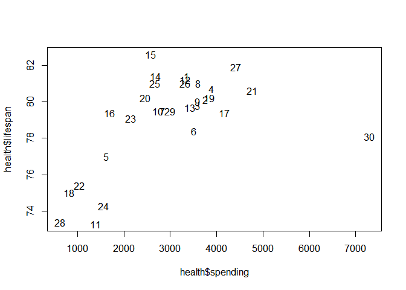

# 2.3 All graphs are comparisons

```r
health <- read.table("../../HealthExpenditure/data/healthdata.txt", header=TRUE)
health
```

```
##        country spending lifespan
## 1    Australia     3357     81.4
## 2      Austria     3763     80.1
## 3      Belgium     3595     79.8
## 4       Canada     3895     80.7
## 5        Czech     1626     77.0
## 6      Denmark     3512     78.4
## 7      Finland     2840     79.5
## 8       France     3601     81.0
## 9      Germany     3588     80.0
## 10      Greece     2727     79.5
## 11     Hungary     1388     73.3
## 12     Iceland     3319     81.2
## 13     Ireland     3424     79.7
## 14       Italy     2686     81.4
## 15       Japan     2581     82.6
## 16       Korea     1688     79.4
## 17  Luxembourg     4162     79.4
## 18      Mexico      823     75.0
## 19 Netherlands     3837     80.2
## 20   N.Zealand     2454     80.2
## 21      Norway     4763     80.6
## 22      Poland     1035     75.4
## 23    Portugal     2150     79.1
## 24    Slovakia     1555     74.3
## 25       Spain     2671     81.0
## 26      Sweden     3323     81.0
## 27 Switzerland     4417     81.9
## 28      Turkey      618     73.4
## 29          UK     2992     79.5
## 30         USA     7290     78.1
```

```r
country <- rownames(health)
plot(health$spending, health$lifespan, type="n")
text(health$spending, health$lifespan, country)
```

<!-- -->
