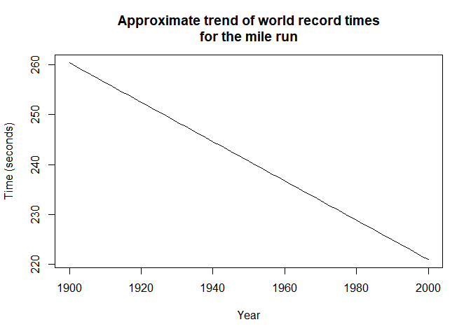

# 3.3 Graphing a line

```r
curve(1007 - 0.393*x, from=1900, to=2000, xlab="Year", ylab="Time (seconds)",
main="Approximate trend of world record times\nfor the mile run")
```

<!-- -->

# 3.5 Probability distributions

```r
curve(1007 - 0.393*x, from=1900, to=2000, xlab="Year", ylab="Time (seconds)",
main="Approximate trend of world record times\nfor the mile run")
```

<!-- -->
